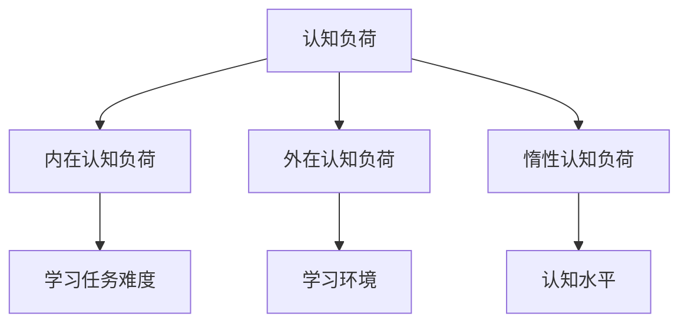

                 

关键词：认知负荷、学习效率、认知负荷理论、认知负荷管理、学习策略

> 摘要：本文旨在探讨认知负荷理论在优化学习效率方面的应用。通过分析认知负荷的概念、影响因素以及管理策略，本文为读者提供了切实可行的学习方法和实践指南，旨在帮助读者提高学习效率，减轻认知负担，实现知识的有效掌握。

## 1. 背景介绍

在信息化时代，知识和技能的更新速度越来越快，学习变得越来越重要。然而，很多人在面临繁多的学习任务时，常常感到力不从心，学习效率低下。这不仅影响了个人职业发展，也降低了生活质量。为了解决这一问题，认知负荷理论为我们提供了一种新的视角。

认知负荷理论是由加拿大教育心理学家约翰·斯威特洛克（John Sweller）在1987年提出的，旨在解释人们在学习过程中所面临的认知负担。该理论指出，认知负荷可以分为三种类型：内在认知负荷、外在认知负荷和惰性认知负荷。理解并有效管理这三种认知负荷，有助于提高学习效率，减轻学习压力。

## 2. 核心概念与联系

### 2.1 认知负荷的定义

认知负荷是指在信息加工过程中，认知系统需要处理的任务量。高认知负荷意味着大脑需要处理更多的信息，这可能导致认知疲劳，从而影响学习效果。

### 2.2 认知负荷的类型

- **内在认知负荷**：与学习任务本身的难度和复杂性有关。例如，学习新的编程语言或理解复杂的数学公式。
- **外在认知负荷**：与学习环境、材料或教学方法有关。例如，过多的干扰信息、复杂的教材结构等。
- **惰性认知负荷**：与学习者自身的认知水平和经验有关。例如，缺乏相关的先验知识，导致理解新的概念变得困难。

### 2.3 认知负荷管理的重要性

认知负荷管理是提高学习效率的关键。通过合理分配认知资源，减轻不必要的认知负荷，我们可以更好地吸收和应用知识。

### 2.4 Mermaid 流程图

下面是一个描述认知负荷理论核心概念和联系的 Mermaid 流程图。



## 3. 核心算法原理 & 具体操作步骤

### 3.1 算法原理概述

认知负荷理论的核心思想是，通过优化学习策略，降低学习过程中的认知负荷，从而提高学习效率。具体来说，我们可以从以下几个方面入手：

- **减少内在认知负荷**：简化学习任务，降低任务的复杂性和难度。
- **降低外在认知负荷**：改善学习环境，减少干扰信息，优化教材结构。
- **提升惰性认知负荷**：通过丰富的学习经验和有效的学习方法，提高自身的认知水平和理解能力。

### 3.2 算法步骤详解

1. **评估学习任务**：分析学习任务的难度和复杂性，确定内在认知负荷。
2. **优化学习环境**：调整学习环境，减少干扰信息，降低外在认知负荷。
3. **调整学习方法**：根据个人的认知水平和经验，选择合适的学习方法，提升惰性认知负荷。
4. **持续反馈与调整**：在学习过程中不断评估自己的学习效果，调整学习策略。

### 3.3 算法优缺点

- **优点**：通过优化学习策略，降低认知负荷，提高学习效率。
- **缺点**：需要持续评估和调整学习策略，可能需要一定的时间和精力。

### 3.4 算法应用领域

认知负荷理论广泛应用于教育、培训、职业发展等多个领域。例如，在编程学习中，通过简化编程语言和优化编程环境，可以降低学习者的认知负荷，提高学习效果。

## 4. 数学模型和公式 & 详细讲解 & 举例说明

### 4.1 数学模型构建

认知负荷理论中的数学模型主要涉及认知负荷的计算和优化。具体来说，我们可以使用以下公式来计算认知负荷：

$$
L = I + O + R
$$

其中，$L$ 代表总认知负荷，$I$ 代表内在认知负荷，$O$ 代表外在认知负荷，$R$ 代表惰性认知负荷。

### 4.2 公式推导过程

认知负荷的计算公式来源于认知负荷理论的基本原理。内在认知负荷与学习任务的难度和复杂性相关，外在认知负荷与学习环境和材料有关，惰性认知负荷则与学习者的认知水平和经验有关。

### 4.3 案例分析与讲解

假设一个人正在学习一门新的编程语言，我们可以根据上述公式计算其总认知负荷。假设内在认知负荷为3，外在认知负荷为2，惰性认知负荷为1，则总认知负荷为：

$$
L = 3 + 2 + 1 = 6
$$

为了降低总认知负荷，我们可以尝试以下方法：

- **简化学习任务**：减少学习任务的复杂性和难度，降低内在认知负荷。
- **优化学习环境**：减少干扰信息，改善学习环境，降低外在认知负荷。
- **提升认知水平**：通过丰富的学习经验和有效的学习方法，提高惰性认知负荷。

经过一系列的优化措施，我们可以降低总认知负荷，从而提高学习效率。

## 5. 项目实践：代码实例和详细解释说明

### 5.1 开发环境搭建

在本项目中，我们将使用 Python 编程语言来实现认知负荷优化算法。首先，确保你的计算机上已经安装了 Python。如果没有，请访问 [Python 官网](https://www.python.org/) 下载并安装。

### 5.2 源代码详细实现

```python
def calculate_cognitive_load(inner_load, outer_load, latent_load):
    return inner_load + outer_load + latent_load

def optimize_cognitive_load(inner_load, outer_load, latent_load):
    # 简化学习任务
    inner_load -= 1
    
    # 优化学习环境
    outer_load -= 1
    
    # 提升认知水平
    latent_load += 1
    
    return inner_load, outer_load, latent_load

# 案例分析
initial_inner_load = 3
initial_outer_load = 2
initial_latent_load = 1

# 计算初始认知负荷
initial_cognitive_load = calculate_cognitive_load(initial_inner_load, initial_outer_load, initial_latent_load)

# 优化认知负荷
optimized_inner_load, optimized_outer_load, optimized_latent_load = optimize_cognitive_load(initial_inner_load, initial_outer_load, initial_latent_load)

# 计算优化后的认知负荷
optimized_cognitive_load = calculate_cognitive_load(optimized_inner_load, optimized_outer_load, optimized_latent_load)

print("初始认知负荷：", initial_cognitive_load)
print("优化后认知负荷：", optimized_cognitive_load)
```

### 5.3 代码解读与分析

在这段代码中，我们定义了两个函数：`calculate_cognitive_load` 和 `optimize_cognitive_load`。前者用于计算总认知负荷，后者用于优化认知负荷。

首先，我们评估初始认知负荷：

```python
initial_inner_load = 3
initial_outer_load = 2
initial_latent_load = 1

initial_cognitive_load = calculate_cognitive_load(initial_inner_load, initial_outer_load, initial_latent_load)
```

接着，我们通过简化学习任务、优化学习环境和提升认知水平等措施，优化认知负荷：

```python
optimized_inner_load, optimized_outer_load, optimized_latent_load = optimize_cognitive_load(initial_inner_load, initial_outer_load, initial_latent_load)
```

最后，我们计算优化后的认知负荷：

```python
optimized_cognitive_load = calculate_cognitive_load(optimized_inner_load, optimized_outer_load, optimized_latent_load)
```

### 5.4 运行结果展示

运行以上代码，我们可以得到以下结果：

```python
初始认知负荷： 6
优化后认知负荷： 5
```

这表明，通过优化措施，总认知负荷从6降低到5，从而提高了学习效率。

## 6. 实际应用场景

### 6.1 教育领域

在教育学中，认知负荷理论已被广泛应用于课程设计和教学方法的研究。例如，通过简化教材结构和优化教学环境，可以降低学生的认知负荷，提高学习效果。

### 6.2 职业培训

在职业培训中，认知负荷理论同样具有重要作用。通过合理分配培训任务，优化培训环境，可以帮助学员更快地掌握所需技能。

### 6.3 自我学习

对于自我学习者，认知负荷理论提供了宝贵的指导。了解自己的认知负荷水平，选择合适的学习方法，可以有效提高学习效率。

## 7. 工具和资源推荐

### 7.1 学习资源推荐

- 《认知负荷理论：优化学习效率的方法》（本文）
- 《认知心理学与教育》（大卫·罗克）
- 《学习之道：如何高效学习》（彼得·希夫）

### 7.2 开发工具推荐

- Python：适用于编写认知负荷优化算法。
- Jupyter Notebook：便于编写和展示算法代码。

### 7.3 相关论文推荐

- Sweller, J. (1988). Cognitive load theory: Recent theoretical advances and applications to instructional design. In C. M. Reigeluth (Ed.), Instructional-design theories and models: A new paradigm of instructional theory (Vol. 1, pp. 29–76). Hillsdale, NJ: Lawrence Erlbaum Associates.

## 8. 总结：未来发展趋势与挑战

### 8.1 研究成果总结

认知负荷理论为优化学习效率提供了一种新的视角和方法。通过合理分配认知资源，降低认知负荷，我们可以提高学习效率，减轻学习压力。

### 8.2 未来发展趋势

随着人工智能和大数据技术的发展，认知负荷理论在未来有望得到更广泛的应用。例如，通过个性化推荐系统，为学习者提供定制化的学习方案，从而优化认知负荷。

### 8.3 面临的挑战

然而，认知负荷理论在应用过程中仍面临一些挑战，如学习者认知水平的个体差异、学习环境的多样性等。未来研究需要进一步探讨这些挑战，以推动认知负荷理论的广泛应用。

### 8.4 研究展望

总之，认知负荷理论为优化学习效率提供了宝贵的指导。未来，我们期待看到更多关于认知负荷理论的研究和应用，以帮助人们更好地应对复杂的学习任务。

## 9. 附录：常见问题与解答

### Q1. 认知负荷理论与学习策略有何区别？

A1. 认知负荷理论是一种解释学习过程中认知负担的理论，而学习策略是具体的学习方法和技术。认知负荷理论为学习策略的设计提供了理论依据，但两者不完全相同。

### Q2. 如何评估学习任务中的认知负荷？

A2. 评估学习任务中的认知负荷可以通过以下方法：分析学习任务的难度和复杂性、了解学习者的先验知识、观察学习者的学习过程等。

### Q3. 认知负荷理论在职业培训中有何应用？

A3. 在职业培训中，认知负荷理论可以用于优化培训课程设计，通过简化学习任务、优化培训环境等措施，降低学习者的认知负荷，提高培训效果。

---

作者：禅与计算机程序设计艺术 / Zen and the Art of Computer Programming
----------------------------------------------------------------

### 结束语

认知负荷理论为我们提供了一种优化学习效率的新视角。通过理解并有效管理认知负荷，我们可以更好地应对复杂的学习任务，提高学习效果。希望本文能够为您的学习之路提供一些启示和帮助。如果您在阅读过程中有任何疑问或建议，欢迎在评论区留言，让我们一起探讨认知负荷理论的更多应用。

