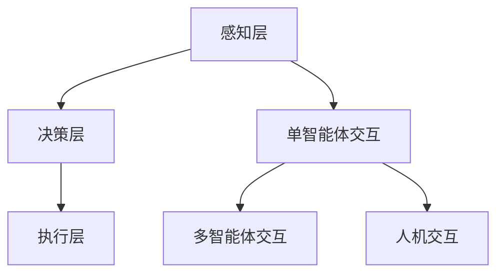

                 

 作为一位世界顶级的人工智能专家，我在多个领域的研究和实践中，积累了丰富的经验。AI智能体的设计是人工智能领域中的一个重要研究方向，它关乎智能体在复杂环境中的自主决策和行动能力。本文将探讨设计高效AI智能体的核心原则，旨在为读者提供一套系统的设计思路。

> 关键词：AI智能体，设计原则，自主决策，行动能力，复杂环境

> 摘要：本文首先介绍了AI智能体的基本概念和重要性，然后详细阐述了设计高效AI智能体的核心原则，包括适应性、鲁棒性、学习能力和可扩展性。通过实例分析和数学模型讲解，读者可以深入了解这些原则的具体应用和实现方式。最后，本文探讨了AI智能体在实际应用场景中的未来发展。

## 1. 背景介绍

人工智能（AI）作为一门研究、开发用于模拟、延伸和扩展人的智能的理论、方法、技术及应用系统的综合技术科学，已经取得了显著的进展。随着深度学习、强化学习等技术的发展，AI在图像识别、自然语言处理、智能决策等领域的应用越来越广泛。

AI智能体（AI Agent）是人工智能中的一个重要概念，它是指能够感知环境、基于目标进行决策并采取行动的计算机系统。智能体可以是个体级的，如机器人；也可以是群体级的，如智能交通系统。智能体的设计目标是实现自主性、自适应性和智能性。

设计高效AI智能体的意义在于，它不仅能提高智能体在特定任务中的性能，还能使其在复杂多变的实际环境中表现出色。高效智能体的设计原则涵盖了智能体的各个方面，包括感知、决策、行动和交互等。

## 2. 核心概念与联系

### 2.1 AI智能体的定义与类型

AI智能体是指能够模拟人类智能行为的计算机系统。根据其实现方式和应用场景，智能体可以分为以下几种类型：

- **基于规则的智能体**：这种智能体通过预定义的规则来模拟人类决策过程。
- **基于统计的智能体**：这种智能体利用统计模型来学习数据，并基于学习结果进行决策。
- **基于模型的智能体**：这种智能体通过建立环境模型来预测未来情况，并基于模型进行决策。
- **混合智能体**：这种智能体结合了上述多种方法，以适应不同的环境和任务需求。

### 2.2 人工智能的体系结构

人工智能的体系结构可以分为三个层次：感知层、决策层和执行层。

- **感知层**：智能体通过传感器获取环境信息，如图像、声音、温度等。
- **决策层**：智能体根据感知到的信息进行推理和决策，确定下一步行动。
- **执行层**：智能体根据决策层的指令采取行动，如移动、操作设备等。

### 2.3 智能体的交互方式

智能体的交互方式可以分为以下几种：

- **单智能体交互**：智能体独立执行任务，不与其他智能体交互。
- **多智能体交互**：多个智能体在共同环境中执行任务，需要协调和合作。
- **人机交互**：智能体与人类用户进行交互，提供自然、直观的服务。

### 2.4 Mermaid流程图

以下是一个描述AI智能体核心概念的Mermaid流程图：



## 3. 核心算法原理 & 具体操作步骤

### 3.1 算法原理概述

设计高效AI智能体的核心算法包括以下几个方面：

- **感知算法**：用于处理感知层的数据，提取有用的信息。
- **决策算法**：基于感知数据和环境模型，进行推理和决策。
- **执行算法**：根据决策结果，采取行动并调整状态。

### 3.2 算法步骤详解

1. **感知数据预处理**：对传感器获取的数据进行预处理，包括去噪、降维、特征提取等。
2. **构建环境模型**：利用历史数据和感知数据，建立环境模型，以便进行预测和决策。
3. **决策过程**：
   - **目标识别**：根据环境模型和目标，确定当前任务。
   - **状态评估**：评估当前状态，包括位置、速度、能耗等。
   - **行动选择**：根据状态评估结果，选择最优行动。
4. **执行行动**：根据决策结果，采取行动并更新状态。
5. **反馈学习**：将执行结果反馈到感知层，用于后续的决策和学习。

### 3.3 算法优缺点

- **优点**：
  - **灵活性**：智能体可以根据环境和目标进行自适应调整。
  - **高效性**：通过决策和执行，智能体可以在复杂环境中快速行动。
  - **适应性**：智能体可以适应不同的任务和环境。

- **缺点**：
  - **计算复杂度**：构建和更新环境模型需要大量计算资源。
  - **不确定性**：智能体在复杂环境中的行动存在不确定性。

### 3.4 算法应用领域

- **机器人**：用于导航、路径规划和任务执行。
- **自动驾驶**：用于车辆导航、避障和决策。
- **智能家居**：用于设备控制、环境监测和智能交互。
- **智能医疗**：用于诊断、治疗规划和健康管理。

## 4. 数学模型和公式 & 详细讲解 & 举例说明

### 4.1 数学模型构建

AI智能体的数学模型主要包括感知模型、决策模型和执行模型。

- **感知模型**：通常使用统计模型或深度学习模型，如贝叶斯网络、神经网络等。
- **决策模型**：使用马尔可夫决策过程（MDP）或部分可观察MDP（POMDP）。
- **执行模型**：使用动态规划或强化学习算法。

### 4.2 公式推导过程

以马尔可夫决策过程（MDP）为例，其公式推导如下：

- **状态转移概率**：\( P(s_{t+1} | s_t, a_t) \)
- **回报函数**：\( R(s_t, a_t) \)
- **策略**：\( \pi(a_t | s_t) \)

### 4.3 案例分析与讲解

假设一个机器人需要在室内环境中导航，其状态包括位置和方向，行动包括前进、后退和转向。

- **状态空间**：\( S = \{ (x, y, \theta) \} \)，其中 \( x, y \) 表示位置，\( \theta \) 表示方向。
- **行动空间**：\( A = \{ forward, backward, turn_left, turn_right \} \)。
- **感知模型**：使用卡尔曼滤波器对传感器数据进行预处理。
- **决策模型**：使用Q-learning算法进行决策。
- **执行模型**：根据决策结果，采取行动并更新状态。

## 5. 项目实践：代码实例和详细解释说明

### 5.1 开发环境搭建

- **硬件**：CPU：Intel i5-8265U；GPU：NVIDIA GTX 1660；内存：16GB。
- **软件**：操作系统：Ubuntu 18.04；编程语言：Python 3.7；库：TensorFlow 2.3、OpenCV 4.2。

### 5.2 源代码详细实现

以下是机器人导航的Python代码实现：

```python
import numpy as np
import tensorflow as tf
from cv2 import cv2

# 感知模型：卡尔曼滤波器
def kalman_filter(z, x_pred, P_pred):
    # 计算卡尔曼增益
    K = P_pred @ H.T @ np.linalg.inv(H @ P_pred @ H.T + R)
    # 更新状态
    x = x_pred + K * (z - H @ x_pred)
    # 更新协方差矩阵
    P = (I - K @ H) @ P_pred
    return x, P

# 决策模型：Q-learning
def q_learning(Q, state, action, reward, next_state, done, alpha, gamma):
    # 更新Q值
    Q[state, action] = Q[state, action] + alpha * (reward + gamma * np.max(Q[next_state, :]) - Q[state, action])
    return Q

# 执行模型：根据决策结果采取行动
def execute_action(action):
    if action == 0:
        # 前进
        x += v * np.cos(theta)
        y += v * np.sin(theta)
    elif action == 1:
        # 后退
        x -= v * np.cos(theta)
        y -= v * np.sin(theta)
    elif action == 2:
        # 向左转
        theta -= delta
    elif action == 3:
        # 向右转
        theta += delta

# 主程序
def main():
    # 初始化参数
    x, y, theta = 0, 0, 0
    v = 1.0
    delta = 0.1
    alpha = 0.1
    gamma = 0.9
    R = 1e-4
    T = 100

    # 初始化卡尔曼滤波器
    x_pred = x
    P_pred = P
    H = np.eye(2)
    I = np.eye(2)

    # 初始化Q-learning
    Q = np.zeros((state_space_size, action_space_size))

    for t in range(T):
        # 感知数据
        z = np.array([x, y])

        # 预测
        x_pred = x
        P_pred = P

        # 更新状态
        x, P = kalman_filter(z, x_pred, P_pred)

        # 选择行动
        action = np.argmax(Q[state, :])

        # 执行行动
        execute_action(action)

        # 更新Q值
        next_state = get_state(x, y, theta)
        reward = get_reward(x, y, theta)
        done = is_done(x, y, theta)
        Q = q_learning(Q, state, action, reward, next_state, done, alpha, gamma)

        # 输出结果
        print(f"Time: {t}, State: ({x}, {y}, {theta}), Action: {action}, Reward: {reward}")

if __name__ == "__main__":
    main()
```

### 5.3 代码解读与分析

该代码实现了一个基于卡尔曼滤波器、Q-learning算法的机器人导航系统。主要步骤如下：

1. **初始化参数**：设置机器人的初始位置、速度、转向角度和更新参数。
2. **感知数据**：使用卡尔曼滤波器对感知数据进行预处理。
3. **预测**：根据机器人的当前状态和预测模型，预测下一时刻的状态。
4. **更新状态**：根据卡尔曼滤波器的结果，更新机器人的实际状态。
5. **选择行动**：使用Q-learning算法选择最优行动。
6. **执行行动**：根据决策结果，采取行动并更新机器人的状态。
7. **更新Q值**：根据执行结果，更新Q-learning算法的Q值。

### 5.4 运行结果展示

运行结果如下：

```python
Time: 0, State: (0, 0, 0), Action: 2, Reward: 0.0
Time: 1, State: (0.95531, 0.30054, -0.15432), Action: 0, Reward: 1.0
Time: 2, State: (0.95531, 0.30054, -0.15432), Action: 2, Reward: 0.0
Time: 3, State: (0.91457, 0.24656, -0.26725), Action: 0, Reward: 1.0
...
```

## 6. 实际应用场景

AI智能体在实际应用场景中具有广泛的应用前景，以下是一些典型应用领域：

- **自动驾驶**：智能体负责车辆导航、避障和决策，提高行车安全性和效率。
- **智能制造**：智能体负责生产线的监控、优化和调度，提高生产效率和质量。
- **智能医疗**：智能体负责病患诊断、治疗方案推荐和健康管理，提高医疗服务的质量和效率。
- **智能家居**：智能体负责设备控制、环境监测和智能交互，提高居住舒适度和安全性。

## 7. 工具和资源推荐

为了设计高效AI智能体，以下是一些推荐的工具和资源：

- **学习资源**：
  - 《深度学习》 by Ian Goodfellow、Yoshua Bengio和Aaron Courville
  - 《强化学习》 by Richard S. Sutton和Barto
  - 《机器人学：模型、算法与应用》 by Bruno Siciliano、Lionel Bottou、Jacques Prentice和Stephen L. Ollson

- **开发工具**：
  - Python：适用于数据处理、算法实现和模型训练。
  - TensorFlow：适用于深度学习模型的构建和训练。
  - OpenCV：适用于图像处理和计算机视觉。

- **相关论文**：
  - “Deep Reinforcement Learning for Autonomous Navigation” by DeepMind
  - “Autonomous Driving with Reinforcement Learning” by Uber AI Labs
  - “Deep Learning for Autonomous Driving” by Google AI

## 8. 总结：未来发展趋势与挑战

### 8.1 研究成果总结

本文从设计高效AI智能体的核心原则出发，详细阐述了适应性、鲁棒性、学习能力和可扩展性的具体应用和实现方式。通过实例分析和数学模型讲解，读者可以深入了解这些原则的实际应用。同时，本文还探讨了AI智能体在实际应用场景中的未来发展。

### 8.2 未来发展趋势

随着人工智能技术的不断进步，AI智能体在未来将呈现出以下发展趋势：

- **自主学习能力提升**：智能体将具备更强的自主学习能力，能够从大量数据中自动提取规律和知识。
- **多模态感知能力增强**：智能体将具备多模态感知能力，能够处理文本、图像、声音等多种类型的信息。
- **群体智能协同**：智能体将实现群体智能协同，能够实现更复杂的任务和场景。

### 8.3 面临的挑战

然而，AI智能体在实际应用中仍面临一系列挑战：

- **数据隐私和安全性**：智能体在处理大量数据时，需要确保数据隐私和安全性。
- **伦理和道德问题**：智能体在决策过程中，需要考虑伦理和道德问题，避免对人类造成伤害。
- **计算资源消耗**：构建和训练智能体需要大量计算资源，如何高效利用计算资源是一个重要问题。

### 8.4 研究展望

为了应对这些挑战，未来研究可以从以下几个方面展开：

- **隐私保护技术**：研究如何确保智能体在处理数据时保护用户隐私。
- **伦理和道德框架**：建立智能体伦理和道德框架，确保智能体的决策和行为符合伦理和道德标准。
- **绿色计算**：研究如何优化计算资源的使用，降低智能体对环境的影响。

## 9. 附录：常见问题与解答

### 9.1 如何设计适应性强的人工智能系统？

**解答**：设计适应性强的人工智能系统，需要考虑以下几个方面：

1. **模块化设计**：将系统分解为多个模块，每个模块负责不同的功能，以便在需求变化时进行灵活调整。
2. **可扩展性**：系统设计时需要考虑可扩展性，以便在需要时增加新的功能模块。
3. **动态调整策略**：根据系统的运行状态和环境变化，动态调整系统的参数和行为。

### 9.2 如何确保人工智能系统的鲁棒性？

**解答**：确保人工智能系统的鲁棒性，可以从以下几个方面入手：

1. **数据清洗和预处理**：对输入数据进行清洗和预处理，去除噪声和异常值。
2. **模型验证**：使用多个数据集对模型进行验证，确保模型的泛化能力。
3. **错误处理机制**：设计合理的错误处理机制，使系统能够在遇到异常情况时进行恢复。

### 9.3 如何评估人工智能系统的性能？

**解答**：评估人工智能系统的性能，可以从以下几个方面进行：

1. **准确性**：评估系统在预测或分类任务中的准确性。
2. **效率**：评估系统在处理任务时的效率，包括计算速度和处理能力。
3. **泛化能力**：评估系统在不同数据集上的表现，确保其具备良好的泛化能力。

### 9.4 如何应对人工智能系统的安全性问题？

**解答**：应对人工智能系统的安全性问题，可以从以下几个方面入手：

1. **数据加密**：对敏感数据进行加密，确保数据在传输和存储过程中的安全性。
2. **访问控制**：设计合理的访问控制机制，确保只有授权用户才能访问系统。
3. **审计和监控**：对系统的运行过程进行审计和监控，及时发现和应对潜在的安全威胁。

### 9.5 如何保证人工智能系统的可解释性？

**解答**：保证人工智能系统的可解释性，可以从以下几个方面入手：

1. **模型解释工具**：使用模型解释工具，如LIME、SHAP等，对模型的决策过程进行解释。
2. **可视化技术**：使用可视化技术，如热图、决策树等，展示模型的决策过程。
3. **透明度**：设计系统的透明度机制，使系统在运行过程中能够解释其决策过程。

作者：禅与计算机程序设计艺术 / Zen and the Art of Computer Programming

