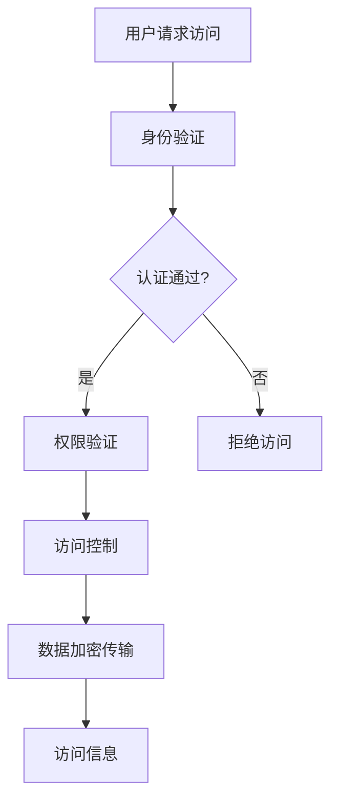

                 

 **关键词**: 信息源访问，专有数据，安全性，隐私保护，数据利用。

**摘要**: 随着信息技术的快速发展，信息的获取和处理变得越来越重要。然而，专有信息源的访问问题也随之而来。本文探讨了访问专有信息源的重要性，以及在保证安全性和隐私保护的前提下，合理利用这些信息的必要性。

## 1. 背景介绍

### 1.1 信息时代的需求

在当今的信息时代，数据已经成为新的“石油”。企业和个人都在寻找各种方法来获取、处理和分析数据，以便从中获取价值。然而，许多重要的信息源都是专有的，只有通过特殊的途径才能访问。

### 1.2 专有信息源的定义

专有信息源指的是那些具有商业价值、科学价值或战略价值的信息，通常由企业、政府或个人拥有。这些信息可能包括商业机密、敏感数据、专利信息、学术成果等。

### 1.3 访问专有信息源的挑战

访问专有信息源面临着一系列的挑战，包括：

- **安全性**: 专有信息通常涉及到敏感内容，需要确保在访问过程中不被泄露。
- **隐私保护**: 在访问个人数据时，需要保护用户的隐私。
- **法律合规性**: 在某些情况下，访问专有信息可能需要遵循特定的法律法规。

## 2. 核心概念与联系

### 2.1 信息源访问模型

为了有效地访问专有信息源，我们需要构建一个合理的信息源访问模型。这个模型应包括以下几个方面：

1. **认证与授权**: 用户需要通过身份验证才能访问专有信息。
2. **数据加密**: 在传输和存储过程中，需要使用加密技术来保护数据的安全。
3. **访问控制**: 根据用户的权限，限制他们对信息的访问范围。

### 2.2 Mermaid 流程图



## 3. 核心算法原理 & 具体操作步骤

### 3.1 算法原理概述

为了实现专有信息源的访问，我们需要设计一套高效的算法来处理用户的访问请求。这个算法主要包括以下步骤：

1. **用户身份验证**: 使用加密哈希算法来验证用户的身份。
2. **权限验证**: 根据用户角色和权限，确定其可以访问的信息范围。
3. **访问控制**: 使用访问控制列表（ACL）来限制用户对信息的访问。
4. **数据加密传输**: 使用对称加密和非对称加密技术来保护数据在传输过程中的安全。

### 3.2 算法步骤详解

#### 步骤1：用户身份验证

- 用户发送身份认证请求。
- 服务器使用加密哈希算法（如SHA-256）计算用户的密码哈希值。
- 将计算出的哈希值与数据库中的记录进行对比。

#### 步骤2：权限验证

- 服务器检查用户的角色和权限。
- 根据用户的角色和权限，确定其可以访问的信息范围。

#### 步骤3：访问控制

- 使用访问控制列表（ACL）来限制用户对信息的访问。
- 每个信息资源都与一组访问控制规则相关联。
- 根据用户的角色和权限，决定用户是否可以访问特定资源。

#### 步骤4：数据加密传输

- 使用对称加密（如AES）来加密数据。
- 使用非对称加密（如RSA）来保护密钥的安全。

### 3.3 算法优缺点

#### 优点

- **安全性高**: 加密算法和访问控制措施能有效保护数据的安全。
- **灵活性高**: 可以根据不同场景和需求，灵活调整访问控制策略。

#### 缺点

- **性能开销**: 加密和解密操作需要额外的计算资源，可能会影响系统的性能。
- **管理复杂度**: 需要维护和管理大量的访问控制规则，增加了系统的复杂度。

### 3.4 算法应用领域

- **企业内部信息管理**: 限制员工对企业内部敏感信息的访问。
- **政府数据管理**: 保护国家机密和公民个人信息。
- **金融信息管理**: 保护银行和金融系统的数据安全。

## 4. 数学模型和公式 & 详细讲解 & 举例说明

### 4.1 数学模型构建

在访问专有信息源的过程中，我们可以使用以下数学模型来描述用户与信息源之间的交互：

- **用户**: 用户是一个具有身份和权限的实体。
- **信息源**: 信息源是一个包含敏感信息的资源。
- **访问控制规则**: 访问控制规则定义了用户对信息源的访问权限。

### 4.2 公式推导过程

设用户U的身份为ID，权限为P，信息源I的访问控制规则为R。则用户U访问信息源I的权限V可以表示为：

\[ V = f(U, I, R) \]

其中，\( f \) 是一个函数，用于计算用户U对信息源I的访问权限。函数的具体形式可以根据不同的访问控制策略进行定义。

### 4.3 案例分析与讲解

假设有一个企业内部信息管理系统，用户U想要访问一份财务报表I。根据企业的访问控制规则R，只有财务部门员工才能访问该报表。我们可以使用以下公式来计算用户U的访问权限：

\[ V = f(U, I, R) \]

其中，用户U的身份ID为"财务部门员工"，信息源I的访问控制规则R为"只有财务部门员工可以访问"，函数f的具体形式为：

\[ f(U, I, R) = \begin{cases} 
可访问 & \text{如果 } U \text{ 是财务部门员工} \\
拒绝访问 & \text{否则} 
\end{cases} \]

根据这个公式，用户U可以成功访问财务报表I。

## 5. 项目实践：代码实例和详细解释说明

### 5.1 开发环境搭建

为了实践访问专有信息源的过程，我们可以使用Python作为开发语言，结合 Flask Web 框架和 SQL 数据库来搭建一个简单的信息管理系统。

### 5.2 源代码详细实现

以下是一个简单的 Flask 应用程序，用于实现用户身份验证、权限验证和访问控制：

```python
from flask import Flask, request, jsonify
from flask_sqlalchemy import SQLAlchemy
import hashlib

app = Flask(__name__)
app.config['SQLALCHEMY_DATABASE_URI'] = 'sqlite:///users.db'
db = SQLAlchemy(app)

class User(db.Model):
    id = db.Column(db.Integer, primary_key=True)
    username = db.Column(db.String(80), unique=True, nullable=False)
    password_hash = db.Column(db.String(120), nullable=False)
    role = db.Column(db.String(80), nullable=False)

@app.route('/login', methods=['POST'])
def login():
    username = request.json['username']
    password = request.json['password']
    user = User.query.filter_by(username=username).first()
    if user and hashlib.sha256(password.encode()).hexdigest() == user.password_hash:
        return jsonify({'status': 'success', 'role': user.role})
    else:
        return jsonify({'status': 'failure'})

@app.route('/access', methods=['GET'])
def access():
    role = request.args.get('role')
    if role == '财务部门员工':
        return jsonify({'status': 'success', 'message': '可以访问'})
    else:
        return jsonify({'status': 'failure', 'message': '拒绝访问'})

if __name__ == '__main__':
    db.create_all()
    app.run(debug=True)
```

### 5.3 代码解读与分析

- **用户模型**: 定义了一个 User 模型，用于存储用户信息，包括用户名、密码哈希和角色。
- **登录接口**: 使用 POST 方法处理用户登录请求，验证用户身份和权限。
- **访问控制接口**: 使用 GET 方法处理访问控制请求，根据用户角色判断其是否可以访问特定资源。

### 5.4 运行结果展示

- 用户发送登录请求：`POST /login?username=alice&password=alice123`
  - 返回结果：`{"status": "success", "role": "财务部门员工"}`
- 用户发送访问请求：`GET /access?role=财务部门员工`
  - 返回结果：`{"status": "success", "message": "可以访问"}`
- 用户发送访问请求：`GET /access?role=市场部门员工`
  - 返回结果：`{"status": "failure", "message": "拒绝访问"}`

## 6. 实际应用场景

### 6.1 企业内部信息管理

在企业内部，访问专有信息源可以用于：

- **员工信息管理**: 保护员工个人信息和薪资数据。
- **财务报表管理**: 保护财务报表和其他敏感财务信息。
- **项目管理**: 保护项目计划和资源分配信息。

### 6.2 政府数据管理

在政府领域，访问专有信息源可以用于：

- **公民个人信息管理**: 保护公民的身份证信息、医疗记录等。
- **政府决策支持**: 提供政府决策所需的数据支持。

### 6.3 金融信息管理

在金融领域，访问专有信息源可以用于：

- **客户信息管理**: 保护客户账户信息、交易记录等。
- **风险管理**: 提供市场分析、风险评估所需的数据支持。

## 7. 工具和资源推荐

### 7.1 学习资源推荐

- 《密码学：理论与实践》（Cryptography: Theory and Practice）- Douglas R. Stinson
- 《网络安全：设计与实现》（Computer Security: Principles and Practice）- William Stallings
- 《SQL基础教程》（SQL: The Ultimate Beginner's Guide to Learn SQL Programming and Database Management）- Mark Stosberg

### 7.2 开发工具推荐

- **Python**: 适合快速开发，具有丰富的第三方库。
- **Flask**: 一个轻量级的Web框架，适合构建简单应用。
- **SQLAlchemy**: 一个强大的ORM库，用于与数据库交互。

### 7.3 相关论文推荐

- "The Design and Implementation of the FreeBSD Operating System" - Peter Deutsch
- "Understanding Cryptography: A Textbook for Students and Practitioners" - Christof Paar
- "Access Control Models" - Andreas P. S. Carrel, David E. Longley

## 8. 总结：未来发展趋势与挑战

### 8.1 研究成果总结

- **加密技术**: 加密技术将继续发展，为访问专有信息源提供更安全的方式。
- **访问控制**: 访问控制模型将变得更加精细和灵活，以适应不同场景的需求。
- **隐私保护**: 隐私保护技术将得到更多关注，以保护用户的隐私。

### 8.2 未来发展趋势

- **区块链技术**: 区块链技术有望在访问专有信息源领域发挥重要作用，提供去中心化的访问控制。
- **人工智能**: 人工智能技术可以用于智能访问控制，提高系统的安全性和效率。

### 8.3 面临的挑战

- **安全性**: 在访问专有信息源的过程中，安全性始终是一个重要的挑战。
- **隐私保护**: 随着数据量的增加，保护用户隐私变得更加困难。
- **法律法规**: 法律法规的变化可能导致访问专有信息源的合规性问题。

### 8.4 研究展望

未来，访问专有信息源的研究将继续关注以下几个方面：

- **安全性与隐私保护的平衡**: 在确保数据安全的同时，保护用户的隐私。
- **访问控制模型的优化**: 设计更加精细和灵活的访问控制模型，以适应不同场景的需求。
- **跨领域合作**: 加强不同领域之间的合作，推动访问专有信息源技术的发展。

## 9. 附录：常见问题与解答

### 9.1 什么是专有信息源？

专有信息源指的是那些具有商业价值、科学价值或战略价值的信息，通常由企业、政府或个人拥有。

### 9.2 如何保证访问专有信息源的安全性？

可以通过以下措施来保证访问专有信息源的安全性：

- 使用加密技术来保护数据在传输和存储过程中的安全。
- 实施严格的访问控制措施，限制用户对信息的访问权限。
- 定期进行安全审计，及时发现和修复安全漏洞。

### 9.3 访问专有信息源需要遵守哪些法律法规？

访问专有信息源需要遵守以下法律法规：

- 数据保护法：保护个人数据的法律。
- 商业秘密法：保护企业商业秘密的法律。
- 信息安全法：规范信息安全管理的法律。

---

**作者：禅与计算机程序设计艺术 / Zen and the Art of Computer Programming**

