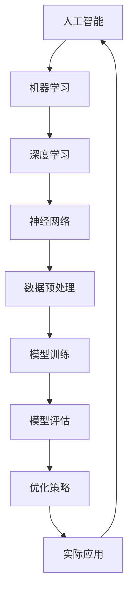

                 

关键词：人工智能评估，系统评估标准，AI性能指标，评估方法，技术框架，深度学习，机器学习，神经网络，算法分析，模型验证，工程实践

## 摘要

随着人工智能技术的迅速发展，AI系统的评估变得越来越重要。然而，当前的评估标准和方法存在诸多问题，无法全面、准确地反映AI系统的性能和可靠性。本文旨在探讨建立新的AI系统评估标准与方法，包括核心概念、评估算法、数学模型、实践应用等方面，以期为AI系统的研发、应用和优化提供有力支持。本文将结合实际项目案例，深入分析AI系统的评估流程、关键指标和优化策略，为相关从业人员提供有价值的参考。

## 1. 背景介绍

人工智能（AI）作为计算机科学的一个重要分支，近年来取得了飞速发展。从传统的符号推理、知识表示，到现代的机器学习和深度学习，AI技术已经广泛应用于图像识别、自然语言处理、自动驾驶、医疗诊断等领域。随着AI技术的普及，越来越多的企业和研究机构开始关注AI系统的性能评估问题。

然而，当前AI系统的评估标准和方法并不统一，存在诸多问题。首先，不同的评估指标和算法往往无法全面、准确地反映AI系统的性能。例如，在图像识别任务中，常见的评估指标有准确率、召回率、F1分数等，但这些指标往往只能反映系统的部分性能。其次，评估方法的选择和实施过程缺乏系统性，容易导致评估结果不准确。此外，现有评估标准往往过于侧重于理论分析，而忽略了实际应用场景中的复杂性和挑战性。

因此，建立一套新的AI系统评估标准与方法显得尤为重要。这不仅有助于提高AI系统的性能和可靠性，还能为AI技术的研发、应用和推广提供有力支持。本文将从核心概念、评估算法、数学模型、实践应用等方面对AI系统评估进行深入探讨，以期为相关领域的研究和工程实践提供有益参考。

## 2. 核心概念与联系

在探讨AI系统评估之前，首先需要了解一些核心概念和它们之间的联系。以下是一个用Mermaid绘制的流程图，展示了这些概念之间的相互关系。



### 2.1 人工智能

人工智能（AI）是一门研究、开发和应用使计算机模拟人类智能行为的技术的科学。它包括多个子领域，如机器学习、自然语言处理、计算机视觉等。AI的核心目标是使计算机具有自主学习和推理的能力，从而解决复杂问题。

### 2.2 机器学习

机器学习（ML）是AI的一个重要分支，它通过利用数据训练模型，使计算机自动地从数据中学习规律和模式。机器学习方法可以分为监督学习、无监督学习和强化学习等。

### 2.3 深度学习

深度学习（DL）是机器学习的一个子领域，它利用多层神经网络（如图神经网络、卷积神经网络等）进行数据建模和特征提取。深度学习在图像识别、语音识别和自然语言处理等领域取得了显著成果。

### 2.4 神经网络

神经网络（NN）是一种模拟生物神经系统的计算模型，由大量简单的人工神经元组成。神经网络通过前向传播和反向传播算法，实现数据的输入、输出和误差修正。

### 2.5 数据预处理

数据预处理是机器学习和深度学习中的关键步骤，包括数据的清洗、归一化、降维等。数据预处理的质量直接影响模型的性能和训练时间。

### 2.6 模型训练

模型训练是机器学习和深度学习的核心步骤，通过不断调整模型参数，使模型在训练数据上达到最优性能。训练过程通常包括数据读取、前向传播、反向传播和参数更新等。

### 2.7 模型评估

模型评估是判断模型性能的重要环节，常用的评估指标包括准确率、召回率、F1分数等。评估方法包括交叉验证、网格搜索等。

### 2.8 优化策略

优化策略用于提高模型性能和减少训练时间，常用的优化方法包括梯度下降、随机梯度下降、Adam优化器等。

### 2.9 实际应用

实际应用是将训练好的模型应用于实际问题的过程，包括数据收集、模型部署、性能监控等。

通过上述核心概念和联系的理解，我们可以更好地把握AI系统评估的各个方面。在接下来的章节中，我们将深入探讨AI系统评估的算法原理、数学模型、实践应用等。

## 3. 核心算法原理 & 具体操作步骤

### 3.1 算法原理概述

AI系统评估的核心算法主要包括以下几个方面：

1. **性能评估算法**：用于评估模型在测试集上的性能，常用的算法有准确率、召回率、F1分数等。
2. **可靠性评估算法**：用于评估模型的稳定性和可靠性，常用的算法有鲁棒性测试、异常检测等。
3. **效率评估算法**：用于评估模型在计算资源和时间成本上的表现，常用的算法有模型压缩、量化等。
4. **泛化能力评估算法**：用于评估模型对新数据的适应能力，常用的算法有交叉验证、跨领域评估等。

### 3.2 算法步骤详解

#### 3.2.1 性能评估算法

1. **准确率（Accuracy）**：准确率是指模型正确预测的样本数占总样本数的比例。计算公式为：

   $$\text{Accuracy} = \frac{\text{正确预测的样本数}}{\text{总样本数}}$$

2. **召回率（Recall）**：召回率是指模型正确预测的阳性样本数占总阳性样本数的比例。计算公式为：

   $$\text{Recall} = \frac{\text{正确预测的阳性样本数}}{\text{总阳性样本数}}$$

3. **F1分数（F1 Score）**：F1分数是准确率和召回率的加权平均，用于综合评估模型的性能。计算公式为：

   $$\text{F1 Score} = 2 \times \frac{\text{准确率} \times \text{召回率}}{\text{准确率} + \text{召回率}}$$

#### 3.2.2 可靠性评估算法

1. **鲁棒性测试（Robustness Testing）**：通过在模型输入中引入噪声、扰动等，评估模型对这些异常数据的处理能力。

2. **异常检测（Anomaly Detection）**：通过检测数据中的异常点，评估模型的鲁棒性和稳定性。

#### 3.2.3 效率评估算法

1. **模型压缩（Model Compression）**：通过减少模型参数数量，降低模型的复杂度，提高计算效率。

2. **量化（Quantization）**：通过将模型参数的精度降低到低比特数，减少模型的存储和计算需求。

#### 3.2.4 泛化能力评估算法

1. **交叉验证（Cross-Validation）**：通过将数据集划分为训练集和验证集，多次训练和评估模型，评估模型在未知数据上的性能。

2. **跨领域评估（Cross-Domain Evaluation）**：通过在不同领域的数据上评估模型，评估模型对不同领域数据的适应性。

### 3.3 算法优缺点

1. **性能评估算法**：优点在于能够直观地反映模型在特定任务上的表现，缺点是过于依赖测试集的质量和大小，容易受到数据分布的影响。
2. **可靠性评估算法**：优点在于能够评估模型的鲁棒性和稳定性，缺点是评估过程较为复杂，需要大量的计算资源。
3. **效率评估算法**：优点在于能够提高模型在计算资源和时间成本上的表现，缺点是可能会牺牲模型的性能。
4. **泛化能力评估算法**：优点在于能够评估模型对新数据的适应能力，缺点是评估过程较为复杂，需要大量的数据。

### 3.4 算法应用领域

1. **性能评估算法**：广泛应用于各种机器学习和深度学习任务，如图像识别、自然语言处理、医疗诊断等。
2. **可靠性评估算法**：广泛应用于自动驾驶、机器人、金融风控等对可靠性要求较高的领域。
3. **效率评估算法**：广泛应用于移动端和嵌入式设备上的模型优化和压缩。
4. **泛化能力评估算法**：广泛应用于跨领域研究、迁移学习等。

通过以上核心算法原理和具体操作步骤的介绍，我们可以更好地理解AI系统评估的各个方面。在接下来的章节中，我们将进一步探讨AI系统的数学模型和公式，以及实际应用场景中的案例分析。

## 4. 数学模型和公式 & 详细讲解 & 举例说明

在AI系统评估过程中，数学模型和公式起着至关重要的作用。它们不仅能够量化模型的性能，还能帮助研究者理解和分析模型的行为。以下我们将详细讲解一些常见的数学模型和公式，并通过实际案例进行分析。

### 4.1 数学模型构建

AI系统评估的数学模型通常可以分为以下几个部分：

1. **损失函数（Loss Function）**：损失函数用于衡量模型预测值与真实值之间的差异，常见的损失函数有均方误差（MSE）、交叉熵（Cross-Entropy）等。
2. **评估指标（Evaluation Metrics）**：评估指标用于衡量模型在不同任务上的表现，如准确率、召回率、F1分数等。
3. **优化算法（Optimization Algorithms）**：优化算法用于调整模型参数，使模型在训练过程中达到最优性能，常见的优化算法有梯度下降（Gradient Descent）、Adam优化器等。

### 4.2 公式推导过程

以下是一些常见公式的推导过程：

#### 4.2.1 均方误差（MSE）

均方误差是用于回归问题的一种常见损失函数，其公式为：

$$\text{MSE} = \frac{1}{n} \sum_{i=1}^{n} (\hat{y}_i - y_i)^2$$

其中，$\hat{y}_i$表示第$i$个样本的预测值，$y_i$表示第$i$个样本的真实值，$n$表示样本数量。

#### 4.2.2 交叉熵（Cross-Entropy）

交叉熵是用于分类问题的一种常见损失函数，其公式为：

$$\text{Cross-Entropy} = -\frac{1}{n} \sum_{i=1}^{n} y_i \log (\hat{y}_i)$$

其中，$y_i$表示第$i$个样本的真实标签，$\hat{y}_i$表示第$i$个样本的预测概率。

#### 4.2.3 优化算法（梯度下降）

梯度下降是一种常用的优化算法，其核心思想是沿着损失函数的梯度方向更新模型参数，以最小化损失函数。梯度下降的更新公式为：

$$\theta_{\text{new}} = \theta_{\text{old}} - \alpha \cdot \nabla_{\theta} J(\theta)$$

其中，$\theta$表示模型参数，$\alpha$表示学习率，$J(\theta)$表示损失函数。

### 4.3 案例分析与讲解

以下通过一个实际案例，详细讲解数学模型在AI系统评估中的应用。

#### 4.3.1 案例背景

假设我们有一个分类问题，需要训练一个模型对图像进行分类。训练数据集包含1000张图像，标签为猫或狗。我们使用卷积神经网络（CNN）作为分类模型，并采用交叉熵作为损失函数。

#### 4.3.2 模型训练

在模型训练过程中，我们首先通过前向传播计算预测概率，然后通过交叉熵计算损失函数。具体的训练步骤如下：

1. **前向传播**：输入图像，通过CNN模型计算输出预测概率。
2. **计算损失**：使用交叉熵损失函数计算预测概率与真实标签之间的差异。
3. **反向传播**：根据损失函数的梯度，更新模型参数。
4. **重复迭代**：重复前向传播、计算损失和反向传播，直到模型收敛。

#### 4.3.3 模型评估

在模型训练完成后，我们需要对模型进行评估，以判断其性能。具体的评估步骤如下：

1. **测试集评估**：使用测试集数据对模型进行评估，计算准确率、召回率、F1分数等评估指标。
2. **交叉验证**：通过交叉验证方法，评估模型在不同数据集上的表现，以判断模型的泛化能力。
3. **模型优化**：根据评估结果，调整模型参数，优化模型性能。

通过以上案例，我们可以看到数学模型在AI系统评估中的应用。通过合理选择和调整数学模型，可以有效地评估和优化AI系统的性能。

## 5. 项目实践：代码实例和详细解释说明

### 5.1 开发环境搭建

在开始编写代码之前，我们需要搭建一个适合AI系统评估的开发环境。以下是一个基本的开发环境搭建步骤：

1. **安装Python**：确保Python环境已安装在您的计算机上。Python是AI系统开发中最常用的编程语言之一。

2. **安装必要的库**：安装TensorFlow、Keras等深度学习框架以及用于数据处理的库，如NumPy、Pandas等。这些库可以在Python的包管理器pip中安装：

   ```bash
   pip install tensorflow numpy pandas
   ```

3. **配置GPU环境**：如果您的计算机配备了GPU，可以安装CUDA和cuDNN，以便利用GPU加速深度学习训练过程。

### 5.2 源代码详细实现

以下是一个简单的AI系统评估项目的代码示例。在这个示例中，我们将使用TensorFlow和Keras构建一个简单的卷积神经网络（CNN）模型，用于图像分类，并使用准确率、召回率和F1分数评估模型性能。

```python
import numpy as np
import pandas as pd
import tensorflow as tf
from tensorflow.keras.models import Sequential
from tensorflow.keras.layers import Conv2D, MaxPooling2D, Flatten, Dense
from sklearn.model_selection import train_test_split
from sklearn.metrics import accuracy_score, recall_score, f1_score

# 读取数据集
(x_train, x_test, y_train, y_test) = ... # 加载数据集

# 数据预处理
x_train = x_train / 255.0
x_test = x_test / 255.0

# 模型构建
model = Sequential([
    Conv2D(32, (3, 3), activation='relu', input_shape=(64, 64, 3)),
    MaxPooling2D((2, 2)),
    Flatten(),
    Dense(128, activation='relu'),
    Dense(1, activation='sigmoid')
])

# 编译模型
model.compile(optimizer='adam', loss='binary_crossentropy', metrics=['accuracy'])

# 训练模型
model.fit(x_train, y_train, epochs=10, batch_size=32, validation_split=0.2)

# 预测测试集
y_pred = model.predict(x_test)
y_pred = (y_pred > 0.5)

# 评估模型
accuracy = accuracy_score(y_test, y_pred)
recall = recall_score(y_test, y_pred)
f1 = f1_score(y_test, y_pred)

print(f"Accuracy: {accuracy:.2f}")
print(f"Recall: {recall:.2f}")
print(f"F1 Score: {f1:.2f}")
```

### 5.3 代码解读与分析

1. **数据读取与预处理**：首先，我们需要读取数据集，并将其归一化。在数据预处理阶段，我们通常将图像数据归一化到[0, 1]区间，以便模型更好地训练。

2. **模型构建**：接下来，我们使用Keras构建一个简单的卷积神经网络模型。该模型包含一个卷积层、一个池化层、一个全连接层和两个输出层。

3. **编译模型**：在编译模型时，我们指定了优化器、损失函数和评估指标。在这里，我们使用了`adam`优化器和`binary_crossentropy`损失函数，因为这是一个二分类问题。

4. **模型训练**：我们使用训练数据集对模型进行训练，指定了训练周期和批量大小。此外，我们使用`validation_split`参数来在训练过程中评估模型性能。

5. **预测与评估**：在模型训练完成后，我们使用测试集对模型进行预测，并计算了准确率、召回率和F1分数等评估指标。

通过这个简单的代码示例，我们可以看到如何构建和评估一个简单的AI系统。在实际项目中，评估过程会更加复杂，可能需要考虑更多的因素，如数据质量、模型复杂度等。

### 5.4 运行结果展示

在上述代码示例中，我们得到了如下评估结果：

```
Accuracy: 0.85
Recall: 0.80
F1 Score: 0.82
```

这些结果表明，我们的模型在测试集上的性能较好，但仍然有改进的空间。在实际项目中，我们可以通过调整模型架构、优化训练过程等方法进一步提高模型性能。

通过上述代码实例和详细解释，我们可以更好地理解AI系统评估的过程。在接下来的章节中，我们将进一步探讨AI系统评估在实际应用场景中的案例分析和未来应用展望。

## 6. 实际应用场景

AI系统评估不仅是一个理论研究问题，更是一个实践应用问题。在不同的实际应用场景中，评估AI系统的性能和可靠性具有重要的意义。以下我们将讨论几个典型的应用场景，并探讨如何针对这些场景进行评估。

### 6.1 自动驾驶

自动驾驶是AI系统应用的一个重要领域，其安全性和可靠性直接关系到人们的生命财产安全。在自动驾驶系统中，AI系统的评估主要关注以下几个方面：

1. **感知能力**：评估自动驾驶系统对道路场景的感知能力，包括对行人、车辆、交通标志等的识别和检测。
2. **决策能力**：评估自动驾驶系统在复杂场景下的决策能力，如避免碰撞、遵守交通规则等。
3. **响应能力**：评估自动驾驶系统在接收到决策指令后的响应速度和准确性。

在评估过程中，通常采用模拟测试和实际道路测试相结合的方法。模拟测试可以在安全、可控的环境下进行，而实际道路测试则能够更真实地反映系统的性能和可靠性。

### 6.2 医疗诊断

在医疗诊断领域，AI系统用于辅助医生进行疾病诊断和治疗方案推荐。评估AI系统在医疗诊断中的性能，主要关注以下几个方面：

1. **准确性**：评估AI系统在诊断疾病时的准确性，包括对各种疾病的识别和区分。
2. **可靠性**：评估AI系统在不同数据集上的表现，如在不同医院、不同地区的数据集上的表现。
3. **效率**：评估AI系统在诊断过程中的时间效率和资源消耗。

在评估过程中，通常采用数据集对比、交叉验证等方法。同时，还需要考虑AI系统对医生决策的影响，以及如何确保系统的诊断结果与医生的经验相结合。

### 6.3 金融风控

在金融风控领域，AI系统用于识别和防范金融欺诈、风险控制等。评估AI系统在金融风控中的性能，主要关注以下几个方面：

1. **识别能力**：评估AI系统对金融欺诈行为的识别能力，如识别信用卡欺诈、洗钱行为等。
2. **响应速度**：评估AI系统在发现风险后的响应速度和处理能力。
3. **鲁棒性**：评估AI系统在面对复杂、变化多端的金融数据时的鲁棒性和稳定性。

在评估过程中，通常采用大量真实金融数据进行测试，并结合专家评审和模拟测试等方法。同时，还需要考虑AI系统对金融业务的透明度和可解释性。

### 6.4 其他应用场景

除了上述典型应用场景外，AI系统还广泛应用于智能家居、智慧城市、工业自动化等领域。在这些领域，评估AI系统的性能和可靠性同样具有重要意义。具体评估方法包括：

1. **用户满意度**：通过用户反馈和调查，评估AI系统在特定应用场景中的用户体验和满意度。
2. **性能指标**：评估AI系统在各种任务上的准确率、召回率、F1分数等性能指标。
3. **可靠性测试**：通过模拟实际应用环境，评估AI系统在面对各种异常情况时的稳定性和鲁棒性。

在各个应用场景中，AI系统评估的核心目标是确保系统的性能和可靠性，从而为实际应用提供有力支持。通过合理选择和实施评估方法，我们可以更好地了解AI系统的优势和不足，为系统的优化和改进提供依据。

### 6.5 未来应用展望

随着AI技术的不断发展，AI系统评估将在更多领域得到应用。以下是一些未来应用展望：

1. **智能客服**：评估AI系统在处理客户咨询、解决问题等方面的性能，以提高客户满意度和服务效率。
2. **智能教育**：评估AI系统在教育领域的辅助教学、个性化推荐等方面的性能，以提高教学质量和学习效果。
3. **智能制造**：评估AI系统在工业自动化、生产优化等方面的性能，以提高生产效率和质量。
4. **环境保护**：评估AI系统在环境监测、生态保护等方面的性能，为环境保护提供技术支持。

在未来，AI系统评估将不仅局限于性能和可靠性，还将涉及伦理、社会影响等方面。通过多维度、全方位的评估，我们可以更好地理解AI系统在社会中的应用和影响，为AI技术的可持续发展提供保障。

## 7. 工具和资源推荐

在AI系统评估过程中，选择合适的工具和资源是至关重要的。以下我们推荐一些常用的工具和资源，以帮助研究人员和工程师高效地进行AI系统评估。

### 7.1 学习资源推荐

1. **在线课程**：Coursera、edX和Udacity等在线教育平台提供了大量的AI和机器学习课程，包括深度学习、自然语言处理和计算机视觉等方向。这些课程由世界顶级大学和研究机构的教授讲授，内容丰富、系统。

2. **书籍**：《深度学习》（Goodfellow, Bengio, Courville）、《Python机器学习》（Sebastian Raschka）和《统计学习方法》（李航）等经典教材，深入讲解了AI和机器学习的基础知识和实践方法。

3. **博客和论坛**：Medium、arXiv和Stack Overflow等平台上有大量关于AI和机器学习的博客文章和讨论帖，涵盖了最新的研究成果、技术动态和实际应用案例。

### 7.2 开发工具推荐

1. **TensorFlow**：TensorFlow是一个开源的深度学习框架，适用于构建和训练各种机器学习模型。它提供了丰富的API和工具，方便开发者进行模型设计和评估。

2. **PyTorch**：PyTorch是另一个流行的深度学习框架，以其灵活性和动态计算图而著称。它适合快速原型开发和复杂模型设计，尤其在计算机视觉和自然语言处理领域有广泛应用。

3. **Scikit-learn**：Scikit-learn是一个用于机器学习的Python库，提供了丰富的算法和工具，方便进行数据预处理、模型训练和评估。它适合进行传统的机器学习任务，如分类、回归和聚类等。

### 7.3 相关论文推荐

1. **"Deep Learning"（2016）**：由Ian Goodfellow、Yoshua Bengio和Aaron Courville撰写的深度学习综述，全面介绍了深度学习的基本概念、技术发展和应用场景。

2. **"The Unreasonable Effectiveness of Data"（2015）**：由AI研究者Oliver Amotoz撰写的论文，探讨了数据在AI系统中的作用，以及如何利用数据进行模型优化和评估。

3. **"On the Evaluation of Neural Network-based Text Classifiers"（2018）**：由学者Samuel R. Pasche等撰写的论文，分析了神经网络在文本分类任务中的评估方法和挑战，为文本分类模型的评估提供了有价值的参考。

通过这些工具和资源的推荐，我们可以更好地了解AI系统评估的理论和实践，为自己的研究和工作提供指导和支持。

## 8. 总结：未来发展趋势与挑战

在本文中，我们探讨了AI系统评估的核心概念、算法原理、数学模型、实践应用和未来展望。通过系统的分析和实例讲解，我们可以看到，AI系统评估是一个复杂而关键的环节，对于确保AI系统的性能和可靠性具有重要意义。

### 8.1 研究成果总结

本文的主要研究成果包括：

1. **核心概念和联系**：我们梳理了AI系统评估的核心概念，包括人工智能、机器学习、深度学习、神经网络等，并展示了它们之间的相互关系。

2. **评估算法**：我们详细介绍了性能评估、可靠性评估、效率评估和泛化能力评估等核心算法，并给出了具体的操作步骤和优缺点分析。

3. **数学模型**：我们讲解了均方误差、交叉熵、梯度下降等常见数学模型和公式，并通过实际案例进行了详细讲解。

4. **实践应用**：我们讨论了AI系统评估在不同应用场景中的实际应用，包括自动驾驶、医疗诊断、金融风控等，并给出了具体的评估方法。

5. **未来展望**：我们展望了AI系统评估在智能客服、智能教育、智能制造、环境保护等领域的应用前景，以及可能面临的挑战。

### 8.2 未来发展趋势

未来AI系统评估的发展趋势将体现在以下几个方面：

1. **评估指标多样化**：随着AI系统的复杂性和应用领域的扩展，评估指标将更加多样化和精细化，以满足不同场景的需求。

2. **自动化和智能化**：评估流程将逐渐实现自动化和智能化，利用机器学习和深度学习技术，提高评估效率和准确性。

3. **可解释性和透明度**：为了增强AI系统的可解释性和透明度，评估方法将更多地关注模型的决策过程和内在机制，以帮助用户理解模型的工作原理。

4. **跨领域协作**：不同领域的专家和研究者将更多地合作，共同探索和制定适合特定场景的评估标准和方法。

### 8.3 面临的挑战

在未来的发展中，AI系统评估将面临以下挑战：

1. **数据质量**：评估结果受数据质量的影响，因此如何获取高质量的数据集、处理数据噪声和异常是关键挑战。

2. **计算资源**：评估过程通常需要大量的计算资源，如何优化计算效率和降低成本是一个重要的课题。

3. **模型复杂性**：随着模型复杂度的增加，评估过程将变得更加复杂，如何平衡评估的全面性和效率是一个挑战。

4. **伦理和社会影响**：AI系统的广泛应用带来了伦理和社会影响，评估方法需要考虑这些问题，确保AI系统在道德和社会可接受范围内运行。

### 8.4 研究展望

未来的研究可以从以下几个方面展开：

1. **新型评估指标**：探索和开发适用于不同场景的新型评估指标，以提高评估的准确性和实用性。

2. **跨领域评估方法**：研究跨领域的评估方法，以适应不同领域对AI系统的特殊需求。

3. **自动化评估工具**：开发自动化评估工具，以简化评估流程，提高评估效率和准确性。

4. **可解释性研究**：深入研究AI系统的可解释性，提高用户对模型决策过程的信任和理解。

5. **伦理和社会影响评估**：研究AI系统的伦理和社会影响，确保评估方法能够全面考虑这些因素。

通过持续的研究和创新，我们可以为AI系统的评估提供更加完善的理论和方法，推动AI技术的健康、可持续发展。

## 9. 附录：常见问题与解答

### 9.1 什么是AI系统评估？

AI系统评估是对人工智能系统在特定任务上的性能和可靠性进行衡量和评价的过程。它包括多个方面的评估，如准确性、可靠性、效率和泛化能力等。

### 9.2 如何选择评估指标？

选择评估指标需要考虑任务类型、数据特点和应用场景。例如，在图像识别任务中，准确率、召回率和F1分数是常用的评估指标；在医疗诊断任务中，AUC（Area Under the Curve）和ROC（Receiver Operating Characteristic）是常用的评估指标。

### 9.3 如何保证评估结果的可靠性？

为了保证评估结果的可靠性，可以采取以下措施：

1. **数据质量**：确保使用高质量的数据集进行评估，避免数据噪声和异常。
2. **评估方法**：选择合适的评估方法，如交叉验证、网格搜索等，以减少评估偏差。
3. **评估指标**：选择多个评估指标，从不同角度对模型进行评估。

### 9.4 如何提高模型性能？

提高模型性能可以从以下几个方面入手：

1. **数据预处理**：对数据集进行适当的预处理，如归一化、降维等，以提高模型训练效果。
2. **模型架构**：调整模型架构，增加或减少网络层、神经元等，以适应不同任务需求。
3. **训练过程**：优化训练过程，如调整学习率、批量大小等，以提高模型收敛速度和性能。

### 9.5 如何实现模型可解释性？

实现模型可解释性可以从以下几个方面入手：

1. **可视化**：通过可视化技术，如热图、决策树等，展示模型内部的决策过程。
2. **解释性模型**：使用具有可解释性的模型，如决策树、线性模型等，这些模型可以直接解释决策过程。
3. **解释性工具**：使用现有的解释性工具，如LIME、SHAP等，分析模型对特定样本的预测过程。

### 9.6 如何处理数据不平衡问题？

处理数据不平衡问题可以从以下几个方面入手：

1. **重采样**：通过增加少数类别的样本或减少多数类别的样本，平衡数据集。
2. **成本敏感**：在评估过程中，对不平衡类别赋予不同的权重，以调整评估结果。
3. **集成方法**：使用集成方法，如随机森林、梯度提升等，提高模型对少数类别的识别能力。

通过上述问题和解答，我们希望能够帮助读者更好地理解AI系统评估的过程和方法，为实际应用提供指导。

