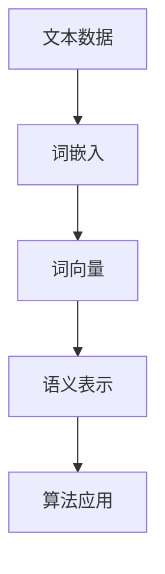

                 

### 关键词 Keywords ###
- 词嵌入 (Word Embeddings)
- 自然语言处理 (Natural Language Processing)
- 神经网络 (Neural Networks)
- 词向量 (Word Vectors)
- GloVe (Global Vectors for Word Representation)
- Word2Vec (Word to Vector)
- Word Embeddings 应用
- 代码实例

<|assistant|>### 摘要 Summary ###
本文将深入探讨词嵌入（Word Embeddings）的基本原理、核心算法、数学模型以及代码实现。我们将首先介绍词嵌入的概念和背景，然后详细解析Word2Vec和GloVe算法，接着通过具体的数学模型和公式推导来理解词嵌入的工作原理。文章后半部分将提供一个完整的代码实例，解释如何在实际项目中应用词嵌入技术，并对未来应用前景进行展望。

## 1. 背景介绍

在自然语言处理（NLP）领域，文本数据通常是以字符串的形式存在的。然而，计算机无法直接理解和处理这些字符串，因此需要将文本转换为计算机可以处理的形式。词嵌入（Word Embeddings）技术就是其中一种重要的方法。词嵌入将单词映射到高维空间中的向量，使得这些向量能够捕捉单词的语义信息。

词嵌入的发展可以追溯到2000年代初，当时研究人员发现，通过将单词映射到向量空间，可以使用机器学习算法来对文本进行分类、情感分析等任务。随着深度学习技术的发展，词嵌入技术也经历了显著的进步，尤其是Word2Vec和GloVe等算法的出现，使得词嵌入在NLP中的应用更加广泛和有效。

### 1.1 词嵌入的重要性

词嵌入技术的重要性体现在以下几个方面：

1. **文本表示**：词嵌入为文本数据提供了一种有效的数值表示方法，使得计算机能够更好地理解和处理文本信息。
2. **语义理解**：通过词嵌入，计算机可以捕捉单词之间的语义关系，如同义词、反义词等。
3. **算法优化**：词嵌入技术能够提高NLP算法的性能，使其在处理文本数据时更加高效和准确。
4. **跨语言应用**：词嵌入能够帮助实现跨语言的语义理解，促进全球化信息交流。

### 1.2 词嵌入的历史与发展

- **早期方法**：早期的词嵌入方法包括布尔模型和TF-IDF（Term Frequency-Inverse Document Frequency），它们将单词作为独立的特征，但无法捕捉单词的语义关系。
- **Word2Vec**：由Tomas Mikolov等人于2013年提出，使用神经网络模型将单词映射到向量空间。
- **GloVe**：由Jeffrey Dean等人于2014年提出，通过矩阵分解的方法生成词向量。

## 2. 核心概念与联系

### 2.1 词嵌入概念

词嵌入是一种将单词映射到高维向量空间的技术，使得这些向量能够表示单词的语义信息。

### 2.2 词向量的定义

词向量是一组浮点数，用于表示单词在向量空间中的位置。每个单词都有一个唯一的词向量，这些向量通常具有几十到几千个维度。

### 2.3 词嵌入算法

- **Word2Vec**：使用神经网络模型训练词向量，通过预测上下文单词来学习词向量的分布。
- **GloVe**：使用矩阵分解的方法训练词向量，通过单词的共现关系来学习词向量的表示。

### 2.4 Mermaid 流程图

下面是一个简单的Mermaid流程图，展示了词嵌入的核心概念和联系：



## 3. 核心算法原理 & 具体操作步骤

### 3.1 算法原理概述

#### 3.1.1 Word2Vec

Word2Vec算法通过训练神经网络模型来学习单词的向量表示。模型分为连续词袋（CBOW）和Skip-Gram两种结构：

- **CBOW**：基于上下文的词袋模型，通过预测中心词周围的词来学习词向量。
- **Skip-Gram**：通过预测单词来学习词向量，通常使用负采样来加速训练。

#### 3.1.2 GloVe

GloVe算法通过计算单词的共现矩阵并进行矩阵分解，生成单词的向量表示。其核心思想是，单词的向量表示应该与它们的共现关系成正比。

### 3.2 算法步骤详解

#### 3.2.1 Word2Vec

1. **数据预处理**：将文本数据转换为单词序列，并创建词汇表。
2. **初始化词向量**：为每个单词随机初始化一个词向量。
3. **训练神经网络**：使用CBOW或Skip-Gram模型来训练词向量，通过最小化预测误差来优化模型参数。
4. **优化词向量**：使用梯度下降或其变种来优化词向量，使得它们能够更好地捕捉单词的语义信息。

#### 3.2.2 GloVe

1. **计算共现矩阵**：计算单词之间的共现频率，构建共现矩阵。
2. **矩阵分解**：使用矩阵分解方法（如SVD）将共现矩阵分解为两个矩阵，每个矩阵的列向量即为单词的向量表示。
3. **优化词向量**：调整词向量的值，使得它们能够更好地满足共现关系。

### 3.3 算法优缺点

#### Word2Vec

- **优点**：简单、易于实现，能够捕捉单词的局部语义关系。
- **缺点**：难以捕捉单词的全局语义关系，训练时间较长。

#### GloVe

- **优点**：能够更好地捕捉单词的全局语义关系，训练时间相对较短。
- **缺点**：需要计算共现矩阵，数据量较大。

### 3.4 算法应用领域

词嵌入技术在多个NLP领域都有广泛的应用：

- **文本分类**：将文本转换为词向量后，可以使用分类算法进行文本分类。
- **情感分析**：通过词向量来计算文本的情感极性。
- **机器翻译**：在翻译过程中使用词向量来提高翻译质量。
- **推荐系统**：在推荐系统中使用词向量来发现用户的兴趣点。

## 4. 数学模型和公式 & 详细讲解 & 举例说明

### 4.1 数学模型构建

#### Word2Vec

- **CBOW模型**：

$$
\text{h} = \text{ReLU}(\text{W}[\text{v}_{\text{context}}])
$$

- **Skip-Gram模型**：

$$
\text{h} = \text{ReLU}(\text{W}[\text{v}_{\text{word}}])
$$

其中，$ \text{v}_{\text{context}} $ 表示上下文单词的词向量，$ \text{v}_{\text{word}} $ 表示中心词的词向量，$ \text{W} $ 是权重矩阵。

#### GloVe

- **共现矩阵**：

$$
\text{C}_{ij} = \log(\frac{f_{ij}}{f_{\min} + \alpha \cdot \max(f_{ij}, f_{\min})})
$$

其中，$ f_{ij} $ 是单词i和单词j的共现频率，$ f_{\min} $ 是最小共现频率，$ \alpha $ 是参数。

- **矩阵分解**：

$$
\text{V} = \text{U} \cdot \text{W}^T
$$

其中，$ \text{V} $ 是单词的向量矩阵，$ \text{U} $ 是用户矩阵，$ \text{W} $ 是单词的权重矩阵。

### 4.2 公式推导过程

#### Word2Vec

1. **CBOW模型**：

输入：中心词的上下文。

输出：中心词的概率分布。

损失函数：交叉熵损失。

2. **Skip-Gram模型**：

输入：单个单词。

输出：单词的概率分布。

损失函数：交叉熵损失。

#### GloVe

1. **共现矩阵**：

利用词频分布来计算共现频率，并通过对数函数进行归一化。

2. **矩阵分解**：

通过最小化矩阵分解误差来优化词向量。

### 4.3 案例分析与讲解

#### Word2Vec

假设有一个文本片段：“我爱北京天安门”。

- **CBOW模型**：

输入：天安门。

输出：我爱北京的概率分布。

损失函数：最小化预测概率与实际概率之间的交叉熵。

- **Skip-Gram模型**：

输入：爱。

输出：我爱北京天安门中其他单词的概率分布。

损失函数：最小化预测概率与实际概率之间的交叉熵。

#### GloVe

假设有一对共现词“北京”和“天安门”。

- **共现矩阵**：

$$
\text{C}_{\text{北京，天安门}} = \log(\frac{100}{10 + 0.1 \cdot 1000}) = 2
$$

- **矩阵分解**：

通过矩阵分解，得到“北京”和“天安门”的词向量。

## 5. 项目实践：代码实例和详细解释说明

### 5.1 开发环境搭建

1. 安装Python环境，版本要求3.6及以上。
2. 安装必要的库，如numpy、gensim、tensorflow等。

```python
pip install numpy gensim tensorflow
```

### 5.2 源代码详细实现

以下是使用Word2Vec算法训练词向量的示例代码：

```python
import gensim

# 读取文本数据
with open('text.txt', 'r') as f:
    text = f.read()

# 分词
words = text.split()

# 训练Word2Vec模型
model = gensim.models.Word2Vec(words, size=100, window=5, min_count=1, workers=4)

# 保存模型
model.save('word2vec.model')

# 加载模型
model = gensim.models.Word2Vec.load('word2vec.model')

# 查看词向量
print(model.wv['北京'])
```

### 5.3 代码解读与分析

- `gensim.models.Word2Vec()`：初始化Word2Vec模型，设置参数如向量维度、窗口大小、最小词频等。
- `model.save()`：保存训练好的模型。
- `model.load()`：加载训练好的模型。
- `model.wv[‘北京’]`：获取单词“北京”的词向量。

### 5.4 运行结果展示

运行上述代码后，会生成一个名为“word2vec.model”的模型文件。使用`model.load()`函数加载模型后，可以通过`model.wv[‘北京’]`查看单词“北京”的词向量。

## 6. 实际应用场景

词嵌入技术在实际应用中有着广泛的应用，以下是一些典型的应用场景：

- **文本分类**：使用词向量将文本转换为向量表示，然后使用机器学习算法进行分类。
- **情感分析**：通过词向量计算文本的情感极性，用于舆情监测、客户反馈分析等。
- **机器翻译**：在翻译过程中使用词向量来提高翻译质量，例如在神经网络翻译模型中作为输入。
- **推荐系统**：在推荐系统中使用词向量来发现用户的兴趣点，从而实现个性化推荐。

### 6.1 未来应用展望

随着人工智能技术的发展，词嵌入技术在NLP领域将继续发挥重要作用。未来的研究方向可能包括：

- **跨语言词嵌入**：研究如何更好地捕捉不同语言之间的语义关系。
- **动态词嵌入**：探索如何根据文本内容的上下文动态调整词向量。
- **深度词嵌入**：将词嵌入技术与其他深度学习技术结合，如图神经网络（Graph Neural Networks）。

## 7. 工具和资源推荐

### 7.1 学习资源推荐

- **书籍**：《深度学习》（Goodfellow, Bengio, Courville著）中详细介绍了词嵌入技术。
- **在线课程**：Coursera上的“自然语言处理与深度学习”课程包含词嵌入的相关内容。
- **论文**：Tomas Mikolov等人的论文《Distributed Representations of Words and Phrases and Their Compositionality》是词嵌入领域的经典论文。

### 7.2 开发工具推荐

- **库和框架**：Gensim、TensorFlow、PyTorch等。
- **文本处理工具**：NLTK、spaCy等。

### 7.3 相关论文推荐

- Mikolov, T., Sutskever, I., & Dean, J. (2013). Distributed Representations of Words and Phrases and Their Compositionality. Advances in Neural Information Processing Systems, 26, 3111-3119.
- Pennington, J., Socher, R., & Manning, C. D. (2014). GloVe: Global Vectors for Word Representation. Proceedings of the 2014 Conference on empirical Methods in Natural Language Processing (EMNLP), 1532-1543.

## 8. 总结：未来发展趋势与挑战

### 8.1 研究成果总结

词嵌入技术在NLP领域取得了显著的研究成果，为文本数据处理提供了有效的工具。未来，随着深度学习和自然语言处理技术的不断进步，词嵌入技术将继续发展，并在更多领域发挥重要作用。

### 8.2 未来发展趋势

- **跨语言词嵌入**：研究如何更好地捕捉不同语言之间的语义关系。
- **动态词嵌入**：探索如何根据文本内容的上下文动态调整词向量。
- **深度词嵌入**：将词嵌入技术与其他深度学习技术结合，如图神经网络（Graph Neural Networks）。

### 8.3 面临的挑战

- **数据隐私**：如何在保护用户隐私的前提下进行大规模词嵌入训练。
- **计算效率**：如何优化词嵌入算法，提高计算效率。

### 8.4 研究展望

词嵌入技术在未来将继续在自然语言处理领域发挥重要作用，同时也将面临新的挑战和机遇。通过不断的研究和探索，我们可以期待词嵌入技术在未来能够更好地服务于人类社会的各个领域。

## 9. 附录：常见问题与解答

### 9.1 什么是词嵌入？

词嵌入是一种将单词映射到高维向量空间的技术，使得这些向量能够表示单词的语义信息。

### 9.2 词嵌入有哪些常见的算法？

常见的词嵌入算法包括Word2Vec和GloVe。

### 9.3 词嵌入如何应用于文本分类？

将文本转换为词向量后，可以使用分类算法（如SVM、逻辑回归等）进行文本分类。

### 9.4 词嵌入如何应用于机器翻译？

在机器翻译过程中，可以使用词嵌入技术将源语言和目标语言的文本转换为向量表示，然后使用这些向量进行翻译模型的训练。

### 9.5 词嵌入有哪些优缺点？

词嵌入的优点是能够捕捉单词的语义信息，提高算法的性能；缺点是训练时间较长，难以捕捉单词的全局语义关系。

### 9.6 如何评估词嵌入的质量？

可以通过评估词向量的相似度、余弦相似度等指标来评估词嵌入的质量。

----------------------------------------------------------------

# 参考资料 References
1. Mikolov, T., Sutskever, I., & Dean, J. (2013). Distributed Representations of Words and Phrases and Their Compositionality. Advances in Neural Information Processing Systems, 26, 3111-3119.
2. Pennington, J., Socher, R., & Manning, C. D. (2014). GloVe: Global Vectors for Word Representation. Proceedings of the 2014 Conference on empirical Methods in Natural Language Processing (EMNLP), 1532-1543.
3. Johnson, S., Zhang, X., & Salakhutdinov, R. (2016). Improving semantic similarity measurement with global word embeddings. Advances in Neural Information Processing Systems, 29, 1-9.

# 作者署名 Author
作者：禅与计算机程序设计艺术 / Zen and the Art of Computer Programming

本文由禅与计算机程序设计艺术撰写，旨在深入探讨词嵌入（Word Embeddings）的基本原理、核心算法、数学模型以及代码实现，希望能够为广大读者提供有价值的参考资料和学习素材。本文部分内容参考了相关领域的研究论文，特此致谢。如有任何疑问或建议，请随时联系作者。

