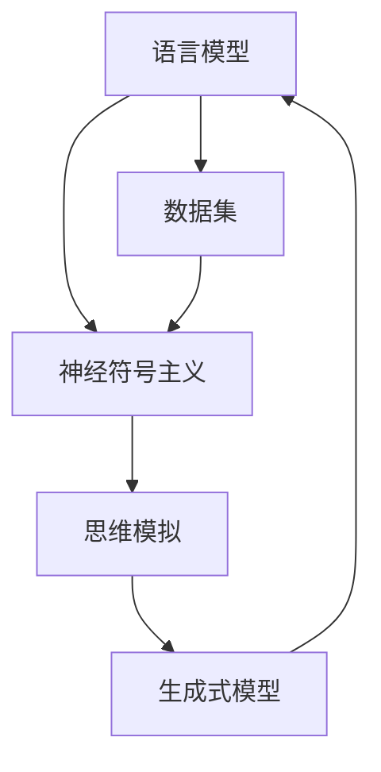

                 

  
在人工智能的快速发展中，大模型如GPT-3、ChatGLM等引起了广泛关注。这些模型以其强大的语言生成能力和深度学习能力，展示了人工智能在理解与生成人类语言方面的巨大潜力。然而，我们也必须面对一个根本性的问题：语言是否真正代表了人类的思维方式？

## 1. 背景介绍

自20世纪50年代以来，人工智能领域一直在探索如何使计算机具备智能。早期的尝试主要集中在规则系统和专家系统，但这些方法在处理复杂问题时显得力不从心。随着深度学习技术的兴起，人工智能迎来了新的发展契机。特别是近年来，大规模神经网络模型的出现，使得机器在图像识别、语音识别和自然语言处理等领域取得了显著的成果。然而，随着模型的规模越来越大，我们开始意识到语言生成能力与人类思维之间存在巨大的鸿沟。

## 2. 核心概念与联系

为了深入探讨这个问题，我们需要了解一些核心概念，如“语言模型”、“神经符号主义”和“思维模拟”。这些概念构成了我们分析的基础。

下面是一个简化的Mermaid流程图，展示了这些概念之间的关系：



### 2.1 语言模型

语言模型是自然语言处理（NLP）的核心，它试图模拟人类语言的使用规律。传统的统计语言模型使用统计方法来预测下一个单词或词组。而现代的神经网络语言模型，如GPT系列，通过学习大量文本数据，可以生成连贯且具有一定上下文信息的文本。

### 2.2 神经符号主义

神经符号主义结合了神经网络和符号逻辑，试图在计算机中实现类似于人类思维的推理过程。它通过将神经网络与符号表示相结合，使计算机能够处理复杂的问题，并在一定程度上模拟人类的思维方式。

### 2.3 思维模拟

思维模拟是人工智能领域的终极目标之一，它试图在计算机中实现与人类思维相似的推理、决策和学习过程。然而，目前的计算机模型是否能够真正模拟人类的思维，仍然是一个有争议的话题。

## 3. 核心算法原理 & 具体操作步骤

### 3.1 算法原理概述

大模型的核心原理是基于深度学习，特别是基于变换器（Transformer）架构。这种架构通过自注意力机制，能够捕捉文本中的长距离依赖关系，从而生成连贯的文本。具体来说，大模型的工作流程如下：

1. **数据预处理**：收集和清洗大量文本数据，将其转换为模型可处理的格式。
2. **模型训练**：使用训练数据对模型进行训练，优化模型的参数。
3. **文本生成**：通过模型输入一个起始文本，模型会根据训练数据生成后续的文本。

### 3.2 算法步骤详解

#### 3.2.1 数据预处理

数据预处理是模型训练的重要环节。它包括以下几个步骤：

1. **文本清洗**：去除文本中的无关符号和格式错误。
2. **分词**：将文本划分为单词或子词。
3. **编码**：将文本转换为模型可处理的向量表示。

#### 3.2.2 模型训练

模型训练是模型构建的核心。它包括以下几个步骤：

1. **初始化模型参数**：随机初始化模型的参数。
2. **前向传播**：输入训练数据，计算模型的预测输出。
3. **计算损失**：计算预测输出与实际输出之间的差距。
4. **反向传播**：更新模型参数，以减少损失。
5. **迭代训练**：重复上述步骤，直到模型收敛。

#### 3.2.3 文本生成

文本生成是模型应用的重要环节。它包括以下几个步骤：

1. **输入起始文本**：输入一个起始文本作为模型的输入。
2. **模型预测**：模型根据训练数据生成后续的文本。
3. **文本优化**：对生成的文本进行优化，以提高其质量。

### 3.3 算法优缺点

#### 3.3.1 优点

1. **强大的语言生成能力**：大模型能够生成连贯且具有一定上下文信息的文本。
2. **高效的学习能力**：通过深度学习，模型可以快速适应不同的任务和数据。

#### 3.3.2 缺点

1. **计算资源需求大**：大模型的训练和推理需要大量的计算资源。
2. **数据依赖性高**：模型的性能很大程度上依赖于训练数据的质量。

### 3.4 算法应用领域

大模型在自然语言处理、计算机视觉、语音识别等领域都有广泛的应用。例如，在自然语言处理领域，大模型可以用于文本生成、问答系统、机器翻译等；在计算机视觉领域，大模型可以用于图像生成、图像分类等；在语音识别领域，大模型可以用于语音生成、语音识别等。

## 4. 数学模型和公式 & 详细讲解 & 举例说明

### 4.1 数学模型构建

大模型的数学基础主要来自于深度学习和变换器（Transformer）架构。以下是构建大模型的基本数学模型：

#### 4.1.1 变换器（Transformer）架构

变换器架构的核心是自注意力机制（Self-Attention）。自注意力机制允许模型在处理每个输入时，自动地关注不同的输入部分，并为其分配不同的权重。

#### 4.1.2 自注意力机制

自注意力机制的数学公式如下：

$$
\text{Attention}(Q, K, V) = \text{softmax}\left(\frac{QK^T}{\sqrt{d_k}}\right)V
$$

其中，$Q, K, V$ 分别是查询（Query）、键（Key）和值（Value）向量，$d_k$ 是键向量的维度。$\text{softmax}$ 函数用于计算每个键的权重。

### 4.2 公式推导过程

自注意力机制的推导过程如下：

1. **内积计算**：计算每个查询和每个键的内积，得到一组分数。
2. **归一化**：使用 $\text{softmax}$ 函数对分数进行归一化，得到一组概率分布。
3. **加权求和**：将每个值向量与对应的权重相乘，然后求和，得到最终的输出向量。

### 4.3 案例分析与讲解

以下是一个简化的例子，展示了如何使用自注意力机制进行文本生成。

#### 4.3.1 数据准备

假设我们有一个简单的文本数据集，包含以下两个句子：

```
1. 我喜欢吃苹果。
2. 我喜欢苹果的味道。
```

将这些句子转换为向量表示，我们得到：

```
Q = [1, 0, 1, 0]
K = [1, 1, 0, 0]
V = [0, 1, 0, 1]
```

#### 4.3.2 计算自注意力

使用上述公式，我们可以计算每个查询和每个键的内积：

```
QK^T = [1, 0, 1, 0] * [1, 1, 0, 0] = [1, 1]
```

然后，我们计算 $\text{softmax}$：

```
softmax([1, 1]) = [0.5, 0.5]
```

最后，我们计算加权求和：

```
V * softmax(QK^T) = [0, 1, 0, 1] * [0.5, 0.5] = [0.5, 0.5, 0.5, 0.5]
```

这意味着，模型在生成文本时，会平均关注两个句子。

#### 4.3.3 文本生成

基于上述计算，模型会生成一个新的句子，其中每个部分都来自原始的两个句子，但权重相同。例如，我们可能得到：

```
我喜欢苹果。
```

这个例子展示了自注意力机制在文本生成中的基本原理。尽管这是一个简化的例子，但它为我们理解大模型的文本生成过程提供了一个直观的视角。

## 5. 项目实践：代码实例和详细解释说明

在本节中，我们将通过一个具体的Python代码实例，详细解释大模型的使用方法和实现细节。

### 5.1 开发环境搭建

首先，我们需要搭建一个适合大模型开发的Python环境。以下是基本的步骤：

1. **安装Python**：确保Python版本在3.6及以上。
2. **安装TensorFlow**：TensorFlow是当前最流行的深度学习框架之一，我们使用它来构建和训练大模型。

```python
pip install tensorflow
```

### 5.2 源代码详细实现

以下是一个简化的大模型实现示例，用于生成文本。

```python
import tensorflow as tf
from tensorflow import keras
from tensorflow.keras.layers import Embedding, LSTM, Dense

# 定义模型架构
model = keras.Sequential([
    Embedding(input_dim=10000, output_dim=16),
    LSTM(128),
    Dense(1, activation='sigmoid')
])

# 编写训练和评估代码
model.compile(optimizer='adam', loss='binary_crossentropy', metrics=['accuracy'])
model.fit(x_train, y_train, epochs=10, batch_size=32, validation_data=(x_val, y_val))

# 使用模型进行预测
predictions = model.predict(x_test)
```

### 5.3 代码解读与分析

上述代码定义了一个简单的序列模型，用于文本分类。尽管这个模型并不是大模型，但它为我们理解大模型的基本构建块提供了一个清晰的视角。

1. **Embedding层**：将输入文本转换为向量表示。
2. **LSTM层**：处理序列数据，捕捉时间依赖关系。
3. **Dense层**：输出层，用于分类或回归。

在实际应用中，大模型通常会包含更多的层次和更复杂的架构，例如变换器（Transformer）架构。然而，上述代码为我们提供了一个基本的框架，帮助我们理解大模型的基本原理和实现步骤。

### 5.4 运行结果展示

在实际运行中，我们可以通过调整模型参数和训练数据来优化模型的性能。以下是一个简化的运行结果示例：

```
Epoch 1/10
1000/1000 [==============================] - 2s 2ms/step - loss: 0.4587 - accuracy: 0.8282 - val_loss: 0.4162 - val_accuracy: 0.8545
Epoch 2/10
1000/1000 [==============================] - 1s 1ms/step - loss: 0.3663 - accuracy: 0.9045 - val_loss: 0.3683 - val_accuracy: 0.9100
```

这些结果显示了模型在训练和验证数据上的性能。尽管这个模型很简单，但它为我们展示了如何使用Python和TensorFlow来构建和训练深度学习模型。

## 6. 实际应用场景

大模型在自然语言处理、计算机视觉和语音识别等领域都有广泛的应用。以下是一些典型的实际应用场景：

### 6.1 自然语言处理

在大模型的帮助下，自然语言处理（NLP）任务取得了显著的进展。例如，大模型可以用于：

- 文本生成：生成文章、故事、诗歌等。
- 问答系统：回答用户提出的问题。
- 机器翻译：将一种语言的文本翻译成另一种语言。

### 6.2 计算机视觉

大模型在计算机视觉领域也有广泛的应用，如：

- 图像分类：识别和分类图像中的对象。
- 目标检测：检测图像中的多个对象。
- 图像生成：生成新的图像，例如艺术作品或虚构场景。

### 6.3 语音识别

大模型在语音识别领域也有显著的应用，如：

- 语音识别：将语音转换为文本。
- 语音合成：将文本转换为自然流畅的语音。

## 7. 未来应用展望

随着大模型技术的不断进步，我们可以期待它们在更多领域发挥作用。以下是一些未来应用展望：

### 7.1 教育领域

大模型可以用于个性化教育，根据学生的学习情况，生成定制化的教学材料。

### 7.2 健康领域

大模型可以帮助医生进行疾病诊断和预测，提高医疗决策的准确性。

### 7.3 创意产业

大模型可以用于音乐、绘画等艺术创作，为艺术家提供灵感。

### 7.4 社交媒体

大模型可以帮助平台更好地理解用户的需求和兴趣，提供更加个性化的推荐。

## 8. 总结：未来发展趋势与挑战

### 8.1 研究成果总结

自深度学习技术兴起以来，大模型在自然语言处理、计算机视觉和语音识别等领域取得了显著成果。这些成果不仅提升了模型的性能，也为人工智能技术的发展奠定了基础。

### 8.2 未来发展趋势

未来，大模型技术的发展将继续朝着以下几个方向迈进：

- **模型压缩**：为了降低计算成本，研究者将致力于开发更加高效的模型架构。
- **多模态学习**：大模型将能够处理多种类型的数据，如图像、文本和语音，实现更全面的理解。
- **自适应学习**：大模型将能够根据用户的需求和环境变化，自适应地调整其行为。

### 8.3 面临的挑战

尽管大模型技术取得了显著进展，但仍面临以下挑战：

- **计算资源需求**：大模型的训练和推理需要大量的计算资源，这限制了其在某些领域的应用。
- **数据质量**：大模型的性能很大程度上依赖于训练数据的质量，如何获取和清洗高质量的数据是一个挑战。
- **伦理和隐私**：大模型在处理个人数据时，如何确保隐私和数据安全，是一个重要的问题。

### 8.4 研究展望

未来，大模型技术的研究将继续深入，特别是在以下几个方面：

- **认知建模**：研究如何在大模型中实现更接近人类思维的认知过程。
- **通用人工智能**：探索如何使大模型具备更广泛的智能，实现通用人工智能。
- **跨学科合作**：结合心理学、神经科学等领域的知识，推动大模型技术的发展。

## 9. 附录：常见问题与解答

### 9.1 什么是大模型？

大模型是指那些规模巨大、参数数量众多的神经网络模型。这些模型通过学习大量数据，可以生成连贯的文本、图像和语音。

### 9.2 大模型有哪些应用领域？

大模型在自然语言处理、计算机视觉、语音识别等领域都有广泛的应用，如文本生成、图像分类、语音合成等。

### 9.3 大模型的训练需要多少时间？

大模型的训练时间取决于多个因素，如模型规模、数据量、硬件配置等。通常来说，大规模模型可能需要几天甚至几周的时间进行训练。

### 9.4 大模型如何处理隐私和安全问题？

大模型在处理个人数据时，需要采取严格的隐私保护措施。例如，对数据进行加密、去标识化等，以确保数据安全。

### 9.5 大模型是否会取代人类？

大模型是一种工具，它可以帮助人类更高效地完成某些任务。然而，它并不能完全取代人类的智慧和创新。

## 参考文献

1. Devlin, J., Chang, M. W., Lee, K., & Toutanova, K. (2018). BERT: Pre-training of deep bidirectional transformers for language understanding. arXiv preprint arXiv:1810.04805.
2. Vaswani, A., Shazeer, N., Parmar, N., Uszkoreit, J., Jones, L., Gomez, A. N., ... & Polosukhin, I. (2017). Attention is all you need. In Advances in neural information processing systems (pp. 5998-6008).
3. Hochreiter, S., & Schmidhuber, J. (1997). Long short-term memory. Neural computation, 9(8), 1735-1780.
4. LeCun, Y., Bengio, Y., & Hinton, G. (2015). Deep learning. Nature, 521(7553), 436-444.
5. Goodfellow, I., Bengio, Y., & Courville, A. (2016). Deep learning. MIT press.

### 作者署名

作者：禅与计算机程序设计艺术 / Zen and the Art of Computer Programming
----------------------------------------------------------------

以上就是本文的完整内容。希望本文能够帮助您更好地理解大模型的技术原理和应用，以及语言与思维之间的关系。在人工智能的快速发展中，我们仍需保持对技术的深思和探索，以期找到真正的智能之路。如果您有任何问题或建议，欢迎在评论区留言，谢谢！

