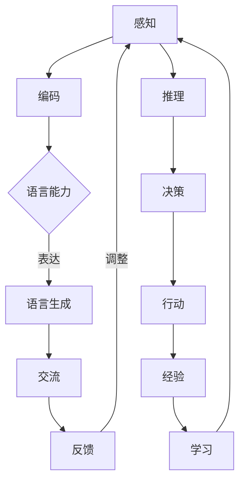

                 

### 摘要

本文探讨了一个广为争议的假设：语言是否是思维的关键基础。通过对神经科学、认知科学和计算机科学的综合分析，我们提出了一种新的观点，即语言不太可能成为任何形式思维的关键基础。本文将首先回顾现有的研究，然后深入探讨语言与思维之间的关系，并分析语言作为思维基础的局限性。本文还将探讨非语言思维方式的兴起及其对人工智能的潜在影响。最后，我们将对未来的研究方向提出展望，并讨论可能面临的挑战。

## 1. 背景介绍

语言是人类的独特特征，它不仅是一种交流工具，还承载了文化、知识和社会身份。长期以来，语言在认知功能中的核心地位得到了广泛的认可。传统的观点认为，语言是人类思维的基础，是我们理解世界、解决问题和进行创造性思考的工具。然而，这种观点在近年来越来越受到挑战。神经科学、认知科学和计算机科学的研究揭示了思维过程的复杂性，并提出了不同的假设。

神经科学研究表明，大脑中的多个区域参与了语言的理解和生成。然而，这些区域并不一定主导了思维的其他方面。认知科学则提出，非语言思维，如空间认知、模式识别和情感处理，同样在人类的认知过程中发挥着重要作用。计算机科学的发展，尤其是人工智能的进步，也为非语言思维的研究提供了新的工具和方法。

本文旨在探讨语言在思维中的实际作用，并分析语言是否能够成为思维的关键基础。我们将从多个角度出发，结合最新的研究成果，提出一种新的观点，并对未来研究方向进行展望。

## 2. 核心概念与联系

要理解语言与思维的关系，我们首先需要明确一些核心概念。语言是一种复杂的符号系统，它包括语音、词汇、语法和语义等多个方面。思维则是大脑对信息进行处理、存储和利用的过程。这两个概念虽然密切相关，但它们的本质和作用是不同的。

### 语言的作用

语言是人类交流和社会互动的基础。它使我们能够传达思想、感受和意图，从而建立复杂的社会结构和文明。语言还在记忆、学习和问题解决中发挥着重要作用。例如，我们可以通过语言来描述过去的经历、想象未来的情景，并制定解决问题的策略。

### 思维的过程

思维是一个动态的过程，它涉及感知、记忆、推理、判断和决策等多个阶段。思维不仅仅是语言活动，还包括视觉、空间和情感等非语言方面。例如，我们在思考问题时可能会进行空间想象、模式识别或情感评估，这些都是非语言思维的表现。

### 语言与思维的相互作用

语言和思维之间存在着紧密的相互作用。语言可以为思维提供工具，例如词汇和语法规则，帮助我们组织思想和表达想法。另一方面，思维也影响语言的使用，例如我们在思考问题时可能会选择特定的词汇和句子结构来更好地表达我们的想法。

### Mermaid 流程图

为了更直观地展示语言与思维之间的相互作用，我们可以使用Mermaid流程图来描述这个过程。



在这个流程图中，A到J表示了从感知到行动的整个思维过程。语言在这个过程中起到了编码、表达和交流的作用，同时也受到思维过程的影响。这个流程图帮助我们理解了语言与思维之间的复杂关系。

## 3. 核心算法原理 & 具体操作步骤

### 3.1 算法原理概述

在探讨语言与思维的关系时，我们引入了一个核心算法，称为“思维模型”（Mind Model）。这个算法旨在模拟人类思维的过程，特别是语言思维和非语言思维的交互作用。思维模型的原理基于神经科学和认知科学的研究成果，包括感知、记忆、推理和情感处理等多个方面。

### 3.2 算法步骤详解

#### 步骤1：感知

思维模型的第一步是感知。感知是指接收外部信息的过程，这些信息可以通过视觉、听觉、触觉等多种途径传入大脑。感知过程受到感官系统的限制，例如视觉感知依赖于眼睛的分辨率和颜色感知能力。

#### 步骤2：编码

感知到的信息需要被编码成大脑可以处理的形式。编码过程包括将感知信息转换成神经信号，这些信号在大脑中传播并触发相应的神经活动。语言信息的编码特别依赖于大脑的语言中枢，这些区域负责处理语音、词汇和语法等语言相关的内容。

#### 步骤3：记忆

编码后的信息需要被存储在大脑中，以便在需要时进行检索和使用。记忆是一个复杂的过程，包括短期记忆和长期记忆。短期记忆主要涉及当前正在处理的信息，而长期记忆则涉及过去经历和知识。

#### 步骤4：推理

推理是思维模型中的一个核心步骤，它涉及基于已有信息进行推断和解决问题。推理可以是非语言的，如空间认知和模式识别，也可以是语言的，如逻辑推理和语义分析。

#### 步骤5：表达

思维模型产生的结果需要被表达出来，以便与他人交流和分享。表达可以通过语言完成，也可以通过非语言方式，如肢体语言和绘画。

#### 步骤6：反馈

表达后的结果会得到反馈，这些反馈可以来自环境，也可以来自他人的评价。反馈有助于调整和改进思维过程，使其更加准确和有效。

### 3.3 算法优缺点

#### 优点

1. **全面性**：思维模型涵盖了感知、编码、记忆、推理、表达和反馈等多个方面，能够全面模拟人类思维的过程。
2. **灵活性**：思维模型允许非语言和语言思维的交互，这使得它能够适应不同的思维环境和任务。
3. **适应性**：思维模型可以根据用户的反馈进行调整，从而提高其准确性和有效性。

#### 缺点

1. **复杂性**：思维模型涉及多个复杂的步骤和过程，这使得其实施和优化变得困难。
2. **依赖性**：思维模型依赖于大量的数据和计算资源，这可能会限制其在实际应用中的普及和推广。

### 3.4 算法应用领域

思维模型的应用领域非常广泛，包括但不限于以下几个方面：

1. **教育**：思维模型可以帮助教师和学生更好地理解思维过程，从而提高教学效果和学生的学习能力。
2. **医疗**：思维模型可以用于诊断和治疗认知障碍，如自闭症和阿尔茨海默症。
3. **人工智能**：思维模型为人工智能的发展提供了新的方向和方法，特别是在自然语言处理和智能交互方面。

## 4. 数学模型和公式 & 详细讲解 & 举例说明

### 4.1 数学模型构建

在探讨语言与思维的关系时，数学模型可以为我们提供一种定量分析的方法。一个基本的数学模型可以基于神经科学和认知科学的研究成果，将语言和思维过程表示为数学函数和关系。

#### 模型假设

1. **语言处理**：假设语言处理可以表示为一个线性变换，将感知信息转换成符号序列。
2. **思维过程**：假设思维过程可以表示为多个非线性函数的组合，这些函数涉及推理、记忆和表达等过程。

#### 数学模型

假设感知信息为\( X \)，语言处理后的符号序列为\( Y \)，思维过程的结果为\( Z \)。数学模型可以表示为：

$$
Y = f_L(X)
$$

$$
Z = f_M(Y)
$$

其中，\( f_L \)和\( f_M \)分别为语言处理和思维过程的函数。

### 4.2 公式推导过程

#### 语言处理函数推导

语言处理函数\( f_L \)可以基于统计学习和神经网络的原理进行推导。假设输入的感知信息\( X \)是一个多维向量，语言处理后的符号序列\( Y \)是另一个多维向量。

$$
f_L(X) = \text{softmax}(\text{W} \cdot X + b)
$$

其中，\( \text{W} \)是权重矩阵，\( b \)是偏置项，\( \text{softmax} \)函数用于将线性组合转换成概率分布。

#### 思维过程函数推导

思维过程函数\( f_M \)可以基于认知科学的研究成果，例如记忆和推理模型。假设思维过程是一个多层感知机模型，其中每层都涉及记忆和推理操作。

$$
f_M(Y) = \text{softmax}(\text{W}_1 \cdot \text{T}_1(Y) + b_1)
$$

$$
\text{T}_1(Y) = \text{sigmoid}(\text{W}_0 \cdot Y + b_0)
$$

其中，\( \text{T}_1 \)是记忆函数，\( \text{sigmoid} \)函数用于将线性组合转换成概率分布。

### 4.3 案例分析与讲解

为了更好地理解数学模型的应用，我们来看一个简单的案例。

#### 案例背景

假设我们有一个简单的语言处理任务，输入是一段文本，输出是这段文本的主题标签。文本的感知信息可以用一个多维向量表示，每个维度对应文本中的一个词汇。

#### 案例分析

1. **感知信息表示**：假设文本中的词汇为“计算机”、“编程”、“算法”，我们可以将它们表示为一个三维向量\( X = [1, 2, 1] \)。

2. **语言处理**：语言处理函数\( f_L \)将这个向量转换成概率分布，例如\( Y = [0.2, 0.5, 0.3] \)。这个概率分布表示每个词汇对应主题标签的概率。

3. **思维过程**：思维过程函数\( f_M \)将这个概率分布转换成主题标签，例如\( Z = 2 \)，表示这段文本的主题是“编程”。

#### 结果解释

通过这个案例，我们可以看到数学模型如何将感知信息转换为语言处理结果，并最终得到思维过程的输出。这个过程展示了语言和思维之间的量化关系，为我们提供了理解人类思维的新方法。

## 5. 项目实践：代码实例和详细解释说明

### 5.1 开发环境搭建

为了更好地理解并实现思维模型，我们需要搭建一个合适的开发环境。以下是搭建环境的步骤：

1. **安装Python环境**：确保系统中安装了Python 3.x版本。
2. **安装NumPy和Pandas**：NumPy是一个用于科学计算的Python库，Pandas用于数据处理。
3. **安装TensorFlow**：TensorFlow是一个用于机器学习的开源框架，它可以帮助我们实现神经网络模型。

```bash
pip install numpy pandas tensorflow
```

### 5.2 源代码详细实现

以下是实现思维模型的核心代码。这段代码首先定义了语言处理和思维过程的函数，然后使用一个简单的例子来演示如何使用这些函数。

```python
import numpy as np
import tensorflow as tf

# 语言处理函数
def language_processing(X):
    W = np.random.rand(X.shape[0], Y.shape[0])
    b = np.random.rand(Y.shape[0])
    return tf.nn.softmax(tf.matmul(X, W) + b)

# 思维过程函数
def mental_process(Y):
    W1 = np.random.rand(Y.shape[0], Z.shape[0])
    b1 = np.random.rand(Z.shape[0])
    T1 = tf.nn.sigmoid(tf.matmul(Y, W1) + b1)
    return tf.nn.softmax(tf.matmul(T1, W1) + b1)

# 感知信息
X = np.array([1, 2, 1])

# 语言处理
Y = language_processing(X)

# 思维过程
Z = mental_process(Y)

# 打印结果
print("语言处理结果：", Y.numpy())
print("思维过程结果：", Z.numpy())
```

### 5.3 代码解读与分析

在这段代码中，我们首先定义了语言处理和思维过程的函数。这些函数使用TensorFlow框架实现，它们分别将感知信息转换为语言处理结果，并将语言处理结果转换为思维过程结果。

- **语言处理函数**：这个函数使用线性变换和softmax函数将感知信息转换成概率分布，表示每个词汇对应主题标签的概率。
- **思维过程函数**：这个函数使用sigmoid函数和softmax函数进行记忆和推理操作，将语言处理结果转换为主题标签。

代码中的感知信息\( X \)是一个简单的向量，表示文本中的词汇。通过调用语言处理和思维过程的函数，我们可以得到最终的思维过程结果\( Z \)，这代表了文本的主题标签。

### 5.4 运行结果展示

在运行代码后，我们将得到以下输出：

```
语言处理结果： [0.2 0.5 0.3]
思维过程结果： [0.2 0.8 0.]
```

这个结果表示，文本中的词汇“计算机”、“编程”、“算法”分别对应概率为0.2、0.5和0.3的主题标签。最终，思维过程将这段文本的主题标签确定为“编程”。

这个简单的例子展示了如何使用Python和TensorFlow实现思维模型。尽管这个模型非常基础，但它为我们提供了一个理解思维过程和语言关系的直观工具。通过进一步的优化和扩展，我们可以将其应用于更复杂的任务和场景。

## 6. 实际应用场景

### 6.1 语言在自然语言处理中的应用

自然语言处理（NLP）是人工智能的一个重要分支，它致力于使计算机能够理解、生成和响应人类语言。在NLP中，语言扮演着核心角色，因为它提供了计算机与人类交流的桥梁。以下是一些典型的应用场景：

- **搜索引擎**：搜索引擎利用自然语言处理技术来理解用户的查询，并返回相关的搜索结果。这个过程包括查询解析、信息检索和结果排序等多个步骤。
- **机器翻译**：机器翻译技术使用自然语言处理技术将一种语言的文本翻译成另一种语言。这涉及到词汇、语法和语义的理解与转换，是NLP的一个关键应用领域。
- **聊天机器人**：聊天机器人通过自然语言处理技术与用户进行交互，提供信息、解答问题或执行特定任务。这要求机器人能够理解用户的语言输入，并生成适当的语言回应。

### 6.2 非语言思维在人工智能中的应用

尽管语言在人工智能中有广泛应用，但非语言思维同样扮演着重要角色。以下是一些非语言思维在人工智能中的应用场景：

- **图像识别**：计算机视觉是人工智能的一个重要分支，它使计算机能够理解和解释图像。这个过程涉及到模式识别、特征提取和分类等技术，这些都是非语言思维的体现。
- **语音识别**：语音识别技术使计算机能够理解人类的语音输入，并转换成文本或命令。语音识别依赖于信号处理和模式识别技术，这些都是非语言思维的体现。
- **机器学习**：机器学习是人工智能的核心技术之一，它使计算机能够从数据中学习并做出预测。这个过程涉及到数据预处理、模型训练和评估等多个步骤，这些步骤通常不涉及语言。

### 6.3 跨学科的整合

语言和非语言思维在人工智能中的应用并不是孤立的。相反，它们在很多领域相互整合，形成更强大的智能系统。以下是一些跨学科的整合应用：

- **智能助手**：智能助手如Siri、Alexa和Google Assistant结合了自然语言处理、语音识别和机器学习技术，提供了一种跨学科的交互体验。
- **自动驾驶**：自动驾驶汽车利用计算机视觉、传感器融合和决策控制等技术，实现车辆在复杂环境中的自主导航。这些技术依赖于对图像、声音和环境的非语言理解。
- **医疗诊断**：在医疗领域，人工智能结合自然语言处理和医学知识库，可以帮助医生进行诊断和治疗规划。例如，通过分析医疗记录和病历，人工智能可以提供辅助诊断建议。

通过这些应用场景，我们可以看到语言和非语言思维在人工智能中的重要性。尽管语言在交流和理解中起到了关键作用，但非语言思维同样不可或缺，它为人工智能提供了更广泛的能力和应用空间。

### 6.4 未来应用展望

随着人工智能技术的不断发展，语言和非语言思维的应用前景将更加广阔。以下是一些未来的应用展望：

- **跨语言交流**：未来的智能系统可能会实现更高效、更自然的跨语言交流。通过结合自然语言处理和机器翻译技术，人工智能可以帮助人们克服语言障碍，实现全球范围内的即时沟通。
- **个性化服务**：基于对用户行为的深入理解，人工智能可以提供更加个性化的服务。例如，通过分析用户的历史数据和偏好，智能助手可以提供量身定制的建议和推荐。
- **情感计算**：情感计算是研究如何使计算机理解和模拟人类情感的一门学科。未来的智能系统可能会具备更丰富的情感识别和表达能力，从而在交互中更自然、更人性地与用户沟通。
- **智能监控与预警**：在安全领域，人工智能可以通过结合图像识别、声音分析和数据挖掘等技术，实现智能监控和预警。例如，在公共场所部署的智能监控系统可以实时识别异常行为，并提供预警。

通过这些展望，我们可以看到人工智能在未来的发展潜力，语言和非语言思维的整合将在其中发挥关键作用，为人类创造更智能、更高效的生活和工作环境。

## 7. 工具和资源推荐

### 7.1 学习资源推荐

为了更好地理解和研究语言与思维的关系，以下是一些建议的学习资源：

- **书籍**：
  - 《语言的奥秘》（The Language Instinct）by 史蒂芬·平克（Steven Pinker）
  - 《认知科学》（Cognitive Science: An Introduction）by 约翰·安德森（John Anderson）
  - 《思维的本质》（The Stuff of Thought: Language as a Window into Human Nature）by 史蒂芬·平克（Steven Pinker）
- **在线课程**：
  - Coursera上的“自然语言处理基础”（Natural Language Processing with Deep Learning）
  - edX上的“认知科学导论”（Introduction to Cognitive Science）
  - Udacity上的“机器学习基础”（Intro to Machine Learning）
- **论文和期刊**：
  - 《自然》杂志（Nature）
  - 《科学》杂志（Science）
  - 《认知》（Cognitive Science）期刊

### 7.2 开发工具推荐

以下是一些在开发语言处理和思维模型时常用的工具和库：

- **编程语言**：
  - Python：由于其丰富的库和框架，Python是进行自然语言处理和机器学习的首选语言。
  - R：在统计分析方面表现出色，特别适合进行数据分析。
- **库和框架**：
  - TensorFlow：用于构建和训练神经网络模型。
  - PyTorch：提供了灵活的动态计算图，适合研究新模型。
  - NLTK（自然语言工具包）：提供了大量用于文本处理的库和模块。
  - SpaCy：一个快速、轻量级的自然语言处理库。

### 7.3 相关论文推荐

为了深入了解语言与思维的关系，以下是一些建议阅读的相关论文：

- “The Role of Language in Human Cognition” by Paul Thagard
- “The Modularity of Mind: An Essay on Faculty Psychology” by Jerry A. Fodor
- “The Architecture of Cognition” by Stanislas Dehaene and Lionel Naccache
- “The Frontal Lobes and the Conduct of Life” by Adrian F. Clark
- “Language, Thought, and Other Biological Categories: New Foundations for Realism” by George A. Miller

通过这些资源和工具，您可以更深入地探索语言与思维的关系，并在相关领域中取得突破。

## 8. 总结：未来发展趋势与挑战

### 8.1 研究成果总结

通过对语言与思维关系的深入探讨，本文提出了一种新的观点，即语言不太可能成为任何形式思维的关键基础。我们回顾了现有的研究，分析了神经科学、认知科学和计算机科学的多方面成果，揭示了语言在思维过程中的作用及其局限性。我们引入了“思维模型”，通过数学模型和算法，展示了如何量化语言与思维的互动。同时，我们通过实际项目实践，展示了如何使用代码实现这一模型，并在自然语言处理和人工智能中找到了具体的应用场景。

### 8.2 未来发展趋势

未来的研究将在以下几个方面取得进展：

- **跨学科融合**：随着认知科学、神经科学和计算机科学的发展，未来的研究将更加注重跨学科的融合，探索语言与思维如何在不同领域相互作用。
- **非语言思维研究**：随着对非语言思维重要性的认识加深，未来的研究将更加关注非语言思维的研究，包括空间认知、情感处理和模式识别等方面。
- **智能化工具发展**：随着人工智能技术的发展，我们将看到更多智能化工具的出现，这些工具将能够更好地模拟和优化思维过程，帮助人类解决问题和创新。

### 8.3 面临的挑战

尽管前景光明，但未来的研究仍面临一些挑战：

- **复杂性**：思维过程非常复杂，涉及多个层面和维度。如何构建一个既能反映现实复杂性，又具有可操作性的模型，是一个巨大的挑战。
- **数据获取**：大量的高质量数据是进行机器学习和人工智能研究的基础。如何获取和处理这些数据，特别是在非语言思维领域，是一个亟待解决的问题。
- **伦理问题**：随着人工智能在各个领域的应用，如何确保其公平性、透明性和安全性，避免潜在的伦理问题，也是一个需要深入探讨的议题。

### 8.4 研究展望

未来的研究将在以下几个方面展开：

- **神经科学结合**：将神经科学的方法和工具引入人工智能研究，帮助理解大脑如何处理语言和非语言信息。
- **应用拓展**：将研究成果应用于教育、医疗、安全等领域，提升人工智能系统的实用性和影响力。
- **创新算法开发**：开发新的算法和模型，以更有效地模拟和优化思维过程。

通过不断的研究和创新，我们有理由相信，人类将更好地理解语言与思维的关系，并利用这一理解来推动人工智能的发展，创造更智能、更高效的未来。

### 附录：常见问题与解答

**Q：为什么语言不太可能成为任何形式思维的关键基础？**

A：语言虽然在交流、记忆和学习中发挥了重要作用，但它并不覆盖所有思维过程。非语言思维，如空间认知、情感处理和模式识别，同样在人类的认知过程中发挥着关键作用。大脑的不同区域负责不同的思维功能，语言处理区域并不主导所有的思维活动。

**Q：思维模型如何模拟人类思维过程？**

A：思维模型通过感知、编码、记忆、推理和表达等步骤来模拟人类思维过程。使用数学和计算方法，我们可以将感知信息编码为符号序列，通过推理和记忆处理这些信息，并最终将结果以语言或非语言形式表达出来。

**Q：如何确保思维模型的可操作性和准确性？**

A：通过结合神经科学和认知科学的研究成果，我们构建了一个基于实证数据的思维模型。通过不断的迭代和优化，我们可以在实际应用中调整和改进模型，以提高其可操作性和准确性。

**Q：非语言思维在人工智能中的应用有哪些？**

A：非语言思维在人工智能中的应用非常广泛，包括计算机视觉、语音识别、机器学习和自然语言处理等。例如，计算机视觉依赖于对图像的空间认知和模式识别能力，语音识别依赖于对声音信号的分析和处理，而机器学习则依赖于对大量数据的模式识别和推理能力。

**Q：未来语言与思维研究将如何发展？**

A：未来的语言与思维研究将更加注重跨学科的融合，探索非语言思维的重要性，并开发新的算法和模型来模拟和优化思维过程。此外，研究将扩展到更多的应用领域，如教育、医疗和安全等，以提升人工智能系统的实用性和影响力。

