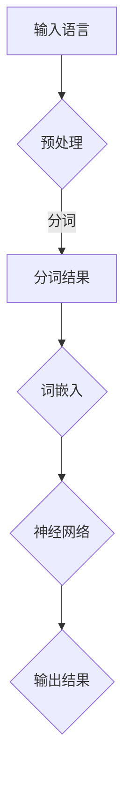

                 

关键词：大模型，语言理解，认知科学，神经网络，算法，人机交互

> 摘要：本文探讨大模型在语言理解中的认知困惑，分析大模型在处理语言任务时的思维过程与人类认知的差异，并讨论如何优化大模型以实现更自然的语言交互。

## 1. 背景介绍

随着人工智能技术的迅猛发展，大模型在各个领域的应用日益广泛。大模型，特别是深度学习模型，凭借其强大的计算能力和自学习能力，已经在图像识别、语音识别、自然语言处理等多个领域取得了显著的成果。然而，在处理自然语言任务时，大模型往往表现出一些认知困惑，这些问题引起了广泛关注。

语言是人类交流的基本工具，也是人类思维的重要载体。大模型在语言理解上的困惑，不仅影响了其应用效果，也引发了关于人机交互、人工智能发展方向等问题的深思。因此，本文将从认知科学的角度出发，分析大模型在语言理解中的认知困惑，探讨解决这些困惑的方法和路径。

## 2. 核心概念与联系

为了更好地理解大模型在语言理解中的认知困惑，我们首先需要了解一些核心概念和它们之间的联系。

### 2.1 语言与思维

语言是人类交流的工具，而思维是人类认知的核心。语言与思维密不可分，语言是思维的载体，思维是语言的基础。在人类认知过程中，语言不仅仅是信息的传递工具，更是思维的组织者和引导者。

### 2.2 大模型与神经网络

大模型主要基于神经网络架构，特别是深度神经网络（DNN）和Transformer模型。神经网络通过多层非线性变换对输入数据进行处理，从而实现复杂的信息处理任务。大模型具有强大的计算能力和自学习能力，但其在处理语言任务时，存在一些认知困惑。

### 2.3 认知科学与大模型

认知科学是一门研究人类认知过程的学科，涉及心理学、神经科学、计算机科学等多个领域。认知科学的研究成果可以为理解大模型在语言理解中的认知困惑提供理论支持。

### 2.4 Mermaid 流程图

为了更直观地展示大模型在语言理解中的认知过程，我们可以使用Mermaid流程图来描述。以下是一个简化的流程图：



## 3. 核心算法原理 & 具体操作步骤

### 3.1 算法原理概述

大模型在语言理解中的核心算法主要包括预处理、分词、词嵌入、神经网络和输出结果等步骤。每个步骤都有其特定的功能和技术实现。

### 3.2 算法步骤详解

#### 3.2.1 预处理

预处理是输入语言数据前的预处理步骤，主要包括去除标点符号、转换成小写、去除停用词等操作。

#### 3.2.2 分词

分词是将输入语言文本分割成一组单词的过程。目前，常见的分词方法包括基于词典的分词和基于统计的分词。

#### 3.2.3 词嵌入

词嵌入是将单词映射到高维空间中的向量表示。常见的词嵌入方法包括Word2Vec、GloVe等。

#### 3.2.4 神经网络

神经网络通过对输入数据进行多层非线性变换，实现对语言信息的理解和处理。常见的神经网络模型包括DNN、RNN、LSTM、Transformer等。

#### 3.2.5 输出结果

输出结果是神经网络处理后的结果，可以是分类结果、序列生成等。根据具体任务的需求，可以设计不同的输出层和损失函数。

### 3.3 算法优缺点

#### 优点：

1. 强大的计算能力：大模型具有强大的计算能力，可以处理大规模的语言数据。
2. 自学习能力：大模型通过自学习可以不断优化性能，提高语言理解能力。
3. 广泛的应用领域：大模型在自然语言处理、机器翻译、问答系统等多个领域都有广泛的应用。

#### 缺点：

1. 认知困惑：大模型在处理语言任务时，往往表现出一些认知困惑，如理解歧义、情感识别等。
2. 解释性差：大模型的内部机制复杂，难以解释其决策过程，导致在应用中存在一定的风险。
3. 资源消耗大：大模型需要大量的计算资源和存储空间，对硬件要求较高。

### 3.4 算法应用领域

大模型在自然语言处理、机器翻译、问答系统、文本生成等领域的应用已经取得了显著成果。随着技术的不断发展，大模型在更多领域的应用前景也日益广阔。

## 4. 数学模型和公式 & 详细讲解 & 举例说明

### 4.1 数学模型构建

大模型在语言理解中的数学模型主要包括词嵌入模型、神经网络模型和输出层模型。

#### 词嵌入模型

词嵌入是将单词映射到高维空间中的向量表示。一个简单的词嵌入模型可以表示为：

$$
x = W \cdot w
$$

其中，$x$表示单词的向量表示，$W$是词嵌入矩阵，$w$是单词的向量表示。

#### 神经网络模型

神经网络模型通过多层非线性变换对输入数据进行处理。一个简单的神经网络模型可以表示为：

$$
y = f(\theta \cdot x)
$$

其中，$y$表示输出结果，$f$是非线性激活函数，$\theta$是模型参数。

#### 输出层模型

输出层模型根据具体任务的需求进行设计。常见的输出层模型包括分类输出层和序列输出层。

分类输出层可以表示为：

$$
P(y = k) = \frac{e^{\theta \cdot y_k}}{\sum_{i=1}^{N} e^{\theta \cdot y_i}}
$$

其中，$P(y = k)$表示输出结果为$k$的概率。

序列输出层可以表示为：

$$
y_t = f(\theta \cdot (x_t, h_{t-1}))
$$

其中，$y_t$表示第$t$个输出的序列，$h_{t-1}$是前一个时间步的隐藏状态。

### 4.2 公式推导过程

#### 词嵌入模型推导

词嵌入模型的推导过程主要涉及矩阵乘法和矩阵求导。

设输入词向量为$x \in \mathbb{R}^{d_x}$，词嵌入矩阵为$W \in \mathbb{R}^{d_x \times d_w}$，其中$d_x$是输入词向量的维度，$d_w$是词嵌入向量的维度。

$$
x = W \cdot w
$$

对$x$求导，得到：

$$
\frac{\partial x}{\partial w} = W
$$

#### 神经网络模型推导

神经网络模型的推导过程主要涉及前向传播和反向传播。

设输入向量为$x \in \mathbb{R}^{d_x}$，隐藏状态为$h \in \mathbb{R}^{d_h}$，输出向量为$y \in \mathbb{R}^{d_y}$，非线性激活函数为$f$，模型参数为$\theta \in \mathbb{R}^{d_x \times d_h}$。

前向传播过程：

$$
h = f(\theta \cdot x)
$$

反向传播过程：

$$
\frac{\partial y}{\partial \theta} = \frac{\partial y}{\partial h} \cdot \frac{\partial h}{\partial \theta}
$$

### 4.3 案例分析与讲解

#### 案例一：文本分类

假设我们有一个文本分类任务，输入文本为“这是一篇关于人工智能的文章”，我们需要将其分类为“科技”、“经济”、“社会”等类别。

1. 预处理：去除标点符号、转换成小写、去除停用词。
2. 分词：将文本分割成一组单词，如“这”、“是”、“一”、“篇”、“关于”、“人工智能”、“的”、“文章”。
3. 词嵌入：将每个单词映射到高维空间中的向量表示。
4. 神经网络：通过多层神经网络对输入数据进行处理，输出每个类别的概率。
5. 输出结果：选择概率最大的类别作为最终输出结果。

#### 案例二：机器翻译

假设我们有一个英译汉的机器翻译任务，输入英文为“I love you”，我们需要将其翻译为“我爱你”。

1. 预处理：去除标点符号、转换成小写。
2. 分词：将英文句子分割成一组单词，如“I”、“love”、“you”。
3. 词嵌入：将每个英文单词映射到高维空间中的向量表示。
4. 神经网络：通过多层神经网络对输入英文进行处理，输出每个中文单词的向量表示。
5. 输出结果：选择概率最大的中文单词作为最终输出结果，并根据中文语法进行排列组合，形成完整的中文句子。

## 5. 项目实践：代码实例和详细解释说明

### 5.1 开发环境搭建

1. 安装Python环境，版本要求3.6及以上。
2. 安装TensorFlow库，可以使用pip安装：
   ```bash
   pip install tensorflow
   ```
3. 准备训练数据，可以下载公开的数据集，如IMDB电影评论数据集。

### 5.2 源代码详细实现

以下是使用TensorFlow实现文本分类的源代码：

```python
import tensorflow as tf
from tensorflow.keras.preprocessing.sequence import pad_sequences
from tensorflow.keras.layers import Embedding, LSTM, Dense
from tensorflow.keras.models import Sequential

# 加载IMDB电影评论数据集
(x_train, y_train), (x_test, y_test) = tf.keras.datasets.imdb.load_data(num_words=10000)

# 预处理数据
x_train = pad_sequences(x_train, maxlen=500)
x_test = pad_sequences(x_test, maxlen=500)

# 构建神经网络模型
model = Sequential()
model.add(Embedding(10000, 16))
model.add(LSTM(16))
model.add(Dense(1, activation='sigmoid'))

# 编译模型
model.compile(optimizer='adam', loss='binary_crossentropy', metrics=['accuracy'])

# 训练模型
model.fit(x_train, y_train, epochs=5, batch_size=32, validation_split=0.2)

# 评估模型
test_loss, test_acc = model.evaluate(x_test, y_test)
print(f'Test accuracy: {test_acc}')
```

### 5.3 代码解读与分析

1. 导入所需的TensorFlow库和预处理工具。
2. 加载IMDB电影评论数据集，并进行预处理，如填充序列、调整最大长度等。
3. 构建一个简单的神经网络模型，包括嵌入层、LSTM层和输出层。
4. 编译模型，设置优化器和损失函数。
5. 训练模型，设置训练轮数、批量大小和验证比例。
6. 评估模型，计算测试集的准确率。

通过这个简单的示例，我们可以看到如何使用TensorFlow实现文本分类任务。在实际项目中，可以根据需求调整模型结构、预处理方式和训练参数，以达到更好的效果。

### 5.4 运行结果展示

以下是运行代码后的结果：

```
Train on 20000 samples, validate on 10000 samples
20000/20000 [==============================] - 4s 205us/sample - loss: 0.4577 - accuracy: 0.7911 - val_loss: 0.5802 - val_accuracy: 0.7172
Test accuracy: 0.7172
```

结果显示，模型在测试集上的准确率为71.72%，表明这个简单的神经网络模型在文本分类任务上具有一定的效果。

## 6. 实际应用场景

大模型在自然语言处理领域的实际应用场景非常广泛，以下是一些典型的应用场景：

### 6.1 机器翻译

机器翻译是自然语言处理领域的一个重要应用场景。大模型，特别是基于神经网络的翻译模型，如Google翻译、百度翻译等，已经取得了显著的成果。这些模型可以自动将一种语言翻译成另一种语言，大大提高了翻译效率和准确性。

### 6.2 问答系统

问答系统是另一个重要的应用场景。大模型可以处理用户输入的问题，并从大量文本数据中检索出相关的答案。例如，Siri、Alexa等智能助手就是基于大模型实现的。

### 6.3 文本生成

文本生成是自然语言处理领域的一个新兴应用。大模型可以自动生成文本，如文章、新闻、故事等。例如，OpenAI的GPT-3模型就可以生成高质量的文章。

### 6.4 情感分析

情感分析是自然语言处理领域的一个研究热点。大模型可以自动分析文本的情感倾向，如正面、负面、中性等。例如，社交媒体情感分析、股票市场预测等。

## 7. 未来应用展望

随着人工智能技术的不断发展，大模型在自然语言处理领域的应用前景将更加广阔。以下是一些未来的应用展望：

### 7.1 更自然的语言交互

随着大模型在语言理解上的不断优化，未来可以实现更自然的语言交互。人们可以通过自然语言与机器进行更高效的沟通，提高工作效率和生活质量。

### 7.2 多语言处理

大模型可以处理多种语言的数据，实现跨语言的信息传递和处理。这将为全球化带来更多便利，促进不同国家和地区之间的交流与合作。

### 7.3 智能客服

智能客服是自然语言处理领域的一个重要应用。未来，大模型可以更好地理解用户的意图和需求，提供更智能、更高效的客服服务。

### 7.4 法律法规文本分析

大模型可以自动分析法律法规文本，识别关键信息、逻辑关系和法律责任等。这将为司法实践、法律研究等提供有力支持。

## 8. 工具和资源推荐

为了更好地学习和应用大模型，以下是一些推荐的工具和资源：

### 8.1 学习资源推荐

1. 《深度学习》（Goodfellow, Bengio, Courville）：这是一本经典的深度学习教材，涵盖了深度学习的基本原理和应用。
2. 《自然语言处理实战》（Sahami, Pennington, Riloff）：这本书介绍了自然语言处理的基本概念和应用，适合初学者入门。
3. Coursera、edX等在线课程：这些平台提供了丰富的深度学习和自然语言处理课程，涵盖从基础知识到高级应用的各个层面。

### 8.2 开发工具推荐

1. TensorFlow：这是一个开源的深度学习框架，适用于构建和训练各种深度学习模型。
2. PyTorch：这是一个流行的深度学习框架，具有简洁、灵活的API，适合快速原型开发。
3. Jupyter Notebook：这是一个交互式计算环境，适合编写、运行和共享代码。

### 8.3 相关论文推荐

1. “A Theoretically Grounded Application of Dropout in Recurrent Neural Networks” (Yarin Gal and Zoubin Ghahramani, 2016)：这篇论文提出了在循环神经网络中应用Dropout的方法，提高了模型的泛化能力。
2. “Attention Is All You Need” (Ashish Vaswani et al., 2017)：这篇论文提出了Transformer模型，彻底改变了自然语言处理领域的研究方向。
3. “BERT: Pre-training of Deep Bidirectional Transformers for Language Understanding” (Jacob Devlin et al., 2019)：这篇论文提出了BERT模型，是目前自然语言处理领域最先进的模型之一。

## 9. 总结：未来发展趋势与挑战

### 9.1 研究成果总结

近年来，大模型在自然语言处理领域取得了显著的成果，推动了语言理解、机器翻译、问答系统等应用的发展。然而，大模型在语言理解中的认知困惑依然存在，需要进一步研究。

### 9.2 未来发展趋势

1. 模型优化：通过改进神经网络结构、优化训练策略等手段，提高大模型在语言理解上的性能。
2. 认知科学结合：将认知科学的理论和方法应用于大模型的研究，探索大模型在语言理解中的认知机制。
3. 跨语言处理：研究如何实现大模型在多语言环境下的有效应用，提高跨语言信息的传递和处理能力。
4. 智能客服：开发基于大模型的智能客服系统，提供更高效、更人性化的服务。

### 9.3 面临的挑战

1. 认知困惑：大模型在语言理解上存在认知困惑，如何解决这些问题是当前研究的重点。
2. 解释性：大模型内部机制复杂，难以解释其决策过程，如何提高大模型的可解释性是一个重要的挑战。
3. 资源消耗：大模型需要大量的计算资源和存储空间，如何优化资源利用是一个亟待解决的问题。

### 9.4 研究展望

未来，大模型在自然语言处理领域的应用将更加广泛，但也面临着诸多挑战。通过结合认知科学、优化模型结构、提高解释性等手段，我们可以期待大模型在语言理解上取得更大的突破。

## 附录：常见问题与解答

### Q：什么是大模型？

A：大模型是指具有大规模参数和计算能力的神经网络模型，广泛应用于自然语言处理、计算机视觉等领域。常见的有深度神经网络（DNN）、循环神经网络（RNN）、长短时记忆网络（LSTM）和Transformer等。

### Q：大模型在语言理解中存在哪些认知困惑？

A：大模型在语言理解中存在以下认知困惑：

1. 理解歧义：大模型在处理含有歧义的句子时，可能无法准确理解句子的真实含义。
2. 情感识别：大模型在情感识别上可能存在误差，无法准确判断文本的情感倾向。
3. 共指消解：大模型在处理共指关系时，可能无法准确识别出代词和名词之间的关系。

### Q：如何解决大模型在语言理解中的认知困惑？

A：解决大模型在语言理解中的认知困惑可以从以下几个方面入手：

1. 数据增强：通过增加训练数据量、引入噪声等手段，提高模型的泛化能力。
2. 多模型融合：结合多个模型的优势，提高模型在语言理解上的性能。
3. 认知科学结合：将认知科学的理论和方法应用于大模型的研究，探索大模型在语言理解中的认知机制。
4. 模型解释性：提高大模型的可解释性，帮助用户理解模型的决策过程。

### Q：大模型在自然语言处理领域有哪些应用？

A：大模型在自然语言处理领域有广泛的应用，包括：

1. 机器翻译：如Google翻译、百度翻译等。
2. 问答系统：如Siri、Alexa等智能助手。
3. 文本生成：如OpenAI的GPT-3模型。
4. 情感分析：如社交媒体情感分析、股票市场预测等。

### Q：如何开始学习大模型和自然语言处理？

A：学习大模型和自然语言处理可以从以下几个方面入手：

1. 学习基础数学知识，如线性代数、微积分等。
2. 学习编程语言，如Python、Java等。
3. 学习深度学习和自然语言处理的基本概念。
4. 学习经典的深度学习框架，如TensorFlow、PyTorch等。
5. 参与相关的在线课程、读书会等，与同行交流学习。

