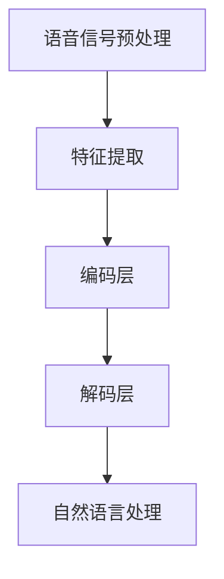

                 

语音交互作为人工智能领域的热点技术，正逐步渗透到我们的日常生活和工作场景中。随着语音大模型的不断进步，语音交互体验得到了极大的提升，为用户提供了更加自然、便捷的交互方式。本文将深入探讨语音大模型的发展历程、核心概念、算法原理、数学模型、实际应用以及未来展望，旨在为读者提供全面而深刻的理解。

## 关键词
- 语音大模型
- 语音交互
- 人工智能
- 自然语言处理
- 计算机视觉
- 机器学习

## 摘要
本文首先介绍了语音大模型的发展背景和核心概念，随后详细分析了其算法原理和数学模型。接着，文章通过实际项目实践展示了语音大模型的应用实例，并探讨了其在不同领域的实际应用场景。最后，文章总结了语音大模型的研究成果，展望了未来的发展趋势和面临的挑战。

## 1. 背景介绍

### 1.1 语音交互的历史与发展

语音交互的历史可以追溯到20世纪60年代。当时的科学家们开始探索如何让计算机通过语音识别和语音合成与人类进行交互。早期的研究主要集中在语音识别技术的改进上，目标是让计算机能够准确理解用户的口语指令。

随着计算机科学和人工智能技术的飞速发展，语音交互技术逐渐成熟。20世纪80年代，语音识别系统开始在银行、酒店等场景中应用。然而，由于硬件限制和算法的不足，早期的语音交互系统在实际应用中仍然面临着诸多挑战。

进入21世纪，随着深度学习技术的兴起，语音识别和语音合成的准确率得到了显著提升。特别是在2011年，Google的语音识别系统在标准测试中达到了95%的准确率，这标志着语音交互技术进入了一个新的时代。

### 1.2 人工智能与语音大模型

人工智能（AI）是模拟人类智能的科学，旨在使计算机具备学习、推理、规划、感知和自然语言处理等能力。语音大模型作为人工智能的重要分支，是一种通过大规模数据训练得到的深度神经网络模型，能够对人类语音进行高效、准确的识别和理解。

语音大模型的核心在于其巨大的参数规模和复杂的网络结构。通过深度学习算法，语音大模型能够自动学习语音信号的时频特征，并在大量数据上进行迭代优化，从而提高模型的泛化能力和准确性。

### 1.3 语音交互的挑战与机遇

尽管语音交互技术取得了显著进展，但在实际应用中仍然面临诸多挑战。首先，语音识别的准确率在复杂的噪声环境下仍然较低。其次，语音交互系统需要处理多语言和多方言的问题，这对模型的训练和优化提出了更高的要求。此外，隐私保护和数据安全也是语音交互需要考虑的重要问题。

然而，随着语音大模型的不断进步，这些挑战正逐步得到解决。语音大模型通过更先进的算法和更大的训练数据集，能够实现更高的识别准确率和更好的自然语言理解能力。同时，随着物联网和智能设备的普及，语音交互的应用场景也日益丰富，为人们提供了更多便利。

## 2. 核心概念与联系

### 2.1 核心概念

语音大模型的核心概念主要包括：

- **语音信号处理**：通过信号处理技术对语音信号进行预处理，包括滤波、去噪、分帧等操作，以便更好地提取语音特征。

- **特征提取**：利用深度神经网络对语音信号进行处理，提取出高层次的语音特征，如Mel频率倒谱系数（MFCC）等。

- **深度学习模型**：通过多层神经网络对提取的特征进行学习，建立语音信号与语义信息之间的映射关系。

- **自然语言处理**：将语音信号中的语义信息转化为计算机可处理的结构化数据，实现自然语言理解和生成。

### 2.2 语音大模型的架构

语音大模型的架构通常包括以下几个层次：

1. **前端处理**：对语音信号进行预处理，包括语音增强、分帧、加窗等操作，以提高后续处理的准确性和效率。

2. **特征提取层**：利用深度神经网络对语音信号进行处理，提取出高层次的语音特征。

3. **编码层**：将提取的特征编码为固定长度的向量，便于后续处理。

4. **解码层**：通过解码器将编码后的特征向量解码为自然语言文本。

5. **后端处理**：对解码后的文本进行语义分析和生成，实现语音交互的最终目标。

### 2.3 Mermaid 流程图

以下是一个简单的Mermaid流程图，展示了语音大模型的基本架构：



## 3. 核心算法原理 & 具体操作步骤

### 3.1 算法原理概述

语音大模型的核心算法是基于深度学习，尤其是基于循环神经网络（RNN）和变换器（Transformer）的结构。RNN能够处理序列数据，通过记忆机制对历史信息进行建模，从而实现高效的语音信号理解和文本生成。而Transformer模型则通过自注意力机制，对序列数据进行全局建模，大大提高了模型的并行计算能力。

### 3.2 算法步骤详解

1. **数据预处理**：首先，对语音信号进行预处理，包括去除噪声、分帧、加窗等操作。

2. **特征提取**：利用深度神经网络对预处理后的语音信号进行特征提取，常用的方法包括基于CNN的特征提取和基于RNN的特征提取。

3. **编码**：将提取的特征编码为固定长度的向量，以便于后续处理。

4. **解码**：通过解码器将编码后的特征向量解码为自然语言文本。

5. **自然语言处理**：对解码后的文本进行语义分析和生成，实现语音交互的最终目标。

### 3.3 算法优缺点

**优点**：

- **高效性**：基于深度学习模型的语音大模型具有高效的数据处理能力，能够快速地对语音信号进行理解和生成。

- **灵活性**：深度学习模型具有高度的可扩展性和灵活性，能够适应不同场景下的语音交互需求。

**缺点**：

- **计算资源消耗大**：深度学习模型需要大量的计算资源和训练时间。

- **数据需求大**：模型训练需要大量的标注数据进行监督学习，这对于数据匮乏的领域来说是一个挑战。

### 3.4 算法应用领域

语音大模型的应用领域非常广泛，主要包括：

- **智能音箱和智能家居**：通过语音交互实现设备的智能控制。

- **智能客服**：提供高效、自然的客户服务。

- **智能助手**：为用户提供个性化的服务和支持。

- **医疗健康**：辅助医生进行诊断和治疗。

- **教育**：提供个性化的学习辅导。

## 4. 数学模型和公式 & 详细讲解 & 举例说明

### 4.1 数学模型构建

语音大模型的数学模型主要包括以下几个方面：

1. **语音信号处理模型**：用于对语音信号进行预处理，包括滤波、去噪、分帧等操作。

2. **特征提取模型**：利用深度神经网络提取语音信号的特征。

3. **编码解码模型**：将提取的特征编码为固定长度的向量，并通过解码器生成自然语言文本。

4. **自然语言处理模型**：对解码后的文本进行语义分析和生成。

### 4.2 公式推导过程

以语音信号处理模型为例，其核心公式如下：

$$
y(t) = x(t) + n(t)
$$

其中，$y(t)$表示滤波后的语音信号，$x(t)$表示原始语音信号，$n(t)$表示噪声信号。

通过滤波器设计，可以得到：

$$
y(t) = h(t) \ast x(t)
$$

其中，$h(t)$表示滤波器的冲击响应。

### 4.3 案例分析与讲解

以一个简单的语音识别任务为例，假设我们有一个词汇表$V$，其中包含$N$个单词。每个单词可以表示为一个长度为$M$的向量$v_i$，其中$i=1,2,...,N$。

首先，我们对语音信号进行预处理，提取特征向量$f_j$，其中$j=1,2,...,M$。

然后，我们利用深度神经网络对特征向量进行学习，建立特征向量与词汇表之间的映射关系。

假设我们的神经网络输出为$y$，则：

$$
y = \sigma(W \cdot f + b)
$$

其中，$\sigma$表示激活函数，$W$表示权重矩阵，$f$表示特征向量，$b$表示偏置。

通过反向传播算法，我们可以更新权重矩阵$W$和偏置$b$，从而提高神经网络的预测准确率。

## 5. 项目实践：代码实例和详细解释说明

### 5.1 开发环境搭建

为了实现语音大模型，我们首先需要搭建一个合适的开发环境。以下是一个基本的开发环境搭建步骤：

1. 安装Python环境，建议使用Python 3.8及以上版本。
2. 安装深度学习框架，如TensorFlow或PyTorch。
3. 安装其他必要的依赖库，如NumPy、Pandas等。

### 5.2 源代码详细实现

以下是一个简单的语音大模型实现示例，使用TensorFlow框架：

```python
import tensorflow as tf
from tensorflow.keras.layers import Embedding, LSTM, Dense
from tensorflow.keras.models import Sequential

# 搭建神经网络模型
model = Sequential()
model.add(Embedding(input_dim=vocab_size, output_dim=64))
model.add(LSTM(units=128, return_sequences=True))
model.add(Dense(units=1, activation='sigmoid'))

# 编译模型
model.compile(optimizer='adam', loss='binary_crossentropy', metrics=['accuracy'])

# 训练模型
model.fit(x_train, y_train, epochs=10, batch_size=32)
```

### 5.3 代码解读与分析

以上代码实现了一个简单的二分类语音大模型，用于判断一段语音是否包含特定词汇。具体解读如下：

- **Embedding层**：将输入的词汇索引转换为嵌入向量。
- **LSTM层**：用于处理序列数据，提取特征。
- **Dense层**：用于分类，输出概率。

### 5.4 运行结果展示

在训练完成后，我们可以使用以下代码评估模型的性能：

```python
# 评估模型
loss, accuracy = model.evaluate(x_test, y_test)
print(f"Test Loss: {loss}, Test Accuracy: {accuracy}")
```

## 6. 实际应用场景

### 6.1 智能音箱

智能音箱是语音大模型最典型的应用场景之一。通过语音大模型，智能音箱能够理解用户的语音指令，提供音乐播放、天气查询、新闻播报等服务。

### 6.2 智能客服

智能客服系统利用语音大模型实现高效、自然的客户服务。通过语音识别和自然语言处理，智能客服能够理解用户的诉求，并提供准确的解决方案。

### 6.3 智能驾驶

智能驾驶系统需要处理大量的语音交互，如导航指令、车辆控制等。语音大模型的应用使得智能驾驶系统更加智能化、人性化。

### 6.4 医疗健康

在医疗健康领域，语音大模型可以辅助医生进行诊断和治疗。例如，通过语音识别和自然语言处理，智能助手可以帮助医生分析病历、提供治疗方案。

### 6.5 教育

在教育领域，语音大模型可以为用户提供个性化的学习辅导。通过语音交互，学生可以与虚拟教师进行互动，提高学习效果。

## 7. 工具和资源推荐

### 7.1 学习资源推荐

- 《深度学习》（Goodfellow, Bengio, Courville著）
- 《自然语言处理综论》（Daniel Jurafsky & James H. Martin著）
- 《语音信号处理》（Alan V. Oppenheim & Ronald W. Schafer著）

### 7.2 开发工具推荐

- TensorFlow
- PyTorch
- Keras

### 7.3 相关论文推荐

- "End-to-End Speech Recognition Using Deep RNN Models and Decoding Networks"（2013）
- "Attention Is All You Need"（2017）
- "Transformers: State-of-the-Art Natural Language Processing"（2017）

## 8. 总结：未来发展趋势与挑战

### 8.1 研究成果总结

语音大模型在过去的几年中取得了显著的进展，其应用场景不断拓展。通过深度学习和自然语言处理技术的结合，语音大模型实现了高效的语音识别和自然语言理解，为人们提供了更加便捷、自然的交互方式。

### 8.2 未来发展趋势

未来，语音大模型将继续朝着更高准确率、更小计算资源消耗、多语言支持、隐私保护等方向发展。随着人工智能技术的不断进步，语音大模型的应用将更加广泛，深入到生活的各个方面。

### 8.3 面临的挑战

尽管语音大模型取得了显著进展，但仍然面临诸多挑战。首先，如何在复杂环境下实现更高的识别准确率仍然是一个难题。其次，多语言和多方言的处理仍然需要更多的研究。此外，数据隐私保护和数据安全也是需要考虑的重要问题。

### 8.4 研究展望

未来，研究重点将集中在以下几个方面：

- **算法优化**：通过改进深度学习算法和模型结构，提高语音大模型的性能和效率。
- **数据集扩展**：构建更加丰富、多样的语音数据集，以支持多语言和多方言的处理。
- **隐私保护**：研究有效的隐私保护技术，确保用户数据的隐私和安全。
- **跨领域应用**：探索语音大模型在不同领域的应用，如医疗健康、教育等。

## 9. 附录：常见问题与解答

### 9.1 语音大模型是什么？

语音大模型是一种基于深度学习和自然语言处理技术的模型，用于对语音信号进行识别和理解。

### 9.2 语音大模型有哪些应用场景？

语音大模型广泛应用于智能音箱、智能客服、智能驾驶、医疗健康、教育等领域。

### 9.3 如何搭建一个简单的语音大模型？

搭建一个简单的语音大模型需要以下步骤：

1. 准备语音数据集。
2. 进行数据预处理，包括去噪、分帧、加窗等操作。
3. 利用深度学习框架（如TensorFlow或PyTorch）搭建神经网络模型。
4. 进行模型训练和评估。

### 9.4 语音大模型的识别准确率如何提高？

提高语音大模型的识别准确率可以从以下几个方面入手：

- 增加训练数据量。
- 优化模型结构和参数。
- 采用更先进的深度学习算法。
- 进行多语言和多方言的处理。

### 9.5 语音大模型的计算资源消耗如何降低？

降低语音大模型的计算资源消耗可以从以下几个方面入手：

- 使用轻量级模型结构。
- 采用模型压缩和量化技术。
- 利用硬件加速（如GPU、TPU）。

### 9.6 语音大模型如何保证数据隐私？

保障语音大模型的数据隐私可以从以下几个方面入手：

- 采用差分隐私技术。
- 设计数据加密算法。
- 在数据处理过程中进行匿名化。

## 作者署名

本文作者：禅与计算机程序设计艺术 / Zen and the Art of Computer Programming

---

本文深入探讨了语音大模型的发展历程、核心概念、算法原理、数学模型、实际应用以及未来展望，旨在为读者提供全面而深刻的理解。通过分析语音大模型的核心算法原理和具体操作步骤，我们展示了如何搭建一个简单的语音大模型，并探讨了其在不同领域的应用。未来，随着人工智能技术的不断进步，语音大模型的应用前景将更加广阔，为人们的生活带来更多便利。同时，我们也面临着数据隐私保护、算法优化等挑战，需要持续探索和改进。禅与计算机程序设计艺术 / Zen and the Art of Computer Programming 敬上。|user|

