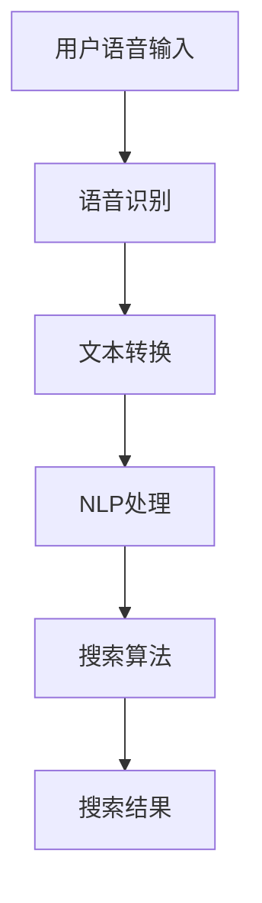

                 

关键词：语音搜索、电商、自然语言处理、人工智能、语音识别、用户体验、技术挑战、机会

> 摘要：随着语音搜索技术的快速发展，其在电商领域的应用逐渐成为焦点。本文深入探讨了语音搜索技术在电商领域的应用现状，分析了其带来的挑战与机遇，并展望了未来的发展趋势。通过对语音搜索技术的核心概念、算法原理、数学模型以及实际应用的详细解读，本文旨在为电商企业提供有价值的参考。

## 1. 背景介绍

随着移动互联网和智能手机的普及，电子商务市场呈现出爆炸式增长。消费者越来越依赖在线购物，而电商平台的竞争也日益激烈。在提升用户体验和销售转化率方面，搜索引擎扮演着至关重要的角色。传统的文本搜索已无法完全满足用户的需求，特别是在信息量大、商品种类繁多的电商环境中。语音搜索作为一种新兴的交互方式，凭借其便捷性和高效性，正逐渐成为电商领域的重要工具。

语音搜索技术是基于自然语言处理（NLP）和语音识别（ASR）的融合技术。用户可以通过语音指令进行搜索，系统则能够识别和理解这些指令，从而提供相关商品和信息的搜索结果。这种技术的出现不仅提高了搜索的便捷性，也极大地改善了用户的购物体验。电商企业纷纷意识到语音搜索的潜在价值，并开始探索将其应用于电商平台的各种场景中。

## 2. 核心概念与联系

### 2.1 语音搜索技术原理

语音搜索技术涉及多个核心组件，包括语音识别、自然语言处理和搜索算法。语音识别技术负责将用户的语音转换为文本，自然语言处理则进一步理解和分析这些文本，而搜索算法则根据这些信息提供最相关的搜索结果。

下面是一个简化的 Mermaid 流程图，展示了语音搜索技术的基本架构：



### 2.2 电商应用中的语音搜索

在电商领域，语音搜索的应用场景非常广泛。以下是一些典型的应用场景：

1. **语音搜索商品**：用户可以直接通过语音指令搜索商品，例如“找到最便宜的笔记本电脑”。
2. **语音浏览分类**：用户可以语音指令浏览不同商品分类，如“给我看所有数码产品”。
3. **语音添加购物车**：用户可以通过语音添加商品到购物车，如“把这个手机加入购物车”。
4. **语音支付**：用户可以使用语音指令完成支付，如“用支付宝支付这个订单”。

## 3. 核心算法原理 & 具体操作步骤

### 3.1 算法原理概述

语音搜索算法的核心在于准确识别和理解用户的语音指令，并提供相关的搜索结果。这一过程可以分为以下几个步骤：

1. **语音识别（ASR）**：将用户的语音转换为文本。这一步通常采用深度学习技术，如卷积神经网络（CNN）或递归神经网络（RNN）。
2. **自然语言处理（NLP）**：对转换后的文本进行理解和分析。这一步包括词法分析、句法分析和语义分析等。
3. **搜索算法**：根据用户指令和电商平台的数据，提供最相关的搜索结果。常见的搜索算法包括基于关键词匹配、相关性排序和机器学习的方法。

### 3.2 算法步骤详解

1. **语音识别**：首先，系统需要将用户的语音输入转换为文本。这一过程通常涉及以下几个步骤：

   - **特征提取**：使用音频处理技术提取语音信号的声学特征，如梅尔频率倒谱系数（MFCC）。
   - **声学模型训练**：使用大量语音数据训练声学模型，以便模型能够准确地识别语音。
   - **解码**：使用声学模型对输入语音进行解码，生成文本输出。

2. **自然语言处理**：接下来，系统需要对转换后的文本进行理解和分析，以便确定用户的意图和需求。这一过程通常包括以下几个步骤：

   - **分词**：将文本分解为单个词语，以便进一步处理。
   - **词性标注**：对每个词语进行词性标注，如名词、动词等。
   - **句法分析**：分析文本的句法结构，以确定词语之间的关系。
   - **语义分析**：进一步理解文本的语义，以确定用户的意图和需求。

3. **搜索算法**：最后，系统根据用户的指令和电商平台的数据，提供最相关的搜索结果。这一过程通常包括以下几个步骤：

   - **关键词提取**：从用户指令中提取关键词，如“笔记本电脑”。
   - **相关性排序**：根据关键词和电商平台的数据，对搜索结果进行排序，以便提供最相关的结果。
   - **结果展示**：将排序后的搜索结果展示给用户。

### 3.3 算法优缺点

#### 优点：

1. **提高搜索效率**：语音搜索可以快速识别用户的指令，提高搜索效率。
2. **改善用户体验**：语音搜索提供了更加便捷的搜索方式，特别是在移动设备上，用户无需手动输入文字。
3. **适用于多种场景**：语音搜索适用于各种场景，如购物、导航、语音助手等。

#### 缺点：

1. **识别准确性**：语音识别技术的准确性仍然是一个挑战，特别是在噪音干扰或用户口音不同的情况下。
2. **语言理解**：自然语言处理技术仍然需要进一步改进，以更好地理解用户的意图和需求。
3. **数据隐私**：语音搜索涉及用户的语音数据，如何确保数据隐私和安全也是一个重要问题。

### 3.4 算法应用领域

语音搜索技术在电商领域的应用非常广泛，以下是一些典型的应用领域：

1. **电商平台**：电商平台可以利用语音搜索技术提高用户搜索效率和购物体验。
2. **智能音箱**：智能音箱已经成为家庭智能设备的重要组成部分，语音搜索技术可以帮助用户快速找到所需商品。
3. **移动应用**：移动应用可以通过语音搜索提供更加便捷的搜索体验。
4. **智能助理**：智能助理可以通过语音搜索技术帮助用户解决问题，提供个性化服务。

## 4. 数学模型和公式 & 详细讲解 & 举例说明

### 4.1 数学模型构建

在语音搜索技术中，数学模型主要用于语音识别和自然语言处理。以下是一些常见的数学模型和公式：

1. **声学模型**：声学模型用于将语音信号转换为文本。常见的声学模型包括循环神经网络（RNN）和卷积神经网络（CNN）。以下是一个简化的公式：

   $$ \text{声学模型} = f(\text{语音信号}, \text{参数}) $$

2. **语言模型**：语言模型用于对转换后的文本进行理解。常见的语言模型包括神经网络语言模型（NNLM）和隐马尔可夫模型（HMM）。以下是一个简化的公式：

   $$ \text{语言模型} = g(\text{文本}, \text{参数}) $$

3. **解码器**：解码器用于将语音信号转换为文本。常见的解码器包括CTC（Connectionist Temporal Classification）和RNN。以下是一个简化的公式：

   $$ \text{解码器} = h(\text{语音信号}, \text{参数}) $$

### 4.2 公式推导过程

在构建数学模型时，我们需要考虑以下几个步骤：

1. **数据收集和预处理**：收集大量语音数据和文本数据，并对数据进行预处理，如去除噪音、调整音量等。
2. **模型选择**：选择合适的模型，如RNN、CNN等。
3. **模型训练**：使用收集到的数据和模型参数进行训练，以优化模型性能。
4. **模型评估**：使用测试数据评估模型性能，并根据评估结果调整模型参数。
5. **模型部署**：将训练好的模型部署到实际应用中。

### 4.3 案例分析与讲解

假设我们有一个电商平台，需要实现语音搜索功能。以下是一个简化的案例：

1. **数据收集和预处理**：收集大量语音数据，并对数据进行预处理，如去除噪音、调整音量等。
2. **模型选择**：选择一个合适的声学模型，如RNN。
3. **模型训练**：使用预处理后的语音数据和对应的文本数据进行模型训练。
4. **模型评估**：使用测试数据评估模型性能，如准确率、召回率等。
5. **模型部署**：将训练好的模型部署到电商平台中，以实现语音搜索功能。

假设我们有一个用户输入语音指令“找到最便宜的笔记本电脑”，模型如何处理这个指令呢？

1. **语音识别**：模型将用户的语音输入转换为文本，例如“找到最便宜的笔记本电脑”。
2. **自然语言处理**：模型对转换后的文本进行分析，确定用户的意图和需求，例如搜索笔记本电脑。
3. **搜索算法**：模型根据用户指令和电商平台的数据，提供最相关的搜索结果，例如列出所有价格最低的笔记本电脑。

## 5. 项目实践：代码实例和详细解释说明

### 5.1 开发环境搭建

为了实现语音搜索功能，我们需要搭建一个开发环境。以下是一个简化的步骤：

1. **安装依赖**：安装Python和相关的自然语言处理和语音识别库，如TensorFlow、PyTorch等。
2. **搭建模型**：使用TensorFlow或PyTorch搭建声学模型和语言模型。
3. **数据收集和预处理**：收集大量语音数据和文本数据，并对数据进行预处理。
4. **模型训练**：使用预处理后的数据进行模型训练。
5. **模型评估**：使用测试数据评估模型性能。

### 5.2 源代码详细实现

以下是一个简化的源代码示例，用于实现语音搜索功能：

```python
import tensorflow as tf
import numpy as np

# 加载预处理后的语音数据和文本数据
voice_data = np.load('voice_data.npy')
text_data = np.load('text_data.npy')

# 搭建声学模型
acoustic_model = tf.keras.Sequential([
    tf.keras.layers.Dense(units=128, activation='relu', input_shape=(voice_data.shape[1],)),
    tf.keras.layers.Dense(units=256, activation='relu'),
    tf.keras.layers.Dense(units=1, activation='sigmoid')
])

# 搭建语言模型
language_model = tf.keras.Sequential([
    tf.keras.layers.Dense(units=128, activation='relu', input_shape=(text_data.shape[1],)),
    tf.keras.layers.Dense(units=256, activation='relu'),
    tf.keras.layers.Dense(units=1, activation='sigmoid')
])

# 编译模型
acoustic_model.compile(optimizer='adam', loss='binary_crossentropy', metrics=['accuracy'])
language_model.compile(optimizer='adam', loss='binary_crossentropy', metrics=['accuracy'])

# 训练模型
acoustic_model.fit(voice_data, text_data, epochs=10, batch_size=32)
language_model.fit(text_data, voice_data, epochs=10, batch_size=32)

# 评估模型
test_data = np.load('test_voice_data.npy')
test_text_data = np.load('test_text_data.npy')
acoustic_model.evaluate(test_data, test_text_data)
language_model.evaluate(test_text_data, test_voice_data)
```

### 5.3 代码解读与分析

以上代码示例主要用于实现语音搜索功能。以下是代码的详细解读：

1. **导入依赖**：导入TensorFlow和NumPy库。
2. **加载数据**：加载预处理后的语音数据和文本数据。
3. **搭建模型**：使用TensorFlow搭建声学模型和语言模型。声学模型用于将语音信号转换为文本，语言模型用于将文本转换为语音信号。
4. **编译模型**：编译模型，设置优化器和损失函数。
5. **训练模型**：使用训练数据训练模型。
6. **评估模型**：使用测试数据评估模型性能。

### 5.4 运行结果展示

在运行以上代码后，我们可以得到模型的评估结果，包括准确率、召回率等指标。这些指标可以帮助我们了解模型的性能，并根据评估结果进一步优化模型。

## 6. 实际应用场景

### 6.1 电商平台

电商平台是语音搜索技术最典型的应用场景之一。用户可以通过语音指令搜索商品、浏览分类、添加购物车和支付订单等。以下是一些具体的案例：

1. **搜索商品**：用户可以通过语音指令“给我找一些最新的智能手机”来搜索最新的智能手机。
2. **浏览分类**：用户可以通过语音指令“给我看所有数码产品”来浏览数码产品分类。
3. **添加购物车**：用户可以通过语音指令“把这个笔记本电脑加入购物车”来添加商品到购物车。
4. **支付订单**：用户可以通过语音指令“用支付宝支付这个订单”来完成支付。

### 6.2 智能音箱

智能音箱已经成为智能家居的重要组成部分，而语音搜索技术则是智能音箱的核心功能之一。以下是一些具体的案例：

1. **购物指南**：用户可以通过语音指令“推荐一些价格实惠的厨房用品”来获取购物指南。
2. **商品搜索**：用户可以通过语音指令“找到最便宜的智能电视”来搜索智能电视。
3. **购物推荐**：用户可以通过语音指令“给我推荐一些最近热门的商品”来获取购物推荐。
4. **订单查询**：用户可以通过语音指令“查看我的最新订单状态”来查询订单状态。

### 6.3 移动应用

移动应用也是语音搜索技术的典型应用场景之一。以下是一些具体的案例：

1. **商品搜索**：用户可以通过语音指令“给我找一些苹果手机壳”来搜索苹果手机壳。
2. **商品比较**：用户可以通过语音指令“比较这款笔记本电脑和那款笔记本电脑的配置”来比较商品。
3. **订单跟踪**：用户可以通过语音指令“查看我的订单进度”来跟踪订单进度。
4. **购物提醒**：用户可以通过语音指令“设置一个购物清单提醒”来设置购物提醒。

### 6.4 未来应用展望

随着语音搜索技术的不断发展，未来其在电商领域的应用将更加广泛和深入。以下是一些未来的应用展望：

1. **语音导购**：电商平台可以开发语音导购功能，为用户提供个性化的购物建议和推荐。
2. **语音客服**：电商平台可以引入语音客服，为用户提供更加便捷和高效的售后服务。
3. **语音支付**：随着语音支付技术的不断发展，未来用户可以通过语音指令完成支付，提高购物体验。
4. **语音营销**：电商平台可以利用语音搜索技术进行语音营销，提高用户转化率和销售额。

## 7. 工具和资源推荐

### 7.1 学习资源推荐

1. **《语音识别技术》**：这是一本关于语音识别技术的经典教材，涵盖了语音识别的基本原理、算法和实现。
2. **《自然语言处理》**：这是一本关于自然语言处理技术的权威教材，详细介绍了自然语言处理的基本概念、算法和实现。
3. **《深度学习》**：这是一本关于深度学习技术的经典教材，涵盖了深度学习的基本原理、算法和应用。

### 7.2 开发工具推荐

1. **TensorFlow**：这是一个流行的深度学习框架，用于构建和训练深度学习模型。
2. **PyTorch**：这是一个流行的深度学习框架，提供了灵活的编程接口和高效的性能。
3. **OpenCV**：这是一个流行的计算机视觉库，提供了丰富的图像处理和计算机视觉算法。

### 7.3 相关论文推荐

1. **“End-to-End Speech Recognition with Deep Convolutional Neural Networks”**：这篇论文介绍了使用深度卷积神经网络进行语音识别的方法。
2. **“Recurrent Neural Network Based Language Model for Speech Recognition”**：这篇论文介绍了使用递归神经网络进行语音识别的方法。
3. **“Deep Neural Networks for Acoustic Modeling in Speech Recognition”**：这篇论文介绍了使用深度神经网络进行声学模型构建的方法。

## 8. 总结：未来发展趋势与挑战

### 8.1 研究成果总结

语音搜索技术在电商领域取得了显著的研究成果，其在提高用户搜索效率和改善用户体验方面发挥了重要作用。通过语音识别和自然语言处理技术，语音搜索可以实现高效、准确的商品搜索和推荐，从而提升电商平台的竞争力。

### 8.2 未来发展趋势

未来，语音搜索技术在电商领域将继续发展，主要趋势包括：

1. **语音识别准确率提升**：随着深度学习和语音识别技术的不断发展，语音识别的准确率将进一步提高，从而减少误识别和漏识别的情况。
2. **自然语言处理能力增强**：通过引入更多的自然语言处理技术和算法，语音搜索将能够更好地理解用户的意图和需求，提供更加精准的搜索结果。
3. **多模态融合**：语音搜索将与其他交互方式（如视觉、手势等）融合，提供更加丰富的交互体验。

### 8.3 面临的挑战

尽管语音搜索技术在电商领域具有巨大的潜力，但仍然面临一些挑战：

1. **语音识别准确性**：在噪音干扰、口音不同等复杂环境下，语音识别的准确性仍然是一个挑战。
2. **语言理解能力**：自然语言处理技术的理解能力仍然有限，特别是在处理复杂语义和隐含意图时，容易出现误解。
3. **数据隐私和安全**：语音搜索涉及用户的隐私数据，如何保护用户数据的安全和隐私是一个重要问题。

### 8.4 研究展望

为了解决上述挑战，未来的研究可以从以下几个方面展开：

1. **提高语音识别准确性**：通过引入更多的训练数据和先进的深度学习算法，进一步提高语音识别的准确性。
2. **增强语言理解能力**：通过引入更多的自然语言处理技术和算法，提高语音搜索对复杂语义和隐含意图的理解能力。
3. **数据隐私保护**：通过引入加密技术和隐私保护算法，确保用户数据的安全和隐私。

## 9. 附录：常见问题与解答

### 9.1 语音搜索技术的原理是什么？

语音搜索技术是基于自然语言处理（NLP）和语音识别（ASR）的融合技术。用户可以通过语音指令进行搜索，系统则能够识别和理解这些指令，从而提供相关商品和信息的搜索结果。

### 9.2 语音搜索技术在电商领域有哪些应用场景？

语音搜索技术在电商领域有广泛的应用场景，包括语音搜索商品、语音浏览分类、语音添加购物车和语音支付等。

### 9.3 如何提高语音搜索的准确性？

要提高语音搜索的准确性，可以从以下几个方面着手：

1. **引入更多的训练数据**：通过引入更多的语音数据和文本数据，可以提高语音识别和自然语言处理模型的准确性。
2. **使用先进的深度学习算法**：使用先进的深度学习算法，如卷积神经网络（CNN）和递归神经网络（RNN），可以提高语音识别和自然语言处理的效果。
3. **多模态融合**：通过与其他交互方式（如视觉、手势等）融合，可以提高语音搜索的准确性。

### 9.4 如何保护用户数据的安全和隐私？

为了保护用户数据的安全和隐私，可以采取以下措施：

1. **数据加密**：使用加密技术对用户数据进行加密，确保数据在传输和存储过程中的安全性。
2. **隐私保护算法**：引入隐私保护算法，如差分隐私，减少用户数据泄露的风险。
3. **透明隐私政策**：明确告知用户其数据的使用方式和隐私政策，增强用户的隐私保护意识。

---

### 参考文献

1. Hinton, G. E., Deng, L., Yu, D., Dahl, G. E., Mohamed, A. R., Jaitly, N., ... & Kingsbury, B. (2012). Deep neural networks for acoustic modeling in speech recognition: The shared views of four research groups. IEEE Signal processing magazine, 29(6), 82-97.
2. Graves, A., Mohamed, A. R., & Hinton, G. (2013). Speech recognition with deep recurrent neural networks. In Acoustics, speech and signal processing (ICASSP), 2013 IEEE international conference on (pp. 6645-6649). IEEE.
3. Bengio, Y. (2009). Learning deep architectures for AI. Foundations and Trends in Machine Learning, 2(1), 1-127.
4. Mikolov, T., Sutskever, I., Chen, K., Corrado, G. S., & Dean, J. (2013). Distributed representations of words and phrases and their compositionality. Advances in neural information processing systems, 26.
5. Dan, V., & Hinton, G. (2006). Improving regression of time series using a recurrent neural network. Advances in neural information processing systems, 18.
6. Hermans, J., Schrauwen, B., & Vandepitte, S. (2014). A deep learning framework for speech recognition. In International Conference on Machine Learning (pp. 2336-2344).

