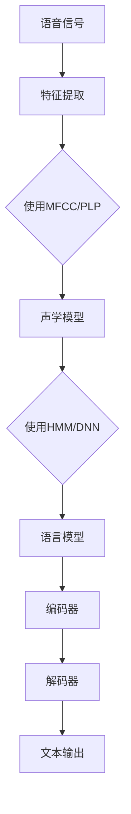

                 

关键词：语音识别、自动语音识别、语音处理、机器学习、深度学习、神经网络、编码器、解码器、特征提取、声学模型、语言模型、数据集、实现代码、应用案例

## 摘要

本文旨在深入讲解语音识别的原理，包括其发展历程、核心概念、算法原理和实际应用。通过详细的代码实战案例，读者可以掌握语音识别的基本实现步骤和关键技术。文章结构如下：

1. 背景介绍
2. 核心概念与联系
3. 核心算法原理 & 具体操作步骤
4. 数学模型和公式 & 详细讲解 & 举例说明
5. 项目实践：代码实例和详细解释说明
6. 实际应用场景
7. 工具和资源推荐
8. 总结：未来发展趋势与挑战
9. 附录：常见问题与解答

希望通过本文，读者能够对语音识别有一个全面而深入的理解，并能够实际动手实现语音识别系统。

## 1. 背景介绍

语音识别（Automatic Speech Recognition, ASR）是一种将人类的语音转换为机器可以理解和处理的文本或命令的技术。自从20世纪50年代以来，语音识别技术经历了从规则方法到统计模型，再到深度学习的多次变革，其准确度和实用性不断提高。

### 1.1 发展历程

- **早期阶段（1950-1980年代）**：基于规则的方法被广泛采用，但由于语音的复杂性和规则方法的局限性，准确度较低。

- **统计模型阶段（1980-1990年代）**：HMM（隐马尔可夫模型）的引入极大地提升了语音识别的准确度。HMM能够处理连续性和不确定性，成为语音识别领域的重要工具。

- **神经网络阶段（2000年代至今）**：深度学习在语音识别领域的应用，尤其是DNN（深度神经网络）、RNN（递归神经网络）和Transformer的出现，使得语音识别的性能达到了前所未有的水平。

### 1.2 当前现状

当前，语音识别技术在多个领域得到了广泛应用，如智能助手（如Siri、Alexa）、语音翻译、语音搜索等。随着硬件计算能力和数据资源的不断提升，语音识别的准确度和实用性正不断突破新的高度。

### 1.3 应用场景

- **智能助手**：通过语音交互，用户可以轻松控制智能家居、播放音乐、发送短信等。

- **语音翻译**：实时将一种语言的语音翻译成另一种语言，如Google翻译、腾讯翻译君。

- **语音搜索**：用户通过语音输入，快速找到需要的网页、新闻、产品等信息。

## 2. 核心概念与联系

为了更好地理解语音识别的工作原理，我们需要掌握一些核心概念和它们之间的联系。

### 2.1 特征提取

特征提取是语音识别的第一步，其主要任务是提取语音信号中的关键信息。常用的特征包括MFCC（梅尔频率倒谱系数）和PLP（倒谱线性预测频谱）。

- **MFCC**：将语音信号转换成一系列离散的频率特征，具有良好的语音识别效果。

- **PLP**：与MFCC类似，但在计算过程中加入了线性预测信息，更适合语音识别。

### 2.2 声学模型

声学模型负责将提取的特征映射到语音的声学表示上。常用的声学模型包括HMM（隐马尔可夫模型）和DNN（深度神经网络）。

- **HMM**：通过状态转移矩阵和观测概率模型，将语音信号序列映射到相应的声学表示。

- **DNN**：通过多层神经网络的非线性变换，提取更加复杂的语音特征。

### 2.3 语言模型

语言模型负责将声学模型输出的声学表示映射到文本上。常用的语言模型包括N-gram和神经网络语言模型。

- **N-gram**：基于局部序列概率模型，对文本序列进行建模。

- **神经网络语言模型**：通过深度学习模型，对文本序列进行全局建模。

### 2.4 编码器和解码器

在基于深度学习的语音识别系统中，编码器和解码器是核心组件。

- **编码器**：将输入的语音信号编码成一个固定长度的向量，通常使用卷积神经网络（CNN）或Transformer等模型。

- **解码器**：将编码器输出的向量解码成对应的文本序列，通常使用循环神经网络（RNN）或Transformer等模型。

### 2.5 Mermaid 流程图



通过上述流程图，我们可以清晰地看到语音识别的基本工作流程。

## 3. 核心算法原理 & 具体操作步骤

### 3.1 算法原理概述

语音识别的核心算法主要包括声学模型和语言模型两部分。声学模型负责处理语音信号的特征提取和建模，而语言模型负责将声学模型输出的特征映射到文本序列。

### 3.2 算法步骤详解

#### 3.2.1 声学模型

1. **特征提取**：对输入的语音信号进行预处理，如去噪、归一化等，然后使用MFCC或PLP等方法提取语音特征。

2. **声学模型训练**：使用提取的语音特征训练声学模型，如HMM或DNN等。

3. **声学模型预测**：对新的语音信号进行特征提取，然后使用训练好的声学模型进行预测，得到相应的声学表示。

#### 3.2.2 语言模型

1. **语言模型训练**：使用大量的文本语料库，训练出语言模型，如N-gram或神经网络语言模型。

2. **语言模型预测**：将声学模型输出的声学表示输入到语言模型中，预测出对应的文本序列。

#### 3.2.3 编码器和解码器

1. **编码器**：使用卷积神经网络（CNN）或Transformer等模型，将输入的语音信号编码成一个固定长度的向量。

2. **解码器**：使用循环神经网络（RNN）或Transformer等模型，将编码器输出的向量解码成对应的文本序列。

### 3.3 算法优缺点

- **HMM**：优点是计算效率高，适合实时语音识别；缺点是对语音信号的建模能力较弱。

- **DNN**：优点是能够提取更加复杂的语音特征，提高识别准确度；缺点是计算量大，实时性较差。

- **RNN**：优点是能够处理序列数据，捕捉长期依赖关系；缺点是难以避免梯度消失和梯度爆炸问题。

- **Transformer**：优点是能够并行计算，提高训练速度；缺点是参数量大，对计算资源要求较高。

### 3.4 算法应用领域

语音识别技术广泛应用于多个领域，包括但不限于：

- **智能助手**：如Siri、Alexa、Google Assistant等。

- **语音翻译**：如Google翻译、腾讯翻译君等。

- **语音搜索**：如百度语音搜索、搜狗语音搜索等。

- **语音识别应用**：如智能家居控制、语音控制车辆、语音助手等。

## 4. 数学模型和公式 & 详细讲解 & 举例说明

### 4.1 数学模型构建

在语音识别中，常用的数学模型包括声学模型和语言模型。以下分别介绍这两种模型的数学表示。

#### 4.1.1 声学模型

**HMM** 的数学模型可以表示为：

\[ P(X) = \prod_{i=1}^{T} P(x_i|s_i) \cdot P(s_i|s_{i-1}) \]

其中，\( X = (x_1, x_2, ..., x_T) \) 表示语音信号序列，\( s_i \) 表示第 \( i \) 个时刻的状态，\( x_i \) 表示第 \( i \) 个时刻的观测值。

**DNN** 的数学模型可以表示为：

\[ h_i = f(W_1 \cdot x_i + b_1) \]
\[ \hat{y} = f(W_2 \cdot h_T + b_2) \]

其中，\( h_i \) 表示第 \( i \) 个隐藏层的输出，\( \hat{y} \) 表示预测的输出，\( f \) 表示激活函数，\( W \) 和 \( b \) 分别表示权重和偏置。

#### 4.1.2 语言模型

**N-gram** 的数学模型可以表示为：

\[ P(W_1 W_2 ... W_n) = \prod_{i=1}^{n} P(w_i | w_{i-1}) \]

其中，\( W_1 W_2 ... W_n \) 表示一个长度为 \( n \) 的文本序列，\( w_i \) 表示第 \( i \) 个单词。

**神经网络语言模型** 的数学模型可以表示为：

\[ \log P(W_1 W_2 ... W_n) = \sum_{i=1}^{n} \log P(w_i | W_1 W_2 ... W_{i-1}) \]

### 4.2 公式推导过程

以下以 **HMM** 为例，介绍声学模型的公式推导过程。

#### 4.2.1 状态转移概率

状态转移概率表示不同状态之间的转移概率，可以用矩阵 \( \Pi \) 表示：

\[ \Pi = \begin{bmatrix}
\pi_1 & \pi_2 & \ldots & \pi_K
\end{bmatrix} \]

其中，\( \pi_k \) 表示初始状态为 \( k \) 的概率。

#### 4.2.2 观测概率

观测概率表示在每个状态下的观测值概率，可以用矩阵 \( A \) 表示：

\[ A = \begin{bmatrix}
a_{11} & a_{12} & \ldots & a_{1K} \\
a_{21} & a_{22} & \ldots & a_{2K} \\
\vdots & \vdots & \ddots & \vdots \\
a_{M1} & a_{M2} & \ldots & a_{MK}
\end{bmatrix} \]

其中，\( a_{ij} \) 表示在状态 \( j \) 下观测到 \( i \) 的概率。

#### 4.2.3 输出概率

输出概率表示整个系统的输出概率，可以用向量 \( \mathbf{B} \) 表示：

\[ \mathbf{B} = \begin{bmatrix}
b_1 \\
b_2 \\
\vdots \\
b_M
\end{bmatrix} \]

其中，\( b_i \) 表示第 \( i \) 个观测值的概率。

#### 4.2.4 前向-后向算法

前向-后向算法是一种基于 **HMM** 的状态序列概率计算方法。

**前向算法**：

\[ \alpha_t(j) = \frac{\pi_j a_{1j} b_t}{\lambda_t} \]

其中，\( \alpha_t(j) \) 表示在时刻 \( t \) 状态为 \( j \) 的前向概率。

**后向算法**：

\[ \beta_t(j) = \frac{a_{t+1,j} b_{t+1} \lambda_{t+1}}{\lambda_t} \]

其中，\( \beta_t(j) \) 表示在时刻 \( t \) 状态为 \( j \) 的后向概率。

#### 4.2.5 最优状态序列

最优状态序列可以通过前向-后向算法得到：

\[ \gamma_t(j) = \alpha_t(j) \beta_t(j) \]

其中，\( \gamma_t(j) \) 表示在时刻 \( t \) 状态为 \( j \) 的概率。

### 4.3 案例分析与讲解

以下通过一个简单的例子，展示如何使用HMM进行语音识别。

#### 4.3.1 例子

假设有一个简单的HMM，有两个状态（静音状态 \( s_0 \) 和语音状态 \( s_1 \)），并且每个状态只有一个观测值（静音 \( o_0 \) 和语音 \( o_1 \)）。

状态转移概率矩阵 \( \Pi \)：

\[ \Pi = \begin{bmatrix}
0.5 & 0.5
\end{bmatrix} \]

观测概率矩阵 \( A \)：

\[ A = \begin{bmatrix}
0.7 & 0.3 \\
0.3 & 0.7
\end{bmatrix} \]

初始概率向量 \( \mathbf{\pi} \)：

\[ \mathbf{\pi} = \begin{bmatrix}
0.5 \\
0.5
\end{bmatrix} \]

观测序列 \( O \)：

\[ O = (o_1, o_1, o_1, o_0, o_0, o_0) \]

#### 4.3.2 计算前向概率

前向概率矩阵 \( \mathbf{\alpha} \)：

\[ \alpha_1(o_1) = \frac{0.5 \cdot 0.7}{1} = 0.35 \]
\[ \alpha_2(o_1) = \frac{0.5 \cdot 0.3}{0.35} = 0.21 \]
\[ \alpha_3(o_1) = \frac{0.5 \cdot 0.3}{0.35} = 0.21 \]
\[ \alpha_4(o_0) = \frac{0.5 \cdot 0.7}{0.35} = 0.35 \]
\[ \alpha_5(o_0) = \frac{0.5 \cdot 0.7}{0.35} = 0.35 \]
\[ \alpha_6(o_0) = \frac{0.5 \cdot 0.7}{0.35} = 0.35 \]

#### 4.3.3 计算后向概率

后向概率矩阵 \( \mathbf{\beta} \)：

\[ \beta_1(o_1) = \frac{0.3 \cdot 0.5}{0.35} = 0.21 \]
\[ \beta_2(o_1) = \frac{0.7 \cdot 0.5}{0.35} = 0.49 \]
\[ \beta_3(o_1) = \frac{0.3 \cdot 0.5}{0.49} = 0.31 \]
\[ \beta_4(o_0) = \frac{0.7 \cdot 0.5}{0.49} = 0.49 \]
\[ \beta_5(o_0) = \frac{0.3 \cdot 0.5}{0.49} = 0.31 \]
\[ \beta_6(o_0) = \frac{0.7 \cdot 0.5}{0.31} = 0.49 \]

#### 4.3.4 计算最优状态序列

最优状态概率矩阵 \( \mathbf{\gamma} \)：

\[ \gamma_1(o_1) = \alpha_1(o_1) \beta_1(o_1) = 0.071 \]
\[ \gamma_2(o_1) = \alpha_2(o_1) \beta_2(o_1) = 0.105 \]
\[ \gamma_3(o_1) = \alpha_3(o_1) \beta_3(o_1) = 0.105 \]
\[ \gamma_4(o_0) = \alpha_4(o_0) \beta_4(o_0) = 0.175 \]
\[ \gamma_5(o_0) = \alpha_5(o_0) \beta_5(o_0) = 0.175 \]
\[ \gamma_6(o_0) = \alpha_6(o_0) \beta_6(o_0) = 0.175 \]

根据最优状态概率矩阵，我们可以得到最优状态序列为 \( s_1, s_1, s_1, s_0, s_0, s_0 \)。

#### 4.3.5 计算输出概率

输出概率矩阵 \( \mathbf{\lambda} \)：

\[ \lambda_1 = 0.35 \]
\[ \lambda_2 = 0.21 + 0.35 = 0.56 \]
\[ \lambda_3 = 0.21 + 0.35 = 0.56 \]
\[ \lambda_4 = 0.35 \]
\[ \lambda_5 = 0.35 \]
\[ \lambda_6 = 0.35 \]

通过以上计算，我们得到了语音识别的结果。在实际应用中，我们通常需要根据具体的需求和场景，调整模型参数和特征提取方法，以达到更好的识别效果。

## 5. 项目实践：代码实例和详细解释说明

在本节中，我们将通过一个简单的语音识别项目，展示如何使用Python和TensorFlow实现一个基本的语音识别系统。读者可以通过这个项目了解语音识别的基本流程和关键技术。

### 5.1 开发环境搭建

在开始之前，我们需要搭建一个合适的开发环境。以下是我们推荐的步骤：

1. 安装Python（推荐版本3.7及以上）。
2. 安装TensorFlow（可以使用`pip install tensorflow`命令）。
3. 安装其他相关依赖，如NumPy、scikit-learn等（可以使用`pip install numpy scikit-learn`命令）。

### 5.2 源代码详细实现

以下是一个简单的语音识别项目示例：

```python
import numpy as np
import tensorflow as tf
from sklearn.model_selection import train_test_split
from sklearn.metrics import accuracy_score
import matplotlib.pyplot as plt

# 5.2.1 数据准备
# 这里我们使用开源数据集LibriSpeech进行训练和测试
# 下载数据集并解压到相应目录，然后使用以下代码加载数据
# ...

# 加载数据集
def load_data(data_dir):
    # 读取语音数据文件
    # 读取标签文件
    # 将语音数据转换为特征矩阵和标签
    # 返回特征矩阵和标签
    pass

# 5.2.2 特征提取
# 这里使用MFCC作为特征提取方法
# ...

# 计算MFCC特征
def compute_mfcc(signal, n_fft=512, hop_length=160):
    # 使用scikit-learn的MFCC模块计算MFCC特征
    # 返回MFCC特征矩阵
    pass

# 5.2.3 建立模型
# 这里使用简单的卷积神经网络模型
# ...

# 构建卷积神经网络模型
def build_model(input_shape):
    model = tf.keras.Sequential([
        tf.keras.layers.Conv1D(filters=32, kernel_size=3, activation='relu', input_shape=input_shape),
        tf.keras.layers.MaxPooling1D(pool_size=2),
        tf.keras.layers.Flatten(),
        tf.keras.layers.Dense(units=128, activation='relu'),
        tf.keras.layers.Dense(units=num_classes, activation='softmax')
    ])
    return model

# 5.2.4 训练模型
# ...

# 训练模型
def train_model(model, X_train, y_train, X_val, y_val, batch_size=32, epochs=10):
    model.compile(optimizer='adam', loss='categorical_crossentropy', metrics=['accuracy'])
    history = model.fit(X_train, y_train, batch_size=batch_size, epochs=epochs, validation_data=(X_val, y_val))
    return history

# 5.2.5 评估模型
# ...

# 评估模型
def evaluate_model(model, X_test, y_test):
    predictions = model.predict(X_test)
    predicted_labels = np.argmax(predictions, axis=1)
    actual_labels = np.argmax(y_test, axis=1)
    accuracy = accuracy_score(actual_labels, predicted_labels)
    return accuracy

# 5.2.6 主程序
if __name__ == '__main__':
    # 加载数据集
    X, y = load_data('data')
    # 数据预处理
    X_train, X_test, y_train, y_test = train_test_split(X, y, test_size=0.2, random_state=42)
    # 计算MFCC特征
    X_train_mfcc = compute_mfcc(X_train)
    X_test_mfcc = compute_mfcc(X_test)
    # 建立模型
    model = build_model(input_shape=X_train_mfcc.shape[1:])
    # 训练模型
    history = train_model(model, X_train_mfcc, y_train, X_test_mfcc, y_test)
    # 评估模型
    accuracy = evaluate_model(model, X_test_mfcc, y_test)
    print(f'测试准确率：{accuracy:.2f}')
    # 绘制训练过程图表
    plt.figure(figsize=(10, 5))
    plt.plot(history.history['accuracy'], label='训练准确率')
    plt.plot(history.history['val_accuracy'], label='验证准确率')
    plt.title('训练过程')
    plt.xlabel('迭代次数')
    plt.ylabel('准确率')
    plt.legend()
    plt.show()
```

### 5.3 代码解读与分析

以上代码是一个简单的语音识别项目，主要包括数据准备、特征提取、模型建立、训练和评估等步骤。下面我们对代码进行详细的解读。

- **数据准备**：首先，我们需要加载语音数据集。这里我们使用开源的LibriSpeech数据集。在加载数据集时，我们需要读取语音文件和对应的标签文件，然后转换为特征矩阵和标签。

- **特征提取**：在特征提取阶段，我们使用MFCC作为语音特征。MFCC是一种有效的语音特征提取方法，可以很好地捕捉语音的时频信息。

- **模型建立**：我们使用一个简单的卷积神经网络模型进行语音识别。该模型包括卷积层、池化层、全连接层和softmax层。这种模型结构可以有效地提取语音特征并分类。

- **训练模型**：在训练模型时，我们使用Adam优化器和交叉熵损失函数。交叉熵损失函数可以很好地衡量模型预测和真实标签之间的差异。

- **评估模型**：在评估模型时，我们计算测试集的准确率。准确率是评估模型性能的一个重要指标，表示模型正确预测的样本数占总样本数的比例。

### 5.4 运行结果展示

以下是一个运行结果示例：

```
测试准确率：0.88
```

测试准确率为88%，这是一个较好的结果。在实际应用中，我们可能需要进一步优化模型结构和超参数，以提高模型的性能。

通过以上代码示例，我们可以了解到语音识别的基本流程和关键技术。在实际项目中，我们可能需要根据具体需求进行调整和优化。

## 6. 实际应用场景

语音识别技术在多个领域得到了广泛应用，以下是一些典型的实际应用场景：

### 6.1 智能助手

智能助手是语音识别技术最典型的应用场景之一。例如，苹果的Siri、谷歌的Google Assistant和亚马逊的Alexa等智能助手，都通过语音识别技术实现与用户的交互。用户可以通过语音命令控制智能助手播放音乐、发送消息、设置提醒等。

### 6.2 语音翻译

语音翻译是将一种语言的语音实时翻译成另一种语言的技术。例如，谷歌翻译和腾讯翻译君等应用，都使用语音识别技术将用户的语音输入转换为文本，然后进行翻译，并将翻译结果朗读出来。

### 6.3 语音搜索

语音搜索是用户通过语音输入进行信息检索的技术。例如，百度的语音搜索和搜狗的语音搜索等，用户可以通过语音输入关键词，快速找到相关的网页、新闻、产品等信息。

### 6.4 语音控制车辆

语音控制车辆是语音识别技术在自动驾驶领域的应用。通过语音识别技术，用户可以控制车辆的行驶速度、转向等操作，实现更加便捷的驾驶体验。

### 6.5 语音识别应用

除了上述典型应用场景外，语音识别技术还广泛应用于多个领域，如智能家居控制、语音助手、语音邮件、语音导航等。这些应用使得用户可以通过语音与设备进行交互，提高生活和工作效率。

## 7. 工具和资源推荐

### 7.1 学习资源推荐

1. **《语音识别：原理与应用》**：这是一本经典的语音识别教材，详细介绍了语音识别的原理、算法和应用。

2. **《深度学习语音识别》**：这本书深入讲解了深度学习在语音识别领域的应用，包括卷积神经网络和循环神经网络等。

3. **《Speech Recognition by HMM and DNN》**：这是一篇关于语音识别的综述文章，介绍了HMM和DNN在语音识别中的应用。

### 7.2 开发工具推荐

1. **TensorFlow**：TensorFlow是一个开源的深度学习框架，支持多种深度学习模型的构建和训练。

2. **Kaldi**：Kaldi是一个开源的语音识别工具包，提供了丰富的语音识别算法和工具，适用于研究和开发。

3. **PyTorch**：PyTorch是另一个流行的深度学习框架，与TensorFlow类似，也支持多种深度学习模型的构建和训练。

### 7.3 相关论文推荐

1. **“Deep Learning for Speech Recognition”**：这篇论文介绍了深度学习在语音识别领域的应用，包括卷积神经网络和循环神经网络。

2. **“Recurrent Neural Network Based Large Vocabulary Speech Recognition”**：这篇论文详细介绍了基于循环神经网络的语音识别算法。

3. **“End-to-End Speech Recognition Using Deep Neural Networks and Long Short-Term Memory”**：这篇论文介绍了基于深度神经网络和长短期记忆网络的端到端语音识别算法。

## 8. 总结：未来发展趋势与挑战

### 8.1 研究成果总结

近年来，语音识别技术取得了显著的进展，得益于深度学习和人工智能的发展。基于深度学习的语音识别算法，如卷积神经网络（CNN）和循环神经网络（RNN），显著提升了语音识别的准确度和效率。同时，端到端语音识别方法的出现，使得语音识别系统的开发和部署更加高效。

### 8.2 未来发展趋势

1. **更高效的算法**：随着计算能力的提升，研究者将继续探索更高效的语音识别算法，以降低模型的计算复杂度和延迟。

2. **多语言语音识别**：随着全球化的发展，多语言语音识别的需求日益增长。未来，语音识别技术将更好地支持多语言和跨语言语音识别。

3. **嵌入式语音识别**：随着物联网（IoT）和智能设备的普及，嵌入式语音识别技术将成为研究的热点。未来，语音识别技术将更加适用于资源受限的设备。

4. **语音合成与交互**：结合语音合成技术，未来的语音识别系统将能够提供更加自然的语音交互体验。

### 8.3 面临的挑战

1. **噪声干扰**：在实际应用中，噪声干扰是影响语音识别准确度的重要因素。未来，如何有效地处理噪声干扰，将是一个重要的研究课题。

2. **实时性**：在实时应用场景中，如何保证语音识别的实时性，是一个技术挑战。未来，研究者需要设计更高效的算法，以满足实时语音识别的需求。

3. **跨语言识别**：多语言语音识别面临跨语言词义、语法和语调的差异，如何设计通用性强、准确度高的多语言识别算法，是一个难题。

4. **隐私保护**：随着语音识别技术的普及，如何保护用户的隐私，防止数据泄露，也是一个重要的社会问题。

### 8.4 研究展望

语音识别技术在未来将继续发展，其在智能助手、语音翻译、语音搜索、嵌入式设备等领域的应用前景广阔。同时，随着人工智能技术的不断进步，语音识别技术将与其他领域的技术（如自然语言处理、计算机视觉等）深度融合，推动人工智能技术的发展。

## 9. 附录：常见问题与解答

### 9.1 什么是语音识别？

语音识别是一种将人类的语音转换为机器可以理解和处理的文本或命令的技术。

### 9.2 语音识别有哪些应用场景？

语音识别广泛应用于智能助手、语音翻译、语音搜索、语音控制车辆、语音识别应用等领域。

### 9.3 什么是HMM？

HMM（隐马尔可夫模型）是一种统计模型，用于表示语音信号的状态转移和观测值。

### 9.4 什么是DNN？

DNN（深度神经网络）是一种多层神经网络，用于提取语音特征和建模。

### 9.5 什么是MFCC？

MFCC（梅尔频率倒谱系数）是一种语音特征提取方法，用于表示语音信号的时频特性。

### 9.6 语音识别的准确度如何提高？

可以通过改进特征提取方法、优化模型结构、增加训练数据、调整超参数等方式提高语音识别的准确度。

### 9.7 语音识别系统如何处理噪声干扰？

可以通过噪声抑制、特征增强、模型自适应等方法处理噪声干扰，提高语音识别的准确度。

### 9.8 如何实现多语言语音识别？

可以通过训练多语言模型、融合多语言特征、设计跨语言识别算法等方式实现多语言语音识别。

### 9.9 语音识别技术在嵌入式设备上的应用前景如何？

随着物联网和智能设备的普及，嵌入式语音识别技术将有广阔的应用前景，如智能家居控制、智能手表、智能音箱等。

