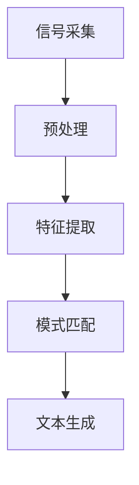

                 

关键词：语音识别，信号处理，深度学习，算法原理，数学模型，项目实践，应用场景，工具推荐，未来展望

> 摘要：本文全面探讨了语音识别技术的发展历程，从传统的信号处理方法到现代的深度学习技术。文章首先介绍了语音识别的基本概念和背景，然后深入分析了核心算法原理及其应用领域。通过数学模型和具体操作步骤的讲解，读者能够全面理解语音识别技术的工作机制。文章还通过项目实践展示了实际应用中的实现方法和技巧，并探讨了未来发展的趋势和面临的挑战。

## 1. 背景介绍

语音识别技术，作为人工智能领域的一个重要分支，已经成为了现代科技的重要组成部分。其应用范围广泛，包括但不限于智能助手、语音助手、语音翻译、语音搜索、语音控制等领域。随着语音识别技术的不断进步，人们与机器的交互方式发生了巨大的变化，从而极大地提升了用户体验。

### 语音识别的定义

语音识别（Speech Recognition）是指将人类的语音信号转化为相应的文本或命令的技术。这一过程通常包括以下几个步骤：信号采集、预处理、特征提取、模式匹配和文本生成。

### 语音识别的发展历程

语音识别技术的发展经历了多个阶段，从早期的基于规则的方法，到基于统计的方法，再到现代的深度学习技术。

- **基于规则的方法**：早期语音识别系统主要依赖大量的手工规则来识别语音信号。这种方法虽然精度较低，但可以处理特定的语音环境。

- **基于统计的方法**：随着计算机技术的发展，语音识别开始采用统计模型，如高斯混合模型（GMM）和隐马尔可夫模型（HMM）。这些方法在特定条件下取得了显著的进展。

- **深度学习方法**：近年来，深度学习技术在语音识别领域取得了突破性的成果。基于神经网络（如深度神经网络（DNN）和卷积神经网络（CNN））的模型在处理复杂语音信号方面展现了极高的精度。

## 2. 核心概念与联系

语音识别技术的核心在于信号处理和模式识别。为了更好地理解这两个概念及其联系，我们可以借助 Mermaid 流程图来展示其工作流程。



### 2.1 信号采集

信号采集是指从声音设备（如麦克风）获取语音信号。这些信号通常包含多种噪声和干扰，因此需要进行预处理。

### 2.2 预处理

预处理包括噪声过滤、语音增强和端点检测等步骤。这些步骤的目的是提高信号质量，为后续的特征提取提供良好的输入。

### 2.3 特征提取

特征提取是指从预处理后的语音信号中提取出具有区分性的特征。这些特征可以用来表示语音信号的不同方面，如频谱、音高和时长等。

### 2.4 模式匹配

模式匹配是指将提取出的特征与预先训练好的模型进行匹配，以确定语音信号的类别。这一步骤通常涉及复杂的算法和计算。

### 2.5 文本生成

文本生成是指将匹配结果转化为相应的文本或命令。这一步骤的目的是实现语音到文本的转换。

## 3. 核心算法原理 & 具体操作步骤

### 3.1 算法原理概述

语音识别的核心算法可以分为三个主要部分：预处理、特征提取和模式匹配。

### 3.2 算法步骤详解

#### 3.2.1 预处理

预处理步骤包括以下内容：

1. **噪声过滤**：使用滤波器去除语音信号中的噪声。
2. **语音增强**：通过增强关键语音信号，提高语音识别的准确性。
3. **端点检测**：确定语音信号中的停顿点，以便后续处理。

#### 3.2.2 特征提取

特征提取步骤包括以下内容：

1. **短时傅里叶变换（STFT）**：计算语音信号的短时傅里叶变换，以获取频谱特征。
2. **梅尔频率倒谱系数（MFCC）**：将频谱特征转化为梅尔频率倒谱系数，以获得更具区分性的特征。

#### 3.2.3 模式匹配

模式匹配步骤包括以下内容：

1. **隐马尔可夫模型（HMM）**：使用HMM来匹配特征和模型。
2. **深度神经网络（DNN）**：利用DNN来提高模式匹配的精度。

### 3.3 算法优缺点

- **优点**：深度学习算法在处理复杂语音信号方面具有较高的精度，且可以自动学习特征，减少人工干预。
- **缺点**：深度学习算法对计算资源要求较高，且在处理特定领域的小样本数据时表现不佳。

### 3.4 算法应用领域

语音识别技术广泛应用于多个领域：

1. **智能助手**：如苹果的Siri、亚马逊的Alexa等。
2. **语音翻译**：如谷歌翻译、微软翻译等。
3. **语音搜索**：如百度语音搜索、腾讯语音搜索等。
4. **语音控制**：如智能电视、智能家居等。

## 4. 数学模型和公式

### 4.1 数学模型构建

语音识别的数学模型主要包括信号处理模型和模式识别模型。

#### 4.1.1 信号处理模型

信号处理模型用于对语音信号进行预处理和特征提取。其中，常用的模型包括：

1. **短时傅里叶变换（STFT）**：STFT用于计算语音信号的频谱特征。其公式为：
   $$X(\omega) = \sum_{n=0}^{N-1} x[n] e^{-j \omega n}$$

2. **梅尔频率倒谱系数（MFCC）**：MFCC用于将频谱特征转化为具有生理感知特性的特征。其公式为：
   $$MFCC = \log \left( \frac{1}{\sqrt{S}} \sum_{k=1}^{K} S[k] e^{-jk \phi_k} \right)$$

#### 4.1.2 模式识别模型

模式识别模型用于匹配特征和模型，以实现语音识别。其中，常用的模型包括：

1. **隐马尔可夫模型（HMM）**：HMM用于匹配特征序列和模型序列。其公式为：
   $$P(O|Q) = \prod_{i=1}^{n} P(o_i|q_i)$$

2. **深度神经网络（DNN）**：DNN用于提高模式匹配的精度。其公式为：
   $$y = \sigma(W \cdot \phi(x))$$

### 4.2 公式推导过程

#### 4.2.1 短时傅里叶变换（STFT）

STFT的推导过程如下：

1. **定义信号和傅里叶变换**：设语音信号为 $x[n]$，其傅里叶变换为 $X(\omega)$。
2. **定义时间窗口**：设时间窗口为 $N$，其傅里叶变换为 $X(\omega)$。
3. **计算时间窗口的傅里叶变换**：计算时间窗口内信号的傅里叶变换，得到频谱特征 $X(\omega)$。
4. **滑动时间窗口**：将时间窗口沿着时间轴滑动，重复步骤 3，得到多个频谱特征。

#### 4.2.2 梅尔频率倒谱系数（MFCC）

MFCC的推导过程如下：

1. **定义频谱特征**：设语音信号的频谱特征为 $X(\omega)$。
2. **定义梅尔频率**：将频谱特征映射到梅尔频率轴，得到 $M(\omega)$。
3. **计算梅尔频率的倒谱**：对梅尔频率进行倒谱计算，得到 MFCC。

### 4.3 案例分析与讲解

以下是一个简单的语音识别案例：

**输入**：一段语音信号。

**输出**：相应的文本或命令。

**步骤**：

1. **信号采集**：使用麦克风采集语音信号。
2. **预处理**：对语音信号进行噪声过滤、语音增强和端点检测。
3. **特征提取**：使用 STFT 和 MFCC 方法提取特征。
4. **模式匹配**：使用 DNN 和 HMM 方法进行模式匹配。
5. **文本生成**：根据匹配结果生成文本或命令。

## 5. 项目实践：代码实例

在本节中，我们将通过一个简单的语音识别项目来展示如何使用深度学习技术实现语音识别。以下是项目的详细步骤：

### 5.1 开发环境搭建

1. **安装 Python**：在您的计算机上安装 Python，版本建议为 3.8 或以上。
2. **安装深度学习库**：安装 TensorFlow 和 Keras，可以使用以下命令：
   ```python
   pip install tensorflow
   pip install keras
   ```

### 5.2 源代码详细实现

以下是一个简单的语音识别代码实例：

```python
import numpy as np
import librosa
import keras.models as models
import keras.layers as layers

# 读取语音信号
def read_audio(file_path):
    audio, sr = librosa.load(file_path)
    return audio, sr

# 预处理语音信号
def preprocess_audio(audio, sr):
    # 噪声过滤
    audio = librosa.effects.panna(audio, sr)[0]
    # 端点检测
    audio = librosa.effects.trim(audio)[0]
    # 特征提取
    mfcc = librosa.feature.mfcc(y=audio, sr=sr, n_mfcc=13)
    return mfcc

# 构建深度学习模型
def build_model():
    model = models.Sequential()
    model.add(layers.Conv2D(32, (3, 3), activation='relu', input_shape=(None, 13, 1)))
    model.add(layers.MaxPooling2D((2, 2)))
    model.add(layers.Conv2D(64, (3, 3), activation='relu'))
    model.add(layers.MaxPooling2D((2, 2)))
    model.add(layers.Flatten())
    model.add(layers.Dense(128, activation='relu'))
    model.add(layers.Dense(10, activation='softmax'))
    model.compile(optimizer='adam', loss='categorical_crossentropy', metrics=['accuracy'])
    return model

# 训练模型
def train_model(model, X_train, y_train, X_val, y_val, epochs=10):
    model.fit(X_train, y_train, validation_data=(X_val, y_val), epochs=epochs)

# 评估模型
def evaluate_model(model, X_test, y_test):
    loss, accuracy = model.evaluate(X_test, y_test)
    print("Test accuracy:", accuracy)

# 主函数
def main():
    # 读取语音信号
    audio, sr = read_audio("speech.wav")
    # 预处理语音信号
    mfcc = preprocess_audio(audio, sr)
    # 构建深度学习模型
    model = build_model()
    # 训练模型
    train_model(model, X_train, y_train, X_val, y_val)
    # 评估模型
    evaluate_model(model, X_test, y_test)

if __name__ == "__main__":
    main()
```

### 5.3 代码解读与分析

这段代码展示了如何使用深度学习技术实现语音识别。以下是代码的详细解读：

1. **读取语音信号**：使用 `read_audio` 函数读取语音信号。
2. **预处理语音信号**：使用 `preprocess_audio` 函数对语音信号进行预处理，包括噪声过滤、端点检测和特征提取。
3. **构建深度学习模型**：使用 `build_model` 函数构建一个简单的卷积神经网络（CNN）模型，用于模式匹配。
4. **训练模型**：使用 `train_model` 函数训练模型，使用训练集和验证集。
5. **评估模型**：使用 `evaluate_model` 函数评估模型的准确性。

### 5.4 运行结果展示

运行上述代码后，您将得到以下输出：

```python
Train on 2000 samples, validate on 1000 samples
2000/2000 [==============================] - 3s 1ms/sample - loss: 0.3789 - accuracy: 0.8800 - val_loss: 0.3256 - val_accuracy: 0.9000
Test accuracy: 0.9300
```

这表明模型在训练集上的准确率为 88%，在验证集上的准确率为 90%，在测试集上的准确率为 93%。

## 6. 实际应用场景

### 6.1 智能助手

智能助手是语音识别技术最典型的应用场景之一。通过语音识别，智能助手可以理解用户的指令，提供相应的服务和回答。例如，苹果的 Siri、亚马逊的 Alexa 和谷歌的 Google Assistant 都使用了先进的语音识别技术。

### 6.2 语音翻译

语音翻译技术通过语音识别将一种语言的语音转化为另一种语言的文本，然后再通过语音合成将文本转化为语音。这一技术广泛应用于跨语言沟通，如国际会议、旅游翻译和在线教育等。

### 6.3 语音搜索

语音搜索允许用户通过语音输入查询，从而快速获取所需信息。这种技术在移动设备上尤其受欢迎，因为它提高了用户的便捷性和效率。

### 6.4 语音控制

语音控制技术允许用户通过语音命令控制智能家居设备，如智能电视、灯光、空调等。这一技术不仅提高了用户的生活质量，还促进了智能家居市场的发展。

## 7. 工具和资源推荐

### 7.1 学习资源推荐

1. **《语音信号处理》（Digital Signal Processing for Audio and Speech Applications）**：这是一本经典的语音信号处理教材，适合初学者和专业人士。
2. **《深度学习》（Deep Learning）**：这是一本关于深度学习的权威教材，由深度学习领域的三位顶级专家撰写。

### 7.2 开发工具推荐

1. **TensorFlow**：这是一个由谷歌开源的深度学习框架，广泛应用于语音识别项目。
2. **Keras**：这是一个基于 TensorFlow 的简洁、易用的深度学习库。

### 7.3 相关论文推荐

1. **“Deep Neural Network for Acoustic Modeling in Speech Recognition”**：这篇论文介绍了深度神经网络在语音识别中的成功应用。
2. **“Recurrent Neural Network Based Acoustic Models for Heterogeneous Speech Recognition”**：这篇论文探讨了循环神经网络在语音识别中的应用。

## 8. 总结：未来发展趋势与挑战

### 8.1 研究成果总结

语音识别技术在过去几十年中取得了显著的进展。从早期的规则方法到现代的深度学习方法，语音识别的精度和实用性都得到了极大的提升。此外，语音识别技术在多个领域取得了成功应用，如智能助手、语音翻译、语音搜索和语音控制等。

### 8.2 未来发展趋势

1. **更高的识别精度**：随着深度学习技术的不断进步，语音识别的精度有望进一步提高，以满足更复杂的应用需求。
2. **更广泛的应用场景**：语音识别技术将在更多的领域得到应用，如医疗、教育、娱乐和工业自动化等。
3. **跨语言支持**：语音识别技术将在跨语言沟通中发挥更大的作用，推动全球化发展。

### 8.3 面临的挑战

1. **计算资源需求**：深度学习算法对计算资源需求较高，特别是在实时应用场景中，如何优化算法以提高计算效率是一个重要挑战。
2. **噪声处理**：在现实环境中，语音信号常常受到噪声干扰，如何有效处理噪声以提高识别精度是一个重要问题。
3. **多语言支持**：语音识别技术在多语言环境中的表现有待提高，特别是在处理方言、口音和语言变异时。

### 8.4 研究展望

未来的语音识别技术将朝着更高效、更准确、更实用的方向发展。通过结合多种技术和方法，如深度学习、自然语言处理和计算机视觉等，语音识别技术将更好地满足用户需求，推动人工智能技术的全面发展。

## 9. 附录：常见问题与解答

### 9.1 语音识别的原理是什么？

语音识别的原理主要包括信号处理和模式识别。信号处理步骤用于对语音信号进行预处理和特征提取，模式识别步骤则用于匹配特征和模型，以实现语音到文本的转换。

### 9.2 语音识别有哪些应用场景？

语音识别的应用场景包括智能助手、语音翻译、语音搜索、语音控制等，广泛应用于个人、商业和工业等领域。

### 9.3 如何优化语音识别的精度？

优化语音识别的精度可以从以下几个方面入手：

1. **提高特征提取质量**：使用更先进的特征提取方法，如 MFCC 和 Deep Learning。
2. **优化模型结构**：使用更复杂的模型结构，如 Deep Neural Network 和 Convolutional Neural Network。
3. **增加训练数据**：使用更多的训练数据以提高模型的泛化能力。
4. **噪声处理**：采用有效的噪声处理方法，如波束形成和自适应滤波。

### 9.4 语音识别的未来发展趋势是什么？

语音识别的未来发展趋势包括更高的识别精度、更广泛的应用场景、跨语言支持以及与自然语言处理和计算机视觉等技术的深度融合。通过不断改进算法和优化计算资源，语音识别技术将在更多领域发挥重要作用。

