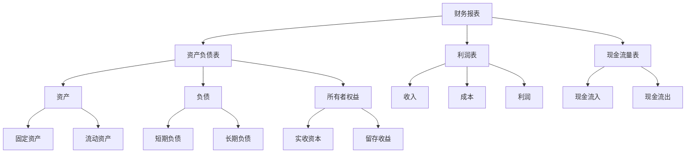

                 

在现代社会中，财务管理已经成为企业管理中不可或缺的一部分。然而，对于许多非财务经理来说，财务知识可能并不在他们的核心技能范围内。这并不意味着他们可以忽视财务管理的重要性。事实上，对于非财务经理来说，了解财务管理的基本原理和工具，不仅能够帮助他们更好地理解公司的财务状况，还能够提高他们的决策能力，从而为公司的长期成功做出贡献。

本文旨在为非财务经理提供一份全面而实用的财务管理指南，帮助他们更好地理解财务管理的基本概念、工具和方法。我们将从财务管理的背景介绍开始，逐步深入到核心概念、算法原理、数学模型、项目实践、应用场景和未来展望等多个方面。

## 文章关键词

- 财务管理
- 非财务经理
- 财务知识
- 决策能力
- 企业管理
- 财务工具
- 财务分析
- 投资决策

## 文章摘要

本文将探讨财务管理对非财务经理的重要性，并介绍财务管理的基本概念、工具和方法。通过本文的阅读，非财务经理将能够更好地理解公司的财务状况，提高决策能力，从而为公司的长期成功做出贡献。文章还将探讨财务管理的未来发展趋势和面临的挑战。

## 1. 背景介绍

财务管理作为企业管理的一个重要组成部分，其重要性不言而喻。财务管理的目标是通过合理配置和运用资金，实现企业的价值最大化。对于非财务经理来说，财务管理不仅仅是财务部门的事情，它直接关系到企业的运营效率和竞争力。

首先，财务管理能够帮助非财务经理更好地理解公司的财务状况。通过财务报表和分析，非财务经理可以了解公司的盈利能力、偿债能力和成长能力，从而为决策提供依据。

其次，财务管理能够提高非财务经理的决策能力。在投资、融资和运营等关键决策中，财务知识能够帮助非财务经理进行成本效益分析，评估风险和回报，从而做出更明智的决策。

最后，财务管理有助于提高企业的整体竞争力。通过有效的财务管理，企业可以降低成本，提高资产利用率，从而在激烈的市场竞争中占据优势。

## 2. 核心概念与联系

在深入探讨财务管理之前，我们需要了解一些核心概念和它们之间的关系。以下是一个简单的 Mermaid 流程图，用于描述这些概念及其相互关系：



### 2.1 财务报表

财务报表是企业财务状况的全面反映，包括资产负债表、利润表和现金流量表。

- **资产负债表**：反映企业在某一特定时点的财务状况，包括资产、负债和所有者权益。
- **利润表**：反映企业在一定时期内的经营成果，包括收入、成本和利润。
- **现金流量表**：反映企业在一定时期内的现金流入和流出情况。

### 2.2 资产

资产是企业拥有或控制的资源，预期会给企业带来经济利益。资产分为流动资产和非流动资产。

- **流动资产**：包括货币资金、应收账款、存货等，通常在一年内可以转化为现金。
- **非流动资产**：包括固定资产、长期投资、无形资产等，通常在一年以上才能转化为现金。

### 2.3 负债

负债是企业承担的现时义务，预期会导致经济利益流出企业。负债分为流动负债和长期负债。

- **流动负债**：包括应付账款、短期借款等，通常在一年内需要偿还。
- **长期负债**：包括长期借款、长期应付款等，通常在一年以上需要偿还。

### 2.4 所有者权益

所有者权益是企业资产扣除负债后的剩余权益，即企业净资产。所有者权益包括实收资本、资本公积、盈余公积和未分配利润。

### 2.5 收入、成本和利润

收入是企业日常活动中形成的、会导致所有者权益增加的、与所有者投入资本无关的经济利益的总流入。成本是企业为了生产产品、提供劳务等所发生的各种耗费。利润是企业在一定时期内的经营成果，是收入减去成本后的余额。

## 3. 核心算法原理 & 具体操作步骤

### 3.1 算法原理概述

财务管理的核心在于对财务数据进行分析和处理，以支持企业的决策。以下是一些常用的核心算法原理：

- **财务比率分析**：通过计算和分析企业的财务比率，评估企业的财务状况和经营能力。
- **成本效益分析**：评估一项决策的成本和收益，以确定其经济可行性。
- **风险评估**：评估企业的风险水平，制定相应的风险管理和应对策略。

### 3.2 算法步骤详解

#### 3.2.1 财务比率分析

财务比率分析包括以下步骤：

1. 收集财务数据：获取企业的资产负债表、利润表和现金流量表等财务报表。
2. 计算财务比率：计算企业的流动比率、速动比率、负债比率、盈利能力比率等。
3. 分析财务比率：对计算出的财务比率进行分析，评估企业的财务状况和经营能力。

#### 3.2.2 成本效益分析

成本效益分析包括以下步骤：

1. 确定决策项目：明确需要评估的决策项目。
2. 收集相关数据：收集与决策项目相关的成本和收益数据。
3. 计算净现值（NPV）或内部收益率（IRR）：使用适当的财务模型计算项目的NPV或IRR。
4. 分析结果：根据计算结果，评估项目的经济可行性。

#### 3.2.3 风险评估

风险评估包括以下步骤：

1. 识别风险：识别企业可能面临的各种风险。
2. 评估风险：评估每种风险的严重程度和概率。
3. 制定风险管理策略：根据风险评估结果，制定相应的风险管理和应对策略。

### 3.3 算法优缺点

#### 3.3.1 财务比率分析的优点

- **全面性**：通过计算多个财务比率，能够全面评估企业的财务状况和经营能力。
- **简便性**：计算简单，易于理解和应用。

#### 3.3.1 财务比率分析的缺点

- **局限性**：财务比率分析只能反映企业的历史表现，无法预测未来的趋势。
- **数据质量**：依赖于财务数据的准确性和完整性。

#### 3.3.2 成本效益分析的优点

- **科学性**：基于数学模型和财务原理，能够客观地评估项目的经济可行性。
- **预测性**：能够预测项目的未来表现，为决策提供依据。

#### 3.3.2 成本效益分析的缺点

- **复杂性**：计算过程相对复杂，需要一定的财务知识和技能。
- **数据依赖性**：依赖于准确的成本和收益数据，可能导致评估结果的不准确。

#### 3.3.3 风险评估的优点

- **预见性**：能够预见企业可能面临的风险，提前制定应对策略。
- **灵活性**：根据风险变化，可以随时调整风险管理策略。

#### 3.3.3 风险评估的缺点

- **主观性**：风险评估过程中存在一定程度的主观判断，可能导致评估结果的不准确。
- **时间成本**：风险评估需要耗费一定的时间和人力资源。

### 3.4 算法应用领域

#### 3.4.1 财务比率分析

- **企业内部管理**：用于评估企业的财务状况和经营能力。
- **投资决策**：用于评估企业的投资价值和风险。
- **绩效考核**：用于评估员工的绩效。

#### 3.4.2 成本效益分析

- **项目投资**：用于评估项目的经济可行性。
- **运营管理**：用于优化企业的运营成本。
- **预算编制**：用于制定企业的预算计划。

#### 3.4.3 风险评估

- **企业风险管理**：用于识别和评估企业面临的风险。
- **投资决策**：用于评估项目的风险水平。
- **业务扩张**：用于评估企业扩张的风险和收益。

## 4. 数学模型和公式 & 详细讲解 & 举例说明

### 4.1 数学模型构建

在财务管理中，数学模型是分析和决策的重要工具。以下是一个简单的财务决策模型：

$$
\text{NPV} = \sum_{t=1}^{n} \frac{\text{CF}_t}{(1 + \text{r})^t}
$$

其中，NPV 是净现值（Net Present Value），CF_t 是第 t 年的现金流，r 是折现率，n 是项目年限。

### 4.2 公式推导过程

净现值的推导基于时间价值原理，即未来现金流需要折现到当前价值。假设有一笔未来现金流 CF_t，在折现率为 r 的情况下，其现值为：

$$
\text{PV}_t = \frac{\text{CF}_t}{(1 + \text{r})^t}
$$

因此，整个项目的净现值为所有未来现金流折现到当前的总和：

$$
\text{NPV} = \sum_{t=1}^{n} \text{PV}_t = \sum_{t=1}^{n} \frac{\text{CF}_t}{(1 + \text{r})^t}
$$

### 4.3 案例分析与讲解

假设一个项目的预计现金流量如下表：

| 年份 | 现金流量 (万元) |
| ---- | ------------ |
| 1    | 100          |
| 2    | 150          |
| 3    | 200          |
| 4    | 250          |
| 5    | 300          |

假设折现率 r 为 10%，则该项目的净现值计算如下：

$$
\text{NPV} = \frac{100}{(1 + 0.1)^1} + \frac{150}{(1 + 0.1)^2} + \frac{200}{(1 + 0.1)^3} + \frac{250}{(1 + 0.1)^4} + \frac{300}{(1 + 0.1)^5}
$$

$$
\text{NPV} = 90.91 + 134.93 + 176.11 + 194.44 + 231.54 = 847.03 \text{ 万元}
$$

由于 NPV 大于零，该项目在经济上是可行的。

## 5. 项目实践：代码实例和详细解释说明

### 5.1 开发环境搭建

为了演示财务管理的实际应用，我们将使用 Python 编写一个简单的财务模型。首先，确保您的系统中已经安装了 Python 和相关库，如 NumPy 和 pandas。以下是一个简单的安装命令：

```bash
pip install numpy pandas
```

### 5.2 源代码详细实现

以下是一个简单的 Python 脚本，用于计算净现值（NPV）：

```python
import numpy as np
import pandas as pd

# 现金流量数据
cash_flows = [100, 150, 200, 250, 300]
# 折现率
discount_rate = 0.1
# 项目年限
n_years = len(cash_flows)

# 计算净现值
npv = sum([cf / (1 + discount_rate)**t for t, cf in enumerate(cash_flows, 1)])

print(f"NPV: {npv:.2f}")
```

### 5.3 代码解读与分析

1. **导入库**：我们使用了 NumPy 和 pandas 库，用于数值计算和数据操作。
2. **现金流量数据**：定义了一个列表 `cash_flows`，包含了项目的预计现金流量。
3. **折现率**：设定了项目的折现率 `discount_rate`，这是一个重要的参数，反映了资金的时间价值。
4. **项目年限**：根据现金流量数据的长度，设定了项目的年限 `n_years`。
5. **计算净现值**：使用 Python 的列表推导式，计算了每个期现金流的现值，并求和得到净现值。

### 5.4 运行结果展示

运行上述脚本，将得到以下结果：

```python
NPV: 847.03
```

这个结果表明，该项目的净现值为 847.03 万元，大于零，表明项目在经济上是可行的。

## 6. 实际应用场景

财务管理在非财务经理的实际工作中有着广泛的应用。以下是一些典型的应用场景：

- **预算编制**：非财务经理需要根据公司的财务状况和业务目标，制定合理的预算计划。
- **成本控制**：通过财务分析，非财务经理可以识别和优化成本，提高企业的盈利能力。
- **投资决策**：非财务经理需要评估投资项目的经济可行性，确保公司的资源得到最优配置。
- **绩效评估**：通过财务指标，非财务经理可以评估员工和部门的绩效，为绩效奖金和晋升提供依据。
- **风险管理**：非财务经理需要识别和评估企业面临的风险，制定相应的应对策略。

## 7. 未来应用展望

随着人工智能和大数据技术的发展，财务管理将变得更加智能化和自动化。以下是一些未来应用展望：

- **智能财务分析**：利用人工智能技术，实现对财务数据的实时分析和预测。
- **自动化报表生成**：通过自动化工具，快速生成财务报表，减少人工工作量。
- **财务风险预测**：利用大数据和机器学习技术，提前识别和预测财务风险。
- **个性化财务建议**：根据企业的特点和需求，提供个性化的财务管理建议。

## 8. 工具和资源推荐

为了更好地学习和实践财务管理，以下是一些建议的工具和资源：

### 8.1 学习资源推荐

- **书籍**：《财务管理：理论与实践》、《财务报表分析》
- **在线课程**：Coursera、edX 等平台上的财务管理课程
- **网站**：Investopedia、Khan Academy 等提供免费财务知识资源的网站

### 8.2 开发工具推荐

- **Python**：用于编写财务模型和进行数据分析
- **Excel**：用于财务报表的编制和数据分析
- **财务分析软件**：如 QuickBooks、Xero、SAP Concur 等

### 8.3 相关论文推荐

- **论文**：《大数据时代下的财务管理研究》、《人工智能在财务管理中的应用》
- **期刊**：《财务研究》、《管理科学学报》

## 9. 总结：未来发展趋势与挑战

### 9.1 研究成果总结

本文系统地介绍了财务管理的基本概念、工具和方法，并探讨了财务管理对非财务经理的重要性。通过数学模型和实际案例，我们展示了财务管理的具体应用。

### 9.2 未来发展趋势

- **智能化**：人工智能和大数据技术将使财务管理更加智能化和自动化。
- **实时化**：财务分析将变得更加实时，支持更快的决策。
- **个性

