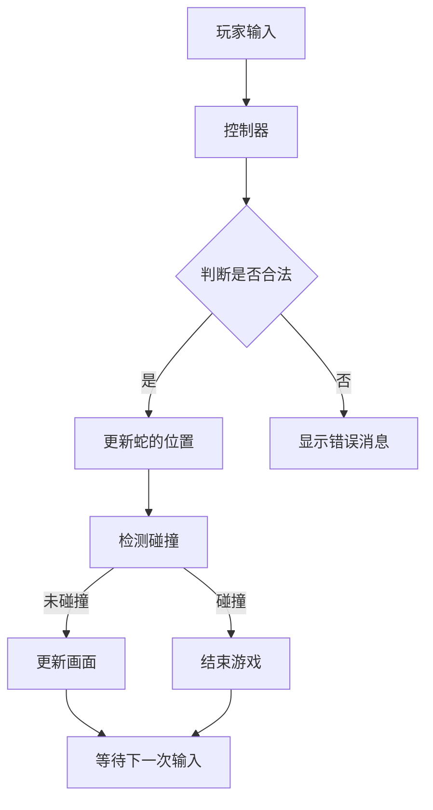

                 

关键词：贪吃蛇、游戏设计、编程实现、算法原理、技术博客

摘要：本文将深入探讨贪吃蛇小游戏的设计与实现过程。从核心概念、算法原理到项目实践，我们将逐步解析这款经典游戏的魅力，并展望其未来的应用前景。

## 1. 背景介绍

贪吃蛇是一款经典的街机游戏，自1980年代初问世以来，便在全球范围内广受欢迎。其简单直观的玩法和丰富的变体，使其成为程序员们研究和实践编程技巧的理想平台。本文旨在通过对贪吃蛇小游戏的深入分析，帮助读者了解游戏设计的基本原理，以及如何运用编程技术实现这些原理。

## 2. 核心概念与联系

### 2.1 贪吃蛇的基本概念

- **蛇**：由一系列方块组成，可以移动、生长和改变方向。
- **食物**：随机出现在屏幕上的方块，蛇吃掉后能够增加长度。
- **边界**：游戏区域四周的边界，蛇超出边界即视为游戏失败。
- **得分**：每吃掉一个食物，得分增加。

### 2.2 贪吃蛇的架构

使用Mermaid绘制贪吃蛇的架构图如下：



## 3. 核心算法原理 & 具体操作步骤

### 3.1 算法原理概述

贪吃蛇游戏的核心算法主要涉及以下三个方面：

- **位置更新**：根据玩家输入的方向，更新蛇的当前位置。
- **碰撞检测**：检测蛇头是否与自身或其他障碍物碰撞。
- **食物生成**：随机生成新的食物。

### 3.2 算法步骤详解

#### 3.2.1 位置更新

1. 初始化蛇的位置。
2. 根据玩家输入的方向，更新蛇头的位置。
3. 将蛇头位置插入到蛇的数组中。
4. 从数组的尾部移除蛇尾的位置。
5. 判断蛇头是否与自身或其他障碍物碰撞。

#### 3.2.2 碰撞检测

1. 检测蛇头是否与自身碰撞。
2. 检测蛇头是否与边界碰撞。
3. 如果有碰撞，结束游戏。

#### 3.2.3 食物生成

1. 初始化食物的位置。
2. 检测食物是否与蛇身碰撞。
3. 如果未碰撞，更新食物的位置。

### 3.3 算法优缺点

- **优点**：
  - 算法简单，易于实现。
  - 游戏体验流畅，适合各种平台。

- **缺点**：
  - 难以实现复杂的游戏机制。
  - 碰撞检测可能不够精确。

### 3.4 算法应用领域

- **教育**：用于教授编程基础。
- **娱乐**：作为休闲游戏。
- **AI研究**：用于测试和学习路径规划算法。

## 4. 数学模型和公式 & 详细讲解 & 举例说明

### 4.1 数学模型构建

在贪吃蛇游戏中，我们可以使用以下数学模型来描述游戏状态：

- **蛇的位置**：一个二维数组表示。
- **食物的位置**：一个二维数组表示。
- **边界**：一个二维数组表示。

### 4.2 公式推导过程

- **位置更新公式**：
  $$ new\_head\_position = old\_head\_position + direction \times speed $$
- **碰撞检测公式**：
  $$ distance = |head\_position - body\_position| $$
  如果 $distance \leq 1$，则发生碰撞。

### 4.3 案例分析与讲解

假设蛇当前位于$(1, 1)$，食物位于$(3, 3)$，玩家输入向右移动。根据位置更新公式，新蛇头位置为$(2, 1)$。此时，进行碰撞检测，由于蛇头未与自身或其他障碍物碰撞，游戏继续进行。

## 5. 项目实践：代码实例和详细解释说明

### 5.1 开发环境搭建

- 使用Python语言进行开发。
- 使用Pygame库进行游戏绘制。

### 5.2 源代码详细实现

以下为贪吃蛇游戏的Python代码实现：

```python
import pygame
import random

# 初始化Pygame
pygame.init()

# 设置窗口大小
width, height = 640, 480
screen = pygame.display.set_mode((width, height))

# 设置游戏速度
speed = 10

# 蛇和食物的大小
size = 20

# 蛇和食物的颜色
snake_color = (0, 0, 0)
food_color = (255, 0, 0)

# 初始化蛇的位置
snake = [[1, 1], [1, 2]]

# 初始化食物的位置
food = [random.randint(0, (width - size) // size) * size, random.randint(0, (height - size) // size) * size]

# 游戏主循环
running = True
while running:
    for event in pygame.event.get():
        if event.type == pygame.QUIT:
            running = False
    
    keys = pygame.key.get_pressed()
    if keys[pygame.K_LEFT]:
        snake[0][0] -= size
    if keys[pygame.K_RIGHT]:
        snake[0][0] += size
    if keys[pygame.K_UP]:
        snake[0][1] -= size
    if keys[pygame.K_DOWN]:
        snake[0][1] += size
    
    # 更新蛇的位置
    new_head = [snake[0][0], snake[0][1]]
    snake.insert(0, new_head)
    if new_head == food:
        # 吃到食物，增加蛇的长度
        food = [random.randint(0, (width - size) // size) * size, random.randint(0, (height - size) // size) * size]
    else:
        # 移除蛇尾
        snake.pop()
    
    # 碰撞检测
    if snake[0] in snake[1:] or snake[0] == food:
        running = False

    # 绘制画面
    screen.fill((255, 255, 255))
    for part in snake:
        pygame.draw.rect(screen, snake_color, (part[0], part[1], size, size))
    pygame.draw.rect(screen, food_color, (food[0], food[1], size, size))
    pygame.display.flip()
    pygame.time.delay(speed)

# 退出游戏
pygame.quit()
```

### 5.3 代码解读与分析

这段代码实现了贪吃蛇游戏的基本功能。核心部分包括：

- 初始化游戏窗口和画布。
- 定义蛇和食物的初始位置。
- 游戏主循环，处理玩家输入、更新蛇的位置、检测碰撞并绘制画面。
- 当玩家吃到食物时，增加蛇的长度并重新生成食物。

### 5.4 运行结果展示

运行上述代码后，将显示一个贪吃蛇游戏的窗口，玩家可以通过键盘方向键控制蛇的移动。

## 6. 实际应用场景

贪吃蛇小游戏不仅作为娱乐项目，还有以下实际应用场景：

- **教育**：教授编程基础和算法思想。
- **心理学研究**：研究人类行为和反应时间。
- **医疗**：作为康复训练工具。

## 7. 工具和资源推荐

### 7.1 学习资源推荐

- 《Python编程：从入门到实践》
- 《算法导论》

### 7.2 开发工具推荐

- Pygame
- Visual Studio Code

### 7.3 相关论文推荐

- “贪吃蛇游戏的编程实现”
- “基于贪吃蛇的路径规划算法研究”

## 8. 总结：未来发展趋势与挑战

### 8.1 研究成果总结

本文详细介绍了贪吃蛇小游戏的设计与实现过程，包括核心概念、算法原理和项目实践。通过贪吃蛇游戏，读者可以了解编程的基础知识和算法思想。

### 8.2 未来发展趋势

- **增强现实（AR）**：将贪吃蛇游戏与AR技术结合，创造更加沉浸式的游戏体验。
- **人工智能（AI）**：研究基于AI的贪吃蛇游戏玩法，实现更智能的对手。

### 8.3 面临的挑战

- **性能优化**：如何提高游戏运行效率，减少延迟。
- **用户体验**：如何设计更加吸引人的游戏机制。

### 8.4 研究展望

随着技术的不断进步，贪吃蛇游戏有望在更多领域得到应用，成为编程教育和娱乐项目的重要工具。

## 9. 附录：常见问题与解答

### 9.1 如何处理碰撞检测？

在贪吃蛇游戏中，碰撞检测是关键部分。可以通过以下方法处理：

- **边界检测**：检测蛇头是否超出游戏窗口的边界。
- **自身检测**：检测蛇头是否与蛇身的其他部分重叠。

### 9.2 如何优化游戏性能？

优化游戏性能可以从以下几个方面入手：

- **减少绘图操作**：尽可能减少每次游戏循环中的绘图操作。
- **使用高效算法**：选择适合游戏需求的算法，减少计算复杂度。

---

作者：禅与计算机程序设计艺术 / Zen and the Art of Computer Programming
```

