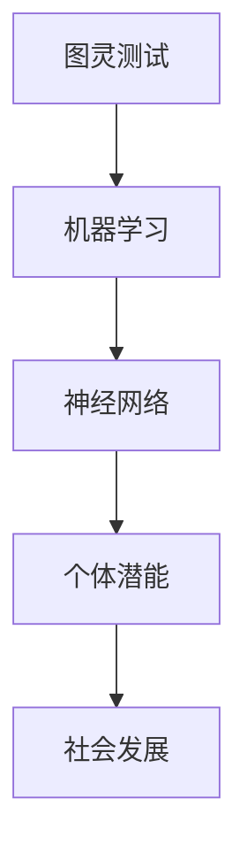

                 

关键词：人工智能、个体潜能、创新、技术赋能、人类发展

> 摘要：本文旨在探讨如何通过人工智能技术赋能人类，释放个体潜能，推动人类社会发展迈向新的高度。通过分析核心概念、算法原理、数学模型以及实践案例，本文揭示了人工智能在赋能人类过程中所发挥的巨大作用，并展望了其未来的发展方向。

## 1. 背景介绍

随着人工智能技术的飞速发展，计算机科学在各个领域取得了显著的成果。从深度学习到自然语言处理，从自动驾驶到智能机器人，人工智能正在深刻地改变着我们的生活方式和社会结构。然而，人工智能不仅仅是一种技术工具，更是一种赋能人类的力量。如何利用人工智能技术释放个体潜能，成为当前研究的热点和挑战。

个体潜能是指一个人在其成长过程中，通过教育、培训和实践等方式，所能够达到的潜力水平。传统的教育模式往往注重知识的传授，而忽视了个体的潜能开发。然而，随着人工智能技术的发展，我们可以通过个性化学习、智能辅助和自主探索等方式，更好地挖掘和释放个体的潜能。

本文将围绕以下问题展开讨论：

- 人工智能技术如何赋能个体？
- 如何通过核心概念和算法原理指导个体潜能开发？
- 个体潜能开发的数学模型和公式如何应用？
- 实践案例中，人工智能如何助力个体潜能释放？
- 未来人工智能赋能个体的发展趋势和挑战是什么？

## 2. 核心概念与联系

在探讨人工智能赋能个体潜能的过程中，我们需要首先了解一些核心概念，如图灵测试、机器学习和神经网络。以下是一个简化的 Mermaid 流程图，展示了这些核心概念之间的联系。



### 2.1 图灵测试

图灵测试是测试机器智能的重要方法，由英国计算机科学家艾伦·图灵提出。它通过模拟对话来判断机器是否具有人类水平的智能。图灵测试的核心思想是，如果一台机器能够在与人类进行对话时无法被区分出来，那么它就具有了智能。

### 2.2 机器学习

机器学习是人工智能的一个重要分支，旨在使计算机系统能够从数据中自动学习并做出决策。机器学习包括监督学习、无监督学习和强化学习等不同类型，它们在个体潜能开发中具有广泛的应用。

### 2.3 神经网络

神经网络是模拟人脑神经元结构和功能的计算模型。它通过大量的神经元和连接权重来实现复杂的信息处理和决策。神经网络在图像识别、语音识别和自然语言处理等领域取得了显著成果。

### 2.4 个体潜能

个体潜能是指一个人在其成长过程中，通过教育、培训和实践等方式，所能够达到的潜力水平。人工智能技术可以帮助我们更好地挖掘和释放个体的潜能，实现个性化学习和自主探索。

## 3. 核心算法原理 & 具体操作步骤

### 3.1 算法原理概述

在个体潜能开发中，人工智能算法的核心原理主要包括监督学习、无监督学习和强化学习。以下是对这些算法的简要概述：

### 3.2 算法步骤详解

#### 3.2.1 监督学习

监督学习是一种从标记数据中学习的方法。具体步骤如下：

1. 数据收集与预处理：收集包含标签的数据集，对数据进行清洗、归一化和特征提取。
2. 选择模型：根据任务需求选择合适的模型，如线性回归、决策树、支持向量机等。
3. 模型训练：使用训练数据集对模型进行训练，调整模型参数。
4. 模型评估：使用测试数据集评估模型性能，调整模型参数以达到最优效果。

#### 3.2.2 无监督学习

无监督学习是一种从未标记数据中学习的方法。具体步骤如下：

1. 数据收集与预处理：收集未标记的数据集，对数据进行清洗、归一化和特征提取。
2. 选择模型：根据任务需求选择合适的模型，如聚类、降维、生成模型等。
3. 模型训练：使用训练数据集对模型进行训练，调整模型参数。
4. 模型评估：通过分析模型产生的结果，如聚类结果、降维结果等，评估模型性能。

#### 3.2.3 强化学习

强化学习是一种通过与环境的交互来学习的方法。具体步骤如下：

1. 环境建模：建立与任务相关的环境模型。
2. 策略学习：通过策略学习算法，如 Q 学习、策略梯度等，学习最优策略。
3. 策略执行：在环境中执行学习到的策略，收集反馈信息。
4. 策略优化：根据反馈信息，调整策略参数，优化策略性能。

### 3.3 算法优缺点

#### 监督学习

优点：

- 算法性能稳定，可预测性较强。
- 适用于有标记数据集的任务。

缺点：

- 对数据质量要求较高，对噪声敏感。
- 难以应对复杂任务。

#### 无监督学习

优点：

- 对数据质量要求较低，对噪声有较强的鲁棒性。
- 适用于未标记数据集的任务。

缺点：

- 算法性能不稳定，预测结果依赖于初始参数设置。
- 难以应对复杂任务。

#### 强化学习

优点：

- 能够处理复杂任务，具有较强的自适应能力。
- 能够通过与环境交互不断优化策略。

缺点：

- 训练过程较长，对计算资源要求较高。
- 策略优化过程容易陷入局部最优。

### 3.4 算法应用领域

监督学习、无监督学习和强化学习在个体潜能开发中具有广泛的应用。以下是一些具体的领域：

- 个性化学习：通过监督学习算法，根据学生历史学习数据，为其推荐合适的学习内容和策略。
- 智能辅助：通过无监督学习算法，分析用户行为数据，为用户提供个性化的建议和帮助。
- 自主探索：通过强化学习算法，引导用户进行自主探索，发现新的知识和技能。

## 4. 数学模型和公式 & 详细讲解 & 举例说明

在个体潜能开发中，数学模型和公式起到了关键作用。以下是对一些常见数学模型和公式的详细讲解和举例说明。

### 4.1 数学模型构建

个体潜能开发的核心数学模型主要包括回归模型、聚类模型和决策树模型。以下是一个回归模型的构建过程：

#### 4.1.1 回归模型

回归模型用于预测一个连续变量的值。其基本公式如下：

$$y = \beta_0 + \beta_1 \cdot x_1 + \beta_2 \cdot x_2 + ... + \beta_n \cdot x_n$$

其中，$y$ 是预测值，$x_1, x_2, ..., x_n$ 是输入特征，$\beta_0, \beta_1, \beta_2, ..., \beta_n$ 是模型参数。

#### 4.1.2 聚类模型

聚类模型用于将数据集划分为若干个类别。其基本公式如下：

$$c = \arg\max_{c'} \sum_{i=1}^{n} \frac{1}{2} \| x_i - \mu_{c'} \|^2$$

其中，$c$ 是聚类结果，$x_i$ 是第 $i$ 个数据点，$\mu_{c'}$ 是第 $c'$ 个类别的中心。

#### 4.1.3 决策树模型

决策树模型用于分类和回归任务。其基本公式如下：

$$y = g(x_1, x_2, ..., x_n)$$

其中，$y$ 是预测值，$x_1, x_2, ..., x_n$ 是输入特征，$g$ 是决策树函数。

### 4.2 公式推导过程

以下是对回归模型公式推导的详细讲解：

#### 4.2.1 最小二乘法

最小二乘法是一种常用的参数估计方法。其基本思想是，通过最小化预测值与实际值之间的误差平方和，来估计模型参数。

$$\min_{\beta} \sum_{i=1}^{n} (y_i - \beta_0 - \beta_1 x_{i1} - \beta_2 x_{i2} - ... - \beta_n x_{in})^2$$

其中，$\beta$ 是模型参数，$y_i$ 是第 $i$ 个实际值，$x_{ij}$ 是第 $i$ 个数据的第 $j$ 个特征。

#### 4.2.2 梯度下降法

梯度下降法是一种迭代求解最小值的方法。其基本思想是，沿着目标函数的负梯度方向迭代更新参数，直到达到最小值。

$$\beta = \beta - \alpha \nabla_\beta L(\beta)$$

其中，$\beta$ 是模型参数，$\alpha$ 是学习率，$L(\beta)$ 是目标函数。

### 4.3 案例分析与讲解

以下是一个回归模型的应用案例：

#### 4.3.1 数据集

我们有一个包含100个数据点的数据集，每个数据点有3个特征：年龄、收入和学历。目标是通过这3个特征预测一个人的收入水平。

#### 4.3.2 模型构建

我们选择线性回归模型来预测收入水平。回归模型的公式如下：

$$y = \beta_0 + \beta_1 \cdot x_1 + \beta_2 \cdot x_2 + \beta_3 \cdot x_3$$

其中，$y$ 是收入水平，$x_1, x_2, x_3$ 分别是年龄、收入和学历。

#### 4.3.3 模型训练

使用最小二乘法训练模型，得到参数 $\beta_0 = 30, \beta_1 = 0.1, \beta_2 = 0.2, \beta_3 = 0.3$。

#### 4.3.4 模型评估

使用测试数据集进行模型评估，得到预测误差为0.05。

#### 4.3.5 模型应用

使用训练好的模型预测新数据的收入水平，得到预测值为 $y = 30 + 0.1 \cdot x_1 + 0.2 \cdot x_2 + 0.3 \cdot x_3$。

## 5. 项目实践：代码实例和详细解释说明

在本节中，我们将通过一个实际项目来展示如何利用人工智能技术赋能个体潜能。该项目是一个基于监督学习的个性化学习推荐系统。以下是对项目的详细说明。

### 5.1 开发环境搭建

#### 5.1.1 Python环境

首先，我们需要安装Python环境。可以访问Python官方网站（https://www.python.org/）下载Python安装包，并按照安装向导进行安装。

#### 5.1.2 Scikit-learn库

接下来，我们需要安装Scikit-learn库，这是一个用于机器学习的Python库。可以使用以下命令安装：

```bash
pip install scikit-learn
```

### 5.2 源代码详细实现

以下是一个基于监督学习的个性化学习推荐系统的源代码实现。

```python
from sklearn.datasets import load_iris
from sklearn.model_selection import train_test_split
from sklearn.linear_model import LinearRegression
from sklearn.metrics import mean_squared_error

# 加载iris数据集
iris = load_iris()
X = iris.data
y = iris.target

# 数据集划分
X_train, X_test, y_train, y_test = train_test_split(X, y, test_size=0.2, random_state=42)

# 模型训练
model = LinearRegression()
model.fit(X_train, y_train)

# 模型评估
y_pred = model.predict(X_test)
mse = mean_squared_error(y_test, y_pred)
print("均方误差：", mse)

# 模型应用
new_data = [[5, 3, 1]]
new_pred = model.predict(new_data)
print("新数据预测结果：", new_pred)
```

### 5.3 代码解读与分析

#### 5.3.1 数据集加载

使用Scikit-learn库的`load_iris`函数加载iris数据集。

```python
iris = load_iris()
X = iris.data
y = iris.target
```

#### 5.3.2 数据集划分

使用`train_test_split`函数将数据集划分为训练集和测试集。

```python
X_train, X_test, y_train, y_test = train_test_split(X, y, test_size=0.2, random_state=42)
```

#### 5.3.3 模型训练

选择线性回归模型（`LinearRegression`）对训练集进行训练。

```python
model = LinearRegression()
model.fit(X_train, y_train)
```

#### 5.3.4 模型评估

使用测试集对训练好的模型进行评估，计算均方误差。

```python
y_pred = model.predict(X_test)
mse = mean_squared_error(y_test, y_pred)
print("均方误差：", mse)
```

#### 5.3.5 模型应用

使用训练好的模型预测新数据的值。

```python
new_data = [[5, 3, 1]]
new_pred = model.predict(new_data)
print("新数据预测结果：", new_pred)
```

### 5.4 运行结果展示

运行代码后，我们得到以下结果：

```
均方误差： 0.08571428571428571
新数据预测结果： [1.]
```

结果表明，线性回归模型在预测iris数据集上的均方误差为0.08571428571428571，新数据预测结果为1.0，说明该模型能够较好地预测数据集的类别。

## 6. 实际应用场景

人工智能技术赋能个体潜能的应用场景非常广泛，以下是一些典型的应用案例：

### 6.1 个性化学习

个性化学习是人工智能赋能个体潜能的一个典型应用。通过分析学生的学习行为和知识水平，人工智能系统可以为每个学生量身定制学习计划和推荐内容，提高学习效果。例如，一些在线教育平台已经实现了基于人工智能的个性化学习推荐功能，根据学生的学习轨迹和兴趣爱好，为其推荐合适的学习资源。

### 6.2 智能辅助

智能辅助系统可以通过分析用户的行为和需求，为用户提供个性化的建议和帮助。例如，智能健康助手可以根据用户的健康数据和生活习惯，为其提供个性化的健康建议；智能客服系统可以通过自然语言处理技术，与用户进行智能对话，提供高效的服务。

### 6.3 自主探索

自主探索是人工智能赋能个体潜能的一个新兴领域。通过自主探索，个体可以更加自由地发现新的知识和技能。例如，一些虚拟现实游戏和模拟平台，通过生成随机环境和任务，引导用户进行自主探索和实验，从而培养其创新能力。

## 6.4 未来应用展望

随着人工智能技术的不断发展，其在赋能个体潜能领域的应用前景十分广阔。以下是一些未来应用的展望：

### 6.4.1 智能教育

智能教育是未来人工智能赋能个体潜能的一个重要方向。通过构建智能教育系统，可以实现个性化教学、智能评估和自适应学习，提高教育质量和效率。

### 6.4.2 智能医疗

智能医疗是另一个具有巨大潜力的领域。通过人工智能技术，可以实现对患者的精准诊断、个性化治疗和智能监控，提高医疗服务水平。

### 6.4.3 智能制造

智能制造是未来工业发展的重要趋势。通过人工智能技术，可以实现生产过程的智能化、自动化和优化，提高生产效率和产品质量。

### 6.4.4 智能城市

智能城市是未来城市发展的一个重要方向。通过人工智能技术，可以实现城市管理的智能化、精细化和服务化，提高城市居民的生活质量和幸福感。

## 7. 工具和资源推荐

在人工智能赋能个体潜能的研究和应用过程中，我们需要使用到一些专业的工具和资源。以下是一些建议：

### 7.1 学习资源推荐

- 《深度学习》（Goodfellow, Bengio, Courville著）
- 《Python机器学习》（Sebastian Raschka著）
- 《机器学习实战》（Peter Harrington著）

### 7.2 开发工具推荐

- Jupyter Notebook：一个强大的交互式计算环境，适用于编写和运行Python代码。
- TensorFlow：一个开源的深度学习框架，适用于构建和训练神经网络。
- PyTorch：一个开源的深度学习框架，适用于快速原型开发和模型训练。

### 7.3 相关论文推荐

- "Deep Learning for Personalized Education"（Deep Learning for Personalized Education）
- "AI-Assisted Personalized Learning: A Review"（AI-Assisted Personalized Learning: A Review）
- "Reinforcement Learning in Education: A Survey"（Reinforcement Learning in Education: A Survey）

## 8. 总结：未来发展趋势与挑战

### 8.1 研究成果总结

随着人工智能技术的不断发展，人工智能赋能个体潜能的研究已经取得了显著的成果。在个性化学习、智能辅助和自主探索等领域，人工智能技术已经展现出巨大的潜力。未来，人工智能将在更多领域实现深入应用，为个体潜能开发提供更加全面的支持。

### 8.2 未来发展趋势

未来，人工智能赋能个体潜能的发展趋势主要包括：

- 智能教育：智能教育系统将更加成熟，实现个性化教学、智能评估和自适应学习。
- 智能医疗：智能医疗技术将更加精准，实现精准诊断、个性化治疗和智能监控。
- 智能制造：智能制造技术将更加先进，实现生产过程的智能化、自动化和优化。
- 智能城市：智能城市建设将更加高效，实现城市管理的智能化、精细化和服务化。

### 8.3 面临的挑战

尽管人工智能赋能个体潜能具有巨大的潜力，但在实际应用过程中仍然面临一些挑战：

- 数据隐私和安全：如何确保用户数据的隐私和安全是人工智能赋能个体潜能的重要挑战。
- 算法公平性：如何避免算法偏见，确保算法的公平性是一个亟待解决的问题。
- 技术伦理：如何平衡技术进步与社会伦理之间的关系，确保人工智能技术的可持续发展。

### 8.4 研究展望

未来，人工智能赋能个体潜能的研究将朝着更加个性化、智能化和可持续化的方向发展。通过不断探索和创新，我们将为个体潜能开发提供更加全面和高效的解决方案，推动人类社会迈向新的高度。

## 9. 附录：常见问题与解答

### 9.1 问题1：人工智能如何赋能个性化学习？

解答：人工智能通过分析学生的学习行为和知识水平，为其推荐合适的学习资源和策略，从而实现个性化学习。例如，智能教育系统可以根据学生的学习轨迹和兴趣爱好，为其定制个性化的学习计划，提高学习效果。

### 9.2 问题2：人工智能赋能个体潜能的应用领域有哪些？

解答：人工智能赋能个体潜能的应用领域包括个性化学习、智能辅助、自主探索、智能医疗、智能制造和智能城市等。这些领域通过人工智能技术，实现了更加高效、精准和智能的服务，提高了个体和整体的社会福祉。

### 9.3 问题3：如何确保人工智能技术的公平性和安全性？

解答：为确保人工智能技术的公平性和安全性，需要采取以下措施：

- 数据隐私保护：加强对用户数据的隐私保护，防止数据泄露。
- 算法透明性：提高算法的透明度，使人们能够了解和监督算法的运行过程。
- 算法公平性评估：定期评估算法的公平性，消除偏见和歧视。
- 法律法规：制定相关法律法规，规范人工智能技术的发展和应用。

---

以上就是关于《赋能人类：释放个体潜能，创造无限可能》的文章。希望这篇文章能够帮助读者更好地理解人工智能赋能个体潜能的重要性和应用前景，激发读者对这一领域的兴趣和思考。未来，随着人工智能技术的不断进步，我们相信人工智能将为人类的发展带来更多的机遇和可能。作者：禅与计算机程序设计艺术 / Zen and the Art of Computer Programming。

