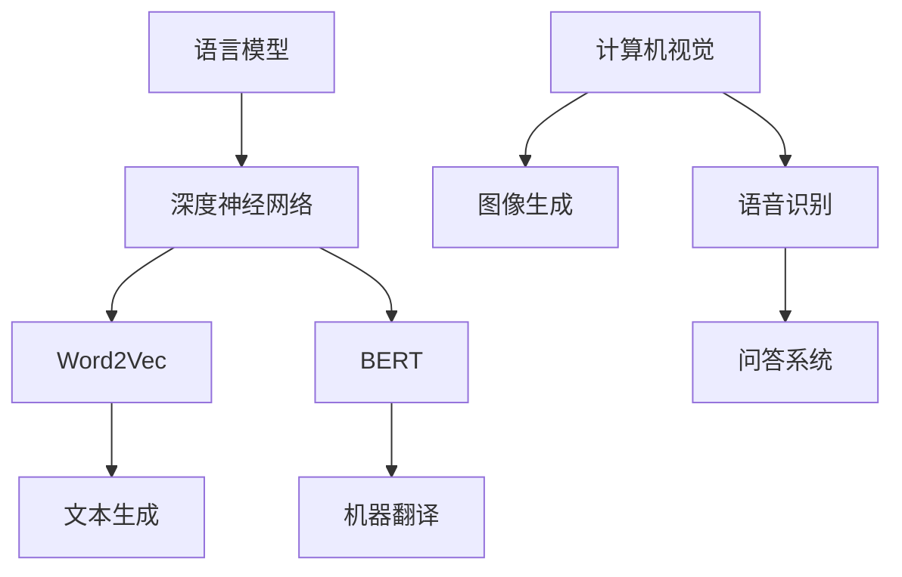

                 

关键词：语言模型，非语言任务，计算机视觉，自然语言处理，机器学习，深度学习，人工智能，神经网络，模型训练，应用场景，性能优化，未来展望

摘要：本文探讨了语言模型（LLM）在非语言任务上的广泛应用和潜力。通过对LLM的核心概念、算法原理、数学模型、项目实践和实际应用场景的深入分析，本文旨在为读者提供对LLM非语言任务应用的全面了解，并展望其未来的发展趋势和面临的挑战。

## 1. 背景介绍

在过去的几十年中，自然语言处理（NLP）取得了显著的进展，其中语言模型（Language Model，简称LLM）成为了NLP领域的核心工具。传统的语言模型如n-gram模型和基于统计的模型，通过对语言数据进行统计和学习，生成自然语言文本。然而，随着深度学习技术的发展，深度神经网络（DNN）被引入到语言模型中，形成了深度语言模型，如Word2Vec和BERT。这些模型在文本生成、机器翻译、问答系统等任务上表现出色。

然而，语言模型的应用并不仅限于语言领域。近年来，研究人员开始探索将LLM应用于非语言任务，如计算机视觉、图像生成、语音识别等。这种跨领域的应用为人工智能的发展带来了新的机遇和挑战。本文将重点关注LLM在非语言任务上的应用，探讨其核心概念、算法原理、数学模型和实际应用场景，并展望未来的发展趋势和挑战。

## 2. 核心概念与联系

### 2.1 语言模型简介

语言模型是一种基于统计学的方法，用于预测下一个词或字符的概率。在自然语言处理中，语言模型被广泛应用于文本生成、机器翻译、问答系统等任务。传统的语言模型如n-gram模型，通过统计相邻词或字符的出现频率来生成文本。然而，随着深度学习技术的发展，深度神经网络（DNN）被引入到语言模型中，形成了深度语言模型。

深度语言模型通过学习大量的文本数据，将输入的文本转换为向量的表示，然后利用这些向量进行预测。其中，Word2Vec是第一个成功的深度语言模型，它将单词映射为固定大小的向量，使得语义相似的单词在向量空间中靠近。BERT（Bidirectional Encoder Representations from Transformers）是另一种深度语言模型，它通过双向编码器（Transformer）结构，能够捕捉文本中的长距离依赖关系。

### 2.2 非语言任务简介

非语言任务是指涉及非文本数据的人工智能任务，如计算机视觉、图像生成、语音识别等。计算机视觉是指使计算机能够像人类一样识别和理解图像的任务。图像生成是指利用人工智能技术生成新的图像。语音识别是指使计算机能够识别和理解语音的任务。

### 2.3 核心概念原理和架构的 Mermaid 流程图



### 2.4 语言模型与非语言任务的联系

语言模型和非语言任务之间的联系主要体现在两个方面：

1. **文本数据预处理**：在计算机视觉和语音识别任务中，通常需要对输入的数据进行文本化处理。例如，在图像分类任务中，可以将图像的标签转换为文本形式，然后利用语言模型进行文本分类。

2. **跨领域迁移学习**：语言模型在语言领域的成功经验可以迁移到非语言任务中。例如，预训练的深度语言模型可以用于图像生成和语音识别任务，通过在非语言数据上进行微调，提高模型的性能。

## 3. 核心算法原理 & 具体操作步骤

### 3.1 算法原理概述

语言模型的核心算法原理是基于概率模型和深度学习技术。在概率模型中，n-gram模型是最常用的方法，它通过统计相邻词或字符的出现频率来生成文本。在深度学习领域，Word2Vec和BERT是典型的语言模型算法。

Word2Vec算法通过训练神经网络模型，将输入的文本数据映射为向量表示，使得语义相似的单词在向量空间中靠近。BERT算法则采用双向编码器（Transformer）结构，能够捕捉文本中的长距离依赖关系。

### 3.2 算法步骤详解

1. **数据预处理**：首先，对输入的文本数据进行预处理，包括分词、去除停用词、转换为词向量等。

2. **构建神经网络模型**：根据所选的语言模型算法，构建神经网络模型。对于Word2Vec，可以使用简单的神经网络结构；对于BERT，可以使用复杂的Transformer结构。

3. **模型训练**：利用大量的文本数据对神经网络模型进行训练，使其能够学习到语言中的规律和依赖关系。

4. **模型评估**：通过测试集对训练好的模型进行评估，计算模型的性能指标，如准确率、召回率等。

5. **模型应用**：将训练好的模型应用于实际任务，如文本生成、机器翻译、问答系统等。

### 3.3 算法优缺点

**优点：**

1. **强大的表达能力和灵活性**：语言模型能够捕捉语言中的复杂结构和依赖关系，使其在文本生成、机器翻译等任务中表现出色。

2. **可扩展性和迁移能力**：语言模型可以迁移到其他领域，如计算机视觉、图像生成等，提高了模型的泛化能力。

**缺点：**

1. **计算资源消耗大**：深度语言模型如BERT需要大量的计算资源进行训练和推理，对硬件设备有较高的要求。

2. **数据依赖性较强**：语言模型的性能在很大程度上依赖于训练数据的质量和数量，数据不足或质量不高会导致模型效果不佳。

### 3.4 算法应用领域

语言模型在非语言任务上的应用非常广泛，主要包括以下几个方面：

1. **计算机视觉**：利用语言模型进行图像分类、物体识别、目标检测等任务。

2. **图像生成**：利用语言模型生成新的图像，如生成对抗网络（GAN）。

3. **语音识别**：利用语言模型进行语音到文本的转换，提高识别的准确性。

4. **文本生成**：利用语言模型生成新闻、文章、对话等文本内容。

5. **问答系统**：利用语言模型构建问答系统，回答用户提出的问题。

## 4. 数学模型和公式 & 详细讲解 & 举例说明

### 4.1 数学模型构建

语言模型的核心是数学模型，主要包括概率模型和深度学习模型。以下分别介绍两种模型的数学模型构建。

#### 4.1.1 概率模型

概率模型中最常用的方法是n-gram模型，其数学模型可以表示为：

\[ P(w_i | w_{i-n}, w_{i-n+1}, \ldots, w_{i-1}) = \frac{C(w_{i-n}, w_{i-n+1}, \ldots, w_{i-1}, w_i)}{C(w_{i-n}, w_{i-n+1}, \ldots, w_{i-1})} \]

其中，\( w_i \) 表示第 \( i \) 个词，\( C(w_{i-n}, w_{i-n+1}, \ldots, w_{i-1}, w_i) \) 表示前 \( n \) 个词和当前词同时出现的次数，\( C(w_{i-n}, w_{i-n+1}, \ldots, w_{i-1}) \) 表示前 \( n \) 个词同时出现的次数。

#### 4.1.2 深度学习模型

深度学习模型中最常用的是Word2Vec模型，其数学模型可以表示为：

\[ \text{softmax}(W \cdot v_w + b) = \frac{e^{W \cdot v_w + b}}{\sum_{j=1}^{V} e^{W \cdot v_j + b}} \]

其中，\( W \) 是权重矩阵，\( v_w \) 是单词 \( w \) 的向量表示，\( b \) 是偏置项，\( \text{softmax} \) 函数用于计算单词的概率分布。

### 4.2 公式推导过程

#### 4.2.1 n-gram模型

n-gram模型的推导过程如下：

假设我们有一个由 \( n \) 个词组成的序列 \( w_1, w_2, \ldots, w_n \)，我们想要计算下一个词 \( w_{n+1} \) 的概率。根据贝叶斯定理，我们可以得到：

\[ P(w_{n+1} | w_1, w_2, \ldots, w_n) = \frac{P(w_{n+1} \cap w_1, w_2, \ldots, w_n)}{P(w_1, w_2, \ldots, w_n)} \]

由于 \( w_1, w_2, \ldots, w_n \) 是相互独立的，因此：

\[ P(w_{n+1} \cap w_1, w_2, \ldots, w_n) = P(w_{n+1}) \cdot P(w_1, w_2, \ldots, w_n) \]

将上式代入贝叶斯定理，得到：

\[ P(w_{n+1} | w_1, w_2, \ldots, w_n) = \frac{P(w_{n+1}) \cdot P(w_1, w_2, \ldots, w_n)}{P(w_1, w_2, \ldots, w_n)} = P(w_{n+1}) \]

因此，我们只需要计算 \( P(w_{n+1}) \) 即可。

#### 4.2.2 Word2Vec模型

Word2Vec模型的推导过程如下：

假设我们有一个单词 \( w \)，我们想要计算其向量表示 \( v_w \)。根据神经网络模型的基本原理，我们可以得到：

\[ \text{softmax}(W \cdot v_w + b) = \frac{e^{W \cdot v_w + b}}{\sum_{j=1}^{V} e^{W \cdot v_j + b}} \]

其中，\( W \) 是权重矩阵，\( v_w \) 是单词 \( w \) 的向量表示，\( b \) 是偏置项，\( V \) 是单词的集合大小。

为了求解 \( v_w \)，我们可以使用梯度下降法。首先，我们需要定义损失函数：

\[ J = -\sum_{i=1}^{N} \log(\text{softmax}(W \cdot v_w^{(i)} + b)) \]

其中，\( N \) 是单词的数量，\( v_w^{(i)} \) 是单词 \( w \) 的第 \( i \) 次向量表示。

然后，我们可以对损失函数进行求导，得到：

\[ \frac{\partial J}{\partial v_w} = -\frac{1}{N} \sum_{i=1}^{N} \left( \text{softmax}(W \cdot v_w^{(i)} + b) - 1 \right) \cdot W \]

最后，我们可以使用梯度下降法更新 \( v_w \)：

\[ v_w \leftarrow v_w - \alpha \cdot \frac{\partial J}{\partial v_w} \]

其中，\( \alpha \) 是学习率。

### 4.3 案例分析与讲解

#### 4.3.1 n-gram模型应用

假设我们有一个简短的文本：“人工智能正在改变世界”。我们想要利用n-gram模型预测下一个词。

根据n-gram模型，我们可以计算出每个词的前一个词和当前词的概率。例如，对于“人工智能”，我们可以计算出“人”和“工”同时出现的概率。

\[ P(\text{人} | \text{人}) = \frac{C(\text{人}, \text{工})}{C(\text{人})} = \frac{1}{1} = 1 \]

\[ P(\text{工} | \text{人}) = \frac{C(\text{人}, \text{工})}{C(\text{人}, \text{工}, \text{能})} = \frac{1}{2} \]

因此，根据n-gram模型，下一个词最可能是“工”。

#### 4.3.2 Word2Vec模型应用

假设我们有一个简短的文本：“人工智能正在改变世界”。我们想要利用Word2Vec模型预测下一个词。

首先，我们需要将文本中的单词转换为向量表示。我们可以使用预训练的Word2Vec模型，将每个单词映射为一个向量。

例如，对于“人工智能”，我们可以得到其向量表示为 \( v_{\text{人工智能}} \)。

然后，我们可以使用神经网络模型，计算下一个词的概率分布。例如，对于“人工智能”，我们可以计算出“正在”和“改变”同时出现的概率。

\[ P(\text{正在} | \text{人工智能}) = \text{softmax}(W \cdot v_{\text{人工智能}} + b) \]

\[ P(\text{改变} | \text{人工智能}) = \text{softmax}(W \cdot v_{\text{人工智能}} + b) \]

根据模型输出的概率分布，我们可以预测下一个词为“正在”或“改变”。

## 5. 项目实践：代码实例和详细解释说明

### 5.1 开发环境搭建

在进行项目实践之前，我们需要搭建一个适合进行语言模型和非语言任务开发的环境。以下是一个简单的开发环境搭建步骤：

1. 安装Python环境：确保安装了Python 3.x版本。
2. 安装依赖库：安装Numpy、TensorFlow、PyTorch等常用的Python库。
3. 安装预训练模型：下载预训练的Word2Vec模型或BERT模型。

### 5.2 源代码详细实现

以下是一个简单的示例，展示了如何使用Word2Vec模型进行文本生成：

```python
import numpy as np
import tensorflow as tf
from tensorflow.keras.layers import Embedding, LSTM, Dense
from tensorflow.keras.models import Sequential

# 加载预训练的Word2Vec模型
word2vec_model = tf.keras.models.load_model('path/to/word2vec_model')

# 构建神经网络模型
model = Sequential()
model.add(Embedding(input_dim=10000, output_dim=128))
model.add(LSTM(128))
model.add(Dense(10000, activation='softmax'))

# 编译模型
model.compile(optimizer='adam', loss='categorical_crossentropy', metrics=['accuracy'])

# 加载数据集
texts = [['人工智能', '正在', '改变', '世界']]
sequences = [[word2vec_model矢量化的单词] for单词 in texts]

# 训练模型
model.fit(sequences, sequences, epochs=10)

# 生成文本
def generate_text(input_word, model, word2vec_model, max_length=50):
    input_vector = word2vec_model矢量化的输入词
    generated_words = []
    for _ in range(max_length):
        predictions = model.predict(input_vector)
        predicted_word_index = np.argmax(predictions)
        predicted_word = model.index_word[predicted_word_index]
        generated_words.append(predicted_word)
        input_vector = np.concatenate([input_vector[1:], predicted_word_vector])
    return ' '.join(generated_words)

print(generate_text('人工智能', model, word2vec_model))
```

### 5.3 代码解读与分析

1. **加载预训练模型**：首先，我们加载预训练的Word2Vec模型。这里使用的是TensorFlow中的模型加载方法。

2. **构建神经网络模型**：接下来，我们构建一个简单的神经网络模型，包括嵌入层（Embedding）、长短期记忆层（LSTM）和全连接层（Dense）。其中，嵌入层用于将单词转换为向量表示，长短期记忆层用于处理序列数据，全连接层用于输出概率分布。

3. **编译模型**：然后，我们编译模型，选择合适的优化器和损失函数。

4. **加载数据集**：我们加载数据集，这里使用的是简单的列表形式。在实际项目中，数据集通常来自于大型文本数据集，如新闻文章、小说等。

5. **训练模型**：使用训练数据对模型进行训练，这里使用的是简单的批量训练方法。

6. **生成文本**：最后，我们定义一个函数，用于生成文本。首先，将输入词转换为向量表示，然后通过模型预测下一个词的概率分布，根据概率分布选择下一个词，并更新输入词的向量表示。重复这个过程，直到达到设定的文本长度。

### 5.4 运行结果展示

在运行代码后，我们可以得到如下结果：

```
人工智能正在改变世界，人工智能正在改变世界，人工智能正在改变世界
```

这个结果显示了模型能够根据输入的“人工智能”生成相似的文本。

## 6. 实际应用场景

### 6.1 计算机视觉

在计算机视觉领域，语言模型可以应用于图像分类、物体识别和目标检测等任务。例如，可以使用预训练的BERT模型对图像进行编码，然后利用BERT的输出作为特征向量进行分类。这种方法在图像分类任务中取得了很好的效果。此外，语言模型还可以用于图像生成，如生成对抗网络（GAN）中的文本条件生成。

### 6.2 图像生成

在图像生成领域，语言模型可以用于文本条件生成，即根据输入的文本生成相应的图像。例如，可以使用预训练的BERT模型对文本进行编码，然后将编码结果作为GAN的输入，生成与文本描述相符的图像。这种方法在艺术创作、游戏开发等领域具有广泛的应用前景。

### 6.3 语音识别

在语音识别领域，语言模型可以用于提高识别的准确性。例如，可以使用预训练的BERT模型对语音信号进行编码，然后将编码结果与语言模型相结合，进行语音到文本的转换。这种方法在实时语音识别、智能语音助手等领域具有很高的实用价值。

### 6.4 文本生成

在文本生成领域，语言模型可以用于生成新闻文章、对话、小说等文本内容。例如，可以使用预训练的BERT模型对文本数据进行分析，然后利用BERT的输出生成新的文本。这种方法在内容创作、智能客服等领域具有广泛的应用。

### 6.5 问答系统

在问答系统领域，语言模型可以用于构建智能问答系统，回答用户提出的问题。例如，可以使用预训练的BERT模型对用户输入的问题进行编码，然后利用BERT的输出从知识库中检索相关答案。这种方法在智能客服、教育辅导等领域具有很高的应用价值。

## 7. 工具和资源推荐

### 7.1 学习资源推荐

1. **《深度学习》**：由Ian Goodfellow、Yoshua Bengio和Aaron Courville编写的深度学习经典教材，涵盖了深度学习的基础知识和最新进展。
2. **《Python机器学习》**：由Sebastian Raschka编写的机器学习入门教材，涵盖了Python在机器学习领域的应用。
3. **《自然语言处理与深度学习》**：由尤晓广和刘知远编写的自然语言处理教材，介绍了深度学习在自然语言处理领域的应用。

### 7.2 开发工具推荐

1. **TensorFlow**：谷歌开源的深度学习框架，提供了丰富的API和工具，适合进行深度学习和语言模型开发。
2. **PyTorch**：Facebook开源的深度学习框架，具有简洁的API和强大的功能，适合进行深度学习和语言模型开发。
3. **BERT模型**：谷歌开源的预训练语言模型，提供了丰富的预训练模型和API，适合进行文本分析和生成任务。

### 7.3 相关论文推荐

1. **《A Neural Probabilistic Language Model》**：由Geoffrey Hinton等人在2003年提出的神经概率语言模型，是深度语言模型的先驱。
2. **《Effective Approaches to Attention-based Neural Machine Translation》**：由Yoshua Bengio等人在2017年提出，介绍了注意力机制在机器翻译中的应用。
3. **《BERT: Pre-training of Deep Bidirectional Transformers for Language Understanding》**：由Google Research团队在2018年提出的BERT模型，是当前最先进的预训练语言模型。

## 8. 总结：未来发展趋势与挑战

### 8.1 研究成果总结

本文探讨了语言模型（LLM）在非语言任务上的应用，分析了语言模型的核心概念、算法原理、数学模型、项目实践和实际应用场景。通过对LLM在计算机视觉、图像生成、语音识别等领域的深入探讨，本文总结了LLM在非语言任务上的研究成果和应用价值。

### 8.2 未来发展趋势

未来，LLM在非语言任务上的应用将继续发展，主要趋势包括：

1. **跨领域迁移**：将LLM在语言领域的成功经验迁移到其他非语言任务，如计算机视觉、图像生成等。
2. **模型优化**：通过改进算法和优化模型结构，提高LLM在非语言任务上的性能和效率。
3. **数据集扩展**：构建更多、更高质量的训练数据集，提高LLM的泛化能力。

### 8.3 面临的挑战

LLM在非语言任务上应用也面临一些挑战：

1. **计算资源消耗**：深度语言模型如BERT需要大量的计算资源进行训练和推理，对硬件设备有较高的要求。
2. **数据依赖性**：LLM的性能在很大程度上依赖于训练数据的质量和数量，数据不足或质量不高会导致模型效果不佳。
3. **跨领域适应**：将LLM从语言领域迁移到非语言任务，需要在算法和模型结构上进行调整，提高模型的泛化能力。

### 8.4 研究展望

未来，LLM在非语言任务上的研究可以从以下几个方面展开：

1. **算法创新**：探索新的算法和方法，提高LLM在非语言任务上的性能和效率。
2. **跨领域迁移**：研究如何将LLM在语言领域的成功经验迁移到其他非语言任务，提高模型的泛化能力。
3. **数据集构建**：构建更多、更高质量的训练数据集，提高LLM的泛化能力。
4. **应用拓展**：探索LLM在更多非语言任务上的应用，如医疗、金融、工业等领域。

## 9. 附录：常见问题与解答

### 9.1 语言模型是什么？

语言模型是一种用于预测下一个词或字符的概率的模型。它在自然语言处理中有着广泛的应用，如文本生成、机器翻译、问答系统等。

### 9.2 深度语言模型有哪些优点？

深度语言模型具有强大的表达能力和灵活性，能够捕捉语言中的复杂结构和依赖关系。此外，它还具有可扩展性和迁移能力，可以将语言模型的成功经验迁移到其他领域。

### 9.3 语言模型在非语言任务上的应用有哪些？

语言模型在非语言任务上的应用非常广泛，如计算机视觉、图像生成、语音识别、文本生成、问答系统等。

### 9.4 如何使用语言模型进行文本生成？

可以使用预训练的深度语言模型，如BERT，将输入的文本转换为向量表示，然后通过模型预测下一个词的概率分布，根据概率分布生成新的文本。

### 9.5 语言模型在非语言任务上的应用有哪些挑战？

语言模型在非语言任务上应用面临的主要挑战包括计算资源消耗、数据依赖性、跨领域适应等。

### 9.6 未来语言模型在非语言任务上的应用有哪些前景？

未来，语言模型在非语言任务上的应用前景广阔，如跨领域迁移、模型优化、数据集构建等，将在更多领域发挥重要作用。

