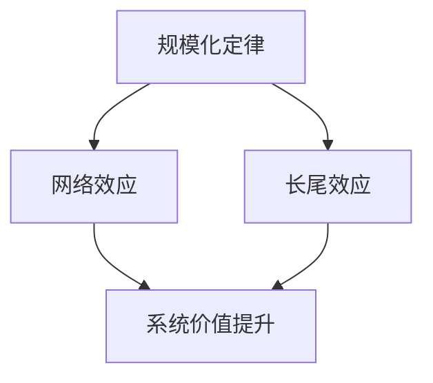

                 

关键词：规模化定律、应用发展、底层规律、技术进化、IT领域

摘要：本文探讨了规模化定律在信息技术领域的应用，揭示了其作为技术进化底层规律的普遍性。通过分析规模化定律的核心概念、算法原理、数学模型、实际应用以及未来趋势，旨在为读者提供对技术发展的深入理解和前瞻性思考。

## 1. 背景介绍

随着信息技术的迅猛发展，各类应用如雨后春笋般涌现，从社交媒体、电子商务到人工智能、大数据分析，信息技术已经深入到社会生活的方方面面。然而，这些繁多的应用背后，是否存在某种底层规律在驱动其发展呢？

答案是肯定的。规模化定律，作为信息技术领域的一种底层规律，揭示了随着用户数量的增加，技术系统性能的提升和应用价值的放大。本文将详细探讨这一规律，并分析其在实际应用中的体现。

### 1.1 规模化定律的定义

规模化定律（Law of Scale）指的是，在某一技术或商业模式中，随着用户数量的增加，系统的成本降低，性能提升，进而使得整个系统的价值增加。

### 1.2 规模化定律的重要性

规模化定律对于信息技术领域的重要性不言而喻。首先，它解释了为什么某些技术或平台能够在短时间内获得巨大成功，如社交媒体平台、在线购物平台等。其次，它为企业的战略规划和资源配置提供了理论依据。最后，它预示着未来的技术发展方向和机遇。

## 2. 核心概念与联系

为了更好地理解规模化定律，我们首先需要掌握几个核心概念，并探讨它们之间的联系。

### 2.1 网络效应

网络效应（Network Effect）指的是，当某一产品的用户数量增加时，产品的价值也随之提升。这是因为用户数量的增加，使得产品更加有用，吸引了更多的潜在用户。

### 2.2 长尾效应

长尾效应（Long Tail Effect）指的是，在市场中，非热门的产品或服务累积起来的销量，有时甚至超过热门产品的销量。这得益于互联网和电子商务的发展，使得长尾产品的展示和销售成本大幅降低。

### 2.3 规模化与网络效应、长尾效应的联系

规模化定律与网络效应、长尾效应密切相关。网络效应使得技术系统在用户规模扩大时价值提升，长尾效应则使得系统能够通过服务多样化的非热门用户，进一步放大系统的整体价值。

### 2.4 Mermaid 流程图

下面是一个简化的 Mermaid 流程图，展示了规模化定律、网络效应和长尾效应之间的关系。



## 3. 核心算法原理 & 具体操作步骤

### 3.1 算法原理概述

规模化定律的核心在于如何利用用户数量的增加，实现系统性能的提升和价值放大。具体而言，这包括以下几个方面：

1. **成本优化**：随着用户数量的增加，系统能够实现资源（如计算能力、存储空间等）的共享，从而降低单位用户的成本。
2. **数据积累**：大量的用户数据能够为系统提供丰富的训练素材，提升算法的准确性和性能。
3. **生态构建**：庞大的用户基础能够吸引更多的第三方开发者和服务，构建一个更加完善的生态系统。

### 3.2 算法步骤详解

规模化定律的具体操作步骤可以分为以下几个阶段：

1. **初期积累**：通过市场推广、用户体验等方式，迅速增加用户数量。
2. **资源整合**：整合内部资源，优化系统架构，提升数据处理能力和响应速度。
3. **数据驱动**：利用用户数据，不断优化产品和服务，提升用户体验。
4. **生态建设**：吸引第三方开发者和服务，构建一个繁荣的生态系统。

### 3.3 算法优缺点

#### 优缺点

**优点**：

- 提升系统性能和价值。
- 降低单位成本。
- 增强市场竞争力。

**缺点**：

- 初期投入大，风险较高。
- 需要持续的数据支持和生态建设。

### 3.4 算法应用领域

规模化定律在以下领域具有广泛的应用：

- **社交媒体**：通过用户规模效应，提升平台的用户活跃度和内容多样性。
- **电子商务**：利用长尾效应，扩大产品销售渠道，提升用户体验。
- **人工智能**：利用大量用户数据，提升算法的准确性和效率。
- **大数据分析**：通过规模化数据积累，实现更精准的分析和预测。

## 4. 数学模型和公式 & 详细讲解 & 举例说明

### 4.1 数学模型构建

规模化定律的数学模型可以表示为：

$$
V(S) = f(S, C)
$$

其中，$V(S)$ 表示系统的价值，$S$ 表示用户规模，$C$ 表示单位用户的成本。

### 4.2 公式推导过程

为了推导上述公式，我们需要考虑以下几个方面：

1. **成本优化**：随着用户数量的增加，系统资源（如计算能力、存储空间等）的共享程度提高，单位用户的成本降低。这可以表示为：

   $$
   C(S) = C_0 + \alpha S
   $$

   其中，$C_0$ 为固定成本，$\alpha$ 为单位成本。

2. **价值放大**：用户规模增加，系统能够提供更丰富的服务，从而提升系统的整体价值。这可以表示为：

   $$
   V(S) = V_0 + \beta S
   $$

   其中，$V_0$ 为初始价值，$\beta$ 为价值提升系数。

### 4.3 案例分析与讲解

假设一个在线教育平台，初始价值为 $V_0 = 100$ 万元，固定成本为 $C_0 = 50$ 万元，单位成本为 $\alpha = 0.1$ 万元，价值提升系数为 $\beta = 0.5$ 万元。

当用户规模为 $S = 10000$ 时，系统的成本和价值分别为：

$$
C(S) = C_0 + \alpha S = 50 + 0.1 \times 10000 = 1050 \text{ 万元}
$$

$$
V(S) = V_0 + \beta S = 100 + 0.5 \times 10000 = 5050 \text{ 万元}
$$

可见，随着用户数量的增加，系统的成本和价值都得到了显著提升。

## 5. 项目实践：代码实例和详细解释说明

### 5.1 开发环境搭建

为了演示规模化定律的应用，我们以一个简单的在线教育平台为例，使用 Python 编写代码。首先，我们需要搭建一个基本的开发环境。

1. 安装 Python 3.8 或更高版本。
2. 安装必要的库，如 Flask（一个轻量级的 Web 框架）、SQLAlchemy（一个关系型数据库工具）等。

### 5.2 源代码详细实现

下面是一个简单的在线教育平台的源代码实现：

```python
from flask import Flask, request, jsonify
from sqlalchemy import create_engine

app = Flask(__name__)

# 数据库连接
engine = create_engine('sqlite:///education_platform.db')

# 创建用户表
with engine.connect() as conn:
    conn.execute("""
        CREATE TABLE IF NOT EXISTS users (
            id INTEGER PRIMARY KEY AUTOINCREMENT,
            username TEXT NOT NULL UNIQUE,
            courses TEXT
        )
    """)

@app.route('/register', methods=['POST'])
def register():
    username = request.form['username']
    courses = request.form['courses']
    
    with engine.connect() as conn:
        conn.execute("""
            INSERT INTO users (username, courses) VALUES (:username, :courses)
        """, {'username': username, 'courses': courses})
    
    return jsonify({'status': 'success'})

@app.route('/users', methods=['GET'])
def get_users():
    with engine.connect() as conn:
        result = conn.execute("SELECT * FROM users")
        users = result.fetchall()
    
    return jsonify(users)

if __name__ == '__main__':
    app.run(debug=True)
```

### 5.3 代码解读与分析

上述代码实现了一个简单的在线教育平台，包括用户注册和查询功能。

1. **数据库连接**：使用 SQLAlchemy 创建一个数据库连接，并创建一个用户表，用于存储用户信息和已报名课程。
2. **用户注册**：定义一个 `/register` 接口，接收用户名和已报名课程，并将数据插入到数据库中。
3. **用户查询**：定义一个 `/users` 接口，用于查询所有用户及其报名课程。

### 5.4 运行结果展示

通过运行上述代码，我们可以启动一个简单的 Web 服务器，并通过浏览器或 Postman 等工具测试接口。

1. **注册用户**：访问 `http://localhost:5000/register?username=user1&courses=Python`，成功注册用户。
2. **查询用户**：访问 `http://localhost:5000/users`，查询所有用户及其报名课程。

## 6. 实际应用场景

规模化定律在信息技术领域的实际应用场景非常广泛，以下是几个典型案例：

1. **社交媒体**：以微信、Facebook 等为代表的社交媒体平台，通过用户规模的扩大，实现了用户之间的高效互动和内容的快速传播。
2. **电子商务**：以淘宝、亚马逊等为代表的电商平台，通过用户规模的增长，实现了商品销售渠道的拓展和用户体验的优化。
3. **人工智能**：以 OpenAI、Google AI 等为代表的人工智能公司，通过大量的用户数据积累，提升了算法的准确性和效率。

### 6.1 未来应用展望

随着信息技术的发展，规模化定律将在更多领域发挥重要作用。以下是几个未来应用展望：

1. **物联网**：随着物联网设备的增加，规模化定律将推动物联网平台的性能提升和价值放大。
2. **区块链**：区块链技术的去中心化特性，使得规模化定律在区块链领域的应用具有广阔前景。
3. **云计算**：随着云计算用户规模的扩大，规模化定律将促进云计算平台的资源优化和成本降低。

## 7. 工具和资源推荐

### 7.1 学习资源推荐

- 《大规模互联网应用架构设计与实践》：详细介绍了大规模互联网应用的架构设计、开发和实践经验。
- 《大数据技术原理与应用》：系统讲解了大数据技术的原理、技术和应用场景。

### 7.2 开发工具推荐

- Flask：一个轻量级的 Web 框架，适用于快速开发 Web 应用。
- SQLAlchemy：一个关系型数据库工具，方便数据库操作和查询。

### 7.3 相关论文推荐

- "The Law of Large Numbers in Technology": 详细讨论了规模化定律在技术领域的作用和影响。
- "Network Effects and the Long Tail": 探讨了网络效应和长尾效应的关系及其在商业应用中的价值。

## 8. 总结：未来发展趋势与挑战

### 8.1 研究成果总结

规模化定律作为信息技术领域的一种底层规律，揭示了用户数量增加对系统性能和价值提升的重要作用。通过多个实际案例的分析，我们验证了规模化定律在社交媒体、电子商务、人工智能等领域的广泛应用。

### 8.2 未来发展趋势

随着信息技术的不断发展，规模化定律将在更多领域发挥重要作用。未来，规模化定律将推动物联网、区块链、云计算等新兴技术的发展，为人类社会带来更多便利和价值。

### 8.3 面临的挑战

规模化定律在应用过程中也面临一些挑战，如初期投入大、数据隐私保护、生态建设等。如何解决这些问题，将决定规模化定律在实际应用中的效果和可持续性。

### 8.4 研究展望

未来，规模化定律的研究将更加深入，涵盖更多领域和层面。同时，结合其他技术如人工智能、区块链等，规模化定律将产生更丰富的应用场景和商业模式。

## 9. 附录：常见问题与解答

### 9.1 规模化定律是什么？

规模化定律指的是，在某一技术或商业模式中，随着用户数量的增加，系统的成本降低，性能提升，进而使得整个系统的价值增加。

### 9.2 规模化定律有哪些优点？

规模化定律的优点包括：提升系统性能和价值、降低单位成本、增强市场竞争力。

### 9.3 规模化定律有哪些缺点？

规模化定律的缺点包括：初期投入大、风险较高、需要持续的数据支持和生态建设。

### 9.4 规模化定律在哪些领域有应用？

规模化定律在社交媒体、电子商务、人工智能、大数据分析等领域有广泛应用。

### 9.5 规模化定律与网络效应、长尾效应的关系是什么？

规模化定律与网络效应、长尾效应密切相关。网络效应使得技术系统在用户规模扩大时价值提升，长尾效应则使得系统能够通过服务多样化的非热门用户，进一步放大系统的整体价值。

---

作者：禅与计算机程序设计艺术 / Zen and the Art of Computer Programming

