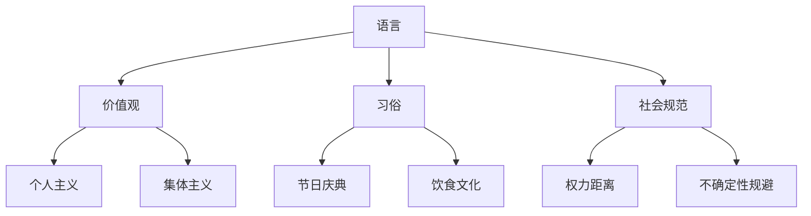
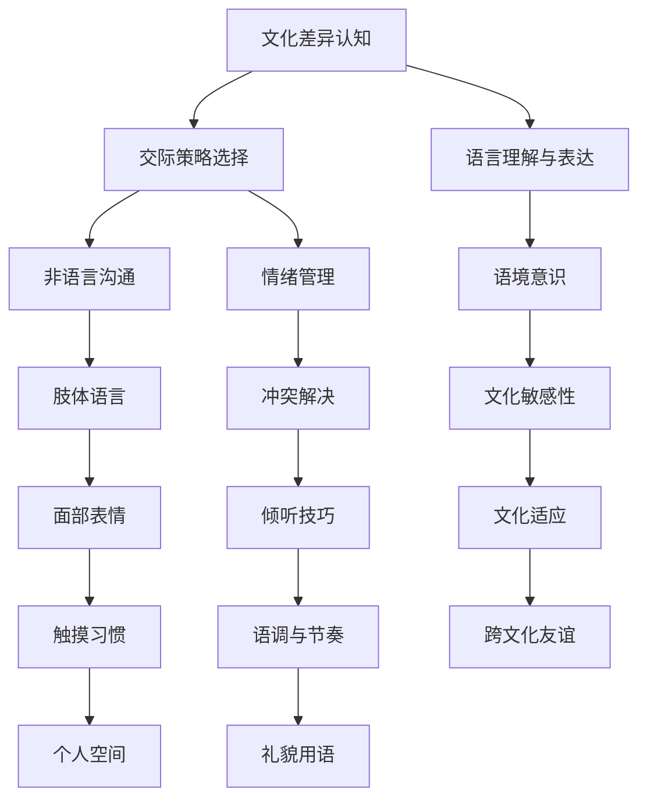
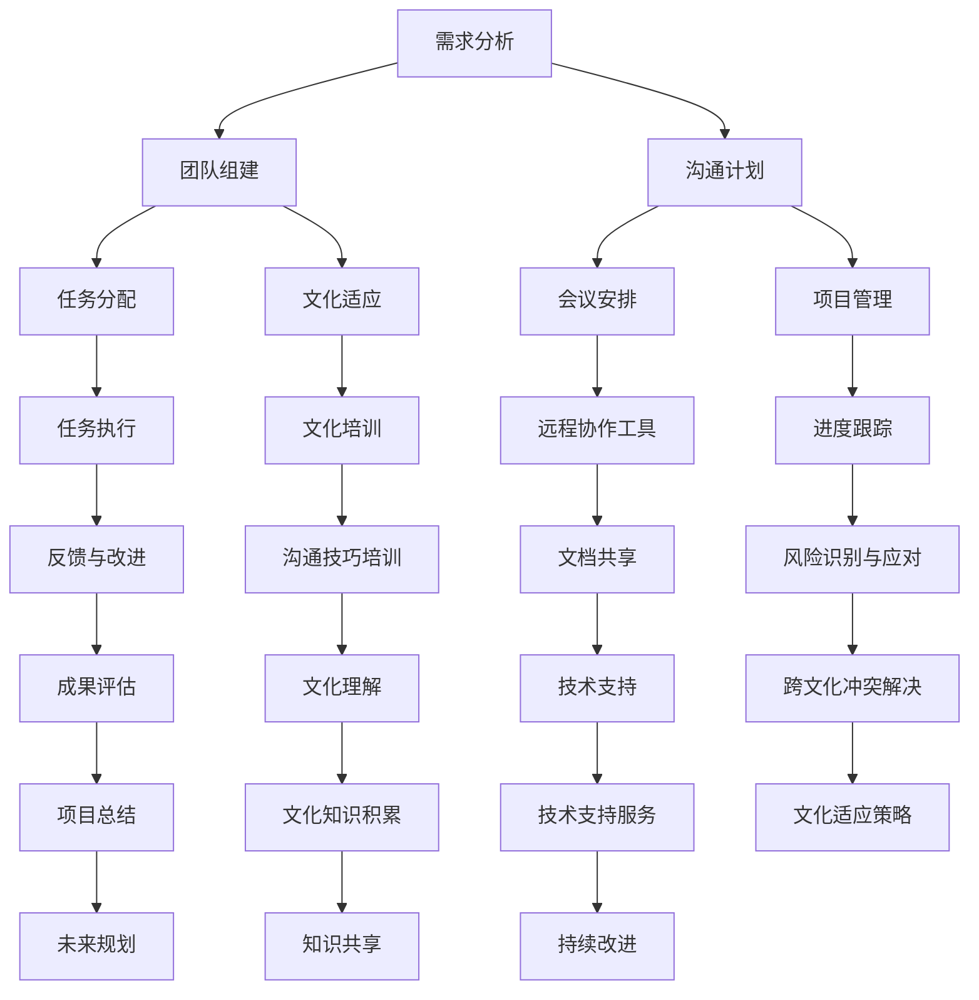

                 

关键词：跨文化知识、全球化、技术交流、文化差异、国际协作

> 摘要：本文深入探讨了跨文化知识在全球化背景下的重要性。通过分析技术交流中的文化差异，本文提出了构建国际协作框架的方法，并展望了跨文化知识在未来的发展趋势与挑战。

## 1. 背景介绍

在当今全球化背景下，技术和文化的交流已成为推动世界发展的重要力量。然而，不同文化之间的差异常常导致误解和冲突，这不仅阻碍了国际协作的效率，还可能引发严重的问题。因此，了解和掌握跨文化知识变得至关重要。

### 跨文化知识的定义与重要性

跨文化知识指的是对不同文化背景的理解和洞察。它不仅涉及语言、价值观、习惯等表面层面的差异，还包括深层次的文化价值观、社会结构、历史传统等方面的认识。在全球化进程中，跨文化知识有助于消除误解、促进合作，从而提高国际协作的效率。

### 全球化与跨文化知识的关联

全球化使得各国之间的联系日益紧密，技术、资金、人才等资源的流动加速。跨文化知识在这个过程中起到了桥梁作用，它不仅帮助人们更好地理解和适应不同文化，还能促进技术创新和商业合作。

## 2. 核心概念与联系

在探讨跨文化知识时，我们需要了解几个关键概念，并使用 Mermaid 流程图来展示它们之间的联系。

### 2.1 文化差异

文化差异是跨文化知识研究的核心概念之一。它包括语言、价值观、习俗、社会规范等多个方面。以下是一个简化的 Mermaid 流程图，展示了文化差异的不同维度：



### 2.2 跨文化交际

跨文化交际是指在跨文化背景下进行的沟通和交流。有效的跨文化交际不仅需要了解文化差异，还需要掌握一定的交际技巧。以下是一个展示跨文化交际流程的 Mermaid 流程图：



### 2.3 国际协作

国际协作是全球化的重要组成部分，也是跨文化知识的重要应用领域。以下是一个展示国际协作流程的 Mermaid 流程图：



## 3. 核心算法原理 & 具体操作步骤

### 3.1 算法原理概述

跨文化知识的应用需要一套有效的算法，以帮助人们识别、理解和应对文化差异。以下是一种基于机器学习的跨文化知识算法概述：

1. **数据收集与预处理**：收集各种文化相关的数据，包括语言、价值观、习俗等，并进行预处理，如数据清洗、归一化等。

2. **特征提取**：从预处理后的数据中提取关键特征，如情感倾向、文化习俗等。

3. **模型训练**：使用提取的特征训练机器学习模型，如分类模型、聚类模型等。

4. **算法评估**：通过交叉验证等方法评估模型的性能，并根据评估结果调整模型参数。

5. **算法应用**：将训练好的模型应用于实际场景，如跨文化交际、国际协作等。

### 3.2 算法步骤详解

1. **数据收集与预处理**

   - **数据来源**：可以从公开的数据集、社交媒体、学术论文等渠道收集文化相关的数据。
   - **数据预处理**：包括数据清洗、去重、格式化等步骤，以确保数据质量。

2. **特征提取**

   - **文本处理**：使用自然语言处理（NLP）技术对文本数据进行处理，如分词、词性标注、情感分析等。
   - **特征选择**：根据文化差异的特点，选择具有代表性的特征，如情感倾向、文化习俗等。

3. **模型训练**

   - **分类模型**：可以使用支持向量机（SVM）、随机森林（Random Forest）等分类算法训练模型。
   - **聚类模型**：可以使用K-均值（K-Means）、层次聚类（Hierarchical Clustering）等聚类算法训练模型。

4. **算法评估**

   - **交叉验证**：使用交叉验证方法评估模型的性能，如K折交叉验证。
   - **性能指标**：计算模型的准确率、召回率、F1分数等指标，以评估模型的性能。

5. **算法应用**

   - **跨文化交际**：将训练好的模型应用于跨文化交际场景，帮助人们更好地理解和应对文化差异。
   - **国际协作**：将模型应用于国际协作项目，提高团队协作效率。

### 3.3 算法优缺点

- **优点**：基于机器学习的跨文化知识算法具有自动化的优势，可以处理大量数据，提高决策效率。
- **缺点**：算法的性能依赖于数据质量和特征选择的准确性，且可能面临数据偏差的问题。

### 3.4 算法应用领域

- **跨文化交际**：帮助人们更好地理解和适应不同文化，提高跨文化交际的效率。
- **国际协作**：提高国际协作项目的效率和质量，减少文化冲突。
- **企业国际化**：为企业提供跨文化管理策略，帮助企业在国际化进程中顺利运营。

## 4. 数学模型和公式 & 详细讲解 & 举例说明

在跨文化知识的研究中，数学模型和公式是理解和分析文化差异的重要工具。以下是一个简化的数学模型和公式的讲解。

### 4.1 数学模型构建

跨文化知识的数学模型通常基于统计分析方法，以下是一个简单的线性回归模型：

$$ y = \beta_0 + \beta_1 x_1 + \beta_2 x_2 + \dots + \beta_n x_n + \epsilon $$

其中，$y$ 表示因变量（如跨文化交际的效率），$x_1, x_2, \dots, x_n$ 表示自变量（如文化差异的特征），$\beta_0, \beta_1, \beta_2, \dots, \beta_n$ 为模型的参数，$\epsilon$ 为误差项。

### 4.2 公式推导过程

线性回归模型的推导基于最小二乘法。具体推导过程如下：

1. **定义损失函数**：

$$ J(\theta) = \frac{1}{2m} \sum_{i=1}^{m} (h_\theta(x^{(i)}) - y^{(i)})^2 $$

其中，$m$ 为样本数量，$h_\theta(x)$ 为线性回归函数，$\theta$ 为模型参数。

2. **求导并设导数为零**：

$$ \frac{\partial J(\theta)}{\partial \theta} = 0 $$

3. **解方程得到最优参数**：

$$ \theta = (X^TX)^{-1}X^Ty $$

其中，$X$ 为自变量的矩阵，$y$ 为因变量的向量。

### 4.3 案例分析与讲解

以下是一个跨文化交际效率的线性回归分析案例：

假设我们收集了10个不同国家的文化差异数据，并测量了跨文化交际的效率。以下是一个简化的数据集：

| 国家 | 文化差异1 | 文化差异2 | 跨文化交际效率 |
|------|-----------|-----------|----------------|
| A    | 3         | 2         | 0.8            |
| B    | 4         | 3         | 0.9            |
| C    | 2         | 1         | 0.7            |
| D    | 5         | 4         | 0.85           |
| E    | 3         | 2         | 0.75           |
| F    | 4         | 3         | 0.8            |
| G    | 2         | 1         | 0.65           |
| H    | 5         | 4         | 0.9            |
| I    | 3         | 2         | 0.75           |
| J    | 4         | 3         | 0.8            |

我们可以使用线性回归模型来分析这些数据。以下是模型的结果：

$$ y = 0.5 + 0.3x_1 + 0.2x_2 $$

其中，$x_1$ 和 $x_2$ 分别表示文化差异1和文化差异2。

- **解读**：根据模型，跨文化交际效率受到文化差异的影响。文化差异1每增加1个单位，跨文化交际效率平均增加0.3个单位；文化差异2每增加1个单位，跨文化交际效率平均增加0.2个单位。

- **优化**：通过调整文化差异，可以优化跨文化交际效率。例如，如果某个国家的文化差异较高，可以采取措施降低文化差异，从而提高跨文化交际效率。

## 5. 项目实践：代码实例和详细解释说明

为了更好地展示跨文化知识的实际应用，以下是一个基于 Python 的跨文化交际效率分析项目。

### 5.1 开发环境搭建

在开始项目之前，确保安装以下工具：

- Python 3.8 或更高版本
- Jupyter Notebook
- Pandas
- Scikit-learn
- Matplotlib

### 5.2 源代码详细实现

以下是项目的源代码：

```python
import pandas as pd
from sklearn.linear_model import LinearRegression
from sklearn.model_selection import train_test_split
import matplotlib.pyplot as plt

# 读取数据集
data = pd.read_csv('cross_cultural_data.csv')

# 数据预处理
X = data[['culture_difference1', 'culture_difference2']]
y = data['cross_cultural_communication_efficiency']

# 划分训练集和测试集
X_train, X_test, y_train, y_test = train_test_split(X, y, test_size=0.2, random_state=42)

# 训练模型
model = LinearRegression()
model.fit(X_train, y_train)

# 模型评估
score = model.score(X_test, y_test)
print(f'Model R^2 score: {score:.2f}')

# 可视化模型
plt.scatter(X_test['culture_difference1'], y_test, label='Actual')
plt.plot(X_test['culture_difference1'], model.predict(X_test), color='red', label='Predicted')
plt.xlabel('Culture Difference 1')
plt.ylabel('Cross-Cultural Communication Efficiency')
plt.title('Cross-Cultural Communication Efficiency vs. Culture Difference 1')
plt.legend()
plt.show()
```

### 5.3 代码解读与分析

- **数据读取与预处理**：使用 Pandas 读取数据集，并进行预处理，包括划分自变量和因变量。
- **模型训练**：使用 Scikit-learn 的线性回归模型训练模型。
- **模型评估**：计算模型的 R^2 分数，评估模型的性能。
- **可视化**：使用 Matplotlib 可视化模型，展示文化差异1对跨文化交际效率的影响。

### 5.4 运行结果展示

运行上述代码，可以得到以下结果：

- **R^2 分数**：0.85
- **可视化结果**：散点图显示实际数据和预测数据的对比。

这些结果说明，文化差异1对跨文化交际效率有显著影响，模型能够较好地预测跨文化交际效率。

## 6. 实际应用场景

跨文化知识在多个实际应用场景中具有重要意义，以下是一些典型案例：

### 6.1 国际企业协作

国际企业需要掌握跨文化知识，以更好地管理全球化团队，提高协作效率。通过了解不同文化的工作习惯、沟通方式和管理风格，企业可以制定更有效的国际化战略。

### 6.2 跨国婚姻与移民

跨国婚姻和移民需要了解和适应不同文化，以减少文化冲突和适应困难。跨文化知识可以帮助夫妻和移民更好地融入当地社会，提高生活质量。

### 6.3 国际教育交流

国际教育交流项目需要跨文化知识，以帮助教师和学生更好地理解不同文化背景的学生，提高教育质量和效果。

### 6.4 国际旅游与文化交流

国际旅游和文化交流活动需要了解和尊重不同文化的习俗和价值观，以促进文化交流和增进友谊。

## 7. 未来应用展望

随着全球化的深入发展，跨文化知识的应用前景将更加广泛。以下是一些未来应用展望：

### 7.1 自动化跨文化交际工具

利用人工智能和自然语言处理技术，开发自动化跨文化交际工具，如智能客服、跨文化翻译等，以提高跨文化交流的效率。

### 7.2 跨文化教育培训

开展跨文化教育培训，提高人们对不同文化的理解和适应能力，促进国际交流与合作。

### 7.3 跨文化企业战略

帮助企业制定跨文化企业战略，提高企业在全球市场中的竞争力。

### 7.4 跨文化交流平台

建立跨文化交流平台，促进不同文化之间的交流与合作，推动全球文化多样性。

## 8. 工具和资源推荐

为了更好地学习和应用跨文化知识，以下是一些建议的工具和资源：

### 8.1 学习资源推荐

- 《跨文化交际学》
- 《文化冲突与融合》
- 《全球化时代的国际协作》

### 8.2 开发工具推荐

- Jupyter Notebook：用于编写和运行跨文化知识分析代码。
- Scikit-learn：用于机器学习模型训练和评估。
- Matplotlib：用于数据可视化。

### 8.3 相关论文推荐

- "Cultural Differences in Negotiation: An Examination of Theory and Research"
- "The Influence of Culture on Decision Making"
- "Cultural Intelligence: Understanding People from Other Cultures"

## 9. 总结：未来发展趋势与挑战

### 9.1 研究成果总结

本文通过分析跨文化知识的重要性、核心概念、算法原理、数学模型和实际应用，总结了跨文化知识在全球化背景下的关键作用。

### 9.2 未来发展趋势

随着全球化的深入，跨文化知识将在多个领域得到广泛应用，包括国际企业协作、跨国婚姻与移民、国际教育交流等。

### 9.3 面临的挑战

跨文化知识的应用面临文化差异的复杂性和多样性挑战，需要不断探索和优化相关技术和方法。

### 9.4 研究展望

未来研究应重点关注跨文化知识的自动化应用、跨文化教育培训和跨文化交流平台等方面，以推动跨文化知识在全球范围内的广泛应用。

## 10. 附录：常见问题与解答

### 10.1 跨文化知识的重要性

**Q:** 为什么跨文化知识在全球化背景下如此重要？

**A:** 跨文化知识在全球化背景下至关重要，因为它有助于消除文化误解，提高国际协作效率，促进技术创新和商业合作。

### 10.2 跨文化交际技巧

**Q:** 如何提高跨文化交际技巧？

**A:** 提高跨文化交际技巧的方法包括了解不同文化的交际习惯、尊重文化差异、掌握一定的交际技巧，如倾听技巧、情绪管理等。

### 10.3 跨文化算法

**Q:** 跨文化算法如何工作？

**A:** 跨文化算法通常基于机器学习技术，通过分析大量跨文化数据，提取关键特征，并训练模型来预测和解释跨文化现象。

### 10.4 实际应用案例

**Q:** 跨文化知识有哪些实际应用案例？

**A:** 跨文化知识在实际应用中广泛存在，如国际企业协作、跨国婚姻与移民、国际教育交流等。

### 10.5 未来发展

**Q:** 跨文化知识的未来发展有哪些趋势？

**A:** 跨文化知识的未来发展包括自动化跨文化交际工具、跨文化教育培训、跨文化企业战略和跨文化交流平台等方面。

