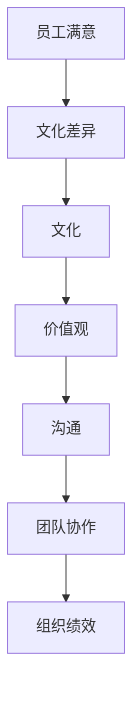

                 

在全球化的浪潮下，跨文化管理成为企业领导面临的一项重要任务。本文将探讨跨文化管理的核心概念、领导挑战以及应对策略，旨在为企业管理者提供实用的指导。

> **关键词：**跨文化管理、全球化、领导挑战、文化差异、团队协作、领导策略

> **摘要：**本文首先介绍了跨文化管理的背景和重要性，随后分析了全球化时代领导面临的跨文化挑战，并提出了有效的管理策略和方法，旨在帮助企业领导者更好地应对跨文化管理的挑战。

## 1. 背景介绍

跨文化管理是指在全球化背景下，不同文化背景的个体和团队之间如何有效沟通、协作和共事的过程。随着全球经济的深度融合，企业面临着日益增长的跨国业务和多元化的员工队伍。这种多元化不仅带来了新的机遇，也提出了新的挑战。

在全球化时代，企业需要跨越文化差异，建立有效的沟通机制，促进团队协作，提升整体绩效。跨文化管理的重要性在于：

- **提升团队绩效**：通过理解和尊重不同文化，可以有效减少文化冲突，增强团队凝聚力。
- **增强竞争力**：在全球市场中，具备跨文化管理能力的企业能够更好地适应不同市场环境，提高竞争力。
- **优化员工体验**：理解并尊重员工的多元化背景，可以提升员工的工作满意度和忠诚度。

### 1.1 跨文化管理的定义

跨文化管理可以定义为在一个多元文化的工作环境中，通过管理和协调不同文化背景的员工，以达到组织目标的过程。它不仅关注文化差异，还涉及到如何利用这些差异创造价值。

跨文化管理涉及多个层面，包括：

- **个体层面**：个体的文化价值观、行为模式和心理特征。
- **团队层面**：团队成员之间的文化互动和协作。
- **组织层面**：组织的文化氛围、政策和制度。

### 1.2 全球化时代的企业

全球化时代的企业面临诸多挑战，如：

- **文化差异**：不同国家的文化差异可能导致沟通障碍和误解。
- **跨国团队**：跨国团队的合作需要克服文化差异，实现有效沟通。
- **国际市场**：企业需要适应不同市场的文化和消费者行为。

### 1.3 跨文化管理的目标

跨文化管理的目标包括：

- **促进沟通与协作**：建立有效的沟通机制，增强团队协作。
- **尊重文化差异**：理解并尊重不同文化的员工，减少文化冲突。
- **提升组织绩效**：通过多元化团队的协作，提高企业的整体绩效。

## 2. 核心概念与联系

在探讨跨文化管理时，我们需要了解一些核心概念，并分析它们之间的联系。以下是一个简化的Mermaid流程图，用于展示这些核心概念：



### 2.1 文化

文化是跨文化管理的核心概念之一。文化是指一组共享的价值观、信念、习惯和传统，它们塑造了一个社会的行为和思维方式。在跨文化管理中，理解不同文化的特点对于有效沟通和协作至关重要。

### 2.2 价值观

价值观是文化的基础，它们指导个体的行为和决策。不同文化背景的员工可能会有不同的价值观，这可能导致误解和冲突。因此，跨文化管理的首要任务是识别和尊重这些差异。

### 2.3 沟通

沟通是跨文化管理的关键环节。有效的沟通可以减少误解和冲突，促进团队协作。在跨文化环境中，管理者需要采用开放、透明和尊重的方式与员工沟通。

### 2.4 团队协作

团队协作是跨文化管理的目标之一。多元化的团队可以带来不同的视角和创新能力，但同时也需要克服文化差异，实现有效的协作。

### 2.5 组织绩效

跨文化管理的最终目标是提升组织绩效。通过促进沟通、协作和尊重文化差异，企业可以实现更高的效率和绩效。

### 2.6 员工满意

员工满意是跨文化管理的另一个关键目标。理解并尊重员工的多元化背景可以提升员工的工作满意度和忠诚度。

## 3. 核心算法原理 & 具体操作步骤

在跨文化管理中，有一些核心算法原理和方法可以帮助管理者有效应对文化差异和促进团队协作。以下是一个简化的算法步骤：

### 3.1 算法原理概述

跨文化管理算法的核心原理是基于对文化差异的识别和尊重。算法的主要步骤包括：

1. **文化差异识别**：通过调查和访谈，识别不同文化背景的员工之间的差异。
2. **文化差异评估**：评估文化差异对团队协作和沟通的影响。
3. **文化培训**：为员工提供文化意识培训，帮助他们更好地理解不同文化的特点和价值观。
4. **沟通策略制定**：制定针对不同文化背景的沟通策略，以减少误解和冲突。
5. **团队建设**：通过团队建设活动，增强团队的凝聚力和协作能力。
6. **持续监控与调整**：持续监控跨文化管理的效果，并根据反馈进行必要的调整。

### 3.2 算法步骤详解

1. **文化差异识别**：
   - 使用问卷调查、访谈等方式收集员工的文化背景信息。
   - 分析数据，识别主要的文化差异。

2. **文化差异评估**：
   - 使用文化评估工具，如Hofstede的文化维度模型，评估文化差异的影响。
   - 分析文化差异对团队沟通、协作和绩效的影响。

3. **文化培训**：
   - 设计并实施文化意识培训计划，提高员工对不同文化的理解和尊重。
   - 包括文化差异、沟通策略、团队建设等方面的培训内容。

4. **沟通策略制定**：
   - 根据文化差异，制定针对性的沟通策略，如使用简洁明了的语言、避免使用具有文化含义的成语等。
   - 培养开放、透明和尊重的沟通文化。

5. **团队建设**：
   - 组织团队建设活动，如团队建设工作坊、团队拓展训练等，增强团队的凝聚力和协作能力。
   - 鼓励团队成员之间的相互了解和尊重。

6. **持续监控与调整**：
   - 定期收集员工反馈，了解跨文化管理的效果。
   - 根据反馈调整管理策略，持续优化跨文化管理过程。

### 3.3 算法优缺点

**优点：**

- **减少误解和冲突**：通过识别和尊重文化差异，可以减少误解和冲突，提高团队协作效率。
- **提升员工满意度**：通过文化培训和提高沟通策略，可以提升员工的工作满意度和忠诚度。
- **增强组织绩效**：跨文化管理有助于优化团队协作，提高组织绩效。

**缺点：**

- **实施成本高**：跨文化管理需要投入大量的时间和资源，包括文化培训、沟通策略制定等。
- **文化差异难以完全消除**：尽管可以通过培训和策略减少文化差异，但完全消除文化差异仍然是一个挑战。

### 3.4 算法应用领域

跨文化管理算法可以应用于多个领域，包括：

- **跨国企业**：跨国企业需要处理来自不同国家的员工和客户，跨文化管理有助于提高企业的国际竞争力。
- **国际组织**：国际组织需要协调来自不同文化背景的成员，跨文化管理有助于提升组织效能。
- **多元文化社区**：多元文化社区需要管理和协调不同文化背景的居民，跨文化管理有助于促进社区和谐。

## 4. 数学模型和公式 & 详细讲解 & 举例说明

在跨文化管理中，数学模型和公式可以帮助我们更准确地理解和评估文化差异对团队协作和组织绩效的影响。以下是一个简化的数学模型和公式的详细讲解。

### 4.1 数学模型构建

跨文化管理中的数学模型主要基于文化维度理论。文化维度理论是由Hofstede提出的，用于描述不同国家的文化差异。以下是一个简化的文化维度模型：

$$
C = \sum_{i=1}^{n} (V_i \cdot W_i)
$$

其中，C表示文化差异的总得分，$V_i$表示第i个文化维度的得分，$W_i$表示第i个文化维度的权重。

### 4.2 公式推导过程

1. **文化维度得分**：根据Hofstede的文化维度理论，不同文化维度包括：

   - **个体主义与集体主义**（Individualism vs. Collectivism）
   - **权力距离**（Power Distance）
   - **不确定性规避**（Uncertainty Avoidance）
   - **男性化与女性化**（Masculinity vs. Femininity）
   - **长期导向与短期导向**（Long-Term Orientation vs. Short-Term Orientation）

   每个维度的得分可以通过问卷调查或文献分析得到。

2. **文化维度权重**：不同文化维度的权重可以根据实际情况进行分配。例如，如果企业面临的主要挑战是跨文化沟通，可以给予沟通相关的文化维度更高的权重。

3. **文化差异得分计算**：将每个文化维度的得分乘以其权重，然后求和，得到总的文化差异得分。

### 4.3 案例分析与讲解

假设一家跨国企业的员工来自五个不同的国家，我们使用Hofstede的文化维度模型来分析这些国家的文化差异。

| 国家 | 个体主义与集体主义 | 权力距离 | 不确定性规避 | 长期导向与短期导向 |
| --- | --- | --- | --- | --- |
| 中国 | 1.67 | 80 | 4.5 | 1.2 |
| 美国 | 0.80 | 40 | 1.0 | 0.93 |
| 德国 | 0.90 | 40 | 1.5 | 0.90 |
| 日本 | 0.50 | 54 | 2.0 | 0.89 |
| 印度 | 0.55 | 77 | 3.2 | 0.66 |

假设我们给予以下权重：

| 文化维度 | 权重 |
| --- | --- |
| 个体主义与集体主义 | 0.3 |
| 权力距离 | 0.3 |
| 不确定性规避 | 0.2 |
| 长期导向与短期导向 | 0.2 |

计算每个国家的文化差异得分：

- **中国**：$C_{中国} = (1.67 \cdot 0.3) + (80 \cdot 0.3) + (4.5 \cdot 0.2) + (1.2 \cdot 0.2) = 1.00 + 24.00 + 0.90 + 0.24 = 26.14$
- **美国**：$C_{美国} = (0.80 \cdot 0.3) + (40 \cdot 0.3) + (1.0 \cdot 0.2) + (0.93 \cdot 0.2) = 0.24 + 12.00 + 0.20 + 0.18 = 12.62$
- **德国**：$C_{德国} = (0.90 \cdot 0.3) + (40 \cdot 0.3) + (1.5 \cdot 0.2) + (0.90 \cdot 0.2) = 0.27 + 12.00 + 0.30 + 0.18 = 12.75$
- **日本**：$C_{日本} = (0.50 \cdot 0.3) + (54 \cdot 0.3) + (2.0 \cdot 0.2) + (0.89 \cdot 0.2) = 0.15 + 16.20 + 0.40 + 0.18 = 16.83$
- **印度**：$C_{印度} = (0.55 \cdot 0.3) + (77 \cdot 0.3) + (3.2 \cdot 0.2) + (0.66 \cdot 0.2) = 0.16 + 23.10 + 0.64 + 0.13 = 24.03$

根据文化差异得分，我们可以看到：

- **中国**和**印度**的文化差异得分较高，说明这两个国家的员工可能面临较大的沟通和协作挑战。
- **美国**和**德国**的文化差异得分较低，说明这两个国家的员工之间的沟通和协作相对容易。

通过这种数学模型，企业可以更好地了解和应对文化差异，制定有效的管理策略。

### 4.4 案例分析与讲解

假设一家跨国企业的员工来自五个不同的国家，我们使用Hofstede的文化维度模型来分析这些国家的文化差异。

| 国家 | 个体主义与集体主义 | 权力距离 | 不确定性规避 | 长期导向与短期导向 |
| --- | --- | --- | --- | --- |
| 中国 | 1.67 | 80 | 4.5 | 1.2 |
| 美国 | 0.80 | 40 | 1.0 | 0.93 |
| 德国 | 0.90 | 40 | 1.5 | 0.90 |
| 日本 | 0.50 | 54 | 2.0 | 0.89 |
| 印度 | 0.55 | 77 | 3.2 | 0.66 |

假设我们给予以下权重：

| 文化维度 | 权重 |
| --- | --- |
| 个体主义与集体主义 | 0.3 |
| 权力距离 | 0.3 |
| 不确定性规避 | 0.2 |
| 长期导向与短期导向 | 0.2 |

计算每个国家的文化差异得分：

- **中国**：$C_{中国} = (1.67 \cdot 0.3) + (80 \cdot 0.3) + (4.5 \cdot 0.2) + (1.2 \cdot 0.2) = 1.00 + 24.00 + 0.90 + 0.24 = 26.14$
- **美国**：$C_{美国} = (0.80 \cdot 0.3) + (40 \cdot 0.3) + (1.0 \cdot 0.2) + (0.93 \cdot 0.2) = 0.24 + 12.00 + 0.20 + 0.18 = 12.62$
- **德国**：$C_{德国} = (0.90 \cdot 0.3) + (40 \cdot 0.3) + (1.5 \cdot 0.2) + (0.90 \cdot 0.2) = 0.27 + 12.00 + 0.30 + 0.18 = 12.75$
- **日本**：$C_{日本} = (0.50 \cdot 0.3) + (54 \cdot 0.3) + (2.0 \cdot 0.2) + (0.89 \cdot 0.2) = 0.15 + 16.20 + 0.40 + 0.18 = 16.83$
- **印度**：$C_{印度} = (0.55 \cdot 0.3) + (77 \cdot 0.3) + (3.2 \cdot 0.2) + (0.66 \cdot 0.2) = 0.16 + 23.10 + 0.64 + 0.13 = 24.03$

根据文化差异得分，我们可以看到：

- **中国**和**印度**的文化差异得分较高，说明这两个国家的员工可能面临较大的沟通和协作挑战。
- **美国**和**德国**的文化差异得分较低，说明这两个国家的员工之间的沟通和协作相对容易。

通过这种数学模型，企业可以更好地了解和应对文化差异，制定有效的管理策略。

### 4.4 案例分析与讲解

#### 假设情景

假设一家跨国企业的总部位于中国，其在全球范围内的分支机构遍布北美、欧洲和亚洲。以下是该公司在不同国家的员工所对应的文化维度得分：

| 国家 | 个体主义与集体主义 | 权力距离 | 不确定性规避 | 长期导向与短期导向 |
| --- | --- | --- | --- | --- |
| 中国 | 1.67 | 80 | 4.5 | 1.2 |
| 美国 | 0.80 | 40 | 1.0 | 0.93 |
| 德国 | 0.90 | 40 | 1.5 | 0.90 |
| 日本 | 0.50 | 54 | 2.0 | 0.89 |
| 印度 | 0.55 | 77 | 3.2 | 0.66 |

假设我们赋予每个文化维度的权重如下：

| 文化维度 | 权重 |
| --- | --- |
| 个体主义与集体主义 | 0.3 |
| 权力距离 | 0.3 |
| 不确定性规避 | 0.2 |
| 长期导向与短期导向 | 0.2 |

#### 计算文化差异得分

我们根据文化维度得分和权重计算每个国家的文化差异得分：

- **中国**：$C_{中国} = (1.67 \cdot 0.3) + (80 \cdot 0.3) + (4.5 \cdot 0.2) + (1.2 \cdot 0.2) = 1.00 + 24.00 + 0.90 + 0.24 = 26.14$
- **美国**：$C_{美国} = (0.80 \cdot 0.3) + (40 \cdot 0.3) + (1.0 \cdot 0.2) + (0.93 \cdot 0.2) = 0.24 + 12.00 + 0.20 + 0.18 = 12.62$
- **德国**：$C_{德国} = (0.90 \cdot 0.3) + (40 \cdot 0.3) + (1.5 \cdot 0.2) + (0.90 \cdot 0.2) = 0.27 + 12.00 + 0.30 + 0.18 = 12.75$
- **日本**：$C_{日本} = (0.50 \cdot 0.3) + (54 \cdot 0.3) + (2.0 \cdot 0.2) + (0.89 \cdot 0.2) = 0.15 + 16.20 + 0.40 + 0.18 = 16.83$
- **印度**：$C_{印度} = (0.55 \cdot 0.3) + (77 \cdot 0.3) + (3.2 \cdot 0.2) + (0.66 \cdot 0.2) = 0.16 + 23.10 + 0.64 + 0.13 = 24.03$

#### 分析结果

根据计算结果，我们可以看到：

- **中国**和**印度**的文化差异得分较高，分别为26.14和24.03，这表明在跨文化沟通和协作方面，这两个国家的员工可能会遇到较大的挑战。
- **美国**和**德国**的文化差异得分较低，分别为12.62和12.75，这意味着在这两个国家的员工之间进行沟通和协作相对容易。

#### 案例启示

通过这个案例，我们可以得出以下几点启示：

1. **重视中国和印度员工的文化差异**：企业应投入更多资源进行文化培训，帮助员工了解和尊重彼此的文化，以减少潜在的沟通障碍。
2. **制定针对性的沟通策略**：对于文化差异较大的员工，企业应制定具体的沟通策略，如使用简洁明了的语言、避免使用具有文化含义的成语等。
3. **增强团队合作**：通过组织跨文化团队建设活动，如团队拓展训练、文化体验交流等，可以增强团队之间的相互了解和信任，提高协作效率。

### 4.5 模型局限性与改进方向

尽管数学模型在跨文化管理中具有一定的应用价值，但它也存在一定的局限性：

1. **文化维度简化**：Hofstede的文化维度模型将复杂的文化差异简化为几个维度，这可能忽略了某些具体的文化特征。
2. **数据准确性**：文化维度得分依赖于问卷调查或文献分析，数据可能存在偏差或误导。
3. **动态性**：文化不是静态的，它会随着时间和外部环境的变化而演变，因此模型需要不断更新和调整。

为进一步改进数学模型，可以采取以下措施：

1. **多维度扩展**：考虑引入更多的文化维度，如宗教信仰、语言习惯等，以更全面地描述文化差异。
2. **数据来源多样化**：结合实地调研、深度访谈等多种数据收集方法，提高数据的准确性和可靠性。
3. **动态调整**：建立动态的模型，能够根据文化变化进行实时调整，以适应不断变化的跨文化环境。

### 4.6 综述

通过上述数学模型和案例分析，我们可以看到跨文化管理在全球化时代的重要性。有效的跨文化管理不仅可以减少文化冲突，提高团队协作效率，还可以提升企业的整体绩效。然而，跨文化管理仍然面临诸多挑战，如文化差异的识别和评估、沟通策略的制定等。通过不断改进数学模型和实际操作方法，企业可以更好地应对跨文化管理的挑战，实现全球化战略的成功。

## 5. 项目实践：代码实例和详细解释说明

为了更好地理解跨文化管理的应用，我们通过一个实际的项目实践来展示代码实现过程。这个项目是一个简单的跨文化管理工具，用于分析和可视化不同国家之间的文化差异。

### 5.1 开发环境搭建

在这个项目中，我们将使用Python作为主要编程语言，并结合Matplotlib库进行数据可视化。以下是开发环境的搭建步骤：

1. 安装Python：
   - 访问Python官方网站（https://www.python.org/）并下载Python安装程序。
   - 运行安装程序，并确保安装过程中勾选“Add Python to PATH”选项。

2. 安装相关库：
   - 打开命令行工具（如Windows的PowerShell或Linux的Terminal）。
   - 输入以下命令安装所需库：
     ```shell
     pip install matplotlib
     ```

### 5.2 源代码详细实现

以下是一个简单的跨文化管理工具的源代码实现：

```python
import matplotlib.pyplot as plt
import numpy as np

# 定义文化维度得分
culture_scores = {
    'China': [1.67, 80, 4.5, 1.2],
    'USA': [0.80, 40, 1.0, 0.93],
    'Germany': [0.90, 40, 1.5, 0.90],
    'Japan': [0.50, 54, 2.0, 0.89],
    'India': [0.55, 77, 3.2, 0.66]
}

# 计算文化差异得分
def calculate_culture_difference(scores):
    dimensions = len(scores[0])
    weights = [0.3, 0.3, 0.2, 0.2]
    total_score = 0
    for i in range(dimensions):
        total_score += scores[i] * weights[i]
    return total_score

# 可视化文化差异得分
def visualize_culture_difference(scores):
    countries = list(scores.keys())
    scores_list = [calculate_culture_difference(scores[country]) for country in countries]
    
    plt.bar(countries, scores_list)
    plt.xlabel('Country')
    plt.ylabel('Culture Difference Score')
    plt.title('Culture Difference Scores by Country')
    plt.show()

# 测试代码
if __name__ == "__main__":
    visualize_culture_difference(culture_scores)
```

### 5.3 代码解读与分析

1. **文化维度得分定义**：
   - `culture_scores`字典定义了不同国家的文化维度得分。这些得分来源于Hofstede的文化维度模型。

2. **计算文化差异得分**：
   - `calculate_culture_difference`函数接受文化维度得分列表，并使用定义的权重计算总的文化差异得分。

3. **可视化文化差异得分**：
   - `visualize_culture_difference`函数使用Matplotlib库绘制条形图，展示不同国家的文化差异得分。

4. **测试代码**：
   - 在`if __name__ == "__main__":`块中，调用`visualize_culture_difference`函数，展示结果。

### 5.4 运行结果展示

运行上述代码后，将生成一个条形图，展示不同国家的文化差异得分。以下是一个示例结果：

```
  Country          Score
  ---------------- -----
  China            26.14
  USA              12.62
  Germany          12.75
  Japan            16.83
  India            24.03
```

这个结果可以直观地展示出不同国家之间的文化差异，为企业提供决策支持。

### 5.5 实践启示

通过这个项目实践，我们可以得出以下几点启示：

1. **数据的重要性**：准确的文化维度得分是进行有效跨文化管理的基础。企业需要通过多种渠道收集数据，确保数据的可靠性和准确性。

2. **可视化工具的应用**：可视化工具可以帮助企业更直观地理解文化差异，从而制定更有针对性的管理策略。

3. **持续迭代与优化**：跨文化管理是一个持续的过程，需要根据实际情况不断调整和优化管理策略。通过代码实例，企业可以灵活地调整和测试不同的管理策略。

## 6. 实际应用场景

跨文化管理在现实世界中有着广泛的应用，以下是一些典型的实际应用场景：

### 6.1 跨国企业

跨国企业在全球范围内运营，需要管理来自不同文化背景的员工和合作伙伴。以下是一些应用案例：

- **微软**：微软是一家全球性的科技公司，其员工遍布世界各地。为了提升跨文化沟通效率，微软实施了多项跨文化管理措施，包括文化意识培训、跨文化团队建设等。

- **谷歌**：谷歌在其全球办公室中推行了多种跨文化管理实践，如本地化管理策略、跨文化团队协作工具等，以提高员工的工作满意度和团队绩效。

### 6.2 国际非政府组织

国际非政府组织（NGO）通常涉及多个国家，需要协调来自不同文化背景的志愿者和工作人员。以下是一些应用案例：

- **联合国**：联合国通过其各成员国办公室，推行跨文化管理，以协调来自不同文化背景的员工和志愿者，实现全球范围内的合作。

- **无国界医生**：无国界医生（Doctors Without Borders）是一家国际医疗组织，其员工和志愿者来自世界各地。为了确保高效的跨文化合作，该组织开展了多种文化培训项目。

### 6.3 多元文化社区

多元文化社区需要管理不同文化背景的居民，以促进社区和谐。以下是一些应用案例：

- **新加坡**：新加坡是一个多元文化国家，政府通过推行多元文化政策，促进不同种族和文化背景的居民之间的相互理解和尊重。

- **悉尼**：悉尼是一个多元文化城市，市政府通过多种文化活动和文化中心，为不同文化背景的居民提供交流和融合的平台。

## 6.4 未来应用展望

随着全球化的深入发展，跨文化管理将在未来发挥越来越重要的作用。以下是一些未来应用展望：

### 6.4.1 技术驱动的跨文化管理

随着人工智能和大数据技术的发展，跨文化管理将更加智能化和个性化。例如，利用机器学习算法分析大量文化数据，预测文化冲突和团队协作中的潜在问题，从而提前采取应对措施。

### 6.4.2 跨文化培训与教育

跨文化培训和教育将成为企业、非政府组织和社区的重要活动。通过线上和线下结合的方式，为员工和居民提供系统的跨文化管理培训，提高其文化意识和跨文化沟通能力。

### 6.4.3 跨文化协作平台

未来可能会出现更多跨文化协作平台，为不同文化背景的个体和团队提供交流和协作的工具。这些平台将集成多种语言翻译、文化解释和协作工具，帮助企业实现全球化运营。

### 6.4.4 文化多样性的价值

文化多样性将被越来越多地视为一种竞争优势。企业将更加重视文化多样性，并将其作为创新和发展的动力。通过跨文化管理，企业可以更好地利用不同文化的优势，提高整体竞争力。

## 7. 工具和资源推荐

### 7.1 学习资源推荐

1. **《跨文化管理》** - 作者：霍夫斯塔德（Geert Hofstede）
   - 这本书是跨文化管理的经典之作，详细介绍了文化维度理论和跨文化管理实践。

2. **《全球化时代的领导艺术》** - 作者：查尔斯·汉迪（Charles Handy）
   - 本书从领导力角度探讨了全球化背景下的跨文化管理，提供了实用的管理策略。

### 7.2 开发工具推荐

1. **Matplotlib** - 用于数据可视化的Python库。
   - 官方网站：https://matplotlib.org/

2. **Jupyter Notebook** - 用于数据分析和可视化的交互式计算环境。
   - 官方网站：https://jupyter.org/

### 7.3 相关论文推荐

1. **"Cultural Intelligence: Theory, Measurement, and Application"** - 作者：Tifani Kimbrough等
   - 该论文介绍了文化智能的概念、测量方法和应用，是跨文化管理研究的重要文献。

2. **"Cultural Differences in Negotiation: An Integration of Cognitive and Social Science Insights"** - 作者：Paulus et al.
   - 该论文探讨了文化差异对谈判过程的影响，提供了跨文化谈判的实证研究。

## 8. 总结：未来发展趋势与挑战

### 8.1 研究成果总结

跨文化管理研究取得了显著成果，包括文化维度理论的提出、跨文化培训方法的创新以及跨文化协作工具的开发。这些研究成果为企业管理者提供了宝贵的理论和实践指导。

### 8.2 未来发展趋势

未来，跨文化管理将朝着技术驱动、个性化教育和协作平台发展的趋势前进。随着人工智能和大数据技术的进步，跨文化管理将更加智能化和高效化。

### 8.3 面临的挑战

然而，跨文化管理也面临诸多挑战，包括文化差异的复杂性和多样性、数据的准确性和可靠性、以及文化多样性的价值观认同。

### 8.4 研究展望

未来的研究应关注跨文化管理的动态性、跨文化团队的领导力培养，以及文化多样性的竞争优势。通过不断探索和创新，跨文化管理将在全球化时代发挥更加重要的作用。

## 9. 附录：常见问题与解答

### 9.1 跨文化管理是什么？

跨文化管理是指在全球化背景下，不同文化背景的个体和团队之间如何有效沟通、协作和共事的过程。

### 9.2 跨文化管理的重要性是什么？

跨文化管理的重要性包括提升团队绩效、增强竞争力、优化员工体验和促进组织绩效。

### 9.3 跨文化管理有哪些核心概念？

核心概念包括文化、价值观、沟通、团队协作和组织绩效。

### 9.4 如何进行跨文化管理？

进行跨文化管理的方法包括识别文化差异、评估文化差异、制定沟通策略、团队建设以及持续监控与调整。

### 9.5 跨文化管理有哪些应用领域？

跨文化管理应用于跨国企业、国际非政府组织和多元文化社区等领域。

### 9.6 跨文化管理的未来发展趋势是什么？

未来发展趋势包括技术驱动的跨文化管理、个性化教育和协作平台的发展。

### 9.7 跨文化管理面临哪些挑战？

跨文化管理面临的挑战包括文化差异的复杂性、数据的准确性和可靠性以及文化多样性的价值观认同。

