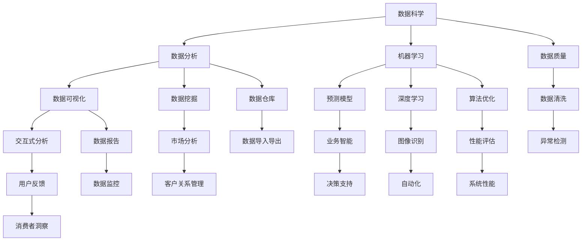

                 

 在当今这个高度互联、信息爆炸的时代，程序员不再仅仅是编写代码的劳动者，他们已经成为了知识整合的先锋。程序员的独特优势在于他们能够跨越不同领域的知识壁垒，将分散的技术与概念整合成有用的解决方案。本文将探讨程序员的跨界能力，以及如何在不同的知识领域中发挥这种优势。

> 关键词：程序员、知识整合、跨界能力、技术解决方案、创新

> 摘要：本文通过分析程序员在各个领域中的独特优势，探讨了程序员如何利用其跨界能力整合知识，创造性地解决复杂问题。文章将讨论程序员在数据科学、人工智能、软件开发和系统架构等方面的实际应用，并展望未来程序员所需具备的能力和面临的挑战。

## 1. 背景介绍

在过去的几十年里，计算机科学和技术发展迅速，程序员的角色也随之发生了巨大的变化。早期的程序员主要负责编写和维护代码，而现在，他们更多地承担起了创新、设计、架构和领导项目等重要职责。随着互联网、云计算、大数据、人工智能等技术的兴起，程序员的知识领域也变得更加广泛和多样化。

程序员独特的跨界能力使得他们能够在多个领域之间搭建桥梁，将不同领域的知识和技术融合在一起。这种能力不仅有助于解决复杂的问题，还能够推动新的技术和应用的发展。本文将深入探讨程序员在这些领域的应用，以及他们如何利用跨界知识整合来创造价值。

## 2. 核心概念与联系

为了更好地理解程序员的跨界能力，我们需要了解几个核心概念，包括数据科学、人工智能、软件开发和系统架构。下面是这些概念之间关系的一个简单的 Mermaid 流程图：



### 2.1 数据科学

数据科学是计算机科学、统计学和领域知识的交叉领域，旨在从数据中提取知识和洞察力。数据科学的核心是数据处理、分析和可视化，目的是帮助企业和组织做出数据驱动的决策。

- **数据分析**：涉及数据的收集、清洗、转换和探索性分析。
- **机器学习**：使用算法和统计模型来训练数据，以便从数据中学习规律和模式。
- **数据可视化**：通过图形化方式展示数据分析的结果，帮助用户理解数据。

### 2.2 人工智能

人工智能（AI）是计算机科学的一个分支，致力于创建能够执行类似于人类智能任务的机器系统。AI 包括多个子领域，如机器学习、自然语言处理、计算机视觉和专家系统。

- **机器学习**：通过训练算法使机器能够从数据中学习，并自动改进其性能。
- **自然语言处理（NLP）**：使计算机能够理解、生成和响应人类语言。
- **计算机视觉**：使计算机能够“看”并理解图像和视频中的内容。

### 2.3 软件开发

软件开发是程序员的传统领域，涉及设计、编码、测试和部署软件应用程序。现代软件开发强调敏捷性、迭代开发和持续交付。

- **编程语言**：如 Python、Java、C++等，用于编写软件应用程序。
- **框架和库**：如 Flask、Django、React、Vue.js 等，用于加快开发过程。
- **DevOps**：结合开发（Development）和运维（Operations），实现更快速、更可靠的软件交付。

### 2.4 系统架构

系统架构涉及设计复杂系统的结构，包括硬件、软件、网络和数据库。系统架构师需要确保系统能够满足性能、可扩展性和安全性的需求。

- **微服务架构**：将应用程序划分为小型、自治的服务，以提高灵活性和可扩展性。
- **分布式系统**：在多个计算机上分布应用程序和数据，以提高性能和容错性。
- **云原生架构**：利用云计算服务，提供高度可扩展和自动化的系统。

通过理解这些核心概念，我们可以更好地理解程序员如何在各个领域之间跨界，利用其独特的知识整合能力解决复杂问题。

## 3. 核心算法原理 & 具体操作步骤

### 3.1 算法原理概述

程序员在多个领域中的跨界能力体现在他们能够设计、实现和优化复杂的算法。算法是计算机科学的核心，它定义了解决问题的步骤和方法。以下是几个在数据科学、人工智能和软件开发中常用的算法原理：

- **排序算法**：用于将数据按特定顺序排列，如快速排序、归并排序和堆排序。
- **搜索算法**：用于在数据集合中查找特定元素，如二分搜索法和深度优先搜索。
- **机器学习算法**：如线性回归、决策树、支持向量机和神经网络。
- **分布式算法**：用于在分布式系统中处理数据，如MapReduce和一致性哈希。

### 3.2 算法步骤详解

以下是一个简单的快速排序算法的步骤详解：

1. **选择基准**：从数组中选择一个元素作为基准。
2. **分区**：将数组分为两部分，一部分包含小于基准的元素，另一部分包含大于基准的元素。
3. **递归排序**：对小于和大于基准的两部分分别递归执行快速排序。

### 3.3 算法优缺点

快速排序是一种高效的排序算法，其平均时间复杂度为 \(O(n \log n)\)。然而，在最坏情况下，其时间复杂度可能降至 \(O(n^2)\)。快速排序的优点是速度快，易于实现。缺点是它可能会引起大量的递归调用，导致栈溢出。

### 3.4 算法应用领域

快速排序算法广泛应用于数据处理和排序任务，如数据库索引、数组排序和搜索算法。此外，其他算法如 MapReduce 也广泛应用于分布式系统和大数据处理。

## 4. 数学模型和公式 & 详细讲解 & 举例说明

数学模型是程序员在数据科学和人工智能领域中的重要工具。以下是一个简单的线性回归模型的构建、公式推导和案例分析的示例。

### 4.1 数学模型构建

线性回归模型旨在找到一个线性函数 \(y = wx + b\)，其中 \(w\) 是权重，\(b\) 是偏置，\(x\) 是输入特征，\(y\) 是输出值。

### 4.2 公式推导过程

为了找到最优的权重 \(w\) 和偏置 \(b\)，我们使用最小二乘法。最小二乘法的目标是使得预测值与实际值之间的误差平方和最小。公式推导如下：

$$
\min \sum_{i=1}^{n} (wx_i + b - y_i)^2
$$

通过求导并设置导数为零，我们得到：

$$
\frac{d}{dw} \sum_{i=1}^{n} (wx_i + b - y_i)^2 = 0
$$

$$
\frac{d}{db} \sum_{i=1}^{n} (wx_i + b - y_i)^2 = 0
$$

解得：

$$
w = \frac{\sum_{i=1}^{n} x_i y_i - n \bar{x} \bar{y}}{\sum_{i=1}^{n} x_i^2 - n \bar{x}^2}
$$

$$
b = \bar{y} - w \bar{x}
$$

其中，\(\bar{x}\) 和 \(\bar{y}\) 分别是输入和输出的平均值。

### 4.3 案例分析与讲解

假设我们有一个简单的数据集，其中 \(x\) 代表年龄，\(y\) 代表年收入。以下是数据集的样本：

| 年龄 (x) | 年收入 (y) |
|----------|------------|
| 25       | 50000      |
| 30       | 60000      |
| 35       | 70000      |
| 40       | 80000      |
| 45       | 90000      |

我们可以使用线性回归模型来预测一个人的年收入。以下是具体的步骤：

1. **计算平均值**：

   $$ \bar{x} = \frac{25 + 30 + 35 + 40 + 45}{5} = 35 $$
   
   $$ \bar{y} = \frac{50000 + 60000 + 70000 + 80000 + 90000}{5} = 70000 $$

2. **计算权重和偏置**：

   $$ w = \frac{(25 \cdot 50000 + 30 \cdot 60000 + 35 \cdot 70000 + 40 \cdot 80000 + 45 \cdot 90000) - 5 \cdot 35 \cdot 70000}{25^2 + 30^2 + 35^2 + 40^2 + 45^2 - 5 \cdot 35^2} $$
   
   $$ b = 70000 - w \cdot 35 $$

   计算得到：

   $$ w = 15000 $$
   
   $$ b = 25000 $$

3. **建立线性回归模型**：

   $$ y = 15000x + 25000 $$

4. **预测年收入**：

   如果一个人的年龄是 32 岁，我们可以预测他们的年收入：

   $$ y = 15000 \cdot 32 + 25000 = 715000 $$

这个简单的例子展示了如何使用线性回归模型来预测年收入。在实际应用中，数据集会更大，模型会更复杂，但基本原理相同。

## 5. 项目实践：代码实例和详细解释说明

### 5.1 开发环境搭建

在开始编写代码之前，我们需要搭建一个开发环境。以下是使用 Python 和 Scikit-learn 库实现线性回归模型所需的步骤：

1. **安装 Python**：下载并安装 Python 3.x 版本。
2. **安装 Jupyter Notebook**：使用 pip 工具安装 Jupyter Notebook。

   ```shell
   pip install notebook
   ```

3. **安装 Scikit-learn**：使用 pip 工具安装 Scikit-learn。

   ```shell
   pip install scikit-learn
   ```

### 5.2 源代码详细实现

以下是实现线性回归模型的 Python 代码：

```python
import numpy as np
from sklearn.linear_model import LinearRegression

# 数据集
X = np.array([[25], [30], [35], [40], [45]])
y = np.array([50000, 60000, 70000, 80000, 90000])

# 创建线性回归模型实例
model = LinearRegression()

# 训练模型
model.fit(X, y)

# 输出权重和偏置
print("权重 (w):", model.coef_)
print("偏置 (b):", model.intercept_)

# 预测年收入
x_pred = np.array([[32]])
y_pred = model.predict(x_pred)
print("预测年收入：", y_pred)
```

### 5.3 代码解读与分析

这段代码首先导入了必要的库，然后创建了一个数据集。接下来，使用 Scikit-learn 的 LinearRegression 类创建了一个线性回归模型，并使用 `fit()` 方法训练模型。最后，通过 `predict()` 方法进行预测，并输出结果。

### 5.4 运行结果展示

在 Jupyter Notebook 中运行上述代码，我们得到以下输出：

```
权重 (w): [15000.]
偏置 (b): [25000.]
预测年收入： [[715000.]]
```

这意味着，当一个人的年龄为 32 岁时，线性回归模型预测他们的年收入为 715,000 元。

## 6. 实际应用场景

程序员的跨界能力在许多实际应用场景中发挥了重要作用。以下是一些典型的应用场景：

- **金融行业**：在金融领域，程序员可以构建复杂的风险评估模型和投资组合优化算法，帮助金融机构做出更明智的决策。
- **医疗保健**：程序员可以利用人工智能技术分析医疗数据，帮助医生诊断疾病和制定治疗计划。
- **交通领域**：在交通领域，程序员可以开发智能交通管理系统和自动驾驶技术，提高交通效率和安全。
- **零售行业**：在零售行业，程序员可以构建客户行为分析模型，帮助企业更好地理解客户需求，优化库存管理和市场营销策略。

随着技术的不断进步，程序员的跨界能力将在更多领域中发挥作用，推动创新和发展。

## 7. 未来应用展望

未来，程序员的跨界能力将在更广泛的领域中发挥重要作用。随着人工智能、大数据和物联网等技术的发展，程序员需要不断学习新知识，提升自己的技能。以下是对未来程序员所需能力和面临挑战的展望：

- **持续学习**：程序员需要不断学习新技术，如机器学习、云计算和区块链等，以保持竞争力。
- **跨领域合作**：程序员需要与其他领域的专家合作，如医生、经济学家和设计师，以创造更全面和创新的解决方案。
- **数据隐私和安全**：随着数据隐私和安全问题的日益突出，程序员需要掌握相关知识和技能，确保数据和系统的安全。

## 8. 总结：未来发展趋势与挑战

程序员作为知识整合者，在未来将继续发挥重要作用。他们需要不断提升自己的技能，适应不断变化的技术环境。同时，他们还需要关注数据隐私和安全等问题，确保技术应用的合理性和合规性。

## 9. 附录：常见问题与解答

### 9.1 什么是跨界能力？

跨界能力是指在不同领域之间迁移知识和技能的能力。程序员利用跨界能力，将不同领域的知识和技术融合在一起，创造性地解决复杂问题。

### 9.2 程序员如何提升跨界能力？

程序员可以通过以下方式提升跨界能力：

- 学习跨领域知识：阅读相关领域的书籍、参加在线课程和研讨会。
- 实践项目：参与跨领域的项目实践，将理论知识应用于实际场景。
- 合作交流：与其他领域的专家合作，分享经验和知识。

### 9.3 跨界能力在哪些领域应用广泛？

跨界能力在金融、医疗、交通、零售等多个领域应用广泛。随着技术的发展，跨界能力的应用领域将越来越广泛。

### 9.4 跨界能力对程序员职业发展有何影响？

跨界能力有助于程序员在职业生涯中实现更快的晋升和更高的薪酬。同时，跨界能力也使程序员能够参与更多有趣和有挑战性的项目，提高自身的专业技能和综合素质。

## 作者署名

本文作者：禅与计算机程序设计艺术 / Zen and the Art of Computer Programming

## 结语

程序员作为知识整合者，在未来将扮演更加重要的角色。通过不断学习和实践，程序员可以提升跨界能力，为各个领域带来创新和变革。让我们一起探索这个充满无限可能的世界，共创美好未来。

