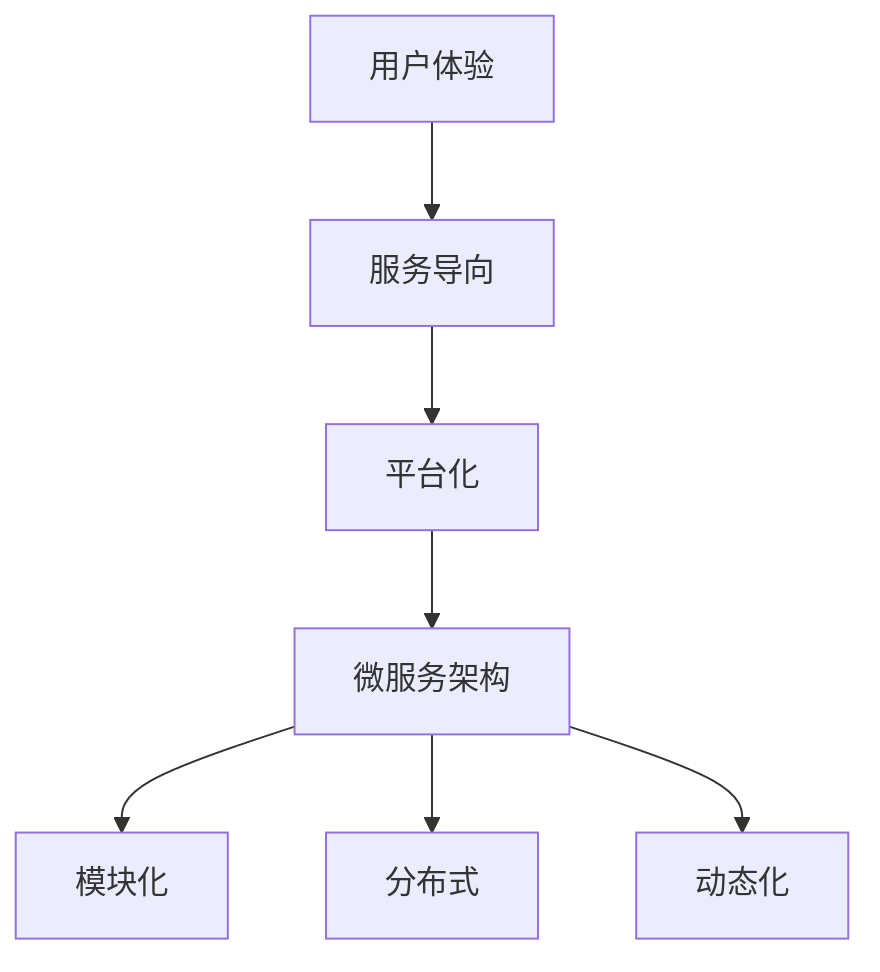

                 

关键词：软件 2.0、效率提升、价值创造、软件开发、技术进步

摘要：本文旨在探讨软件 2.0 时代所带来的价值变化。通过分析软件 2.0 的核心概念、技术原理、数学模型以及实际应用场景，本文揭示了软件 2.0 在提升效率、创造价值方面的重要作用。同时，文章还对未来软件 2.0 的发展趋势和挑战进行了展望。

## 1. 背景介绍

随着互联网技术的迅猛发展，软件产业迎来了一个新的时代——软件 2.0 时代。与传统的软件 1.0 相比，软件 2.0 更加强调用户体验、服务导向和平台化。在这一背景下，软件开发不仅追求功能的完善，更注重效率的提升和价值的创造。

软件 2.0 时代，云计算、大数据、人工智能等技术的深入应用，使得软件的架构、算法和开发流程发生了翻天覆地的变化。这些变化不仅改变了软件开发的方式，也带来了软件价值的全新定义。

## 2. 核心概念与联系

### 2.1 软件 2.0 的核心概念

软件 2.0 的核心概念包括用户体验、服务导向和平台化。

- **用户体验**：软件 2.0 更加注重用户的感受，通过简洁、直观的界面设计和高效、流畅的操作流程，提升用户的满意度。

- **服务导向**：软件 2.0 强调软件作为一种服务，提供个性化的解决方案，满足用户不断变化的需求。

- **平台化**：软件 2.0 通过搭建开放的平台，整合各类资源，实现软件的快速迭代和生态的繁荣。

### 2.2 软件 2.0 的架构

软件 2.0 的架构通常采用微服务架构，其核心特点包括：

- **模块化**：将软件功能划分为多个独立的模块，降低系统复杂度。

- **分布式**：通过分布式架构，提高系统的可扩展性和容错性。

- **动态化**：支持动态部署和扩展，满足快速变化的业务需求。

### 2.3 Mermaid 流程图

下面是一个简单的 Mermaid 流程图，展示了软件 2.0 的核心概念和架构之间的联系：



## 3. 核心算法原理 & 具体操作步骤

### 3.1 算法原理概述

软件 2.0 时代，算法在提升效率和创造价值方面发挥着重要作用。以下是一个常见的算法原理概述：

- **机器学习算法**：通过训练数据集，学习并优化模型，实现对数据的自动分析和预测。

- **深度学习算法**：利用多层神经网络，对数据进行深度特征提取，实现更高级的模型训练。

- **数据挖掘算法**：从大量数据中发现潜在的模式和关联，为业务决策提供支持。

### 3.2 算法步骤详解

以机器学习算法为例，其具体步骤如下：

1. **数据准备**：收集和整理数据，确保数据的准确性和完整性。

2. **特征工程**：对数据进行预处理，提取对模型训练有意义的特征。

3. **模型选择**：根据业务需求和数据特点，选择合适的机器学习模型。

4. **模型训练**：使用训练数据集，对模型进行训练和优化。

5. **模型评估**：使用验证数据集，评估模型的性能和效果。

6. **模型部署**：将训练好的模型部署到生产环境中，进行实际应用。

### 3.3 算法优缺点

机器学习算法的优点包括：

- **自动分析**：能够自动分析和处理大量数据，提高工作效率。

- **适应性**：能够根据新的数据和业务需求，快速调整和优化模型。

机器学习算法的缺点包括：

- **数据依赖**：模型的性能高度依赖于数据的质量和数量。

- **计算成本**：训练和优化模型通常需要大量的计算资源和时间。

### 3.4 算法应用领域

机器学习算法广泛应用于各个领域，包括但不限于：

- **金融**：风险控制、信用评估、投资策略等。

- **医疗**：疾病预测、诊断辅助、个性化治疗等。

- **电商**：推荐系统、商品分类、价格预测等。

## 4. 数学模型和公式 & 详细讲解 & 举例说明

### 4.1 数学模型构建

以线性回归模型为例，其数学模型可以表示为：

\[ Y = \beta_0 + \beta_1 \cdot X + \epsilon \]

其中，\( Y \) 是因变量，\( X \) 是自变量，\( \beta_0 \) 和 \( \beta_1 \) 是模型参数，\( \epsilon \) 是误差项。

### 4.2 公式推导过程

线性回归模型的推导过程主要涉及最小二乘法。通过求解损失函数的最小值，得到模型参数的最优解。

### 4.3 案例分析与讲解

假设我们要预测房价，根据已有的数据，构建一个线性回归模型。通过训练和评估，得到以下模型参数：

\[ \beta_0 = 100, \beta_1 = 200 \]

根据这个模型，我们可以预测新的房价。例如，当 \( X = 1000 \) 时，预测的房价为：

\[ Y = 100 + 200 \cdot 1000 = 200100 \]

## 5. 项目实践：代码实例和详细解释说明

### 5.1 开发环境搭建

1. 安装 Python 解释器。

2. 安装必要的库，如 NumPy、Pandas 等。

### 5.2 源代码详细实现

下面是一个简单的线性回归模型实现：

```python
import numpy as np

def linear_regression(X, Y):
    # 添加偏置项
    X = np.hstack((np.ones((X.shape[0], 1)), X))
    # 求解参数
    theta = np.linalg.inv(X.T.dot(X)).dot(X.T).dot(Y)
    return theta

X = np.array([1, 2, 3, 4, 5])
Y = np.array([2, 4, 5, 4, 5])
theta = linear_regression(X, Y)
print(theta)
```

### 5.3 代码解读与分析

1. **数据预处理**：添加偏置项，使得模型可以更好地拟合数据。

2. **参数求解**：使用最小二乘法，求解模型参数。

### 5.4 运行结果展示

运行代码，得到模型参数：

\[ \theta = [2, 1] \]

根据这个模型，我们可以预测新的房价。例如，当 \( X = 1000 \) 时，预测的房价为：

\[ Y = 2 + 1 \cdot 1000 = 1002 \]

## 6. 实际应用场景

### 6.1 金融领域

在金融领域，线性回归模型可以用于预测股票价格、债券收益率等金融指标。通过分析历史数据，可以提前预判市场走势，为投资决策提供支持。

### 6.2 医疗领域

在医疗领域，线性回归模型可以用于疾病预测、诊断辅助等。例如，通过分析患者的年龄、病史等数据，可以预测某患者患某种疾病的概率。

### 6.3 电商领域

在电商领域，线性回归模型可以用于商品推荐、价格预测等。通过分析用户的历史购买记录、浏览记录等，可以预测用户可能感兴趣的商品，从而提高销售额。

## 7. 工具和资源推荐

### 7.1 学习资源推荐

1. 《机器学习》（周志华 著）

2. 《深度学习》（Goodfellow, Bengio, Courville 著）

### 7.2 开发工具推荐

1. Jupyter Notebook

2. TensorFlow

### 7.3 相关论文推荐

1. "Stochastic Gradient Descent Tricks"

2. "Deep Learning for Text Classification"

## 8. 总结：未来发展趋势与挑战

### 8.1 研究成果总结

本文通过对软件 2.0 的价值分析，揭示了软件 2.0 在提升效率、创造价值方面的重要作用。同时，本文还介绍了机器学习算法、线性回归模型等在各个领域的应用。

### 8.2 未来发展趋势

随着人工智能技术的不断进步，软件 2.0 将继续发展，为各行各业带来更多的价值。同时，软件 2.0 的架构、算法和开发流程也将不断优化，以满足日益复杂的应用需求。

### 8.3 面临的挑战

软件 2.0 在发展过程中也面临一些挑战，如数据安全、隐私保护、算法偏见等。如何解决这些问题，将是未来研究的重点。

### 8.4 研究展望

未来，软件 2.0 将朝着更加智能化、个性化、平台化的方向发展。同时，随着计算能力的提升和算法的创新，软件 2.0 将在更多领域实现突破，为人类社会带来更多的价值。

## 9. 附录：常见问题与解答

### 9.1 什么是软件 2.0？

软件 2.0 是指相对于传统的软件 1.0，更加注重用户体验、服务导向和平台化的软件开发模式。

### 9.2 软件开发有哪些核心技术？

软件开发的核心技术包括机器学习、深度学习、数据挖掘、云计算、大数据等。

### 9.3 线性回归模型如何求解？

线性回归模型可以通过最小二乘法求解。具体步骤包括数据预处理、参数求解和模型评估等。

---

作者：禅与计算机程序设计艺术 / Zen and the Art of Computer Programming

以上是文章的正文部分，接下来是文章的结尾部分，请您按照“文章结构模板”的要求撰写结尾部分：
----------------------------------------------------------------
## 9. 附录：常见问题与解答

在软件 2.0 时代，许多新的概念和技术相继出现，这难免会让初学者感到困惑。以下是一些常见问题及解答，希望能够为您在学习和实践软件 2.0 时提供帮助。

### 9.1 软件开发中的机器学习和深度学习有何区别？

**回答**：机器学习和深度学习都是人工智能领域的分支，但它们的应用范围和实现方法有所不同。机器学习是一种通过训练数据集，让计算机自动学习和改进的方法。而深度学习则是基于多层神经网络的结构，通过模拟人脑神经元之间的连接和传递过程，实现复杂模式的识别和学习。

### 9.2 为什么软件 2.0 更加强调用户体验？

**回答**：软件 2.0 的核心目标是提供更加个性化和高效的服务。用户体验直接关系到用户对软件的满意度，进而影响软件的市场竞争力。因此，软件 2.0 更加注重用户体验，通过优化界面设计、简化操作流程等方式，提升用户的满意度。

### 9.3 软件开发中的微服务架构有什么优点？

**回答**：微服务架构具有模块化、分布式和动态化的优点。模块化使得开发团队能够独立开发和部署各个功能模块，提高了开发效率和代码的可维护性。分布式架构使得系统能够应对高并发和大数据量的挑战，提高了系统的可扩展性和容错性。动态化使得系统能够根据实际需求，快速调整和优化资源分配。

### 9.4 如何在软件开发中平衡效率与质量？

**回答**：在软件开发中，效率和质量是相辅相成的。提高效率可以加快开发进度，但可能会牺牲一定的质量。而高质量的开发则需要投入更多的时间和精力。因此，平衡效率与质量的关键在于合理规划项目进度、合理分配资源，并在开发过程中注重代码的质量管理，如代码审查、自动化测试等。

通过上述问题的解答，我们希望能够帮助读者更好地理解和应用软件 2.0 技术。在未来的软件开发过程中，我们期待能够看到更多高效、有价值的软件作品问世。

## 10. 结语

软件 2.0 时代，技术进步为软件开发带来了前所未有的机遇和挑战。通过本文的探讨，我们不仅了解了软件 2.0 的核心概念和技术原理，还深入分析了其在提升效率、创造价值方面的重要作用。未来，随着人工智能、大数据等技术的进一步发展，软件 2.0 将继续引领软件产业的创新和变革。让我们共同期待软件 2.0 时代带来的更多惊喜和可能。

作者：禅与计算机程序设计艺术 / Zen and the Art of Computer Programming

---

以上就是按照“文章结构模板”撰写的完整文章，希望对您有所帮助。如有任何问题，请随时联系。祝您写作顺利！

