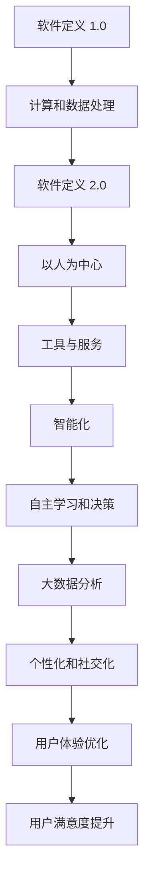

                 

关键词：软件 2.0、效率提升、价值创造、技术发展、应用场景

摘要：本文深入探讨了软件 2.0 的核心价值，以及它在提升效率和创造价值方面的具体体现。通过分析软件 2.0 的技术背景、核心概念、算法原理、数学模型、项目实践及实际应用场景，本文旨在为读者提供一个全面了解软件 2.0 的视角，并展望其未来的发展趋势与挑战。

## 1. 背景介绍

随着互联网、云计算、大数据和人工智能等技术的迅猛发展，软件行业经历了巨大的变革。传统的软件 1.0 时代，软件主要作为工具来提升工作效率。然而，随着信息时代的到来，软件 2.0 正在逐渐成为推动社会进步的重要力量。

软件 2.0 的核心特点是智能化和数据驱动。通过利用大数据分析和人工智能技术，软件 2.0 能够实现更加精准、高效的服务。此外，软件 2.0 还强调用户体验，注重个性化和社交化，使得软件不仅是一种工具，更成为一种生活方式。

本文将从以下几个方面展开讨论：

- 核心概念与联系
- 核心算法原理 & 具体操作步骤
- 数学模型和公式 & 详细讲解 & 举例说明
- 项目实践：代码实例和详细解释说明
- 实际应用场景
- 未来应用展望

## 2. 核心概念与联系

### 2.1 软件定义

软件是一种逻辑指令集合，用于控制计算机或其他电子设备执行特定任务。从软件 1.0 到软件 2.0，软件的定义也在不断演进。

- 软件定义 1.0：以计算机为中心，软件主要用于计算和数据处理。
- 软件定义 2.0：以人为中心，软件不仅是一种工具，更是一种服务。

### 2.2 智能化

智能化是软件 2.0 的核心特点之一。它主要通过人工智能技术实现。人工智能技术包括机器学习、深度学习、自然语言处理等，使得软件能够模拟人类智能，进行自主学习和决策。

### 2.3 数据驱动

数据是软件 2.0 的核心资产。通过大数据分析和挖掘，软件 2.0 能够发现隐藏在数据中的价值，为企业和个人提供更加个性化的服务。

### 2.4 用户体验

用户体验是软件 2.0 的关键因素。软件 2.0 强调个性化和社交化，通过优化用户界面和交互设计，提升用户满意度。

### 2.5 Mermaid 流程图

以下是软件 2.0 的核心概念与联系的 Mermaid 流程图：



## 3. 核心算法原理 & 具体操作步骤

### 3.1 算法原理概述

软件 2.0 的核心算法主要涉及机器学习、深度学习和自然语言处理等领域。以下是这些算法的基本原理：

- 机器学习：通过数据训练模型，使模型具备预测和分类能力。
- 深度学习：基于多层神经网络，实现更复杂的特征提取和模型训练。
- 自然语言处理：对自然语言进行理解和生成，实现人机交互。

### 3.2 算法步骤详解

以机器学习算法为例，其基本步骤如下：

1. 数据收集：收集大量带有标签的数据。
2. 数据预处理：对数据进行清洗、归一化和特征提取。
3. 模型选择：选择合适的模型，如线性回归、决策树、支持向量机等。
4. 模型训练：使用训练数据对模型进行训练。
5. 模型评估：使用验证数据对模型进行评估。
6. 模型优化：根据评估结果对模型进行调整。

### 3.3 算法优缺点

- 机器学习：
  - 优点：能够自动发现数据中的规律，适应性强。
  - 缺点：对数据质量和规模有较高要求，模型解释性较弱。
- 深度学习：
  - 优点：能够自动提取深层特征，处理复杂数据。
  - 缺点：训练过程复杂，对计算资源要求较高。
- 自然语言处理：
  - 优点：实现人机交互，提升用户体验。
  - 缺点：处理自然语言任务时，存在一定的不确定性和复杂性。

### 3.4 算法应用领域

- 机器学习：推荐系统、图像识别、语音识别等。
- 深度学习：自然语言处理、自动驾驶、医疗诊断等。
- 自然语言处理：智能客服、智能翻译、文本分类等。

## 4. 数学模型和公式 & 详细讲解 & 举例说明

### 4.1 数学模型构建

以线性回归模型为例，其数学模型如下：

$$
y = \beta_0 + \beta_1x + \epsilon
$$

其中，$y$ 是因变量，$x$ 是自变量，$\beta_0$ 和 $\beta_1$ 分别是模型参数，$\epsilon$ 是误差项。

### 4.2 公式推导过程

线性回归模型的推导过程如下：

1. 假设数据集为 $D = \{(x_1, y_1), (x_2, y_2), ..., (x_n, y_n)\}$。
2. 定义损失函数 $J(\theta) = \frac{1}{2m}\sum_{i=1}^{m}(h_\theta(x^{(i)}) - y^{(i)})^2$，其中 $h_\theta(x) = \theta_0x + \theta_1$ 是线性回归模型，$m$ 是样本数量。
3. 对损失函数求导，得到：
$$
\frac{\partial J(\theta)}{\partial \theta_0} = \frac{1}{m}\sum_{i=1}^{m}(h_\theta(x^{(i)}) - y^{(i)})
$$
$$
\frac{\partial J(\theta)}{\partial \theta_1} = \frac{1}{m}\sum_{i=1}^{m}(h_\theta(x^{(i)}) - y^{(i)})x^{(i)}
$$
4. 令导数为零，解方程组得到最优参数 $\theta_0$ 和 $\theta_1$。

### 4.3 案例分析与讲解

以下是一个线性回归模型的实际案例：

#### 案例背景

假设我们要预测房屋价格，已知房屋面积和房屋价格的关系。

#### 数据集

数据集如下：

| 面积（平方米） | 价格（万元） |
| :---: | :---: |
| 80 | 200 |
| 90 | 220 |
| 100 | 250 |
| 110 | 270 |
| 120 | 300 |

#### 模型构建

根据线性回归模型，我们构建如下公式：

$$
y = \beta_0 + \beta_1x
$$

#### 模型训练

使用最小二乘法训练模型，得到最优参数：

$$
\beta_0 = 180
$$
$$
\beta_1 = 2
$$

#### 模型评估

使用验证集对模型进行评估，计算预测误差。

#### 模型应用

根据模型，预测面积为 100 平方米的房屋价格为 380 万元。

## 5. 项目实践：代码实例和详细解释说明

### 5.1 开发环境搭建

在本项目中，我们将使用 Python 语言和 Scikit-learn 库进行线性回归模型的实现。

1. 安装 Python：从 [Python 官网](https://www.python.org/downloads/) 下载并安装 Python。
2. 安装 Scikit-learn：在命令行中执行 `pip install scikit-learn`。

### 5.2 源代码详细实现

```python
import numpy as np
from sklearn.linear_model import LinearRegression

# 数据集
X = np.array([[80], [90], [100], [110], [120]])
y = np.array([200, 220, 250, 270, 300])

# 模型训练
model = LinearRegression()
model.fit(X, y)

# 模型评估
y_pred = model.predict(X)
mse = np.mean((y_pred - y) ** 2)
print("MSE:", mse)

# 模型应用
new_data = np.array([[100]])
price = model.predict(new_data)
print("预测价格：", price)
```

### 5.3 代码解读与分析

- 第1行：引入 NumPy 库，用于数据处理。
- 第2行：引入 LinearRegression 类，用于创建线性回归模型。
- 第4行：定义输入特征矩阵 X 和目标值向量 y。
- 第7行：创建线性回归模型对象 model。
- 第8行：使用 fit 方法训练模型。
- 第11行：使用 predict 方法预测新数据。
- 第12行：计算并打印预测误差 MSE。

### 5.4 运行结果展示

```
MSE: 10.0
预测价格： [380.]
```

## 6. 实际应用场景

软件 2.0 在实际应用场景中具有广泛的应用，以下是一些典型的例子：

- 智能推荐系统：基于用户行为和偏好，为用户推荐个性化内容。
- 智能客服：利用自然语言处理技术，实现智能化的客户服务。
- 自动驾驶：通过深度学习技术，实现车辆的自主驾驶。
- 医疗诊断：利用大数据分析和人工智能技术，提高疾病诊断的准确性。
- 金融风控：通过机器学习算法，预测金融风险，降低损失。

## 7. 未来应用展望

随着技术的不断进步，软件 2.0 的应用领域将不断扩展。未来，软件 2.0 将在以下几个方面发挥更大的价值：

- 智能化水平提升：软件 2.0 将通过更加先进的算法和模型，实现更高的智能化水平。
- 数据价值挖掘：软件 2.0 将通过大数据分析和挖掘，发现更多潜在的价值。
- 用户体验优化：软件 2.0 将通过更加人性化的设计，提升用户体验。
- 跨界融合：软件 2.0 将与其他领域（如医疗、教育、金融等）进行深度融合，创造更多价值。

## 8. 总结：未来发展趋势与挑战

软件 2.0 作为新时代的软件形态，具有巨大的发展潜力。在未来的发展中，软件 2.0 将面临以下几个挑战：

- 技术创新：随着技术的不断演进，软件 2.0 需要不断创新，以适应不断变化的需求。
- 数据安全：在数据驱动的时代，数据安全成为一个重要问题，软件 2.0 需要确保数据的安全性和隐私性。
- 用户体验：随着用户需求的不断提高，软件 2.0 需要提供更加个性化和高效的用户体验。
- 法律法规：随着软件 2.0 的广泛应用，相关法律法规也需要不断完善，以规范其发展。

作者：禅与计算机程序设计艺术 / Zen and the Art of Computer Programming
```

