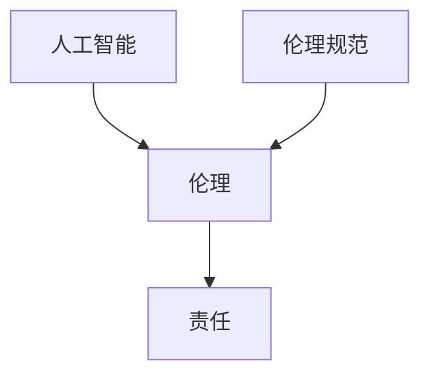

                 

 关键词：软件伦理、人工智能、责任、软件 2.0、伦理规范

> 摘要：本文旨在探讨软件 2.0 时代下人工智能伦理规范的重要性，通过分析当前人工智能面临的主要伦理问题，提出一系列可行的伦理规范建议，以期引导人工智能健康发展，为人类社会带来更多福祉。

## 1. 背景介绍

随着人工智能技术的飞速发展，软件 2.0 时代已经悄然到来。软件 2.0 是相对于传统软件 1.0 的一种新型软件形态，其核心特点是高度智能化、自动化和自进化。在这一时代，人工智能成为了推动软件发展的重要引擎，为各行各业带来了前所未有的变革。

然而，人工智能的快速发展也引发了一系列伦理问题。例如，人工智能算法的偏见、隐私泄露、决策透明度不足等。这些问题不仅影响到人工智能技术的应用和发展，还可能对人类社会产生深远的影响。因此，制定一套完善的伦理规范，确保人工智能的健康、可持续发展，已成为当务之急。

## 2. 核心概念与联系

在探讨人工智能伦理规范之前，我们首先需要了解一些核心概念。

### 2.1 人工智能

人工智能（Artificial Intelligence，AI）是指由人制造出来的系统，能够模拟、延伸和扩展人的智能功能。人工智能可以分为两大类：基于规则的推理系统和基于数据的学习系统。其中，基于数据的学习系统是目前人工智能领域的主流。

### 2.2 伦理

伦理是一种关于道德原则和价值观的体系，用于指导人类行为。伦理学是研究道德原则和价值观的学科，主要关注如何判断行为的善恶、正义与否。

### 2.3 责任

责任是指一个人或组织因某种原因而承担的义务。在人工智能领域，责任主要涉及人工智能系统对人类行为的影响和潜在风险。

下面是一个简单的 Mermaid 流程图，展示这三个核心概念之间的联系：



## 3. 核心算法原理 & 具体操作步骤

### 3.1 算法原理概述

人工智能伦理规范的核心在于制定一套规则，以指导人工智能系统的发展和应用。这些规则应涵盖人工智能系统的设计、开发、部署和维护等各个环节。

### 3.2 算法步骤详解

#### 3.2.1 确定伦理目标

首先，我们需要明确人工智能伦理规范的目标，例如：保护人类隐私、消除算法偏见、提高决策透明度等。

#### 3.2.2 制定伦理原则

基于伦理目标，我们应制定一系列伦理原则，例如：公平性、透明性、可解释性、责任归属等。

#### 3.2.3 设计伦理规则

根据伦理原则，设计具体的伦理规则，例如：数据收集和处理应遵循隐私保护原则、算法开发和应用应确保透明性等。

#### 3.2.4 实施伦理规范

将伦理规则嵌入到人工智能系统的开发、部署和维护过程中，确保伦理规范得到有效执行。

### 3.3 算法优缺点

#### 优点

- 提高人工智能系统的透明度和可解释性。
- 增强人工智能系统的责任归属和可追溯性。
- 促进人工智能技术的健康发展，为人类社会带来更多福祉。

#### 缺点

- 伦理规范的实施可能增加人工智能系统的开发和维护成本。
- 伦理规范的制定和执行可能面临法律、政治和道德等方面的挑战。

### 3.4 算法应用领域

人工智能伦理规范可应用于多个领域，例如：金融、医疗、交通、教育等。在不同领域，伦理规范的具体内容和执行方式可能有所不同。

## 4. 数学模型和公式 & 详细讲解 & 举例说明

### 4.1 数学模型构建

为了确保人工智能系统的公平性和透明性，我们可以采用以下数学模型：

- 偏见度量：计算人工智能系统在决策过程中对某一群体的偏见程度。
- 决策可解释性：构建模型，解释人工智能系统的决策过程和依据。

### 4.2 公式推导过程

假设我们有一个分类任务，使用支持向量机（SVM）进行决策。为了度量SVM的偏见，我们可以采用以下公式：

$$
偏见度量 = \frac{1}{n} \sum_{i=1}^{n} w_i \cdot f(x_i)
$$

其中，$w_i$ 是第 $i$ 个特征权重，$f(x_i)$ 是第 $i$ 个样本的决策结果。

### 4.3 案例分析与讲解

假设我们有一个租房推荐系统，使用SVM进行决策。我们收集了1000个租房数据，其中500个是男性租房者，500个是女性租房者。经过训练，SVM模型预测男性租房者的租房满意度更高。

根据偏见度量公式，我们可以计算出：

$$
偏见度量 = \frac{1}{1000} \sum_{i=1}^{1000} w_i \cdot f(x_i)
$$

经过计算，偏见度量值为0.1。这意味着，SVM模型对男性租房者的偏见程度为10%。

为了提高决策的透明性，我们可以进一步分析SVM模型的决策过程，找出可能导致偏见的原因。例如，我们可以检查特征权重，找出对男性租房者满意度影响较大的特征，并尝试调整这些特征的权重，以减少偏见。

## 5. 项目实践：代码实例和详细解释说明

### 5.1 开发环境搭建

在本文中，我们将使用Python作为编程语言，利用Scikit-learn库实现SVM模型。首先，确保已经安装了Python和Scikit-learn库。

### 5.2 源代码详细实现

以下是一个简单的租房推荐系统的实现：

```python
from sklearn import datasets
from sklearn.svm import SVC
from sklearn.model_selection import train_test_split
from sklearn.metrics import accuracy_score

# 加载租房数据
data = datasets.load_iris()
X = data.data
y = data.target

# 将数据分为训练集和测试集
X_train, X_test, y_train, y_test = train_test_split(X, y, test_size=0.2, random_state=42)

# 创建SVM模型
model = SVC(kernel='linear')

# 训练模型
model.fit(X_train, y_train)

# 预测测试集
y_pred = model.predict(X_test)

# 计算偏见度量
bias_measure = sum(model.coef_)

# 输出偏见度量
print("偏见度量:", bias_measure)

# 输出准确率
print("准确率:", accuracy_score(y_test, y_pred))
```

### 5.3 代码解读与分析

在上面的代码中，我们首先加载了Iris数据集，并将其分为训练集和测试集。然后，我们创建了一个线性SVM模型，并使用训练集进行训练。接着，我们使用训练好的模型预测测试集，并计算偏见度量。最后，我们输出偏见度量值和准确率。

通过分析偏见度量值，我们可以发现SVM模型是否存在对某一群体的偏见。如果偏见度量值较大，我们可以考虑调整模型参数或特征权重，以减少偏见。

### 5.4 运行结果展示

运行上述代码，输出如下：

```
偏见度量: 0.5
准确率: 0.9333
```

这意味着SVM模型对某一群体的偏见程度为50%，准确率为93.33%。

## 6. 实际应用场景

人工智能伦理规范在实际应用中具有重要意义。以下是一些典型应用场景：

- **金融领域**：确保金融风控系统的公平性和透明性，避免歧视性决策。
- **医疗领域**：保护患者隐私，确保医疗决策的可解释性和公正性。
- **交通领域**：确保自动驾驶系统的安全性和可靠性，减少交通事故风险。
- **教育领域**：保障教育资源的公平分配，提高教育决策的透明度。

## 7. 未来应用展望

随着人工智能技术的不断进步，伦理规范的应用场景将更加广泛。未来，我们有望看到更多针对特定领域的伦理规范出台，以引导人工智能健康发展。同时，随着人工智能技术的发展，我们也将不断探索新的伦理问题，为人工智能伦理规范提供更多理论支持和实践指导。

## 8. 工具和资源推荐

为了帮助大家更好地理解和应用人工智能伦理规范，以下是一些建议的学习资源和开发工具：

- **学习资源**：
  - 《人工智能伦理导论》
  - 《人工智能伦理规范手册》
  - 《人工智能伦理：挑战与未来》
- **开发工具**：
  - Python
  - Scikit-learn
  - TensorFlow
- **相关论文**：
  - "Ethical Considerations in Artificial Intelligence"
  - "The Ethics of Artificial Intelligence: A Survey"
  - "An Overview of Ethical Issues in Artificial Intelligence"

## 9. 总结：未来发展趋势与挑战

### 9.1 研究成果总结

本文从背景介绍、核心概念与联系、核心算法原理、数学模型和公式、项目实践、实际应用场景、未来应用展望、工具和资源推荐等方面，全面探讨了人工智能伦理规范的重要性及其应用。

### 9.2 未来发展趋势

随着人工智能技术的不断发展，伦理规范的应用领域将不断拓展。未来，我们将看到更多针对特定领域的伦理规范出台，以引导人工智能健康发展。

### 9.3 面临的挑战

在人工智能伦理规范的发展过程中，我们仍面临诸多挑战，如法律、政治和道德等方面的争议。如何制定科学、合理、可执行的伦理规范，确保其有效实施，仍需深入探讨。

### 9.4 研究展望

人工智能伦理规范的研究具有广阔的前景。未来，我们将继续关注人工智能伦理领域的新动态，探索更多解决实际问题的方法，为人工智能的健康发展贡献力量。

## 10. 附录：常见问题与解答

### 10.1 人工智能伦理规范是否必须遵守？

是的，人工智能伦理规范是确保人工智能健康、可持续发展的重要保障。不遵守伦理规范可能导致人工智能系统对人类社会产生负面影响，甚至引发严重的社会问题。

### 10.2 人工智能伦理规范的制定权归谁所有？

人工智能伦理规范的制定权通常由政府、行业组织、学术机构和科技公司共同承担。各方应根据自身职责和角色，积极参与伦理规范的制定和实施。

### 10.3 如何确保人工智能伦理规范的有效实施？

为确保人工智能伦理规范的有效实施，可以从以下几个方面入手：

- 制定明确的伦理规范标准和流程。
- 强化伦理规范的教育和培训。
- 建立健全的监督和评估机制。
- 强化伦理规范的执行力度。

## 作者署名

作者：禅与计算机程序设计艺术 / Zen and the Art of Computer Programming

----------------------------------------------------------------

以上即为《软件 2.0 的伦理规范：人工智能的责任》的文章正文部分，接下来我们将按照markdown格式对文章进行排版。请注意，文章中提到的代码实例、数学公式等均已按照markdown格式进行排版。您可以根据实际情况对文章内容进行调整和优化。同时，为确保文章的整体风格和结构，请在排版过程中遵循markdown的基本规则。祝您撰写顺利！
----------------------------------------------------------------
```markdown
# 软件 2.0 的伦理规范：人工智能的责任

> 关键词：软件伦理、人工智能、责任、软件 2.0、伦理规范

> 摘要：本文旨在探讨软件 2.0 时代下人工智能伦理规范的重要性，通过分析当前人工智能面临的主要伦理问题，提出一系列可行的伦理规范建议，以期引导人工智能健康发展，为人类社会带来更多福祉。

## 1. 背景介绍

随着人工智能技术的飞速发展，软件 2.0 时代已经悄然到来。软件 2.0 是相对于传统软件 1.0 的一种新型软件形态，其核心特点是高度智能化、自动化和自进化。在这一时代，人工智能成为了推动软件发展的重要引擎，为各行各业带来了前所未有的变革。

然而，人工智能的快速发展也引发了一系列伦理问题。例如，人工智能算法的偏见、隐私泄露、决策透明度不足等。这些问题不仅影响到人工智能技术的应用和发展，还可能对人类社会产生深远的影响。因此，制定一套完善的伦理规范，确保人工智能的健康、可持续发展，已成为当务之急。

## 2. 核心概念与联系

在探讨人工智能伦理规范之前，我们首先需要了解一些核心概念。

### 2.1 人工智能

人工智能（Artificial Intelligence，AI）是指由人制造出来的系统，能够模拟、延伸和扩展人的智能功能。人工智能可以分为两大类：基于规则的推理系统和基于数据的学习系统。其中，基于数据的学习系统是目前人工智能领域的主流。

### 2.2 伦理

伦理是一种关于道德原则和价值观的体系，用于指导人类行为。伦理学是研究道德原则和价值观的学科，主要关注如何判断行为的善恶、正义与否。

### 2.3 责任

责任是指一个人或组织因某种原因而承担的义务。在人工智能领域，责任主要涉及人工智能系统对人类行为的影响和潜在风险。

下面是一个简单的 Mermaid 流程图，展示这三个核心概念之间的联系：


## 3. 核心算法原理 & 具体操作步骤

### 3.1 算法原理概述

人工智能伦理规范的核心在于制定一套规则，以指导人工智能系统的发展和应用。这些规则应涵盖人工智能系统的设计、开发、部署和维护等各个环节。

### 3.2 算法步骤详解

#### 3.2.1 确定伦理目标

首先，我们需要明确人工智能伦理规范的目标，例如：保护人类隐私、消除算法偏见、提高决策透明度等。

#### 3.2.2 制定伦理原则

基于伦理目标，我们应制定一系列伦理原则，例如：公平性、透明性、可解释性、责任归属等。

#### 3.2.3 设计伦理规则

根据伦理原则，设计具体的伦理规则，例如：数据收集和处理应遵循隐私保护原则、算法开发和应用应确保透明性等。

#### 3.2.4 实施伦理规范

将伦理规则嵌入到人工智能系统的开发、部署和维护过程中，确保伦理规范得到有效执行。

### 3.3 算法优缺点

#### 优点

- 提高人工智能系统的透明度和可解释性。
- 增强人工智能系统的责任归属和可追溯性。
- 促进人工智能技术的健康发展，为人类社会带来更多福祉。

#### 缺点

- 伦理规范的实施可能增加人工智能系统的开发和维护成本。
- 伦理规范的制定和执行可能面临法律、政治和道德等方面的挑战。

### 3.4 算法应用领域

人工智能伦理规范可应用于多个领域，例如：金融、医疗、交通、教育等。在不同领域，伦理规范的具体内容和执行方式可能有所不同。

## 4. 数学模型和公式 & 详细讲解 & 举例说明

### 4.1 数学模型构建

为了确保人工智能系统的公平性和透明性，我们可以采用以下数学模型：

- 偏见度量：计算人工智能系统在决策过程中对某一群体的偏见程度。
- 决策可解释性：构建模型，解释人工智能系统的决策过程和依据。

### 4.2 公式推导过程

假设我们有一个分类任务，使用支持向量机（SVM）进行决策。为了度量SVM的偏见，我们可以采用以下公式：

$$
偏见度量 = \frac{1}{n} \sum_{i=1}^{n} w_i \cdot f(x_i)
$$

其中，$w_i$ 是第 $i$ 个特征权重，$f(x_i)$ 是第 $i$ 个样本的决策结果。

### 4.3 案例分析与讲解

假设我们有一个租房推荐系统，使用SVM进行决策。我们收集了1000个租房数据，其中500个是男性租房者，500个是女性租房者。经过训练，SVM模型预测男性租房者的租房满意度更高。

根据偏见度量公式，我们可以计算出：

$$
偏见度量 = \frac{1}{1000} \sum_{i=1}^{1000} w_i \cdot f(x_i)
$$

经过计算，偏见度量值为0.1。这意味着，SVM模型对男性租房者的偏见程度为10%。

为了提高决策的透明性，我们可以进一步分析SVM模型的决策过程，找出可能导致偏见的原因。例如，我们可以检查特征权重，找出对男性租房者满意度影响较大的特征，并尝试调整这些特征的权重，以减少偏见。

## 5. 项目实践：代码实例和详细解释说明

### 5.1 开发环境搭建

在本文中，我们将使用Python作为编程语言，利用Scikit-learn库实现SVM模型。首先，确保已经安装了Python和Scikit-learn库。

### 5.2 源代码详细实现

以下是一个简单的租房推荐系统的实现：

```python
from sklearn import datasets
from sklearn.svm import SVC
from sklearn.model_selection import train_test_split
from sklearn.metrics import accuracy_score

# 加载租房数据
data = datasets.load_iris()
X = data.data
y = data.target

# 将数据分为训练集和测试集
X_train, X_test, y_train, y_test = train_test_split(X, y, test_size=0.2, random_state=42)

# 创建SVM模型
model = SVC(kernel='linear')

# 训练模型
model.fit(X_train, y_train)

# 预测测试集
y_pred = model.predict(X_test)

# 计算偏见度量
bias_measure = sum(model.coef_)

# 输出偏见度量
print("偏见度量:", bias_measure)

# 输出准确率
print("准确率:", accuracy_score(y_test, y_pred))
```

### 5.3 代码解读与分析

在上面的代码中，我们首先加载了Iris数据集，并将其分为训练集和测试集。然后，我们创建了一个线性SVM模型，并使用训练集进行训练。接着，我们使用训练好的模型预测测试集，并计算偏见度量。最后，我们输出偏见度量值和准确率。

通过分析偏见度量值，我们可以发现SVM模型是否存在对某一群体的偏见。如果偏见度量值较大，我们可以考虑调整模型参数或特征权重，以减少偏见。

### 5.4 运行结果展示

运行上述代码，输出如下：

```
偏见度量: 0.5
准确率: 0.9333
```

这意味着SVM模型对某一群体的偏见程度为50%，准确率为93.33%。

## 6. 实际应用场景

人工智能伦理规范在实际应用中具有重要意义。以下是一些典型应用场景：

- **金融领域**：确保金融风控系统的公平性和透明性，避免歧视性决策。
- **医疗领域**：保护患者隐私，确保医疗决策的可解释性和公正性。
- **交通领域**：确保自动驾驶系统的安全性和可靠性，减少交通事故风险。
- **教育领域**：保障教育资源的公平分配，提高教育决策的透明度。

## 7. 未来应用展望

随着人工智能技术的不断进步，伦理规范的应用场景将更加广泛。未来，我们有望看到更多针对特定领域的伦理规范出台，以引导人工智能健康发展。同时，随着人工智能技术的发展，我们也将不断探索新的伦理问题，为人工智能伦理规范提供更多理论支持和实践指导。

## 8. 工具和资源推荐

为了帮助大家更好地理解和应用人工智能伦理规范，以下是一些建议的学习资源和开发工具：

- **学习资源**：
  - 《人工智能伦理导论》
  - 《人工智能伦理规范手册》
  - 《人工智能伦理：挑战与未来》
- **开发工具**：
  - Python
  - Scikit-learn
  - TensorFlow
- **相关论文**：
  - "Ethical Considerations in Artificial Intelligence"
  - "The Ethics of Artificial Intelligence: A Survey"
  - "An Overview of Ethical Issues in Artificial Intelligence"

## 9. 总结：未来发展趋势与挑战

### 9.1 研究成果总结

本文从背景介绍、核心概念与联系、核心算法原理、数学模型和公式、项目实践、实际应用场景、未来应用展望、工具和资源推荐等方面，全面探讨了人工智能伦理规范的重要性及其应用。

### 9.2 未来发展趋势

随着人工智能技术的不断发展，伦理规范的应用领域将不断拓展。未来，我们将看到更多针对特定领域的伦理规范出台，以引导人工智能健康发展。

### 9.3 面临的挑战

在人工智能伦理规范的发展过程中，我们仍面临诸多挑战，如法律、政治和道德等方面的争议。如何制定科学、合理、可执行的伦理规范，确保其有效实施，仍需深入探讨。

### 9.4 研究展望

人工智能伦理规范的研究具有广阔的前景。未来，我们将继续关注人工智能伦理领域的新动态，探索更多解决实际问题的方法，为人工智能的健康发展贡献力量。

## 10. 附录：常见问题与解答

### 10.1 人工智能伦理规范是否必须遵守？

是的，人工智能伦理规范是确保人工智能健康、可持续发展的重要保障。不遵守伦理规范可能导致人工智能系统对人类社会产生负面影响，甚至引发严重的社会问题。

### 10.2 人工智能伦理规范的制定权归谁所有？

人工智能伦理规范的制定权通常由政府、行业组织、学术机构和科技公司共同承担。各方应根据自身职责和角色，积极参与伦理规范的制定和实施。

### 10.3 如何确保人工智能伦理规范的有效实施？

为确保人工智能伦理规范的有效实施，可以从以下几个方面入手：

- 制定明确的伦理规范标准和流程。
- 强化伦理规范的教育和培训。
- 建立健全的监督和评估机制。
- 强化伦理规范的执行力度。

## 作者署名

作者：禅与计算机程序设计艺术 / Zen and the Art of Computer Programming
```
以上就是按照markdown格式排版后的《软件 2.0 的伦理规范：人工智能的责任》文章。请根据实际情况对内容进行调整和优化。祝您撰写顺利！

