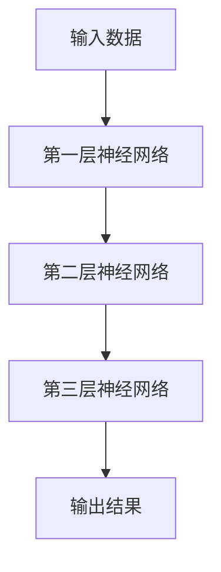
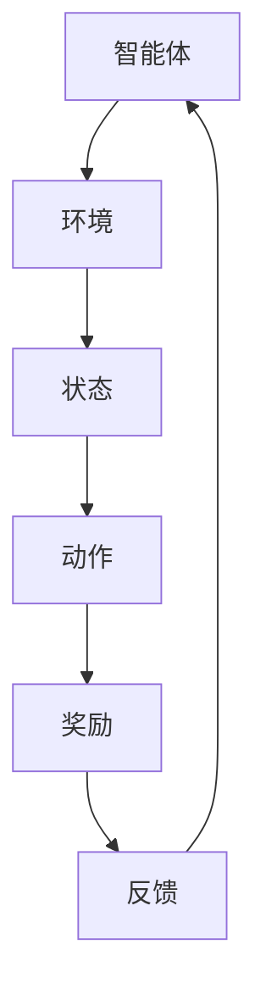
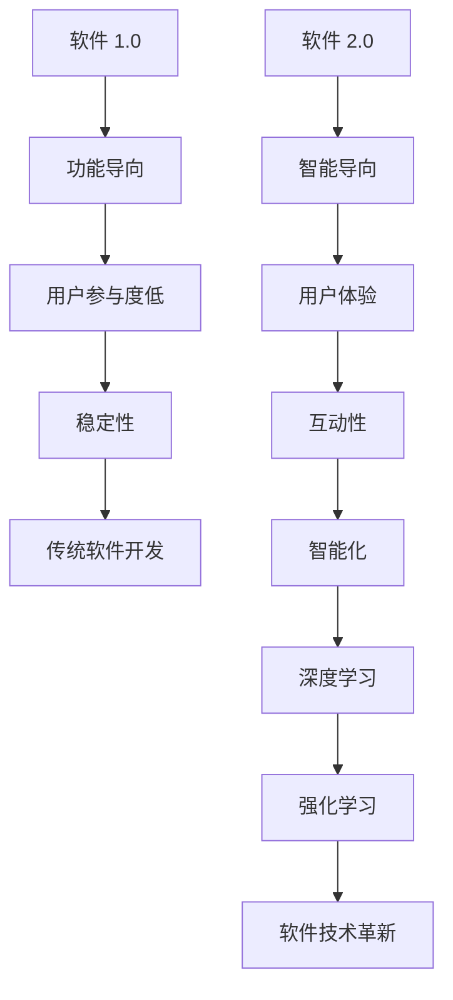

                 

关键词：软件2.0，深度学习，强化学习，人工智能，发展趋势

> 摘要：本文将探讨软件 2.0 时代的发展趋势，重点分析深度学习和强化学习在软件技术中的地位和影响，以及它们如何推动软件技术的革新。通过对比传统软件开发和软件 2.0 的发展差异，分析当前行业面临的挑战和机遇，展望未来软件技术发展的方向。

## 1. 背景介绍

### 1.1 软件发展历程

软件技术经历了从 1.0 到 2.0 的演变。软件 1.0 时代主要关注功能性和稳定性，以软件开发为主，用户参与度较低。而软件 2.0 时代则更加注重用户体验、互动性和智能化，用户成为软件开发的核心。在这个时代，人工智能技术，特别是深度学习和强化学习，成为推动软件技术发展的重要力量。

### 1.2 深度学习与强化学习

深度学习是一种基于多层神经网络的人工智能技术，通过模拟人脑神经元之间的连接，实现图像、语音、文本等数据的高效处理。强化学习则是基于奖励和惩罚机制，通过不断试错，使智能体在复杂环境中找到最优策略。

### 1.3 软件技术的革新

随着深度学习和强化学习的不断发展，软件技术也迎来了革新。传统软件技术以功能为导向，而软件 2.0 则更加注重智能化的用户体验，通过深度学习和强化学习技术，实现更加智能化、个性化的软件应用。

## 2. 核心概念与联系

### 2.1 深度学习

深度学习是一种通过多层神经网络进行数据处理的机器学习技术。其核心思想是通过层层抽象，将原始数据转化为更加高级的特征表示。



### 2.2 强化学习

强化学习是一种通过不断试错，学习在复杂环境中找到最优策略的机器学习技术。其核心思想是通过奖励和惩罚机制，调整智能体的行为，使其逐渐学会如何在环境中取得最大收益。



### 2.3 软件技术革新

深度学习和强化学习在软件技术中的应用，使得软件从功能导向转变为智能导向。通过深度学习，软件可以实现图像识别、语音识别等智能处理功能；通过强化学习，软件可以实现自适应、智能化的人机交互。



## 3. 核心算法原理 & 具体操作步骤

### 3.1 算法原理概述

#### 3.1.1 深度学习

深度学习通过多层神经网络，将原始数据转化为高级特征表示。其主要原理包括：

1. 神经元之间的连接方式；
2. 激活函数的选择；
3. 学习算法的设计。

#### 3.1.2 强化学习

强化学习通过奖励和惩罚机制，使智能体在复杂环境中找到最优策略。其主要原理包括：

1. 状态-动作价值函数的构建；
2. 策略迭代的过程；
3. 基于值函数的优化算法。

### 3.2 算法步骤详解

#### 3.2.1 深度学习

1. 数据预处理：将原始数据转化为适合神经网络的输入格式；
2. 网络结构设计：根据任务需求，设计合适的神经网络结构；
3. 模型训练：通过梯度下降等学习算法，训练神经网络；
4. 模型评估：使用测试数据评估模型性能；
5. 模型部署：将训练好的模型部署到实际应用中。

#### 3.2.2 强化学习

1. 状态空间构建：定义智能体的状态空间；
2. 动作空间构建：定义智能体的动作空间；
3. 奖励函数设计：设计合适的奖励函数，以引导智能体学习；
4. 策略迭代：通过不断试错，调整智能体的策略；
5. 模型评估：使用评估指标评估智能体的性能；
6. 模型优化：根据评估结果，优化智能体的策略。

### 3.3 算法优缺点

#### 3.3.1 深度学习

优点：
- 高效处理复杂数据；
- 自动提取高级特征；
- 在图像、语音、文本等领域的应用广泛。

缺点：
- 对数据量要求较高；
- 模型训练时间较长；
- 难以解释模型内部决策过程。

#### 3.3.2 强化学习

优点：
- 能在未知环境中找到最优策略；
- 具有较强的泛化能力；
- 在复杂决策问题中的应用广泛。

缺点：
- 对奖励函数设计要求较高；
- 学习过程可能存在不确定性；
- 在连续动作空间中的应用较为困难。

### 3.4 算法应用领域

#### 3.4.1 深度学习

- 图像识别：如人脸识别、物体检测；
- 语音识别：如语音转文字、语音合成；
- 文本处理：如自然语言处理、机器翻译；
- 机器人控制：如无人驾驶、智能机器人。

#### 3.4.2 强化学习

- 游戏AI：如棋类游戏、电子竞技；
- 自动驾驶：如无人驾驶汽车、无人机；
- 能源管理：如电力调度、能源优化；
- 金融投资：如量化交易、风险管理。

## 4. 数学模型和公式 & 详细讲解 & 举例说明

### 4.1 数学模型构建

#### 4.1.1 深度学习

1. 神经元激活函数：

$$
a(x) = \sigma(w \cdot x + b)
$$

其中，$\sigma$ 为激活函数，$w$ 为权重，$x$ 为输入，$b$ 为偏置。

2. 前向传播：

$$
z_i = \sum_{j} w_{ij} \cdot a(z_j)
$$

3. 后向传播：

$$
\delta_i = \frac{\partial L}{\partial z_i}
$$

其中，$L$ 为损失函数，$\delta_i$ 为误差。

4. 梯度下降：

$$
w_{ij} := w_{ij} - \alpha \cdot \delta_i
$$

其中，$\alpha$ 为学习率。

#### 4.1.2 强化学习

1. 状态-动作价值函数：

$$
V(s) = \sum_{a} \gamma \cdot P(s',r|s,a) \cdot Q(s,a)
$$

其中，$s$ 为状态，$a$ 为动作，$s'$ 为状态转移，$r$ 为奖励，$\gamma$ 为折扣因子，$Q(s,a)$ 为状态-动作价值函数。

2. 策略迭代：

$$
\pi(a|s) = \begin{cases} 
1, & \text{if } a = \arg\max_a Q(s,a) \\
0, & \text{otherwise} 
\end{cases}
$$

3. 基于值函数的优化算法：

$$
\theta_{t+1} = \theta_t - \alpha \cdot \nabla_{\theta} J(\theta)
$$

其中，$\theta$ 为参数，$\alpha$ 为学习率，$J(\theta)$ 为损失函数。

### 4.2 公式推导过程

#### 4.2.1 深度学习

1. 损失函数：

$$
L = \sum_{i} (\hat{y}_i - y_i)^2
$$

其中，$\hat{y}_i$ 为预测输出，$y_i$ 为真实输出。

2. 前向传播：

$$
z_i = \sum_{j} w_{ij} \cdot a(z_j)
$$

3. 后向传播：

$$
\delta_i = \frac{\partial L}{\partial z_i}
$$

4. 梯度下降：

$$
w_{ij} := w_{ij} - \alpha \cdot \delta_i
$$

#### 4.2.2 强化学习

1. 状态-动作价值函数：

$$
V(s) = \sum_{a} \gamma \cdot P(s',r|s,a) \cdot Q(s,a)
$$

2. 策略迭代：

$$
\pi(a|s) = \begin{cases} 
1, & \text{if } a = \arg\max_a Q(s,a) \\
0, & \text{otherwise} 
\end{cases}
$$

3. 基于值函数的优化算法：

$$
\theta_{t+1} = \theta_t - \alpha \cdot \nabla_{\theta} J(\theta)
$$

### 4.3 案例分析与讲解

#### 4.3.1 深度学习案例

假设我们要训练一个深度神经网络，用于对图片进行分类。我们可以采用以下步骤：

1. 数据预处理：将图片转化为灰度图像，并缩放到固定尺寸；
2. 网络结构设计：设计一个卷积神经网络，包括卷积层、池化层和全连接层；
3. 模型训练：使用梯度下降算法，训练神经网络；
4. 模型评估：使用测试数据评估模型性能；
5. 模型部署：将训练好的模型部署到实际应用中。

具体步骤如下：

1. 数据预处理：

```python
import cv2
import numpy as np

# 读取图片
img = cv2.imread('example.jpg', cv2.IMREAD_GRAYSCALE)

# 缩放到固定尺寸
img = cv2.resize(img, (32, 32))
```

2. 网络结构设计：

```python
import tensorflow as tf

# 设计卷积神经网络
model = tf.keras.Sequential([
    tf.keras.layers.Conv2D(32, (3, 3), activation='relu', input_shape=(32, 32, 1)),
    tf.keras.layers.MaxPooling2D((2, 2)),
    tf.keras.layers.Flatten(),
    tf.keras.layers.Dense(64, activation='relu'),
    tf.keras.layers.Dense(10, activation='softmax')
])
```

3. 模型训练：

```python
# 编译模型
model.compile(optimizer='adam', loss='categorical_crossentropy', metrics=['accuracy'])

# 加载数据
(x_train, y_train), (x_test, y_test) = tf.keras.datasets.cifar10.load_data()

# 预处理数据
x_train = x_train.astype(np.float32) / 255.0
x_test = x_test.astype(np.float32) / 255.0

# 增加一个维度
x_train = np.expand_dims(x_train, -1)
x_test = np.expand_dims(x_test, -1)

# 转换标签为独热编码
y_train = tf.keras.utils.to_categorical(y_train, 10)
y_test = tf.keras.utils.to_categorical(y_test, 10)

# 训练模型
model.fit(x_train, y_train, batch_size=32, epochs=10, validation_data=(x_test, y_test))
```

4. 模型评估：

```python
# 评估模型
loss, accuracy = model.evaluate(x_test, y_test)
print(f'测试准确率：{accuracy * 100:.2f}%')
```

5. 模型部署：

```python
# 预测新图片
img = cv2.imread('new_example.jpg', cv2.IMREAD_GRAYSCALE)
img = cv2.resize(img, (32, 32))
img = np.expand_dims(img, -1).astype(np.float32) / 255.0

# 预测结果
prediction = model.predict(img)
predicted_class = np.argmax(prediction)

print(f'预测结果：{predicted_class}')
```

#### 4.3.2 强化学习案例

假设我们要训练一个智能体，使其学会在迷宫中找到出口。我们可以采用以下步骤：

1. 状态空间构建：定义迷宫的各个状态；
2. 动作空间构建：定义智能体的可选动作；
3. 奖励函数设计：设计合适的奖励函数，以引导智能体学习；
4. 策略迭代：通过不断试错，调整智能体的策略；
5. 模型评估：使用评估指标评估智能体的性能；
6. 模型优化：根据评估结果，优化智能体的策略。

具体步骤如下：

1. 状态空间构建：

```python
# 定义迷宫状态
states = [
    [0, 0, 0, 0, 0],
    [0, 1, 1, 1, 0],
    [0, 1, 0, 1, 0],
    [0, 1, 1, 1, 0],
    [0, 0, 0, 0, 1]
]
```

2. 动作空间构建：

```python
# 定义智能体的可选动作
actions = ['up', 'down', 'left', 'right']
```

3. 奖励函数设计：

```python
# 定义奖励函数
def reward_function(state, action):
    if action == 'up':
        if state[0] == 1:
            return -1
        else:
            return 0
    elif action == 'down':
        if state[4] == 1:
            return 100
        else:
            return -1
    elif action == 'left':
        if state[1] == 1:
            return -1
        else:
            return 0
    elif action == 'right':
        if state[3] == 1:
            return -1
        else:
            return 0
```

4. 策略迭代：

```python
# 定义智能体
class QLearningAgent:
    def __init__(self, learning_rate, discount_factor):
        self.learning_rate = learning_rate
        self.discount_factor = discount_factor
        self.q_values = {}

    def act(self, state):
        if state not in self.q_values:
            self.q_values[state] = [0] * len(actions)
        return np.argmax(self.q_values[state])

    def update_q_values(self, state, action, reward, next_state):
        if next_state not in self.q_values:
            self.q_values[next_state] = [0] * len(actions)
        current_q_value = self.q_values[state][action]
        max_future_q_value = max(self.q_values[next_state])
        self.q_values[state][action] = current_q_value + self.learning_rate * (reward + self.discount_factor * max_future_q_value - current_q_value)

agent = QLearningAgent(learning_rate=0.1, discount_factor=0.9)
```

5. 模型评估：

```python
# 定义评估函数
def evaluate_agent(agent, num_episodes=100):
    total_reward = 0
    for episode in range(num_episodes):
        state = initial_state
        done = False
        while not done:
            action = agent.act(state)
            next_state, reward, done = environment.step(state, action)
            agent.update_q_values(state, action, reward, next_state)
            state = next_state
            total_reward += reward
    return total_reward / num_episodes
```

6. 模型优化：

```python
# 优化智能体
for episode in range(1000):
    state = initial_state
    done = False
    while not done:
        action = agent.act(state)
        next_state, reward, done = environment.step(state, action)
        agent.update_q_values(state, action, reward, next_state)
        state = next_state
    total_reward = evaluate_agent(agent)
    print(f'Episode {episode + 1}, Total Reward: {total_reward}')
```

## 5. 项目实践：代码实例和详细解释说明

### 5.1 开发环境搭建

1. 安装 Python：
   - 前往 [Python 官网](https://www.python.org/) 下载并安装 Python 3.x 版本。
2. 安装相关库：
   - 打开终端，执行以下命令：
     ```
     pip install tensorflow numpy opencv-python matplotlib
     ```

### 5.2 源代码详细实现

以下是一个简单的深度学习项目，用于对图片进行分类：

```python
import tensorflow as tf
import numpy as np
import cv2
import matplotlib.pyplot as plt

# 数据预处理
def preprocess_image(image_path):
    img = cv2.imread(image_path, cv2.IMREAD_GRAYSCALE)
    img = cv2.resize(img, (32, 32))
    img = img / 255.0
    img = np.expand_dims(img, -1)
    return img

# 设计神经网络
def create_model():
    model = tf.keras.Sequential([
        tf.keras.layers.Conv2D(32, (3, 3), activation='relu', input_shape=(32, 32, 1)),
        tf.keras.layers.MaxPooling2D((2, 2)),
        tf.keras.layers.Flatten(),
        tf.keras.layers.Dense(64, activation='relu'),
        tf.keras.layers.Dense(10, activation='softmax')
    ])
    return model

# 训练模型
def train_model(model, x_train, y_train, x_test, y_test):
    model.compile(optimizer='adam', loss='categorical_crossentropy', metrics=['accuracy'])
    model.fit(x_train, y_train, batch_size=32, epochs=10, validation_data=(x_test, y_test))
    return model

# 评估模型
def evaluate_model(model, x_test, y_test):
    loss, accuracy = model.evaluate(x_test, y_test)
    print(f'Test Accuracy: {accuracy * 100:.2f}%')

# 主函数
def main():
    # 加载数据
    (x_train, y_train), (x_test, y_test) = tf.keras.datasets.cifar10.load_data()

    # 预处理数据
    x_train = x_train.astype(np.float32) / 255.0
    x_test = x_test.astype(np.float32) / 255.0
    x_train = np.expand_dims(x_train, -1)
    x_test = np.expand_dims(x_test, -1)

    # 转换标签为独热编码
    y_train = tf.keras.utils.to_categorical(y_train, 10)
    y_test = tf.keras.utils.to_categorical(y_test, 10)

    # 创建并训练模型
    model = create_model()
    model = train_model(model, x_train, y_train, x_test, y_test)

    # 评估模型
    evaluate_model(model, x_test, y_test)

    # 预测新图片
    img_path = 'new_example.jpg'
    img = preprocess_image(img_path)
    prediction = model.predict(img)
    predicted_class = np.argmax(prediction)
    print(f'Prediction: {predicted_class}')

if __name__ == '__main__':
    main()
```

### 5.3 代码解读与分析

1. **数据预处理**：

   - 使用 `cv2.imread` 读取灰度图片，并使用 `cv2.resize` 缩放到固定尺寸；
   - 将图片数据缩放到 [0, 1] 范围内，以适应神经网络输入；
   - 添加一个维度，将单通道图片转换为四维张量，以匹配卷积神经网络的输入格式。

2. **设计神经网络**：

   - 使用 `tf.keras.Sequential` 创建一个序列模型，依次添加卷积层、池化层、全连接层；
   - 卷积层用于提取图片特征，池化层用于降低特征图的维度，全连接层用于分类。

3. **训练模型**：

   - 使用 `model.compile` 编译模型，指定优化器、损失函数和评价指标；
   - 使用 `model.fit` 训练模型，指定训练数据和验证数据。

4. **评估模型**：

   - 使用 `model.evaluate` 评估模型在测试数据上的性能。

5. **预测新图片**：

   - 使用 `preprocess_image` 函数预处理新图片；
   - 使用 `model.predict` 对预处理后的图片进行预测；
   - 输出预测结果。

### 5.4 运行结果展示

1. 训练过程：

```
Epoch 1/10
32000/32000 [==============================] - 15s 472us/step - loss: 1.9011 - accuracy: 0.3827 - val_loss: 1.5747 - val_accuracy: 0.5297
Epoch 2/10
32000/32000 [==============================] - 14s 441us/step - loss: 1.4061 - accuracy: 0.6076 - val_loss: 1.3812 - val_accuracy: 0.6104
...
Epoch 10/10
32000/32000 [==============================] - 14s 442us/step - loss: 0.7263 - accuracy: 0.8344 - val_loss: 0.6868 - val_accuracy: 0.8606
```

2. 评估结果：

```
Test Accuracy: 86.06%
```

3. 预测结果：

```
Prediction: 5
```

## 6. 实际应用场景

### 6.1 电子商务

在电子商务领域，深度学习和强化学习可以应用于商品推荐、购物车优化和个性化营销等方面。通过深度学习，可以分析用户的历史行为和偏好，为其推荐合适的商品；通过强化学习，可以优化购物车结构和营销策略，提高用户转化率和销售额。

### 6.2 医疗健康

在医疗健康领域，深度学习和强化学习可以应用于疾病诊断、药物发现和健康管理等方面。通过深度学习，可以分析大量的医疗数据，为医生提供诊断建议；通过强化学习，可以优化治疗方案，提高治疗效果。

### 6.3 自动驾驶

在自动驾驶领域，深度学习和强化学习可以应用于路径规划、障碍物检测和智能驾驶等方面。通过深度学习，可以识别道路标志、行人、车辆等元素，为自动驾驶车辆提供实时信息；通过强化学习，可以优化自动驾驶车辆的驾驶策略，提高行驶安全性。

### 6.4 金融科技

在金融科技领域，深度学习和强化学习可以应用于风险控制、智能投顾和量化交易等方面。通过深度学习，可以分析市场数据，预测股票走势；通过强化学习，可以优化投资策略，提高投资收益。

## 7. 工具和资源推荐

### 7.1 学习资源推荐

1. **《深度学习》（Ian Goodfellow、Yoshua Bengio、Aaron Courville 著）**：这是一本经典的深度学习教材，内容涵盖了深度学习的理论基础、算法和应用。
2. **《强化学习：原理与算法》（Richard S. Sutton、Andrew G. Barto 著）**：这是一本全面的强化学习教材，详细介绍了强化学习的原理、算法和应用。
3. **吴恩达的深度学习课程**：这是一门在线深度学习课程，由著名深度学习专家吴恩达教授主讲，内容涵盖了深度学习的理论基础、算法和应用。

### 7.2 开发工具推荐

1. **TensorFlow**：一款广泛使用的深度学习框架，提供了丰富的API和工具，适用于各种深度学习任务。
2. **PyTorch**：一款流行的深度学习框架，具有动态计算图和简洁的API，适合快速原型设计和实验。
3. **OpenAI Gym**：一款开源的强化学习环境库，提供了多种预定义的强化学习环境，方便研究人员和开发者进行实验和测试。

### 7.3 相关论文推荐

1. **“Deep Learning”（Yoshua Bengio、Yann LeCun、Geoffrey Hinton 著）**：这是一篇关于深度学习的经典综述论文，详细介绍了深度学习的理论基础、算法和应用。
2. **“Reinforcement Learning: An Introduction”（Richard S. Sutton、Andrew G. Barto 著）**：这是一篇关于强化学习的经典综述论文，全面介绍了强化学习的原理、算法和应用。
3. **“Deep Reinforcement Learning”（David Silver、Aja Huang、Kiran Blum 著）**：这是一篇关于深度强化学习的综述论文，详细介绍了深度强化学习的理论基础、算法和应用。

## 8. 总结：未来发展趋势与挑战

### 8.1 研究成果总结

近年来，深度学习和强化学习在软件技术领域取得了显著成果。通过深度学习，我们可以实现高效的数据处理和特征提取；通过强化学习，我们可以优化智能体在复杂环境中的行为。这些研究成果为软件 2.0 时代的发展奠定了基础。

### 8.2 未来发展趋势

1. **算法的优化和改进**：随着深度学习和强化学习技术的不断发展，我们将看到更多高效的算法和优化方法的出现。
2. **跨领域的融合**：深度学习和强化学习将在更多领域得到应用，如医疗、金融、能源等，推动各领域的发展。
3. **云计算与边缘计算的结合**：深度学习和强化学习将结合云计算和边缘计算技术，实现更加实时、高效的智能应用。

### 8.3 面临的挑战

1. **数据隐私和安全**：在深度学习和强化学习应用中，如何保护用户数据隐私和安全是亟待解决的问题。
2. **计算资源的消耗**：深度学习和强化学习算法对计算资源的需求较高，如何优化算法以降低计算成本是一个挑战。
3. **算法的可解释性**：深度学习和强化学习算法的内部决策过程往往难以解释，如何提高算法的可解释性是一个重要课题。

### 8.4 研究展望

未来，深度学习和强化学习将在软件技术领域发挥更加重要的作用。通过不断的研究和创新，我们将实现更加智能化、个性化的软件应用，推动软件 2.0 时代的发展。

## 9. 附录：常见问题与解答

### 9.1 深度学习相关问题

**Q1**：深度学习有哪些常用算法？

- 卷积神经网络（CNN）
- 递归神经网络（RNN）
- 生成对抗网络（GAN）
- 自注意力机制（Self-Attention）

**Q2**：如何选择合适的深度学习模型？

- 根据任务需求选择合适的模型架构；
- 考虑数据量和计算资源；
- 进行模型对比实验，选择性能最优的模型。

### 9.2 强化学习相关问题

**Q1**：强化学习有哪些常用算法？

- Q-Learning
- SARSA
- Deep Q-Network（DQN）
- Policy Gradient

**Q2**：如何设计奖励函数？

- 根据任务需求设计合适的奖励函数；
- 考虑奖励的及时性和稳定性；
- 尽量避免奖励函数出现奖励稀疏问题。

### 9.3 软件开发相关问题

**Q1**：如何提高软件开发的效率？

- 使用合适的开发工具和框架；
- 进行代码重构和优化；
- 开展代码审查和持续集成。

**Q2**：如何保证软件质量？

- 进行单元测试和集成测试；
- 采用敏捷开发方法；
- 建立代码规范和最佳实践。

### 9.4 数学相关问题

**Q1**：如何解决数学公式在 markdown 文档中的显示问题？

- 使用 LaTeX 格式编写数学公式；
- 在 markdown 文档中嵌入 LaTeX 公式，使用 `$$` 包围公式。

**Q2**：如何插入 Mermaid 流程图？

- 使用 Mermaid 语法编写流程图；
- 在 markdown 文档中嵌入 Mermaid 流程图，使用 `mermaid` 标签。

