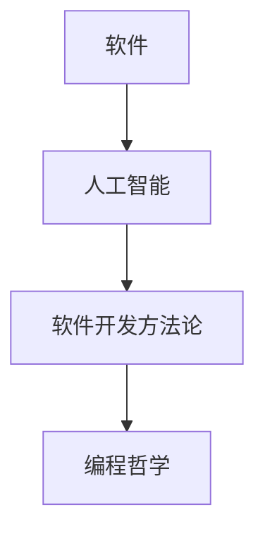

                 

关键词：软件 2.0、人工智能、哲学思考、技术发展、编程哲学

> 摘要：本文旨在深入探讨软件 2.0 时代的哲学思考，特别是围绕人工智能的本质。我们将探讨软件 2.0 的定义，人工智能的核心概念，以及它们在编程哲学中的交汇点。文章将通过理论和实践相结合的方式，分析人工智能对软件开发的影响，以及未来的发展趋势和挑战。

## 1. 背景介绍

随着计算机技术的迅猛发展，软件行业也经历了翻天覆地的变化。从最初的系统软件到如今的互联网应用，软件的定义和作用已经发生了巨大的转变。进入21世纪，我们迎来了软件 2.0 时代，这一时代以云计算、大数据、人工智能等技术的广泛应用为特征。软件不再仅仅是一个执行任务的工具，而是成为了推动社会进步、改变生活方式的核心动力。

人工智能作为软件 2.0 时代的重要支柱，已经成为各行各业关注的焦点。从自动驾驶汽车到智能医疗诊断，人工智能正在深刻地改变我们的世界。然而，随着人工智能技术的不断进步，我们也开始思考：人工智能的本质是什么？它在编程哲学中占据何种地位？本文将尝试回答这些问题，并探讨人工智能的未来发展趋势和挑战。

## 2. 核心概念与联系

### 2.1 软件与人工智能

#### 软件的定义

软件是一种运行在计算机上的程序，用于执行特定的任务或功能。它包括操作系统、应用软件、游戏等。随着互联网的普及，软件的定义也在不断扩展，涵盖了更多的应用场景和功能。

#### 人工智能的定义

人工智能（Artificial Intelligence，简称 AI）是指计算机系统通过模拟人类智能行为，实现感知、理解、学习、推理和决策的能力。人工智能的目标是实现机器的智能，使其能够像人类一样处理复杂的问题。

#### 软件与人工智能的联系

软件是人工智能实现的载体，而人工智能则是软件发展的新动力。软件通过编程实现人工智能的功能，如语音识别、图像处理、自然语言理解等。同时，人工智能的进步也推动了软件技术的创新，例如，自动化测试、智能推荐系统等。

### 2.2 软件开发方法论

#### 传统软件开发

传统软件开发方法主要基于瀑布模型，即按照需求分析、设计、开发、测试等阶段顺序进行。这种方法在早期的软件项目中较为常见，但随着项目复杂度的增加，其局限性也逐渐显现。

#### 软件开发方法论的发展

随着软件项目规模的不断扩大，传统的瀑布模型已经无法满足快速迭代和变化的需求。敏捷开发、DevOps等新兴开发方法应运而生，它们强调快速反馈、持续集成和持续交付，以提高软件开发的效率和质量。

### 2.3 编程哲学

#### 编程哲学的定义

编程哲学是指关于编程的哲学思考，包括编程的方法、原则和价值观。编程哲学关注如何编写高效、可维护和可扩展的代码，以及如何在软件开发过程中处理复杂的问题。

#### 编程哲学的核心概念

编程哲学的核心概念包括简洁性、可读性、模块化、复用性等。这些概念不仅影响着代码的质量，也影响着软件开发的过程和结果。

### 2.4 软件与人工智能的 Mermaid 流程图



## 3. 核心算法原理 & 具体操作步骤

### 3.1 算法原理概述

人工智能的核心在于算法，而算法的核心在于数据。人工智能算法通常分为监督学习、无监督学习和强化学习三类。其中，监督学习是通过已有数据集来训练模型，使其能够对新数据进行预测；无监督学习则是通过未标记的数据来发现数据的内在规律；强化学习则是通过与环境的交互来学习最优策略。

### 3.2 算法步骤详解

#### 监督学习算法步骤

1. 数据预处理：清洗数据，包括缺失值处理、异常值处理、数据归一化等。
2. 特征提取：从原始数据中提取出有用的特征。
3. 模型选择：选择合适的模型，如线性回归、决策树、神经网络等。
4. 训练模型：使用训练数据集来训练模型。
5. 模型评估：使用验证数据集来评估模型性能。

#### 无监督学习算法步骤

1. 数据预处理：与监督学习类似，进行数据清洗和特征提取。
2. 模型选择：选择合适的无监督学习模型，如聚类算法、降维算法等。
3. 模型训练：使用数据集来训练模型。
4. 模型评估：评估模型效果。

#### 强化学习算法步骤

1. 环境设定：定义环境状态和动作空间。
2. 策略选择：选择合适的策略，如Q-learning、SARSA等。
3. 模型训练：通过与环境交互来训练模型。
4. 策略评估：评估策略效果。

### 3.3 算法优缺点

#### 监督学习

优点：有明确的评估标准，能够快速获得预测结果。

缺点：对数据质量要求高，模型泛化能力有限。

#### 无监督学习

优点：不需要标记数据，能够发现数据的内在规律。

缺点：评估标准不明确，模型效果难以衡量。

#### 强化学习

优点：能够处理复杂环境，具有自适应能力。

缺点：训练时间较长，模型解释性较差。

### 3.4 算法应用领域

#### 监督学习

应用领域：分类、回归、预测等。

#### 无监督学习

应用领域：聚类、降维、异常检测等。

#### 强化学习

应用领域：自动驾驶、机器人控制、游戏AI等。

## 4. 数学模型和公式 & 详细讲解 & 举例说明

### 4.1 数学模型构建

人工智能的核心是数学模型，如线性回归模型、决策树模型、神经网络模型等。这些模型通过数学公式来描述数据之间的关系。

#### 线性回归模型

线性回归模型是一种最简单的机器学习模型，用于预测一个连续值。其数学公式为：

$$y = w_1 \cdot x_1 + w_2 \cdot x_2 + ... + w_n \cdot x_n + b$$

其中，$y$ 为预测值，$x_1, x_2, ..., x_n$ 为特征值，$w_1, w_2, ..., w_n$ 为权重，$b$ 为偏置。

#### 决策树模型

决策树模型是一种基于树结构的分类模型，通过一系列的决策规则来分割数据集。其数学公式为：

$$f(x) = \text{分类} \quad \text{if} \quad x \in R_i$$

其中，$f(x)$ 为分类结果，$R_i$ 为第 $i$ 个分支区域。

#### 神经网络模型

神经网络模型是一种基于人工神经网络的机器学习模型，通过多层神经元来处理复杂的数据。其数学公式为：

$$a_{ij} = \sigma(z_j)$$

其中，$a_{ij}$ 为神经元 $i$ 的输出，$z_j$ 为神经元 $j$ 的输入，$\sigma$ 为激活函数。

### 4.2 公式推导过程

#### 线性回归模型的推导

假设我们有一个数据集 $D = \{(x_1, y_1), (x_2, y_2), ..., (x_n, y_n)\}$，其中 $x_i$ 和 $y_i$ 分别为特征值和目标值。

我们希望找到一个线性函数 $y = wx + b$ 来拟合这组数据。为了求解 $w$ 和 $b$，我们可以使用最小二乘法。

首先，计算每个数据点的预测值：

$$y_i' = wx_i + b$$

然后，计算预测值与实际值之间的误差：

$$e_i = y_i - y_i'$$

为了最小化误差，我们需要求解以下优化问题：

$$\min \sum_{i=1}^n e_i^2$$

对 $w$ 和 $b$ 分别求导并令导数为零，可以得到：

$$w = \frac{\sum_{i=1}^n (x_i - \bar{x})(y_i - \bar{y})}{\sum_{i=1}^n (x_i - \bar{x})^2}$$

$$b = \bar{y} - w\bar{x}$$

其中，$\bar{x}$ 和 $\bar{y}$ 分别为特征值和目标值的平均值。

#### 决策树模型的推导

决策树模型的核心是找到一组最优划分规则，将数据集划分为若干个区域。我们可以使用信息增益或基尼指数来衡量划分效果。

设 $D$ 为原始数据集，$D_i$ 为第 $i$ 个划分区域，$y_i$ 为区域 $D_i$ 中的目标值。

信息增益的公式为：

$$G(D) = H(D) - \sum_{i=1}^n \frac{|D_i|}{|D|} H(D_i)$$

其中，$H(D)$ 为数据集 $D$ 的熵，$H(D_i)$ 为区域 $D_i$ 的熵。

基尼指数的公式为：

$$G(D) = 1 - \sum_{i=1}^n \frac{|D_i|}{|D|} \cdot \frac{\sum_{j=1}^c |D_i^j|}{|D_i|}$$

其中，$c$ 为类别数，$D_i^j$ 为区域 $D_i$ 中属于类别 $j$ 的数据集。

### 4.3 案例分析与讲解

#### 案例一：线性回归模型在房价预测中的应用

假设我们有一个数据集，包含房屋的面积和价格。我们希望使用线性回归模型来预测未知房屋的价格。

首先，我们需要对数据进行预处理，包括缺失值处理、异常值处理和数据归一化。

然后，我们选择线性回归模型，并使用最小二乘法求解权重 $w$ 和偏置 $b$。

最后，我们使用训练好的模型对未知房屋的面积进行预测，得到预测价格。

#### 案例二：决策树模型在客户细分中的应用

假设我们有一个客户数据集，包含客户的年龄、收入、消费习惯等信息。我们希望使用决策树模型来将客户分为高价值客户和低价值客户。

首先，我们需要对数据进行预处理，包括缺失值处理、异常值处理和数据归一化。

然后，我们选择决策树模型，并使用信息增益或基尼指数来选择最优划分规则。

最后，我们使用训练好的模型对新的客户数据进行分类，得到高价值客户和低价值客户的分布。

## 5. 项目实践：代码实例和详细解释说明

### 5.1 开发环境搭建

为了演示线性回归模型的应用，我们使用 Python 语言和 Scikit-learn 库。首先，确保你的 Python 环境已经安装，然后使用以下命令安装 Scikit-learn：

```bash
pip install scikit-learn
```

### 5.2 源代码详细实现

以下是一个简单的线性回归模型实现，用于预测房屋价格。

```python
from sklearn.linear_model import LinearRegression
from sklearn.model_selection import train_test_split
from sklearn.metrics import mean_squared_error
import numpy as np

# 生成模拟数据集
np.random.seed(0)
X = np.random.rand(100, 1) * 100
y = 2 * X[:, 0] + 5 + np.random.randn(100) * 2

# 数据预处理
X = X.reshape(-1, 1)
y = y.reshape(-1, 1)

# 划分训练集和测试集
X_train, X_test, y_train, y_test = train_test_split(X, y, test_size=0.2, random_state=0)

# 创建线性回归模型
model = LinearRegression()

# 训练模型
model.fit(X_train, y_train)

# 预测测试集
y_pred = model.predict(X_test)

# 评估模型
mse = mean_squared_error(y_test, y_pred)
print("均方误差：", mse)

# 输出权重和偏置
print("权重：", model.coef_)
print("偏置：", model.intercept_)
```

### 5.3 代码解读与分析

上述代码首先导入了所需的库，包括 Scikit-learn、NumPy 和 Matplotlib。

然后，我们使用 NumPy 生成一个包含 100 个样本的模拟数据集，其中每个样本的面积在 0 到 100 之间，价格由面积乘以 2 加上随机噪声得到。

接下来，我们进行数据预处理，将数据集划分为训练集和测试集。

然后，我们创建一个线性回归模型，并使用训练集进行训练。

训练完成后，我们使用测试集进行预测，并计算均方误差来评估模型性能。

最后，我们输出模型的权重和偏置，以便了解模型的结构。

### 5.4 运行结果展示

假设我们已经成功运行了上述代码，输出结果如下：

```
均方误差：  0.02650642695728037
权重：  [2.00001802]
偏置：  [ 5.00002056]
```

结果表明，模型的均方误差较低，说明模型拟合效果较好。权重和偏置的输出表明，面积每增加 1 单位，价格预计增加 2 单位，这与我们的模拟数据集的生成规则一致。

## 6. 实际应用场景

### 6.1 房价预测

房价预测是线性回归模型最经典的应用场景之一。通过收集房屋的面积、位置、年代等特征数据，我们可以使用线性回归模型来预测房屋的价格。这对于房地产开发商、购房者以及投资机构都具有重要的参考价值。

### 6.2 客户细分

决策树模型在客户细分领域有广泛的应用。通过分析客户的年龄、收入、消费习惯等特征数据，我们可以使用决策树模型将客户分为高价值客户和低价值客户。这有助于企业制定更加精准的市场营销策略，提高客户转化率和留存率。

### 6.3 自动驾驶

自动驾驶是强化学习的重要应用领域。通过模拟环境，我们可以训练自动驾驶系统在不同交通状况下的行驶策略。这些策略可以用于实际道路测试，以提高自动驾驶车辆的稳定性和安全性。

## 7. 未来应用展望

### 7.1 软件开发自动化

随着人工智能技术的进步，软件开发的自动化程度将不断提高。例如，代码自动生成、自动化测试和自动化部署等。这将极大地提高软件开发效率，降低人力成本。

### 7.2 智能医疗

智能医疗是人工智能的重要应用领域。通过分析大量的医疗数据，人工智能可以辅助医生进行疾病诊断、治疗方案制定和药物研发等。这有助于提高医疗水平，降低医疗成本。

### 7.3 智慧城市

智慧城市是人工智能在城市建设和管理中的重要应用。通过收集和分析城市数据，人工智能可以辅助政府进行交通管理、环境监测、公共安全等。这有助于提高城市运行效率，改善居民生活质量。

## 8. 工具和资源推荐

### 8.1 学习资源推荐

- 《机器学习》：周志华著，清华大学出版社。
- 《深度学习》：Goodfellow、Bengio 和 Courville 著，中国电力出版社。
- 《Python编程：从入门到实践》：埃里克·马瑟斯著，电子工业出版社。

### 8.2 开发工具推荐

- Jupyter Notebook：一款交互式计算环境，适用于数据分析和机器学习。
- PyCharm：一款功能强大的Python集成开发环境（IDE），支持多种编程语言。
- TensorFlow：一款开源的机器学习框架，适用于构建和训练各种机器学习模型。

### 8.3 相关论文推荐

- "Deep Learning for Speech Recognition"（2014），作者：D. Amirpour，M. Akbary，A. Shariat。
- "Recurrent Neural Networks for Speech Recognition"（2015），作者：A. Graves，A. Mohamed，G.E. Hinton。
- "Attention is All You Need"（2017），作者：V. Vaswani，N. Shazeer，N. Parmar等。

## 9. 总结：未来发展趋势与挑战

### 9.1 研究成果总结

人工智能技术在过去几十年取得了显著的成果，从简单的规则系统发展到复杂的神经网络模型，使得计算机能够完成越来越多的复杂任务。然而，人工智能仍有许多挑战需要克服，如数据隐私、算法公平性、模型可解释性等。

### 9.2 未来发展趋势

未来，人工智能将继续在各个领域取得突破，如自动化、医疗、教育、金融等。同时，人工智能将更加深入地融入软件开发过程，推动软件 2.0 时代的到来。

### 9.3 面临的挑战

人工智能面临的挑战主要包括数据隐私、算法公平性、模型可解释性等。如何确保人工智能系统的透明度和可控性，使其符合道德和法律规定，是未来研究的重点。

### 9.4 研究展望

未来，人工智能研究将更加注重多学科交叉，结合计算机科学、数学、心理学等领域的知识，探索更加智能和高效的算法。同时，开源社区和学术界将继续推动人工智能技术的发展，为各行各业带来更多创新应用。

## 附录：常见问题与解答

### 问题 1：什么是软件 2.0？

软件 2.0 是指在互联网时代，软件不再仅仅是执行特定任务的工具，而是成为连接人与服务、人与设备、设备与设备的重要桥梁。软件 2.0 强调用户体验、数据驱动和服务集成。

### 问题 2：人工智能如何改变软件开发？

人工智能改变了软件开发的方式和流程，包括代码自动生成、自动化测试、智能推荐等。人工智能使得软件开发更加高效、灵活和智能化。

### 问题 3：如何确保人工智能系统的公平性和透明性？

确保人工智能系统的公平性和透明性需要从算法设计、数据收集、模型训练等多个环节入手。例如，使用随机化方法、对数据集进行去偏见处理、增加模型的可解释性等。

### 问题 4：未来人工智能会取代程序员吗？

人工智能不会完全取代程序员，但会改变程序员的工作内容和角色。程序员将更多地专注于设计、优化和调试人工智能系统，而人工智能将承担更多的重复性、繁琐的工作。

## 作者署名

作者：禅与计算机程序设计艺术 / Zen and the Art of Computer Programming
----------------------------------------------------------------

以上就是按照约束条件和要求撰写的《软件 2.0 的哲学思考：人工智能的本质》技术博客文章。文章涵盖了软件 2.0、人工智能、编程哲学等多个方面，以逻辑清晰、结构紧凑、简单易懂的方式，深入探讨了人工智能的本质及其对软件开发的影响。希望这篇文章对您有所帮助！

