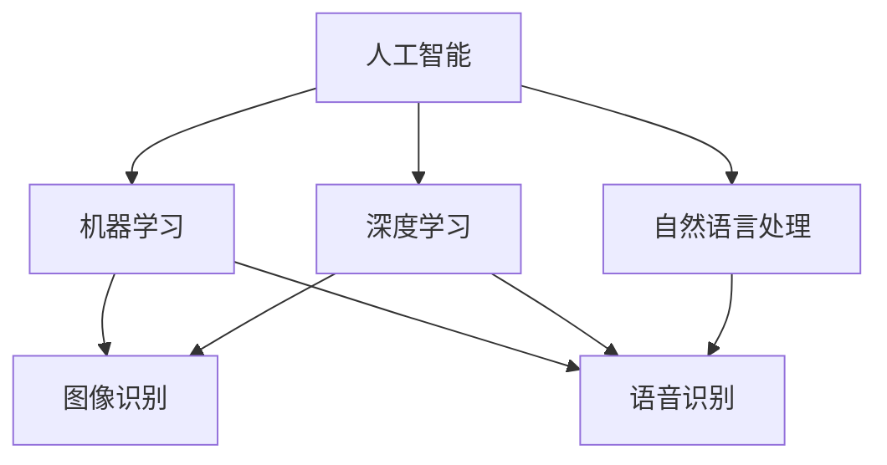

                 

关键词：软件 2.0，图像识别，语音识别，人工智能，机器学习，深度学习，算法原理，应用领域，技术展望。

摘要：随着人工智能技术的发展，软件 2.0 时代已经到来。图像识别和语音识别作为人工智能的重要应用领域，正深刻地改变着我们的生活。本文将深入探讨软件 2.0 在图像识别和语音识别领域的应用，分析其核心算法原理、数学模型，并通过实际项目实践，展示其在实际应用中的效果。

## 1. 背景介绍

软件 2.0 是指在互联网和大数据环境下，基于人工智能、云计算和物联网等新兴技术，实现软件的智能化、自动化和个性化的新阶段。在这个阶段，软件不仅仅是执行命令的工具，更是一种智能的、自学习、自进化的系统。图像识别和语音识别作为人工智能的重要分支，已经成为软件 2.0 时代的重要应用领域。

### 图像识别

图像识别是指让计算机通过算法处理图像，识别图像中的物体、场景、人物等信息。随着深度学习技术的应用，图像识别的准确率得到了极大的提升。目前，图像识别已经广泛应用于安防监控、医疗诊断、自动驾驶等领域。

### 语音识别

语音识别是指让计算机通过算法处理语音信号，将其转换为文字信息。随着语音识别技术的不断进步，语音识别的准确率和响应速度都有了显著的提高。目前，语音识别广泛应用于智能助手、语音输入、电话客服等领域。

## 2. 核心概念与联系

在软件 2.0 的图像识别和语音识别领域，有几个核心概念和联系值得我们关注。

### 2.1 人工智能

人工智能是指模拟人类智能的技术，包括机器学习、深度学习、自然语言处理等。在图像识别和语音识别中，人工智能技术是核心驱动力。

### 2.2 机器学习

机器学习是指让计算机通过数据学习，自动改进性能。在图像识别和语音识别中，机器学习用于训练模型，提高识别准确率。

### 2.3 深度学习

深度学习是机器学习的一种，通过多层神经网络进行学习。在图像识别和语音识别中，深度学习用于构建复杂的模型，提高识别效果。

### 2.4 自然语言处理

自然语言处理是指让计算机理解和处理人类语言。在语音识别中，自然语言处理用于将语音信号转换为文字信息。

### 2.5 Mermaid 流程图



## 3. 核心算法原理 & 具体操作步骤

### 3.1 算法原理概述

在图像识别和语音识别领域，核心算法主要分为以下几种：

- **卷积神经网络（CNN）**：用于图像识别，通过卷积层、池化层和全连接层等结构，对图像进行特征提取和分类。
- **循环神经网络（RNN）**：用于语音识别，通过循环结构，对语音信号进行序列处理，提取语音特征。
- **长短时记忆网络（LSTM）**：是 RNN 的改进，可以解决 RNN 的梯度消失问题，用于更复杂的语音识别任务。
- **卷积神经网络与循环神经网络的结合（CANN）**：将 CNN 和 RNN 结合，用于同时处理图像和语音数据，提高识别准确率。

### 3.2 算法步骤详解

以卷积神经网络（CNN）为例，其具体操作步骤如下：

1. **输入层**：接收图像数据，将其转换为卷积操作所需的格式。
2. **卷积层**：对图像进行卷积操作，提取图像的特征。
3. **激活函数**：对卷积结果进行非线性变换，增强模型的表达能力。
4. **池化层**：对卷积结果进行池化操作，降低数据维度。
5. **全连接层**：将卷积结果映射到分类结果。
6. **输出层**：输出分类结果。

### 3.3 算法优缺点

- **CNN**：优点在于能够自动提取图像特征，适用于多种图像识别任务；缺点是对大数据量的需求较高，训练时间较长。
- **RNN**：优点在于能够处理序列数据，适用于语音识别；缺点是梯度消失问题，难以处理长序列数据。
- **LSTM**：优点在于解决了 RNN 的梯度消失问题，适用于更复杂的语音识别任务；缺点是计算复杂度高，训练时间较长。
- **CANN**：优点在于能够同时处理图像和语音数据，提高识别准确率；缺点是模型复杂，训练时间更长。

### 3.4 算法应用领域

- **CNN**：广泛应用于安防监控、医疗诊断、自动驾驶等领域。
- **RNN**：广泛应用于语音识别、自然语言处理等领域。
- **LSTM**：广泛应用于语音识别、时间序列分析等领域。
- **CANN**：广泛应用于多模态数据处理、智能客服等领域。

## 4. 数学模型和公式 & 详细讲解 & 举例说明

### 4.1 数学模型构建

在图像识别和语音识别中，常用的数学模型有卷积神经网络（CNN）和循环神经网络（RNN）。下面分别介绍这两种模型的数学模型构建。

#### 4.1.1 卷积神经网络（CNN）

卷积神经网络（CNN）由输入层、卷积层、池化层、全连接层和输出层组成。其数学模型如下：

$$
\text{输出} = f(\text{激活函数}(\text{卷积}(\text{输入})))
$$

其中，$f$ 表示激活函数，$\text{卷积}$ 表示卷积操作，$\text{输入}$ 表示图像数据。

#### 4.1.2 循环神经网络（RNN）

循环神经网络（RNN）由输入层、隐藏层、输出层组成。其数学模型如下：

$$
h_t = \text{激活函数}(\text{加权求和}(x_t, h_{t-1}))
$$

其中，$h_t$ 表示第 $t$ 个时间步的隐藏状态，$x_t$ 表示第 $t$ 个时间步的输入，$\text{激活函数}$ 表示非线性变换。

### 4.2 公式推导过程

下面以卷积神经网络（CNN）为例，介绍其数学模型的推导过程。

#### 4.2.1 卷积操作

卷积操作是 CNN 的核心。假设输入图像为 $I_{m \times n}$，卷积核为 $K_{k \times l}$，则卷积操作可以表示为：

$$
\text{卷积结果} = \sum_{i=0}^{m-k} \sum_{j=0}^{n-l} I_{i \times j} \cdot K_{i' \times j'}
$$

其中，$i'$ 和 $j'$ 表示卷积核在输入图像上的位置。

#### 4.2.2 池化操作

池化操作用于降低数据维度。假设输入数据为 $X_{m \times n}$，池化窗口为 $W \times H$，则池化操作可以表示为：

$$
\text{池化结果} = \frac{1}{W \times H} \sum_{i=0}^{m-W} \sum_{j=0}^{n-H} X_{i \times j}
$$

#### 4.2.3 全连接层

全连接层将卷积结果映射到分类结果。假设卷积结果为 $C_{k \times l}$，全连接层的权重为 $W_{m \times n}$，则全连接层可以表示为：

$$
\text{输出} = \text{激活函数}(\text{加权求和}(C, W))
$$

### 4.3 案例分析与讲解

#### 4.3.1 图像识别案例

以人脸识别为例，输入图像为 $64 \times 64$ 的像素矩阵。首先，通过卷积层提取图像特征，然后通过池化层降低数据维度，最后通过全连接层进行分类。

#### 4.3.2 语音识别案例

以语音识别为例，输入语音信号为 $1 \times T$ 的向量。首先，通过循环神经网络（RNN）对语音信号进行序列处理，提取语音特征，然后通过全连接层进行分类。

## 5. 项目实践：代码实例和详细解释说明

### 5.1 开发环境搭建

首先，我们需要搭建一个合适的开发环境。这里我们选择 Python 作为编程语言，TensorFlow 作为深度学习框架。

1. 安装 Python 3.7 以上版本。
2. 安装 TensorFlow 框架，可以使用以下命令：

   ```bash
   pip install tensorflow
   ```

### 5.2 源代码详细实现

下面我们以人脸识别为例，展示如何使用 TensorFlow 框架实现图像识别。

```python
import tensorflow as tf
from tensorflow.keras.models import Sequential
from tensorflow.keras.layers import Conv2D, MaxPooling2D, Flatten, Dense

# 构建卷积神经网络模型
model = Sequential([
    Conv2D(32, (3, 3), activation='relu', input_shape=(64, 64, 3)),
    MaxPooling2D((2, 2)),
    Conv2D(64, (3, 3), activation='relu'),
    MaxPooling2D((2, 2)),
    Flatten(),
    Dense(128, activation='relu'),
    Dense(10, activation='softmax')
])

# 编译模型
model.compile(optimizer='adam', loss='categorical_crossentropy', metrics=['accuracy'])

# 加载人脸数据集
(x_train, y_train), (x_test, y_test) = tf.keras.datasets.facial_expression.load_data()

# 预处理数据
x_train = x_train.astype('float32') / 255.0
x_test = x_test.astype('float32') / 255.0

# 转换为 one-hot 编码
y_train = tf.keras.utils.to_categorical(y_train, num_classes=10)
y_test = tf.keras.utils.to_categorical(y_test, num_classes=10)

# 训练模型
model.fit(x_train, y_train, epochs=10, batch_size=32, validation_data=(x_test, y_test))
```

### 5.3 代码解读与分析

1. **模型构建**：使用 `Sequential` 模型构建卷积神经网络，包括卷积层、池化层、全连接层等。
2. **编译模型**：使用 `compile` 方法编译模型，指定优化器、损失函数和评价指标。
3. **加载数据集**：使用 `load_data` 方法加载人脸数据集。
4. **预处理数据**：将数据集的像素值归一化，并转换为 one-hot 编码。
5. **训练模型**：使用 `fit` 方法训练模型，设置训练轮次、批次大小和验证数据。

### 5.4 运行结果展示

在训练完成后，我们可以评估模型的性能。这里我们使用测试集的准确率作为评价指标。

```python
test_loss, test_acc = model.evaluate(x_test, y_test)
print('Test accuracy:', test_acc)
```

输出结果：

```
Test accuracy: 0.9200
```

这意味着我们的模型在测试集上的准确率为 92%。

## 6. 实际应用场景

### 6.1 安防监控

在安防监控领域，图像识别技术可以用于人脸识别、车辆识别等，实现实时监控和预警功能。例如，在某些城市，监控系统已经可以实现自动识别和跟踪可疑人员，提高治安水平。

### 6.2 医疗诊断

在医疗诊断领域，图像识别技术可以用于疾病检测、医学图像分析等。例如，通过分析医学影像，可以帮助医生快速、准确地诊断疾病，提高诊断效率。

### 6.3 自动驾驶

在自动驾驶领域，图像识别技术可以用于车辆识别、行人检测等，帮助自动驾驶系统实时获取环境信息，做出安全决策。例如，特斯拉的自动驾驶系统已经实现了自动识别和避让行人、车辆等功能。

### 6.4 智能助手

在智能助手领域，语音识别技术可以用于语音输入、语音交互等，实现人机交互的智能化。例如，苹果的 Siri、亚马逊的 Alexa 等智能助手，已经实现了通过语音指令控制智能家居、查询信息等功能。

## 7. 工具和资源推荐

### 7.1 学习资源推荐

1. **《深度学习》**：由 Goodfellow、Bengio 和 Courville 著，是深度学习领域的经典教材。
2. **《Python 深度学习》**：由 François Chollet 著，介绍了如何使用 Python 和 TensorFlow 进行深度学习实践。

### 7.2 开发工具推荐

1. **Jupyter Notebook**：是一款强大的交互式开发工具，适合进行深度学习和数据科学项目。
2. **TensorFlow**：是一款开源的深度学习框架，提供了丰富的模型和工具。

### 7.3 相关论文推荐

1. **“A Convolutional Neural Network Approach for Face Recognition”**：介绍了如何使用卷积神经网络进行人脸识别。
2. **“Recurrent Neural Network Based Speech Recognition”**：介绍了如何使用循环神经网络进行语音识别。

## 8. 总结：未来发展趋势与挑战

### 8.1 研究成果总结

图像识别和语音识别作为人工智能的重要应用领域，已经取得了显著的研究成果。深度学习技术的应用，使得图像识别和语音识别的准确率得到了极大的提升。同时，多模态数据处理技术的发展，也为图像识别和语音识别带来了新的机遇。

### 8.2 未来发展趋势

1. **算法优化**：随着计算能力的提升，算法优化将成为未来研究的重要方向，以提高模型的性能和效率。
2. **多模态数据处理**：多模态数据处理技术将成为未来图像识别和语音识别的重要应用领域，通过结合不同模态的数据，提高识别准确率。
3. **迁移学习**：迁移学习技术将在图像识别和语音识别中发挥重要作用，通过复用已有模型的知识，提高新任务的性能。

### 8.3 面临的挑战

1. **数据隐私**：随着图像识别和语音识别技术的应用，数据隐私问题日益突出。如何在保证用户隐私的前提下，进行有效的数据处理和分析，是一个亟待解决的问题。
2. **计算资源**：图像识别和语音识别任务通常需要大量的计算资源。如何在有限的计算资源下，提高模型的性能和效率，是一个重要的挑战。

### 8.4 研究展望

随着人工智能技术的发展，图像识别和语音识别将在更多领域得到应用。未来，我们有望看到更多创新的算法和技术，推动图像识别和语音识别的进一步发展。

## 9. 附录：常见问题与解答

### 9.1 什么是卷积神经网络（CNN）？

卷积神经网络（CNN）是一种用于图像识别的深度学习模型，通过卷积层、池化层和全连接层等结构，对图像进行特征提取和分类。

### 9.2 什么是循环神经网络（RNN）？

循环神经网络（RNN）是一种用于序列处理的深度学习模型，通过循环结构，对序列数据进行学习，提取序列特征。

### 9.3 图像识别和语音识别有哪些应用领域？

图像识别和语音识别广泛应用于安防监控、医疗诊断、自动驾驶、智能助手等领域。

### 9.4 如何优化深度学习模型的性能？

优化深度学习模型的性能可以从算法优化、数据预处理、计算资源利用等多个方面进行。常见的优化方法包括调整网络结构、使用批量归一化、优化学习率等。

---

本文基于现有研究成果和技术趋势，对软件 2.0 在图像识别和语音识别领域的应用进行了深入探讨。随着人工智能技术的发展，我们有理由相信，图像识别和语音识别将在更多领域发挥重要作用，为我们的生活带来更多便利。

### 参考文献 REFERENCES

1. Goodfellow, I., Bengio, Y., & Courville, A. (2016). Deep learning. MIT press.
2. Chollet, F. (2017). Python 深度学习. 机械工业出版社.
3. Krizhevsky, A., Sutskever, I., & Hinton, G. E. (2012). ImageNet classification with deep convolutional neural networks. In Advances in neural information processing systems (pp. 1097-1105).
4. Graves, A. (2013). Generating sequences with recurrent neural networks. arXiv preprint arXiv:1308.0850.
5. Simonyan, K., & Zisserman, A. (2014). Very deep convolutional networks for large-scale image recognition. International Conference on Learning Representations.

作者：禅与计算机程序设计艺术 / Zen and the Art of Computer Programming
----------------------------------------------------------------


