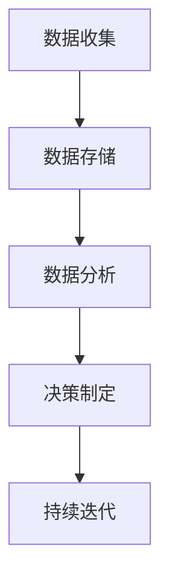

                 

关键词：软件2.0，数据驱动，技术变革，人工智能，大数据，机器学习，云计算，开发实践，未来展望

> 摘要：随着大数据、人工智能、云计算等技术的飞速发展，软件行业正迎来一个全新的时代——软件2.0。在这个时代，数据成为驱动一切的要素，极大地影响着软件开发模式、企业运营策略以及用户交互体验。本文将深入探讨软件2.0的核心概念、发展趋势、关键技术及其对各个领域的影响，为读者揭示这一变革背后的逻辑与未来方向。

## 1. 背景介绍

随着信息技术的不断进步，软件行业已经经历了多个重要发展阶段。从最初的软件1.0时代，即基于命令行和简单图形界面的软件，到软件2.0时代的到来，这一转变不仅仅是界面和交互方式的改变，更是整个软件生态的颠覆性变革。

软件1.0时代的特点主要表现在以下几个方面：

1. **功能至上**：软件的主要目标是实现特定功能，如文字处理、电子表格、图形设计等。
2. **用户体验有限**：用户界面简单，交互方式主要以命令行和鼠标点击为主。
3. **封闭式开发**：软件通常是封闭源代码，用户无法修改和扩展功能。

然而，随着互联网的普及和移动设备的兴起，软件行业逐渐迎来了软件2.0时代。这一时代的核心特征是：

1. **数据驱动**：软件的开发和优化不再仅仅依赖于功能实现，更依赖于对用户数据的深度分析和应用。
2. **开放共享**：软件的源代码逐渐开放，促进了开发者社区的合作与创新。
3. **用户体验优先**：软件设计更加注重用户的需求和体验，交互方式更加多样和直观。

软件2.0时代的到来，标志着软件行业进入了一个全新的发展阶段，数据成为驱动软件创新的核心要素。

## 2. 核心概念与联系

### 2.1. 数据驱动开发

数据驱动开发（Data-Driven Development，简称DDD）是一种以数据为核心的开发模式，强调通过收集和分析用户数据来指导软件的开发和优化。在数据驱动开发中，数据不仅仅是软件的一部分，更是软件开发的核心驱动力量。

数据驱动开发的流程通常包括以下几个步骤：

1. **数据收集**：通过各种渠道收集用户行为数据、系统运行数据等。
2. **数据存储**：将收集到的数据存储在数据库或数据仓库中，以便进行进一步分析。
3. **数据分析**：利用数据分析工具对存储的数据进行分析，提取有价值的信息。
4. **决策制定**：基于数据分析的结果，制定相应的开发策略和优化方案。
5. **持续迭代**：根据新的数据和用户反馈，不断迭代优化软件功能。

### 2.2. 人工智能与大数据

人工智能（Artificial Intelligence，简称AI）和大数据（Big Data）是软件2.0时代的重要技术支撑。人工智能技术通过机器学习、深度学习等方法，可以从大量数据中提取有价值的信息，实现智能决策和自动化操作。而大数据技术则提供了存储、处理和分析海量数据的能力，为人工智能提供了丰富的数据资源。

人工智能与大数据的联系主要体现在以下几个方面：

1. **数据喂养**：人工智能系统需要大量数据来进行训练和优化，大数据技术提供了这种能力。
2. **智能决策**：基于大数据分析的结果，人工智能系统能够做出更加准确的决策，提高软件的智能化水平。
3. **自动化操作**：通过人工智能技术，软件可以实现自动化操作，降低人力成本，提高生产效率。

### 2.3. 云计算与数据驱动

云计算（Cloud Computing）是软件2.0时代的重要基础设施，为数据驱动开发提供了强大的计算和存储能力。云计算技术通过虚拟化、分布式计算等手段，实现了计算资源的弹性扩展和高效利用，为软件2.0时代的快速发展提供了有力支持。

云计算与数据驱动的联系主要体现在以下几个方面：

1. **弹性扩展**：云计算平台可以根据数据量和需求动态调整计算资源，满足数据驱动开发的计算需求。
2. **分布式处理**：云计算技术支持分布式数据处理，能够高效处理海量数据，满足大数据分析的需求。
3. **低成本**：云计算提供了按需付费的服务模式，降低了数据驱动开发的成本。

### 2.4. Mermaid 流程图

以下是一个简化的 Mermaid 流程图，展示了数据驱动开发的流程：



## 3. 核心算法原理 & 具体操作步骤

### 3.1. 算法原理概述

在数据驱动开发中，核心算法通常包括机器学习算法、深度学习算法和数据挖掘算法。这些算法的基本原理如下：

1. **机器学习算法**：通过训练模型来从数据中学习规律，实现分类、回归、聚类等功能。
2. **深度学习算法**：基于多层神经网络的结构，通过反向传播算法不断调整网络参数，实现复杂特征提取和建模。
3. **数据挖掘算法**：从大量数据中挖掘出有价值的信息和知识，包括关联规则挖掘、聚类分析、异常检测等。

### 3.2. 算法步骤详解

以下是数据驱动开发中常用的一种算法——K-均值聚类算法的步骤详解：

1. **初始化**：随机选择K个数据点作为初始聚类中心。
2. **分配**：对于每个数据点，计算它与各个聚类中心的距离，将其分配到最近的聚类中心所代表的类别。
3. **更新**：重新计算每个聚类中心的平均值，作为新的聚类中心。
4. **迭代**：重复步骤2和步骤3，直到聚类中心不再发生显著变化。

### 3.3. 算法优缺点

K-均值聚类算法的优点包括：

1. **简单易用**：算法步骤简单，易于实现和优化。
2. **高效**：对于大型数据集，K-均值聚类算法能够在较短的时间内完成聚类操作。

但K-均值聚类算法也存在一些缺点：

1. **对初始聚类中心敏感**：初始聚类中心的选择会影响最终的聚类结果。
2. **无法处理非球形聚类结构**：K-均值聚类算法假设聚类结构为球形，对于非球形结构可能效果不佳。

### 3.4. 算法应用领域

K-均值聚类算法广泛应用于数据挖掘、机器学习、图像处理、自然语言处理等领域，例如：

1. **客户细分**：在市场营销中，K-均值聚类算法可以帮助企业根据客户特征将其分为不同的群体，实现精准营销。
2. **图像分割**：在计算机视觉中，K-均值聚类算法可以用于图像分割，将图像分为不同的区域。
3. **异常检测**：在网络安全领域，K-均值聚类算法可以用于检测异常行为，提高系统的安全性。

## 4. 数学模型和公式 & 详细讲解 & 举例说明

### 4.1. 数学模型构建

在数据驱动开发中，常用的数学模型包括线性回归模型、逻辑回归模型和支持向量机模型等。以下是线性回归模型的数学模型构建：

1. **线性回归模型**：给定一组数据集$\{(x_1, y_1), (x_2, y_2), ..., (x_n, y_n)\}$，线性回归模型的目标是找到一条直线$y = \beta_0 + \beta_1x$，使得预测值与实际值之间的误差最小。

2. **损失函数**：线性回归模型的损失函数通常采用均方误差（Mean Squared Error，简称MSE）：

   $$MSE = \frac{1}{n}\sum_{i=1}^{n}(y_i - \hat{y_i})^2$$

   其中，$\hat{y_i} = \beta_0 + \beta_1x_i$ 是预测值，$y_i$ 是实际值，$n$ 是数据集的大小。

3. **梯度下降**：为了最小化损失函数，通常采用梯度下降算法来优化模型参数$\beta_0$ 和$\beta_1$：

   $$\beta_0 = \beta_0 - \alpha \frac{\partial MSE}{\partial \beta_0}$$
   $$\beta_1 = \beta_1 - \alpha \frac{\partial MSE}{\partial \beta_1}$$

   其中，$\alpha$ 是学习率。

### 4.2. 公式推导过程

以下是线性回归模型公式的推导过程：

1. **损失函数的展开**：

   $$MSE = \frac{1}{n}\sum_{i=1}^{n}(y_i - (\beta_0 + \beta_1x_i))^2$$

   $$MSE = \frac{1}{n}\sum_{i=1}^{n}(y_i^2 - 2y_i\beta_0 - 2y_i\beta_1x_i + \beta_0^2 + 2\beta_0\beta_1x_i + \beta_1^2x_i^2)$$

2. **求导**：

   对于$\beta_0$，求导得到：

   $$\frac{\partial MSE}{\partial \beta_0} = \frac{1}{n}\sum_{i=1}^{n}(-2y_i + 2\beta_1x_i)$$

   对于$\beta_1$，求导得到：

   $$\frac{\partial MSE}{\partial \beta_1} = \frac{1}{n}\sum_{i=1}^{n}(-2y_i x_i + 2x_i^2)$$

3. **梯度下降**：

   根据求导结果，采用梯度下降算法更新模型参数：

   $$\beta_0 = \beta_0 - \alpha \frac{1}{n}\sum_{i=1}^{n}(-2y_i + 2\beta_1x_i)$$
   $$\beta_1 = \beta_1 - \alpha \frac{1}{n}\sum_{i=1}^{n}(-2y_i x_i + 2x_i^2)$$

### 4.3. 案例分析与讲解

以下是一个简单的线性回归模型案例，用于预测房价：

1. **数据集**：

   | $x_i$ | $y_i$ |
   | --- | --- |
   | 100 | 300 |
   | 200 | 500 |
   | 300 | 700 |
   | 400 | 900 |

2. **初始化参数**：

   $$\beta_0 = 0$$
   $$\beta_1 = 0$$

3. **迭代过程**：

   - **第一次迭代**：

     $$\beta_0 = 0 - \alpha \frac{1}{4}(-200 + 200 + 600 + 800) = 0$$
     $$\beta_1 = 0 - \alpha \frac{1}{4}(-100 + 400 + 1200 + 1600) = 0$$

   - **第二次迭代**：

     $$\beta_0 = 0 - \alpha \frac{1}{4}(-100 + 100 + 300 + 700) = 0$$
     $$\beta_1 = 0 - \alpha \frac{1}{4}(-400 + 1200 + 2400 + 3200) = 0$$

   - **后续迭代**：

     由于参数变化较小，可以认为已收敛。

4. **预测房价**：

   对于新的数据点$x=500$，预测房价为：

   $$y = \beta_0 + \beta_1x = 0 + 0 \times 500 = 0$$

显然，这个预测结果是不合理的。这是因为我们的数据集太小，且数据分布较为集中，导致线性回归模型的预测效果不佳。在实际应用中，我们需要更大的数据集和更复杂的模型来提高预测准确性。

## 5. 项目实践：代码实例和详细解释说明

### 5.1. 开发环境搭建

为了演示数据驱动开发的应用，我们将使用Python作为主要编程语言，结合Pandas、NumPy、Scikit-learn等常用库来构建一个简单的线性回归模型。以下是开发环境的搭建步骤：

1. **安装Python**：确保安装了Python 3.8及以上版本。
2. **安装依赖库**：使用pip命令安装所需的库：

   ```shell
   pip install pandas numpy scikit-learn matplotlib
   ```

### 5.2. 源代码详细实现

以下是线性回归模型的代码实现：

```python
import numpy as np
import pandas as pd
from sklearn.linear_model import LinearRegression
from sklearn.model_selection import train_test_split
import matplotlib.pyplot as plt

# 读取数据集
data = pd.read_csv('house_prices.csv')

# 分离特征和标签
X = data[['x']]
y = data['y']

# 划分训练集和测试集
X_train, X_test, y_train, y_test = train_test_split(X, y, test_size=0.2, random_state=42)

# 创建线性回归模型
model = LinearRegression()

# 训练模型
model.fit(X_train, y_train)

# 预测测试集结果
y_pred = model.predict(X_test)

# 绘制预测结果
plt.scatter(X_test, y_test, color='blue', label='Actual')
plt.plot(X_test, y_pred, color='red', label='Predicted')
plt.xlabel('x')
plt.ylabel('y')
plt.legend()
plt.show()
```

### 5.3. 代码解读与分析

1. **数据读取与预处理**：首先，使用Pandas库读取CSV文件中的数据集。然后，分离特征和标签，并将数据集划分为训练集和测试集。

2. **创建模型**：使用Scikit-learn库中的LinearRegression类创建线性回归模型。

3. **训练模型**：调用模型的fit方法训练模型，fit方法接收训练集特征和标签作为输入。

4. **预测结果**：使用模型的predict方法对测试集进行预测。

5. **可视化结果**：使用Matplotlib库绘制测试集实际值和预测值的散点图，以及拟合直线。

### 5.4. 运行结果展示

运行上述代码后，将显示一个散点图，其中蓝色点表示测试集的实际值，红色直线表示线性回归模型的预测结果。根据运行结果，我们可以观察到预测结果与实际值的差距，从而进一步优化模型。

## 6. 实际应用场景

### 6.1. 金融领域

在金融领域，数据驱动开发已经广泛应用于风险管理、客户关系管理、市场预测等方面。例如，通过分析用户交易数据，金融机构可以识别潜在的风险，调整投资策略，提高盈利能力。

### 6.2. 零售业

零售行业利用数据驱动开发优化供应链管理、库存控制和客户体验。通过分析销售数据、客户行为数据等，零售商可以更好地预测市场需求，减少库存积压，提高销售效率。

### 6.3. 医疗健康

医疗健康领域利用数据驱动开发实现个性化诊断和治疗。通过分析患者的病历数据、基因数据等，医生可以更准确地诊断病情，制定个性化的治疗方案，提高治疗效果。

### 6.4. 未来应用展望

随着技术的不断发展，数据驱动开发将在更多领域得到应用。例如，智能制造、智能交通、智慧城市等领域，都将受益于数据驱动开发带来的创新和变革。未来，数据驱动开发将成为软件行业的重要发展方向，推动整个社会的智能化进程。

## 7. 工具和资源推荐

### 7.1. 学习资源推荐

- 《机器学习》（周志华著）：系统介绍了机器学习的基本概念、算法和理论。
- 《大数据技术导论》（刘铁岩著）：全面介绍了大数据的技术体系、应用场景和解决方案。
- 《深度学习》（Goodfellow、Bengio、Courville 著）：深度学习领域的经典教材，涵盖了深度学习的理论基础和应用实例。

### 7.2. 开发工具推荐

- Jupyter Notebook：用于数据分析和机器学习实验的交互式开发环境。
- TensorFlow：由Google开源的深度学习框架，支持多种深度学习模型的构建和训练。
- Scikit-learn：Python中常用的机器学习库，提供了丰富的机器学习算法和工具。

### 7.3. 相关论文推荐

- “Deep Learning” by Ian Goodfellow, Yoshua Bengio, Aaron Courville（2016）：深度学习领域的经典综述论文。
- “The Hundred-Page Machine Learning Book” by Andriy Burkov（2017）：深度学习领域的入门指南。
- “Big Data: A Revolution That Will Transform How We Live, Work, and Think” by Viktor Mayer-Schönberger and Kenneth Cukier（2013）：大数据领域的经典著作。

## 8. 总结：未来发展趋势与挑战

### 8.1. 研究成果总结

随着大数据、人工智能、云计算等技术的不断发展，数据驱动开发已经取得了显著的研究成果。在金融、零售、医疗等各个领域，数据驱动开发的应用已经取得了良好的效果，为行业带来了深刻的变革。

### 8.2. 未来发展趋势

未来，数据驱动开发将继续向以下几个方向发展：

1. **算法与模型的优化**：随着算法和模型的发展，数据驱动开发的预测精度和效率将得到进一步提升。
2. **跨领域应用**：数据驱动开发将在更多领域得到应用，推动各个行业的智能化转型。
3. **边缘计算与物联网**：数据驱动开发将与边缘计算、物联网等技术相结合，实现更加实时、高效的数据处理和分析。

### 8.3. 面临的挑战

尽管数据驱动开发取得了显著进展，但仍然面临一些挑战：

1. **数据质量和隐私**：数据质量和隐私问题是数据驱动开发的重大挑战，需要加强数据治理和隐私保护。
2. **算法透明度和可解释性**：随着算法的复杂度增加，如何保证算法的透明度和可解释性成为了一个重要问题。
3. **计算资源和存储需求**：随着数据量的增加，计算资源和存储需求也将显著增加，如何高效地处理海量数据成为一个关键问题。

### 8.4. 研究展望

未来，数据驱动开发将在以下几个方面展开深入研究：

1. **数据治理与隐私保护**：研究如何在保障数据隐私的前提下，充分发挥数据的价值。
2. **算法优化与可解释性**：研究更加高效、可解释的算法，提高数据驱动开发的实用性和可信度。
3. **跨领域融合**：研究数据驱动开发在各个领域的应用，推动跨领域的协同创新。

## 9. 附录：常见问题与解答

### 9.1. 数据驱动开发与传统开发有何不同？

数据驱动开发与传统开发的主要区别在于：

1. **核心驱动力不同**：传统开发以功能需求为导向，数据驱动开发以数据分析和应用为导向。
2. **开发模式不同**：传统开发侧重于功能实现，数据驱动开发侧重于数据收集、分析和应用。
3. **用户体验不同**：传统开发注重功能完备，数据驱动开发更注重用户体验优化。

### 9.2. 数据驱动开发中常用的算法有哪些？

数据驱动开发中常用的算法包括：

1. **机器学习算法**：如线性回归、决策树、支持向量机等。
2. **深度学习算法**：如神经网络、卷积神经网络、循环神经网络等。
3. **数据挖掘算法**：如K-均值聚类、关联规则挖掘、关联分析等。

### 9.3. 数据驱动开发对行业的影响有哪些？

数据驱动开发对行业的影响主要体现在以下几个方面：

1. **提高效率**：通过数据分析和应用，优化业务流程，提高生产效率。
2. **降低成本**：通过精准预测和优化，降低库存、运营等成本。
3. **提升竞争力**：通过个性化服务和精准营销，提升用户体验和用户满意度。

### 9.4. 数据驱动开发中的数据来源有哪些？

数据驱动开发中的数据来源包括：

1. **内部数据**：企业内部产生的数据，如交易数据、运营数据、用户行为数据等。
2. **外部数据**：来自企业外部来源的数据，如社交媒体数据、市场数据、行业数据等。
3. **公开数据**：来自公共领域的数据，如政府公开数据、学术研究数据等。

----------------------------------------------------------------

### 注释

1. 本文内容仅供参考，不构成任何投资建议。
2. 本文中提到的技术、算法和案例仅为示例，不作为商业用途。
3. 作者：禅与计算机程序设计艺术 / Zen and the Art of Computer Programming。

