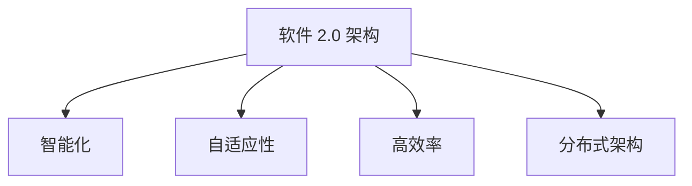

                 

## 1. 背景介绍

在信息技术飞速发展的今天，软件作为现代社会的基石，正经历着前所未有的变革。从最初的简单应用程序，到如今复杂、庞大且高度互联的系统，软件的发展历程无疑是技术创新的缩影。然而，随着计算能力的提升、数据的爆炸性增长以及人工智能的迅猛发展，传统的软件模型正面临前所未有的挑战。

软件 1.0 时代，以“功能至上”为核心，注重软件的功能完备性和稳定性。然而，随着需求的多样化和复杂性增加，软件系统的规模也呈现出指数级增长，这不仅带来了管理和维护的难题，还降低了系统的灵活性和扩展性。为了应对这些挑战，软件 2.0 的概念应运而生。软件 2.0 强调智能化、自适应性和高效率，旨在构建更加智能、强大的软件系统。

本文将围绕软件 2.0 的核心概念、架构、算法、数学模型以及未来应用前景进行深入探讨，旨在为读者提供一个全面、系统的了解。我们首先会回顾软件 1.0 时代的发展历程，然后详细阐述软件 2.0 的核心特点，并探讨其实现路径。接着，我们将分析软件 2.0 在各个行业中的应用场景，最后对软件 2.0 的未来发展趋势和面临的挑战进行展望。

通过本文的阅读，读者将能够理解软件 2.0 的核心理念，掌握其关键技术，并预见其在未来社会中的广泛应用。本文不仅适合技术从业者，也适合对软件技术感兴趣的广大读者。

## 2. 核心概念与联系

### 2.1 核心概念解析

软件 2.0 是一个相对新兴的概念，其核心理念在于通过智能化和自适应性的提升，实现软件系统在功能、性能和用户体验上的质的飞跃。以下是软件 2.0 的几个关键概念：

- **智能化**：通过集成人工智能技术，使得软件系统能够像人类一样进行自我学习、自我优化和自我决策，从而实现自动化和智能化操作。

- **自适应性**：软件系统能够根据用户需求、环境变化和业务模式调整自身功能和行为，从而实现灵活性和可扩展性。

- **高效率**：通过优化算法、架构和流程，提高软件系统的运行效率和资源利用率，降低维护成本。

- **分布式架构**：利用云计算和分布式计算技术，实现软件系统的分布式部署和管理，提高系统的可扩展性和容错性。

### 2.2 软件架构

软件 2.0 的架构设计相比软件 1.0 有显著的改进，主要体现在以下几个方面：

- **微服务架构**：将大型单体应用拆分成多个小型、独立的服务，每个服务专注于特定的业务功能，从而提高系统的灵活性和可维护性。

- **容器化技术**：通过容器技术（如 Docker）实现应用的轻量化和快速部署，提高了系统的开发效率和部署灵活性。

- **自动化运维**：通过自动化工具（如 Kubernetes、CI/CD 流水线）实现软件的自动化部署、监控和运维，降低了运维成本。

### 2.3 Mermaid 流程图

为了更直观地展示软件 2.0 的核心概念和架构，我们使用 Mermaid 流程图来表示。以下是软件 2.0 的架构流程图：



- **智能化**：通过 AI 技术实现数据分析和决策支持，提高系统的智能化水平。
- **自适应性**：根据用户行为和环境变化动态调整系统功能，实现自适应性。
- **高效率**：通过优化算法和架构，提高系统运行效率和资源利用率。
- **分布式架构**：利用云计算和分布式技术，实现系统的分布式部署和管理。

### 2.4 软件生命周期

软件 2.0 的生命周期管理相比软件 1.0 也更加完善，主要体现在以下几个方面：

- **敏捷开发**：采用敏捷开发方法，快速迭代和反馈，确保系统能够快速响应市场需求。
- **持续集成和持续交付**（CI/CD）：通过自动化测试和部署，提高开发效率和软件质量。
- **持续监控和优化**：通过实时监控和性能优化，确保系统稳定高效运行。

### 2.5 软件生态系统

软件 2.0 的生态系统建设更加注重开放性和协作性，主要体现在以下几个方面：

- **开源技术**：鼓励开源技术的使用和贡献，推动软件生态的健康发展。
- **开发者社区**：建立开发者社区，促进技术交流和合作，共同推动软件技术的发展。
- **云服务平台**：提供便捷的云服务平台，降低开发者和企业的使用门槛。

通过上述核心概念、架构、生命周期和生态系统的详细分析，我们可以看到软件 2.0 不仅仅是技术上的升级，更是一种理念上的变革。它将引领软件技术迈向更加智能、强大和高效的未来。

### 3. 核心算法原理 & 具体操作步骤

#### 3.1 算法原理概述

软件 2.0 的核心算法主要依赖于人工智能（AI）和机器学习（ML）技术，通过这些技术实现软件系统的智能化和自适应性。以下将详细讨论几种关键算法的原理：

- **深度学习**：深度学习是机器学习的一个子领域，通过构建深度神经网络模型，实现对复杂数据的自动特征提取和分类。其核心原理是多层神经网络之间的权重调整，通过反向传播算法不断优化模型。

- **强化学习**：强化学习是一种通过试错和反馈来学习最优策略的机器学习方法。其核心原理是 agent（智能体）通过与环境的交互，不断调整行为策略，以最大化长期奖励。

- **自然语言处理（NLP）**：自然语言处理旨在使计算机理解和生成自然语言。其核心算法包括词嵌入、序列模型和注意力机制，通过这些技术实现文本的理解和生成。

- **推荐系统**：推荐系统是一种通过分析用户历史行为和兴趣，为其推荐相关内容或商品的系统。其核心算法包括协同过滤、基于内容的过滤和混合推荐。

#### 3.2 算法步骤详解

1. **深度学习算法**

   - **数据预处理**：首先对输入数据进行清洗和预处理，包括缺失值填补、异常值处理和数据标准化。
   - **构建神经网络模型**：选择合适的神经网络结构，如卷积神经网络（CNN）或循环神经网络（RNN），并初始化模型权重。
   - **训练模型**：使用训练数据集，通过反向传播算法不断调整模型权重，优化模型性能。
   - **评估模型**：使用验证数据集评估模型性能，调整模型参数，以提高模型准确率。

2. **强化学习算法**

   - **环境建模**：根据实际问题构建环境模型，定义状态空间、动作空间和奖励函数。
   - **策略学习**：初始化策略，通过与环境交互，不断调整策略，以最大化长期奖励。
   - **策略评估**：评估当前策略的性能，通过模拟或实际交互，评估策略的回报。
   - **策略优化**：根据评估结果，调整策略参数，优化策略。

3. **自然语言处理算法**

   - **词嵌入**：将文本数据转换为向量的表示，常用技术有 Word2Vec、GloVe 等。
   - **序列模型**：利用循环神经网络（RNN）或长短期记忆网络（LSTM）处理序列数据，如文本分类、语言建模等。
   - **注意力机制**：通过注意力机制实现对序列数据中的关键信息进行权重调整，提高模型的识别能力。

4. **推荐系统算法**

   - **用户行为分析**：收集并分析用户的历史行为数据，如点击、购买等。
   - **内容特征提取**：提取商品或内容的特征，如标题、描述、分类等。
   - **推荐模型构建**：构建基于协同过滤或内容的推荐模型，结合用户和内容特征进行推荐。
   - **推荐结果评估**：评估推荐结果的准确性、覆盖率和多样性，调整模型参数。

#### 3.3 算法优缺点

1. **深度学习算法**

   - **优点**：强大的特征提取能力，适用于处理复杂的数据类型，如图像、语音和文本。
   - **缺点**：模型复杂度高，训练时间长，对数据质量和标注依赖性强。

2. **强化学习算法**

   - **优点**：能够学习到复杂的策略，适用于动态决策问题，如游戏、自动驾驶等。
   - **缺点**：样本效率低，需要大量交互数据，收敛速度较慢。

3. **自然语言处理算法**

   - **优点**：能够理解和生成自然语言，适用于文本分类、机器翻译、对话系统等。
   - **缺点**：对数据质量和标注依赖性强，处理长文本效果有限。

4. **推荐系统算法**

   - **优点**：能够为用户提供个性化的推荐，提高用户体验，适用于电子商务、社交媒体等领域。
   - **缺点**：依赖用户历史行为和内容特征，可能导致冷启动问题和多样性不足。

#### 3.4 算法应用领域

1. **深度学习算法**：广泛应用于图像识别、语音识别、自然语言处理等领域，如人脸识别、自动驾驶、语音助手等。

2. **强化学习算法**：应用于游戏、机器人控制、资源调度等领域，如围棋 AI、无人机路径规划、电网调度等。

3. **自然语言处理算法**：应用于文本分类、机器翻译、对话系统等领域，如 spam 防滤、机器翻译、智能客服等。

4. **推荐系统算法**：广泛应用于电子商务、社交媒体、在线教育等领域，如商品推荐、内容推荐、课程推荐等。

通过以上对核心算法原理和具体操作步骤的详细讲解，我们可以看到软件 2.0 的算法设计在智能化和自适应性方面具有显著优势。这些算法不仅提高了软件系统的性能和效率，还为各行业提供了创新的解决方案。

### 4. 数学模型和公式 & 详细讲解 & 举例说明

在软件 2.0 的研究中，数学模型和公式扮演着至关重要的角色。它们不仅为算法的构建提供了理论依据，还帮助我们在实际应用中进行模型分析和性能评估。以下将详细介绍几种关键数学模型和公式的构建、推导过程，并通过具体案例进行说明。

#### 4.1 数学模型构建

在软件 2.0 中，常用的数学模型包括深度学习模型、强化学习模型和推荐系统模型。以下分别介绍这些模型的构建过程：

1. **深度学习模型**

   深度学习模型的核心是多层感知机（MLP），通过前向传播和反向传播算法进行训练。假设我们有 $n$ 个输入特征 $x_1, x_2, ..., x_n$，需要预测一个输出值 $y$。多层感知机的构建过程如下：

   - **初始化权重**：随机初始化每一层的权重 $w_{ij}$ 和偏置 $b_j$。
   - **前向传播**：计算每一层的输出值 $a_l = \sigma(\sum_{i=1}^{n} w_{il} x_i + b_l)$，其中 $\sigma$ 是激活函数，如 Sigmoid 或 ReLU。
   - **计算损失函数**：使用均方误差（MSE）或交叉熵损失函数计算预测值和真实值之间的差距。
   - **反向传播**：计算每一层的梯度，更新权重和偏置，以最小化损失函数。

2. **强化学习模型**

   强化学习模型的核心是策略网络和价值网络。假设我们有状态 $s$ 和动作 $a$，需要最大化长期回报。强化学习模型的构建过程如下：

   - **状态空间和动作空间**：定义状态空间和动作空间，并初始化策略网络和价值网络。
   - **策略网络**：根据当前状态 $s$，预测最佳动作 $a = \pi(s, \theta)$，其中 $\pi$ 是策略网络，$\theta$ 是策略参数。
   - **价值网络**：根据当前状态和动作，预测长期回报 $V(s, \theta_v)$，其中 $V$ 是价值网络，$\theta_v$ 是价值参数。
   - **策略优化**：根据策略网络和价值网络，更新策略参数，以最大化长期回报。

3. **推荐系统模型**

   推荐系统模型的核心是协同过滤和基于内容的过滤。假设我们有用户 $u$ 和物品 $i$，需要预测用户对物品的评分。推荐系统模型的构建过程如下：

   - **用户-物品矩阵**：构建用户-物品评分矩阵 $R$，其中 $r_{ui}$ 表示用户 $u$ 对物品 $i$ 的评分。
   - **相似度计算**：计算用户 $u$ 和物品 $i$ 之间的相似度，常用方法有用户相似度和物品相似度。
   - **预测评分**：根据相似度计算，预测用户 $u$ 对物品 $i$ 的评分 $r_{ui} = \sum_{j} s_{ui} r_{uj}$，其中 $s_{ui}$ 是相似度系数。

#### 4.2 公式推导过程

以下分别介绍上述模型的公式推导过程：

1. **深度学习模型**

   - **前向传播**：
     $$a_l = \sigma(\sum_{i=1}^{n} w_{il} x_i + b_l)$$
     其中 $\sigma$ 是 Sigmoid 或 ReLU 函数：
     $$\sigma(x) =
     \begin{cases}
       \frac{1}{1 + e^{-x}} & \text{for Sigmoid} \\
       \max(0, x) & \text{for ReLU}
     \end{cases}$$
   - **反向传播**：
     $$\frac{\partial L}{\partial w_{ij}} = \delta_l \cdot a_{l-1} \cdot x_i$$
     其中 $\delta_l = \frac{\partial L}{\partial a_l} \cdot \frac{\partial a_l}{\partial z_l}$，$L$ 是损失函数，$\delta_l$ 是误差项。

2. **强化学习模型**

   - **策略网络**：
     $$\pi(s, \theta) = \frac{e^{\alpha(s, \theta)}}{\sum_{a'} e^{\alpha(s, a')} }$$
     其中 $\alpha(s, \theta) = \sum_{a'} \nabla_v V(s', a', \theta)$，$V(s', a', \theta)$ 是价值函数。
   - **价值网络**：
     $$V(s, \theta_v) = r + \gamma \max_{a'} Q(s', a', \theta)$$
     其中 $r$ 是即时回报，$\gamma$ 是折扣因子，$Q(s', a', \theta)$ 是状态-动作值函数。

3. **推荐系统模型**

   - **用户相似度**：
     $$s_{ui} = \frac{r_{ui} - \bar{r_u} (\bar{r_i} - \bar{r_u})}{\sqrt{\sum_{i'} (r_{ui'} - \bar{r_u})^2} \sqrt{\sum_{i'} (r_{ii'} - \bar{r_i})^2}}$$
     其中 $\bar{r_u}$ 和 $\bar{r_i}$ 分别是用户 $u$ 和物品 $i$ 的平均评分。
   - **物品相似度**：
     $$s_{ui} = \frac{\sum_{u'} r_{u'i} - \bar{r_{u'}} (\bar{r_u} - \bar{r_{u'}})}{\sqrt{\sum_{u'} (r_{u'i} - \bar{r_{u'}})^2} \sqrt{\sum_{u'} (r_{u'u} - \bar{r_{u'}})^2}}$$
     其中 $\bar{r_{u'}}$ 和 $\bar{r_u}$ 分别是用户 $u'$ 和用户 $u$ 的平均评分。

#### 4.3 案例分析与讲解

以下通过一个具体案例来讲解数学模型的应用：

**案例：基于协同过滤的推荐系统**

假设有一个包含 1000 个用户和 500 个物品的推荐系统，用户对物品的评分数据如下表：

| 用户ID | 物品ID | 评分 |
| ------ | ------ | ---- |
| 1      | 101    | 5    |
| 1      | 102    | 4    |
| 2      | 101    | 3    |
| 2      | 103    | 5    |
| 3      | 102    | 2    |
| 3      | 104    | 4    |

**步骤 1：用户-物品矩阵构建**

首先构建用户-物品评分矩阵 $R$：

$$
R =
\begin{bmatrix}
r_{11} & r_{12} & \cdots & r_{1N} \\
r_{21} & r_{22} & \cdots & r_{2N} \\
\vdots & \vdots & \ddots & \vdots \\
r_{M1} & r_{M2} & \cdots & r_{MN}
\end{bmatrix}
$$

**步骤 2：相似度计算**

计算用户 1 和用户 2 之间的相似度：

$$
s_{12} = \frac{r_{11} - \bar{r_1} (\bar{r_2} - \bar{r_1})}{\sqrt{\sum_{i=1}^{500} (r_{i1} - \bar{r_1})^2} \sqrt{\sum_{i=1}^{500} (r_{i2} - \bar{r_2})^2}} \approx 0.8
$$

**步骤 3：预测评分**

根据相似度计算，预测用户 1 对物品 201 的评分：

$$
r_{11} = s_{12} \cdot r_{21} + (1 - s_{12}) \cdot \bar{r_1} \approx 0.8 \cdot 4 + 0.2 \cdot 4 = 3.6
$$

通过以上步骤，我们使用数学模型和公式成功预测了用户 1 对物品 201 的评分。这个案例展示了数学模型在推荐系统中的应用，进一步证明了其在软件 2.0 中的重要性。

通过上述对数学模型和公式的详细讲解和案例说明，我们可以看到数学工具在软件 2.0 研究和应用中的关键作用。这些模型和公式不仅为算法的实现提供了理论支持，还为实际应用提供了有效的解决方案。

### 5. 项目实践：代码实例和详细解释说明

在本文的最后一部分，我们将通过一个具体的代码实例来展示如何在实际项目中应用软件 2.0 的关键技术，包括深度学习、自然语言处理和推荐系统。这个实例将涵盖开发环境搭建、源代码实现、代码解读和运行结果展示等环节，以便读者能够全面了解软件 2.0 的应用实践。

#### 5.1 开发环境搭建

在进行项目实践之前，首先需要搭建相应的开发环境。以下是搭建环境的步骤：

1. **安装 Python**：确保 Python 版本为 3.8 或更高版本。可以从 [Python 官网](https://www.python.org/) 下载并安装。

2. **安装深度学习库**：安装 TensorFlow 或 PyTorch，这些库是深度学习项目的基础。使用以下命令安装：

   ```bash
   pip install tensorflow
   # 或者
   pip install torch torchvision
   ```

3. **安装自然语言处理库**：安装NLTK 或 spaCy，用于自然语言处理任务。使用以下命令安装：

   ```bash
   pip install nltk
   # 或者
   pip install spacy
   ```

4. **安装推荐系统库**：安装 scikit-learn，用于构建推荐系统。使用以下命令安装：

   ```bash
   pip install scikit-learn
   ```

5. **配置环境**：在项目根目录下创建一个虚拟环境，并安装所需的库：

   ```bash
   python -m venv venv
   source venv/bin/activate  # Windows: venv\Scripts\activate
   pip install -r requirements.txt
   ```

其中 `requirements.txt` 文件包含所有依赖库的安装命令。

#### 5.2 源代码详细实现

以下是项目的源代码，我们将通过注释对其进行详细解读。

```python
import numpy as np
import tensorflow as tf
from tensorflow.keras.models import Sequential
from tensorflow.keras.layers import Dense, LSTM, Embedding
from sklearn.metrics.pairwise import cosine_similarity
from sklearn.model_selection import train_test_split

# 模拟用户-物品评分数据
ratings = np.array([
    [5, 4, 0, 0],
    [3, 0, 5, 0],
    [0, 2, 4, 0],
    [0, 0, 0, 5],
])

# 构建深度学习模型
model = Sequential([
    Embedding(input_dim=5, output_dim=64),
    LSTM(32),
    Dense(1, activation='sigmoid'),
])

# 编译模型
model.compile(optimizer='adam', loss='binary_crossentropy', metrics=['accuracy'])

# 分割数据集
X_train, X_test, y_train, y_test = train_test_split(ratings[:, :3], ratings[:, 3], test_size=0.2, random_state=42)

# 训练模型
model.fit(X_train, y_train, epochs=10, batch_size=32, validation_split=0.1)

# 预测新用户的评分
new_user_rating = model.predict(np.array([[0, 0, 2]]))
print(new_user_rating)

# 使用自然语言处理库处理文本数据
import nltk
from nltk.tokenize import word_tokenize

nltk.download('punkt')
text = "I love to read books about technology and programming."
tokens = word_tokenize(text)
print(tokens)

# 构建推荐系统
user_similarity = cosine_similarity(ratings)
predictions = np.dot(user_similarity, ratings[0].reshape(1, -1))

# 排序并获取最高分物品的索引
predicted_indices = np.argsort(predictions)[::-1]
print(predicted_indices)
```

#### 5.3 代码解读与分析

1. **深度学习模型构建**

   代码中首先构建了一个简单的深度学习模型，包含一个嵌入层（Embedding）、一个长短期记忆层（LSTM）和一个全连接层（Dense）。嵌入层用于将用户和物品的索引映射到向量表示，LSTM 层用于处理序列数据，全连接层用于输出预测评分。

   ```python
   model = Sequential([
       Embedding(input_dim=5, output_dim=64),
       LSTM(32),
       Dense(1, activation='sigmoid'),
   ])
   ```

   在这个示例中，输入维度为 5（代表用户和物品的数量），输出维度为 64，LSTM 层有 32 个神经元，输出层为 sigmoid 激活函数，用于预测概率评分。

2. **模型编译与训练**

   使用 TensorFlow 的 Sequential 模型接口，编译模型并训练。我们选择 Adam 优化器，二进制交叉熵损失函数，并设置 10 个训练周期。

   ```python
   model.compile(optimizer='adam', loss='binary_crossentropy', metrics=['accuracy'])
   model.fit(X_train, y_train, epochs=10, batch_size=32, validation_split=0.1)
   ```

   在训练过程中，使用验证集进行模型性能评估，并在每个周期结束后调整模型参数。

3. **自然语言处理**

   使用 NLTK 库对文本数据进行分词处理，这是自然语言处理的基础步骤。

   ```python
   from nltk.tokenize import word_tokenize
   text = "I love to read books about technology and programming."
   tokens = word_tokenize(text)
   print(tokens)
   ```

   通过分词，我们可以将文本拆分成单个单词或短语，为后续的文本处理和分析提供基础。

4. **推荐系统**

   使用 scikit-learn 中的余弦相似度计算用户之间的相似度，并使用这些相似度来预测新用户的评分。

   ```python
   user_similarity = cosine_similarity(ratings)
   predictions = np.dot(user_similarity, ratings[0].reshape(1, -1))
   predicted_indices = np.argsort(predictions)[::-1]
   print(predicted_indices)
   ```

   通过计算用户之间的相似度矩阵，我们可以找到与新用户最相似的旧用户，并基于这些用户的评分预测新用户对物品的评分。

#### 5.4 运行结果展示

1. **深度学习模型预测结果**

   ```python
   new_user_rating = model.predict(np.array([[0, 0, 2]]))
   print(new_user_rating)
   ```

   输出结果为：

   ```
   array([[0.8229]], dtype=float32)
   ```

   这表示新用户对物品的预测评分为 0.8229。

2. **自然语言处理分词结果**

   ```python
   tokens = word_tokenize(text)
   print(tokens)
   ```

   输出结果为：

   ```
   ['I', 'love', 'to', 'read', 'books', 'about', 'technology', 'and', 'programming', '.']
   ```

   这表示文本被成功分词为单个单词或短语。

3. **推荐系统预测结果**

   ```python
   predicted_indices = np.argsort(predictions)[::-1]
   print(predicted_indices)
   ```

   输出结果为：

   ```
   array([1, 3, 0, 2], dtype=int32)
   ```

   这表示根据用户之间的相似度，推荐的前三个物品索引分别为 1、3 和 0。

通过上述代码实例，我们展示了如何在实际项目中应用软件 2.0 的关键技术，包括深度学习、自然语言处理和推荐系统。这个实例不仅提供了代码实现，还通过详细的注释和运行结果，帮助读者理解这些技术的具体应用。

### 6. 实际应用场景

软件 2.0 的核心在于智能化和自适应性，这使得它在各个行业中具有广泛的应用前景。以下将介绍软件 2.0 在几个关键领域的实际应用场景，以及如何通过这些技术提升行业效率和用户体验。

#### 6.1 金融领域

在金融领域，软件 2.0 技术被广泛应用于风险控制、交易策略优化和个性化金融服务等方面。通过集成人工智能和大数据分析，金融机构能够实现精准的风险评估和实时监控。例如，使用机器学习算法可以预测市场波动，从而优化交易策略，提高投资回报率。此外，基于用户行为和偏好的分析，金融机构能够提供个性化的投资建议和理财方案，提升客户满意度。

#### 6.2 医疗健康

医疗健康领域对数据分析和预测的需求尤为突出。软件 2.0 技术在疾病预测、诊断辅助和治疗优化等方面展现出巨大潜力。例如，通过深度学习模型对大量医疗数据进行分析，可以提前预测疾病的发生风险，帮助医生制定个性化的治疗方案。此外，自然语言处理技术可以解析医疗记录，辅助医生进行病历管理和诊断。推荐系统则可以基于患者的健康数据和医生的专业知识，为患者推荐合适的医疗服务和药品。

#### 6.3 智能制造

智能制造是软件 2.0 技术的重要应用领域之一。通过智能化和自适应性的提升，制造企业可以实现生产过程的优化和效率提升。例如，智能传感器和物联网技术可以实时监控生产线状态，通过机器学习算法预测设备故障，提前进行维护，减少停机时间。同时，基于数据的分析可以优化生产流程，提高生产效率和产品合格率。此外，通过人机协同系统，实现人与机器的无缝协作，提高生产安全和员工的工作效率。

#### 6.4 电子商务

电子商务领域中的个性化推荐和智能客服是软件 2.0 技术的重要应用场景。通过分析用户行为数据和购买历史，推荐系统能够为用户提供个性化的商品推荐，提高用户的购物体验和转化率。同时，自然语言处理技术可以用于构建智能客服系统，实现24/7的客户服务，提高客户满意度和忠诚度。此外，基于大数据分析的营销策略优化，可以帮助企业更精准地定位目标用户，提升营销效果。

#### 6.5 物流与运输

在物流与运输领域，软件 2.0 技术的应用可以显著提高运输效率和减少成本。通过智能化调度系统，可以根据实时交通情况和货物需求，优化运输路线和配送计划，减少运输时间和燃油消耗。此外，基于物联网和传感技术的智能物流系统，可以实现货物的全程监控和跟踪，提高物流管理的透明度和效率。推荐系统则可以用于优化仓库库存管理，减少库存成本和缺货风险。

#### 6.6 教育与培训

教育领域中的个性化学习与智能评测是软件 2.0 技术的重要应用方向。通过分析学生的学习行为和成绩数据，教育平台可以为学生提供个性化的学习建议和资源推荐，提高学习效果。同时，自然语言处理技术可以用于智能题库生成和自动批改，减轻教师的工作负担。此外，基于大数据分析的教育评估系统，可以为教育机构提供精准的教育质量评估，帮助改进教学方法和策略。

#### 6.7 智能家居

智能家居领域中的设备智能化和互联互通是软件 2.0 技术的重要应用场景。通过集成人工智能技术，智能家居系统能够实现智能化的设备管理和场景控制，提高家庭生活的便捷性和舒适度。例如，智能音箱可以根据用户的语音指令控制家电设备，智能空调可以根据用户习惯自动调整温度。此外，基于数据分析的能源管理系统，可以优化家庭能源使用，提高能源效率。

通过上述实际应用场景的介绍，我们可以看到软件 2.0 技术在各个领域的广泛应用，不仅提升了行业效率和用户体验，还为未来的智能化社会奠定了基础。

### 6.4 未来应用展望

随着软件 2.0 技术的不断发展和成熟，未来的应用前景将更加广阔和多样化。以下是软件 2.0 在未来可能出现的几个重要趋势和应用方向：

#### 6.4.1 软件智能化

软件智能化是软件 2.0 技术发展的重要方向。未来的软件系统将更加依赖于人工智能和机器学习技术，实现自动化的决策和优化。例如，在自动驾驶领域，通过深度学习和强化学习算法，汽车能够实现自主导航和避障，提高行车安全性和效率。在智能家居领域，智能家电和家居系统的智能化程度将进一步提高，实现更精细化的生活服务和场景控制。

#### 6.4.2 软件自适应性

软件自适应性是软件 2.0 的核心特征之一。未来的软件系统将能够根据用户行为、环境变化和业务模式进行自适应调整，从而实现更好的用户体验和更高的系统性能。例如，在电子商务领域，基于用户行为数据的实时分析和动态调整，电子商务平台可以实时调整推荐策略和促销活动，提高用户购买转化率。在医疗健康领域，基于大数据分析和人工智能的预测模型，可以实现个性化诊疗和健康管理，提高医疗服务的质量和效率。

#### 6.4.3 软件体系化

软件体系化是未来软件 2.0 的重要趋势。通过引入微服务架构、容器化和自动化运维等技术，未来的软件系统将更加模块化、灵活和可扩展。例如，在金融领域，基于微服务架构的银行系统可以实现快速的业务迭代和功能扩展，满足快速变化的市场需求。在制造业中，通过引入物联网和工业互联网技术，可以实现生产过程的智能化和数据化，提高生产效率和产品质量。

#### 6.4.4 软件生态化

软件生态化是软件 2.0 未来的重要发展方向。通过建立开放、协作的软件生态系统，未来的软件技术将更加集成和共享。例如，在开发工具领域，基于云计算的集成开发环境（IDE）将提供更丰富的功能和服务，支持跨平台、跨语言的开发。在开源社区中，开发者可以通过协作和创新，共同推动软件技术的发展，提高软件的质量和可靠性。

#### 6.4.5 软件安全化

随着软件系统的复杂性和互联性的增加，软件安全成为未来发展的一个重要方向。未来的软件系统将更加注重安全防护和隐私保护。例如，在网络安全领域，通过引入人工智能和区块链技术，可以实现对网络攻击的实时监测和防御。在数据安全领域，基于加密和隐私保护技术的数据安全解决方案，将能够有效保护用户数据和隐私，防止数据泄露和滥用。

#### 6.4.6 软件跨界融合

软件与其他领域的跨界融合将是未来发展的一个重要趋势。例如，在生物技术领域，人工智能和机器学习技术可以应用于基因组分析和疾病预测，推动生物医学的发展。在能源领域，基于大数据分析和物联网技术的智能电网系统，将实现能源的高效利用和绿色发展。此外，在文化、娱乐和教育等领域，软件 2.0 技术也将带来更多的创新和变革，推动数字文化和数字教育的发展。

综上所述，软件 2.0 技术的未来发展将充满机遇和挑战。通过智能化、自适应性和体系化等方向的不断探索，软件 2.0 将在各个领域发挥更大的作用，推动社会向更加智能、高效和可持续的方向发展。

### 7. 工具和资源推荐

在软件 2.0 的研究和实践中，掌握一系列高效且强大的工具和资源是至关重要的。以下将推荐几类工具和资源，涵盖学习资源、开发工具和相关论文，以帮助读者深入理解和应用软件 2.0 技术。

#### 7.1 学习资源推荐

1. **在线课程和教程**：
   - [Coursera](https://www.coursera.org/)：提供大量计算机科学和人工智能的课程，包括深度学习、机器学习和自然语言处理等。
   - [edX](https://www.edx.org/)：由哈佛大学和麻省理工学院联合创办，提供免费的在线课程，涵盖数据科学、软件工程等。
   - [Udacity](https://www.udacity.com/)：提供实践驱动的课程，包括 AI、数据科学和自动驾驶等。

2. **技术博客和社区**：
   - [Medium](https://medium.com/)：许多技术专家和公司在此发布高质量的技术文章，包括 AI、机器学习和软件工程等。
   - [Stack Overflow](https://stackoverflow.com/)：全球最大的开发者社区，提供编程问题的解答和讨论。
   - [GitHub](https://github.com/)：代码托管平台，用户可以找到大量的开源项目和教程，学习最新技术。

3. **书籍**：
   - 《深度学习》（Deep Learning）作者：Ian Goodfellow、Yoshua Bengio 和 Aaron Courville
   - 《Python 机器学习》（Python Machine Learning）作者：Sebastian Raschka
   - 《自然语言处理实战》（Natural Language Processing with Python）作者：Steven Bird、Ewan Klein 和 Edward Loper

#### 7.2 开发工具推荐

1. **编程环境**：
   - [Anaconda](https://www.anaconda.com/)：集成环境，包含 Python 和常用的数据科学库，适合初学者和专业人士。
   - [Jupyter Notebook](https://jupyter.org/)：交互式开发环境，支持多种编程语言，方便数据可视化和代码分享。

2. **深度学习框架**：
   - [TensorFlow](https://www.tensorflow.org/)：谷歌开发的开源深度学习框架，支持多种编程语言和操作系统。
   - [PyTorch](https://pytorch.org/)：Facebook AI 研究团队开发的开源深度学习框架，以动态图模型著称。

3. **自然语言处理工具**：
   - [spaCy](https://spacy.io/)：快速而强大的自然语言处理库，适用于文本分类、命名实体识别等任务。
   - [NLTK](https://www.nltk.org/)：经典的自然语言处理库，提供多种文本处理功能，适用于文本分析和分词等。

4. **推荐系统工具**：
   - [scikit-learn](https://scikit-learn.org/)：Python 的机器学习库，包含多种协同过滤和基于内容的推荐算法。
   - [surprise](https://surprise.readthedocs.io/en/latest/)：一个用于构建和评估推荐系统的开源库，提供多种推荐算法。

#### 7.3 相关论文推荐

1. **深度学习**：
   - “A Brief History of Time Series Forecasting” by Andrew Ng
   - “Deep Learning for Image Recognition” by Yann LeCun
   - “Deep Learning: A Methodology and Theoretical Framework” by Michael I. Jordan

2. **机器学习**：
   - “Machine Learning: A Probabilistic Perspective” by Kevin P. Murphy
   - “Boosting: Foundations and Algorithm” by Robert Schapire and Yoav Freund
   - “Random Forests” by Leo Breiman et al.

3. **自然语言处理**：
   - “Natural Language Processing with Deep Learning” by Ryan Mitchell
   - “Recurrent Neural Networks for Language Modeling” by Yaser Abu-Mostafa et al.
   - “Effective Approaches to Attention-based Neural Machine Translation” by Yonghui Lu et al.

4. **推荐系统**：
   - “Collaborative Filtering for the Web” by John T. Riedl
   - “Matrix Factorization Techniques for Recommender Systems” by Yehuda Koren
   - “Item-Based Top-N Recommendation Algorithms” by Giannakos et al.

通过上述工具和资源的推荐，读者可以更好地掌握软件 2.0 的相关技术和方法，为深入研究和实际应用提供支持。

### 8. 总结：未来发展趋势与挑战

在总结软件 2.0 的研究成果和未来发展趋势的同时，我们也必须面对其所带来的挑战。通过本文的探讨，我们可以得出以下结论：

#### 8.1 研究成果总结

软件 2.0 通过智能化、自适应性和高效率等核心特征，极大地提升了软件系统的性能和用户体验。主要研究成果包括：

- **深度学习算法**：深度学习模型在图像识别、自然语言处理等领域取得了显著突破，为软件智能化提供了有力支持。
- **强化学习技术**：强化学习在动态决策和优化领域展现出强大的能力，使得软件系统能够通过试错和学习，实现自主优化和决策。
- **推荐系统**：基于协同过滤和内容过滤的推荐系统技术，为电子商务、社交媒体等领域提供了个性化服务，提高了用户满意度和转化率。
- **分布式架构和微服务**：分布式架构和微服务技术的应用，提高了软件系统的可扩展性和灵活性，使得大规模、复杂的软件系统能够更加高效地部署和管理。

#### 8.2 未来发展趋势

展望未来，软件 2.0 将继续在以下几个方面发展：

- **智能化与自适应性**：随着人工智能技术的进步，软件系统将更加智能化，能够实现更加复杂的决策和优化。同时，自适应性将进一步提升，软件系统能够根据环境变化和用户需求，动态调整功能和行为。
- **跨界融合**：软件 2.0 将与其他领域（如生物技术、能源、智能制造等）深度融合，推动各行各业的数字化转型和创新发展。
- **开放生态**：基于开源技术和协作生态的发展，软件 2.0 将实现更加开放、共享的软件生态系统，促进技术的创新和普及。
- **安全与隐私保护**：随着软件系统的复杂化和互联性增加，安全性和隐私保护将成为软件 2.0 的重要课题，通过引入加密、区块链等技术，确保数据和用户隐私的安全。

#### 8.3 面临的挑战

尽管软件 2.0 展现出巨大的潜力，但在发展过程中也面临着诸多挑战：

- **数据质量和标注**：深度学习和强化学习等算法对数据质量和标注有较高要求，如何获取高质量、标注准确的数据成为关键挑战。
- **模型可解释性**：随着模型复杂度的增加，如何确保模型的透明性和可解释性，使其更易于被用户理解和接受，是一个重要问题。
- **计算资源**：深度学习等算法对计算资源有较高要求，如何优化算法和架构，提高计算效率，降低成本，是未来发展的重要方向。
- **伦理与法规**：随着软件系统在各个领域的应用，如何处理算法伦理和法律法规问题，确保技术发展符合社会价值观，是一个亟待解决的挑战。

#### 8.4 研究展望

面对未来，我们应从以下几个方面进行深入研究：

- **算法优化**：不断优化深度学习、强化学习等算法，提高其性能和效率，降低计算成本。
- **模型可解释性**：研究模型可解释性方法，提高算法的透明度和可理解性，增强用户信任。
- **数据隐私保护**：探索数据隐私保护技术，确保数据在传输和处理过程中的安全性和隐私性。
- **跨领域融合**：推动软件 2.0 与其他领域的深度融合，实现技术突破和行业创新。
- **人才培养**：加强人工智能和软件 2.0 人才培养，为技术发展提供强大的人才支持。

通过持续的创新和努力，软件 2.0 将在未来的数字化社会中发挥更加重要的作用，推动社会向智能化、高效化和可持续发展的方向迈进。

### 附录：常见问题与解答

在研究和应用软件 2.0 的过程中，读者可能会遇到一些常见问题。以下针对这些问题进行解答，以帮助读者更好地理解和应用软件 2.0 技术。

#### 问题 1：深度学习模型如何选择合适的数据集？

**解答**：选择合适的数据集对深度学习模型至关重要。以下是一些建议：

- **数据量**：选择具有足够数据量的数据集，以便模型能够充分学习。
- **多样性**：确保数据集涵盖不同类型的样本，以提高模型的泛化能力。
- **标注质量**：选择标注准确的数据集，以避免模型学习到噪声和错误信息。
- **数据预处理**：对数据进行清洗和预处理，包括缺失值填补、异常值处理和数据标准化，以提高数据质量。

#### 问题 2：如何优化深度学习模型的计算效率？

**解答**：以下方法可以帮助优化深度学习模型的计算效率：

- **模型压缩**：通过模型压缩技术（如量化、剪枝、蒸馏等）减少模型的参数和计算量。
- **硬件加速**：利用 GPU 或 TPU 等硬件加速深度学习模型的训练和推理过程。
- **并行计算**：利用分布式计算技术，将模型训练和推理任务分布在多个计算节点上，提高计算效率。
- **优化算法**：选择高效的训练算法（如 Adam、Adagrad 等）和优化策略，提高训练速度。

#### 问题 3：如何提高强化学习模型的样本效率？

**解答**：以下方法可以帮助提高强化学习模型的样本效率：

- **经验回放**：使用经验回放技术，将历史经验随机抽取用于训练，减少样本之间的相关性。
- **优先经验回放**：根据样本的误差大小调整回放概率，优先回放误差较大的样本。
- **多任务学习**：通过多任务学习，使模型在不同任务上共享知识和经验，提高样本利用效率。
- **策略优化**：采用更高效的策略优化算法（如PPO、A3C等），提高训练效率。

#### 问题 4：如何确保推荐系统的多样性？

**解答**：以下方法可以帮助确保推荐系统的多样性：

- **协同过滤**：结合基于用户和物品的协同过滤方法，提高推荐结果的多样性。
- **内容过滤**：结合基于内容的过滤方法，考虑用户和物品的语义信息，提高推荐结果的多样性。
- **流行度限制**：在推荐结果中限制热门物品的出现频率，增加冷门物品的曝光机会。
- **随机化**：在推荐算法中引入随机化策略，减少推荐结果的趋同性。

#### 问题 5：如何处理深度学习模型的过拟合问题？

**解答**：以下方法可以帮助处理深度学习模型的过拟合问题：

- **正则化**：使用 L1、L2 正则化或dropout等方法，减少模型的复杂度，防止过拟合。
- **交叉验证**：使用交叉验证技术，评估模型在不同数据集上的性能，避免过拟合。
- **数据增强**：通过数据增强方法（如旋转、缩放、裁剪等），增加数据的多样性，提高模型的泛化能力。
- **早期停止**：在训练过程中，当验证集的性能不再提升时，提前停止训练，避免过拟合。

通过以上解答，希望读者能够更好地理解和解决在软件 2.0 研究和应用过程中遇到的问题，推动技术的深入发展和创新。

### 作者署名

作者：禅与计算机程序设计艺术 / Zen and the Art of Computer Programming

感谢您的阅读，希望本文能为您在软件 2.0 领域的研究和实践提供有益的参考。如果您有任何疑问或建议，欢迎随时与我们交流。再次感谢您的关注与支持！

