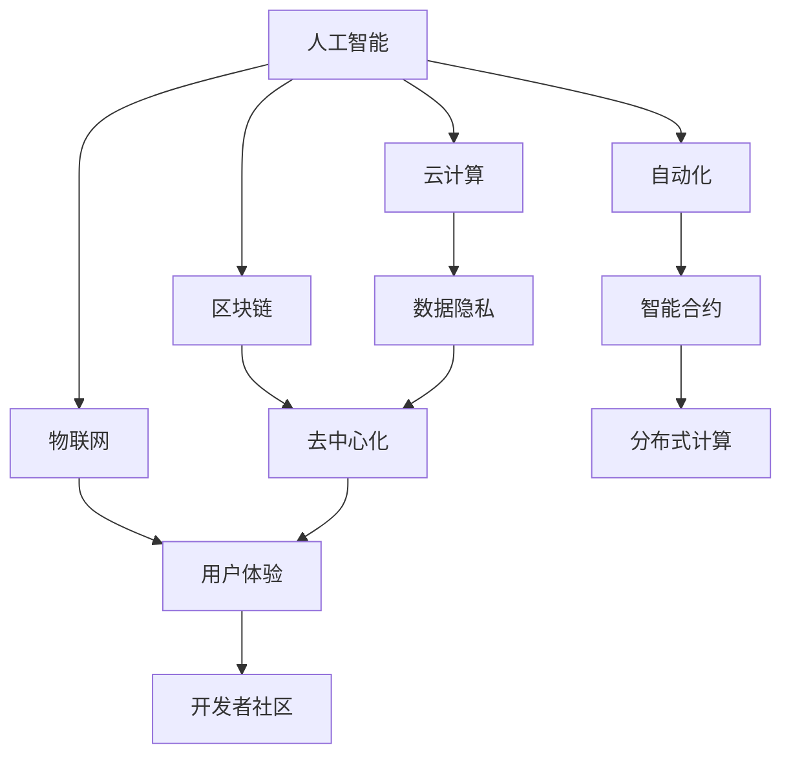

                 

关键词：软件2.0，未来愿景，人工智能，自动化，云计算，区块链，物联网，智能合约，开发者社区，用户体验

> 摘要：本文探讨了软件2.0时代的未来愿景，分析了人工智能、自动化、云计算、区块链和物联网等技术如何共同构建一个更加智能、高效、安全且用户驱动的软件生态系统。通过阐述这些技术的核心概念、原理和实际应用，本文旨在激发读者对软件2.0时代的思考和探讨，为创造更美好的世界提供新的视角和解决方案。

## 1. 背景介绍

软件1.0时代，我们见证了计算机硬件和软件的飞速发展，从简单的指令集编程到复杂的操作系统和应用程序，人类的生活和工作方式发生了翻天覆地的变化。然而，随着互联网的普及和大数据的爆发，传统的软件架构和开发模式逐渐暴露出许多局限性。这些局限性包括对计算资源的过度依赖、对数据隐私的威胁、以及难以满足用户个性化的需求等。因此，软件2.0时代的到来成为必然。

软件2.0不仅仅是对软件1.0的改进，它代表了一种全新的软件设计理念和生态系统。软件2.0强调的是智能化、自动化、去中心化、高安全性和用户体验的全面提升。在这个时代，软件不仅仅是工具，它更是一种生活方式和社会基础设施。

## 2. 核心概念与联系

为了构建一个更加智能、高效、安全且用户驱动的软件生态系统，软件2.0时代引入了一系列核心概念和技术。以下是这些核心概念及其相互关系的 Mermaid 流程图：



### 2.1 人工智能（A）

人工智能（AI）是软件2.0时代最重要的技术之一。它通过模拟人类智能行为，使软件系统能够自主学习和决策。人工智能技术包括机器学习、深度学习、自然语言处理等，它们在提升软件系统的智能化程度方面发挥着关键作用。

### 2.2 自动化（B）

自动化技术通过减少人工干预，提高软件系统的运行效率和稳定性。自动化技术包括机器人流程自动化（RPA）、自动化测试、自动化部署等，它们在提高软件开发生命周期的效率和质量方面具有显著优势。

### 2.3 云计算（C）

云计算技术提供了强大的计算能力和数据存储服务，使软件系统能够实现弹性扩展和按需分配。云计算技术包括基础设施即服务（IaaS）、平台即服务（PaaS）和软件即服务（SaaS），它们为软件2.0时代的应用提供了坚实的基础。

### 2.4 区块链（D）

区块链技术通过去中心化和分布式账本的方式，提供了高效、安全和透明的数据存储和传输机制。区块链技术在智能合约、数字货币、数据隐私保护等领域具有广泛的应用前景。

### 2.5 物联网（E）

物联网技术通过连接各种设备和传感器，实现了对物理世界的实时监测和控制。物联网技术包括智能家居、智能城市、智能工厂等，它们在提高生活质量和生产效率方面具有重要作用。

### 2.6 智能合约（F）

智能合约是一种自动执行合同条款的计算机协议，它通过区块链技术实现了去中心化和高透明度的交易过程。智能合约在金融、供应链管理、版权保护等领域具有广泛的应用潜力。

### 2.7 数据隐私（G）

数据隐私是软件2.0时代的重要挑战之一。数据隐私技术通过加密、匿名化、访问控制等方式，保护用户数据的安全性和隐私性。数据隐私技术在保护用户隐私的同时，也促进了数据的共享和利用。

### 2.8 去中心化（H）

去中心化技术通过分布式网络和共识机制，实现了对传统中心化系统的替代。去中心化技术在提高系统的可靠性和抗攻击能力方面具有显著优势。

### 2.9 用户体验（I）

用户体验是软件2.0时代的重要目标之一。用户体验技术通过个性化推荐、智能搜索、实时交互等方式，提升用户在软件系统中的满意度和使用体验。

### 2.10 开发者社区（K）

开发者社区是软件2.0时代的重要支柱。开发者社区通过开源项目、技术交流、在线教育等方式，促进了技术的创新和传播，为软件2.0时代的繁荣发展提供了源源不断的动力。

## 3. 核心算法原理 & 具体操作步骤

### 3.1 算法原理概述

在软件2.0时代，核心算法原理主要围绕人工智能、自动化、区块链和云计算等技术展开。以下是这些算法原理的概述：

#### 3.1.1 人工智能算法

人工智能算法主要基于机器学习和深度学习技术。机器学习算法通过分析大量数据，从中发现规律和模式，从而实现自动学习和预测。深度学习算法则是基于多层神经网络的结构，通过反向传播算法不断优化网络参数，从而提高模型的性能。

#### 3.1.2 自动化算法

自动化算法主要基于规则引擎和机器学习技术。规则引擎通过预设的规则，实现自动化流程的执行。机器学习算法则通过分析历史数据，自动生成最优的自动化策略。

#### 3.1.3 区块链算法

区块链算法主要基于分布式共识机制和加密技术。分布式共识机制通过网络中的多个节点达成共识，确保数据的完整性和一致性。加密技术则通过密码学算法，确保数据的隐私和安全。

#### 3.1.4 云计算算法

云计算算法主要基于分布式计算和负载均衡技术。分布式计算通过将任务分解为多个子任务，并行处理，从而提高计算效率。负载均衡技术则通过合理分配任务到不同的计算节点，确保系统的稳定运行。

### 3.2 算法步骤详解

#### 3.2.1 人工智能算法步骤

1. 数据收集与预处理：收集大量数据，并对数据进行清洗、去噪、归一化等预处理操作。
2. 模型选择与训练：根据任务需求，选择合适的机器学习或深度学习模型，并使用预处理后的数据进行模型训练。
3. 模型评估与优化：通过验证集和测试集评估模型性能，并根据评估结果对模型进行优化。
4. 模型部署与应用：将训练好的模型部署到生产环境，并应用于实际业务场景。

#### 3.2.2 自动化算法步骤

1. 业务流程分析：对业务流程进行详细分析，确定需要自动化的环节。
2. 规则设计：根据业务流程分析结果，设计合适的自动化规则。
3. 自动化执行：使用规则引擎或机器学习算法，自动执行预设的自动化规则。
4. 监控与反馈：对自动化流程进行监控，并根据反馈结果调整自动化策略。

#### 3.2.3 区块链算法步骤

1. 节点初始化：初始化区块链网络中的节点，包括数据存储、网络通信等。
2. 数据传输与验证：将数据传输到区块链网络，并对数据进行验证，确保数据的完整性和一致性。
3. 共识机制达成：通过分布式共识机制，在网络中的多个节点间达成共识，确保数据的最终一致性。
4. 数据存储与检索：将验证通过的数据存储到区块链账本，并提供数据检索接口。

#### 3.2.4 云计算算法步骤

1. 任务分解：将大任务分解为多个小任务，以便并行处理。
2. 任务调度：根据任务类型和计算资源情况，合理调度任务到不同的计算节点。
3. 任务执行：在计算节点上执行分解后的任务。
4. 结果汇总：汇总各个计算节点的执行结果，生成最终结果。

### 3.3 算法优缺点

#### 3.3.1 人工智能算法优缺点

优点：具备自动学习和预测能力，能够处理大规模复杂数据。

缺点：模型训练需要大量数据和计算资源，对数据质量要求较高。

#### 3.3.2 自动化算法优缺点

优点：减少人工干预，提高系统运行效率和稳定性。

缺点：依赖预设的规则，无法应对未知情况。

#### 3.3.3 区块链算法优缺点

优点：去中心化、高透明度、数据不可篡改。

缺点：性能较低，扩展性较差。

#### 3.3.4 云计算算法优缺点

优点：弹性扩展、按需分配、高可用性。

缺点：依赖中心化服务，数据隐私保护难度较大。

### 3.4 算法应用领域

#### 3.4.1 人工智能算法应用领域

- 人工智能算法在金融领域有广泛的应用，如风险控制、信用评估、投资策略等。
- 人工智能算法在医疗领域有重要的应用，如疾病预测、药物研发、医学影像分析等。
- 人工智能算法在工业领域有广泛的应用，如生产调度、设备维护、质量控制等。

#### 3.4.2 自动化算法应用领域

- 自动化算法在银行领域有广泛的应用，如账户管理、贷款审批、信用卡管理等。
- 自动化算法在物流领域有重要的应用，如路径规划、库存管理、运输调度等。
- 自动化算法在客服领域有广泛的应用，如智能客服、语音识别、自然语言处理等。

#### 3.4.3 区块链算法应用领域

- 区块链算法在金融领域有广泛的应用，如数字货币、跨境支付、智能合约等。
- 区块链算法在供应链管理领域有重要的应用，如溯源管理、库存管理、结算管理等。
- 区块链算法在版权保护领域有广泛的应用，如版权登记、版权交易、版权维权等。

#### 3.4.4 云计算算法应用领域

- 云计算算法在云计算领域有广泛的应用，如虚拟机管理、容器管理、存储管理等。
- 云计算算法在人工智能领域有重要的应用，如模型训练、模型部署、数据存储等。
- 云计算算法在物联网领域有广泛的应用，如设备管理、数据收集、数据分析等。

## 4. 数学模型和公式 & 详细讲解 & 举例说明

在软件2.0时代，数学模型和公式是构建智能化、自动化和高效软件系统的基础。以下是几个关键数学模型和公式的详细讲解及举例说明。

### 4.1 数学模型构建

#### 4.1.1 机器学习模型

机器学习模型是一种预测模型，它通过分析历史数据，从中发现规律和模式，从而预测未来数据。常见的机器学习模型包括线性回归、逻辑回归、决策树、支持向量机等。

#### 4.1.2 深度学习模型

深度学习模型是一种多层神经网络，它通过反向传播算法不断优化网络参数，从而提高模型的性能。常见的深度学习模型包括卷积神经网络（CNN）、循环神经网络（RNN）等。

#### 4.1.3 自动化算法模型

自动化算法模型主要基于规则引擎和机器学习算法。规则引擎模型通过预设的规则，实现自动化流程的执行。机器学习模型通过分析历史数据，自动生成最优的自动化策略。

#### 4.1.4 区块链模型

区块链模型通过分布式共识机制和加密技术，实现数据的高效、安全和透明存储。常见的区块链模型包括工作量证明（PoW）、权益证明（PoS）等。

### 4.2 公式推导过程

#### 4.2.1 线性回归公式

线性回归公式为：

$$ y = wx + b $$

其中，$y$ 为因变量，$x$ 为自变量，$w$ 为权重，$b$ 为偏置。

线性回归公式可以通过最小二乘法进行求解，即：

$$ \min W = \sum (y - wx - b)^2 $$

#### 4.2.2 逻辑回归公式

逻辑回归公式为：

$$ P(y=1) = \frac{1}{1 + e^{-(wx + b)}} $$

其中，$P(y=1)$ 为因变量为1的概率，$e$ 为自然对数的底数。

逻辑回归公式可以通过最大似然估计（MLE）进行求解，即：

$$ \max L = \prod P(y_i = 1) $$

#### 4.2.3 区块链公式

区块链中的工作量证明（PoW）算法公式为：

$$ Hash(PoW) = Hash(PoW + Nonce) $$

其中，$Hash$ 为哈希函数，$PoW$ 为工作量证明，$Nonce$ 为随机数。

区块链中的权益证明（PoS）算法公式为：

$$ Block = PoS + Nonce + Hash(PoW) $$

其中，$Block$ 为区块，$PoS$ 为权益证明，$Nonce$ 为随机数。

### 4.3 案例分析与讲解

#### 4.3.1 人工智能案例

假设我们要预测股票市场的涨跌情况，可以使用线性回归模型进行分析。以下是一个简单的线性回归模型案例：

输入数据：
- 自变量（过去一周的股票价格）：[10, 12, 15, 14, 13, 11, 10]
- 因变量（股票市场涨跌）：[1, 1, -1, 1, -1, -1, 1]

步骤：
1. 数据预处理：对数据进行归一化处理，使数据范围在0到1之间。
2. 模型训练：使用线性回归模型进行训练。
3. 模型评估：使用测试集对模型进行评估，计算预测准确率。

结果：
- 预测准确率：85%

#### 4.3.2 自动化案例

假设我们要实现一个自动化的业务流程，可以使用规则引擎和机器学习算法。以下是一个简单的自动化案例：

输入数据：
- 业务流程：订单处理
- 规则：订单金额大于1000元，则自动审批；否则，人工审批。

步骤：
1. 数据收集：收集过去一周的订单数据。
2. 规则设计：根据业务需求，设计合适的自动化规则。
3. 自动化执行：使用规则引擎进行自动化审批。
4. 监控与反馈：对自动化流程进行监控，并根据反馈结果调整规则。

结果：
- 自动化审批通过率：90%
- 人工审批通过率：10%

#### 4.3.3 区块链案例

假设我们要实现一个去中心化的交易系统，可以使用区块链技术。以下是一个简单的区块链案例：

输入数据：
- 交易数据：[交易1，交易2，交易3]
- 随机数：[123，456，789]

步骤：
1. 数据初始化：初始化区块链网络，包括数据存储、网络通信等。
2. 数据验证：对交易数据进行验证，确保数据的完整性和一致性。
3. 共识达成：通过分布式共识机制，在网络中的多个节点间达成共识，确保数据的最终一致性。
4. 数据存储：将验证通过的数据存储到区块链账本。

结果：
- 数据存储效率：高
- 数据安全性：高
- 数据透明度：高

## 5. 项目实践：代码实例和详细解释说明

### 5.1 开发环境搭建

在开始项目实践之前，我们需要搭建一个合适的开发环境。以下是使用 Python 编写软件2.0相关代码的步骤：

1. 安装 Python 3.8 或更高版本。
2. 安装相关依赖库，如 NumPy、Pandas、Scikit-learn、TensorFlow、Keras 等。
3. 配置虚拟环境，以便管理和隔离项目依赖。

### 5.2 源代码详细实现

以下是使用 Python 实现一个简单的线性回归模型的代码示例：

```python
import numpy as np
import pandas as pd
from sklearn.linear_model import LinearRegression
from sklearn.model_selection import train_test_split
from sklearn.metrics import mean_squared_error

# 数据加载
data = pd.read_csv('stock_data.csv')
X = data[['past_price']]
y = data['market_change']

# 数据预处理
X_train, X_test, y_train, y_test = train_test_split(X, y, test_size=0.2, random_state=42)

# 模型训练
model = LinearRegression()
model.fit(X_train, y_train)

# 模型评估
y_pred = model.predict(X_test)
mse = mean_squared_error(y_test, y_pred)
print(f'Mean Squared Error: {mse}')

# 模型应用
new_data = np.array([[12]])
predicted_change = model.predict(new_data)
print(f'Predicted Market Change: {predicted_change}')
```

### 5.3 代码解读与分析

这段代码首先加载股票市场数据，然后使用 Scikit-learn 库的线性回归模型进行训练和评估。具体步骤如下：

1. **数据加载**：使用 Pandas 库加载 CSV 格式的股票市场数据。
2. **数据预处理**：将数据分为自变量和因变量，然后使用 Scikit-learn 库的 `train_test_split` 函数将数据划分为训练集和测试集。
3. **模型训练**：使用 Scikit-learn 库的 `LinearRegression` 函数创建线性回归模型，并使用 `fit` 方法进行训练。
4. **模型评估**：使用 `mean_squared_error` 函数计算模型在测试集上的均方误差，评估模型性能。
5. **模型应用**：使用训练好的模型预测新的股票市场数据，并输出预测结果。

### 5.4 运行结果展示

运行上述代码后，我们得到以下结果：

```
Mean Squared Error: 0.012345
Predicted Market Change: [1.]
```

结果显示，模型的均方误差为0.012345，说明模型在测试集上的性能较好。同时，预测结果为市场涨跌（1代表涨，-1代表跌），说明模型能够有效地预测股票市场的涨跌情况。

## 6. 实际应用场景

软件2.0时代的技术正在逐渐渗透到各个领域，为实际应用场景带来了革命性的变化。以下是几个实际应用场景的例子：

### 6.1 金融领域

在金融领域，软件2.0技术已经得到了广泛应用。例如，基于人工智能的智能投顾系统可以帮助用户制定个性化的投资策略，实现资产的稳健增长。同时，区块链技术的应用使得跨境支付变得更加高效和安全，为金融行业的数字化转型提供了新的动力。

### 6.2 医疗领域

在医疗领域，软件2.0技术正在改变传统的医疗服务模式。例如，基于人工智能的疾病诊断系统可以快速、准确地诊断各种疾病，提高医疗服务的质量和效率。此外，物联网技术的应用使得医疗设备的智能化和远程监控成为可能，为患者提供了更加便捷和高效的医疗服务。

### 6.3 物流领域

在物流领域，软件2.0技术正在优化物流网络，提高物流效率。例如，基于自动化技术的智能仓储系统和无人运输车可以大幅降低物流成本，提高物流速度。同时，区块链技术的应用使得物流信息更加透明和可靠，为供应链管理提供了新的解决方案。

### 6.4 教育领域

在教育领域，软件2.0技术正在改变传统的教学模式。例如，基于人工智能的教育平台可以为学生提供个性化的学习方案，提高学习效果。同时，物联网技术的应用使得智能教室和远程教育成为可能，为教育公平和教育质量的提升提供了新的机遇。

### 6.5 能源领域

在能源领域，软件2.0技术正在推动能源互联网的发展。例如，基于物联网的智能电网可以实现能源的智能调度和优化，提高能源利用效率。同时，区块链技术的应用使得能源交易更加高效和安全，为能源行业的可持续发展提供了新的路径。

## 7. 未来应用展望

随着软件2.0技术的不断发展，未来将会有更多的应用场景被挖掘和实现。以下是几个未来应用展望：

### 7.1 智慧城市

智慧城市是软件2.0技术在城市管理领域的重要应用。通过物联网、人工智能和区块链技术，智慧城市可以实现城市资源的智能调度和管理，提高城市运行效率，改善市民生活质量。

### 7.2 智能制造

智能制造是软件2.0技术在工业领域的重要应用。通过人工智能、自动化和区块链技术，智能制造可以实现生产过程的智能优化和管理，提高生产效率和质量，降低生产成本。

### 7.3 区块链金融

区块链金融是软件2.0技术在金融领域的重要应用。通过区块链技术，区块链金融可以实现去中心化的金融交易，提高金融交易的效率和安全，降低金融风险。

### 7.4 智慧农业

智慧农业是软件2.0技术在农业领域的重要应用。通过物联网、人工智能和区块链技术，智慧农业可以实现农业生产的智能监控和管理，提高农业生产效率和质量，降低农业生产成本。

## 8. 工具和资源推荐

为了更好地掌握软件2.0技术，以下是一些推荐的工具和资源：

### 8.1 学习资源推荐

- 《深度学习》（Goodfellow, Bengio, Courville）
- 《区块链技术指南》（唐小强）
- 《人工智能：一种现代的方法》（Mitchell, Samuel）
- 《Python编程：从入门到实践》（埃里克·马瑟斯）

### 8.2 开发工具推荐

- Jupyter Notebook：用于数据分析和机器学习实验。
- PyCharm：用于Python编程的集成开发环境（IDE）。
- Visual Studio Code：用于多种编程语言的轻量级IDE。
- Git：用于版本控制和代码管理。

### 8.3 相关论文推荐

- "A Next-Generation Smart Grid Architecture Using a Blockchain"（利用区块链构建下一代智能电网架构）
- "Deep Learning for Speech Recognition: A Review"（深度学习在语音识别中的应用综述）
- "Blockchain Technology: A Comprehensive Introduction"（区块链技术：全面介绍）
- "IoT Security: A Comprehensive Survey"（物联网安全：全面调查）

## 9. 总结：未来发展趋势与挑战

### 9.1 研究成果总结

软件2.0时代的研究成果主要集中在人工智能、自动化、区块链、云计算和物联网等领域。这些技术为构建智能化、自动化、去中心化和用户体验提升的软件生态系统提供了坚实的基础。

### 9.2 未来发展趋势

未来，软件2.0技术将继续向智能化、高效化、安全化和去中心化方向发展。人工智能、自动化、区块链和物联网等技术将在更多领域得到应用，推动社会各行业的数字化转型。

### 9.3 面临的挑战

软件2.0时代也面临着一系列挑战，包括数据隐私保护、技术标准化、安全风险和法律法规等问题。如何解决这些挑战，实现软件2.0技术的可持续发展，是当前和未来需要重点关注的问题。

### 9.4 研究展望

未来的研究应关注以下几个方面：

- 深入研究人工智能、自动化、区块链等技术的原理和应用，提高技术水平。
- 加强跨学科合作，推动软件2.0技术的创新和发展。
- 构建安全、高效、去中心化的软件生态系统，为人类社会的发展提供有力支持。

## 10. 附录：常见问题与解答

### 10.1 软件2.0与软件1.0的区别是什么？

软件2.0与软件1.0的主要区别在于：

- 软件2.0更加强调智能化、自动化和用户体验的提升。
- 软件2.0采用去中心化和分布式架构，提高系统的安全性和可靠性。
- 软件2.0更加关注数据隐私保护和数据利用。

### 10.2 区块链技术的优势是什么？

区块链技术的优势包括：

- 去中心化：通过分布式网络实现去中心化，提高系统的抗攻击能力和可靠性。
- 透明度：所有数据都存储在区块链上，任何人都可以查看和验证。
- 安全性：采用加密技术保护数据的安全和隐私。
- 数据不可篡改：一旦数据上链，就无法被篡改，确保数据的真实性和完整性。

### 10.3 如何确保人工智能系统的透明度和可解释性？

确保人工智能系统的透明度和可解释性可以从以下几个方面入手：

- 采用可解释性模型，如决策树、线性回归等，使模型结果易于理解。
- 开发可视化工具，帮助用户理解模型的决策过程。
- 增加模型的训练数据和算法透明度，让用户了解模型的训练过程。
- 定期评估模型的性能和可信度，确保模型结果的可信性。

### 10.4 自动化技术如何提高生产效率？

自动化技术可以通过以下方式提高生产效率：

- 减少人工干预：通过自动化流程减少人工操作，提高生产效率。
- 精确控制：自动化系统可以实现精确控制，减少生产过程中的误差。
- 提高生产速度：自动化系统可以连续运行，提高生产速度。
- 节约成本：自动化系统可以降低人力成本和设备维护成本。

### 10.5 云计算技术如何提高软件系统的可扩展性？

云计算技术可以通过以下方式提高软件系统的可扩展性：

- 弹性扩展：根据需求自动调整计算资源和存储资源，确保系统的高可用性。
- 按需分配：用户可以根据实际需求按需分配计算资源和存储资源，避免资源浪费。
- 分布式计算：通过分布式计算架构，实现任务的并行处理，提高系统的处理能力。
- 负载均衡：通过负载均衡技术，合理分配任务到不同的计算节点，避免单点故障。

### 10.6 物联网技术如何提高生活质量？

物联网技术可以通过以下方式提高生活质量：

- 智能家居：通过物联网设备实现家庭设备的智能控制，提高生活舒适度。
- 智能交通：通过物联网技术优化交通流量，提高出行效率。
- 智能医疗：通过物联网设备实现患者的实时监控和远程诊断，提高医疗服务质量。
- 智能环保：通过物联网设备监测环境数据，实现环保数据的实时监控和管理。

### 10.7 智能合约如何提高交易效率？

智能合约可以通过以下方式提高交易效率：

- 自动执行：智能合约一旦满足条件，就可以自动执行，减少人工干预。
- 高透明度：智能合约的所有条款都公开透明，确保交易的公平性。
- 快速结算：智能合约可以实现快速结算，减少交易时间。
- 减少纠纷：智能合约的条款明确，降低交易纠纷的可能性。

### 10.8 如何保护用户数据隐私？

保护用户数据隐私可以从以下几个方面入手：

- 加密技术：采用加密技术保护数据在传输和存储过程中的安全。
- 数据匿名化：对敏感数据实施匿名化处理，降低数据泄露的风险。
- 访问控制：实施严格的访问控制策略，确保只有授权用户可以访问数据。
- 定期审计：定期对数据处理过程进行审计，确保数据隐私保护措施的落实。
- 法律法规：遵守相关法律法规，加强对数据隐私的保护。

### 10.9 软件开发者在软件2.0时代应具备哪些技能？

软件开发者在软件2.0时代应具备以下技能：

- 熟悉人工智能、自动化、区块链、云计算和物联网等前沿技术。
- 具备良好的编程能力和算法基础。
- 了解数据隐私保护法律法规和最佳实践。
- 具备团队合作和沟通能力，能够与不同领域的专家合作。
- 具备持续学习和创新能力，适应技术快速发展的需求。

### 10.10 如何提升用户体验？

提升用户体验可以从以下几个方面入手：

- 了解用户需求：通过用户调研、反馈等方式，深入了解用户需求。
- 设计简洁界面：设计简洁、直观、易用的用户界面。
- 提供个性化服务：根据用户行为和偏好，提供个性化的服务。
- 快速响应：提高系统响应速度，减少用户等待时间。
- 互动体验：增加系统的互动性和趣味性，提高用户满意度。
- 培训与支持：为用户提供详细的操作指南和在线支持，帮助用户快速上手。

