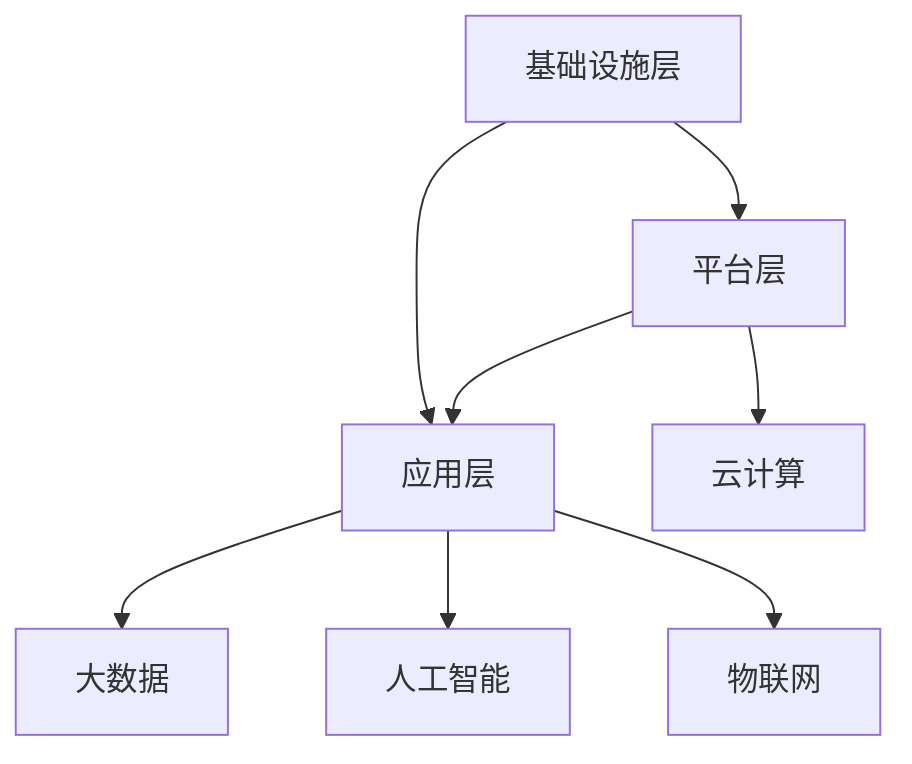

                 

关键词：软件 2.0，未来愿景，技术变革，人工智能，物联网，可持续发展

> 摘要：本文将探讨软件 2.0 的概念、未来愿景以及其对全球技术变革的潜在影响。通过深入分析软件 2.0 的核心概念、架构、算法原理，我们将探讨其在人工智能、物联网和可持续发展等领域的应用，并展望其未来发展。

## 1. 背景介绍

随着信息技术的飞速发展，软件产业已经经历了多次变革。从最早的软件 1.0 时代，即基于命令行和简单图形界面的软件，到如今的软件 2.0 时代，软件的形态和功能发生了翻天覆地的变化。软件 2.0 是指基于云计算、大数据、人工智能等新技术，实现软件智能化、网络化和生态化的新一代软件。

软件 2.0 的出现，不仅改变了软件的开发模式，也改变了软件的应用场景。在这个新的时代，软件不再仅仅是功能单一的程序，而是具有高度智能化和自适应能力的生态系统。这使得软件能够更好地服务于人类，推动社会进步。

## 2. 核心概念与联系

### 2.1 软件 2.0 的核心概念

软件 2.0 的核心概念包括云计算、大数据、人工智能、物联网等。这些概念之间存在着紧密的联系。

- **云计算**：提供了软件运行的基础设施，使得软件可以随时随地访问和处理数据。
- **大数据**：提供了软件所需的大量数据资源，使得软件能够进行数据分析和智能决策。
- **人工智能**：提供了软件的智能化能力，使得软件能够自主学习和进化。
- **物联网**：提供了软件的物理世界接口，使得软件能够与物理世界进行实时交互。

### 2.2 软件 2.0 的架构

软件 2.0 的架构通常包括以下几个层次：

- **基础设施层**：包括云计算、大数据平台等基础设施。
- **平台层**：包括软件开发工具、运行时环境等。
- **应用层**：包括各种具体的应用软件。

这三个层次相互依存，共同构成了软件 2.0 的完整架构。

### 2.3 Mermaid 流程图



## 3. 核心算法原理 & 具体操作步骤

### 3.1 算法原理概述

软件 2.0 的核心算法原理主要包括机器学习、深度学习、自然语言处理等。这些算法通过处理和分析大量数据，实现软件的智能化和自适应能力。

### 3.2 算法步骤详解

- **数据收集**：收集大量的数据，包括结构化和非结构化数据。
- **数据预处理**：对数据进行清洗、归一化等处理，以便于算法分析。
- **模型训练**：使用机器学习算法，对数据进行训练，构建模型。
- **模型评估**：使用测试数据，对模型进行评估，调整模型参数。
- **模型应用**：将训练好的模型应用到实际场景，实现智能化功能。

### 3.3 算法优缺点

- **优点**：可以实现软件的智能化，提高软件的性能和效率。
- **缺点**：需要大量的数据支持，训练过程复杂，对计算资源要求较高。

### 3.4 算法应用领域

- **人工智能**：如自动驾驶、智能家居等。
- **物联网**：如智能穿戴设备、智能工厂等。
- **大数据**：如数据分析、数据挖掘等。

## 4. 数学模型和公式 & 详细讲解 & 举例说明

### 4.1 数学模型构建

在软件 2.0 中，常用的数学模型包括线性模型、非线性模型、神经网络等。

- **线性模型**：用于处理线性关系，如线性回归、线性规划等。
- **非线性模型**：用于处理非线性关系，如神经网络、支持向量机等。
- **神经网络**：用于模拟生物神经系统的计算模型，如深度学习。

### 4.2 公式推导过程

以线性回归为例，线性回归的公式如下：

$$ y = ax + b $$

其中，$y$ 是因变量，$x$ 是自变量，$a$ 和 $b$ 是参数。

线性回归的推导过程如下：

$$ y_1 = a_1x_1 + b_1 $$
$$ y_2 = a_2x_2 + b_2 $$

$$ ... $$

$$ y_n = a_nx_n + b_n $$

通过最小二乘法，可以得到：

$$ a = \frac{\sum_{i=1}^{n}x_iy_i - nx\bar{y}}{\sum_{i=1}^{n}x_i^2 - n\bar{x}^2} $$

$$ b = \bar{y} - a\bar{x} $$

### 4.3 案例分析与讲解

以智能家居系统为例，智能家居系统中的温度控制系统是一个典型的线性模型。

- **因变量**：温度
- **自变量**：室内外温差、湿度等

通过线性回归模型，可以预测室内温度，并自动调节空调温度，实现智能化控制。

## 5. 项目实践：代码实例和详细解释说明

### 5.1 开发环境搭建

- **编程语言**：Python
- **开发工具**：PyCharm
- **依赖库**：scikit-learn、numpy、matplotlib

### 5.2 源代码详细实现

```python
from sklearn.linear_model import LinearRegression
import numpy as np
import matplotlib.pyplot as plt

# 数据准备
x = np.array([[0], [1], [2], [3], [4]])
y = np.array([0, 1, 2, 3, 4])

# 模型训练
model = LinearRegression()
model.fit(x, y)

# 模型评估
score = model.score(x, y)
print("模型评估得分：", score)

# 模型应用
x_new = np.array([[5]])
y_pred = model.predict(x_new)
print("预测温度：", y_pred)

# 可视化
plt.scatter(x, y)
plt.plot(x, model.predict(x), 'r-')
plt.xlabel('室内外温差')
plt.ylabel('温度')
plt.show()
```

### 5.3 代码解读与分析

- **数据准备**：准备室内外温差和温度的数据。
- **模型训练**：使用线性回归模型进行训练。
- **模型评估**：使用训练数据评估模型。
- **模型应用**：使用模型进行温度预测。
- **可视化**：绘制散点图和拟合直线，直观展示模型效果。

## 6. 实际应用场景

### 6.1 人工智能

人工智能是软件 2.0 的核心应用领域之一。通过人工智能技术，软件可以实现自我学习、自我进化，提高工作效率。例如，自动驾驶汽车、智能客服等。

### 6.2 物联网

物联网是软件 2.0 的另一个重要应用领域。通过物联网技术，软件可以与物理世界进行实时交互，实现智能化控制。例如，智能家居、智能工厂等。

### 6.3 可持续发展

软件 2.0 技术在可持续发展领域也具有广泛的应用前景。通过大数据和人工智能技术，软件可以分析环境数据，提供环保建议，推动可持续发展。

## 7. 工具和资源推荐

### 7.1 学习资源推荐

- 《深度学习》
- 《大数据之路》
- 《人工智能：一种现代的方法》

### 7.2 开发工具推荐

- PyCharm
- Jupyter Notebook
- Google Colab

### 7.3 相关论文推荐

- "Deep Learning for Natural Language Processing"
- "Internet of Things: A Survey"
- "Artificial Intelligence for Sustainable Development"

## 8. 总结：未来发展趋势与挑战

### 8.1 研究成果总结

软件 2.0 技术在人工智能、物联网和可持续发展等领域取得了显著的成果，推动了全球技术变革和社会进步。

### 8.2 未来发展趋势

随着技术的不断进步，软件 2.0 将在更广泛的领域得到应用，如生物科技、金融科技等。

### 8.3 面临的挑战

软件 2.0 技术在发展中仍面临一些挑战，如数据安全、隐私保护等。

### 8.4 研究展望

未来，软件 2.0 将继续推动全球技术变革，为实现可持续发展贡献力量。

## 9. 附录：常见问题与解答

### 9.1 什么是软件 2.0？

软件 2.0 是指基于云计算、大数据、人工智能等新技术，实现软件智能化、网络化和生态化的新一代软件。

### 9.2 软件 2.0 有哪些应用领域？

软件 2.0 的应用领域广泛，包括人工智能、物联网、可持续发展等。

### 9.3 软件 2.0 技术有哪些挑战？

软件 2.0 技术在发展中面临数据安全、隐私保护等挑战。

### 9.4 软件 2.0 将如何改变未来？

软件 2.0 将推动全球技术变革，为实现可持续发展贡献力量。

----------------------------------------------------------------

本文由禅与计算机程序设计艺术 / Zen and the Art of Computer Programming 撰写，旨在探讨软件 2.0 的未来愿景，为读者提供有深度有思考有见解的技术观点。希望本文能对您有所启发和帮助。

