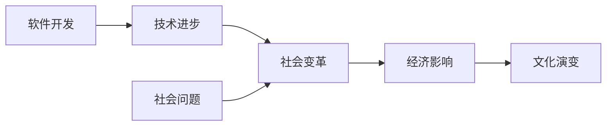

                 

 在当今这个数字时代，软件技术正在深刻地改变我们的生活方式和社会结构。软件 1.0 时代，我们的焦点主要集中在如何开发更高效、更强大的软件系统。然而，随着软件 2.0 时代的到来，我们不仅需要关注技术本身的进步，更需要思考软件对社会、经济和环境的影响。本文将探讨软件 2.0 时代的核心概念、社会责任，以及科技向善的实践路径。

## 1. 背景介绍

软件 2.0 是相对于软件 1.0 时代的一个新概念，它不仅仅强调技术上的突破，更强调软件在服务社会、提升人类福祉方面的作用。软件 1.0 时代，软件开发的目标主要是满足企业内部的业务需求，提升工作效率。而在软件 2.0 时代，软件开发的目标扩展到了更广泛的领域，如医疗、教育、金融等，其核心在于通过软件技术解决社会问题，推动社会进步。

随着互联网的普及和大数据、人工智能等新兴技术的发展，软件 2.0 时代的软件系统越来越复杂，对社会的依赖性也越来越强。这不仅要求软件开发者具备更高的技术能力，更需要他们具备更强的社会责任感。因为软件技术不仅仅是工具，它已经成为了影响社会、经济、文化的重要力量。

## 2. 核心概念与联系

### 2.1 软件技术与社会的关系

软件技术与社会的关系可以用一个简单的 Mermaid 流程图来表示：



在这个流程图中，软件开发（A）推动了技术进步（B），进而引发社会变革（C），影响经济（D）和文化（E）。同时，社会问题（F）也会反过来影响软件开发，推动技术的进步。

### 2.2 软件技术与社会责任的联系

软件技术与社会责任的联系主要体现在以下几个方面：

1. **隐私保护**：随着软件系统的广泛应用，个人隐私的保护变得越来越重要。软件 2.0 时代的软件开发者需要充分考虑用户隐私，确保数据的安全和用户的隐私。

2. **公平性**：软件技术应该服务于所有人，而不是特定群体。软件开发者需要确保软件系统的公平性，避免因技术偏见而导致的社会不公。

3. **可持续性**：软件开发需要考虑对环境的影响，如能源消耗、电子废物等。软件 2.0 时代的软件开发者应该更加注重可持续性，开发绿色软件。

4. **道德伦理**：软件技术的应用需要符合道德伦理标准。软件开发者需要在设计、开发和维护软件过程中，时刻保持道德意识，避免技术滥用。

## 3. 核心算法原理 & 具体操作步骤

### 3.1 算法原理概述

软件 2.0 时代，我们需要关注的核心算法包括但不限于以下几个方面：

1. **机器学习算法**：机器学习算法可以帮助软件系统更好地理解用户需求，提供个性化服务。

2. **区块链技术**：区块链技术可以确保数据的安全性和透明性，为去中心化应用提供支持。

3. **自然语言处理**：自然语言处理技术可以帮助软件系统更好地与人类交互，提高用户体验。

4. **物联网技术**：物联网技术可以将现实世界与数字世界连接起来，推动智能化发展。

### 3.2 算法步骤详解

1. **机器学习算法**：

   - 数据收集：收集用户行为数据、需求数据等。

   - 数据预处理：清洗数据，进行特征提取。

   - 模型训练：选择合适的模型，进行训练。

   - 模型评估：评估模型性能，进行优化。

2. **区块链技术**：

   - 数据存储：将数据存储在区块链上，确保数据的安全性和透明性。

   - 数据共享：允许不同节点之间共享数据，实现去中心化。

   - 智能合约：使用智能合约自动执行合同，减少中介成本。

3. **自然语言处理**：

   - 语言理解：理解用户输入的文本，提取关键词和语义。

   - 语言生成：根据用户需求生成文本，如回复、文章等。

   - 语言交互：与用户进行自然语言交互，提供个性化服务。

4. **物联网技术**：

   - 设备连接：将各种物联网设备连接到网络，实现数据的实时传输。

   - 数据分析：分析设备数据，提供智能决策支持。

   - 设备控制：根据分析结果，控制物联网设备进行相应操作。

### 3.3 算法优缺点

1. **机器学习算法**：

   - 优点：能够根据用户需求提供个性化服务，提高用户体验。

   - 缺点：对数据质量和模型选择要求较高，易受到数据偏见的影响。

2. **区块链技术**：

   - 优点：确保数据的安全性和透明性，为去中心化应用提供支持。

   - 缺点：交易速度较慢，存储空间有限。

3. **自然语言处理**：

   - 优点：能够与人类进行自然语言交互，提高用户体验。

   - 缺点：对语言的理解能力有限，易受到语言偏见的影响。

4. **物联网技术**：

   - 优点：实现现实世界与数字世界的连接，推动智能化发展。

   - 缺点：设备连接和数据传输的安全性问题。

### 3.4 算法应用领域

1. **机器学习算法**：在医疗、金融、零售等领域有广泛应用，如疾病预测、信用评估、个性化推荐等。

2. **区块链技术**：在金融、供应链管理等领域有广泛应用，如数字货币、供应链金融等。

3. **自然语言处理**：在智能客服、智能问答、智能翻译等领域有广泛应用。

4. **物联网技术**：在智能家居、智能交通、智能医疗等领域有广泛应用。

## 4. 数学模型和公式 & 详细讲解 & 举例说明

### 4.1 数学模型构建

在软件 2.0 时代，我们需要构建的数学模型主要包括以下几个方面：

1. **机器学习模型**：如线性回归、逻辑回归、决策树、神经网络等。

2. **区块链模型**：如工作量证明（PoW）、权益证明（PoS）等。

3. **自然语言处理模型**：如词袋模型、循环神经网络（RNN）、变换器（Transformer）等。

4. **物联网模型**：如马尔可夫模型、卡尔曼滤波等。

### 4.2 公式推导过程

以线性回归模型为例，其公式推导过程如下：

1. **假设**：我们假设输入特征向量 $X$ 和输出目标变量 $Y$ 之间存在线性关系，即 $Y = \beta_0 + \beta_1X + \epsilon$。

2. **损失函数**：为了衡量预测值与实际值之间的差距，我们使用均方误差（MSE）作为损失函数，即 $J(\theta) = \frac{1}{2m}\sum_{i=1}^{m}(h_\theta(x^{(i)}) - y^{(i)})^2$，其中 $h_\theta(x) = \theta_0 + \theta_1x$ 是预测函数。

3. **梯度下降**：为了最小化损失函数，我们使用梯度下降算法进行优化。梯度下降的公式为 $\theta_j := \theta_j - \alpha\frac{\partial}{\partial \theta_j}J(\theta)$，其中 $\alpha$ 是学习率。

### 4.3 案例分析与讲解

以线性回归模型在疾病预测中的应用为例，我们构建一个简单的线性回归模型来预测某种疾病的发病率。

1. **数据收集**：收集过去一年的某种疾病的发病数据，包括天气因素（如温度、湿度等）。

2. **数据预处理**：将数据进行归一化处理，提取特征。

3. **模型构建**：构建线性回归模型，选择合适的特征和参数。

4. **模型训练**：使用梯度下降算法训练模型，最小化损失函数。

5. **模型评估**：使用测试集评估模型性能，调整参数。

6. **模型应用**：将训练好的模型应用于实际预测，为疾病预防提供参考。

## 5. 项目实践：代码实例和详细解释说明

### 5.1 开发环境搭建

1. **安装 Python**：在开发环境中安装 Python，版本要求 3.6 以上。

2. **安装相关库**：安装必要的库，如 NumPy、Pandas、Scikit-learn 等。

### 5.2 源代码详细实现

以下是一个简单的线性回归模型的实现：

```python
import numpy as np
import pandas as pd
from sklearn.linear_model import LinearRegression
from sklearn.model_selection import train_test_split

# 数据预处理
data = pd.read_csv('disease_data.csv')
X = data[['temperature', 'humidity']]
y = data['incidence']

# 模型训练
X_train, X_test, y_train, y_test = train_test_split(X, y, test_size=0.2, random_state=42)
model = LinearRegression()
model.fit(X_train, y_train)

# 模型评估
score = model.score(X_test, y_test)
print(f'Model score: {score}')

# 模型应用
X_new = np.array([[25, 60]])
y_pred = model.predict(X_new)
print(f'Predicted incidence: {y_pred[0]}')
```

### 5.3 代码解读与分析

1. **数据预处理**：首先读取数据，将天气因素（温度和湿度）作为输入特征，疾病发病率作为输出目标。

2. **模型训练**：使用 Scikit-learn 库中的 LinearRegression 类构建线性回归模型，并使用梯度下降算法进行训练。

3. **模型评估**：使用测试集评估模型性能，输出模型得分。

4. **模型应用**：使用训练好的模型对新的数据进行预测，输出预测结果。

## 6. 实际应用场景

软件 2.0 时代，软件技术在各个领域都有广泛的应用。以下是一些实际应用场景：

1. **医疗健康**：利用机器学习算法分析患者数据，实现疾病预测和个性化治疗。

2. **金融服务**：利用区块链技术实现去中心化的金融交易，提高交易安全性和透明性。

3. **智能交通**：利用物联网技术实现交通数据的实时监控和智能调度，提高交通效率。

4. **教育科技**：利用自然语言处理技术实现智能问答和个性化学习，提高教学效果。

5. **环境保护**：利用物联网技术监测环境数据，实现环境污染的实时监控和预警。

## 7. 工具和资源推荐

### 7.1 学习资源推荐

1. **《深度学习》**：由 Goodfellow、Bengio 和 Courville 著，是深度学习领域的经典教材。

2. **《区块链技术指南》**：由魏俊宇 著，详细介绍了区块链的原理和应用。

3. **《Python 自然语言处理》**：由 Steven Bird、Ewan Klein 和 Edward Loper 著，是自然语言处理领域的入门经典。

### 7.2 开发工具推荐

1. **PyTorch**：适用于深度学习开发的框架，具有灵活性和高效性。

2. **Ethereum**：适用于区块链应用开发的平台，支持智能合约。

3. **NLTK**：适用于自然语言处理开发的库，提供了丰富的语言处理工具。

### 7.3 相关论文推荐

1. **"Deep Learning for Natural Language Processing"**：由 Ruslan Salakhutdinov 和 Andrew M. Carlile 著，介绍了深度学习在自然语言处理领域的应用。

2. **"Blockchain: A System for Global Inventory Management"**：由 Ian Grigg 和 Andreas M. Antonopoulos 著，详细介绍了区块链的原理和应用。

3. **"Internet of Things: A Survey"**：由 Onur Ergun 和 Volker Markl 著，介绍了物联网的概念、技术和应用。

## 8. 总结：未来发展趋势与挑战

### 8.1 研究成果总结

软件 2.0 时代，我们在人工智能、区块链、物联网等领域取得了显著的成果。这些成果不仅推动了技术的进步，也为解决社会问题提供了有力支持。

### 8.2 未来发展趋势

1. **人工智能技术**：深度学习、强化学习等技术的不断发展，将进一步提升软件系统的智能化水平。

2. **区块链技术**：随着区块链技术的不断完善，其在金融、供应链等领域的应用将更加广泛。

3. **物联网技术**：物联网技术的快速发展，将推动智能城市、智能农业等领域的应用。

### 8.3 面临的挑战

1. **隐私保护**：如何在保证用户隐私的同时，充分利用数据的价值，是一个重要挑战。

2. **算法公平性**：如何避免算法偏见，确保软件系统的公平性，是一个关键问题。

3. **技术伦理**：如何确保软件技术的应用符合道德伦理标准，是一个亟待解决的问题。

### 8.4 研究展望

未来，软件 2.0 时代将更加注重技术与社会的融合，推动科技向善。我们期待在人工智能、区块链、物联网等领域取得更多突破，为人类社会的发展贡献力量。

## 9. 附录：常见问题与解答

### Q：什么是软件 2.0？

A：软件 2.0 是相对于软件 1.0 时代的一个新概念，它强调软件在服务社会、提升人类福祉方面的作用，而不仅仅是技术上的突破。

### Q：软件技术与社会责任有何关系？

A：软件技术与社会责任密切相关。软件开发者需要关注软件对社会、经济和环境的影响，确保软件技术的应用符合道德伦理标准，推动社会进步。

### Q：如何在软件开发中实现科技向善？

A：在软件开发中实现科技向善，可以从以下几个方面入手：

1. **隐私保护**：充分考虑用户隐私，确保数据的安全和用户的隐私。

2. **公平性**：确保软件系统的公平性，避免因技术偏见而导致的社会不公。

3. **可持续性**：开发绿色软件，考虑对环境的影响。

4. **道德伦理**：在软件开发、设计和维护过程中，时刻保持道德意识，避免技术滥用。

---

本文探讨了软件 2.0 时代的核心概念、社会责任以及科技向善的实践路径。随着技术的不断进步，软件技术将在更多领域发挥重要作用，为人类社会的发展贡献力量。然而，我们也需要关注技术带来的挑战，确保软件技术的应用符合道德伦理标准，推动社会进步。

### 作者署名

作者：禅与计算机程序设计艺术 / Zen and the Art of Computer Programming

