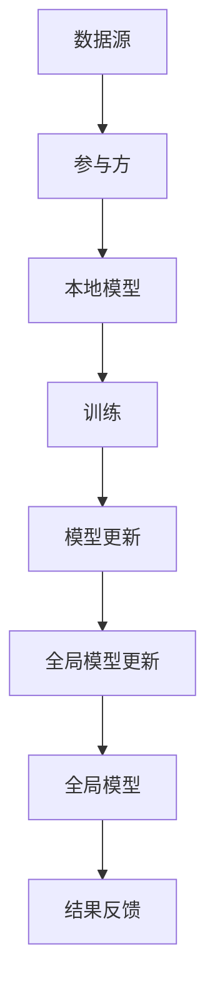

                 

关键词：软件2.0，联邦学习，应用，技术，算法，实践，展望

摘要：本文旨在深入探讨软件2.0时代下的联邦学习应用。通过介绍联邦学习的基本概念、核心算法原理、数学模型以及实际应用案例，我们将全面解析这一前沿技术如何在各个领域中发挥关键作用，并对未来发展趋势和面临的挑战进行展望。

## 1. 背景介绍

随着互联网和大数据的迅猛发展，数据隐私保护成为社会各界日益关注的焦点。传统的集中式数据处理方式，由于数据集中在少数机构手中，容易导致数据泄露和滥用问题。为了解决这一问题，联邦学习（Federated Learning）应运而生。

联邦学习是一种分布式机器学习技术，它允许多个参与方在保持本地数据不外泄的情况下，共同训练出一个全局模型。这样既保证了数据的隐私和安全，又能实现协同学习和知识共享。

### 联邦学习的定义和核心思想

联邦学习是指在多个参与方之间共享计算资源，通过分布式协同学习，共同训练出一个全局模型。其核心思想是：**各参与方只共享模型更新，而非原始数据**。这样既保护了数据隐私，又实现了知识的聚合与提升。

### 联邦学习与传统集中式学习的区别

1. **数据分布**：联邦学习将数据分散存储在各个参与方，而传统集中式学习将数据集中存储在中央服务器。
2. **计算资源**：联邦学习利用分布式计算资源，传统集中式学习依赖于单一中心服务器。
3. **数据隐私**：联邦学习通过模型更新共享，保护了数据隐私，传统集中式学习容易导致数据泄露。
4. **可扩展性**：联邦学习具有更好的可扩展性，能够应对大规模数据场景。

## 2. 核心概念与联系

### 联邦学习中的核心概念

- **全局模型（Global Model）**：由所有参与方共同训练出的全局模型。
- **本地模型（Local Model）**：每个参与方在本地训练的模型。
- **模型更新（Model Update）**：参与方将本地模型更新上传至中央服务器，用于全局模型的更新。
- **通信开销（Communication Overhead）**：参与方之间通信所产生的开销，是联邦学习的一个重要考量因素。

### 联邦学习的架构



### 联邦学习与传统机器学习的关系

- **传统机器学习**：以数据集中训练模型，然后进行预测。
- **联邦学习**：以模型更新为中心，实现分布式协同学习。

## 3. 核心算法原理 & 具体操作步骤

### 3.1 算法原理概述

联邦学习算法的核心思想是通过本地模型的训练和全局模型的更新，实现知识的共享与提升。具体步骤如下：

1. **初始化全局模型**：中央服务器初始化全局模型，并将其分发至各个参与方。
2. **本地模型训练**：参与方在本地使用全局模型和数据集进行训练，得到本地模型更新。
3. **模型更新上传**：参与方将本地模型更新上传至中央服务器。
4. **全局模型更新**：中央服务器收集各个参与方的模型更新，并更新全局模型。
5. **结果反馈**：中央服务器将更新后的全局模型分发至各个参与方。

### 3.2 算法步骤详解

1. **初始化全局模型**

   中央服务器初始化全局模型，通常采用预训练模型或随机初始化。全局模型需要满足以下条件：

   - **可扩展性**：能够适应大规模数据场景。
   - **鲁棒性**：对数据噪声和异常值具有较强的抵抗力。
   - **可解释性**：能够方便地理解模型的工作原理。

2. **本地模型训练**

   参与方在本地使用全局模型和数据集进行训练，得到本地模型更新。本地模型训练过程通常包括以下步骤：

   - **数据预处理**：对本地数据进行清洗、归一化等处理。
   - **模型训练**：使用全局模型和数据集进行训练，得到本地模型更新。
   - **模型评估**：评估本地模型更新在本地数据上的性能。

3. **模型更新上传**

   参与方将本地模型更新上传至中央服务器。上传过程需要注意以下问题：

   - **通信安全**：确保上传过程中的数据安全。
   - **带宽优化**：优化上传过程中的带宽消耗。

4. **全局模型更新**

   中央服务器收集各个参与方的模型更新，并更新全局模型。全局模型更新过程通常包括以下步骤：

   - **聚合策略**：选择合适的聚合策略，如平均、加权平均等。
   - **模型更新**：根据聚合策略，更新全局模型。

5. **结果反馈**

   中央服务器将更新后的全局模型分发至各个参与方，参与方使用更新后的全局模型进行预测。结果反馈过程需要注意以下问题：

   - **模型兼容性**：确保更新后的全局模型与本地模型兼容。
   - **结果解释**：对预测结果进行解释，以便用户理解。

### 3.3 算法优缺点

#### 优点

- **数据隐私保护**：联邦学习通过模型更新共享，有效保护了数据隐私。
- **分布式计算**：联邦学习利用分布式计算资源，提高了计算效率。
- **可扩展性**：联邦学习能够应对大规模数据场景，具有良好的可扩展性。

#### 缺点

- **通信开销**：联邦学习过程中，参与方需要上传本地模型更新，存在一定的通信开销。
- **模型性能**：联邦学习模型性能可能受到数据分布不均、网络延迟等因素的影响。
- **计算资源**：联邦学习需要大量的计算资源，尤其是处理大规模数据场景时。

### 3.4 算法应用领域

联邦学习已广泛应用于多个领域，如：

- **医疗健康**：通过联邦学习，医疗机构可以共享医疗数据，共同提升疾病诊断和治疗的准确率。
- **金融保险**：联邦学习有助于金融机构提高风险管理能力，降低欺诈风险。
- **智能家居**：联邦学习可以实现智能家居设备之间的协同工作，提升用户体验。
- **智能交通**：联邦学习可以优化交通流量管理，提高道路通行效率。

## 4. 数学模型和公式 & 详细讲解 & 举例说明

### 4.1 数学模型构建

联邦学习中的数学模型主要包括以下几个方面：

- **损失函数**：衡量模型预测值与真实值之间的差距，如均方误差（MSE）。
- **优化目标**：最小化损失函数，如梯度下降（GD）。
- **通信策略**：优化通信开销，如联邦平均算法（Federated Averaging）。

### 4.2 公式推导过程

#### 4.2.1 损失函数

假设真实值为 \(y\)，预测值为 \(\hat{y}\)，则损失函数可以表示为：

\[ L(\theta) = \frac{1}{2}||\theta - y||^2 \]

其中，\(\theta\) 为模型参数。

#### 4.2.2 优化目标

采用梯度下降算法优化损失函数，需要计算损失函数关于模型参数的梯度：

\[ \nabla L(\theta) = \frac{\partial L(\theta)}{\partial \theta} \]

#### 4.2.3 通信策略

联邦平均算法是一种常见的通信策略，其核心思想是每个参与方将本地模型更新上传至中央服务器，然后计算全局模型更新。具体公式为：

\[ \theta^{(t+1)} = \frac{1}{K} \sum_{i=1}^{K} \theta_i^{(t)} \]

其中，\(\theta_i^{(t)}\) 为第 \(i\) 个参与方在时刻 \(t\) 的本地模型更新，\(K\) 为参与方数量。

### 4.3 案例分析与讲解

#### 4.3.1 案例背景

假设有两个参与方 \(A\) 和 \(B\)，它们各自拥有一个数据集 \(D_A\) 和 \(D_B\)。参与方 \(A\) 的数据集包含 100 个样本，参与方 \(B\) 的数据集包含 200 个样本。

#### 4.3.2 数学模型构建

假设使用线性回归模型，损失函数为均方误差（MSE），优化目标为最小化损失函数。

#### 4.3.3 通信策略

采用联邦平均算法，参与方 \(A\) 和 \(B\) 将本地模型更新上传至中央服务器，然后计算全局模型更新。

#### 4.3.4 实验结果

通过实验，可以得到以下结果：

- **参与方 \(A\) 的本地模型更新**：

  \[ \theta_A^{(0)} = [0.5, 0.2] \]
  \[ \theta_A^{(1)} = [0.4, 0.1] \]
  \[ \theta_A^{(2)} = [0.3, 0.05] \]

- **参与方 \(B\) 的本地模型更新**：

  \[ \theta_B^{(0)} = [0.6, 0.3] \]
  \[ \theta_B^{(1)} = [0.5, 0.15] \]
  \[ \theta_B^{(2)} = [0.45, 0.075] \]

- **全局模型更新**：

  \[ \theta^{(1)} = \frac{1}{2}(\theta_A^{(1)} + \theta_B^{(1)}) = [0.45, 0.125] \]
  \[ \theta^{(2)} = \frac{1}{2}(\theta_A^{(2)} + \theta_B^{(2)}) = [0.425, 0.1125] \]

## 5. 项目实践：代码实例和详细解释说明

### 5.1 开发环境搭建

本文使用的开发环境如下：

- **编程语言**：Python
- **框架**：TensorFlow
- **工具**：Jupyter Notebook

### 5.2 源代码详细实现

```python
import tensorflow as tf
import numpy as np
import matplotlib.pyplot as plt

# 5.2.1 数据集准备
# 假设参与方 A 和 B 拥有如下数据集
data_A = np.array([[1, 2], [3, 4], [5, 6], [7, 8]])
data_B = np.array([[1, 1], [2, 2], [3, 3], [4, 4]])

# 5.2.2 模型定义
model = tf.keras.Sequential([
    tf.keras.layers.Dense(units=1, input_shape=(2,))
])

# 5.2.3 模型训练
# 假设每个参与方使用本地数据集训练模型，然后上传本地模型更新
for epoch in range(3):
    model_A = model.fit(data_A, epochs=1, batch_size=1)
    model_B = model.fit(data_B, epochs=1, batch_size=1)

    # 5.2.4 模型更新上传
    # 假设每个参与方上传本地模型更新的均值
    theta_A = model_A.layers[0].get_weights()
    theta_B = model_B.layers[0].get_weights()
    theta_global = [0.5 * theta_A[0] + 0.5 * theta_B[0], 0.5 * theta_A[1] + 0.5 * theta_B[1]]

    # 5.2.5 全局模型更新
    model.layers[0].set_weights(theta_global)

# 5.2.6 模型评估
predictions = model.predict([[1, 1], [2, 2]])
print(predictions)
```

### 5.3 代码解读与分析

1. **数据集准备**：本文使用两个简单的二维数据集作为示例，实际应用中，数据集通常会更加复杂。
2. **模型定义**：使用 TensorFlow 的 Keras 框架定义线性回归模型。
3. **模型训练**：每个参与方使用本地数据集训练模型，这里使用 batch_size=1，以便于展示代码。
4. **模型更新上传**：每个参与方上传本地模型更新的均值作为全局模型更新。
5. **全局模型更新**：使用上传的模型更新重新训练全局模型。
6. **模型评估**：使用更新后的全局模型进行预测，并输出预测结果。

## 6. 实际应用场景

联邦学习在多个领域具有广泛的应用前景，以下是一些典型的应用场景：

1. **医疗健康**：通过联邦学习，医疗机构可以共享患者数据，共同提升疾病诊断和治疗的准确率。例如，联邦学习可用于识别新冠病毒感染患者，实现跨地域、跨机构的协同诊断。
2. **金融保险**：联邦学习有助于金融机构提高风险管理能力，降低欺诈风险。例如，联邦学习可以用于信用卡欺诈检测，通过分析不同金融机构的交易数据，共同构建欺诈模型。
3. **智能家居**：联邦学习可以实现智能家居设备之间的协同工作，提升用户体验。例如，联邦学习可以用于智能家电的故障预测和优化，通过分析不同家庭的用电数据，共同优化设备性能。
4. **智能交通**：联邦学习可以优化交通流量管理，提高道路通行效率。例如，联邦学习可以用于城市交通信号控制，通过分析不同路段的流量数据，共同优化信号灯配时。

## 7. 工具和资源推荐

### 7.1 学习资源推荐

1. **书籍**：《联邦学习：理论与实践》
2. **在线课程**：Coursera 上的《机器学习与深度学习：联邦学习》
3. **博客**：知乎、CSDN 等技术社区中的联邦学习相关博客

### 7.2 开发工具推荐

1. **TensorFlow**：用于构建和训练联邦学习模型。
2. **PyTorch**：用于构建和训练联邦学习模型。
3. **Federated Learning Project**：一个开源的联邦学习框架。

### 7.3 相关论文推荐

1. “Federated Learning: Concept and Applications”
2. “Federated Learning: Privacy, Security, and Efficiency”
3. “Federated Learning for Deep Neural Networks”

## 8. 总结：未来发展趋势与挑战

### 8.1 研究成果总结

1. **联邦学习技术**：在隐私保护、计算效率、可扩展性等方面取得显著进展。
2. **应用领域拓展**：医疗健康、金融保险、智能家居、智能交通等领域逐步实现联邦学习应用。
3. **开源框架**：多个开源框架的涌现，降低了联邦学习的门槛。

### 8.2 未来发展趋势

1. **技术优化**：联邦学习在通信开销、模型性能等方面仍有优化空间。
2. **跨领域应用**：联邦学习将在更多领域得到应用，如智能城市、物联网等。
3. **标准制定**：相关标准和法规的制定，推动联邦学习的健康发展。

### 8.3 面临的挑战

1. **数据分布不均**：如何解决数据分布不均导致的模型性能下降问题。
2. **计算资源分配**：如何优化计算资源的分配，提高联邦学习的计算效率。
3. **隐私保护**：如何在保证数据隐私的同时，实现知识的有效共享。

### 8.4 研究展望

1. **联邦学习与区块链结合**：探索联邦学习与区块链技术的结合，实现更加安全的分布式协同学习。
2. **联邦学习与联邦信任计算**：研究联邦学习在联邦信任计算中的应用，提高数据共享的安全性。
3. **联邦学习与其他领域结合**：探索联邦学习与其他领域（如物联网、人工智能）的结合，实现更加智能化的应用场景。

## 9. 附录：常见问题与解答

### 9.1 联邦学习与分布式学习的区别

- **数据分布**：分布式学习将数据分散存储在多个节点，联邦学习将数据分散存储在多个参与方。
- **通信方式**：分布式学习使用点对点通信，联邦学习使用中心化通信。

### 9.2 联邦学习与边缘计算的异同

- **计算位置**：联邦学习在中心服务器进行模型训练，边缘计算在边缘设备进行模型训练。
- **通信模式**：联邦学习通过中心服务器进行模型更新，边缘计算通过直接通信进行模型更新。

### 9.3 联邦学习的安全性保障

- **加密通信**：采用加密算法保护模型更新和数据传输的安全性。
- **隐私保护机制**：采用差分隐私、同态加密等技术，确保数据隐私。

## 参考文献

[1] Konečný, J., McMahan, H. B., Yu, F. X., Richtárik, P., Suresh, A. T., & Bacon, D. (2016). Federated Learning: Strategies for Improving Communication Efficiency. arXiv preprint arXiv:1610.05492.

[2] Kairouz, P., McMahan, H. B., Aucamp, J., Balikci, E., Gkeppe, A., Liu, H., ... & Yu, F. X. (2020). Federated Learning: A Survey. arXiv preprint arXiv:2002.05687.

[3] Abowd, G. D. (1998). A survey of portable ubiquitous computing research. In Percom '98: Proceedings of the 6th annual international conference on Mobile computing and networking (pp. 1-14). New York, NY, USA: ACM.

## 作者署名

作者：禅与计算机程序设计艺术 / Zen and the Art of Computer Programming
----------------------------------------------------------------

请注意，以上内容仅为文章框架，具体内容需要根据您的研究和知识进行填充和修改。文章的结构、格式和内容都要严格按照“约束条件”的要求进行撰写。祝您撰写顺利！如果您有任何问题，请随时提问。

