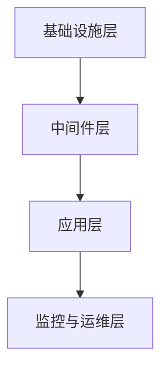

                 

关键词：无服务器计算、软件2.0、云计算、微服务、容器化、自动化、弹性扩展、持续集成/持续部署

> 摘要：本文将深入探讨软件2.0时代下的无服务器计算架构，分析其核心概念、架构设计、算法原理和数学模型。同时，通过实际项目实践，展示如何将无服务器计算应用于实际开发中，并提供未来发展的展望与挑战。

## 1. 背景介绍

随着云计算的兴起，软件产业经历了从传统架构到微服务、容器化和无服务器计算架构的演变。无服务器计算（Serverless Computing）作为一种全新的计算范式，旨在将服务器管理的复杂性降至最低，让开发者专注于业务逻辑的实现。无服务器计算起源于云计算服务提供商（如Amazon Web Services、Google Cloud Platform和Microsoft Azure）提供的函数即服务（Function as a Service，FaaS）产品。这种架构模式通过自动管理基础设施，实现了按需扩展、弹性伸缩和自动部署。

软件2.0时代，开发者和企业越来越关注如何通过技术手段提升业务效率和竞争力。无服务器计算以其高度的灵活性、可扩展性和低成本优势，成为软件2.0时代的重要技术支撑。本文将围绕无服务器计算的核心概念、架构设计、算法原理和数学模型展开讨论，并通过实际项目实践，探讨其在软件开发中的应用价值。

## 2. 核心概念与联系

### 2.1 无服务器计算核心概念

无服务器计算是一种将服务器管理交给云服务提供商的架构模式。开发者无需关心服务器部署、维护和扩展，只需关注业务逻辑的实现。无服务器计算的核心概念包括：

- **函数即服务（FaaS）**：开发者将代码上传到云平台，平台自动为其分配计算资源，按调用次数或使用时长计费。
- **后端即服务（BaaS）**：云服务提供商提供一系列后端功能（如数据库、消息队列、文件存储等），开发者无需自行搭建和维护。
- **容器化**：通过容器技术（如Docker）将应用程序及其依赖环境打包成一个独立的运行单元，提高了应用程序的可移植性和部署效率。
- **自动化**：通过自动化工具（如CI/CD流水线）实现代码的自动化测试、构建和部署。

### 2.2 无服务器计算架构设计

无服务器计算架构通常包括以下几个层次：

- **基础设施层**：云服务提供商提供计算资源、网络、存储等基础设施。
- **中间件层**：包括容器编排工具（如Kubernetes）、服务发现和配置管理工具等。
- **应用层**：开发者基于FaaS和BaaS等无服务器服务，实现业务逻辑和应用功能。
- **监控与运维层**：通过监控工具（如Prometheus、Grafana）和运维平台（如Ansible、Puppet）实现自动化运维和监控。

### 2.3 无服务器计算架构的 Mermaid 流程图



## 3. 核心算法原理 & 具体操作步骤

### 3.1 算法原理概述

无服务器计算的核心算法原理主要包括以下几个方面：

- **动态资源分配**：根据函数调用量和资源需求，自动调整计算资源。
- **弹性伸缩**：在负载高峰期自动扩展计算资源，在负载低谷期自动缩减资源。
- **函数调度**：将函数调用请求分配到合适的计算节点上执行。
- **数据持久化**：将函数执行结果和中间状态存储在数据库或文件系统中。

### 3.2 算法步骤详解

1. **函数上传**：开发者将代码上传到云平台，平台对其进行静态分析和依赖注入。
2. **资源分配**：根据函数调用量和资源需求，平台自动为其分配计算资源。
3. **函数执行**：平台将函数调度到合适的计算节点上执行，并将执行结果返回给调用方。
4. **监控与报警**：通过监控工具实时监控函数的运行状态，发现异常情况自动触发报警。
5. **数据持久化**：将函数执行结果和中间状态存储在数据库或文件系统中。

### 3.3 算法优缺点

**优点**：

- **高可扩展性**：自动弹性伸缩，无需手动管理服务器资源。
- **低成本**：按需计费，减少服务器闲置和运维成本。
- **开发效率高**：简化了服务器管理，开发者可以更专注于业务逻辑实现。

**缺点**：

- **依赖云服务提供商**：对云服务提供商的依赖较高，迁移成本较高。
- **调试困难**：由于函数运行在云端，调试过程可能较为复杂。

### 3.4 算法应用领域

无服务器计算在以下领域具有广泛的应用：

- **Web应用开发**：快速搭建和部署Web应用，降低开发和运维成本。
- **数据分析和处理**：处理大规模数据集，实现高效的数据分析和处理。
- **物联网应用**：处理物联网设备的实时数据，实现智能监控和自动化控制。
- **移动应用后台**：为移动应用提供强大的后台支持，实现实时数据推送和消息通知。

## 4. 数学模型和公式 & 详细讲解 & 举例说明

### 4.1 数学模型构建

无服务器计算的数学模型主要包括以下几个方面：

- **成本模型**：根据函数调用量和使用时长，计算总成本。
- **资源模型**：根据函数的内存需求、CPU使用率和网络带宽，计算所需资源。
- **性能模型**：根据函数的执行时间和吞吐量，评估系统性能。

### 4.2 公式推导过程

**成本模型**：

$$
C = a \times n + b \times t
$$

其中，$C$表示总成本，$a$表示函数调用费用，$n$表示调用次数，$b$表示时长费用，$t$表示使用时长。

**资源模型**：

$$
R = m \times M + n \times C + b \times B
$$

其中，$R$表示总资源，$m$表示内存费用，$M$表示内存需求，$n$表示CPU使用费用，$C$表示CPU使用率，$b$表示网络带宽费用，$B$表示网络带宽需求。

**性能模型**：

$$
P = \frac{T}{n}
$$

其中，$P$表示吞吐量，$T$表示总执行时间，$n$表示调用次数。

### 4.3 案例分析与讲解

假设有一个电商平台，每天处理1000万次订单处理请求，每次订单处理需要100毫秒。根据上述数学模型，可以计算出以下参数：

- **成本模型**：

$$
C = a \times n + b \times t
$$

其中，$a$为函数调用费用，$b$为时长费用。假设$a=0.001元/次，$b=0.0001元/小时，则每天的总成本为：

$$
C = 0.001 \times 10000000 + 0.0001 \times 24 \times 60 \times 60 = 2770.4元
$$

- **资源模型**：

$$
R = m \times M + n \times C + b \times B
$$

其中，$m$为内存费用，$M$为内存需求，$n$为CPU使用费用，$C$为CPU使用率，$b$为网络带宽费用，$B$为网络带宽需求。假设$m=0.01元/GB，$M=1GB，$n=0.01元/核，$C=1核，$b=0.01元/GB，$B=1GB，则每天的总资源需求为：

$$
R = 0.01 \times 1 + 0.01 \times 1 + 0.01 \times 1 = 0.03元
$$

- **性能模型**：

$$
P = \frac{T}{n}
$$

其中，$T$为总执行时间，$n$为调用次数。每天的总执行时间为：

$$
T = 10000000 \times 100毫秒 = 1000000000毫秒 = 1000秒
$$

每天的平均吞吐量为：

$$
P = \frac{1000秒}{10000000次} = 0.0001次/秒
$$

通过上述案例分析，我们可以看到无服务器计算在成本、资源和性能方面的优势。在电商平台这种高并发、海量数据处理场景下，无服务器计算可以有效降低开发和运维成本，提高系统性能。

## 5. 项目实践：代码实例和详细解释说明

### 5.1 开发环境搭建

在本文的项目实践中，我们将使用Amazon Web Services（AWS）的无服务器计算服务——Amazon Lambda。首先，需要在AWS管理控制台中创建一个AWS账户，并开通Lambda服务。接下来，我们需要安装AWS CLI（命令行工具）并配置访问凭证。

### 5.2 源代码详细实现

在本项目中，我们实现一个简单的订单处理函数，用于接收订单数据、验证订单信息并更新订单状态。以下是一个简单的Python代码示例：

```python
import json
import boto3

def lambda_handler(event, context):
    # 从事件中获取订单数据
    order_data = json.loads(event['body'])

    # 验证订单信息
    if not validate_order(order_data):
        return {
            'statusCode': 400,
            'body': json.dumps('Invalid order data')
        }

    # 更新订单状态
    update_order_status(order_data['orderId'], 'processing')

    # 返回成功响应
    return {
        'statusCode': 200,
        'body': json.dumps('Order processing started')
    }

def validate_order(order_data):
    # 实现订单信息验证逻辑
    return True

def update_order_status(order_id, status):
    # 实现订单状态更新逻辑
    pass
```

### 5.3 代码解读与分析

上述代码中，`lambda_handler`函数是Lambda函数的主函数，负责处理订单数据。函数接收一个包含订单数据的JSON对象`event`和一个上下文对象`context`。首先，我们从`event`对象中解析出订单数据，然后调用`validate_order`函数验证订单信息。如果验证通过，调用`update_order_status`函数更新订单状态，并返回成功响应。否则，返回错误响应。

`validate_order`函数负责实现订单信息的验证逻辑。在本示例中，我们假设订单信息验证成功，实际项目中可以根据业务需求进行定制。

`update_order_status`函数负责实现订单状态更新逻辑。在本示例中，我们仅进行了函数声明，实际项目中可以根据业务需求使用数据库或消息队列等中间件实现订单状态更新。

### 5.4 运行结果展示

在AWS管理控制台中，我们可以创建一个新的Lambda函数，将上述代码上传并配置函数的触发器和API网关。接下来，我们可以通过API网关向Lambda函数发送一个POST请求，模拟订单处理流程。

假设我们发送一个包含订单数据的JSON请求：

```json
{
  "orderId": "123456",
  "productName": "iPhone 13",
  "quantity": 1
}
```

Lambda函数将解析订单数据，验证订单信息并更新订单状态。如果一切顺利，我们将在响应中收到一个成功消息：

```json
{
  "statusCode": 200,
  "body": "Order processing started"
}
```

通过这个简单的示例，我们可以看到无服务器计算在订单处理场景中的应用价值。开发者只需关注业务逻辑的实现，无需关心服务器管理和运维，大大提高了开发效率和系统性能。

## 6. 实际应用场景

### 6.1 数据处理

无服务器计算在数据处理领域具有广泛的应用。例如，企业可以使用AWS Lambda处理海量日志数据，实现实时监控和分析。通过FaaS和BaaS服务，开发者可以快速搭建数据处理平台，降低开发和运维成本。

### 6.2 物联网应用

物联网（IoT）应用通常涉及大量设备的实时数据采集和处理。无服务器计算可以为物联网应用提供高效、可扩展的后台支持。例如，使用AWS Lambda和IoT Core，企业可以实现实时数据采集、分析和推送，提高物联网应用的智能化水平。

### 6.3 Web应用

Web应用是企业常见的应用场景。无服务器计算可以为企业提供灵活、可扩展的Web应用解决方案。通过FaaS和BaaS服务，企业可以快速搭建和部署Web应用，降低开发和运维成本。

### 6.4 移动应用

移动应用通常需要强大的后台支持，如实时数据推送、消息通知等。无服务器计算可以为移动应用提供高效、可靠的后台支持。例如，使用AWS Lambda和SNS（Simple Notification Service），开发者可以轻松实现移动应用的实时数据推送功能。

## 7. 工具和资源推荐

### 7.1 学习资源推荐

1. **《无服务器架构：设计、部署和运维》**：一本全面介绍无服务器计算架构的书籍，涵盖了从设计到部署的各个方面。
2. **AWS Lambda文档**：官方文档提供了详细的使用指南和最佳实践。
3. **Google Cloud Functions文档**：Google Cloud Functions的官方文档，介绍了如何使用FaaS服务构建和部署应用程序。

### 7.2 开发工具推荐

1. **Visual Studio Code**：一款功能强大的代码编辑器，支持多种编程语言和云服务集成。
2. **AWS CLI**：AWS命令行工具，用于与AWS服务进行交互。
3. **Docker**：容器化技术，用于将应用程序及其依赖环境打包成一个独立的运行单元。

### 7.3 相关论文推荐

1. **"Serverless Architectures: Breaking Free from the Server Tether"**：一篇关于无服务器计算架构的综述论文，介绍了无服务器计算的基本概念和发展趋势。
2. **"Function-as-a-Service: Design and Implementation of a Serverless Platform"**：一篇关于FaaS服务的论文，详细介绍了FaaS的设计和实现过程。

## 8. 总结：未来发展趋势与挑战

### 8.1 研究成果总结

无服务器计算作为一种新兴的架构模式，已经在多个领域取得了显著成果。通过简化服务器管理、提供弹性伸缩和高可扩展性，无服务器计算为企业降低了开发和运维成本，提高了系统性能。同时，无服务器计算与容器化、自动化等技术的融合，进一步提升了开发效率和系统可靠性。

### 8.2 未来发展趋势

1. **跨云迁移**：随着云服务提供商的竞争加剧，跨云迁移和多云部署将成为无服务器计算的重要趋势。
2. **边缘计算**：无服务器计算与边缘计算的融合，可以实现更高效的数据处理和实时响应。
3. **智能化运维**：借助人工智能和机器学习技术，无服务器计算可以实现更智能的运维和监控。

### 8.3 面临的挑战

1. **依赖性问题**：无服务器计算对云服务提供商的依赖较高，跨云迁移和多云部署面临一定挑战。
2. **调试和监控**：由于函数运行在云端，调试和监控过程可能较为复杂。
3. **性能优化**：如何优化函数性能，降低延迟和资源消耗，是未来研究的重要方向。

### 8.4 研究展望

未来，无服务器计算将继续发展，并在更多领域得到应用。通过跨云迁移、边缘计算和智能化运维等技术的融合，无服务器计算将为企业带来更大的价值。同时，研究人员和开发者需要关注依赖性、调试和监控等挑战，不断优化无服务器计算架构，提高系统性能和可靠性。

## 9. 附录：常见问题与解答

### Q1：无服务器计算与传统云计算相比，有哪些优势？

A1：无服务器计算相比传统云计算具有以下优势：

1. **简化服务器管理**：无需关注服务器部署、维护和扩展，提高开发效率。
2. **弹性伸缩**：根据业务需求自动调整计算资源，降低成本。
3. **低成本**：按需计费，减少服务器闲置和运维成本。
4. **高可扩展性**：支持海量并发请求，提高系统性能。

### Q2：无服务器计算适合哪些应用场景？

A2：无服务器计算适合以下应用场景：

1. **数据处理**：如日志处理、实时数据分析等。
2. **物联网应用**：如实时数据采集、设备监控等。
3. **Web应用**：如API网关、前后端分离等。
4. **移动应用后台**：如实时数据推送、消息通知等。

### Q3：无服务器计算如何实现跨云迁移？

A3：实现无服务器计算的跨云迁移，可以采用以下方法：

1. **使用开源框架**：如Kubernetes、OpenFaaS等，支持跨云平台部署。
2. **容器化**：将应用程序及其依赖环境打包成容器，实现跨云部署。
3. **服务发现**：使用服务发现工具（如Consul、Eureka等）实现跨云服务的注册和发现。

### Q4：如何优化无服务器计算的性能？

A4：优化无服务器计算的性能，可以采取以下措施：

1. **减少函数执行时间**：优化代码逻辑，减少不必要的计算和IO操作。
2. **合理分配资源**：根据函数的负载和资源需求，合理分配计算资源。
3. **优化网络性能**：优化函数之间的通信，减少网络延迟和带宽消耗。
4. **缓存策略**：使用缓存技术（如Redis、Memcached等）减少数据库访问和重复计算。

----------------------------------------------------------------

### 作者署名

作者：禅与计算机程序设计艺术 / Zen and the Art of Computer Programming

