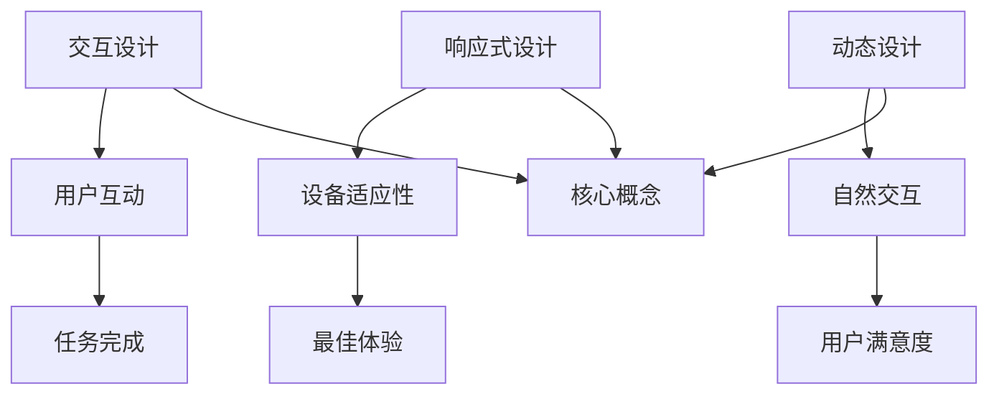

                 

关键词：软件2.0、用户界面设计、用户体验、交互设计、响应式设计、动态设计

> 摘要：随着软件技术的不断进步，软件2.0时代已经到来。本文将深入探讨软件2.0的用户界面设计原则，包括交互设计、响应式设计、动态设计等，旨在为开发者提供有效的用户界面设计指南，从而提升用户体验，实现软件产品的成功。

## 1. 背景介绍

软件2.0是一个全新的软件时代，它标志着软件从传统的功能驱动模式向用户驱动模式转变。在这一时代，用户需求成为驱动软件设计和开发的核心，用户界面设计的重要性也因此愈发突出。一个优秀的用户界面不仅能提升用户体验，还能增加用户粘性，从而为软件产品带来商业成功。

用户界面设计原则是软件2.0时代的关键要素之一。这些原则包括但不限于交互设计、响应式设计、动态设计等。交互设计关注用户与软件的互动方式，响应式设计强调软件在不同设备上的适应性，动态设计则致力于为用户提供更加自然、流畅的体验。

本文将详细探讨这些用户界面设计原则，通过实例和案例分析，帮助开发者更好地理解和应用这些原则，从而提升软件产品的竞争力。

## 2. 核心概念与联系

为了深入理解软件2.0的用户界面设计原则，我们需要了解一些核心概念和它们之间的联系。

### 2.1. 交互设计（Interaction Design）

交互设计是用户界面设计的重要组成部分，它关注用户与软件的互动方式。一个良好的交互设计应该让用户能够轻松、高效地完成任务，同时提供直观、自然的操作体验。

### 2.2. 响应式设计（Responsive Design）

响应式设计是指软件能够根据不同设备（如手机、平板、电脑等）的屏幕尺寸和分辨率，自动调整界面布局和内容，以提供最佳的用户体验。这种设计方法不仅能够提高用户满意度，还能扩大软件的受众范围。

### 2.3. 动态设计（Dynamic Design）

动态设计旨在为用户提供更加自然、流畅的交互体验。它通过动态调整界面元素的大小、颜色、位置等属性，模拟现实世界中的互动过程，从而提升用户的沉浸感和满意度。

### 2.4. Mermaid 流程图

为了更好地理解这些核心概念和它们之间的联系，我们可以使用Mermaid流程图来展示它们的关系。以下是示例流程图：



## 3. 核心算法原理 & 具体操作步骤

### 3.1. 算法原理概述

用户界面设计的核心算法主要涉及以下几个方面：

1. **交互设计算法**：通过分析用户行为和需求，设计出符合用户习惯的交互方式。
2. **响应式设计算法**：根据设备尺寸和分辨率，动态调整界面布局和内容。
3. **动态设计算法**：通过实时调整界面元素属性，模拟现实世界的交互过程。

### 3.2. 算法步骤详解

1. **交互设计算法**

   - **步骤1**：收集用户需求和行为数据。
   - **步骤2**：分析用户行为，确定主要任务和操作流程。
   - **步骤3**：设计交互界面，包括按钮、菜单、图标等。
   - **步骤4**：测试交互设计，收集用户反馈，进行迭代优化。

2. **响应式设计算法**

   - **步骤1**：确定目标设备列表，包括手机、平板、电脑等。
   - **步骤2**：为每种设备设计不同的界面布局和内容。
   - **步骤3**：使用CSS媒体查询，根据设备尺寸和分辨率自动切换界面。
   - **步骤4**：测试响应式设计，确保在不同设备上都能提供最佳用户体验。

3. **动态设计算法**

   - **步骤1**：确定动态交互的关键场景，如页面加载、数据更新等。
   - **步骤2**：设计动态交互效果，如渐变、缩放、旋转等。
   - **步骤3**：使用JavaScript或CSS实现动态交互效果。
   - **步骤4**：测试动态设计，确保交互效果自然、流畅。

### 3.3. 算法优缺点

1. **交互设计算法**

   - **优点**：能够根据用户需求和行为数据，设计出更加符合用户习惯的交互方式。
   - **缺点**：设计过程复杂，需要大量时间和资源。

2. **响应式设计算法**

   - **优点**：能够提高软件的受众范围，增强用户体验。
   - **缺点**：需要为不同设备设计不同的界面布局和内容，增加了开发成本。

3. **动态设计算法**

   - **优点**：能够提升用户的沉浸感和满意度。
   - **缺点**：实现复杂，对开发技能要求较高。

### 3.4. 算法应用领域

1. **交互设计算法**：广泛应用于各种类型的软件，如网站、移动应用、桌面应用等。

2. **响应式设计算法**：主要用于移动应用和响应式网页设计。

3. **动态设计算法**：主要应用于需要提供丰富交互体验的软件，如游戏、虚拟现实等。

## 4. 数学模型和公式 & 详细讲解 & 举例说明

### 4.1. 数学模型构建

用户界面设计中的数学模型主要包括以下方面：

1. **交互设计模型**：基于用户行为和需求的数学模型，用于分析用户操作习惯和设计交互界面。
2. **响应式设计模型**：基于设备尺寸和分辨率的数学模型，用于计算界面布局和内容在不同设备上的适应性。
3. **动态设计模型**：基于动态交互效果的数学模型，用于模拟用户与软件的实时互动。

### 4.2. 公式推导过程

1. **交互设计模型**

   设用户A在交互过程中进行了n次操作，其中成功操作为x次，失败操作为y次，则用户满意度S可以表示为：

   $$ S = \frac{x}{n+y} $$

   该公式表示用户满意度与成功操作次数成正比，与失败操作次数成反比。

2. **响应式设计模型**

   设设备A的屏幕宽度为w，屏幕高度为h，界面布局宽度为L，界面布局高度为H，则界面布局的适应性系数R可以表示为：

   $$ R = \frac{L \times H}{w \times h} $$

   该公式表示界面布局的适应性与屏幕尺寸和界面尺寸的乘积成正比。

3. **动态设计模型**

   设动态交互效果A的时间间隔为t，动画效果时长为T，动画效果强度为I，则用户满意度U可以表示为：

   $$ U = \frac{T}{t+T} \times I $$

   该公式表示用户满意度与动画效果时长和强度的乘积成正比，与时间间隔成反比。

### 4.3. 案例分析与讲解

1. **交互设计案例**

   假设一个移动应用的用户在交互过程中进行了10次操作，其中成功操作6次，失败操作4次。根据交互设计模型，用户满意度S为：

   $$ S = \frac{6}{10+4} = 0.5 $$

   这意味着用户对该应用的满意度为50%。

2. **响应式设计案例**

   假设一个网页的界面布局宽度为800像素，高度为600像素，目标设备的屏幕宽度为400像素，屏幕高度为300像素。根据响应式设计模型，界面布局的适应性系数R为：

   $$ R = \frac{800 \times 600}{400 \times 300} = 2 $$

   这意味着界面布局能够适应目标设备，提供良好的用户体验。

3. **动态设计案例**

   假设一个网页的动态交互效果时长为5秒，动画效果强度为0.8，时间间隔为10秒。根据动态设计模型，用户满意度U为：

   $$ U = \frac{5}{10+5} \times 0.8 = 0.4 $$

   这意味着用户对该网页的动态交互效果的满意度为40%。

## 5. 项目实践：代码实例和详细解释说明

### 5.1. 开发环境搭建

在本节中，我们将使用HTML、CSS和JavaScript搭建一个简单的用户界面，演示响应式设计和动态设计的基本原理。

1. **安装环境**：确保您的电脑上已安装了最新的Chrome浏览器或Firefox浏览器，用于演示网页效果。
2. **创建文件**：创建一个名为`index.html`的HTML文件，一个名为`styles.css`的CSS文件和一个名为`script.js`的JavaScript文件。

### 5.2. 源代码详细实现

**index.html**：

```html
<!DOCTYPE html>
<html lang="en">
<head>
    <meta charset="UTF-8">
    <meta name="viewport" content="width=device-width, initial-scale=1.0">
    <title>用户界面设计实践</title>
    <link rel="stylesheet" href="styles.css">
</head>
<body>
    <div class="container">
        <h1>欢迎来到用户界面设计实践</h1>
        <p>这是一个简单的示例，演示了响应式设计和动态设计。</p>
        <button id="button">点击我</button>
    </div>
    <script src="script.js"></script>
</body>
</html>
```

**styles.css**：

```css
body {
    font-family: Arial, sans-serif;
    text-align: center;
    background-color: #f0f0f0;
}

.container {
    max-width: 800px;
    margin: 0 auto;
    padding: 20px;
    background-color: #fff;
}

button {
    background-color: #4CAF50;
    color: white;
    padding: 15px 32px;
    text-align: center;
    text-decoration: none;
    display: inline-block;
    font-size: 16px;
    margin: 4px 2px;
    cursor: pointer;
    transition: background-color 0.3s;
}

button:hover {
    background-color: #45a049;
}
```

**script.js**：

```javascript
document.getElementById("button").addEventListener("click", function() {
    var button = document.getElementById("button");
    button.style.backgroundColor = "red";
    button.style.color = "white";
    setTimeout(function() {
        button.style.backgroundColor = "green";
        button.style.color = "black";
    }, 1000);
});
```

### 5.3. 代码解读与分析

1. **index.html**：这是HTML文件的主体部分，包括`<head>`和`<body>`两个部分。`<head>`部分包含了网页的元数据，如字符集、标题和CSS链接。`<body>`部分包含了网页的主体内容，包括一个标题、一段文本和一个按钮。

2. **styles.css**：这是CSS文件的主体部分，用于定义网页的样式。`body`和`.container`类定义了整个网页和页面容器的样式。`button`类定义了按钮的默认样式，而`:hover`伪类定义了按钮在鼠标悬停时的样式。`transition`属性为按钮的背景色变化提供了平滑过渡效果。

3. **script.js**：这是JavaScript文件的主体部分，用于定义按钮的动态交互效果。当用户点击按钮时，`addEventListener`方法会被触发，将按钮的背景色和文字颜色动态改变。`setTimeout`函数用于实现背景色和文字颜色的切换效果。

### 5.4. 运行结果展示

在Chrome浏览器中打开`index.html`文件，可以看到以下结果：

1. **初始状态**：网页显示一个标题、一段文本和一个按钮。按钮的背景色为绿色，文字颜色为白色。
2. **点击按钮**：当用户点击按钮时，按钮的背景色会变为红色，文字颜色变为白色。
3. **延迟效果**：经过1秒的延迟后，按钮的背景色会再次变为绿色，文字颜色变为黑色。

通过这个简单的示例，我们可以看到如何使用HTML、CSS和JavaScript实现响应式设计和动态设计的基本原理。

## 6. 实际应用场景

用户界面设计原则在实际应用场景中具有广泛的应用，以下是几个典型场景：

### 6.1. 移动应用

随着智能手机的普及，移动应用成为人们日常生活不可或缺的一部分。在移动应用中，响应式设计和动态设计尤为重要。通过响应式设计，应用能够自动适应不同尺寸的屏幕，为用户提供一致的用户体验。动态设计则可以为用户提供更加丰富、自然的交互体验，增加应用的吸引力。

### 6.2. 响应式网页设计

随着移动设备的普及，越来越多的网站需要支持多种设备。响应式网页设计成为网页设计师必须掌握的技能。通过响应式设计，网站能够根据不同设备的屏幕尺寸和分辨率，自动调整布局和内容，为用户提供最佳体验。

### 6.3. 智能家居

智能家居市场逐渐兴起，用户界面设计原则在智能家居产品中同样具有重要的应用。在智能家居系统中，用户界面设计需要考虑如何为用户提供简单、直观的操作方式，同时实现设备之间的互联互通。响应式设计和动态设计可以提升用户对智能家居产品的满意度。

### 6.4. 未来应用展望

随着技术的不断发展，用户界面设计原则在未来将面临更多的挑战和机遇。例如，虚拟现实和增强现实技术的发展，将带来全新的交互方式。用户界面设计需要不断适应这些变化，为用户提供更加自然、流畅的体验。同时，人工智能技术的应用也将进一步改变用户界面设计的方法和原则，为开发者提供更多创新的工具和手段。

## 7. 工具和资源推荐

为了帮助开发者更好地理解和应用用户界面设计原则，以下是一些推荐的工具和资源：

### 7.1. 学习资源推荐

1. **《交互设计实战》**：作者：Dan Saffer。这本书详细介绍了交互设计的原理和实践方法，适合初学者和有经验的设计师。
2. **《响应式网页设计》**：作者：Ben Frain。这本书深入讲解了响应式网页设计的技术和策略，包括媒体查询、Flexbox、Grid系统等。
3. **《动态界面设计：代码实现交互式网页》**：作者：Rachel Andrew。这本书涵盖了动态设计的基本原理和实际操作方法，包括CSS动画、JavaScript交互等。

### 7.2. 开发工具推荐

1. **Sketch**：一款流行的设计工具，用于创建高质量的UI设计原型。
2. **Adobe XD**：一款强大的用户体验设计工具，支持响应式设计、动态交互等高级功能。
3. **Figma**：一款基于网页的设计协作工具，支持多人实时协作，适用于UI设计、用户体验设计等。

### 7.3. 相关论文推荐

1. **《用户体验要素》**：作者：Jakob Nielsen。这篇文章详细分析了用户体验的核心要素，对用户界面设计具有重要的指导意义。
2. **《响应式网页设计：10年后的回顾》**：作者：A List Apart。这篇文章回顾了响应式网页设计的发展历程，探讨了未来发展趋势。
3. **《动态界面设计：从概念到实践》**：作者：Web Design Ledger。这篇文章介绍了动态界面设计的基本原理和实践方法，适合初学者阅读。

## 8. 总结：未来发展趋势与挑战

用户界面设计原则在软件2.0时代具有重要的地位。随着技术的不断进步，用户界面设计将面临更多的挑战和机遇。未来发展趋势包括以下几个方面：

### 8.1. 人工智能技术的应用

人工智能技术将为用户界面设计带来全新的变革。通过智能推荐、自然语言处理等技术，界面设计将更加个性化和智能化，为用户提供更加贴心的体验。

### 8.2. 虚拟现实和增强现实的发展

虚拟现实和增强现实技术的发展，将带来全新的交互方式。用户界面设计需要适应这些变化，为用户提供更加自然、沉浸的体验。

### 8.3. 可持续发展和绿色设计

随着环保意识的提高，用户界面设计也需要考虑可持续发展和绿色设计。通过减少资源消耗、优化界面布局等方法，实现更加环保的用户界面设计。

### 8.4. 持续迭代与优化

用户界面设计是一个持续迭代和优化的过程。开发者需要不断收集用户反馈，优化界面设计，提升用户体验。

## 9. 附录：常见问题与解答

### 9.1. 交互设计如何考虑用户需求？

交互设计需要通过用户调研、用户访谈等方法，深入了解用户需求和行为。根据收集到的用户数据，设计出符合用户习惯的交互方式，提高用户体验。

### 9.2. 响应式设计与自适应设计的区别是什么？

响应式设计是指软件能够根据不同设备的屏幕尺寸和分辨率，自动调整界面布局和内容。而自适应设计是指软件针对特定设备（如手机、平板、电脑等）设计不同的界面布局和内容。响应式设计更注重设备的通用性，而自适应设计更注重设备的特殊性。

### 9.3. 动态设计如何提升用户体验？

动态设计可以通过实时调整界面元素的大小、颜色、位置等属性，模拟现实世界中的互动过程，为用户提供更加自然、流畅的交互体验。例如，页面加载动画、数据更新动画等，都可以提升用户的沉浸感和满意度。

作者：禅与计算机程序设计艺术 / Zen and the Art of Computer Programming
----------------------------------------------------------------


