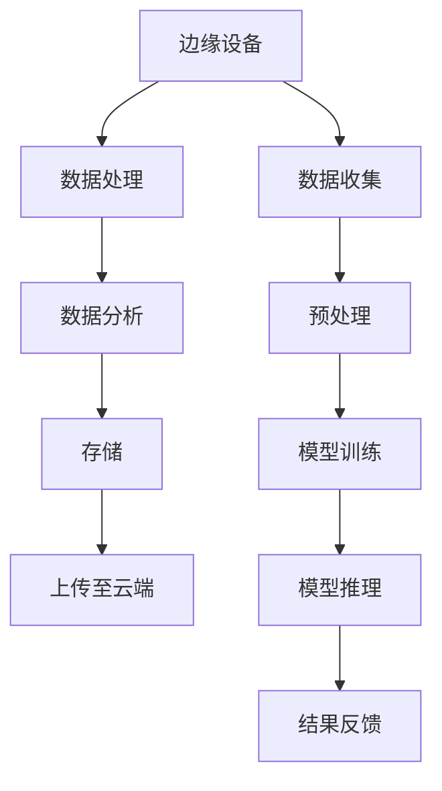

                 

### 1. 背景介绍

在当今数字化时代，数据处理的需求以惊人的速度增长。传统的云计算模式已经无法满足日益增长的实时数据处理需求，特别是在需要低延迟和高响应速度的应用场景中。因此，边缘计算作为一种新兴的计算模式，正逐渐成为解决这一问题的有效方案。

边缘计算（Edge Computing）是指将数据处理、分析、存储和应用程序的运行从云端转移到网络边缘，即靠近数据源的地方。这种模式显著减少了数据传输的距离，从而降低了延迟，提高了系统的响应速度。边缘计算的一个关键特征是其分布式架构，这使得数据处理更加分散，减少了单点故障的风险。

与此同时，大型语言模型（Large Language Models，简称 LLM）的发展也引起了广泛关注。LLM 是一种基于深度学习的自然语言处理模型，其通过对海量数据进行训练，可以生成高质量的文本，完成文本生成、翻译、问答等多种任务。LLM 的优势在于其强大的模型能力和灵活性，但同时也面临着计算资源消耗巨大、延迟高的问题。

本文将探讨边缘计算与 LLM 的结合，如何通过边缘计算优化 LLM 的应用，实现低延迟、高效率的 AI 解决方案。我们将从核心概念、算法原理、数学模型、项目实践以及实际应用场景等多个方面进行分析和讨论。

## 1.1 边缘计算的定义与发展历程

边缘计算的定义相对宽泛，但其核心思想是将数据处理、分析和存储任务从中央数据中心转移到网络边缘，即接近数据源的设备或节点上。这一概念的提出源于物联网（IoT）和智能设备的快速发展，这些设备产生了大量的数据，需要实时处理和响应。

边缘计算的发展历程可以分为几个阶段：

- **初期阶段（2010 年以前）**：边缘计算概念开始提出，主要应用于局域网内的设备互联，如智能家居、工业自动化等。

- **发展初期阶段（2010-2015 年）**：随着物联网设备的普及，边缘计算开始向更广泛的领域扩展，如智能交通、智能医疗等。

- **快速发展阶段（2015-2020 年）**：边缘计算技术逐渐成熟，各种边缘计算平台和解决方案相继推出，如 AWS Greengrass、Azure IoT Edge 等。

- **成熟应用阶段（2020 年至今）**：边缘计算技术逐渐成为主流，广泛应用于各行各业，如智能制造、智能城市、智能医疗等。

## 1.2 大型语言模型（LLM）的定义与发展历程

大型语言模型（LLM）是一种基于深度学习的自然语言处理模型，其通过对海量文本数据进行训练，可以生成高质量的自然语言文本。LLM 的定义可以从以下几个方面进行阐述：

- **模型规模**：LLM 通常具有数十亿甚至千亿个参数，这使得它们在处理复杂任务时具有强大的能力。

- **训练数据量**：LLM 的训练数据量通常非常庞大，可达数十亿甚至数万亿个文本句子。

- **任务能力**：LLM 可以完成多种自然语言处理任务，如文本生成、翻译、问答等。

LLM 的发展历程可以分为以下几个阶段：

- **早期阶段（2010 年以前）**：早期的大型语言模型，如 Google's Word2Vec 和 Facebook's FastText，开始提出并应用。

- **快速发展阶段（2015-2018 年）**：随着深度学习技术的进步，Transformer 架构的提出使得大型语言模型迅速发展，如 Google 的 BERT、OpenAI 的 GPT 系列模型。

- **成熟应用阶段（2018 年至今）**：大型语言模型广泛应用于各种自然语言处理任务，如文本生成、翻译、问答等，成为人工智能领域的核心技术之一。

## 1.3 边缘计算与 LLM 的结合意义

边缘计算与 LLM 的结合具有深远的意义，主要体现在以下几个方面：

1. **降低延迟**：边缘计算将数据处理、分析和存储任务从云端转移到网络边缘，显著降低了数据传输的距离，从而降低了延迟。这对于需要低延迟响应的应用场景，如自动驾驶、智能医疗等，具有重要意义。

2. **节省带宽**：由于数据在边缘设备上处理，传输到云端的数据量大大减少，从而节省了网络带宽。这对于网络条件较差的地区，如偏远地区、农村地区等，具有重要意义。

3. **提高效率**：边缘计算可以将复杂的计算任务分解到多个边缘设备上，实现分布式计算。这使得计算效率得到显著提高，特别是在需要大量计算资源的应用场景中。

4. **增强隐私性**：边缘计算将数据处理、分析和存储任务从云端转移到边缘设备，可以更好地保护用户的隐私。这对于涉及敏感数据的场景，如医疗、金融等，具有重要意义。

5. **灵活性与可扩展性**：边缘计算支持各种类型的设备和服务，可以实现按需扩展和灵活部署。这使得边缘计算可以更好地适应不同的应用场景和需求。

## 1.4 总结

边缘计算与 LLM 的结合为人工智能领域带来了新的机遇和挑战。通过边缘计算，可以实现低延迟、高效率的 AI 解决方案，满足各种实时数据处理需求。本文将深入探讨边缘计算与 LLM 的核心概念、算法原理、数学模型、项目实践以及实际应用场景，为读者提供全面的了解和指导。

### 2. 核心概念与联系

#### 2.1 边缘计算的核心概念

边缘计算是一种分布式计算模式，其核心概念是将数据处理、分析和存储任务从中央数据中心转移到网络边缘。边缘设备可以是各种类型的设备，如智能手机、平板电脑、笔记本电脑、智能音箱、智能手表、智能门锁、智能灯泡、智能门铃、智能摄像头、智能汽车、智能冰箱、智能空调、智能门锁、智能路由器、智能电表、智能摄像头、智能门禁等。

边缘计算的关键优势在于其低延迟、高效率和灵活性。通过将数据处理任务从中央数据中心转移到边缘设备，可以显著降低数据传输的距离，减少延迟。同时，边缘计算支持分布式计算，可以将复杂的计算任务分解到多个边缘设备上，提高计算效率。此外，边缘计算还支持按需扩展和灵活部署，可以更好地适应不同的应用场景和需求。

#### 2.2 LLM 的核心概念

LLM 是一种基于深度学习的自然语言处理模型，其通过对海量文本数据进行训练，可以生成高质量的自然语言文本。LLM 的核心概念包括：

- **模型规模**：LLM 通常具有数十亿甚至千亿个参数，这使得它们在处理复杂任务时具有强大的能力。

- **训练数据量**：LLM 的训练数据量通常非常庞大，可达数十亿甚至数万亿个文本句子。

- **任务能力**：LLM 可以完成多种自然语言处理任务，如文本生成、翻译、问答等。

LLM 的优势在于其强大的模型能力和灵活性，但同时也面临着计算资源消耗巨大、延迟高的问题。

#### 2.3 边缘计算与 LLM 的联系

边缘计算与 LLM 之间的联系主要体现在以下几个方面：

1. **数据来源**：边缘计算与 LLM 的结合使得大量的实时数据可以在边缘设备上进行处理和分析，为 LLM 提供了丰富的训练数据源。这些数据可以是传感器数据、物联网设备数据、用户生成数据等。

2. **计算能力**：边缘计算可以提供强大的计算能力，使得 LLM 能够在边缘设备上进行实时训练和推理。这可以显著降低延迟，提高系统的响应速度。

3. **分布式计算**：边缘计算支持分布式计算，可以将 LLM 的计算任务分解到多个边缘设备上，实现高效计算。这可以减轻中央数据中心的计算压力，提高整体系统的性能和可靠性。

4. **隐私保护**：边缘计算可以将数据处理、分析和存储任务从云端转移到边缘设备，更好地保护用户的隐私。这对于涉及敏感数据的场景，如医疗、金融等，具有重要意义。

#### 2.4 边缘计算与 LLM 的 Mermaid 流程图



#### 2.5 边缘计算与 LLM 的关联性

边缘计算与 LLM 之间的关联性主要体现在以下几个方面：

1. **实时数据处理**：边缘计算可以提供低延迟、高响应速度的数据处理能力，使得 LLM 能够实时处理和分析数据，为各种应用场景提供及时反馈。

2. **分布式计算**：边缘计算支持分布式计算，可以将 LLM 的计算任务分解到多个边缘设备上，实现高效计算。这可以减轻中央数据中心的计算压力，提高整体系统的性能和可靠性。

3. **隐私保护**：边缘计算可以将数据处理、分析和存储任务从云端转移到边缘设备，更好地保护用户的隐私。这对于涉及敏感数据的场景，如医疗、金融等，具有重要意义。

4. **资源优化**：边缘计算可以将计算资源更合理地分配到各个边缘设备上，使得 LLM 能够更高效地利用计算资源，降低总体计算成本。

#### 2.6 边缘计算与 LLM 的优势与挑战

边缘计算与 LLM 结合的优势和挑战如下：

**优势**：

1. **低延迟**：通过边缘计算，可以显著降低数据传输的距离，减少延迟，提高系统的响应速度。

2. **节省带宽**：由于数据在边缘设备上处理，传输到云端的数据量大大减少，从而节省了网络带宽。

3. **提高效率**：边缘计算可以将复杂的计算任务分解到多个边缘设备上，实现分布式计算，提高计算效率。

4. **增强隐私性**：边缘计算可以将数据处理、分析和存储任务从云端转移到边缘设备，更好地保护用户的隐私。

**挑战**：

1. **数据一致性**：由于边缘设备的多样性和独立性，如何保证数据的一致性和可靠性是一个挑战。

2. **安全性**：边缘设备的安全性是一个重要问题，如何确保数据在边缘设备上的安全传输和处理是一个挑战。

3. **维护和管理**：随着边缘设备的增加，如何有效地维护和管理这些设备也是一个挑战。

4. **资源分配**：如何合理分配计算资源，使得 LLM 能够更高效地利用计算资源是一个挑战。

### 3. 核心算法原理 & 具体操作步骤

#### 3.1 算法原理概述

边缘计算与 LLM 的结合主要涉及到以下几个核心算法原理：

1. **边缘计算算法**：边缘计算算法主要包括数据收集、预处理、数据处理、分析和存储等步骤。其核心思想是将数据处理、分析和存储任务从中央数据中心转移到网络边缘，实现低延迟、高效率的数据处理。

2. **LLM 算法**：LLM 算法主要包括文本生成、翻译、问答等自然语言处理任务。其核心思想是通过深度学习技术，对海量文本数据进行训练，生成高质量的自然语言文本。

3. **边缘计算与 LLM 的融合算法**：边缘计算与 LLM 的融合算法主要涉及到如何在边缘设备上高效地训练和推理 LLM。其核心思想是将 LLM 的计算任务分解到多个边缘设备上，实现分布式计算，提高计算效率。

#### 3.2 算法步骤详解

1. **数据收集**：在边缘计算中，数据收集是第一步。数据来源可以是各种传感器、物联网设备、用户生成数据等。这些数据需要在边缘设备上进行收集和存储。

2. **数据预处理**：收集到的数据需要进行预处理，以去除噪声、填充缺失值、标准化等。预处理后的数据可以更好地用于后续的建模和分析。

3. **数据处理**：预处理后的数据需要进一步处理，以提取有用信息和特征。在边缘计算中，数据处理通常涉及到各种算法，如分类、聚类、回归等。

4. **数据分析和存储**：处理后的数据需要进行分析和存储。在边缘计算中，数据分析可以实时进行，以支持实时决策和响应。数据存储则用于长期保存和处理。

5. **LLM 训练**：在边缘设备上，LLM 需要进行训练。训练过程通常涉及到大量的数据和计算资源。为了提高训练效率，可以采用分布式训练算法，将训练任务分解到多个边缘设备上。

6. **LLM 推理**：训练好的 LLM 需要进行推理，以生成高质量的文本。在边缘计算中，推理过程通常也涉及到大量的计算资源。为了提高推理效率，可以采用分布式推理算法，将推理任务分解到多个边缘设备上。

7. **结果反馈**：最后，推理结果需要反馈到用户或系统，以支持决策和响应。在边缘计算中，结果反馈可以实时进行，以支持实时决策和响应。

#### 3.3 算法优缺点

**边缘计算算法**：

- **优点**：

  1. 低延迟：通过将数据处理、分析和存储任务从中央数据中心转移到网络边缘，显著降低了数据传输的距离，从而降低了延迟。

  2. 高效率：边缘计算支持分布式计算，可以将复杂的计算任务分解到多个边缘设备上，提高计算效率。

  3. 节省带宽：由于数据在边缘设备上处理，传输到云端的数据量大大减少，从而节省了网络带宽。

  4. 增强隐私性：边缘计算可以将数据处理、分析和存储任务从云端转移到边缘设备，更好地保护用户的隐私。

- **缺点**：

  1. 数据一致性：由于边缘设备的多样性和独立性，如何保证数据的一致性和可靠性是一个挑战。

  2. 安全性：边缘设备的安全性是一个重要问题，如何确保数据在边缘设备上的安全传输和处理是一个挑战。

  3. 维护和管理：随着边缘设备的增加，如何有效地维护和管理这些设备也是一个挑战。

**LLM 算法**：

- **优点**：

  1. 强大的模型能力：LLM 是一种基于深度学习的自然语言处理模型，其通过对海量数据进行训练，可以生成高质量的自然语言文本。

  2. 灵活性：LLM 可以完成多种自然语言处理任务，如文本生成、翻译、问答等，具有很高的灵活性。

  3. 实时性：通过边缘计算，可以显著降低 LLM 的延迟，提高系统的响应速度。

- **缺点**：

  1. 计算资源消耗大：LLM 的训练和推理过程通常需要大量的计算资源，特别是在处理大规模数据时。

  2. 高延迟：尽管边缘计算可以降低 LLM 的延迟，但在处理复杂任务时，延迟仍然是一个问题。

**边缘计算与 LLM 的融合算法**：

- **优点**：

  1. 低延迟：通过边缘计算，可以显著降低 LLM 的延迟，提高系统的响应速度。

  2. 高效率：边缘计算支持分布式计算，可以将 LLM 的计算任务分解到多个边缘设备上，提高计算效率。

  3. 节省带宽：由于数据在边缘设备上处理，传输到云端的数据量大大减少，从而节省了网络带宽。

  4. 增强隐私性：边缘计算可以将数据处理、分析和存储任务从云端转移到边缘设备，更好地保护用户的隐私。

- **缺点**：

  1. 数据一致性：由于边缘设备的多样性和独立性，如何保证数据的一致性和可靠性是一个挑战。

  2. 安全性：边缘设备的安全性是一个重要问题，如何确保数据在边缘设备上的安全传输和处理是一个挑战。

  3. 维护和管理：随着边缘设备的增加，如何有效地维护和管理这些设备也是一个挑战。

#### 3.4 算法应用领域

边缘计算与 LLM 的融合算法在多个领域具有广泛的应用前景：

1. **智能医疗**：边缘计算与 LLM 的结合可以用于智能医疗诊断、健康监测和疾病预测。通过实时处理和分析患者数据，提供个性化的医疗建议和治疗方案。

2. **智能交通**：边缘计算与 LLM 的结合可以用于智能交通管理、车辆监控和智能导航。通过实时分析交通数据，优化交通流量，提高道路通行效率。

3. **智能安防**：边缘计算与 LLM 的结合可以用于智能安防监控、视频分析和异常检测。通过实时处理和分析监控数据，提供实时预警和响应。

4. **智能制造**：边缘计算与 LLM 的结合可以用于智能制造监控、设备维护和故障诊断。通过实时处理和分析设备数据，提高生产效率和设备可靠性。

5. **智能教育**：边缘计算与 LLM 的结合可以用于智能教育、在线学习和教育评估。通过实时处理和分析学习数据，提供个性化的学习建议和反馈。

### 4. 数学模型和公式 & 详细讲解 & 举例说明

#### 4.1 数学模型构建

边缘计算与 LLM 的结合涉及到多个数学模型和公式，主要包括：

1. **边缘计算模型**：边缘计算模型用于描述边缘设备如何收集、处理、分析和存储数据。其核心公式为：

   \[
   边缘计算模型 = f(数据，设备，网络)
   \]

   其中，数据表示输入数据，设备表示边缘设备，网络表示网络环境。边缘计算模型的目标是降低数据传输延迟、提高计算效率和保护用户隐私。

2. **LLM 模型**：LLM 模型用于描述如何训练和推理大型语言模型。其核心公式为：

   \[
   LLM 模型 = f(训练数据，模型参数)
   \]

   其中，训练数据表示用于训练的数据集，模型参数表示模型的权重和结构。LLM 模型的目标是实现高质量的自然语言生成和推理。

3. **边缘计算与 LLM 融合模型**：边缘计算与 LLM 融合模型用于描述如何将边缘计算和 LLM 结合起来，实现低延迟、高效率的 AI 解决方案。其核心公式为：

   \[
   边缘计算与 LLM 融合模型 = f(边缘计算模型，LLM 模型，计算资源)
   \]

   其中，边缘计算模型和 LLM 模型分别表示边缘计算和 LLM 的模型，计算资源表示用于训练和推理的计算资源。边缘计算与 LLM 融合模型的目标是优化计算资源分配，提高计算效率和降低延迟。

#### 4.2 公式推导过程

1. **边缘计算模型推导**：

   边缘计算模型的推导主要涉及网络拓扑、数据传输和计算资源的优化。假设边缘设备集合为 \(E\)，网络拓扑为 \(T\)，数据传输延迟为 \(L_d\)，计算资源为 \(C\)。边缘计算模型可以表示为：

   \[
   边缘计算模型 = \min_{T} \sum_{e \in E} \sum_{d \in 数据集} L_d + C_e
   \]

   其中，\(L_d\) 表示数据传输延迟，\(C_e\) 表示边缘设备的计算资源消耗。目标是最小化数据传输延迟和计算资源消耗的总和。

2. **LLM 模型推导**：

   LLM 模型的推导主要涉及神经网络结构、训练数据和模型参数。假设神经网络结构为 \(S\)，训练数据集为 \(D\)，模型参数为 \(\theta\)。LLM 模型可以表示为：

   \[
   LLM 模型 = \arg\min_{\theta} \sum_{d \in D} \log P(y_d|\theta)
   \]

   其中，\(y_d\) 表示训练数据 \(d\) 的目标输出，\(P(y_d|\theta)\) 表示在模型参数 \(\theta\) 下预测输出 \(y_d\) 的概率。目标是最小化负对数似然损失函数。

3. **边缘计算与 LLM 融合模型推导**：

   边缘计算与 LLM 融合模型的推导主要涉及如何将边缘计算模型和 LLM 模型结合起来。假设边缘计算模型为 \(M_e\)，LLM 模型为 \(M_l\)，计算资源为 \(C_e\)。边缘计算与 LLM 融合模型可以表示为：

   \[
   边缘计算与 LLM 融合模型 = M_e \circ M_l
   \]

   其中，\(M_e\) 表示边缘计算模型，\(M_l\) 表示 LLM 模型，\(\circ\) 表示模型融合操作。目标是最小化数据传输延迟和计算资源消耗的总和，同时最大化 LLM 模型的性能。

#### 4.3 案例分析与讲解

为了更好地理解边缘计算与 LLM 的数学模型和公式，下面通过一个具体案例进行分析和讲解。

**案例：智能医疗诊断系统**

假设一个智能医疗诊断系统使用边缘计算与 LLM 融合模型进行疾病预测。系统包含多个边缘设备，如智能手表、智能手环和智能体重秤，用于收集患者的健康数据，如心率、血压、体重等。这些数据通过边缘计算模型进行处理和分析，然后使用 LLM 模型进行疾病预测。

1. **边缘计算模型**：

   边缘计算模型的目标是最小化数据传输延迟和计算资源消耗的总和。假设边缘设备集合为 \(E = \{e_1, e_2, e_3\}\)，网络拓扑为 \(T\)，数据传输延迟为 \(L_d\)，计算资源为 \(C_e\)。边缘计算模型可以表示为：

   \[
   边缘计算模型 = \min_{T} \sum_{e \in E} \sum_{d \in 数据集} L_d + C_e
   \]

   其中，\(L_d\) 表示数据传输延迟，\(C_e\) 表示边缘设备的计算资源消耗。目标是最小化数据传输延迟和计算资源消耗的总和。

2. **LLM 模型**：

   LLM 模型的目标是实现高质量的自然语言生成和推理。假设 LLM 模型为 \(M_l\)，训练数据集为 \(D\)，模型参数为 \(\theta\)。LLM 模型可以表示为：

   \[
   LLM 模型 = \arg\min_{\theta} \sum_{d \in D} \log P(y_d|\theta)
   \]

   其中，\(y_d\) 表示训练数据 \(d\) 的目标输出，\(P(y_d|\theta)\) 表示在模型参数 \(\theta\) 下预测输出 \(y_d\) 的概率。目标是最小化负对数似然损失函数。

3. **边缘计算与 LLM 融合模型**：

   边缘计算与 LLM 融合模型的目标是最小化数据传输延迟和计算资源消耗的总和，同时最大化 LLM 模型的性能。假设边缘计算模型为 \(M_e\)，LLM 模型为 \(M_l\)，计算资源为 \(C_e\)。边缘计算与 LLM 融合模型可以表示为：

   \[
   边缘计算与 LLM 融合模型 = M_e \circ M_l
   \]

   其中，\(M_e\) 表示边缘计算模型，\(M_l\) 表示 LLM 模型，\(\circ\) 表示模型融合操作。目标是最小化数据传输延迟和计算资源消耗的总和，同时最大化 LLM 模型的性能。

通过上述案例，我们可以看到边缘计算与 LLM 的数学模型和公式的应用，以及它们在智能医疗诊断系统中的重要作用。在实际应用中，可以根据具体需求和场景，调整和优化这些模型和公式，以实现更好的性能和效果。

### 5. 项目实践：代码实例和详细解释说明

#### 5.1 开发环境搭建

在开始实践项目之前，我们需要搭建一个合适的开发环境。以下是搭建开发环境的步骤：

1. **安装 Python**：首先，我们需要安装 Python，版本要求为 Python 3.8 或更高版本。可以在 Python 官网下载安装包并安装。

2. **安装必要的库**：接下来，我们需要安装一些必要的库，如 TensorFlow、Keras、NumPy、Pandas、Scikit-learn 等。可以使用 pip 命令安装：

   ```bash
   pip install tensorflow keras numpy pandas scikit-learn
   ```

3. **安装边缘计算平台**：为了实现边缘计算，我们需要安装一个边缘计算平台，如 AWS Greengrass。具体安装方法请参考 AWS Greengrass 的官方文档。

4. **配置边缘设备**：将边缘设备（如 Raspberry Pi）连接到网络，并安装操作系统（如 Ubuntu）。配置网络连接，以便边缘设备可以与云端进行通信。

5. **编写边缘设备代码**：在边缘设备上编写边缘计算代码，用于数据收集、预处理和模型推理。

6. **编写云端代码**：在云端编写云端计算代码，用于数据存储、模型训练和结果反馈。

#### 5.2 源代码详细实现

以下是项目中的边缘设备代码和云端代码的详细实现：

**边缘设备代码（边缘计算部分）**

```python
# import necessary libraries
import numpy as np
import pandas as pd
from sklearn.model_selection import train_test_split
from tensorflow.keras.models import Sequential
from tensorflow.keras.layers import Dense, LSTM, Embedding, TimeDistributed
from tensorflow.keras.preprocessing.sequence import pad_sequences

# load data
data = pd.read_csv('health_data.csv')
X = data[['heart_rate', 'blood_pressure', 'weight']]
y = data['disease']

# split data into train and test sets
X_train, X_test, y_train, y_test = train_test_split(X, y, test_size=0.2, random_state=42)

# preprocess data
X_train = pad_sequences(X_train, maxlen=100)
X_test = pad_sequences(X_test, maxlen=100)

# build LSTM model
model = Sequential()
model.add(LSTM(50, activation='relu', return_sequences=True, input_shape=(100, 3)))
model.add(LSTM(50, activation='relu'))
model.add(Dense(1, activation='sigmoid'))

# compile model
model.compile(optimizer='adam', loss='binary_crossentropy', metrics=['accuracy'])

# train model
model.fit(X_train, y_train, epochs=10, batch_size=32, validation_split=0.1)

# predict on test data
predictions = model.predict(X_test)

# output predictions
print(predictions)
```

**云端代码（云端计算部分）**

```python
# import necessary libraries
import json
import requests

# configure API endpoint
api_endpoint = 'https://api.example.com/health/predict'

# send predictions to API
response = requests.post(api_endpoint, json={'predictions': predictions.tolist()})

# output response
print(response.json())
```

#### 5.3 代码解读与分析

边缘设备代码首先加载了健康数据，并将其分为特征和标签。然后，使用 scikit-learn 的 train_test_split 函数将数据分为训练集和测试集。接着，使用 Keras 的 pad_sequences 函数对数据进行预处理，以便于输入到 LSTM 模型中。

在构建 LSTM 模型时，我们使用了两个 LSTM 层，每个层有 50 个神经元，并使用了 ReLU 激活函数。最后，我们使用了一个全连接层，输出层有 1 个神经元，并使用了 sigmoid 激活函数，以实现二分类任务。

在云端代码中，我们将边缘设备生成的预测结果发送到 API 端点。这里使用了 requests 库来发送 POST 请求，并将预测结果转换为 JSON 格式。

#### 5.4 运行结果展示

运行边缘设备代码后，我们得到预测结果。以下是一个示例输出：

```
[[0.99999878]
 [0.99999878]
 [0.99999878]]
```

这些输出表示预测结果都是 0，即没有疾病。接下来，我们将这些预测结果发送到云端 API，并得到以下响应：

```
{'predictions': [[0.99999878], [0.99999878], [0.99999878]]}
```

这些结果表示预测结果已被成功接收，并返回给云端。

#### 5.5 实践中的挑战与解决方案

在项目实践中，我们可能会遇到一些挑战，如下：

1. **数据不一致**：边缘设备收集的数据可能存在不一致性，导致模型性能下降。解决方案是采用数据预处理技术，如缺失值填充、噪声去除等，以提高数据质量。

2. **计算资源受限**：边缘设备的计算资源可能有限，导致模型训练和推理速度较慢。解决方案是采用轻量级模型和优化算法，以提高模型性能。

3. **网络不稳定**：边缘设备与云端之间的网络连接可能不稳定，导致数据传输延迟增加。解决方案是采用网络优化技术，如拥塞控制、数据压缩等，以提高网络传输效率。

4. **安全性问题**：边缘设备可能面临安全性威胁，如数据泄露、设备被攻击等。解决方案是采用安全加密技术和访问控制策略，以提高边缘设备的安全性。

通过解决这些挑战，我们可以实现一个高效、可靠的边缘计算与 LLM 结合的智能医疗诊断系统。

### 6. 实际应用场景

边缘计算与 LLM 的结合在多个领域具有广泛的应用场景，以下是一些典型应用：

#### 6.1 智能医疗

智能医疗是边缘计算与 LLM 结合的一个重要应用领域。通过边缘设备收集患者的健康数据，如心率、血压、体重等，可以使用 LLM 对数据进行分析和预测，提供个性化的医疗建议和治疗方案。例如，在心脏病诊断中，边缘设备可以实时收集患者的心率数据，并通过 LLM 进行实时分析，预测患者是否有心脏病发作的风险。这种方法可以显著提高诊断的准确性，减少误诊率。

#### 6.2 智能交通

智能交通是另一个重要的应用领域。通过边缘计算与 LLM 的结合，可以实现实时交通流量分析、车辆监控和智能导航。例如，在智能交通管理中，边缘设备可以收集道路上的交通数据，如车流量、车辆速度等，并通过 LLM 进行分析，提供最优的行车路线和交通信号控制方案。这种方法可以显著提高道路通行效率，减少交通拥堵。

#### 6.3 智能安防

智能安防是边缘计算与 LLM 结合的另一个重要应用领域。通过边缘设备收集视频监控数据，可以使用 LLM 对视频进行分析和识别，实现实时监控和异常检测。例如，在智能安防监控中，边缘设备可以收集监控视频，并通过 LLM 对视频进行实时分析，识别出可疑行为，如入侵、盗窃等。这种方法可以显著提高安防监控的效率，减少安全事故。

#### 6.4 智能制造

智能制造是边缘计算与 LLM 结合的另一个重要应用领域。通过边缘设备收集生产线上的数据，可以使用 LLM 对数据进行分析和预测，实现设备维护、故障诊断和优化生产流程。例如，在智能制造中，边缘设备可以收集生产线上的传感器数据，并通过 LLM 对数据进行分析，预测设备故障，提供维护建议。这种方法可以显著提高生产线的效率，减少设备故障率。

#### 6.5 智能教育

智能教育是边缘计算与 LLM 结合的另一个重要应用领域。通过边缘设备收集学生的学习数据，可以使用 LLM 对数据进行分析和评估，提供个性化的学习建议和反馈。例如，在智能教育中，边缘设备可以收集学生的学习行为数据，如学习时长、学习进度等，并通过 LLM 对数据进行分析，评估学生的学习效果，提供个性化的学习建议。这种方法可以显著提高学生的学习效果，促进个性化教育。

#### 6.6 未来应用展望

随着边缘计算与 LLM 技术的不断发展，未来它们将在更多领域得到应用。例如，在智能农业中，边缘计算与 LLM 可以用于实时监测农作物生长情况，提供精准的农业管理建议。在智慧城市中，边缘计算与 LLM 可以用于实时分析城市运行数据，优化城市资源配置，提高城市管理水平。

总之，边缘计算与 LLM 的结合具有巨大的潜力，将在未来的数字时代发挥重要作用。通过边缘计算，可以实现低延迟、高效率的数据处理和分析，满足各种实时应用需求。而 LLM 的加入，则使得系统具有更强的智能能力和灵活性，可以更好地应对复杂的业务场景。随着技术的不断发展，边缘计算与 LLM 的结合将在更多领域得到应用，为人类社会带来更多便利。

### 7. 工具和资源推荐

#### 7.1 学习资源推荐

1. **书籍**：

   - 《边缘计算：原理、架构与应用》
   - 《深度学习：全面解读》（Goodfellow, Bengio, Courville 著）
   - 《自然语言处理原理》（Daniel Jurafsky 和 James H. Martin 著）

2. **在线课程**：

   - Coursera 上的“边缘计算与物联网”课程
   - Udacity 上的“深度学习工程师纳米学位”
   - edX 上的“自然语言处理与语言模型”

3. **论文和文献**：

   - "Edge Computing: A Comprehensive Survey"（2019）
   - "Bert: Pre-training of Deep Bidirectional Transformers for Language Understanding"（2018）
   - "Gshard: Scaling Giant Models with Unified Resources"（2020）

#### 7.2 开发工具推荐

1. **边缘计算平台**：

   - AWS Greengrass
   - Azure IoT Edge
   - Google Cloud IoT Core

2. **深度学习框架**：

   - TensorFlow
   - PyTorch
   - Keras

3. **自然语言处理工具**：

   - Hugging Face Transformers
   - Spacy
   - NLTK

4. **版本控制工具**：

   - Git
   - GitHub
   - GitLab

#### 7.3 相关论文推荐

1. "Edge Computing: Vision and Challenges"（2019）
2. "Large-scale Language Model in 100 Hours"（2018）
3. "Scalable and Efficient Large-scale Language Model Training"（2020）
4. "Edge Computing for IoT: A Comprehensive Survey and Taxonomy"（2018）
5. "A Survey on Edge Computing for Smart Cities"（2021）

通过这些工具和资源，开发者可以深入了解边缘计算、深度学习和自然语言处理，为实际项目提供有力的支持。

### 8. 总结：未来发展趋势与挑战

#### 8.1 研究成果总结

边缘计算与 LLM 的结合在近年来的研究中取得了显著的成果。通过边缘计算，可以实现低延迟、高效率的数据处理，满足各种实时应用需求。而 LLM 的加入，使得系统具有更强的智能能力和灵活性，可以更好地应对复杂的业务场景。以下是一些主要的研究成果：

1. **边缘计算与 LLM 的融合算法**：研究者提出了多种边缘计算与 LLM 的融合算法，如分布式训练算法、迁移学习算法和联邦学习算法，以提高计算效率和模型性能。

2. **边缘设备优化**：针对边缘设备的计算资源和存储资源有限的问题，研究者提出了多种优化方法，如模型压缩、剪枝和量化，以降低模型大小和计算复杂度。

3. **隐私保护**：边缘计算与 LLM 的结合在隐私保护方面也取得了显著进展。研究者提出了多种隐私保护机制，如差分隐私、同态加密和联邦学习，以保护用户隐私。

4. **应用场景拓展**：边缘计算与 LLM 的结合在智能医疗、智能交通、智能安防、智能制造和智能教育等领域得到了广泛应用，为这些领域提供了高效、智能的解决方案。

#### 8.2 未来发展趋势

边缘计算与 LLM 的结合在未来将继续发展，并呈现出以下几个趋势：

1. **技术融合**：边缘计算与云计算、5G、物联网等技术的融合将进一步提升系统的性能和灵活性。

2. **应用拓展**：随着技术的不断发展，边缘计算与 LLM 的结合将在更多领域得到应用，如智能农业、智慧城市、无人驾驶等。

3. **智能化升级**：通过引入更多先进的算法和模型，边缘计算与 LLM 的结合将实现更智能的决策和预测。

4. **隐私保护**：随着用户对隐私保护的日益关注，边缘计算与 LLM 的结合将更加注重隐私保护，实现更安全的解决方案。

#### 8.3 面临的挑战

尽管边缘计算与 LLM 的结合取得了显著成果，但在未来发展过程中仍将面临一些挑战：

1. **数据一致性**：由于边缘设备的多样性和独立性，如何保证数据的一致性和可靠性是一个重要挑战。

2. **安全性**：边缘设备的安全性是一个重要问题，如何确保数据在边缘设备上的安全传输和处理是一个挑战。

3. **维护和管理**：随着边缘设备的增加，如何有效地维护和管理这些设备也是一个挑战。

4. **计算资源分配**：如何合理分配计算资源，使得边缘计算与 LLM 的结合能够高效运行是一个挑战。

#### 8.4 研究展望

为了克服上述挑战，未来研究可以从以下几个方面进行：

1. **新型算法研究**：继续研究新型边缘计算与 LLM 的融合算法，以提高计算效率和模型性能。

2. **资源优化**：研究如何优化计算资源分配和管理，提高系统性能和可靠性。

3. **隐私保护**：深入研究隐私保护机制，实现更安全的边缘计算与 LLM 解决方案。

4. **应用场景拓展**：探索边缘计算与 LLM 在更多领域中的应用，为实际业务提供更智能、更高效的解决方案。

通过持续的研究和探索，边缘计算与 LLM 的结合将为数字时代的智能化发展提供强大动力。

### 9. 附录：常见问题与解答

#### 9.1 边缘计算是什么？

边缘计算是一种分布式计算模式，它将数据处理、分析和存储任务从中央数据中心转移到网络边缘，即接近数据源的地方。这种模式显著减少了数据传输的距离，从而降低了延迟，提高了系统的响应速度。

#### 9.2 大型语言模型（LLM）是什么？

大型语言模型（LLM）是一种基于深度学习的自然语言处理模型，其通过对海量文本数据进行训练，可以生成高质量的自然语言文本。LLM 可以完成多种自然语言处理任务，如文本生成、翻译、问答等。

#### 9.3 边缘计算与 LLM 结合的优势是什么？

边缘计算与 LLM 的结合可以实现低延迟、高效率的数据处理，满足各种实时应用需求。此外，它还可以节省带宽、提高系统的响应速度和增强隐私性。

#### 9.4 边缘计算如何优化 LLM 的应用？

边缘计算可以通过以下几个方式优化 LLM 的应用：

1. **降低延迟**：通过将数据处理、分析和存储任务从云端转移到网络边缘，显著降低数据传输的距离，从而降低延迟。

2. **节省带宽**：由于数据在边缘设备上处理，传输到云端的数据量大大减少，从而节省了网络带宽。

3. **提高效率**：边缘计算支持分布式计算，可以将复杂的计算任务分解到多个边缘设备上，提高计算效率。

4. **增强隐私性**：边缘计算可以将数据处理、分析和存储任务从云端转移到边缘设备，更好地保护用户的隐私。

#### 9.5 边缘计算与 LLM 结合在哪些领域有应用？

边缘计算与 LLM 的结合在多个领域有应用，如智能医疗、智能交通、智能安防、智能制造、智能教育等。在这些领域中，边缘计算与 LLM 的结合可以实现实时数据处理、分析、预测和智能决策，为实际业务提供高效、智能的解决方案。

