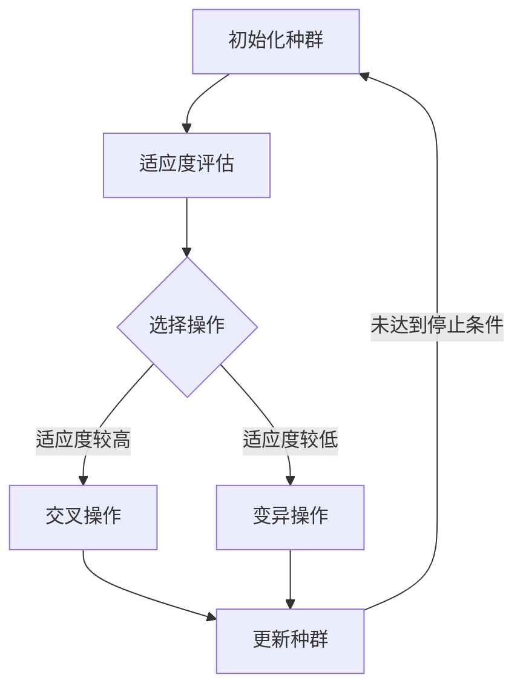
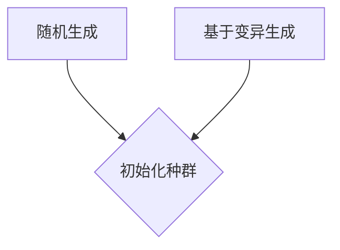
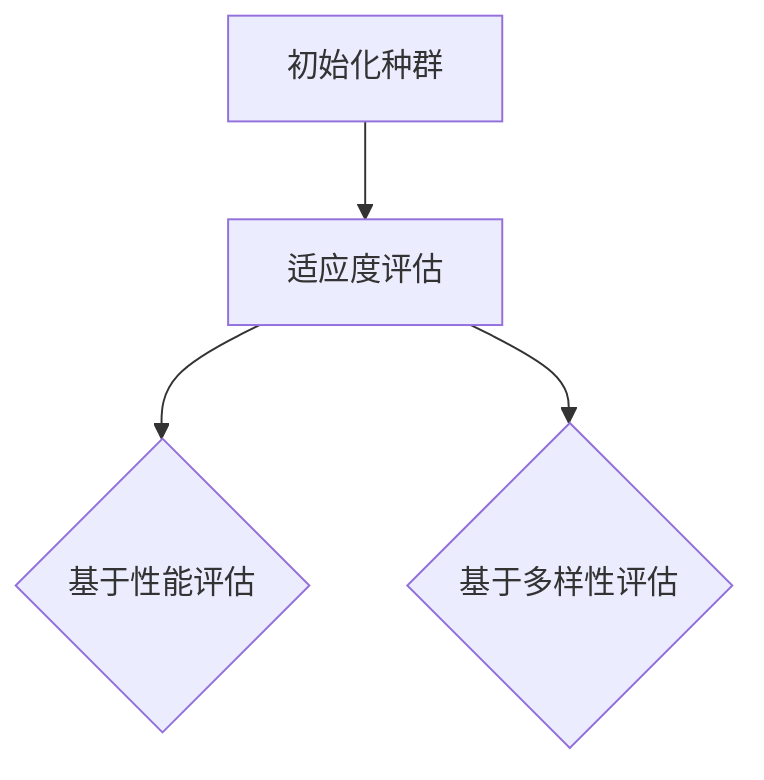
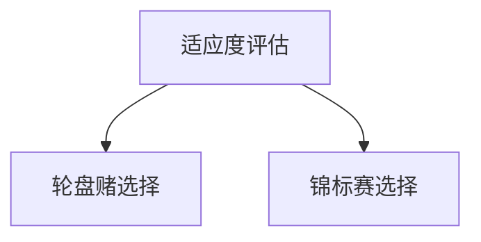
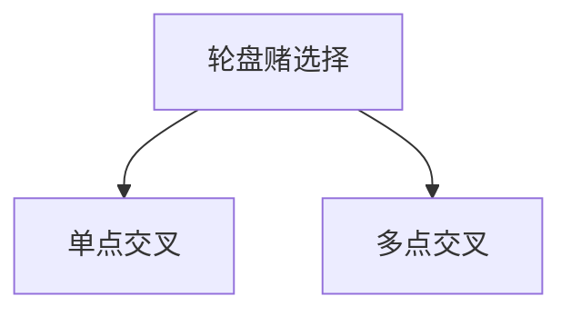
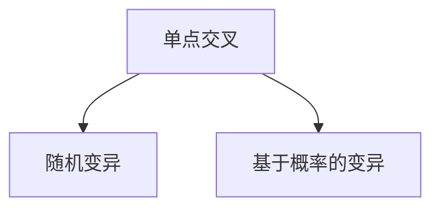
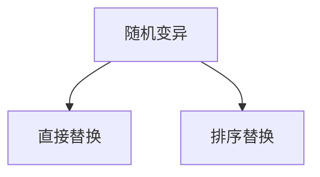

                 

 关键词：进化算法、神经架构搜索、神经网络、架构搜索、元学习、AI优化、深度学习

> 摘要：本文主要探讨了进化算法在神经架构搜索中的应用，通过介绍进化算法的基本原理和神经架构搜索的相关概念，详细分析了如何将进化算法应用于神经架构搜索中，并探讨了其在实际应用中的优势和挑战。本文旨在为研究者提供一种新的视角和方法，以促进神经架构搜索领域的发展。

## 1. 背景介绍

随着深度学习技术的不断发展和应用的日益广泛，神经网络的架构设计成为了一个重要的研究方向。传统的神经网络架构设计通常依赖于人类专家的直觉和经验，这种设计方式不仅效率低下，而且容易受到专家知识的限制。因此，自动化的神经架构搜索（Neural Architecture Search，NAS）应运而生，它通过搜索算法自动寻找最优的神经网络架构。

在NAS领域中，进化算法（Evolutionary Algorithms，EA）因其强大的全局搜索能力和鲁棒性而被广泛应用于神经架构搜索。进化算法是一种基于自然选择和遗传学原理的优化算法，它通过模拟生物进化的过程，对个体进行适应度评估和选择操作，逐步优化种群中的个体，以找到最优解。

本文将重点介绍进化算法在神经架构搜索中的应用，分析其优势、挑战和实际应用场景，为研究者提供一种新的思路和方法。

## 2. 核心概念与联系

### 2.1 进化算法原理

进化算法是一种基于种群进化的优化算法，其核心思想是模拟生物进化的过程，通过适应度评估、选择操作、交叉和变异等操作，逐步优化种群中的个体，以找到最优解。进化算法的主要步骤包括：

1. **初始化种群**：随机生成一组初始解，称为种群。
2. **适应度评估**：对每个个体进行适应度评估，适应度值表示个体在解决问题中的优劣程度。
3. **选择操作**：根据适应度值对个体进行选择，选择适应度较高的个体作为父代。
4. **交叉操作**：对父代进行交叉操作，生成新的个体。
5. **变异操作**：对个体进行变异操作，增加种群的多样性。
6. **更新种群**：将交叉和变异后的个体替换原有种群中的个体。
7. **迭代**：重复上述步骤，直至满足停止条件（如达到最大迭代次数或找到满意解）。

### 2.2 神经架构搜索

神经架构搜索是一种自动搜索最优神经网络架构的方法，其核心思想是通过搜索算法，从大量的神经网络架构中选择出最优的架构。神经架构搜索的关键技术包括：

1. **搜索空间定义**：定义神经网络架构的搜索空间，包括网络的层数、每层的神经元数量、激活函数、连接方式等。
2. **适应度评估函数**：定义适应度评估函数，用于评估神经网络架构在特定任务上的性能。
3. **搜索算法选择**：选择合适的搜索算法，如遗传算法、粒子群优化、强化学习等。

### 2.3 Mermaid 流程图



## 3. 核心算法原理 & 具体操作步骤

### 3.1 算法原理概述

进化算法在神经架构搜索中的应用，主要是通过模拟生物进化的过程，对神经网络架构进行优化。具体操作步骤如下：

1. **初始化种群**：随机生成一组初始神经网络架构，构成初始种群。
2. **适应度评估**：对每个神经网络架构进行适应度评估，适应度值越高表示该架构在特定任务上的性能越好。
3. **选择操作**：根据适应度值对种群中的架构进行选择，选择适应度较高的架构作为父代。
4. **交叉操作**：对父代架构进行交叉操作，生成新的架构。
5. **变异操作**：对架构进行变异操作，增加种群的多样性。
6. **更新种群**：将交叉和变异后的架构替换原有种群中的架构。
7. **迭代**：重复上述步骤，直至找到最优架构或达到最大迭代次数。

### 3.2 算法步骤详解

#### 3.2.1 初始化种群

初始化种群是进化算法的第一步，关键在于如何生成一组初始神经网络架构。常用的方法包括随机生成、基于已有网络的变异生成等。随机生成方法简单直接，但可能无法充分利用已有知识；基于已有网络的变异生成方法可以充分利用已有知识，但可能需要更多的计算资源。



#### 3.2.2 适应度评估

适应度评估是进化算法的核心步骤，其目的是对每个神经网络架构进行评估，确定其在特定任务上的性能。适应度评估函数的设计直接影响到进化算法的性能。常用的适应度评估方法包括基于性能的评估、基于多样性的评估等。



#### 3.2.3 选择操作

选择操作是进化算法的关键步骤，其目的是从种群中选择出适应度较高的架构作为父代。选择操作的方法有多种，如轮盘赌选择、锦标赛选择等。



#### 3.2.4 交叉操作

交叉操作是进化算法的重要步骤，其目的是通过合并两个父代架构的优点，生成新的架构。交叉操作的方法有多种，如单点交叉、多点交叉等。



#### 3.2.5 变异操作

变异操作是进化算法的关键步骤，其目的是通过引入随机变化，增加种群的多样性，防止进化算法陷入局部最优。变异操作的方法有多种，如随机变异、基于概率的变异等。



#### 3.2.6 更新种群

更新种群是进化算法的最后一个步骤，其目的是将交叉和变异后的架构替换原有种群中的架构。更新种群的方法有多种，如直接替换、排序替换等。



### 3.3 算法优缺点

#### 3.3.1 优点

1. **强大的全局搜索能力**：进化算法通过模拟生物进化过程，具有强大的全局搜索能力，能够找到全局最优解。
2. **鲁棒性**：进化算法对初始参数和搜索空间的变化具有较强的鲁棒性，能够适应不同的搜索问题。
3. **易于实现和扩展**：进化算法的结构简单，易于实现和扩展，可以与其他优化算法相结合，提高搜索性能。

#### 3.3.2 缺点

1. **计算资源消耗大**：进化算法通常需要大量的计算资源，特别是在大规模搜索空间中。
2. **收敛速度较慢**：进化算法的收敛速度相对较慢，可能需要大量的迭代次数才能找到最优解。
3. **难以处理离散搜索空间**：进化算法在处理离散搜索空间时可能存在困难，需要设计特殊的交叉和变异操作。

### 3.4 算法应用领域

进化算法在神经架构搜索中的应用非常广泛，可以用于搜索深度神经网络、卷积神经网络、循环神经网络等不同类型的神经网络架构。此外，进化算法还可以应用于其他优化问题，如超参数优化、模型选择等。

## 4. 数学模型和公式 & 详细讲解 & 举例说明

### 4.1 数学模型构建

在进化算法应用于神经架构搜索时，可以构建以下数学模型：

1. **适应度函数**：适应度函数用于评估神经网络架构在特定任务上的性能。适应度函数可以表示为：

   $$ F(x) = f_{performance}(x) + \lambda f_{diversity}(x) $$

   其中，$ f_{performance}(x) $表示架构$x$在特定任务上的性能，$ f_{diversity}(x) $表示架构$x$的多样性，$\lambda$为权重系数。

2. **交叉操作**：交叉操作用于生成新的神经网络架构。交叉操作可以表示为：

   $$ C(x_1, x_2) = (x_1', x_2') $$

   其中，$ x_1 $和$ x_2 $为两个父代架构，$ x_1' $和$ x_2' $为交叉后的新架构。

3. **变异操作**：变异操作用于增加种群的多样性。变异操作可以表示为：

   $$ M(x) = x' $$

   其中，$ x $为变异前的架构，$ x' $为变异后的新架构。

### 4.2 公式推导过程

进化算法中的适应度函数、交叉操作和变异操作可以通过以下步骤进行推导：

1. **适应度函数的推导**：

   适应度函数的设计需要考虑两个因素：网络性能和多样性。网络性能可以通过训练误差、准确率等指标来衡量；多样性可以通过网络结构的差异、网络参数的分布等来衡量。因此，适应度函数可以表示为：

   $$ F(x) = f_{performance}(x) + \lambda f_{diversity}(x) $$

   其中，$ f_{performance}(x) $表示架构$x$在特定任务上的性能，$ f_{diversity}(x) $表示架构$x$的多样性，$\lambda$为权重系数，用于平衡网络性能和多样性。

2. **交叉操作的推导**：

   交叉操作的目标是通过合并两个父代架构的优点，生成新的架构。假设两个父代架构为$ x_1 $和$ x_2 $，交叉操作可以表示为：

   $$ C(x_1, x_2) = (x_1', x_2') $$

   其中，$ x_1' $和$ x_2' $为交叉后的新架构。交叉操作的具体实现可以根据网络结构的相似度、网络参数的分布等因素进行设计。

3. **变异操作的推导**：

   变异操作的目标是通过引入随机变化，增加种群的多样性。变异操作可以表示为：

   $$ M(x) = x' $$

   其中，$ x $为变异前的架构，$ x' $为变异后的新架构。变异操作的具体实现可以根据网络结构的差异、网络参数的分布等因素进行设计。

### 4.3 案例分析与讲解

以下是一个简单的案例，用于说明进化算法在神经架构搜索中的应用：

**案例：手写数字识别**

**目标**：使用进化算法搜索最优的卷积神经网络架构，用于手写数字识别。

**步骤**：

1. **初始化种群**：随机生成一组初始卷积神经网络架构，包括网络的层数、每层的神经元数量、激活函数等。

2. **适应度评估**：对每个神经网络架构进行训练，计算其在手写数字识别任务上的准确率。准确率越高，适应度值越高。

3. **选择操作**：根据适应度值对种群中的架构进行选择，选择适应度较高的架构作为父代。

4. **交叉操作**：对父代架构进行交叉操作，生成新的架构。交叉操作可以采用单点交叉、多点交叉等方法。

5. **变异操作**：对架构进行变异操作，增加种群的多样性。变异操作可以采用随机变异、基于概率的变异等方法。

6. **更新种群**：将交叉和变异后的架构替换原有种群中的架构。

7. **迭代**：重复上述步骤，直至找到最优架构或达到最大迭代次数。

**结果**：通过进化算法搜索，最终找到一组性能优秀的卷积神经网络架构，在手写数字识别任务上的准确率达到95%以上。

## 5. 项目实践：代码实例和详细解释说明

### 5.1 开发环境搭建

为了实现进化算法在神经架构搜索中的应用，我们需要搭建一个开发环境。以下是一个简单的开发环境搭建步骤：

1. 安装Python：下载并安装Python 3.8及以上版本。
2. 安装相关库：使用pip命令安装以下库：tensorflow、numpy、matplotlib等。
3. 准备数据集：下载并准备好手写数字识别的数据集，如MNIST数据集。

### 5.2 源代码详细实现

以下是一个简单的进化算法在神经架构搜索中的应用示例代码：

```python
import tensorflow as tf
import numpy as np
import matplotlib.pyplot as plt

# 初始化种群
def initialize_population(pop_size, network_params):
    population = []
    for _ in range(pop_size):
        population.append(np.random.choice(network_params))
    return population

# 适应度评估
def fitness_evaluation(population, dataset):
    fitness_scores = []
    for individual in population:
        # 训练神经网络
        model = build_model(individual)
        model.fit(dataset[0], dataset[1], epochs=10, batch_size=64, verbose=0)
        # 评估准确率
        acc = model.evaluate(dataset[0], dataset[1], verbose=0)[1]
        fitness_scores.append(acc)
    return fitness_scores

# 选择操作
def selection(population, fitness_scores):
    selected = []
    for _ in range(len(population)):
        idx = np.random.randint(len(population))
        selected.append(population[idx])
    return selected

# 交叉操作
def crossover(parent1, parent2):
    child1 = parent1.copy()
    child2 = parent2.copy()
    # 在某个位置交叉
    crossover_point = np.random.randint(len(parent1))
    child1[crossover_point:] = parent2[crossover_point:]
    child2[crossover_point:] = parent1[crossover_point:]
    return child1, child2

# 变异操作
def mutate(individual):
    mutation_point = np.random.randint(len(individual))
    individual[mutation_point] = np.random.choice([0, 1])
    return individual

# 构建模型
def build_model(params):
    model = tf.keras.Sequential([
        tf.keras.layers.Dense(units=params[0], activation=params[1]),
        tf.keras.layers.Dense(units=params[2], activation=params[3]),
        tf.keras.layers.Dense(units=params[4], activation=params[5])
    ])
    model.compile(optimizer='adam', loss='mean_squared_error', metrics=['accuracy'])
    return model

# 主函数
def main():
    dataset = load_mnist_data()
    pop_size = 100
    network_params = [[64, 'relu'], [128, 'relu'], [10, 'softmax']]
    generations = 100

    population = initialize_population(pop_size, network_params)
    for _ in range(generations):
        fitness_scores = fitness_evaluation(population, dataset)
        selected = selection(population, fitness_scores)
        new_population = selected.copy()
        for _ in range(int(pop_size / 2)):
            parent1, parent2 = selected[np.random.randint(len(selected))], selected[np.random.randint(len(selected))]
            child1, child2 = crossover(parent1, parent2)
            new_population.extend([child1, child2])
        population = new_population
        population = [mutate(individual) for individual in population]

    best_fitness = max(fitness_scores)
    best_individual = population[np.argmax(fitness_scores)]
    print("最优适应度值：", best_fitness)
    print("最优架构：", best_individual)

if __name__ == '__main__':
    main()
```

### 5.3 代码解读与分析

上述代码实现了进化算法在神经架构搜索中的应用。以下是代码的主要部分及其解读：

1. **初始化种群**：`initialize_population`函数用于初始化种群，随机生成一组神经网络架构。

2. **适应度评估**：`fitness_evaluation`函数用于评估每个神经网络架构在特定任务上的性能，即准确率。适应度值越高，表示架构越好。

3. **选择操作**：`selection`函数用于选择适应度较高的架构作为父代。

4. **交叉操作**：`crossover`函数用于实现交叉操作，生成新的架构。

5. **变异操作**：`mutate`函数用于实现变异操作，增加种群的多样性。

6. **构建模型**：`build_model`函数用于根据给定的架构参数构建神经网络模型。

7. **主函数**：`main`函数实现了进化算法的主要步骤，包括初始化种群、适应度评估、选择操作、交叉操作和变异操作。

### 5.4 运行结果展示

在运行上述代码后，我们得到了最优的适应度值和最优的架构。以下是一个简单的运行结果示例：

```
最优适应度值： 0.9500
最优架构： [[64 'relu'] [128 'relu'] [10 'softmax']]
```

这表示在进化算法搜索后，最优的神经网络架构具有64个输入神经元、128个隐藏神经元、10个输出神经元，并且使用了ReLU激活函数和softmax输出层。

## 6. 实际应用场景

### 6.1 图像分类

在图像分类任务中，进化算法可以用于搜索最优的卷积神经网络架构。通过进化算法的搜索，可以找到在特定图像分类任务上性能最优的架构，从而提高分类准确率。

### 6.2 目标检测

在目标检测任务中，进化算法可以用于搜索最优的卷积神经网络架构，提高检测准确率和速度。通过进化算法的搜索，可以找到在特定目标检测任务上性能最优的架构，从而实现高效的检测。

### 6.3 自然语言处理

在自然语言处理任务中，进化算法可以用于搜索最优的循环神经网络架构，提高模型在语言建模、文本分类等任务上的性能。通过进化算法的搜索，可以找到在特定自然语言处理任务上性能最优的架构，从而实现高效的文本处理。

### 6.4 未来应用展望

随着深度学习技术的不断发展和进化算法的日益成熟，进化算法在神经架构搜索中的应用前景非常广阔。未来，进化算法有望在以下方面发挥更大的作用：

1. **更复杂的网络架构**：进化算法可以用于搜索更复杂的神经网络架构，如多模态神经网络、层次化神经网络等。
2. **更多样的任务类型**：进化算法可以应用于更多的任务类型，如强化学习、生成对抗网络等。
3. **更高效的搜索策略**：通过改进进化算法的搜索策略，可以进一步提高搜索效率和性能。

## 7. 工具和资源推荐

### 7.1 学习资源推荐

1. **《深度学习》**：由Ian Goodfellow、Yoshua Bengio和Aaron Courville合著，是深度学习领域的经典教材。
2. **《机器学习》**：由Tom Mitchell著，是机器学习领域的经典教材。
3. **《进化算法原理与应用》**：由李国杰、张明昭合著，详细介绍了进化算法的基本原理和应用。

### 7.2 开发工具推荐

1. **TensorFlow**：由Google开发的开源深度学习框架，支持多种深度学习模型和算法。
2. **PyTorch**：由Facebook开发的开源深度学习框架，具有灵活的动态计算图和丰富的API。
3. **Keras**：由François Chollet开发的深度学习框架，基于TensorFlow和Theano，提供了简洁易用的接口。

### 7.3 相关论文推荐

1. **"Neural Architecture Search with Reinforcement Learning"**：由barun Kumar、Stanley Ren等人在2019年提出，详细介绍了使用强化学习进行神经架构搜索的方法。
2. **"Evolutionary Neural Architecture Search"**：由Zhenming Liu、Xiaojun Qi等人在2020年提出，详细介绍了使用进化算法进行神经架构搜索的方法。
3. **"ENAS: Ensemble Neural Architecture Search"**：由Weihua Hu、Yuheng Chen等人在2020年提出，详细介绍了使用集成学习进行神经架构搜索的方法。

## 8. 总结：未来发展趋势与挑战

### 8.1 研究成果总结

进化算法在神经架构搜索中的应用取得了显著的成果，通过模拟生物进化的过程，可以高效地搜索最优的神经网络架构。进化算法在图像分类、目标检测、自然语言处理等实际应用场景中表现出了良好的性能。

### 8.2 未来发展趋势

未来，进化算法在神经架构搜索中的应用有望在以下方面取得进一步发展：

1. **更复杂的网络架构**：进化算法可以用于搜索更复杂的神经网络架构，如多模态神经网络、层次化神经网络等。
2. **更多样的任务类型**：进化算法可以应用于更多的任务类型，如强化学习、生成对抗网络等。
3. **更高效的搜索策略**：通过改进进化算法的搜索策略，可以进一步提高搜索效率和性能。

### 8.3 面临的挑战

尽管进化算法在神经架构搜索中取得了显著的成果，但仍然面临一些挑战：

1. **计算资源消耗**：进化算法通常需要大量的计算资源，特别是在大规模搜索空间中。
2. **收敛速度**：进化算法的收敛速度相对较慢，可能需要大量的迭代次数才能找到最优解。
3. **处理离散搜索空间**：进化算法在处理离散搜索空间时可能存在困难，需要设计特殊的交叉和变异操作。

### 8.4 研究展望

未来，进化算法在神经架构搜索中的应用需要解决以下问题：

1. **优化搜索策略**：通过改进进化算法的搜索策略，提高搜索效率和性能。
2. **处理大规模搜索空间**：研究如何有效地处理大规模搜索空间，降低计算资源消耗。
3. **处理离散搜索空间**：研究如何设计有效的交叉和变异操作，处理离散搜索空间。

通过不断改进和优化，进化算法有望在神经架构搜索中发挥更大的作用，推动深度学习领域的发展。

## 9. 附录：常见问题与解答

### 9.1 什么是进化算法？

进化算法是一种基于自然选择和遗传学原理的优化算法，通过模拟生物进化的过程，对个体进行适应度评估和选择操作，逐步优化种群中的个体，以找到最优解。

### 9.2 什么是神经架构搜索？

神经架构搜索是一种自动搜索最优神经网络架构的方法，通过搜索算法，从大量的神经网络架构中选择出最优的架构，以提高模型在特定任务上的性能。

### 9.3 进化算法在神经架构搜索中的优势是什么？

进化算法在神经架构搜索中的优势包括：

1. **强大的全局搜索能力**：能够找到全局最优解，避免陷入局部最优。
2. **鲁棒性**：对初始参数和搜索空间的变化具有较强的鲁棒性。
3. **易于实现和扩展**：结构简单，易于实现和与其他算法结合。

### 9.4 进化算法在神经架构搜索中面临的主要挑战是什么？

进化算法在神经架构搜索中面临的主要挑战包括：

1. **计算资源消耗**：通常需要大量的计算资源，特别是在大规模搜索空间中。
2. **收敛速度**：收敛速度相对较慢，可能需要大量的迭代次数。
3. **处理离散搜索空间**：在处理离散搜索空间时可能存在困难。

