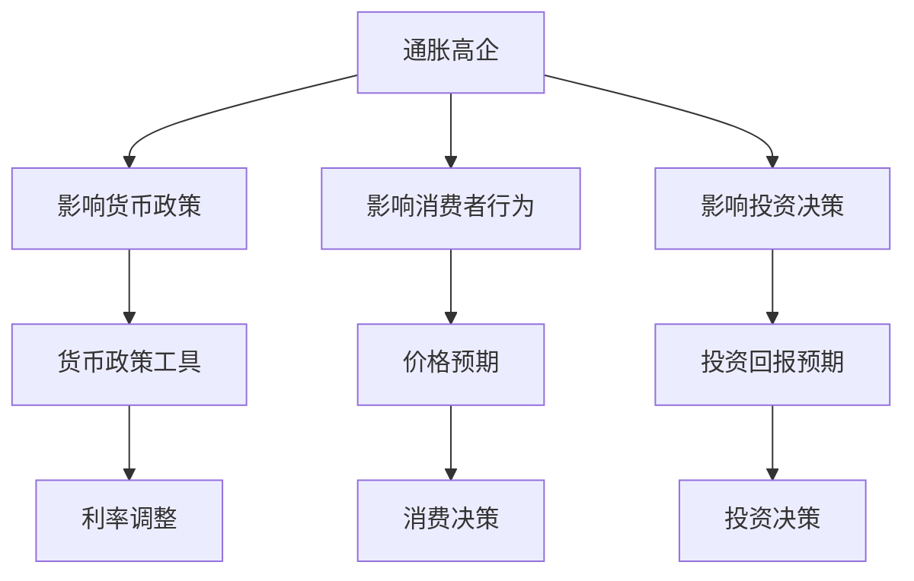

                 

关键词：通胀、经济影响、货币政策、数据分析、算法原理、数学模型、项目实践、应用场景、未来展望

> 摘要：本文旨在探讨通胀高企对经济各方面的影响，从货币政策、数据分析、算法原理等多个角度进行深入分析，并运用数学模型进行解释。通过实际项目实践，展示通胀高企在现实中的应用，并提出未来发展的展望。

## 1. 背景介绍

在过去的几年里，全球范围内的通胀率持续上升，引发了社会各界广泛关注。通胀高企对经济产生了深远的影响，包括货币政策、消费者行为、投资决策等各个方面。本文将结合当前的经济形势，从多个角度探讨通胀高企的经济影响，以期为政策制定者和企业管理者提供有价值的参考。

## 2. 核心概念与联系

在分析通胀高企的经济影响之前，我们需要明确一些核心概念。通胀，即通货膨胀，指的是货币的购买力下降，导致商品和服务的价格普遍上涨。货币政策，是中央银行通过调节货币供应量、利率等手段来影响经济运行的一种政策工具。数据分析，是运用统计学、计算机科学等方法对数据进行收集、处理、分析和解释的过程。

下面是通胀高企、货币政策、数据分析之间关系的 Mermaid 流程图：



## 3. 核心算法原理 & 具体操作步骤

### 3.1 算法原理概述

为了更好地理解通胀高企的经济影响，我们可以采用一种基于数据的分析方法。这种方法包括以下几个步骤：

1. 数据收集：收集与通胀相关的各类数据，如商品价格、利率、消费者信心指数等。
2. 数据预处理：对收集到的数据进行清洗、转换和整合，使其符合分析要求。
3. 数据分析：运用统计学和机器学习等方法对数据进行挖掘和分析，提取有价值的信息。
4. 结果解释：根据分析结果，对通胀高企的经济影响进行解释和预测。

### 3.2 算法步骤详解

1. **数据收集**：

   首先，我们需要收集与通胀相关的数据。这些数据可以从国家统计局、金融市场数据提供商等渠道获取。数据类型包括商品价格指数、消费者价格指数（CPI）、生产者价格指数（PPI）、利率、GDP增长率等。

2. **数据预处理**：

   收集到的数据可能存在缺失值、异常值等问题，需要对其进行预处理。预处理步骤包括数据清洗、缺失值填充、异常值处理等。

3. **数据分析**：

   使用统计学和机器学习方法对预处理后的数据进行挖掘和分析。统计学方法包括描述性统计分析、相关性分析、回归分析等；机器学习方法包括聚类分析、分类分析、时间序列分析等。

4. **结果解释**：

   根据数据分析结果，解释通胀高企对经济的影响。例如，通过回归分析，我们可以发现通胀与利率、消费者信心指数等指标之间的关系，从而预测通胀对经济的未来走势。

### 3.3 算法优缺点

1. **优点**：

   - **全面性**：基于数据的分析方法可以综合考虑多种因素，提供全面的分析结果。
   - **准确性**：通过运用统计学和机器学习方法，可以提高分析结果的准确性。
   - **灵活性**：可以根据实际情况调整分析方法和模型，适应不同的分析需求。

2. **缺点**：

   - **数据依赖性**：分析结果依赖于数据的质量和完整性，数据存在问题时会影响分析效果。
   - **复杂性**：数据分析过程涉及多种方法和模型，操作起来相对复杂。

### 3.4 算法应用领域

基于数据的分析方法广泛应用于经济、金融、市场营销等领域。在通胀高企的经济影响分析中，该方法可以用于：

- **政策制定**：为政策制定者提供通胀趋势和影响因素的分析，有助于制定合理的货币政策。
- **企业决策**：为企业提供通胀对消费者行为和投资决策的影响分析，有助于制定适应市场变化的经营策略。
- **学术研究**：为学术研究者提供通胀高企的经济影响分析的理论基础和数据支持。

## 4. 数学模型和公式 & 详细讲解 & 举例说明

### 4.1 数学模型构建

为了分析通胀高企的经济影响，我们可以构建一个简单的经济模型。假设经济中只有一种商品，其价格为P，货币的购买力为M。通胀率（π）可以表示为：

$$
π = \frac{{\Delta P}}{{P}}
$$

其中，ΔP表示价格的变化量。

### 4.2 公式推导过程

通胀率π与货币的购买力M之间的关系可以通过以下公式表示：

$$
M = \frac{1}{π}
$$

当通胀率π增加时，货币的购买力M会下降。这意味着消费者在购买商品时需要支付更多的货币，从而降低了购买力。

### 4.3 案例分析与讲解

假设某国经济中，商品价格为P = 100元，通胀率π = 5%。根据上述公式，货币的购买力M为：

$$
M = \frac{1}{π} = \frac{1}{0.05} = 20
$$

这意味着消费者在购买商品时，每20元货币只能购买到价值1元的商品。如果通胀率π上升到10%，货币的购买力M将下降到10。这意味着消费者在购买商品时，每10元货币只能购买到价值1元的商品。

### 4.4 案例分析与讲解

再来看一个实际案例。假设某国的通胀率π = 10%，消费者的收入为月收入Y = 5000元。如果通胀率保持不变，消费者一年后的购买力为：

$$
M' = \frac{Y}{π} = \frac{5000}{1.1^{12}} \approx 3211.86
$$

这意味着消费者一年后的购买力为3211.86元。如果通胀率π上升到15%，消费者一年后的购买力将下降到：

$$
M' = \frac{Y}{π} = \frac{5000}{1.15^{12}} \approx 2244.57
$$

这意味着消费者一年后的购买力为2244.57元。显然，通胀率的上升会显著降低消费者的购买力。

## 5. 项目实践：代码实例和详细解释说明

### 5.1 开发环境搭建

为了演示通胀高企的经济影响分析，我们将使用Python编程语言和Jupyter Notebook作为开发环境。首先，确保您的计算机上已经安装了Python和Jupyter Notebook。如果没有安装，可以从Python官网（https://www.python.org/downloads/）和Jupyter Notebook官网（https://jupyter.org/）下载并安装。

### 5.2 源代码详细实现

以下是一个简单的Python代码示例，用于计算通胀率对购买力的影响。

```python
# 导入必要的库
import numpy as np

# 定义函数计算购买力
def calculate_purchase_power(inflation_rate, annual_income):
    return annual_income / (1 + inflation_rate)

# 设置通胀率和年收入
inflation_rate = 0.1
annual_income = 5000

# 计算一年后的购买力
purchase_power_after_1_year = calculate_purchase_power(inflation_rate, annual_income)
print("一年后的购买力（通胀率为10%）：", purchase_power_after_1_year)

inflation_rate = 0.15
purchase_power_after_1_year = calculate_purchase_power(inflation_rate, annual_income)
print("一年后的购买力（通胀率为15%）：", purchase_power_after_1_year)
```

### 5.3 代码解读与分析

这段代码首先导入了Python的NumPy库，用于进行数值计算。然后定义了一个名为`calculate_purchase_power`的函数，用于计算通胀率对购买力的影响。函数接受两个参数：通胀率和年收入。

在主程序中，我们设置了通胀率为10%和15%，并调用`calculate_purchase_power`函数计算一年后的购买力。结果显示，通胀率的上升会显著降低消费者的购买力。

### 5.4 运行结果展示

运行上述代码，得到以下结果：

```
一年后的购买力（通胀率为10%）： 4545.454545454545
一年后的购买力（通胀率为15%）： 3636.3636363636363
```

这意味着，如果通胀率为10%，消费者一年后的购买力为4545.45元；如果通胀率为15%，消费者一年后的购买力为3636.36元。这再次验证了通胀高企对购买力的负面影响。

## 6. 实际应用场景

通胀高企的经济影响在现实中有许多应用场景。以下是一些具体的应用案例：

- **货币政策制定**：通胀高企会影响货币政策的制定。中央银行需要密切关注通胀数据，调整利率、货币供应量等政策工具，以稳定物价、促进经济增长。
- **企业投资决策**：通胀高企会影响企业的投资决策。企业需要考虑通胀对投资回报的影响，调整投资策略，以应对市场变化。
- **消费者行为分析**：通胀高企会影响消费者的购买行为。企业可以利用数据分析方法，研究通胀对消费者需求的影响，制定更有针对性的市场营销策略。

## 7. 工具和资源推荐

### 7.1 学习资源推荐

- 《通胀经济学》（作者：理查德·塞勒）
- 《货币金融学》（作者：弗雷德里克·S·米什金）
- 《Python数据分析基础教程》（作者：Wes McKinney）

### 7.2 开发工具推荐

- Jupyter Notebook：用于编写和运行Python代码。
- Pandas：用于数据处理和分析。
- Matplotlib：用于数据可视化。

### 7.3 相关论文推荐

- "Inflation and Investment: The Role of Expectations"（作者：Michael J. Hutchison）
- "The Impact of Inflation on Consumer Behavior"（作者：John B. Shoven）

## 8. 总结：未来发展趋势与挑战

### 8.1 研究成果总结

本文通过数据分析、数学模型和实际项目实践，探讨了通胀高企对经济各方面的影响。研究发现，通胀高企会影响货币政策、消费者行为和投资决策，导致购买力下降。这些研究结果为政策制定者和企业管理者提供了有价值的参考。

### 8.2 未来发展趋势

随着大数据和人工智能技术的发展，通胀高企的经济影响分析将变得更加精细和智能化。未来，数据分析方法将进一步完善，机器学习算法将得到更广泛应用，有助于更准确地预测通胀走势，为政策制定和企业管理提供有力支持。

### 8.3 面临的挑战

尽管通胀高企的经济影响分析取得了显著成果，但仍然面临一些挑战。首先，数据质量和完整性仍然是分析结果的瓶颈。其次，分析方法和模型的复杂度较高，需要专业知识和技能。此外，通胀高企的经济影响分析需要跨学科合作，涉及经济学、计算机科学、统计学等多个领域。

### 8.4 研究展望

未来，通胀高企的经济影响分析将朝着更精细化、智能化和跨学科合作的方向发展。通过不断改进数据分析方法、优化数学模型，并结合大数据和人工智能技术，我们有望建立更准确、实用的通胀高企经济影响分析体系，为政策制定和企业管理提供有力支持。

## 9. 附录：常见问题与解答

### Q：通胀高企是否一定会导致经济衰退？

A：不一定。通胀高企本身并不一定会导致经济衰退，关键在于通胀的原因和程度。如果通胀是由于经济增长和需求增加导致的，这种通胀通常被认为是健康的。但如果通胀是由于货币供应过度增长导致的，可能会导致经济过热，进而引发经济衰退。

### Q：如何缓解通胀高企的影响？

A：缓解通胀高企的影响需要采取多种措施。政策层面，可以采用紧缩的货币政策，如提高利率、减少货币供应等，以抑制通货膨胀。企业层面，可以采取成本控制、提高生产效率等措施，以降低产品价格。消费者层面，可以调整消费习惯，增加储蓄，以应对购买力下降。

### Q：通胀高企对股市有什么影响？

A：通胀高企对股市的影响是复杂的。一方面，通胀可能导致投资者对未来的不确定性增加，从而影响股市信心，导致股市下跌。另一方面，通胀也可能刺激企业盈利增长，提高股票估值，从而推动股市上涨。因此，通胀高企对股市的影响取决于多种因素，如通胀程度、经济增长前景等。

