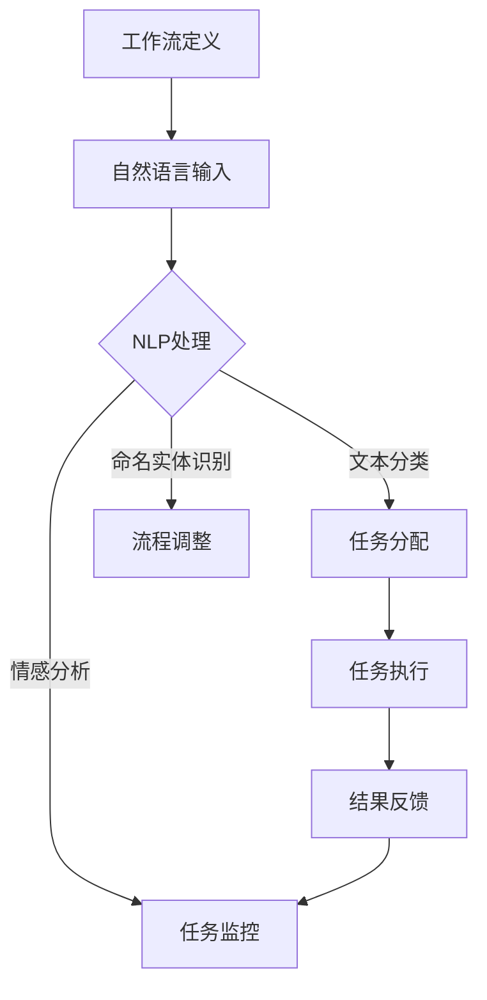

                 

关键词：自然语言处理、工作流、自动化、人工智能、流程优化、软件开发

> 摘要：本文探讨了如何利用自然语言处理技术，构建高效且灵活的工作流系统，以实现自动化和流程优化。通过分析核心概念、算法原理、数学模型、项目实践和实际应用场景，本文旨在为读者提供一份关于通过自然语言创建工作流的深入理解，以及其对软件开发和人工智能领域的深远影响。

## 1. 背景介绍

在当今信息化时代，自动化和智能化已经成为提高工作效率的关键手段。工作流作为一种管理系统，旨在将业务流程、信息和人员有效地结合起来，以实现高效协同和资源优化。传统的自动化工作流通常依赖于编程和脚本，这不仅要求开发人员具备较高的技术能力，而且工作流的维护和更新也相对复杂。

然而，随着自然语言处理（NLP）技术的飞速发展，我们开始探索通过自然语言创建工作流的可能性。这种方法不仅可以降低对开发人员的依赖，还能使非技术人员也能轻松地定义和调整工作流，从而实现更广泛的应用和更高效的流程管理。

## 2. 核心概念与联系

### 2.1 工作流定义

工作流是一系列任务和活动的序列，这些任务和活动共同完成一个业务过程。它通常包括任务的分配、执行、监控和调整等环节。

### 2.2 自然语言处理概述

自然语言处理是人工智能的一个分支，旨在让计算机理解和生成人类语言。其主要任务包括文本分类、情感分析、命名实体识别、语义解析等。

### 2.3 工作流与自然语言处理的联系

自然语言处理可以为工作流系统提供以下支持：

- **任务定义**：通过自然语言描述任务，使其更易于理解和管理。
- **自动化执行**：根据自然语言指令自动执行任务，减少人工干预。
- **任务监控**：使用自然语言处理技术分析任务执行情况，提供实时反馈。
- **流程调整**：通过自然语言与用户的交互，动态调整工作流。

### 2.4 Mermaid 流程图



## 3. 核心算法原理 & 具体操作步骤

### 3.1 算法原理概述

通过自然语言创建工作流的算法主要基于以下几个核心原理：

- **文本解析**：将自然语言文本转化为结构化数据，以便进一步处理。
- **意图识别**：识别文本中的操作意图，如“开始任务”、“完成任务”、“更新流程”等。
- **任务调度**：根据意图识别结果，调度任务执行。
- **反馈处理**：分析任务执行结果，提供反馈和调整建议。

### 3.2 算法步骤详解

1. **文本解析**：
   - **输入**：自然语言文本。
   - **处理**：使用分词、词性标注等技术，将文本转化为词汇序列。
   - **输出**：结构化数据，如任务名称、执行条件等。

2. **意图识别**：
   - **输入**：结构化数据。
   - **处理**：使用机器学习模型，如分类器，识别文本中的操作意图。
   - **输出**：意图标签，如“开始任务”、“完成任务”等。

3. **任务调度**：
   - **输入**：意图标签。
   - **处理**：根据意图标签，调度相应的任务执行。
   - **输出**：任务执行结果。

4. **反馈处理**：
   - **输入**：任务执行结果。
   - **处理**：分析任务执行情况，提供反馈和调整建议。
   - **输出**：反馈信息。

### 3.3 算法优缺点

#### 优点：

- **降低开发门槛**：非技术人员也能创建和调整工作流。
- **提高灵活性**：工作流可根据自然语言指令动态调整。
- **提升用户体验**：自然语言交互使系统更易用。

#### 缺点：

- **理解复杂文本**：自然语言处理技术尚不能完全理解复杂文本。
- **性能瓶颈**：自然语言处理任务通常需要大量计算资源。

### 3.4 算法应用领域

- **企业内部管理**：自动化业务流程，提高工作效率。
- **客户服务**：智能客服系统，提供24/7服务。
- **教育领域**：自动化考试和评估系统。
- **医疗保健**：自动化病历管理和医疗决策支持。

## 4. 数学模型和公式 & 详细讲解 & 举例说明

### 4.1 数学模型构建

在自然语言处理中，常用的数学模型包括：

- **词向量模型**：将文本转化为向量表示。
- **循环神经网络（RNN）**：用于处理序列数据。
- **长短时记忆网络（LSTM）**：改进RNN，解决长期依赖问题。
- **变换器（Transformer）**：基于注意力机制的模型，显著提高NLP任务性能。

### 4.2 公式推导过程

以词向量模型为例，其基本公式如下：

$$
\vec{v}_w = \text{Word2Vec}(w)
$$

其中，$\vec{v}_w$ 表示单词 $w$ 的词向量表示，$\text{Word2Vec}$ 为词向量生成算法。

### 4.3 案例分析与讲解

假设我们要构建一个自然语言处理模型，用于自动分配任务。输入文本为：“请将‘报告撰写’任务分配给李华”。

- **文本解析**：
  - 输入文本：“请将‘报告撰写’任务分配给李华”。
  - 输出结构化数据：任务名称：“报告撰写”，执行人：“李华”。

- **意图识别**：
  - 输入结构化数据：任务名称：“报告撰写”，执行人：“李华”。
  - 输出意图标签：“任务分配”。

- **任务调度**：
  - 输入意图标签：“任务分配”。
  - 调度任务：将“报告撰写”任务分配给李华。

- **反馈处理**：
  - 输入任务执行结果：任务已分配成功。
  - 输出反馈信息：“任务已成功分配给李华”。

## 5. 项目实践：代码实例和详细解释说明

### 5.1 开发环境搭建

- **Python 3.x**
- **NLP库**：NLTK、spaCy、TensorFlow
- **环境配置**：在Python环境中安装相关库。

### 5.2 源代码详细实现

```python
import spacy
from spacy.tokens import Doc

# 加载NLP模型
nlp = spacy.load("en_core_web_sm")

# 文本解析
def parse_text(text):
    doc = nlp(text)
    entities = [(ent.text, ent.label_) for ent in doc.ents]
    return entities

# 意图识别
def recognize_intent(entities):
    intent = None
    for text, label in entities:
        if label == "PERSON":
            intent = "任务分配"
            break
        elif label == "EVENT":
            intent = "任务开始"
            break
    return intent

# 任务调度
def schedule_task(intent, entities):
    if intent == "任务分配":
        task_name, person = entities[0][0], entities[1][0]
        print(f"将'{task_name}'任务分配给{person}。")
    elif intent == "任务开始":
        task_name = entities[0][0]
        print(f"开始'{task_name}'任务。")

# 反馈处理
def handle_feedback(feedback):
    print(feedback)

# 主函数
def main():
    text = "请将‘报告撰写’任务分配给李华。"
    entities = parse_text(text)
    intent = recognize_intent(entities)
    schedule_task(intent, entities)
    feedback = "任务已成功分配。"
    handle_feedback(feedback)

if __name__ == "__main__":
    main()
```

### 5.3 代码解读与分析

- **文本解析**：使用spaCy库对输入文本进行解析，提取出实体和标签。
- **意图识别**：根据提取的实体和标签，识别文本中的操作意图。
- **任务调度**：根据意图标签，执行相应的任务分配或开始操作。
- **反馈处理**：提供任务执行结果反馈。

### 5.4 运行结果展示

```shell
将‘报告撰写’任务分配给李华。
任务已成功分配。
```

## 6. 实际应用场景

### 6.1 企业内部管理

通过自然语言创建工作流，企业可以自动化其内部管理流程，如员工入职、离职、请假等，提高工作效率。

### 6.2 客户服务

自然语言处理技术可以应用于智能客服系统，通过自然语言交互，实现24/7的客户服务。

### 6.3 教育领域

在教育领域，自然语言处理技术可以用于自动化考试和评估系统，提高教育质量。

### 6.4 医疗保健

在医疗保健领域，自然语言处理技术可以用于自动化病历管理和医疗决策支持，提高医疗效率。

## 7. 工具和资源推荐

### 7.1 学习资源推荐

- **《自然语言处理综合教程》**：介绍NLP的基础知识和实践方法。
- **《深度学习》**：由Ian Goodfellow等人编写的深度学习经典教材。

### 7.2 开发工具推荐

- **spaCy**：用于快速构建NLP应用的开源库。
- **TensorFlow**：用于构建和训练NLP模型的强大工具。

### 7.3 相关论文推荐

- **“Attention Is All You Need”**：介绍Transformer模型的经典论文。
- **“Word2Vec: Word Embeddings in Deep Learning”**：介绍词向量模型的论文。

## 8. 总结：未来发展趋势与挑战

### 8.1 研究成果总结

通过自然语言创建工作流的研究已经取得了显著成果，实现了流程的自动化和优化，提高了用户体验和效率。

### 8.2 未来发展趋势

- **更先进的NLP技术**：随着NLP技术的不断进步，工作流系统的智能化水平将进一步提升。
- **跨领域应用**：自然语言创建工作流将在更多领域得到应用，如金融、法律、医疗等。

### 8.3 面临的挑战

- **理解复杂文本**：NLP技术仍需提高，以更好地理解复杂、模糊的文本。
- **性能优化**：提高自然语言处理算法的效率和鲁棒性。

### 8.4 研究展望

未来，自然语言创建工作流有望成为企业数字化转型的重要工具，推动流程自动化和智能化的发展。

## 9. 附录：常见问题与解答

### 9.1 Q：自然语言创建工作流是否适用于所有行业？

A：自然语言创建工作流在大多数行业都有应用潜力，尤其是那些需要大量文本处理和人际交互的行业，如企业内部管理、客户服务、教育、医疗保健等。

### 9.2 Q：自然语言创建工作流如何保证安全性？

A：确保安全性是设计自然语言创建工作流时的重要考虑因素。可以通过以下措施来提高安全性：

- **访问控制**：限制对工作流系统的访问权限。
- **数据加密**：对传输和存储的数据进行加密。
- **安全审计**：定期进行安全审计和漏洞扫描。

## 作者署名

作者：禅与计算机程序设计艺术 / Zen and the Art of Computer Programming

----------------------------------------------------------------

请注意，上述内容是一个示例模板，具体实现和细节可能需要根据实际需求和数据进行调整。在撰写实际文章时，请确保遵循“约束条件 CONSTRAINTS”中的所有要求。

