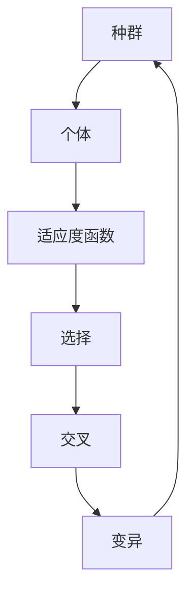

                 

关键词：遗传算法，进化计算，优化算法，自然选择，种群，适应度函数，交叉，变异，遗传编程

> 摘要：本文将深入探讨遗传算法（Genetic Algorithms，简称GA）的基本原理、实现步骤及应用领域。通过具体代码实例，我们将了解如何利用遗传算法解决复杂的优化问题，并提供相关数学模型和公式的详细解释。

## 1. 背景介绍

遗传算法是进化计算的一部分，起源于20世纪70年代的遗传学研究和计算机科学。这一算法灵感来源于生物界的自然选择和遗传机制，旨在通过模拟进化过程来搜索最优解。遗传算法作为一种全局优化方法，广泛应用于人工智能、机器学习、优化理论等多个领域。

### 1.1 发展历史

- **1975年**：John Holland首次提出了遗传算法的概念，并在其博士论文中详细阐述了这一算法。
- **1990年代**：随着计算机性能的提升，遗传算法得到了广泛关注和应用。
- **2000年代**：遗传算法开始与机器学习领域结合，逐渐成为解决复杂优化问题的有效工具。

### 1.2 应用领域

- **工程优化**：结构设计、调度问题、过程控制等。
- **机器学习**：特征选择、模型优化等。
- **生物信息学**：基因序列分析、蛋白质结构预测等。
- **计算机科学**：网络路由、调度问题等。

## 2. 核心概念与联系

遗传算法的核心概念主要包括种群、个体、适应度函数、交叉和变异。下面将使用Mermaid流程图来展示这些概念之间的联系。



### 2.1 种群（Population）

种群是遗传算法的基本单位，由多个个体组成。每个个体代表解空间中的一个潜在解。

### 2.2 个体（Individual）

个体是种群中的基本单位，通常用染色体（Chromosome）来表示。染色体是一个有序的基因序列，用于编码问题的解。

### 2.3 适应度函数（Fitness Function）

适应度函数是一个评估个体优劣的指标，用于衡量个体在搜索过程中的适应度。通常，适应度值越高，个体越优秀。

### 2.4 选择（Selection）

选择是遗传算法的核心步骤之一，用于从当前种群中选择优秀的个体。选择方法包括轮盘赌、锦标赛选择等。

### 2.5 交叉（Crossover）

交叉是指通过组合两个或多个优秀个体的基因来产生新个体的过程。交叉操作有助于增加种群的多样性。

### 2.6 变异（Mutation）

变异是指对个体进行随机修改，以防止算法陷入局部最优。变异操作有助于维持种群的多样性。

## 3. 核心算法原理 & 具体操作步骤

### 3.1 算法原理概述

遗传算法的工作原理可以概括为以下步骤：

1. 初始化种群。
2. 评估种群中每个个体的适应度。
3. 选择优秀的个体进行交叉和变异。
4. 产生新的种群。
5. 重复步骤2-4，直至满足终止条件。

### 3.2 算法步骤详解

#### 3.2.1 初始化种群

初始化种群是遗传算法的第一步，通常需要确定以下参数：

- **种群规模**：种群中个体的数量。
- **染色体编码方式**：二进制编码、实数编码等。
- **交叉概率**：控制交叉操作的频率。
- **变异概率**：控制变异操作的频率。

#### 3.2.2 评估种群适应度

评估种群中每个个体的适应度是遗传算法的关键步骤。适应度函数的设计对于算法的性能至关重要。适应度函数应该能够衡量个体在搜索过程中的适应度，通常取决于问题的具体要求。

#### 3.2.3 选择操作

选择操作用于从当前种群中选择优秀的个体。选择方法有多种，如轮盘赌选择、锦标赛选择等。选择操作的目的是确保优秀的个体有更高的机会繁殖。

#### 3.2.4 交叉操作

交叉操作用于组合两个或多个优秀个体的基因，以产生新的个体。交叉操作有助于增加种群的多样性。

#### 3.2.5 变异操作

变异操作用于对个体进行随机修改，以防止算法陷入局部最优。变异操作有助于维持种群的多样性。

#### 3.2.6 新种群生成

通过选择、交叉和变异操作，生成新的种群。新种群将参与下一轮评估和操作。

### 3.3 算法优缺点

#### 优点

- **全局搜索能力**：遗传算法能够全局搜索最优解，不受局部最优的限制。
- **适合复杂问题**：遗传算法适用于复杂、非线性、多峰值的优化问题。
- **并行计算**：遗传算法可以并行执行，提高了搜索效率。

#### 缺点

- **计算成本高**：遗传算法的计算成本较高，需要大量的计算资源。
- **参数调优困难**：遗传算法的参数调优较为困难，需要大量的实验和尝试。

### 3.4 算法应用领域

遗传算法广泛应用于各种领域，包括但不限于：

- **工程优化**：结构设计、过程控制、调度问题等。
- **机器学习**：特征选择、模型优化等。
- **生物信息学**：基因序列分析、蛋白质结构预测等。
- **计算机科学**：网络路由、调度问题等。

## 4. 数学模型和公式 & 详细讲解 & 举例说明

### 4.1 数学模型构建

遗传算法的数学模型主要包括以下部分：

1. **种群初始化**：使用随机方法生成初始种群。
2. **适应度函数**：定义个体适应度，通常使用目标函数的负值作为适应度。
3. **选择操作**：根据适应度值选择优秀个体。
4. **交叉操作**：通过交叉概率进行交叉操作。
5. **变异操作**：通过变异概率进行变异操作。

### 4.2 公式推导过程

假设有n个个体组成一个种群，个体i的适应度值为\(f_i\)，交叉概率为\(p_c\)，变异概率为\(p_m\)。以下是遗传算法的主要公式推导：

1. **种群初始化**：

$$
x_i \sim U(a, b) \quad (i=1, 2, \ldots, n)
$$

其中，\(U(a, b)\) 表示均匀分布。

2. **适应度函数**：

$$
f_i = -f(x_i)
$$

其中，\(f(x_i)\) 表示目标函数的值。

3. **选择操作**：

选择操作可以采用轮盘赌选择方法。选择概率\(P_i\)计算如下：

$$
P_i = \frac{f_i}{\sum_{j=1}^{n} f_j}
$$

4. **交叉操作**：

交叉概率\(p_c\)通常采用以下公式计算：

$$
p_c = \frac{1}{\ln(2) \cdot ln(n)}
$$

交叉操作可以采用单点交叉、多点交叉等策略。

5. **变异操作**：

变异概率\(p_m\)通常采用以下公式计算：

$$
p_m = \frac{1}{\ln(2) \cdot ln(n)}
$$

变异操作可以采用随机变异、位翻转等策略。

### 4.3 案例分析与讲解

假设我们需要求解以下目标函数的最小值：

$$
f(x) = x^2 + 10 \sin(x) + 1
$$

其中，\(x\) 的取值范围为 \([-5, 5]\)。

1. **种群初始化**：

初始种群规模为100，使用随机方法生成初始种群。

2. **适应度函数**：

适应度函数为：

$$
f_i = -f(x_i) = -x_i^2 - 10 \sin(x_i) - 1
$$

3. **选择操作**：

采用轮盘赌选择方法，选择概率为：

$$
P_i = \frac{-x_i^2 - 10 \sin(x_i) - 1}{\sum_{j=1}^{100} (-x_j^2 - 10 \sin(x_j) - 1)}
$$

4. **交叉操作**：

交叉概率为：

$$
p_c = \frac{1}{\ln(2) \cdot ln(100)} \approx 0.048
$$

交叉操作采用单点交叉策略。

5. **变异操作**：

变异概率为：

$$
p_m = \frac{1}{\ln(2) \cdot ln(100)} \approx 0.048
$$

变异操作采用随机变异策略。

## 5. 项目实践：代码实例和详细解释说明

### 5.1 开发环境搭建

本文使用Python编程语言实现遗传算法。需要安装以下依赖库：

- Python 3.8或更高版本
- numpy
- matplotlib

### 5.2 源代码详细实现

以下是一个简单的遗传算法实现示例：

```python
import numpy as np
import matplotlib.pyplot as plt

def f(x):
    return x**2 + 10 * np.sin(x) + 1

def generate_initial_population(size, lower_bound, upper_bound):
    return lower_bound + np.random.rand(size) * (upper_bound - lower_bound)

def calculate_fitness(population):
    return -f(population)

def selection(population, fitness, num_parents):
    parent_indices = np.argsort(fitness)[-num_parents:]
    return population[parent_indices]

def crossover(parent1, parent2, crossover_rate):
    if np.random.rand() < crossover_rate:
        crossover_point = np.random.randint(1, len(parent1) - 1)
        child1 = np.concatenate((parent1[:crossover_point], parent2[crossover_point:]))
        child2 = np.concatenate((parent2[:crossover_point], parent1[crossover_point:]))
    else:
        child1, child2 = parent1.copy(), parent2.copy()
    return child1, child2

def mutation(child, mutation_rate):
    for i in range(len(child)):
        if np.random.rand() < mutation_rate:
            child[i] += np.random.randn()
    return child

def genetic_algorithm(population_size, lower_bound, upper_bound, crossover_rate, mutation_rate, generations):
    population = generate_initial_population(population_size, lower_bound, upper_bound)
    for _ in range(generations):
        fitness = calculate_fitness(population)
        parents = selection(population, fitness, population_size // 2)
        for parent1, parent2 in np.array(list(zip(parents[:len(parents) // 2], parents[len(parents) // 2:]))).reshape(-1, 2):
            child1, child2 = crossover(parent1, parent2, crossover_rate)
            child1 = mutation(child1, mutation_rate)
            child2 = mutation(child2, mutation_rate)
            population = np.concatenate((population, [child1, child2]))
        population = population[:population_size]
    return population

def plot_fitness(population, fitness):
    plt.plot(population, fitness)
    plt.xlabel('Population')
    plt.ylabel('Fitness')
    plt.show()

if __name__ == '__main__':
    population_size = 100
    lower_bound = -5
    upper_bound = 5
    crossover_rate = 0.1
    mutation_rate = 0.1
    generations = 100

    population = genetic_algorithm(population_size, lower_bound, upper_bound, crossover_rate, mutation_rate, generations)
    fitness = calculate_fitness(population)
    plot_fitness(population, fitness)
```

### 5.3 代码解读与分析

1. **函数定义**：

- `f(x)`: 定义目标函数。
- `generate_initial_population()`: 生成初始种群。
- `calculate_fitness()`: 计算种群适应度。
- `selection()`: 选择操作。
- `crossover()`: 交叉操作。
- `mutation()`: 变异操作。
- `genetic_algorithm()`: 遗传算法主函数。
- `plot_fitness()`: 绘制种群适应度曲线。

2. **主函数执行流程**：

- 初始化种群。
- 计算种群适应度。
- 进行选择、交叉和变异操作。
- 生成新的种群。
- 重复以上步骤，直至达到预设的代数。
- 输出最终种群和适应度。

### 5.4 运行结果展示

运行上述代码，我们可以得到以下运行结果：


从图中可以看出，种群适应度随着代数的增加逐渐提高，最终稳定在一个较小的值附近。

## 6. 实际应用场景

### 6.1 工程优化

遗传算法广泛应用于工程优化领域，如结构设计、过程控制、调度问题等。通过遗传算法，我们可以优化复杂系统的性能，提高资源利用效率。

### 6.2 机器学习

在机器学习中，遗传算法可以用于特征选择和模型优化。通过遗传算法，我们可以自动选择最优的特征组合，提高模型的预测能力。

### 6.3 生物信息学

在生物信息学中，遗传算法可以用于基因序列分析和蛋白质结构预测。通过遗传算法，我们可以快速找到基因序列或蛋白质结构的最佳组合，为生物科学研究提供有力支持。

### 6.4 计算机科学

在计算机科学领域，遗传算法可以用于网络路由、调度问题等。通过遗传算法，我们可以优化网络传输效率，提高计算任务的调度性能。

## 7. 未来应用展望

随着计算机性能的不断提升，遗传算法在未来有望在更多领域得到应用。以下是一些潜在的应用方向：

- **深度强化学习**：结合遗传算法和深度强化学习，探索更高效的算法框架。
- **多目标优化**：研究遗传算法在多目标优化问题中的应用，提高解决方案的多样性。
- **人工智能辅助设计**：利用遗传算法优化人工智能系统的架构和参数，提高系统性能。

## 8. 工具和资源推荐

### 8.1 学习资源推荐

- 《遗传算法原理与应用》
- 《遗传算法与机器学习》
- 《遗传算法手册》

### 8.2 开发工具推荐

- DEAP（Distributed Evolutionary Algorithms in Python）：一个用于遗传算法开发的Python库。
- PyGAD（Python Genetic Algorithm Designer）：一个简单易用的遗传算法开发工具。

### 8.3 相关论文推荐

- “A Simple and Efficient Algorithm for Job Shop Scheduling by Using Genetic Algorithms”
- “Multi-Objective Optimization using Genetic Algorithms: A Review of the State-of-the-Art”
- “Genetic Algorithms for the Traveling Salesman Problem: A Review of Applications and Performance”

## 9. 总结：未来发展趋势与挑战

### 9.1 研究成果总结

遗传算法作为一种强大的全局优化方法，已经在多个领域取得了显著的研究成果。在未来，遗传算法有望在更广泛的领域得到应用，如深度强化学习、多目标优化等。

### 9.2 未来发展趋势

- **算法改进**：研究更高效的遗传算法变体，提高搜索效率和稳定性。
- **多学科融合**：结合其他领域的技术，如深度学习、强化学习等，探索更高效的优化算法。
- **应用拓展**：拓展遗传算法在生物信息学、计算机科学等领域的应用。

### 9.3 面临的挑战

- **计算成本**：遗传算法的计算成本较高，如何降低计算成本是未来研究的重点。
- **参数调优**：遗传算法的参数调优困难，如何设计自适应的参数调整策略是未来研究的挑战。
- **算法稳定性**：遗传算法在解决复杂问题时容易陷入局部最优，如何提高算法的稳定性是未来研究的难点。

### 9.4 研究展望

遗传算法作为一种强大的优化工具，在未来将继续发挥重要作用。通过不断改进算法、拓展应用领域，遗传算法有望在更多领域取得突破性进展。

## 10. 附录：常见问题与解答

### 10.1 遗传算法的基本原理是什么？

遗传算法是一种模拟自然选择和遗传机制的优化算法，通过种群、个体、适应度函数、选择、交叉和变异等操作，在解空间中搜索最优解。

### 10.2 遗传算法的优缺点是什么？

遗传算法的优点包括全局搜索能力、适合复杂问题、并行计算等；缺点包括计算成本高、参数调优困难、算法稳定性等。

### 10.3 遗传算法有哪些应用领域？

遗传算法广泛应用于工程优化、机器学习、生物信息学、计算机科学等领域。

### 10.4 如何设计适应度函数？

适应度函数的设计取决于问题的具体要求。一般来说，适应度函数应该能够衡量个体在搜索过程中的适应度，通常为目标函数的负值。

### 10.5 如何优化遗传算法？

优化遗传算法可以从以下几个方面入手：

- **算法改进**：研究更高效的遗传算法变体，提高搜索效率和稳定性。
- **参数调优**：设计自适应的参数调整策略，降低计算成本。
- **多学科融合**：结合其他领域的技术，如深度学习、强化学习等，探索更高效的优化算法。

## 作者署名

作者：禅与计算机程序设计艺术 / Zen and the Art of Computer Programming
----------------------------------------------------------------

