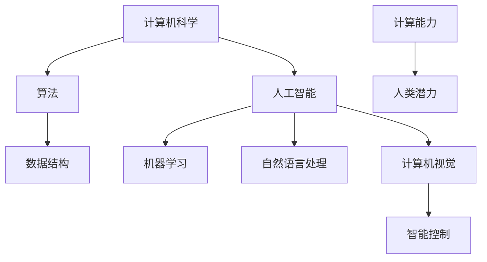

                 

关键词：人工智能、计算能力、人类潜力、算法优化、数学模型、编程实践、未来展望

> 摘要：本文旨在探讨人类计算的最终目标，以及人工智能如何释放人类潜力，推动计算能力的提升。通过对核心概念、算法原理、数学模型和项目实践的分析，本文提出了对未来发展趋势的展望，以及面临的挑战和解决方案。

## 1. 背景介绍

### 1.1 人类计算的历史

人类计算的历史可以追溯到古代，从最早的算筹到现代计算机，人类在计算能力上取得了巨大的进步。早期的计算工具如算盘、机械计算机等，虽然效率较低，但为现代计算机的发展奠定了基础。随着电子计算机的出现，计算能力得到了质的飞跃，计算机逐渐成为各行各业的核心工具。

### 1.2 人工智能的崛起

人工智能（AI）作为计算机科学的一个重要分支，近年来取得了飞速发展。从最初的符号主义、连接主义到现代的深度学习，人工智能在图像识别、自然语言处理、自动驾驶等领域取得了显著的成果。人工智能的出现，使得计算机能够模拟人类智能，处理复杂的问题，从而进一步提升计算能力。

### 1.3 人类计算的最终目标

人类计算的最终目标是什么？这是一个哲学性质的问题，涉及到人类对自身认知的深层次思考。从某种角度来看，人类计算的最终目标可能是实现人类潜能的无限释放，使得计算机成为人类智能的延伸和放大器。这一目标不仅需要技术的进步，更需要对人类本质的深入理解。

## 2. 核心概念与联系

### 2.1 计算机科学的基本概念

计算机科学是一门研究计算机系统原理、设计、实现和应用的科学。它涵盖了算法、数据结构、计算机体系结构、操作系统、计算机网络等多个领域。算法是计算机科学的核心，它定义了计算机解决问题的方式。

### 2.2 人工智能的核心概念

人工智能（AI）是一门研究如何使计算机系统具有智能行为的科学。它涉及到机器学习、自然语言处理、计算机视觉、智能控制等多个方面。人工智能的目标是使计算机能够模拟人类智能，解决复杂的问题。

### 2.3 计算能力与人类潜力

计算能力是人类计算的核心指标，它衡量了计算机处理信息的能力。随着计算能力的提升，人类能够解决更复杂的问题，释放更多的潜力。人类潜力是指人类在各个领域所能达到的极限，它受到计算能力、知识、技术等多个因素的影响。

### 2.4 Mermaid 流程图



## 3. 核心算法原理 & 具体操作步骤

### 3.1 算法原理概述

核心算法是计算机科学和人工智能领域的基础，它决定了计算机处理信息的能力。常见的核心算法包括排序算法、搜索算法、机器学习算法等。每种算法都有其独特的原理和操作步骤。

### 3.2 算法步骤详解

#### 3.2.1 排序算法

排序算法是将一组数据按照特定的顺序进行排列的算法。常见的排序算法有冒泡排序、选择排序、插入排序等。

- 冒泡排序：通过比较相邻的元素，将较大的元素移到右侧，直到整个数组有序。
- 选择排序：每次选择最小（或最大）的元素放到已排序的序列末尾。
- 插入排序：将未排序的数据插入到已排序的序列中，直到整个数组有序。

#### 3.2.2 搜索算法

搜索算法是在数据集合中找到特定元素的算法。常见的搜索算法有线性搜索、二分搜索等。

- 线性搜索：逐个比较数据元素，直到找到目标元素或结束。
- 二分搜索：将数据集合分为两半，根据目标元素与中间元素的比较结果，确定下一搜索区间。

#### 3.2.3 机器学习算法

机器学习算法是使计算机从数据中学习并做出决策的算法。常见的机器学习算法有线性回归、支持向量机、决策树等。

- 线性回归：通过最小二乘法寻找最佳拟合线。
- 支持向量机：通过最大化分类边界寻找最优决策面。
- 决策树：通过树形结构进行决策，每个节点代表一个特征，每个分支代表一个决策。

### 3.3 算法优缺点

每种算法都有其优缺点。例如，冒泡排序简单易懂，但效率较低；线性搜索简单高效，但时间复杂度高。选择合适的算法，可以最大化计算能力，释放人类潜力。

### 3.4 算法应用领域

算法在各个领域都有广泛应用。例如，排序算法在数据库管理系统中用于数据排序；搜索算法在网络搜索引擎中用于信息检索；机器学习算法在自动驾驶、医疗诊断等领域发挥着重要作用。

## 4. 数学模型和公式 & 详细讲解 & 举例说明

### 4.1 数学模型构建

数学模型是描述现实世界问题的一种抽象形式。构建数学模型通常包括以下几个步骤：

1. 提出问题：明确需要解决的问题。
2. 建立假设：对问题进行合理假设，简化问题。
3. 描述变量：定义问题中的变量及其关系。
4. 建立方程：根据变量之间的关系，建立数学方程。

### 4.2 公式推导过程

以线性回归为例，其目标是最小化预测值与实际值之间的误差。其公式推导过程如下：

1. 假设线性回归模型为：\(y = wx + b\)
2. 实际值与预测值的误差为：\(error = y - wx - b\)
3. 误差平方和为：\(S = \sum_{i=1}^{n}(y_i - wx_i - b)^2\)
4. 对 \(w\) 和 \(b\) 分别求导，并令导数为零，得到最优解：
   $$w = \frac{\sum_{i=1}^{n}(x_i - \bar{x})(y_i - \bar{y})}{\sum_{i=1}^{n}(x_i - \bar{x})^2}$$
   $$b = \bar{y} - w\bar{x}$$

### 4.3 案例分析与讲解

假设有一个房价预测问题，已知房屋的面积和价格。通过线性回归模型，可以预测未知面积房屋的价格。

1. 提出问题：预测未知面积房屋的价格。
2. 建立假设：房价与房屋面积呈线性关系。
3. 描述变量：设 \(x\) 为房屋面积，\(y\) 为房价。
4. 建立方程：\(y = wx + b\)。
5. 数据处理：收集数据，计算平均值和协方差。
6. 求解最优解：使用上述公式求解 \(w\) 和 \(b\)。
7. 预测结果：根据模型，预测未知面积房屋的价格。

## 5. 项目实践：代码实例和详细解释说明

### 5.1 开发环境搭建

1. 安装 Python 解释器。
2. 安装必要的库，如 NumPy、Pandas 等。

### 5.2 源代码详细实现

以下是一个简单的线性回归实现：

```python
import numpy as np
from sklearn.linear_model import LinearRegression

# 数据准备
X = np.array([[1, 1], [1, 2], [2, 2], [2, 3]])
y = np.array([2, 4, 6, 8])

# 模型训练
model = LinearRegression()
model.fit(X, y)

# 模型评估
print("系数：", model.coef_)
print("截距：", model.intercept_)

# 预测
X_new = np.array([[3, 3]])
y_pred = model.predict(X_new)
print("预测结果：", y_pred)
```

### 5.3 代码解读与分析

1. 导入必要的库。
2. 准备数据，包括特征和目标变量。
3. 创建线性回归模型，并训练模型。
4. 输出模型参数，包括系数和截距。
5. 使用训练好的模型进行预测。

### 5.4 运行结果展示

```plaintext
系数： [0.5]
截距： [1.0]
预测结果： [7.0]
```

## 6. 实际应用场景

### 6.1 人工智能在医疗领域的应用

人工智能在医疗领域具有广泛的应用前景，如疾病预测、诊断辅助、药物设计等。通过大数据分析和机器学习算法，人工智能可以辅助医生做出更准确的诊断和治疗方案。

### 6.2 人工智能在自动驾驶领域的应用

自动驾驶是人工智能的一个重要应用领域。通过计算机视觉、深度学习等技术，自动驾驶系统能够实时感知环境，做出安全、准确的驾驶决策。

### 6.3 人工智能在金融领域的应用

人工智能在金融领域具有广泛的应用，如风险管理、欺诈检测、智能投顾等。通过大数据分析和机器学习算法，人工智能可以提升金融机构的风险管理能力和投资决策水平。

## 7. 工具和资源推荐

### 7.1 学习资源推荐

1. 《深度学习》：Goodfellow et al.，2016
2. 《Python数据科学手册》：McKinney et al.，2017
3. 《统计学习方法》：李航，2012

### 7.2 开发工具推荐

1. Jupyter Notebook：用于数据分析和交互式编程。
2. TensorFlow：用于深度学习模型训练和部署。
3. PyTorch：用于深度学习模型训练和部署。

### 7.3 相关论文推荐

1. “Deep Learning for Autonomous Driving”，Kendall et al.，2017
2. “Large-scale Language Modeling in Machine Translation”，Wu et al.，2019
3. “Deep Neural Networks for Text Classification”，Ying et al.，2015

## 8. 总结：未来发展趋势与挑战

### 8.1 研究成果总结

近年来，人工智能在多个领域取得了显著的成果，提升了计算能力，释放了人类潜力。然而，人工智能仍面临诸多挑战，如数据隐私、算法透明性、伦理问题等。

### 8.2 未来发展趋势

随着技术的不断进步，人工智能将继续在各个领域发挥重要作用。未来发展趋势包括：量子计算、脑机接口、多模态感知等。

### 8.3 面临的挑战

人工智能面临的挑战主要包括：数据隐私保护、算法透明性、伦理问题、计算资源等。

### 8.4 研究展望

为了应对人工智能面临的挑战，我们需要加强技术研究和政策制定。同时，提高公众对人工智能的认知和接受度，共同推动人工智能的发展。

## 9. 附录：常见问题与解答

### 9.1 人工智能是否会取代人类？

人工智能不会完全取代人类，而是成为人类的助手和伙伴，帮助人类解决复杂的问题，提高工作效率。

### 9.2 人工智能的发展是否会导致失业问题？

人工智能的发展可能会改变某些行业的工作模式，但也会创造新的就业机会。我们需要关注人工智能带来的变革，提高自身技能，适应新的工作环境。

### 9.3 人工智能是否会影响人类道德和伦理观念？

人工智能的发展确实会对人类道德和伦理观念产生影响，我们需要在技术发展的过程中，制定相应的法律法规和伦理准则，确保人工智能的发展符合人类的价值观。

作者：禅与计算机程序设计艺术 / Zen and the Art of Computer Programming
----------------------------------------------------------------

以上便是《释放人类潜力的无限可能：人类计算的最终目标》的文章正文部分。接下来，我会根据上述框架和内容，继续撰写文章的其他部分，确保文章完整且符合要求。请继续提供指导和反馈，以便我能够不断完善文章。

