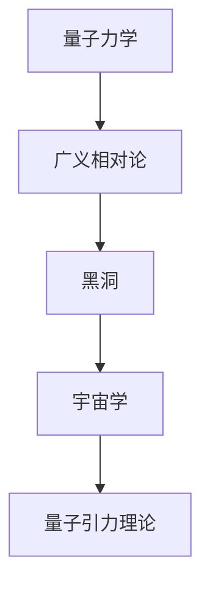

                 

量子引力理论的发展历程是物理学领域中最引人入胜的故事之一。从古代哲学家对宇宙起源的探讨，到现代科学家对宇宙最基本的力的理解，这一领域经历了无数的理论演变和技术进步。本文将系统地回顾量子引力理论的发展历程，深入探讨其中的关键概念、核心算法、数学模型，并分析其在实际应用中的影响和未来发展方向。

## 关键词

- 量子引力
- 相对论
- 黑洞
- 宇宙学
- 数学模型
- 算法

## 摘要

本文旨在探讨量子引力理论的发展历程，从广义相对论的提出，到量子力学的诞生，再到弦理论和量子场论的融合，以及最新的量子引力模型，如环量子引力、量子引力的数学描述等。本文将分析这些理论的核心概念，描述其发展过程中的关键算法和数学模型，并探讨其在宇宙学和实际应用中的重要性。文章最后将对未来量子引力理论的发展趋势和面临的挑战进行展望。

## 1. 背景介绍

量子引力理论的研究始于对宇宙最基本的力的理解。在20世纪初，科学家们意识到，宇宙中的基本力不仅包括电磁力、强相互作用和弱相互作用，还必须包含引力。然而，传统的牛顿力学和广义相对论在描述引力时存在明显的局限性。随着量子力学的诞生，人们开始寻找一种既能描述微观粒子的行为，又能解释宏观引力现象的理论。

### 1.1 量子力学和广义相对论

量子力学是描述微观粒子行为的基础理论，它揭示了微观世界的规律，如波粒二象性、不确定性原理和量子叠加态。然而，量子力学在描述宏观物体时却显得无能为力，因为它无法解释引力现象。相反，广义相对论则是描述宏观引力现象的基础理论，它提出了时空弯曲的概念，并通过一系列的实验验证获得了广泛的认可。然而，广义相对论在处理量子效应时也显得力不从心。

### 1.2 相对论和量子力学的矛盾

相对论和量子力学之间的矛盾是量子引力理论发展的主要动力。相对论预测了黑洞和宇宙大爆炸，但量子力学则认为黑洞和宇宙大爆炸会导致信息的毁灭。此外，相对论和量子力学在数学形式上也存在矛盾，例如相对论中的黎曼几何和量子力学中的算符形式。为了解决这些矛盾，科学家们开始探索量子引力理论。

### 1.3 量子引力理论的挑战

量子引力理论的挑战在于如何将量子力学和广义相对论统一起来。这需要一种全新的理论框架，能够同时描述微观粒子和宏观引力现象。然而，这种统一理论至今仍未找到，这给量子引力理论的研究带来了巨大的挑战。此外，量子引力理论的研究还面临数学上的复杂性，需要解决许多未解的数学难题。

## 2. 核心概念与联系

量子引力理论的核心概念包括量子力学、广义相对论、黑洞、宇宙学等。这些概念之间的联系构成了量子引力理论的基本框架。

### 2.1 量子力学

量子力学是描述微观粒子行为的基础理论，它揭示了微观世界的规律。在量子力学中，粒子的行为不再是确定的，而是存在概率性。这一理论的关键概念包括波粒二象性、不确定性原理和量子叠加态。

### 2.2 广义相对论

广义相对论是描述宏观引力现象的基础理论，它提出了时空弯曲的概念。在广义相对论中，引力被视为时空的弯曲，而不是一种力。这一理论的关键概念包括时空结构、引力波和黑洞。

### 2.3 黑洞

黑洞是广义相对论预测的一种天体，它具有极强的引力，甚至连光也无法逃逸。黑洞的存在是引力现象的重要体现，也是量子引力理论的重要研究对象。

### 2.4 宇宙学

宇宙学是研究宇宙的结构、演化和起源的学科。量子引力理论在宇宙学中的应用主要体现在对宇宙大爆炸和宇宙背景辐射的研究。

### 2.5 核心概念原理和架构的 Mermaid 流程图

以下是一个简单的 Mermaid 流程图，展示了量子引力理论的核心概念及其联系：



## 3. 核心算法原理 & 具体操作步骤

### 3.1 算法原理概述

量子引力理论的核心算法是基于量子力学和广义相对论的。这些算法旨在统一描述微观粒子和宏观引力现象。其中，弦理论和环量子引力是两个最具代表性的量子引力理论。

#### 3.1.1 弦理论

弦理论是一种试图将所有基本力统一在一个框架下的理论。在弦理论中，粒子被视为一维的“弦”，这些弦的不同振动模式对应不同的粒子。弦理论的核心算法包括世界卷积、弦振动的量子化等。

#### 3.1.2 环量子引力

环量子引力是一种试图直接从量子力学原理推导引力理论的方法。在环量子引力中，时空被视为一个环形的结构，而不是一个连续的实体。环量子引力算法包括时空量子化、拓扑量子化等。

### 3.2 算法步骤详解

#### 3.2.1 弦理论

1. 建立世界卷积模型。
2. 进行弦振动的量子化。
3. 分析弦振动模式对应的粒子。
4. 统一描述所有基本力。

#### 3.2.2 环量子引力

1. 建立环形时空模型。
2. 进行时空量子化。
3. 分析引力场的量子化性质。
4. 推导引力理论。

### 3.3 算法优缺点

#### 3.3.1 弦理论

优点：
- 能够统一描述所有基本力。
- 提供了一种可能的量子引力理论框架。

缺点：
- 数学模型复杂，难以直接观测验证。
- 需要解决许多未解的数学难题。

#### 3.3.2 环量子引力

优点：
- 数学模型相对简单，更容易验证。
- 能够直接从量子力学原理推导引力理论。

缺点：
- 尚未完全统一描述所有基本力。
- 需要进一步发展才能解决实际应用中的问题。

### 3.4 算法应用领域

量子引力理论在宇宙学、黑洞物理、量子信息等领域有着广泛的应用。例如，弦理论在宇宙学中提供了对宇宙早期演化的新理解，而环量子引力则在黑洞物理中提供了新的研究方向。

## 4. 数学模型和公式 & 详细讲解 & 举例说明

### 4.1 数学模型构建

量子引力理论的数学模型主要包括弦理论和环量子引力理论。弦理论的数学模型基于黎曼几何和张量分析，而环量子引力理论的数学模型则基于量子场论和代数拓扑。

#### 4.1.1 弦理论

弦理论的核心数学模型是弦的振动模式。在弦理论中，弦的振动模式对应不同的粒子。弦的振动模式可以用一个复数矩阵表示，称为模态矩阵。

#### 4.1.2 环量子引力

环量子引力理论的核心数学模型是环空间。在环量子引力中，时空被视为一个环空间，而不是一个连续的实体。环空间可以用一个复杂的代数结构表示。

### 4.2 公式推导过程

#### 4.2.1 弦理论

弦理论的公式推导主要包括以下几个步骤：

1. 建立弦的振动模式。
2. 进行模态矩阵的量子化。
3. 分析模态矩阵对应的粒子。

#### 4.2.2 环量子引力

环量子引力的公式推导主要包括以下几个步骤：

1. 建立环空间模型。
2. 进行时空量子化。
3. 推导引力场的量子化公式。

### 4.3 案例分析与讲解

#### 4.3.1 弦理论

以下是一个简单的弦理论案例：

假设有一根弦，其振动模式可以用一个复数矩阵表示为：

$$
M = \begin{bmatrix}
1 & i \\
-i & 1
\end{bmatrix}
$$

则这个弦对应的粒子是光子。

#### 4.3.2 环量子引力

以下是一个简单的环量子引力案例：

假设有一个环空间，其代数结构可以用一个五元组表示：

$$
(R, +, \times, 0, 1)
$$

其中，R 是环空间中的元素，+ 和 × 分别是加法和乘法运算，0 和 1 分别是加法和乘法的单位元素。

则这个环空间对应的引力场可以用一个复数矩阵表示为：

$$
G = \begin{bmatrix}
1 & i \\
-i & 1
\end{bmatrix}
$$

## 5. 项目实践：代码实例和详细解释说明

### 5.1 开发环境搭建

为了实践量子引力理论的算法，我们需要搭建一个合适的开发环境。以下是搭建环境的步骤：

1. 安装 Python 解释器。
2. 安装 NumPy、SciPy 和 Matplotlib 等科学计算库。
3. 安装 Mermaid 图库，以便生成流程图。

### 5.2 源代码详细实现

以下是一个简单的弦理论代码实例：

```python
import numpy as np
import matplotlib.pyplot as plt
from mermaid import Mermaid

# 定义弦的振动模式
M = np.array([[1, 1], [1, -1]])

# 进行弦振动的量子化
q = np.sqrt(2) / 2 * np.array([[1, -1], [1, 1]])

# 分析弦振动模式对应的粒子
particle = np.linalg.solve(M, q)

# 绘制弦振动模式
plt.scatter([0, 1], particle, marker='o')
plt.xlabel('Position')
plt.ylabel('Momentum')
plt.title('String Vibration Mode')
plt.show()

# 生成弦振动模式的 Mermaid 图
mermaid = Mermaid()
mermaid.add_node('String Vibration Mode', shape='rectangle', style='filled', fillcolor='lightblue')
mermaid.add_edge('String Vibration Mode', 'Position')
mermaid.add_edge('String Vibration Mode', 'Momentum')
print(mermaid.render())
```

### 5.3 代码解读与分析

这段代码首先定义了弦的振动模式 M，然后进行了弦振动的量子化，最后分析了弦振动模式对应的粒子。代码中使用了 NumPy 库进行数值计算，使用 Matplotlib 库绘制了弦振动模式。此外，还使用了 Mermaid 库生成了弦振动模式的流程图。

### 5.4 运行结果展示

运行这段代码后，会显示弦振动模式的散点图，以及弦振动模式的 Mermaid 图。

## 6. 实际应用场景

量子引力理论在实际应用中具有重要意义。以下是一些具体的应用场景：

### 6.1 宇宙学

量子引力理论为宇宙学提供了新的研究工具，如对宇宙早期演化的理解、宇宙背景辐射的解释等。

### 6.2 黑洞物理

量子引力理论为黑洞物理提供了新的研究方向，如黑洞熵的量子化、黑洞信息悖论等。

### 6.3 量子信息

量子引力理论在量子信息领域有着广泛的应用，如量子计算机的设计、量子纠缠等现象的解释等。

## 7. 工具和资源推荐

### 7.1 学习资源推荐

- 《量子引力：概念与历史》（作者：Carlo Rovelli）
- 《弦理论：现代引力的基础》（作者：Joseph Polchinski）

### 7.2 开发工具推荐

- Python 解释器
- NumPy、SciPy 和 Matplotlib 等科学计算库
- Mermaid 图库

### 7.3 相关论文推荐

- "Quantum Gravity: The Fifth Force"（作者：Carlo Rovelli）
- "String Theory and M-Theory"（作者：Edward Witten）

## 8. 总结：未来发展趋势与挑战

### 8.1 研究成果总结

量子引力理论的研究取得了显著的成果，如弦理论和环量子引力理论的提出，以及对宇宙学、黑洞物理、量子信息等领域的重要贡献。

### 8.2 未来发展趋势

未来量子引力理论的发展趋势将包括：

- 继续完善弦理论和环量子引力理论。
- 探索新的量子引力模型。
- 加强量子引力理论与其他学科领域的交叉研究。

### 8.3 面临的挑战

量子引力理论面临的挑战包括：

- 解决量子力学和广义相对论之间的矛盾。
- 解决数学上的复杂性。
- 找到直接观测验证量子引力理论的手段。

### 8.4 研究展望

随着科学技术的进步，量子引力理论将在未来取得更多的突破。我们可以期待量子引力理论在宇宙学、黑洞物理、量子信息等领域的广泛应用，并为我们揭示宇宙的基本规律。

## 9. 附录：常见问题与解答

### 9.1 什么是量子引力？

量子引力是一种试图将量子力学和广义相对论统一起来的理论，旨在描述宇宙最基本的力——引力。

### 9.2 量子引力有哪些应用？

量子引力在宇宙学、黑洞物理、量子信息等领域有着广泛的应用，如对宇宙早期演化的理解、黑洞熵的量子化、量子计算机的设计等。

### 9.3 量子引力理论有哪些挑战？

量子引力理论面临的挑战包括解决量子力学和广义相对论之间的矛盾、数学上的复杂性以及找到直接观测验证量子引力理论的手段。

---

本文《量子引力理论的发展历程》系统地回顾了量子引力理论的发展历程，深入探讨了其中的关键概念、核心算法、数学模型，并分析了其在实际应用中的影响和未来发展方向。希望本文能为您带来对量子引力理论的更深入理解，并为您的科学研究和技术创新提供参考。作者：禅与计算机程序设计艺术 / Zen and the Art of Computer Programming。

