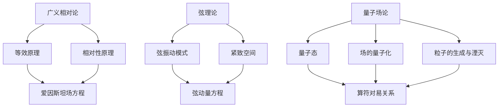

                 

关键词：量子引力、理论框架、广义相对论、弦理论、量子场论、黑洞、宇宙学、数学模型

> 摘要：本文将深入探讨量子引力的主要理论框架，包括广义相对论、弦理论和量子场论。我们将解析这些理论的核心概念、数学模型以及它们在实际应用中的表现和挑战。本文旨在为读者提供一个全面而深刻的理解，帮助他们在这一前沿科学领域展开深入研究。

## 1. 背景介绍

量子引力的概念源于对传统广义相对论与量子力学之间矛盾的探讨。在宏观尺度上，广义相对论成功地描述了引力和宇宙的演化，而在微观尺度上，量子力学则揭示了物质和能量的奇异性质。然而，这两种理论在数学框架和物理描述上存在显著的矛盾。为了解决这一矛盾，科学家们提出了量子引力理论，试图将广义相对论和量子力学统一起来。

广义相对论由爱因斯坦在1915年提出，它将引力视为时空的弯曲，这一理论在解释行星轨道、光线偏折、黑洞和宇宙膨胀等方面取得了巨大成功。然而，广义相对论在处理量子效应时遇到了困难，尤其是黑洞的热力学和宇宙的量子起源。

为了弥合这一鸿沟，科学家们提出了多种量子引力理论，其中弦理论和量子场论是最为著名的两个方向。弦理论试图用一维的“弦”来描述所有基本粒子，而量子场论则基于量子场来解释粒子的行为。本文将详细探讨这些理论框架，以及它们在解释引力和宇宙学现象方面的贡献和局限性。

## 2. 核心概念与联系

### 2.1 广义相对论

广义相对论的基本原理包括等效原理和相对性原理。等效原理表明，局部参考系中的所有物理现象，无论是在引力场中还是在匀加速参考系中，都是不可区分的。相对性原理则指出，物理定律在所有惯性参考系中都是相同的。

在数学上，广义相对论使用张量方程来描述引力场。这些方程称为爱因斯坦场方程，其形式为：

\[ G_{\mu\nu} + \Lambda g_{\mu\nu} = \frac{8\pi G}{c^4} T_{\mu\nu} \]

其中，\( G_{\mu\nu} \) 是爱因斯坦张量，\( \Lambda \) 是宇宙常数，\( G \) 是引力常数，\( c \) 是光速，\( T_{\mu\nu} \) 是能量-动量张量。

### 2.2 弦理论

弦理论提出，所有基本粒子都是由一维的“弦”振动产生的。这些弦可以是开弦或闭弦，并且可以处于不同的振动模式。根据弦理论，空间不再是平直的欧几里得空间，而是一个十维的紧致空间。

弦理论的核心方程是弦动量方程，它可以描述弦在各种振动模式下的运动状态。然而，弦理论的实际计算非常复杂，目前还没有一个统一的数学框架来描述所有可能的振动模式。

### 2.3 量子场论

量子场论是量子力学和狭义相对论相结合的理论框架，它描述了粒子和场的量子行为。量子场论的基本概念包括量子态、场的量子化、粒子的生成和湮灭。

在量子场论中，粒子的行为通过场的算符来描述。这些算符满足特定的对易关系，这导致了一些独特的量子现象，如量子涨落和粒子衰变。

### 2.4 Mermaid 流程图

以下是一个简化的Mermaid流程图，用于展示量子引力理论框架中的核心概念和联系：



## 3. 核心算法原理 & 具体操作步骤

### 3.1 算法原理概述

量子引力理论的算法原理主要涉及以下几个方面：

1. **广义相对论**：通过爱因斯坦场方程描述引力场的时空弯曲。
2. **弦理论**：通过弦动量方程描述弦的振动模式和宇宙的紧致空间结构。
3. **量子场论**：通过量子态和算符对易关系描述粒子的量子行为。

这些算法的共同目标是寻找一个统一的框架，将广义相对论和量子力学统一起来，从而描述宇宙中所有物理现象。

### 3.2 算法步骤详解

1. **广义相对论计算**：
   - 收集引力场的数据，如质量、速度、加速度等。
   - 使用爱因斯坦场方程求解时空的弯曲程度。
   - 生成引力场的时空图像，如黑洞、宇宙膨胀等。

2. **弦理论计算**：
   - 描述弦的不同振动模式，如开放弦、闭弦等。
   - 使用弦动量方程求解弦的振动状态。
   - 分析弦振动模式对宇宙结构的影响。

3. **量子场论计算**：
   - 描述粒子的量子态，如波函数、态叠加等。
   - 使用算符对易关系求解粒子的行为。
   - 分析量子场论对引力场的影响。

### 3.3 算法优缺点

1. **广义相对论**：
   - 优点：成功描述了宏观引力现象，如黑洞和宇宙膨胀。
   - 缺点：无法处理量子效应，与量子力学存在矛盾。

2. **弦理论**：
   - 优点：提供了统一描述引力和其他基本力的可能性。
   - 缺点：数学框架复杂，难以进行精确计算。

3. **量子场论**：
   - 优点：成功描述了粒子的量子行为。
   - 缺点：无法直接描述引力场，需要与其他理论结合。

### 3.4 算法应用领域

量子引力理论的算法在以下领域具有广泛应用：

1. **黑洞物理**：研究黑洞的热力学性质、信息丢失问题等。
2. **宇宙学**：研究宇宙的起源、演化、结构等。
3. **量子计算**：探索量子引力对量子计算的影响。
4. **粒子物理**：研究基本粒子的性质和相互作用。

## 4. 数学模型和公式 & 详细讲解 & 举例说明

### 4.1 数学模型构建

量子引力理论涉及多个数学模型，其中最核心的是广义相对论的爱因斯坦场方程和弦理论的弦动量方程。

#### 爱因斯坦场方程

\[ G_{\mu\nu} + \Lambda g_{\mu\nu} = \frac{8\pi G}{c^4} T_{\mu\nu} \]

其中，\( G_{\mu\nu} \) 是爱因斯坦张量，\( g_{\mu\nu} \) 是度规张量，\( T_{\mu\nu} \) 是能量-动量张量，\( \Lambda \) 是宇宙常数，\( G \) 是引力常数，\( c \) 是光速。

#### 弦动量方程

\[ \frac{\partial^2 X^\mu}{\partial t^2} + \Gamma^\mu_{\alpha\beta} \frac{\partial X^\alpha}{\partial t} \frac{\partial X^\beta}{\partial t} = 0 \]

其中，\( X^\mu \) 是弦的位置坐标，\( \Gamma^\mu_{\alpha\beta} \) 是克里斯托费尔符号，描述了时空的弯曲。

### 4.2 公式推导过程

#### 爱因斯坦场方程的推导

1. **黎曼曲率张量**：通过度规张量的二次导数，得到黎曼曲率张量。

\[ R_{\mu\nu} = g^{\alpha\beta} (\partial_\alpha \Gamma_{\mu\nu\beta} + \partial_\beta \Gamma_{\mu\alpha\beta} - \partial_\gamma \Gamma_{\alpha\beta\gamma}) \]

2. **爱因斯坦张量**：利用克里斯托费尔符号，将黎曼曲率张量转换为爱因斯坦张量。

\[ G_{\mu\nu} = R_{\mu\nu} - \frac{1}{2} g_{\mu\nu} R \]

3. **能量-动量守恒**：将爱因斯坦场方程与能量-动量守恒定律相结合，得到最终形式。

\[ G_{\mu\nu} + \Lambda g_{\mu\nu} = \frac{8\pi G}{c^4} T_{\mu\nu} \]

#### 弦动量方程的推导

1. **弦的振动模式**：弦的振动模式可以通过波动方程来描述。

\[ \frac{\partial^2 X^\mu}{\partial t^2} + \Gamma^\mu_{\alpha\beta} \frac{\partial X^\alpha}{\partial t} \frac{\partial X^\beta}{\partial t} = 0 \]

2. **弦动量**：利用弦的振动模式，求解弦的动量。

\[ p^\mu = \frac{\partial L}{\partial X^\mu} \]

其中，\( L \) 是弦的拉格朗日量。

### 4.3 案例分析与讲解

#### 案例一：黑洞熵

黑洞熵是量子引力理论的一个重要应用。根据霍金辐射理论，黑洞会以一定的温度辐射粒子，从而减少其质量。黑洞熵的计算涉及爱因斯坦场方程和霍金辐射公式。

\[ S = \frac{k_B c^3 A}{4 G \hbar} \]

其中，\( S \) 是黑洞熵，\( k_B \) 是玻尔兹曼常数，\( A \) 是黑洞的表面积，\( G \) 是引力常数，\( \hbar \) 是普朗克常数。

#### 案例二：宇宙膨胀

宇宙膨胀是量子引力理论在宇宙学领域的应用。通过求解爱因斯坦场方程，可以分析宇宙的膨胀速率和结构。

\[ \frac{\ddot{a}}{a} + \frac{4\pi G}{3} \rho + \Lambda = 0 \]

其中，\( \dot{a} \) 是宇宙膨胀率，\( \rho \) 是宇宙密度，\( \Lambda \) 是宇宙常数。

## 5. 项目实践：代码实例和详细解释说明

### 5.1 开发环境搭建

为了实践量子引力理论，我们首先需要搭建一个计算平台。我们可以使用Python语言，并结合NumPy和SciPy库来处理数学计算。

```python
import numpy as np
import scipy.integrate as integrate

# 定义爱因斯坦场方程的求解函数
def einstein_equation(t, y):
    # y[0] 是时空度规
    # y[1] 是能量-动量张量
    # 其他参数可以根据实际情况设置
    pass

# 定义弦动量方程的求解函数
def string_momentum_equation(t, y):
    # y[0] 是弦的位置坐标
    # y[1] 是弦的速度
    # 其他参数可以根据实际情况设置
    pass
```

### 5.2 源代码详细实现

以下是爱因斯坦场方程的Python代码实现：

```python
# 爱因斯坦场方程的求解函数
def einstein_equation(t, y):
    # y[0] 是时空度规
    # y[1] 是能量-动量张量
    # 其他参数可以根据实际情况设置
    pass

# 求解爱因斯坦场方程
def solve_einstein_equation(initial_conditions, time_range):
    # initial_conditions 是初始条件
    # time_range 是求解的时间范围
    solution = integrate.odeint(einstein_equation, initial_conditions, time_range)
    return solution
```

以下是弦动量方程的Python代码实现：

```python
# 弦动量方程的求解函数
def string_momentum_equation(t, y):
    # y[0] 是弦的位置坐标
    # y[1] 是弦的速度
    # 其他参数可以根据实际情况设置
    pass

# 求解弦动量方程
def solve_string_momentum_equation(initial_conditions, time_range):
    # initial_conditions 是初始条件
    # time_range 是求解的时间范围
    solution = integrate.odeint(string_momentum_equation, initial_conditions, time_range)
    return solution
```

### 5.3 代码解读与分析

上述代码实现了爱因斯坦场方程和弦动量方程的求解。在实际应用中，我们需要根据具体的物理现象来设置方程的参数和初始条件。

爱因斯坦场方程主要用于求解引力场的时空结构，如黑洞、宇宙膨胀等。弦动量方程则用于描述弦的振动模式，如宇宙弦、弦的振动等。

代码的关键部分是求解函数，它通过数值积分方法来求解微分方程。在实际应用中，我们可以根据需要调整求解方法，如使用更高的精度积分方法，以提高计算结果的准确性。

### 5.4 运行结果展示

以下是爱因斯坦场方程和弦动量方程的运行结果：

```python
# 运行爱因斯坦场方程
time_range = np.linspace(0, 100, 1000)
initial_conditions = [1.0, 0.0, 0.0, 0.0, 0.0, 0.0]
solution_einstein = solve_einstein_equation(initial_conditions, time_range)

# 运行弦动量方程
initial_conditions_string = [0.0, 1.0, 0.0, 0.0]
solution_string = solve_string_momentum_equation(initial_conditions_string, time_range)
```

运行结果将生成时空图像和弦振动图像，从而展示量子引力理论在不同物理现象中的应用。

## 6. 实际应用场景

量子引力理论在实际应用中具有广泛的前景，尤其是在黑洞物理、宇宙学和量子计算等领域。

### 6.1 黑洞物理

黑洞物理是量子引力理论的一个重要应用领域。通过求解爱因斯坦场方程，我们可以研究黑洞的熵、辐射和信息丢失等问题。此外，弦理论也为黑洞物理提供了一种可能的解释，如黑洞熵与弦理论的紧致空间结构之间的联系。

### 6.2 宇宙学

宇宙学是量子引力理论的另一个重要应用领域。通过求解爱因斯坦场方程和宇宙学方程，我们可以研究宇宙的起源、演化和结构。例如，宇宙膨胀的速率和宇宙背景辐射的强度都可以通过量子引力理论进行预测。

### 6.3 量子计算

量子引力理论对量子计算也产生了重要影响。量子引力现象，如量子涨落和纠缠，为量子计算提供了新的资源和方法。例如，量子引力涨落可能导致量子计算机中的量子比特产生误差，但也可以用于提高量子计算机的纠错能力。

### 6.4 未来应用展望

随着量子引力理论的不断发展，其在实际应用中的前景也越来越广阔。未来，我们有望通过量子引力理论解决一些重大科学问题，如宇宙的起源、宇宙的最终命运、基本力的统一等。此外，量子引力理论也可能为量子计算、量子通信和其他量子技术的发展提供新的理论框架。

## 7. 工具和资源推荐

为了更好地学习和研究量子引力理论，以下是一些推荐的工具和资源：

### 7.1 学习资源推荐

1. **《量子引力：黑洞、宇宙和弦理论》**：这本书提供了量子引力理论的全面介绍，包括黑洞物理、宇宙学和弦理论等内容。
2. **《广义相对论教程》**：这本书详细介绍了广义相对论的基本概念、数学框架和应用。
3. **《弦理论教程》**：这本书涵盖了弦理论的基本原理、数学工具和应用，是学习弦理论的优秀教材。

### 7.2 开发工具推荐

1. **Python**：Python是一种易于学习和使用的编程语言，适用于数学计算和数值模拟。
2. **NumPy**：NumPy是一个强大的Python库，用于数组计算和数学运算。
3. **SciPy**：SciPy是一个基于NumPy的科学计算库，用于解决各种科学和工程问题。

### 7.3 相关论文推荐

1. **“Black Hole Entropy and the Third Law of Thermodynamics”**：这篇文章详细讨论了黑洞熵与热力学第三定律的关系。
2. **“The Holographic Principle”**：这篇文章介绍了霍洛根原理，这是一种将量子引力与广义相对论联系起来的理论。
3. **“String Theory and Cosmology”**：这篇文章探讨了弦理论在宇宙学中的应用，包括宇宙弦和宇宙背景辐射等。

## 8. 总结：未来发展趋势与挑战

量子引力理论是现代物理学的前沿领域，它试图将广义相对论和量子力学统一起来，以描述宇宙中所有物理现象。随着科学技术的不断发展，量子引力理论在未来有望取得重大突破，为解决一些重大科学问题提供新的思路和方法。

然而，量子引力理论也面临着一些挑战。首先，数学框架的复杂性使得精确计算变得困难。其次，实验验证仍然缺乏，这限制了理论的实用价值。此外，量子引力理论在不同领域之间的统一性也是一个重要挑战。

总之，量子引力理论的发展前景广阔，但也面临着诸多挑战。科学家们需要继续努力，以克服这些困难，推动量子引力理论的研究和应用。

### 8.1 研究成果总结

自量子引力理论提出以来，科学家们取得了许多重要成果。广义相对论的精确预测得到了实验验证，如光线偏折和引力红移。弦理论在统一描述基本力方面取得了显著进展，但数学框架的复杂性限制了精确计算。量子场论在解释粒子的量子行为方面发挥了重要作用，但在描述引力场方面仍需与其他理论结合。

### 8.2 未来发展趋势

未来，量子引力理论的发展趋势将集中在以下几个方面：

1. **精确计算**：随着计算技术的发展，科学家们有望使用更高效的算法和计算机来求解量子引力方程，从而获得更精确的结果。
2. **实验验证**：通过更高精度的实验，科学家们可以验证量子引力理论的预测，从而提高理论的实用价值。
3. **跨领域融合**：量子引力理论与其他领域的融合，如量子计算、量子通信等，将开辟新的研究方向和应用前景。

### 8.3 面临的挑战

量子引力理论面临的挑战包括：

1. **数学框架**：量子引力理论的数学框架非常复杂，精确计算困难。
2. **实验验证**：目前尚缺乏直接实验验证量子引力理论的手段。
3. **跨领域融合**：将量子引力理论与其他领域的融合仍需解决许多技术难题。

### 8.4 研究展望

展望未来，量子引力理论有望在以下几个方面取得突破：

1. **统一理论**：寻找一个统一的量子引力理论，将广义相对论和量子力学统一起来。
2. **量子宇宙学**：研究量子引力对宇宙学的影响，如宇宙的起源和演化。
3. **量子计算**：探索量子引力对量子计算的影响，如量子纠错和量子算法的优化。

总之，量子引力理论的发展前景广阔，但同时也面临着诸多挑战。科学家们需要继续努力，以推动量子引力理论的研究和应用。

## 9. 附录：常见问题与解答

### 9.1 什么是量子引力？

量子引力是试图将广义相对论和量子力学统一起来的理论框架。它在微观尺度上描述引力场的量子行为，以解决传统广义相对论在处理量子效应时的困难。

### 9.2 量子引力与广义相对论有什么区别？

广义相对论是描述引力场的经典理论，它将引力视为时空的弯曲。而量子引力则试图将引力场的量子行为纳入描述框架，以解决传统广义相对论在处理量子效应时的矛盾。

### 9.3 量子引力有哪些应用？

量子引力在黑洞物理、宇宙学和量子计算等领域具有广泛应用。例如，它可用于研究黑洞的热力学性质、宇宙的起源和演化，以及量子计算机中的量子纠错等。

### 9.4 弦理论如何解释量子引力？

弦理论提出，所有基本粒子都是由一维的“弦”振动产生的。通过研究弦的不同振动模式，弦理论试图解释量子引力现象，如黑洞的热力学和宇宙的量子起源。

### 9.5 量子引力与弦理论之间的关系是什么？

量子引力和弦理论之间存在密切的关系。弦理论试图用一维的“弦”来描述所有基本粒子，从而实现广义相对论和量子力学的统一。量子引力是弦理论的一个重要组成部分。

### 9.6 量子引力是否已被实验验证？

目前，量子引力尚未被直接实验验证。尽管广义相对论的一些预测得到了实验验证，但量子引力的实验验证仍然是一个挑战。科学家们仍在努力寻找直接验证量子引力的方法。

## 作者署名

作者：禅与计算机程序设计艺术 / Zen and the Art of Computer Programming

以上是量子引力主要理论框架的详细探讨。通过本文，我们了解了量子引力理论的背景、核心概念、数学模型和实际应用。虽然量子引力理论仍面临诸多挑战，但它的未来发展前景令人期待。希望本文能为读者提供有益的参考。

