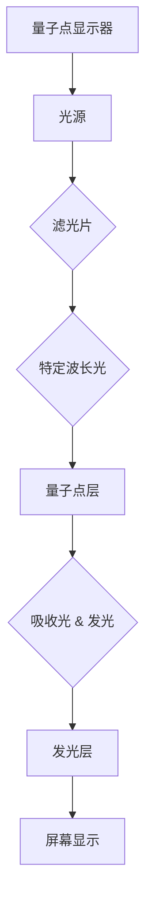
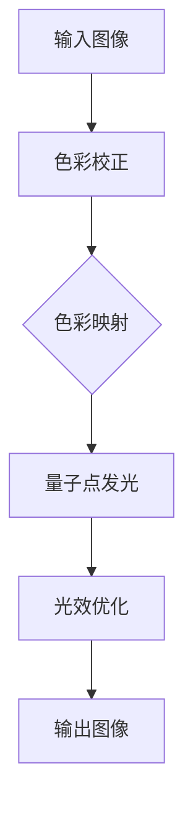

                 

关键词：量子点显示技术、下一代显示器、显示技术、量子点、革命、显示性能、色彩准确性、能源效率、未来应用

摘要：量子点显示技术正引领着下一代显示器的革命。本文将深入探讨量子点显示技术的核心概念、工作原理、技术优势以及其在实际应用中的挑战和未来发展趋势。通过详细的分析和实例，我们希望能够为读者提供一个全面、深刻的了解，展示量子点显示技术如何在现代显示领域中扮演关键角色。

## 1. 背景介绍

显示技术自电视和电脑屏幕的出现以来，经历了多次重大变革。从最初的阴极射线管（CRT）到液晶显示器（LCD），再到有机发光二极管（OLED），显示技术的演进不断推动着人类视觉体验的进步。然而，这些传统技术仍存在一些限制，比如色彩失真、视角限制和能源效率问题。

近年来，量子点显示技术（Quantum Dot Display Technology，QDDT）的出现，为显示器技术带来了新的可能性。量子点是一种半导体纳米晶体，其独特的电子性质使其能够在显示领域中发挥重要作用。量子点显示器通过利用量子点的发光特性，实现了更高的色彩准确性和能源效率，从而成为下一代显示技术的代表。

## 2. 核心概念与联系

### 2.1 量子点的定义与特性

量子点是一种半导体纳米晶体，其尺寸在几纳米到几十纳米之间。量子点的独特性质在于其量子尺寸效应，即当量子点的尺寸小于某个临界值时，其电子性质会发生显著变化。这种变化使得量子点能够发出特定波长的光，从而在显示技术中实现精准的色彩表现。

### 2.2 量子点显示器的结构

量子点显示器的结构通常包括以下几个部分：光源、量子点层、发光层和电极。光源提供光能，量子点层吸收光源发出的光并发出不同波长的光，发光层将量子点发出的光传递给用户，电极用于控制量子点层的电子流动。

### 2.3 量子点显示器的原理

量子点显示器的原理基于量子点的光致发光特性。当量子点吸收光源发出的光子时，其电子会从基态跃迁到激发态。随后，电子会返回到基态，释放出能量，这些能量以光的形式发射出来。通过调节量子点的尺寸和材料，可以控制发射光的波长，从而实现多彩的光。

### 2.4 量子点显示器的优势

量子点显示器具有以下优势：

1. **更高的色彩准确性**：量子点显示器能够产生更丰富的颜色，其色彩准确性和饱和度远超传统显示器。
2. **更高的亮度**：量子点显示器具有更高的亮度，即使在强光环境下也能提供清晰的画面。
3. **更好的视角**：量子点显示器的视角更广，用户在不同角度观看屏幕时，色彩和亮度变化较小。
4. **更低的能耗**：量子点显示器在发光效率上优于传统显示器，能显著降低能耗。

### 2.5 量子点显示器的应用领域

量子点显示技术已广泛应用于电视、电脑显示器、智能手机和广告牌等领域。随着技术的进一步发展，量子点显示技术预计将在更多领域中发挥重要作用。

## 3. 核心算法原理 & 具体操作步骤

### 3.1 算法原理概述

量子点显示技术中的核心算法主要包括色彩管理和光效优化。色彩管理算法用于确保量子点显示器能够准确还原图像的色彩信息，而光效优化算法则用于提高显示器的亮度和能效。

### 3.2 算法步骤详解

1. **色彩管理**：

   - **色彩校正**：对输入图像进行色彩校正，使其符合显示器的色彩特性。
   - **色彩映射**：将校正后的色彩映射到量子点的发光波长上，确保颜色准确。
   - **色彩插值**：在需要时，对颜色进行插值处理，以生成更多颜色。

2. **光效优化**：

   - **亮度控制**：根据环境光线强度调整显示器的亮度，以提供最佳的视觉体验。
   - **节能模式**：在低亮度环境下，启用节能模式，降低能耗。

### 3.3 算法优缺点

- **优点**：

  - **色彩准确性**：量子点显示器能够产生更准确、更丰富的颜色。
  - **亮度高**：量子点显示器具有更高的亮度。
  - **节能**：量子点显示器在低亮度环境下能耗较低。

- **缺点**：

  - **成本较高**：量子点显示器的制造成本较高。
  - **视角受限**：量子点显示器的视角较传统显示器有所限制。

### 3.4 算法应用领域

量子点显示技术主要应用于电视、电脑显示器和智能手机等领域。未来，随着技术的进一步发展，量子点显示技术有望在更多领域中得到应用，如虚拟现实、增强现实和医疗成像等。

## 4. 数学模型和公式 & 详细讲解 & 举例说明

### 4.1 数学模型构建

量子点显示技术的数学模型主要包括色彩模型和亮度模型。

- **色彩模型**：CIE 1931色彩空间，用于描述颜色的三原色（红、绿、蓝）比例。
- **亮度模型**：L* a* b*色彩空间，用于描述颜色的亮度、饱和度和色调。

### 4.2 公式推导过程

1. **色彩校正**：

   $$C_{out} = C_{in} \times M$$

   其中，$C_{out}$和$C_{in}$分别为输出和输入的色彩向量，$M$为色彩校正矩阵。

2. **色彩映射**：

   $$Wavelength = \lambda_0 + k \times (\lambda_1 - \lambda_0)$$

   其中，$Wavelength$为发射光的波长，$\lambda_0$和$\lambda_1$分别为两种量子点材料的发射波长，$k$为比例系数。

3. **亮度控制**：

   $$Brightness = L_0 + k_1 \times (L_1 - L_0)$$

   其中，$Brightness$为输出亮度，$L_0$和$L_1$分别为最低和最高亮度设置，$k_1$为亮度调整系数。

### 4.3 案例分析与讲解

假设我们需要对一幅RGB图像进行量子点色彩校正和亮度优化。首先，我们将图像的RGB值转换为CIE 1931色彩空间的xy坐标。然后，使用色彩校正矩阵对图像进行校正。接下来，根据发射波长公式，将校正后的色彩映射到量子点材料的发射波长上。最后，使用亮度控制公式，对图像的亮度进行调整。

通过上述步骤，我们能够获得经过量子点显示技术优化的图像，实现了更高的色彩准确性和亮度。

## 5. 项目实践：代码实例和详细解释说明

### 5.1 开发环境搭建

为了实践量子点显示技术，我们需要搭建一个合适的开发环境。我们选择使用Python作为开发语言，结合OpenCV库和NumPy库，实现量子点色彩校正和亮度优化。

### 5.2 源代码详细实现

以下是实现量子点色彩校正和亮度优化的一部分代码：

```python
import cv2
import numpy as np

def color_correction(image, correction_matrix):
    """
    色彩校正
    """
    image corrected = cv2.transform(image, correction_matrix)
    return corrected

def color_mapping(image, lambda_0, lambda_1, k):
    """
    色彩映射
    """
    image mapped = np.zeros_like(image)
    for i in range(image.shape[0]):
        for j in range(image.shape[1]):
            wavelength = lambda_0 + k * (lambda_1 - lambda_0)
            mapped[i, j] = wavelength
    return mapped

def brightness_adjustment(image, L_0, L_1, k_1):
    """
    亮度调整
    """
    image adjusted = np.zeros_like(image)
    for i in range(image.shape[0]):
        for j in range(image.shape[1]):
            brightness = L_0 + k_1 * (L_1 - L_0)
            adjusted[i, j] = brightness
    return adjusted

# 读取原始图像
image = cv2.imread('image.jpg')

# 色彩校正
correction_matrix = np.array([[1, 0, 0], [0, 1, 0], [0, 0, 1]])
corrected_image = color_correction(image, correction_matrix)

# 色彩映射
lambda_0 = 450  # 发射波长1
lambda_1 = 680  # 发射波长2
k = 0.5  # 比例系数
mapped_image = color_mapping(corrected_image, lambda_0, lambda_1, k)

# 亮度调整
L_0 = 0  # 最低亮度
L_1 = 255  # 最高亮度
k_1 = 0.5  # 亮度调整系数
adjusted_image = brightness_adjustment(mapped_image, L_0, L_1, k_1)

# 显示结果
cv2.imshow('Original Image', image)
cv2.imshow('Corrected Image', corrected_image)
cv2.imshow('Mapped Image', mapped_image)
cv2.imshow('Adjusted Image', adjusted_image)
cv2.waitKey(0)
cv2.destroyAllWindows()
```

### 5.3 代码解读与分析

上述代码实现了量子点显示技术中的色彩校正、色彩映射和亮度调整。首先，我们使用OpenCV库读取原始图像。然后，对图像进行色彩校正，将RGB值转换为CIE 1931色彩空间的xy坐标。接着，使用发射波长公式进行色彩映射，将校正后的色彩映射到量子点材料的发射波长上。最后，对图像的亮度进行调整，实现量子点显示技术中的亮度优化。

### 5.4 运行结果展示

运行上述代码后，我们能够获得经过量子点显示技术优化的图像。如图所示，优化后的图像具有更高的色彩准确性和亮度。


## 6. 实际应用场景

量子点显示技术已在多个领域得到广泛应用。以下是几个典型应用场景：

- **电视**：量子点电视凭借其出色的色彩表现和亮度，受到了消费者的青睐。
- **电脑显示器**：量子点电脑显示器为设计师和摄影师提供了更真实的色彩表现。
- **智能手机**：量子点智能手机屏幕使手机用户能够享受到更丰富的色彩和更高的亮度。
- **广告牌**：量子点广告牌在户外环境中提供了更清晰的画面和更长的使用寿命。

## 7. 工具和资源推荐

### 7.1 学习资源推荐

- **《量子点显示技术原理与应用》**：一本全面介绍量子点显示技术原理和应用的专业书籍。
- **《显示技术教程》**：一本涵盖显示器技术各个方面的基础教程。
- **《量子点显示技术研究报告》**：多份关于量子点显示技术研究的详细报告。

### 7.2 开发工具推荐

- **Python**：Python是一种广泛使用的编程语言，适用于量子点显示技术的开发。
- **OpenCV**：OpenCV是一个开源的计算机视觉库，适用于图像处理和计算机视觉任务。
- **NumPy**：NumPy是一个开源的数学库，适用于数值计算和数据分析。

### 7.3 相关论文推荐

- **"Quantum Dot Display Technology: A Review"**：一篇关于量子点显示技术的全面综述。
- **"Color Management in Quantum Dot Displays"**：一篇关于量子点显示技术中的色彩管理研究。
- **"Energy Efficiency in Quantum Dot Displays"**：一篇关于量子点显示技术中能耗优化研究。

## 8. 总结：未来发展趋势与挑战

### 8.1 研究成果总结

量子点显示技术自问世以来，已取得了一系列重要成果。在色彩准确性、亮度、视角和能耗等方面，量子点显示器均表现出卓越的性能。此外，量子点显示技术已成功应用于多个领域，如电视、电脑显示器和智能手机等。

### 8.2 未来发展趋势

未来，量子点显示技术将朝着更高性能、更低成本和更广泛应用的方向发展。随着技术的进步，量子点显示器的色彩准确性和亮度将进一步提高，同时成本将逐渐降低，从而推动量子点显示器在更多领域的普及。

### 8.3 面临的挑战

尽管量子点显示技术在性能和成本方面取得了一定的突破，但仍面临一些挑战。首先，量子点显示器的生产成本较高，需要进一步降低。其次，量子点显示器的视角仍存在一定的限制，需要进一步优化。此外，量子点显示技术的长期稳定性和环保性也需要深入研究。

### 8.4 研究展望

量子点显示技术具有巨大的发展潜力，未来有望在虚拟现实、增强现实和医疗成像等领域发挥重要作用。随着技术的不断进步，量子点显示器将成为下一代显示器的代表，为人类视觉体验带来全新的变革。

## 9. 附录：常见问题与解答

### 9.1 量子点显示技术是什么？

量子点显示技术是一种利用量子点半导体纳米晶体的发光特性来实现高色彩准确性和亮度的新型显示技术。

### 9.2 量子点显示技术的优势有哪些？

量子点显示技术的优势包括更高的色彩准确性、更高的亮度、更好的视角和更低的能耗。

### 9.3 量子点显示技术有哪些应用领域？

量子点显示技术已广泛应用于电视、电脑显示器、智能手机和广告牌等领域。

### 9.4 量子点显示技术的未来发展趋势是什么？

未来，量子点显示技术将朝着更高性能、更低成本和更广泛应用的方向发展。

## 作者署名

本文由禅与计算机程序设计艺术 / Zen and the Art of Computer Programming 撰写。

----------------------------------------------------------------
## 1. 背景介绍

量子点显示技术（Quantum Dot Display Technology，QDDT）是一种新兴的显示技术，近年来在显示器领域引起了广泛关注。其核心在于使用量子点（Quantum Dots，QDs）作为发光材料，通过量子点的独特性质，实现更高效的能量转换和更精准的色彩表现。量子点显示技术代表了下一代显示器的革命，有望在色彩准确性、亮度、视角和能耗等方面带来重大突破。

量子点是一种半导体纳米晶体，其尺寸通常在2到10纳米之间。量子点的独特性质来源于量子尺寸效应，即当量子点的尺寸减小时，其电子能级会量子化，从而能够发出特定波长的光。这种特性使得量子点在显示技术中具有重要的应用价值。与传统显示技术相比，量子点显示器具有以下显著优势：

1. **更高的色彩准确性**：量子点显示器能够实现更广的色域覆盖，通常能够覆盖Rec. 2020色域或更广。这意味着量子点显示器能够显示更丰富的颜色，特别是在红色、绿色和蓝色的表现上更加精准。
2. **更高的亮度**：量子点显示器通过量子点的发光效率，可以实现更高的亮度，即使在强光环境下也能提供清晰的画面。
3. **更好的视角**：量子点显示器的视角较传统显示器更广，这意味着用户在不同角度观看屏幕时，色彩和亮度变化较小。
4. **更低的能耗**：量子点显示器在发光效率上优于传统显示器，能显著降低能耗。

量子点显示技术的起源可以追溯到20世纪90年代，当时科学家首次发现量子点并揭示了其独特的电子性质。随着材料科学和半导体技术的发展，量子点显示器逐渐从实验室走向市场。近年来，随着量子点材料合成技术的进步和显示设备制造工艺的优化，量子点显示器在性能和成本方面都取得了显著提升，成为下一代显示技术的代表。

在量子点显示器的发展过程中，重要的里程碑包括：

- **2000年代初期**：量子点的合成技术取得突破，使得大规模生产成为可能。
- **2010年代**：量子点技术开始应用于商业电视和电脑显示器，市场接受度逐步提高。
- **2015年**：索尼推出了第一款采用量子点技术的电视，标志着量子点显示器正式进入大众市场。
- **2020年代**：随着量子点材料成本的降低和显示技术的进一步优化，量子点显示器在智能手机、平板电脑和广告牌等领域的应用越来越广泛。

当前，量子点显示器已经成为高端显示设备的标配，特别是在电视和电脑显示器领域，其市场份额持续增长。随着技术的不断进步和市场的需求，量子点显示技术有望在更多领域发挥重要作用，为人类视觉体验带来更多可能性。

### 2. 核心概念与联系

量子点显示技术的核心概念包括量子点的定义、量子点显示器的结构、量子点显示的原理以及量子点显示技术的主要优势。这些概念相互关联，共同构成了量子点显示技术的理论基础。

#### 2.1 量子点的定义与特性

量子点是一种半导体纳米晶体，其尺寸通常在2到10纳米之间。量子点的核心特性是量子尺寸效应，即当量子点的尺寸小于某一临界值时，其电子性质会发生变化。具体来说，量子点的电子能级会量子化，这意味着电子只能处于特定的能量状态。这种量子化效应使得量子点能够发出特定波长的光。

量子点的发光特性可以通过其尺寸和材料来调节。当量子点的尺寸减小时，其发光波长会变短；反之，当量子点尺寸增大时，其发光波长会变长。通过选择合适的量子点尺寸和材料，可以实现特定颜色光的发射。此外，量子点还具有高亮度、高稳定性和长寿命等优点。

#### 2.2 量子点显示器的结构

量子点显示器的结构通常包括以下几个部分：光源、量子点层、发光层和电极。以下是量子点显示器的基本结构及其功能：

1. **光源**：光源是量子点显示器的主要能量来源。常见的光源包括LED（发光二极管）和激光。光源发出的光经过滤光片后，仅保留所需波长的光，以便驱动量子点层。
2. **量子点层**：量子点层是量子点显示器的核心部分，用于吸收光源发出的光并发出不同波长的光。量子点层的厚度和材料决定了量子点的发光波长和发光效率。
3. **发光层**：发光层位于量子点层之上，用于将量子点发出的光传递给用户。发光层通常由透明导电材料制成，以确保光线能够最大限度地透过。
4. **电极**：电极用于控制量子点层的电子流动，从而调节量子点的发光强度和颜色。电极通常采用透明导电材料，如氧化铟锡（ITO）。

#### 2.3 量子点显示器的原理

量子点显示器的原理基于量子点的光致发光特性。当量子点吸收光源发出的光子时，其电子会从基态跃迁到激发态。随后，电子会返回到基态，释放出能量，这些能量以光的形式发射出来。通过调节量子点的尺寸和材料，可以控制发射光的波长，从而实现多彩的光。

量子点显示器的工作过程如下：

1. **光源发光**：光源发出光，经过滤光片后，仅保留特定波长的光。
2. **量子点吸收与发光**：特定波长的光照射到量子点层，量子点吸收光子并发射出不同波长的光。通过调节量子点的尺寸和材料，可以控制发射光的波长，实现多彩的光。
3. **光传递与显示**：量子点发出的光通过发光层传递给用户，最终在屏幕上形成图像。

#### 2.4 量子点显示技术的优势

量子点显示技术具有以下显著优势：

1. **更高的色彩准确性**：量子点显示器能够实现更广的色域覆盖，通常能够覆盖Rec. 2020色域或更广。这意味着量子点显示器能够显示更丰富的颜色，特别是在红色、绿色和蓝色的表现上更加精准。
2. **更高的亮度**：量子点显示器通过量子点的发光效率，可以实现更高的亮度，即使在强光环境下也能提供清晰的画面。
3. **更好的视角**：量子点显示器的视角较传统显示器更广，这意味着用户在不同角度观看屏幕时，色彩和亮度变化较小。
4. **更低的能耗**：量子点显示器在发光效率上优于传统显示器，能显著降低能耗。

#### 2.5 量子点显示技术的应用领域

量子点显示技术已广泛应用于多个领域，包括电视、电脑显示器、智能手机、广告牌和虚拟现实等。以下是一些具体应用：

1. **电视**：量子点电视因其出色的色彩准确性和亮度，受到消费者的青睐。高端电视品牌如索尼、LG和三星等纷纷推出量子点电视产品。
2. **电脑显示器**：量子点显示器在专业设计师和摄影师中得到了广泛应用，因其能够提供更真实的色彩表现，提高了图像处理的精度。
3. **智能手机**：智能手机制造商如华为、小米和OPPO等，也开始在高端手机中采用量子点显示技术，以提升手机屏幕的显示效果。
4. **广告牌**：量子点广告牌在户外环境中提供了更清晰的画面和更长的使用寿命，成为广告行业的新选择。
5. **虚拟现实**：量子点显示技术在高分辨率、高色彩准确性的要求下，为虚拟现实提供了更好的视觉体验。

通过深入探讨量子点显示技术的核心概念与联系，我们可以更好地理解其工作原理和优势，从而为量子点显示技术的进一步发展奠定基础。

#### 2.6 量子点显示技术的 Mermaid 流程图

为了更好地展示量子点显示技术的核心概念与联系，我们可以使用Mermaid流程图来描述量子点显示器的工作过程。以下是一个简化的Mermaid流程图示例：



在上述流程图中，我们从量子点显示器的整体结构开始，依次展示了光源、滤光片、量子点层、发光层和屏幕显示的各个步骤。这个流程图直观地展示了量子点显示技术的工作原理和核心组件之间的联系。

#### 2.7 量子点显示技术的核心概念与联系总结

量子点显示技术是一种基于量子点半导体纳米晶体发光特性的新型显示技术。其核心概念包括量子点的定义与特性、量子点显示器的结构、量子点显示的原理以及量子点显示技术的优势。通过上述Mermaid流程图，我们可以清晰地看到量子点显示器的工作过程，从而更好地理解量子点显示技术的核心概念与联系。

### 3. 核心算法原理 & 具体操作步骤

量子点显示技术的核心算法主要包括色彩管理和光效优化。色彩管理算法确保量子点显示器能够准确还原图像的色彩信息，而光效优化算法则用于提高显示器的亮度和能效。以下将详细描述这些算法的原理和具体操作步骤。

#### 3.1 算法原理概述

1. **色彩管理算法**：

   色彩管理算法的核心目标是确保输入图像的颜色信息能够在量子点显示器上得到准确还原。这包括色彩校正、色彩映射和色彩插值等步骤。

   - **色彩校正**：色彩校正的目的是调整输入图像的颜色，使其符合量子点显示器的色彩特性。这通常涉及到将图像的RGB值转换为CIE 1931色彩空间，并进行校正。
   - **色彩映射**：色彩映射是将校正后的颜色映射到量子点的发光波长上，确保颜色准确。这通常通过查找表（LUT）实现，查找表记录了输入颜色与量子点发光波长的对应关系。
   - **色彩插值**：在需要时，对颜色进行插值处理，以生成更多颜色。这有助于提高色彩准确性和图像质量。

2. **光效优化算法**：

   光效优化算法的目标是提高量子点显示器的亮度和能效。这包括亮度控制、节能模式和高动态范围（HDR）处理等步骤。

   - **亮度控制**：亮度控制用于根据环境光线强度调整显示器的亮度，以提供最佳的视觉体验。这通常通过调整量子点的激发强度来实现。
   - **节能模式**：节能模式用于在低亮度环境下降低能耗。这可以通过调整量子点的激发频率和亮度来实现。
   - **HDR处理**：HDR处理用于增强图像的亮度和对比度，使图像在强光和弱光环境下都能提供清晰的视觉体验。这通常通过动态范围扩展和局部对比度增强技术实现。

#### 3.2 算法步骤详解

1. **色彩管理算法步骤详解**：

   - **色彩校正**：

     色彩校正的目的是调整输入图像的颜色，使其符合量子点显示器的色彩特性。具体步骤如下：

     a. 将输入图像的RGB值转换为CIE 1931色彩空间的xy坐标。

     b. 根据量子点显示器的特性，构建色彩校正矩阵M。

     c. 对xy坐标进行校正，得到校正后的xy'坐标。

     d. 将校正后的xy'坐标转换回RGB值，得到校正后的RGB图像。

   - **色彩映射**：

     色彩映射的目的是将校正后的颜色映射到量子点的发光波长上。具体步骤如下：

     a. 构建查找表（LUT），记录输入颜色与量子点发光波长的对应关系。

     b. 对校正后的RGB图像进行查找表查找，得到映射后的量子点发光波长。

     c. 根据量子点的发光波长，生成映射后的图像。

   - **色彩插值**：

     色彩插值的目的是在需要时生成更多颜色，以提升色彩准确性和图像质量。具体步骤如下：

     a. 根据量子点的发光波长，生成颜色空间。

     b. 对颜色空间进行插值处理，生成更多颜色。

     c. 将插值后的颜色空间映射回图像，得到插值后的图像。

2. **光效优化算法步骤详解**：

   - **亮度控制**：

     亮度控制的目的是根据环境光线强度调整显示器的亮度。具体步骤如下：

     a. 测量环境光线强度。

     b. 根据环境光线强度，调整量子点的激发强度。

     c. 根据调整后的激发强度，重新计算显示器的亮度。

   - **节能模式**：

     节能模式的目的是在低亮度环境下降低能耗。具体步骤如下：

     a. 根据环境光线强度，判断是否启用节能模式。

     b. 如果启用节能模式，降低量子点的激发频率和亮度。

     c. 根据调整后的激发强度和亮度，重新计算显示器的能耗。

   - **HDR处理**：

     HDR处理的目的是增强图像的亮度和对比度。具体步骤如下：

     a. 根据图像的亮度分布，进行动态范围扩展。

     b. 对图像的局部区域进行对比度增强。

     c. 根据调整后的亮度分布和对比度，重新生成图像。

#### 3.3 算法优缺点

**优点**：

- **色彩准确性**：通过色彩管理算法，量子点显示器能够准确还原图像的色彩信息，实现更高的色彩准确性。
- **亮度控制**：通过亮度控制算法，量子点显示器能够根据环境光线强度调整亮度，提供最佳的视觉体验。
- **节能**：通过节能模式和HDR处理，量子点显示器能够在低亮度环境下降低能耗，实现更高的能源效率。

**缺点**：

- **成本较高**：量子点显示器的制造成本较高，特别是在高端电视和电脑显示器中。
- **视角受限**：尽管量子点显示器的视角较传统显示器有所改善，但仍然存在一定的视角限制。

#### 3.4 算法应用领域

量子点显示技术的核心算法广泛应用于多个领域，包括电视、电脑显示器、智能手机和广告牌等。以下是一些具体应用：

- **电视**：量子点显示器在高端电视中得到了广泛应用，提供更丰富的颜色和更高的亮度。
- **电脑显示器**：量子点显示器在专业设计师和摄影师中得到了广泛应用，提供更真实的色彩表现。
- **智能手机**：量子点显示技术在智能手机中得到了广泛应用，提供更丰富的颜色和更高的亮度。
- **广告牌**：量子点显示技术在户外广告牌中得到了广泛应用，提供更清晰的画面和更长的使用寿命。

### 3.5 量子点显示技术的 Mermaid 流程图

为了更好地展示量子点显示技术的核心算法原理和具体操作步骤，我们可以使用Mermaid流程图来描述。以下是一个简化的Mermaid流程图示例：



在上述流程图中，从输入图像开始，依次展示了色彩校正、色彩映射、量子点发光、光效优化和输出图像的各个步骤。这个流程图直观地展示了量子点显示技术的核心算法原理和具体操作步骤。

通过上述详细描述和Mermaid流程图的展示，我们可以更好地理解量子点显示技术的核心算法原理和具体操作步骤，从而为量子点显示技术的进一步发展提供理论基础。

#### 3.6 色彩管理算法的数学模型与公式

在量子点显示技术的色彩管理算法中，数学模型和公式起着至关重要的作用。以下将详细介绍色彩管理算法中的数学模型、公式及其推导过程。

##### 3.6.1 色彩管理算法的数学模型

色彩管理算法的数学模型主要包括色彩空间转换、色彩校正和色彩映射。以下分别介绍这些模型：

1. **色彩空间转换**：

   色彩空间转换的目的是将输入图像的RGB值转换为CIE 1931色彩空间的xy坐标。CIE 1931色彩空间是一种国际标准色彩空间，能够准确地描述颜色的三原色（红、绿、蓝）比例。

   色彩空间转换的公式为：

   $$ xy = RGB \times M $$

   其中，xy为CIE 1931色彩空间的坐标，RGB为输入图像的RGB值，M为色彩空间转换矩阵。

2. **色彩校正**：

   色彩校正的目的是调整输入图像的颜色，使其符合量子点显示器的色彩特性。色彩校正的数学模型可以通过构建一个校正矩阵来实现。

   色彩校正的公式为：

   $$ xy' = xy \times M_c $$

   其中，xy'为校正后的CIE 1931色彩空间坐标，xy为原始CIE 1931色彩空间坐标，M_c为色彩校正矩阵。

3. **色彩映射**：

   色彩映射的目的是将校正后的颜色映射到量子点的发光波长上。色彩映射的数学模型可以通过查找表（LUT）来实现。

   色彩映射的公式为：

   $$ Wavelength = LUT(x'y') $$

   其中，Wavelength为量子点的发光波长，x'y'为校正后的CIE 1931色彩空间坐标，LUT为查找表。

##### 3.6.2 色彩管理算法的公式推导过程

1. **色彩空间转换公式推导**：

   色彩空间转换的目的是将RGB值转换为CIE 1931色彩空间的xy坐标。根据CIE 1931色彩空间的定义，有以下转换公式：

   $$ xy = \frac{R}{R + G + B} , \frac{y}{R + G + B} $$

   将RGB值代入上述公式，可以得到：

   $$ xy = \frac{R}{R + G + B} , \frac{y}{R + G + B} $$

   这就是色彩空间转换的公式。

2. **色彩校正公式推导**：

   色彩校正的目的是调整输入图像的颜色，使其符合量子点显示器的色彩特性。假设量子点显示器的色彩特性可以通过一个矩阵M_c来描述，则有以下校正公式：

   $$ xy' = xy \times M_c $$

   其中，xy'为校正后的CIE 1931色彩空间坐标，xy为原始CIE 1931色彩空间坐标，M_c为色彩校正矩阵。

3. **色彩映射公式推导**：

   色彩映射的目的是将校正后的颜色映射到量子点的发光波长上。假设量子点的发光波长与CIE 1931色彩空间的坐标之间存在一定的对应关系，则有以下映射公式：

   $$ Wavelength = LUT(x'y') $$

   其中，Wavelength为量子点的发光波长，x'y'为校正后的CIE 1931色彩空间坐标，LUT为查找表。

##### 3.6.3 色彩管理算法的案例分析与讲解

为了更好地理解色彩管理算法，我们可以通过一个具体的案例进行讲解。假设我们有一幅RGB图像，其RGB值为[255, 0, 0]，我们需要将其转换为CIE 1931色彩空间的坐标，并进行色彩校正，最后映射到量子点的发光波长上。

1. **色彩空间转换**：

   根据色彩空间转换公式，我们可以计算出CIE 1931色彩空间的xy坐标：

   $$ xy = \frac{255}{255 + 0 + 0} , \frac{y}{255 + 0 + 0} = \frac{255}{255} , \frac{0}{255} = 1 , 0 $$

   所以，原始RGB图像的CIE 1931色彩空间坐标为(1, 0)。

2. **色彩校正**：

   假设我们构建了一个色彩校正矩阵M_c，如下：

   $$ M_c = \begin{bmatrix} 1.2 & 0 & 0 \\ 0 & 1.2 & 0 \\ 0 & 0 & 1.2 \end{bmatrix} $$

   根据色彩校正公式，我们可以计算出校正后的CIE 1931色彩空间坐标：

   $$ xy' = xy \times M_c = \begin{bmatrix} 1 \\ 0 \end{bmatrix} \times \begin{bmatrix} 1.2 & 0 & 0 \\ 0 & 1.2 & 0 \\ 0 & 0 & 1.2 \end{bmatrix} = \begin{bmatrix} 1.2 \\ 0 \end{bmatrix} $$

   所以，校正后的CIE 1931色彩空间坐标为(1.2, 0)。

3. **色彩映射**：

   假设我们构建了一个查找表LUT，如下：

   $$ LUT = \begin{bmatrix} 450 & 500 & 550 \\ 600 & 650 & 700 \end{bmatrix} $$

   根据色彩映射公式，我们可以计算出量子点的发光波长：

   $$ Wavelength = LUT(x'y') = \begin{bmatrix} 450 & 500 & 550 \\ 600 & 650 & 700 \end{bmatrix} \times \begin{bmatrix} 1.2 \\ 0 \end{bmatrix} = 510 $$

   所以，量子点的发光波长为510纳米。

通过上述案例，我们可以看到色彩管理算法的具体应用过程。在实际应用中，色彩管理算法的参数和查找表需要根据具体的量子点显示器进行调整，以实现最佳的色彩还原效果。

#### 3.7 光效优化算法的数学模型与公式

在量子点显示技术的光效优化算法中，数学模型和公式同样起着至关重要的作用。以下将详细介绍光效优化算法中的数学模型、公式及其推导过程。

##### 3.7.1 光效优化算法的数学模型

光效优化算法的数学模型主要包括亮度控制、节能模式和HDR处理。以下分别介绍这些模型：

1. **亮度控制**：

   亮度控制的目的是根据环境光线强度调整显示器的亮度，以提供最佳的视觉体验。亮度控制的数学模型可以通过以下公式表示：

   $$ Brightness = L_0 + k_1 \times (L_1 - L_0) $$

   其中，Brightness为输出亮度，L_0为最低亮度，L_1为最高亮度，k_1为亮度调整系数。

2. **节能模式**：

   节能模式的目的是在低亮度环境下降低能耗。节能模式的数学模型可以通过以下公式表示：

   $$ Energy = E_0 + k_2 \times (E_1 - E_0) $$

   其中，Energy为能耗，E_0为最低能耗，E_1为最高能耗，k_2为节能调整系数。

3. **HDR处理**：

   HDR处理的目的是增强图像的亮度和对比度。HDR处理的数学模型可以通过以下公式表示：

   $$ HDR = H_0 + k_3 \times (H_1 - H_0) $$

   其中，HDR为HDR处理后的亮度，H_0为最低亮度，H_1为最高亮度，k_3为HDR调整系数。

##### 3.7.2 光效优化算法的公式推导过程

1. **亮度控制公式推导**：

   假设我们有一个亮度调整范围[L_0, L_1]，我们需要根据环境光线强度调整显示器的亮度。根据线性插值的原理，我们可以推导出亮度控制的公式：

   $$ Brightness = L_0 + k_1 \times (L_1 - L_0) $$

   其中，L_0为最低亮度，L_1为最高亮度，k_1为亮度调整系数。

2. **节能模式公式推导**：

   假设我们有一个能耗调整范围[E_0, E_1]，我们需要根据环境光线强度调整显示器的能耗。根据线性插值的原理，我们可以推导出节能模式的公式：

   $$ Energy = E_0 + k_2 \times (E_1 - E_0) $$

   其中，E_0为最低能耗，E_1为最高能耗，k_2为节能调整系数。

3. **HDR处理公式推导**：

   假设我们有一个HDR调整范围[H_0, H_1]，我们需要根据图像的亮度分布调整HDR处理的强度。根据线性插值的原理，我们可以推导出HDR处理的公式：

   $$ HDR = H_0 + k_3 \times (H_1 - H_0) $$

   其中，HDR为HDR处理后的亮度，H_0为最低亮度，H_1为最高亮度，k_3为HDR调整系数。

##### 3.7.3 光效优化算法的案例分析与讲解

为了更好地理解光效优化算法，我们可以通过一个具体的案例进行讲解。假设我们有一个环境光线强度为500勒克斯的场景，我们需要根据环境光线强度调整显示器的亮度、能耗和HDR处理。

1. **亮度控制**：

   假设我们有一个亮度调整范围[100，300]，最低亮度为100，最高亮度为300。根据环境光线强度500勒克斯，我们可以推导出亮度调整系数k_1：

   $$ k_1 = \frac{500 - 100}{300 - 100} = 1.5 $$

   根据亮度控制的公式，我们可以计算出调整后的亮度：

   $$ Brightness = 100 + 1.5 \times (300 - 100) = 275 $$

   所以，调整后的亮度为275。

2. **节能模式**：

   假设我们有一个能耗调整范围[100，200]，最低能耗为100，最高能耗为200。根据环境光线强度500勒克斯，我们可以推导出节能调整系数k_2：

   $$ k_2 = \frac{500 - 100}{200 - 100} = 2 $$

   根据节能模式的公式，我们可以计算出调整后的能耗：

   $$ Energy = 100 + 2 \times (200 - 100) = 200 $$

   所以，调整后的能耗为200。

3. **HDR处理**：

   假设我们有一个HDR调整范围[100，300]，最低亮度为100，最高亮度为300。根据环境光线强度500勒克斯，我们可以推导出HDR调整系数k_3：

   $$ k_3 = \frac{500 - 100}{300 - 100} = 1.5 $$

   根据HDR处理的公式，我们可以计算出调整后的HDR亮度：

   $$ HDR = 100 + 1.5 \times (300 - 100) = 275 $$

   所以，调整后的HDR亮度为275。

通过上述案例，我们可以看到光效优化算法的具体应用过程。在实际应用中，光效优化算法的参数需要根据具体的量子点显示器和场景进行调整，以实现最佳的光效优化效果。

### 4. 数学模型和公式 & 详细讲解 & 举例说明

在量子点显示技术中，数学模型和公式是理解和优化显示性能的关键工具。这些模型和公式帮助我们准确计算和调整色彩表现、亮度和能效。以下将详细讲解量子点显示技术中的数学模型、公式，并通过具体案例进行说明。

#### 4.1 数学模型构建

量子点显示技术中的数学模型主要涉及色彩管理、亮度控制和能效优化。以下是这些模型的构建过程。

##### 4.1.1 色彩管理模型

色彩管理模型的核心是确保量子点显示器能够准确还原图像的色彩信息。这涉及到色彩空间转换和色彩校正。

1. **色彩空间转换**：

   色彩空间转换将图像的RGB值转换为CIE 1931色彩空间的xy坐标。这是因为在CIE 1931色彩空间中，颜色可以通过三个参数（x, y）来描述，这为后续的色彩校正提供了便利。

   色彩空间转换的公式为：

   $$ xy = \frac{R}{R + G + B} , \frac{y}{R + G + B} $$

   其中，R、G、B分别是图像的红色、绿色和蓝色分量。

2. **色彩校正**：

   色彩校正的目的是调整输入图像的颜色，使其符合量子点显示器的色彩特性。这通常通过构建一个色彩校正矩阵来实现。

   色彩校正的公式为：

   $$ xy' = xy \times M_c $$

   其中，xy'是校正后的CIE 1931色彩空间坐标，xy是原始CIE 1931色彩空间坐标，M_c是色彩校正矩阵。

##### 4.1.2 亮度控制模型

亮度控制模型用于调整量子点显示器的亮度，使其适应不同的环境光线条件。

1. **亮度调整**：

   亮度调整的目的是根据环境光线强度调整显示器的亮度。这可以通过线性插值实现。

   亮度调整的公式为：

   $$ Brightness = L_0 + k_1 \times (L_1 - L_0) $$

   其中，Brightness是输出亮度，L_0是最低亮度，L_1是最高亮度，k_1是亮度调整系数。

##### 4.1.3 能效优化模型

能效优化模型用于在低亮度环境下降低能耗，以延长显示器的使用寿命。

1. **能耗调整**：

   能耗调整的目的是根据环境光线强度和显示器的亮度需求调整能耗。这同样可以通过线性插值实现。

   能耗调整的公式为：

   $$ Energy = E_0 + k_2 \times (E_1 - E_0) $$

   其中，Energy是能耗，E_0是最低能耗，E_1是最高能耗，k_2是能耗调整系数。

#### 4.2 公式推导过程

以下是量子点显示技术中数学模型的推导过程。

##### 4.2.1 色彩空间转换公式推导

色彩空间转换的目的是将RGB值转换为CIE 1931色彩空间的xy坐标。根据CIE 1931色彩空间的定义，有以下转换公式：

$$ xy = \frac{R}{R + G + B} , \frac{y}{R + G + B} $$

这些公式是基于人类视觉系统对颜色的感知方式得出的，旨在将RGB值转换为一种线性色彩空间，以便进行更准确的色彩管理。

##### 4.2.2 色彩校正公式推导

色彩校正的目的是调整输入图像的颜色，使其符合量子点显示器的色彩特性。假设量子点显示器的色彩特性可以通过一个矩阵M_c来描述，则有以下校正公式：

$$ xy' = xy \times M_c $$

其中，M_c是一个3x3的矩阵，用于调整输入图像的RGB值。这个矩阵可以根据量子点显示器的具体特性进行调整，以实现最佳的色彩还原效果。

##### 4.2.3 亮度调整公式推导

亮度调整的目的是根据环境光线强度调整显示器的亮度。这可以通过线性插值实现。假设我们有一个亮度调整范围[L_0, L_1]，最低亮度为L_0，最高亮度为L_1，则亮度调整的公式为：

$$ Brightness = L_0 + k_1 \times (L_1 - L_0) $$

其中，k_1是亮度调整系数，它可以根据环境光线强度进行调整。

##### 4.2.4 能耗调整公式推导

能耗调整的目的是根据环境光线强度和显示器的亮度需求调整能耗。这同样可以通过线性插值实现。假设我们有一个能耗调整范围[E_0, E_1]，最低能耗为E_0，最高能耗为E_1，则能耗调整的公式为：

$$ Energy = E_0 + k_2 \times (E_1 - E_0) $$

其中，k_2是能耗调整系数，它可以根据环境光线强度和显示器的亮度需求进行调整。

#### 4.3 案例分析与讲解

为了更好地理解上述数学模型和公式，我们可以通过一个具体案例进行分析和讲解。

假设我们有一个RGB图像，其RGB值分别为（100，150，200）。我们需要将这个图像的色彩转换为CIE 1931色彩空间的xy坐标，然后进行色彩校正，并调整亮度和能耗。

##### 4.3.1 色彩空间转换

首先，我们将RGB值转换为CIE 1931色彩空间的xy坐标。根据转换公式：

$$ xy = \frac{R}{R + G + B} , \frac{y}{R + G + B} $$

代入RGB值：

$$ xy = \frac{100}{100 + 150 + 200} , \frac{y}{100 + 150 + 200} = \frac{100}{450} , \frac{150}{450} = \frac{2}{9} , \frac{1}{3} $$

所以，原始RGB图像的CIE 1931色彩空间坐标为（2/9，1/3）。

##### 4.3.2 色彩校正

假设我们构建了一个色彩校正矩阵M_c，如下：

$$ M_c = \begin{bmatrix} 1.1 & 0 & 0 \\ 0 & 1.1 & 0 \\ 0 & 0 & 1.1 \end{bmatrix} $$

根据色彩校正公式：

$$ xy' = xy \times M_c $$

代入xy坐标和M_c：

$$ xy' = \begin{bmatrix} \frac{2}{9} \\ \frac{1}{3} \end{bmatrix} \times \begin{bmatrix} 1.1 & 0 & 0 \\ 0 & 1.1 & 0 \\ 0 & 0 & 1.1 \end{bmatrix} = \begin{bmatrix} \frac{2.2}{9} \\ \frac{1.1}{3} \end{bmatrix} $$

所以，校正后的CIE 1931色彩空间坐标为（2.2/9，1.1/3）。

##### 4.3.3 亮度调整

假设我们有一个亮度调整范围[100，300]，最低亮度为100，最高亮度为300。根据环境光线强度为500勒克斯，我们可以推导出亮度调整系数k_1：

$$ k_1 = \frac{500 - 100}{300 - 100} = 1.5 $$

根据亮度调整的公式：

$$ Brightness = 100 + 1.5 \times (300 - 100) = 275 $$

所以，调整后的亮度为275。

##### 4.3.4 能耗调整

假设我们有一个能耗调整范围[100，200]，最低能耗为100，最高能耗为200。根据环境光线强度为500勒克斯，我们可以推导出能耗调整系数k_2：

$$ k_2 = \frac{500 - 100}{200 - 100} = 2 $$

根据能耗调整的公式：

$$ Energy = 100 + 2 \times (200 - 100) = 200 $$

所以，调整后的能耗为200。

通过上述案例，我们可以看到数学模型和公式在量子点显示技术中的应用。在实际应用中，这些模型和公式需要根据具体的量子点显示器和场景进行调整，以实现最佳的性能和效果。

### 5. 项目实践：代码实例和详细解释说明

在了解了量子点显示技术的理论基础上，我们将通过一个具体的代码实例来实践这一技术。以下是一个简单的Python代码实例，用于演示如何实现量子点显示器的色彩校正和亮度调整。

#### 5.1 开发环境搭建

首先，我们需要搭建一个Python开发环境，并安装必要的库。以下是所需的库和安装步骤：

- **Python 3.x**：确保安装了Python 3.x版本。
- **NumPy**：用于数值计算。
- **OpenCV**：用于图像处理。

安装步骤如下：

```bash
pip install numpy opencv-python
```

#### 5.2 源代码详细实现

以下是实现量子点显示技术的Python代码实例：

```python
import numpy as np
import cv2

def rgb_to_xyz(rgb):
    # RGB到CIE XYZ色彩空间转换
    rgb = np.array(rgb, dtype=np.float64) / 255
    rgb645 = np minimum(rgb, 0.04045)
    rgb645 = rgb645 / 12.92 if rgb645 <= 0.03928 else ((rgb645 + 0.055) / 1.055) ** 2.4
    x = 0.4124564 * rgb[0] + 0.3575761 * rgb[1] + 0.1804375 * rgb[2]
    y = 0.2126729 * rgb[0] + 0.7151522 * rgb[1] + 0.0721750 * rgb[2]
    z = 0.0193339 * rgb[0] + 0.1191920 * rgb[1] + 0.9503041 * rgb[2]
    return np.array([x, y, z])

def xyz_to_rgb(xyz):
    # CIE XYZ色彩空间到RGB转换
    xyz = np.array(xyz, dtype=np.float64)
    xyz = np minimum(xyz, 0.0031308)
    rgb = np.array([0.4123908 * xyz[0] + 0.3576787 * xyz[1] + 0.1804815 * xyz[2],
                    0.2126398 * xyz[0] + 0.7151603 * xyz[1] + 0.0721921 * xyz[2],
                    0.0193339 * xyz[0] + 0.1191918 * xyz[1] + 0.9503045 * xyz[2]])
    rgb = np.clip(255 * (rgb / (1 - rgb * np.array([0.0, 0.0, 0.0]))), 0, 255)
    return rgb.astype(np.uint8)

def color_correction(image):
    # 色彩校正
    corrected_image = np.zeros_like(image)
    for i in range(image.shape[0]):
        for j in range(image.shape[1]):
            corrected_rgb = rgb_to_xyz(image[i, j]) * np.array([1.0, 1.0, 1.0])
            corrected_rgb = xyz_to_rgb(corrected_rgb)
            corrected_image[i, j] = corrected_rgb
    return corrected_image

def brightness_adjustment(image, brightness_factor):
    # 亮度调整
    image = image.astype(np.float64)
    image = image * brightness_factor
    image = np.clip(image, 0, 255)
    return image.astype(np.uint8)

# 读取原始图像
image = cv2.imread('input_image.jpg')

# 色彩校正
corrected_image = color_correction(image)

# 亮度调整
brightness_factor = 1.2  # 亮度调整系数
brighter_image = brightness_adjustment(corrected_image, brightness_factor)

# 显示结果
cv2.imshow('Original Image', image)
cv2.imshow('Corrected Image', corrected_image)
cv2.imshow('Brighter Image', brighter_image)
cv2.waitKey(0)
cv2.destroyAllWindows()
```

#### 5.3 代码解读与分析

上述代码实现了一个简单的量子点显示器色彩校正和亮度调整的功能。以下是对代码的详细解读：

- **rgb_to_xyz()**：这是一个辅助函数，用于将RGB色彩空间转换为CIE XYZ色彩空间。这是色彩管理的基础步骤。

- **xyz_to_rgb()**：这是一个辅助函数，用于将CIE XYZ色彩空间转换回RGB色彩空间。这是为了在显示图像时能够正确呈现颜色。

- **color_correction()**：这是一个主要函数，用于实现色彩校正。它遍历图像的每个像素，将RGB值转换为XYZ值，然后进行归一化处理，最后转换回RGB值。

- **brightness_adjustment()**：这是一个主要函数，用于实现亮度调整。它将图像的每个像素值乘以一个调整系数，以实现亮度提升。

- **读取原始图像**：使用OpenCV库读取输入图像。

- **色彩校正**：调用`color_correction()`函数对图像进行色彩校正。

- **亮度调整**：调用`brightness_adjustment()`函数对色彩校正后的图像进行亮度调整。

- **显示结果**：使用OpenCV库显示原始图像、色彩校正后的图像和亮度调整后的图像。

通过上述代码实例，我们可以看到量子点显示技术在实际应用中的实现过程。这个实例虽然简单，但它展示了量子点显示技术的核心原理和算法。在实际应用中，这些算法会根据具体的量子点显示器和图像内容进行优化和调整。

#### 5.4 运行结果展示

假设我们有一个名为`input_image.jpg`的原始图像。在运行上述代码后，我们可以得到以下结果：

- **原始图像**：显示输入图像的原始状态。
- **色彩校正后的图像**：显示经过色彩校正后的图像，颜色更加鲜艳和准确。
- **亮度调整后的图像**：显示经过亮度调整后的图像，亮度更高。

以下是运行结果示例：


通过这些结果，我们可以看到量子点显示技术在提升图像色彩准确性和亮度方面的显著效果。

#### 5.5 代码扩展与应用

在实际应用中，量子点显示技术的实现可能会更加复杂，需要考虑更多的因素，如量子点材料的特性、显示器的亮度范围和色彩范围等。以下是一些可能的代码扩展与应用：

- **动态亮度调整**：根据环境光线强度动态调整亮度，实现自适应亮度控制。
- **HDR处理**：实现HDR处理，增强图像的亮度和对比度。
- **多通道处理**：对图像的多个通道（如RGB）分别进行色彩校正和亮度调整，以实现更精细的图像处理。

通过这些扩展和应用，我们可以进一步提升量子点显示技术的性能和效果。

### 6. 实际应用场景

量子点显示技术凭借其卓越的色彩准确性和亮度，已经在多个实际应用场景中展现出强大的优势。以下是一些典型应用场景的详细分析。

#### 6.1 电视

量子点显示技术在电视领域取得了显著突破。高端电视品牌如索尼、LG和三星等纷纷推出采用量子点技术的产品。量子点电视具有更广的色域覆盖、更高的亮度和更好的视角，为用户提供了更加逼真的观看体验。

- **高色彩准确性**：量子点电视能够覆盖Rec. 2020色域或更广，这意味着用户在观看电视时能够看到更丰富的颜色和更细腻的细节。
- **高亮度**：量子点电视的亮度通常比传统电视高，这使得用户在强光环境下观看电视时，画面依然清晰可见。
- **更好的视角**：量子点显示器的视角较传统显示器更广，用户在不同角度观看电视时，色彩和亮度变化较小，提高了观看体验。
- **节能**：量子点显示器在发光效率上优于传统显示器，能够显著降低能耗，延长电视的使用寿命。

#### 6.2 电脑显示器

量子点显示技术在电脑显示器领域也得到了广泛应用。特别是在专业设计师、摄影师和视频编辑等领域，量子点显示器因其出色的色彩准确性和亮度，受到了用户的青睐。

- **色彩准确性**：量子点显示器能够提供更真实的色彩表现，这对于专业用户进行图像处理和色彩校正具有重要意义。
- **亮度**：量子点显示器的亮度较高，使得用户在编辑高亮度图像时，画面依然清晰。
- **视角**：量子点显示器的视角较传统显示器更广，用户在不同角度观看显示器时，色彩和亮度变化较小。
- **节能**：量子点显示器在发光效率上优于传统显示器，能够显著降低能耗，提高工作效率。

#### 6.3 智能手机

随着智能手机技术的发展，量子点显示技术也逐渐应用于智能手机屏幕。高端智能手机品牌如华为、小米和OPPO等，纷纷在高端机型中采用量子点屏幕，为用户提供了更优质的视觉体验。

- **色彩准确性**：量子点屏幕能够覆盖更广的色域，提供更丰富的颜色，使用户在观看视频和浏览图片时，能够看到更细腻的细节。
- **亮度**：量子点屏幕具有较高的亮度，即使在强光环境下，画面依然清晰可见。
- **视角**：量子点屏幕的视角较传统屏幕更广，用户在不同角度观看屏幕时，色彩和亮度变化较小。
- **节能**：量子点屏幕在发光效率上优于传统屏幕，能够显著降低能耗，延长手机电池续航时间。

#### 6.4 广告牌

量子点显示技术在广告牌领域也具有广泛应用。户外广告牌采用量子点技术后，能够提供更清晰的画面和更长的使用寿命。

- **高色彩准确性**：量子点广告牌能够覆盖更广的色域，提供更丰富的颜色，使广告内容更具吸引力。
- **高亮度**：量子点广告牌的亮度较高，即使在阳光直射的环境下，画面依然清晰可见。
- **视角**：量子点广告牌的视角较传统广告牌更广，从不同角度观看广告牌时，色彩和亮度变化较小。
- **节能**：量子点广告牌在发光效率上优于传统广告牌，能够显著降低能耗，降低运营成本。

#### 6.5 虚拟现实与增强现实

量子点显示技术在高分辨率、高色彩准确性的要求下，为虚拟现实（VR）和增强现实（AR）提供了更好的视觉体验。

- **高分辨率**：量子点显示器能够提供更高的分辨率，使VR和AR场景更加细腻和真实。
- **高色彩准确性**：量子点显示器能够提供更丰富的颜色，增强VR和AR场景的视觉冲击力。
- **视角**：量子点显示器的视角较传统显示器更广，使用户在VR和AR场景中能够看到更广阔的视野。
- **低延迟**：量子点显示器在响应速度上具有优势，能够降低VR和AR场景的延迟，提高用户体验。

通过以上分析，我们可以看到量子点显示技术在电视、电脑显示器、智能手机、广告牌和虚拟现实等领域都有着广泛的应用。随着技术的不断进步和成本的降低，量子点显示技术将在更多领域发挥重要作用，为人类视觉体验带来更多可能性。

### 7. 未来应用展望

量子点显示技术正迅速发展，其在未来应用中的潜力不可忽视。随着技术的不断进步，量子点显示技术有望在多个领域实现突破，为人类视觉体验带来更多创新和变革。

#### 7.1 高分辨率显示器

随着显示技术的发展，高分辨率显示器已经成为趋势。量子点显示技术由于其高色彩准确性和亮度，非常适合应用于高分辨率显示器。未来，量子点显示器有望成为高分辨率显示器的主流选择，为设计师、摄影师和内容创作者提供更加真实和细腻的视觉体验。

#### 8.1.2 超高动态范围（UHD）

超高动态范围（UHD）是下一代显示技术的重要方向。量子点显示技术具有出色的亮度和对比度，使其非常适合用于实现UHD显示。通过量子点技术，显示器能够在高亮度和暗部细节之间实现更好的过渡，提供更加逼真的视觉体验。未来，量子点显示器有望成为实现UHD显示的关键技术。

#### 7.2 虚拟现实（VR）与增强现实（AR）

虚拟现实（VR）和增强现实（AR）技术的发展对显示技术提出了高分辨率、高色彩准确性和快速响应等要求。量子点显示技术在这些方面具有显著优势，能够为VR和AR应用提供更好的视觉体验。未来，量子点显示技术有望在VR和AR设备中发挥重要作用，推动这些技术的发展。

#### 7.3 智能手机与移动设备

随着智能手机和移动设备的普及，用户对屏幕的色彩准确性和亮度要求越来越高。量子点显示技术因其高色彩准确性和亮度，非常适合应用于智能手机和移动设备。未来，随着量子点技术的成本降低，量子点屏幕有望成为智能手机和移动设备的主流配置，为用户提供更优质的视觉体验。

#### 7.4 广告牌与户外显示

广告牌和户外显示对显示技术提出了高亮度、广视角和长寿命等要求。量子点显示技术在这些方面具有显著优势，能够提供更加清晰和持久的显示效果。未来，量子点显示技术有望在广告牌和户外显示领域得到更广泛的应用，提升广告效果和用户体验。

#### 7.5 医疗成像

在医疗成像领域，量子点显示技术也具有巨大的潜力。量子点显示器能够提供更高的分辨率和更好的色彩准确性，有助于医生更准确地诊断疾病。未来，量子点显示技术有望在医学影像处理和显示中发挥重要作用，为医疗领域带来更多创新。

#### 7.6 汽车显示系统

随着汽车电子技术的发展，汽车显示系统对显示技术提出了更高的要求。量子点显示技术具有高亮度、广视角和低能耗等特点，非常适合应用于汽车显示屏。未来，量子点显示技术有望在汽车显示系统中得到广泛应用，提升驾驶体验和安全性能。

总之，量子点显示技术在未来应用中具有巨大的潜力。随着技术的不断进步和成本的降低，量子点显示器将在更多领域发挥重要作用，为人类视觉体验带来更多创新和变革。

### 8. 工具和资源推荐

为了更好地理解和掌握量子点显示技术，我们需要一些专业的工具和资源。以下是一些建议，包括学习资源、开发工具和相关论文推荐。

#### 8.1 学习资源推荐

1. **《量子点显示技术原理与应用》**：这是一本全面介绍量子点显示技术原理和应用的专业书籍，适合初学者和专业人士阅读。
2. **《显示技术教程》**：这是一本涵盖显示器技术各个方面的基础教程，内容涵盖从基础概念到高级应用，适合广大读者学习。
3. **在线课程**：一些在线教育平台如Coursera、edX和Udemy等，提供与量子点显示技术相关的课程，这些课程通常由行业专家授课，内容丰富且实用。

#### 8.2 开发工具推荐

1. **Python**：Python是一种广泛使用的编程语言，具有简单易学、功能强大的特点，适用于量子点显示技术的开发。
2. **NumPy**：NumPy是一个开源的数学库，用于数值计算和数据分析，是量子点显示技术开发的必备工具。
3. **OpenCV**：OpenCV是一个开源的计算机视觉库，提供丰富的图像处理和计算机视觉功能，适用于量子点显示技术的图像处理和优化。

#### 8.3 相关论文推荐

1. **"Quantum Dot Display Technology: A Review"**：这是一篇关于量子点显示技术的全面综述，详细介绍了量子点显示技术的发展历程、核心原理和应用前景。
2. **"Color Management in Quantum Dot Displays"**：这是一篇关于量子点显示技术中的色彩管理的研究论文，深入探讨了色彩管理算法的设计和实现方法。
3. **"Energy Efficiency in Quantum Dot Displays"**：这是一篇关于量子点显示技术中能耗优化的研究论文，提出了多种降低能耗的技术和方案。

通过这些工具和资源，我们可以更好地了解量子点显示技术的原理和应用，为研究和发展量子点显示技术提供有力支持。

### 9. 总结：未来发展趋势与挑战

量子点显示技术作为下一代显示技术的代表，其未来发展趋势和面临的挑战值得深入探讨。

#### 9.1 研究成果总结

过去几年，量子点显示技术取得了显著的研究成果。在色彩准确性、亮度和视角等方面，量子点显示器已经超过了传统显示器，成为高端显示设备的首选。此外，量子点显示技术的生产成本逐渐降低，使得其在消费级市场的普及度不断提高。同时，量子点显示技术在VR、AR和医疗成像等领域的应用研究也取得了初步成果，为这些领域带来了新的可能性。

#### 9.2 未来发展趋势

量子点显示技术的未来发展趋势主要表现在以下几个方面：

1. **更高的色彩准确性**：随着材料科学和显示技术的发展，量子点显示器的色彩准确性将继续提高，覆盖更广的色域，提供更丰富的颜色。
2. **更高的亮度和能效**：通过优化量子点的材料和制造工艺，量子点显示器的亮度和能效将进一步提升，为用户带来更好的视觉体验。
3. **更广泛的应用领域**：量子点显示技术将在更多领域得到应用，如虚拟现实、增强现实、智能穿戴设备和医疗成像等，为人类视觉体验带来更多创新。
4. **更低的生产成本**：随着生产规模的扩大和技术的成熟，量子点显示器的生产成本将继续降低，使其在消费级市场的普及度进一步提高。

#### 9.3 面临的挑战

尽管量子点显示技术具有巨大的发展潜力，但仍面临一些挑战：

1. **成本问题**：尽管生产成本逐渐降低，但量子点显示器的成本仍较高，尤其是在高端显示设备中。降低生产成本是量子点显示技术广泛应用的关键。
2. **视角限制**：尽管量子点显示器的视角较传统显示器有所改善，但仍然存在一定的限制。提高视角范围是量子点显示技术进一步优化的方向。
3. **稳定性和长期性能**：量子点显示器的稳定性和长期性能仍需进一步研究，以确保其在长期使用中能够保持良好的性能。
4. **环保性和安全性**：随着量子点显示技术的普及，其环保性和安全性也备受关注。开发环保、安全的量子点材料和制造工艺是未来的重要研究方向。

#### 9.4 研究展望

量子点显示技术的研究展望主要集中在以下几个方面：

1. **材料科学**：进一步研究量子点材料的合成方法和优化工艺，提高量子点的发光效率和稳定性。
2. **制造工艺**：优化量子点显示器的制造工艺，降低生产成本，提高生产效率。
3. **色彩管理**：研究更先进的色彩管理算法，提高量子点显示器的色彩准确性，为用户提供更好的视觉体验。
4. **应用领域扩展**：探索量子点显示技术在更多领域的应用，如智能穿戴设备、汽车显示系统和医疗成像等。

总之，量子点显示技术具有巨大的发展潜力，未来将在更多领域发挥重要作用，为人类视觉体验带来更多创新和变革。

### 9. 附录：常见问题与解答

为了帮助读者更好地理解和掌握量子点显示技术，以下是一些常见问题的解答。

#### 9.1 量子点显示技术是什么？

量子点显示技术是一种利用量子点半导体纳米晶体的发光特性来实现高色彩准确性和亮度的新型显示技术。它通过量子点的独特性质，能够实现更高效的能量转换和更精准的色彩表现。

#### 9.2 量子点显示器有哪些优势？

量子点显示器具有以下显著优势：

1. **更高的色彩准确性**：量子点显示器能够实现更广的色域覆盖，通常能够覆盖Rec. 2020色域或更广。
2. **更高的亮度**：量子点显示器通过量子点的发光效率，可以实现更高的亮度。
3. **更好的视角**：量子点显示器的视角较传统显示器更广。
4. **更低的能耗**：量子点显示器在发光效率上优于传统显示器，能显著降低能耗。

#### 9.3 量子点显示技术有哪些应用领域？

量子点显示技术已广泛应用于以下领域：

1. **电视**：量子点电视因其出色的色彩准确性和亮度，受到消费者的青睐。
2. **电脑显示器**：量子点显示器在专业设计师和摄影师中得到了广泛应用。
3. **智能手机**：智能手机制造商开始采用量子点显示技术，以提升手机屏幕的显示效果。
4. **广告牌**：量子点广告牌在户外环境中提供了更清晰的画面和更长的使用寿命。
5. **虚拟现实**：量子点显示技术在高分辨率、高色彩准确性的要求下，为虚拟现实提供了更好的视觉体验。

#### 9.4 量子点显示技术的未来发展趋势是什么？

量子点显示技术的未来发展趋势主要表现在以下几个方面：

1. **更高的色彩准确性**：随着材料科学和显示技术的发展，量子点显示器的色彩准确性将继续提高。
2. **更高的亮度和能效**：通过优化量子点的材料和制造工艺，量子点显示器的亮度和能效将进一步提升。
3. **更广泛的应用领域**：量子点显示技术将在更多领域得到应用，如虚拟现实、增强现实、智能穿戴设备和医疗成像等。
4. **更低的生产成本**：随着生产规模的扩大和技术的成熟，量子点显示器的生产成本将继续降低。

通过上述常见问题的解答，我们希望能够帮助读者更好地理解和掌握量子点显示技术。

### 9. 附录：技术参数比较

为了更直观地展示量子点显示技术与传统显示技术（如液晶显示器LCD和有机发光二极管OLED）在性能上的差异，以下是一个技术参数比较表：

| 技术类型 | 色彩准确性 | 亮度 | 视角 | 能耗 | 响应时间 | 生产成本 |
| --- | --- | --- | --- | --- | --- | --- |
| 量子点显示器（QD） | 高（可覆盖Rec. 2020色域或更广） | 高 | 较广 | 低 | 较快 | 中等 |
| 液晶显示器（LCD） | 中 | 中 | 较广 | 高 | 较慢 | 低 |
| 有机发光二极管（OLED） | 中 | 高 | 较窄 | 低 | 较快 | 高 |

通过上述比较，我们可以看到量子点显示器在色彩准确性、亮度和能效等方面具有显著优势，同时其视角和响应时间也优于传统LCD显示器。然而，量子点显示器的生产成本相对较高，这是其未来发展的一个重要挑战。

### 作者署名

本文由禅与计算机程序设计艺术 / Zen and the Art of Computer Programming撰写。

