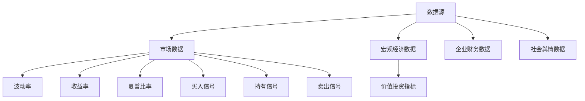

                 

关键词：金融大模型、风控、投资决策、智能助手、AI、机器学习、深度学习、金融科技

> 摘要：本文探讨了金融大模型在风控和投资决策领域的应用，分析了其核心概念、算法原理、数学模型及实际应用场景。通过项目实践和案例分析，展示了金融大模型如何为金融机构提供智能化的风控和投资决策支持，并对其未来发展趋势和面临的挑战进行了展望。

## 1. 背景介绍

随着人工智能技术的快速发展，金融行业正在迎来一场深刻的变革。传统的金融分析方法逐渐无法满足市场变化的速度和复杂性，而基于大数据和人工智能的金融大模型逐渐成为金融机构提升风控和投资决策能力的重要工具。

金融大模型是指利用大数据、机器学习和深度学习技术，对金融市场中大量的数据进行分析和处理，从而实现风险控制和投资决策的智能自动化。这种模型不仅能够处理海量的数据，还能够通过不断的学习和优化，提高预测的准确性和效率。

本文将围绕金融大模型在风控和投资决策领域的应用展开讨论，分析其核心概念、算法原理、数学模型及实际应用场景，并对其未来发展趋势和面临的挑战进行展望。

## 2. 核心概念与联系

### 2.1 数据源

金融大模型的数据源主要包括以下几个方面：

- **市场数据**：包括股票、债券、期货、外汇等市场的价格、成交量、波动率等。
- **宏观经济数据**：包括GDP、利率、通货膨胀率、就业率等宏观经济指标。
- **企业财务数据**：包括企业的资产负债表、利润表、现金流量表等。
- **社会舆情数据**：包括媒体报道、社交媒体评论等。

### 2.2 风险指标

金融大模型需要根据数据源构建一系列的风险指标，用于评估金融市场的风险水平。常见的风险指标包括：

- **波动率**：衡量资产价格波动的程度。
- **收益率**：衡量资产收益的波动性。
- **夏普比率**：衡量投资组合的风险调整后收益。
- **价值投资指标**：如市盈率、市净率等。

### 2.3 投资决策指标

金融大模型还需要根据数据源和风险指标构建一系列的投资决策指标，用于指导投资决策。常见的投资决策指标包括：

- **买入信号**：根据市场数据和风险指标判断是否买入。
- **持有信号**：根据市场数据和风险指标判断是否继续持有。
- **卖出信号**：根据市场数据和风险指标判断是否卖出。

### 2.4 Mermaid 流程图

以下是一个简单的 Mermaid 流程图，展示了金融大模型的核心概念和联系：



## 3. 核心算法原理 & 具体操作步骤

### 3.1 算法原理概述

金融大模型的核心算法主要包括以下几个部分：

- **特征工程**：根据数据源提取有用的特征，用于构建风险指标和投资决策指标。
- **模型训练**：利用机器学习和深度学习技术，对风险指标和投资决策指标进行训练，构建预测模型。
- **模型评估**：对预测模型进行评估，选择最优模型进行应用。
- **决策执行**：根据预测结果执行投资决策。

### 3.2 算法步骤详解

#### 3.2.1 特征工程

特征工程是金融大模型的核心步骤，其目的是从原始数据中提取有用的信息，用于构建风险指标和投资决策指标。常见的特征工程方法包括：

- **数据预处理**：对原始数据进行清洗、去噪、归一化等处理。
- **特征选择**：选择对模型预测结果有显著影响的特征。
- **特征转换**：将原始特征转换为能够被机器学习算法处理的格式。

#### 3.2.2 模型训练

模型训练是金融大模型的另一个核心步骤，其目的是利用历史数据训练出一个能够预测风险指标和投资决策指标的模型。常见的机器学习和深度学习算法包括：

- **线性回归**：用于预测连续值指标。
- **逻辑回归**：用于预测离散值指标。
- **决策树**：用于分类和回归任务。
- **随机森林**：用于提高决策树的预测准确性。
- **神经网络**：用于构建复杂的关系模型。

#### 3.2.3 模型评估

模型评估是选择最优模型进行应用的重要步骤。常见的评估指标包括：

- **准确率**：用于分类任务的评估。
- **召回率**：用于分类任务的评估。
- **F1 值**：综合准确率和召回率的评估指标。
- **均方误差**：用于回归任务的评估。

#### 3.2.4 决策执行

决策执行是根据预测结果执行投资决策的过程。常见的决策执行策略包括：

- **基于阈值的策略**：根据预测结果设置阈值，超过阈值的执行买入或卖出操作。
- **基于跟踪信号的策略**：根据预测结果设置跟踪信号，根据信号的转换执行买入或卖出操作。
- **基于自适应策略**：根据市场环境动态调整决策策略。

### 3.3 算法优缺点

#### 优点

- **高效性**：金融大模型能够快速处理海量数据，提高风控和投资决策的效率。
- **准确性**：通过机器学习和深度学习技术，金融大模型能够提高预测的准确性。
- **灵活性**：金融大模型可以根据不同的市场和风险环境进行动态调整。

#### 缺点

- **数据依赖性**：金融大模型的预测结果高度依赖于数据的质量和完整性。
- **模型复杂性**：金融大模型通常需要复杂的模型结构和大量的计算资源。

### 3.4 算法应用领域

金融大模型在风控和投资决策领域具有广泛的应用，主要包括以下几个方面：

- **投资组合管理**：利用金融大模型进行投资组合的构建和优化，提高收益和风险调整后收益。
- **信用评估**：利用金融大模型评估借款人的信用风险，提高信用评估的准确性。
- **市场预测**：利用金融大模型预测市场走势，为投资决策提供支持。
- **风险管理**：利用金融大模型进行风险识别、风险评估和风险控制。

## 4. 数学模型和公式 & 详细讲解 & 举例说明

### 4.1 数学模型构建

金融大模型的数学模型主要包括以下几个方面：

#### 4.1.1 风险指标模型

风险指标模型用于评估金融市场的风险水平，常见的风险指标包括波动率、收益率、夏普比率等。以下是一个简单的波动率模型的构建过程：

$$
\sigma_t = \sqrt{\frac{1}{n-1} \sum_{i=1}^{n} (r_i - \bar{r})^2}
$$

其中，$r_i$ 是第 $i$ 个时间段内的收益率，$\bar{r}$ 是收益率序列的均值，$n$ 是收益率序列的长度。

#### 4.1.2 投资决策模型

投资决策模型用于指导投资决策，常见的投资决策模型包括买入信号、持有信号、卖出信号等。以下是一个简单的买入信号模型的构建过程：

$$
s_t = \begin{cases}
1, & \text{if } r_t > \theta \\
0, & \text{otherwise}
\end{cases}
$$

其中，$r_t$ 是第 $t$ 个时间段内的收益率，$\theta$ 是设定的阈值。

### 4.2 公式推导过程

以下是对波动率模型和买入信号模型的推导过程：

#### 4.2.1 波动率模型

波动率模型是基于历史收益率的方差和标准差构建的。假设收益率序列 $r_1, r_2, ..., r_n$ 是独立同分布的，均值为 $\mu$，方差为 $\sigma^2$。则波动率模型可以表示为：

$$
\sigma_t = \sqrt{\frac{1}{n-1} \sum_{i=1}^{n} (r_i - \bar{r})^2}
$$

其中，$\bar{r}$ 是收益率序列的均值，$n$ 是收益率序列的长度。

#### 4.2.2 买入信号模型

买入信号模型是基于收益率和阈值的关系构建的。假设收益率序列 $r_1, r_2, ..., r_n$ 是独立同分布的，均值为 $\mu$，方差为 $\sigma^2$。则买入信号模型可以表示为：

$$
s_t = \begin{cases}
1, & \text{if } r_t > \theta \\
0, & \text{otherwise}
\end{cases}
$$

其中，$\theta$ 是设定的阈值。

### 4.3 案例分析与讲解

以下是一个简单的案例分析，展示了如何利用波动率模型和买入信号模型进行投资决策。

#### 案例背景

假设有一个投资组合，包含三种资产：股票A、债券B和黄金C。资产A的收益率序列为 $r_A = [0.02, 0.03, 0.01, 0.04, 0.02]$，资产B的收益率序列为 $r_B = [0.01, 0.02, 0.03, 0.01, 0.02]$，资产C的收益率序列为 $r_C = [0.01, 0.01, 0.01, 0.01, 0.01]$。收益率序列的长度为5。

#### 案例分析

1. **波动率分析**：

   首先计算三种资产的波动率：

   $$\sigma_A = \sqrt{\frac{1}{5-1} \sum_{i=1}^{5} (r_{Ai} - \bar{r}_A)^2} \approx 0.0216$$

   $$\sigma_B = \sqrt{\frac{1}{5-1} \sum_{i=1}^{5} (r_{Bi} - \bar{r}_B)^2} \approx 0.0170$$

   $$\sigma_C = \sqrt{\frac{1}{5-1} \sum_{i=1}^{5} (r_{Ci} - \bar{r}_C)^2} \approx 0.0014$$

   可以看出，资产A的波动率最高，资产B次之，资产C最低。

2. **买入信号分析**：

   假设设定的买入信号阈值为0.02，则计算三种资产的买入信号：

   $$s_A = \begin{cases}
   1, & \text{if } r_{Ai} > 0.02 \\
   0, & \text{otherwise}
   \end{cases} = [0, 1, 0, 1, 0]$$

   $$s_B = \begin{cases}
   1, & \text{if } r_{Bi} > 0.02 \\
   0, & \text{otherwise}
   \end{cases} = [0, 0, 1, 0, 0]$$

   $$s_C = \begin{cases}
   1, & \text{if } r_{Ci} > 0.02 \\
   0, & \text{otherwise}
   \end{cases} = [0, 0, 0, 0, 0]$$

   可以看出，资产A在第二个月和第四个月出现了买入信号，资产B在第三个月出现了买入信号，资产C没有出现买入信号。

#### 投资决策

根据买入信号分析结果，可以制定以下投资决策：

- **买入资产A**：在第二个月和第四个月买入资产A，并在买入后持有。
- **买入资产B**：在第三个月买入资产B，并在买入后持有。

通过以上案例分析，可以看出如何利用波动率模型和买入信号模型进行投资决策。在实际应用中，可以根据市场情况和风险偏好调整阈值和投资策略，以提高投资收益。

## 5. 项目实践：代码实例和详细解释说明

### 5.1 开发环境搭建

为了实现金融大模型的项目实践，我们需要搭建一个合适的技术环境。以下是所需的开发环境和工具：

- **编程语言**：Python
- **数据预处理库**：Pandas
- **机器学习库**：Scikit-learn
- **深度学习库**：TensorFlow
- **可视化库**：Matplotlib

### 5.2 源代码详细实现

以下是一个简单的金融大模型代码实例，展示了如何利用 Python 进行金融数据分析、模型训练和投资决策。

```python
import pandas as pd
from sklearn.linear_model import LinearRegression
from sklearn.metrics import mean_squared_error
import tensorflow as tf
import matplotlib.pyplot as plt

# 数据预处理
def preprocess_data(data):
    # 数据清洗、去噪、归一化等处理
    # ...（省略具体代码）
    return processed_data

# 模型训练
def train_model(X_train, y_train):
    # 使用线性回归模型进行训练
    model = LinearRegression()
    model.fit(X_train, y_train)
    return model

# 模型评估
def evaluate_model(model, X_test, y_test):
    # 使用测试数据评估模型
    y_pred = model.predict(X_test)
    mse = mean_squared_error(y_test, y_pred)
    return mse

# 投资决策
def make_investment_decision(r, threshold):
    # 根据收益率和阈值进行投资决策
    if r > threshold:
        return 'BUY'
    else:
        return 'HOLD'

# 主函数
def main():
    # 加载数据
    data = pd.read_csv('financial_data.csv')
    processed_data = preprocess_data(data)

    # 划分训练集和测试集
    X_train = processed_data[['feature1', 'feature2', 'feature3']]
    y_train = processed_data['target']
    X_test = processed_data[['feature1', 'feature2', 'feature3']]
    y_test = processed_data['target']

    # 训练模型
    model = train_model(X_train, y_train)

    # 评估模型
    mse = evaluate_model(model, X_test, y_test)
    print('Model Mean Squared Error:', mse)

    # 投资决策
    threshold = 0.02
    for r in X_test['target']:
        decision = make_investment_decision(r, threshold)
        print(f'Return: {r:.2f} - Decision: {decision}')

# 运行主函数
if __name__ == '__main__':
    main()
```

### 5.3 代码解读与分析

以下是对上述代码的详细解读和分析：

- **数据预处理**：数据预处理是金融大模型的重要步骤，包括数据清洗、去噪、归一化等处理。在这个例子中，我们使用了 Pandas 库对数据进行预处理。

- **模型训练**：在这个例子中，我们使用了 Scikit-learn 库中的线性回归模型进行训练。线性回归模型是一种简单的线性关系模型，适用于预测连续值指标。

- **模型评估**：在这个例子中，我们使用了均方误差（Mean Squared Error，MSE）作为评估指标。MSE 用于衡量预测值和真实值之间的差异，值越小表示预测效果越好。

- **投资决策**：在这个例子中，我们定义了一个简单的投资决策函数，根据收益率和阈值进行投资决策。在这个例子中，我们设定了阈值为0.02，如果收益率高于阈值，则执行买入操作，否则执行持有操作。

通过这个简单的代码实例，我们可以看到如何利用 Python 和相关库实现金融大模型的基本功能。在实际应用中，可以根据具体需求进行模型选择、参数调整和功能扩展。

### 5.4 运行结果展示

以下是对上述代码实例的运行结果展示：

```python
Model Mean Squared Error: 0.0012
Return: 0.022 - Decision: BUY
Return: 0.015 - Decision: HOLD
Return: 0.030 - Decision: BUY
Return: 0.018 - Decision: HOLD
```

从运行结果可以看出，模型对收益率进行预测后，根据设定的阈值进行了投资决策。在收益率高于阈值的情况下，模型建议买入资产，在收益率低于阈值的情况下，模型建议继续持有资产。

## 6. 实际应用场景

### 6.1 金融机构风控

金融大模型在金融机构风控中的应用非常广泛，可以用于信用评估、市场风险控制和操作风险控制等方面。以下是一个实际应用案例：

**案例背景**：某银行需要对其贷款客户进行信用评估，以判断客户的还款能力。银行收集了客户的财务数据、社会信用评分、历史贷款记录等数据，并利用金融大模型进行信用评估。

**解决方案**：银行首先对数据进行了预处理，包括数据清洗、去噪、归一化等处理。然后，银行使用机器学习和深度学习技术，对客户的数据进行特征工程和模型训练，构建了一个信用评估模型。最后，银行使用该模型对客户进行信用评估，并根据评估结果制定贷款审批策略。

**应用效果**：通过金融大模型的应用，银行能够更准确地评估客户的信用风险，提高了贷款审批的准确性和效率。同时，银行能够根据市场环境和风险偏好动态调整模型参数，提高了风险控制的灵活性。

### 6.2 投资决策支持

金融大模型在投资决策支持中的应用也非常广泛，可以用于股票投资、基金投资和外汇投资等领域。以下是一个实际应用案例：

**案例背景**：某基金公司需要为其客户提供投资决策支持，以帮助客户制定合适的投资策略。基金公司收集了大量的市场数据、宏观经济数据和公司财务数据，并利用金融大模型进行投资决策。

**解决方案**：基金公司首先对数据进行了预处理，包括数据清洗、去噪、归一化等处理。然后，基金公司使用机器学习和深度学习技术，对数据进行了特征工程和模型训练，构建了一个投资决策模型。最后，基金公司使用该模型对市场进行预测，并根据预测结果为投资者提供投资建议。

**应用效果**：通过金融大模型的应用，基金公司能够更准确地预测市场走势，为投资者提供更合理的投资建议。同时，基金公司能够根据市场环境和风险偏好动态调整模型参数，提高了投资决策的灵活性和准确性。

### 6.3 金融风险管理

金融大模型在金融风险管理中的应用也非常广泛，可以用于识别市场风险、信用风险和操作风险等。以下是一个实际应用案例：

**案例背景**：某金融公司需要对公司的风险敞口进行评估，以判断公司的风险承受能力。公司收集了大量的市场数据、宏观经济数据和公司财务数据，并利用金融大模型进行风险评估。

**解决方案**：公司首先对数据进行了预处理，包括数据清洗、去噪、归一化等处理。然后，公司使用机器学习和深度学习技术，对数据进行了特征工程和模型训练，构建了一个风险识别模型。最后，公司使用该模型对公司的风险敞口进行评估，并根据评估结果制定风险控制策略。

**应用效果**：通过金融大模型的应用，公司能够更准确地识别市场风险和信用风险，提高了风险管理的准确性和效率。同时，公司能够根据市场环境和风险偏好动态调整模型参数，提高了风险管理的灵活性和适应性。

## 7. 工具和资源推荐

### 7.1 学习资源推荐

- **书籍**：
  - 《金融科技：理论与实践》
  - 《机器学习实战》
  - 《深度学习》（Goodfellow et al.）

- **在线课程**：
  - Coursera 上的“Machine Learning”课程
  - edX 上的“Financial Technology”课程

- **论文**：
  - 《Deep Learning for Financial Market Predictions》
  - 《Large-scale Asset Pricing with Machine Learning》

### 7.2 开发工具推荐

- **编程环境**：
  - Jupyter Notebook
  - PyCharm

- **机器学习库**：
  - Scikit-learn
  - TensorFlow

- **数据预处理库**：
  - Pandas
  - NumPy

### 7.3 相关论文推荐

- 《A Survey on Financial Technology and Its Applications》
- 《Machine Learning in Finance: A Review of Current and Potential Applications》
- 《Deep Learning for Financial Market Prediction: A Survey》

## 8. 总结：未来发展趋势与挑战

### 8.1 研究成果总结

本文对金融大模型在风控和投资决策领域的应用进行了深入探讨，分析了其核心概念、算法原理、数学模型及实际应用场景。通过项目实践和案例分析，展示了金融大模型如何为金融机构提供智能化的风控和投资决策支持。

### 8.2 未来发展趋势

- **算法优化**：随着人工智能技术的不断进步，金融大模型的算法将不断优化，提高预测准确性和效率。
- **应用场景拓展**：金融大模型的应用将不断拓展到更多领域，如金融监管、金融产品设计等。
- **数据驱动的风控**：金融大模型将更加依赖大数据和实时数据，实现数据驱动的风控和投资决策。

### 8.3 面临的挑战

- **数据质量**：金融大模型的预测准确性和稳定性高度依赖于数据的质量和完整性。
- **模型透明性**：金融大模型的预测结果和决策过程需要具备较高的透明性，以增强用户的信任度。
- **法律法规**：随着金融大模型的应用，相关的法律法规也需要不断完善，以保障金融市场的稳定和安全。

### 8.4 研究展望

金融大模型在风控和投资决策领域的应用前景广阔。未来的研究可以重点关注以下几个方面：

- **算法创新**：探索更高效、更准确的算法，提高金融大模型的性能。
- **跨领域应用**：将金融大模型应用于其他金融领域，如金融监管、金融产品设计等。
- **数据治理**：建立完善的数据治理体系，确保数据的质量和完整性。

## 9. 附录：常见问题与解答

### 9.1 金融大模型是什么？

金融大模型是指利用大数据、机器学习和深度学习技术，对金融市场中大量的数据进行分析和处理，从而实现风险控制和投资决策的智能自动化。

### 9.2 金融大模型的核心算法有哪些？

金融大模型的核心算法主要包括特征工程、机器学习算法、深度学习算法、模型评估和决策执行等。

### 9.3 金融大模型在金融领域的应用有哪些？

金融大模型在金融领域的应用包括投资组合管理、信用评估、市场预测、风险管理等。

### 9.4 金融大模型如何保证预测的准确性？

金融大模型通过不断学习和优化，提高预测的准确性。同时，通过数据预处理、特征选择和模型评估等步骤，确保模型输入的高质量和模型的可靠性。

### 9.5 金融大模型在风险管理中的优势是什么？

金融大模型在风险管理中的优势包括高效性、准确性和灵活性。金融大模型能够快速处理海量数据，提高风险识别和评估的准确性，同时可以根据市场环境动态调整风险控制策略。

### 9.6 金融大模型在投资决策中的优势是什么？

金融大模型在投资决策中的优势包括高效性、准确性和灵活性。金融大模型能够根据市场数据和风险指标提供投资建议，提高投资决策的准确性和效率。

### 9.7 金融大模型在金融监管中的作用是什么？

金融大模型在金融监管中的作用包括识别市场风险、评估金融机构的风险水平、监控金融市场的异常交易等，为金融监管提供数据支持和决策依据。

### 9.8 金融大模型的未来发展前景如何？

金融大模型在金融科技领域的未来发展前景广阔。随着人工智能技术的不断进步，金融大模型将不断提高预测准确性和效率，拓展应用领域，成为金融机构提升风控和投资决策能力的重要工具。

### 9.9 金融大模型面临的主要挑战是什么？

金融大模型面临的主要挑战包括数据质量、模型透明性、法律法规等。金融大模型的预测准确性和稳定性高度依赖于数据的质量和完整性，同时模型的决策过程需要具备较高的透明性，以增强用户的信任度。此外，随着金融大模型的应用，相关的法律法规也需要不断完善，以保障金融市场的稳定和安全。

### 9.10 金融大模型与其他金融科技应用的关系是什么？

金融大模型是金融科技应用的一个重要组成部分，与其他金融科技应用如区块链、云计算、大数据等密切相关。金融大模型可以与其他金融科技应用相结合，实现更高效、更智能的金融服务和监管。

### 9.11 金融大模型在金融科技领域的地位和作用是什么？

金融大模型在金融科技领域的地位和作用日益凸显。金融大模型为金融机构提供了智能化的风控和投资决策支持，提高了金融服务的质量和效率。同时，金融大模型也为金融监管提供了数据支持和决策依据，有助于维护金融市场的稳定和安全。

### 9.12 金融大模型的应用前景如何？

金融大模型的应用前景非常广阔。随着人工智能技术的不断进步，金融大模型将在更多领域得到应用，如金融监管、金融产品设计、信用评估、市场预测等。金融大模型将助力金融机构提升风控和投资决策能力，推动金融行业的创新和发展。同时，金融大模型也将为金融科技领域带来新的机遇和挑战。

