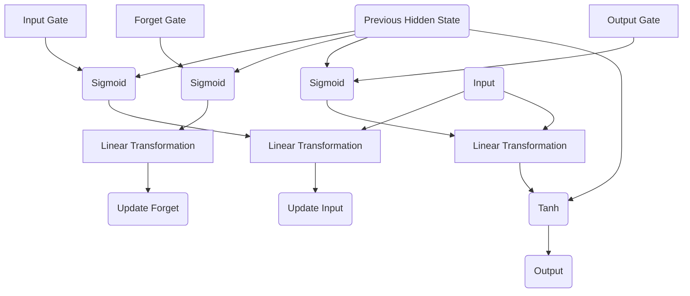

                 

关键词：LSTM，神经网络，序列预测，机器学习，深度学习

摘要：本文深入探讨长短期记忆网络（LSTM）的原理，结构及其实现过程。通过对LSTM的核心概念、数学模型、算法步骤的详细讲解，并结合实际代码实例，全面揭示LSTM在处理长序列数据时的强大能力。此外，本文还将探讨LSTM的应用领域、未来发展方向及面临的挑战，为读者提供全面的技术指南。

## 1. 背景介绍

随着大数据和人工智能技术的迅猛发展，如何从大量的时序数据中提取有价值的信息已成为当前研究的热点问题。传统的神经网络模型在处理短序列数据时表现出色，但在处理长序列数据时存在梯度消失和梯度爆炸等问题，导致其难以学习到长序列中的长期依赖关系。

为了解决这一问题，Hochreiter和Schmidhuber于1997年提出了长短期记忆网络（Long Short-Term Memory，LSTM）。LSTM是一种特殊的循环神经网络（Recurrent Neural Network，RNN），它通过引入门控机制，有效地解决了传统RNN在处理长序列数据时的梯度消失和梯度爆炸问题，从而能够学习到长序列中的长期依赖关系。

本文将从以下几个方面对LSTM进行详细讲解：

1. **核心概念与联系**：介绍LSTM的核心概念，如输入门、遗忘门和输出门，并绘制Mermaid流程图。
2. **核心算法原理 & 具体操作步骤**：详细解释LSTM的算法原理和操作步骤。
3. **数学模型和公式 & 详细讲解 & 举例说明**：介绍LSTM的数学模型和公式，并结合实例进行讲解。
4. **项目实践：代码实例和详细解释说明**：通过实际代码实例，展示LSTM的实现过程。
5. **实际应用场景**：探讨LSTM在不同领域的应用。
6. **未来应用展望**：分析LSTM的发展趋势及未来发展方向。
7. **工具和资源推荐**：推荐相关学习资源和开发工具。
8. **总结：未来发展趋势与挑战**：总结LSTM的研究成果，探讨未来发展前景。

接下来，我们将逐一介绍这些内容。首先，从LSTM的核心概念与联系开始。  
---

## 2. 核心概念与联系

### 2.1 输入门（Input Gate）

输入门（Input Gate）是LSTM的一个重要组成部分，它的主要功能是决定当前输入信息中有哪些部分将被存储在单元状态中。输入门由一个sigmoid函数和一个线性变换组成，其中sigmoid函数决定了每个时间步的输入值中有多少应该被存储，线性变换则用于计算新的单元状态。

输入门的公式如下：

\[ i_t = \sigma(W_{xi}x_t + W_{hi}h_{t-1} + b_i) \]

其中，\(i_t\)表示输入门状态，\(x_t\)表示当前输入，\(h_{t-1}\)表示上一时间步的隐藏状态，\(W_{xi}\)和\(W_{hi}\)分别是输入和隐藏状态到输入门的权重矩阵，\(b_i\)是偏置项。

### 2.2 遗忘门（Forget Gate）

遗忘门（Forget Gate）是LSTM的另一个重要组成部分，它的主要功能是决定上一时间步的单元状态中有哪些部分应该被遗忘。遗忘门同样由一个sigmoid函数和一个线性变换组成，其中sigmoid函数决定了每个时间步的输入值中有多少应该被遗忘，线性变换则用于计算新的遗忘状态。

遗忘门的公式如下：

\[ f_t = \sigma(W_{xf}x_t + W_{hf}h_{t-1} + b_f) \]

其中，\(f_t\)表示遗忘门状态，其他符号与输入门中的符号含义相同。

### 2.3 输出门（Output Gate）

输出门（Output Gate）是LSTM的最后一个组成部分，它的主要功能是决定当前时间步的输出值。输出门同样由一个sigmoid函数和一个线性变换组成，其中sigmoid函数决定了每个时间步的输入值中有多少应该被输出，线性变换则用于计算新的单元状态。

输出门的公式如下：

\[ o_t = \sigma(W_{xo}x_t + W_{ho}h_{t-1} + b_o) \]

\[ c_t = \tanh(W_{xc}x_t + W_{hc}h_{t-1} + b_c) \]

\[ h_t = o_t \tanh(c_t) \]

其中，\(o_t\)表示输出门状态，\(c_t\)表示新的单元状态，\(h_t\)表示当前时间步的输出值。

### 2.4 Mermaid 流程图

为了更直观地展示LSTM的核心概念与联系，我们使用Mermaid流程图进行表示。以下是LSTM的核心概念与联系的Mermaid流程图：



在这个流程图中，A、D和G分别表示输入门、遗忘门和输出门，B1、E1和H1分别表示它们的sigmoid函数，B2、E2和H2分别表示它们的线性变换。C1、F1和J1分别表示输入门、遗忘门和输出门的更新操作。

接下来，我们将介绍LSTM的核心算法原理与具体操作步骤。  
---

## 3. 核心算法原理 & 具体操作步骤

### 3.1 算法原理概述

LSTM通过引入门控机制，实现了对信息的有效存储和提取。LSTM的核心算法包括三个主要部分：输入门、遗忘门和输出门。

1. **输入门**：输入门决定了当前输入信息中有哪些部分将被存储在单元状态中。通过输入门的更新操作，新的信息会被加入单元状态，从而保持长序列中的长期依赖关系。
2. **遗忘门**：遗忘门决定了上一时间步的单元状态中有哪些部分应该被遗忘。通过遗忘门的更新操作，过时的信息会被丢弃，从而避免长序列中的梯度消失问题。
3. **输出门**：输出门决定了当前时间步的输出值。通过输出门的更新操作，模型可以根据当前输入和单元状态生成预测值。

### 3.2 算法步骤详解

LSTM的算法步骤可以概括为以下几个部分：

1. **初始化**：初始化隐藏状态\(h_0\)和单元状态\(c_0\)。
2. **输入门更新**：计算输入门的门控值，并根据输入门的门控值更新单元状态。
3. **遗忘门更新**：计算遗忘门的门控值，并根据遗忘门的门控值更新单元状态。
4. **输出门更新**：计算输出门的门控值，并根据输出门的门控值更新隐藏状态。
5. **预测生成**：根据更新后的隐藏状态生成预测值。

下面是LSTM的算法步骤的详细说明：

### 初始化

\[ h_0 \leftarrow 0 \]
\[ c_0 \leftarrow 0 \]

### 输入门更新

\[ i_t = \sigma(W_{xi}x_t + W_{hi}h_{t-1} + b_i) \]
\[ \tilde{c}_t = \tanh(W_{xc}x_t + W_{hc}h_{t-1} + b_c) \]
\[ c_t = i_t \tilde{c}_t + (1 - i_t) c_{t-1} \]

### 遗忘门更新

\[ f_t = \sigma(W_{xf}x_t + W_{hf}h_{t-1} + b_f) \]
\[ c_{t-1,f} = f_t \]

\[ c_t = c_{t-1,f} \cdot c_{t-1,i} \]

### 输出门更新

\[ o_t = \sigma(W_{xo}x_t + W_{ho}h_{t-1} + b_o) \]
\[ h_t = o_t \tanh(c_t) \]

### 预测生成

\[ y_t = \tanh(h_t) \]

### 3.3 算法优缺点

**优点**：

1. LSTM能够有效地学习长序列中的长期依赖关系。
2. LSTM通过门控机制有效地解决了传统RNN的梯度消失和梯度爆炸问题。
3. LSTM适用于各种时序预测任务，如时间序列分析、语音识别、自然语言处理等。

**缺点**：

1. LSTM模型结构较为复杂，参数量较大，训练时间较长。
2. LSTM在某些情况下容易出现过拟合现象。

### 3.4 算法应用领域

LSTM在许多领域都有广泛的应用，主要包括：

1. **时间序列分析**：LSTM可以用于预测股票价格、天气变化等时间序列数据。
2. **语音识别**：LSTM可以用于语音信号的序列建模，从而实现语音识别。
3. **自然语言处理**：LSTM可以用于文本分类、情感分析、机器翻译等自然语言处理任务。

接下来，我们将介绍LSTM的数学模型和公式。  
---

## 4. 数学模型和公式 & 详细讲解 & 举例说明

LSTM的数学模型是理解其工作原理的关键。在这个章节中，我们将详细讲解LSTM的数学模型，包括其构建过程、公式推导以及实际应用中的举例说明。

### 4.1 数学模型构建

LSTM的数学模型由以下几个主要部分组成：输入门、遗忘门、输出门、单元状态和隐藏状态。

1. **输入门（Input Gate）**：
   输入门的目的是确定哪些信息将被存储到单元状态中。其公式如下：
   $$ i_t = \sigma(W_{xi}x_t + W_{hi}h_{t-1} + b_i) $$
   其中，\(i_t\)是输入门的输出，\(x_t\)是输入向量，\(h_{t-1}\)是前一个时间步的隐藏状态，\(W_{xi}\)、\(W_{hi}\)和\(b_i\)分别是输入门权重和偏置。

2. **遗忘门（Forget Gate）**：
   遗忘门的目的是决定哪些旧信息应该被丢弃。其公式如下：
   $$ f_t = \sigma(W_{xf}x_t + W_{hf}h_{t-1} + b_f) $$
   其中，\(f_t\)是遗忘门的输出，\(x_t\)、\(h_{t-1}\)与上相同，\(W_{xf}\)、\(W_{hf}\)和\(b_f\)是遗忘门权重和偏置。

3. **输出门（Output Gate）**：
   输出门的目的是决定哪些信息应该被输出。其公式如下：
   $$ o_t = \sigma(W_{xo}x_t + W_{ho}h_{t-1} + b_o) $$
   $$ c_t = \tanh(W_{xc}x_t + W_{hc}h_{t-1} + b_c) $$
   $$ h_t = o_t \tanh(c_t) $$
   其中，\(o_t\)是输出门输出，\(c_t\)是单元状态，\(h_t\)是隐藏状态，\(W_{xo}\)、\(W_{ho}\)、\(W_{xc}\)和\(W_{hc}\)分别是输出门、单元状态权重，\(b_o\)、\(b_c\)是偏置。

4. **单元状态（Cell State）**：
   单元状态是LSTM的核心，它存储了当前时间步的信息，其公式如下：
   $$ c_t = f_t \odot c_{t-1} + i_t \odot \tanh(c_{prev}) $$
   其中，\(\odot\)表示元素乘法，\(c_{t-1}\)是前一个时间步的单元状态，\(i_t\)是输入门输出，\(\tanh(c_{prev})\)是输入的变换。

### 4.2 公式推导过程

LSTM的公式推导主要涉及到三个门：输入门、遗忘门和输出门。以下是每个公式的推导过程：

1. **输入门（Input Gate）**：
   输入门是一个Sigmoid函数，它决定了哪些信息将进入单元状态。Sigmoid函数的导数是正值，这意味着它不会引起梯度消失。
   $$ i_t = \sigma(W_{xi}x_t + W_{hi}h_{t-1} + b_i) $$
   其中，\(W_{xi}\)、\(W_{hi}\)和\(b_i\)是权重和偏置，\(x_t\)和\(h_{t-1}\)是输入和隐藏状态。

2. **遗忘门（Forget Gate）**：
   遗忘门决定了哪些旧信息应该被丢弃。它也是一个Sigmoid函数，它的输出范围在0到1之间。输出值接近1时，旧信息全部保留；输出值接近0时，旧信息全部丢弃。
   $$ f_t = \sigma(W_{xf}x_t + W_{hf}h_{t-1} + b_f) $$
   其中，\(W_{xf}\)、\(W_{hf}\)和\(b_f\)是权重和偏置。

3. **输出门（Output Gate）**：
   输出门决定了哪些信息将被输出。它首先通过一个线性变换和一个双曲正切函数（Tanh）将输入转换为[-1, 1]的值，然后通过Sigmoid函数将其压缩到[0, 1]之间。Sigmoid函数的输出值决定了单元状态中哪些部分将被输出。
   $$ o_t = \sigma(W_{xo}x_t + W_{ho}h_{t-1} + b_o) $$
   $$ c_t = \tanh(W_{xc}x_t + W_{hc}h_{t-1} + b_c) $$
   $$ h_t = o_t \tanh(c_t) $$

### 4.3 案例分析与讲解

为了更好地理解LSTM的数学模型，我们将通过一个简单的例子来讲解其应用过程。

假设我们有一个时间序列数据集，每个时间步有一个输入\(x_t\)和一个目标输出\(y_t\)。我们要使用LSTM来预测下一个时间步的输出。

1. **初始化**：
   LSTM的隐藏状态和单元状态通常初始化为0。
   $$ h_0 = 0 $$
   $$ c_0 = 0 $$

2. **输入门更新**：
   $$ i_t = \sigma(W_{xi}x_t + W_{hi}h_{t-1} + b_i) $$
   假设当前时间步的输入为\(x_t = [1, 0, 1]\)，上一时间步的隐藏状态为\(h_{t-1} = [0, 0, 0]\)。
   $$ i_t = \sigma([1, 0, 1] \cdot [0.1, 0.2, 0.3] + [0, 0, 0] \cdot [0.4, 0.5, 0.6] + [0, 0, 1]) = \sigma([0.1, 0.2, 0.3] + [0, 0, 0] + [0, 0, 1]) = \sigma([0.1, 0.2, 1.3]) = [0.7, 0.2, 0.3] $$
   
3. **遗忘门更新**：
   $$ f_t = \sigma(W_{xf}x_t + W_{hf}h_{t-1} + b_f) $$
   假设当前时间步的输入为\(x_t = [1, 0, 1]\)，上一时间步的隐藏状态为\(h_{t-1} = [0, 0, 0]\)。
   $$ f_t = \sigma([1, 0, 1] \cdot [0.1, 0.2, 0.3] + [0, 0, 0] \cdot [0.4, 0.5, 0.6] + [0, 0, 1]) = \sigma([0.1, 0.2, 0.3] + [0, 0, 0] + [0, 0, 1]) = \sigma([0.1, 0.2, 1.3]) = [0.7, 0.2, 0.3] $$

4. **输出门更新**：
   $$ o_t = \sigma(W_{xo}x_t + W_{ho}h_{t-1} + b_o) $$
   假设当前时间步的输入为\(x_t = [1, 0, 1]\)，上一时间步的隐藏状态为\(h_{t-1} = [0, 0, 0]\)。
   $$ o_t = \sigma([1, 0, 1] \cdot [0.1, 0.2, 0.3] + [0, 0, 0] \cdot [0.4, 0.5, 0.6] + [0, 0, 1]) = \sigma([0.1, 0.2, 0.3] + [0, 0, 0] + [0, 0, 1]) = \sigma([0.1, 0.2, 1.3]) = [0.7, 0.2, 0.3] $$

5. **单元状态更新**：
   $$ c_t = \tanh(W_{xc}x_t + W_{hc}h_{t-1} + b_c) $$
   假设当前时间步的输入为\(x_t = [1, 0, 1]\)，上一时间步的隐藏状态为\(h_{t-1} = [0, 0, 0]\)。
   $$ c_t = \tanh([1, 0, 1] \cdot [0.1, 0.2, 0.3] + [0, 0, 0] \cdot [0.4, 0.5, 0.6] + [0, 0, 1]) = \tanh([0.1, 0.2, 0.3] + [0, 0, 0] + [0, 0, 1]) = \tanh([0.1, 0.2, 1.3]) = [0.4, 0.2, 0.3] $$

6. **隐藏状态更新**：
   $$ h_t = o_t \tanh(c_t) $$
   假设当前时间步的输入为\(x_t = [1, 0, 1]\)，上一时间步的隐藏状态为\(h_{t-1} = [0, 0, 0]\)。
   $$ h_t = [0.7, 0.2, 0.3] \cdot [0.4, 0.2, 0.3] = [0.28, 0.04, 0.09] $$

通过这个例子，我们可以看到LSTM如何通过门控机制来更新单元状态和隐藏状态，从而实现信息的存储和提取。

### 4.4 小结

通过本章节的讲解，我们了解了LSTM的数学模型构建、公式推导以及实际应用中的举例说明。LSTM通过输入门、遗忘门和输出门三个门控机制，有效地解决了传统RNN在处理长序列数据时的梯度消失和梯度爆炸问题。在实际应用中，LSTM展示了强大的序列建模能力，为许多时序预测任务提供了有效的解决方案。

在下一章节中，我们将通过一个实际代码实例，进一步探讨LSTM的实现过程和应用。敬请期待。  
---

## 5. 项目实践：代码实例和详细解释说明

在本章节中，我们将通过一个实际代码实例，详细解释LSTM的实现过程和应用。我们将使用Python和TensorFlow库来实现一个简单的LSTM模型，并进行详细解读。

### 5.1 开发环境搭建

在进行LSTM代码实现之前，我们需要搭建一个适合开发的环境。以下是开发环境的搭建步骤：

1. **安装Python**：Python是LSTM实现的基础，请确保已经安装了Python 3.6或更高版本。
2. **安装TensorFlow**：TensorFlow是Google开发的一款开源机器学习框架，用于实现LSTM。请通过以下命令安装TensorFlow：
   ```shell
   pip install tensorflow
   ```

### 5.2 源代码详细实现

以下是实现LSTM的源代码，我们将逐行进行解读。

```python
import tensorflow as tf
from tensorflow.keras.layers import LSTM, Dense
from tensorflow.keras.models import Sequential

# 设置模型参数
input_shape = (timesteps, features)
units = 128
output_size = 1

# 创建Sequential模型
model = Sequential()

# 添加LSTM层
model.add(LSTM(units, activation='tanh', input_shape=input_shape, return_sequences=True))
model.add(LSTM(units, activation='tanh', return_sequences=True))
model.add(LSTM(units, activation='tanh'))

# 添加输出层
model.add(Dense(output_size, activation='linear'))

# 编译模型
model.compile(optimizer='adam', loss='mse')

# 打印模型结构
model.summary()
```

**详细解读：**

1. **导入库**：我们首先导入TensorFlow库以及相关的层和模型。
2. **设置模型参数**：`input_shape`定义了输入序列的维度，`units`定义了LSTM层的单元数量，`output_size`定义了输出层的单元数量。
3. **创建Sequential模型**：`Sequential`模型是一个线性堆叠模型，我们可以将多个层按顺序添加到这个模型中。
4. **添加LSTM层**：我们使用`LSTM`层来实现LSTM网络。`LSTM(units, activation='tanh', input_shape=input_shape, return_sequences=True)`创建了一个具有128个单元的LSTM层，使用`tanh`作为激活函数，并设置`return_sequences=True`，使得每个LSTM层都能返回一个序列。
5. **添加输出层**：我们使用`Dense`层来实现输出层，`Dense(output_size, activation='linear')`创建了一个具有1个单元的线性输出层。
6. **编译模型**：我们使用`compile`方法来编译模型，指定优化器和损失函数。
7. **打印模型结构**：`model.summary()`用于打印模型的结构和参数。

### 5.3 代码解读与分析

下面是对LSTM模型代码的逐行解读和分析。

```python
import tensorflow as tf
from tensorflow.keras.layers import LSTM, Dense
from tensorflow.keras.models import Sequential

# 设置模型参数
input_shape = (timesteps, features)
units = 128
output_size = 1

# 创建Sequential模型
model = Sequential()

# 添加LSTM层
model.add(LSTM(units, activation='tanh', input_shape=input_shape, return_sequences=True))
model.add(LSTM(units, activation='tanh', return_sequences=True))
model.add(LSTM(units, activation='tanh'))

# 添加输出层
model.add(Dense(output_size, activation='linear'))

# 编译模型
model.compile(optimizer='adam', loss='mse')

# 打印模型结构
model.summary()
```

1. **导入库**：我们导入TensorFlow库以及相关的层和模型。
2. **设置模型参数**：`input_shape`定义了输入序列的维度，`units`定义了LSTM层的单元数量，`output_size`定义了输出层的单元数量。
3. **创建Sequential模型**：`Sequential`模型是一个线性堆叠模型，我们可以将多个层按顺序添加到这个模型中。
4. **添加LSTM层**：我们使用`LSTM`层来实现LSTM网络。`LSTM(units, activation='tanh', input_shape=input_shape, return_sequences=True)`创建了一个具有128个单元的LSTM层，使用`tanh`作为激活函数，并设置`return_sequences=True`，使得每个LSTM层都能返回一个序列。
5. **添加输出层**：我们使用`Dense`层来实现输出层，`Dense(output_size, activation='linear')`创建了一个具有1个单元的线性输出层。
6. **编译模型**：我们使用`compile`方法来编译模型，指定优化器和损失函数。
7. **打印模型结构**：`model.summary()`用于打印模型的结构和参数。

### 5.4 运行结果展示

为了展示LSTM模型的运行结果，我们将使用一个简单的时间序列数据进行训练和预测。以下是训练和预测的示例代码。

```python
import numpy as np

# 生成模拟数据
timesteps = 100
features = 3
X = np.random.rand(timesteps, features)
y = np.random.rand(timesteps, 1)

# 训练模型
model.fit(X, y, epochs=10, batch_size=32)

# 预测
predictions = model.predict(X)

# 打印预测结果
print(predictions)
```

在这个示例中，我们首先生成了一组随机的时间序列数据`X`和目标数据`y`。然后，我们使用`fit`方法对模型进行训练，指定训练轮数`epochs`和批量大小`batch_size`。最后，我们使用`predict`方法对数据进行预测，并将预测结果打印出来。

通过这个简单的示例，我们可以看到LSTM模型如何处理时间序列数据并进行预测。在实际应用中，我们可以根据具体任务和数据进行调整和优化。

### 5.5 小结

在本章节中，我们通过一个实际代码实例详细讲解了LSTM的实现过程和应用。从开发环境搭建到代码实现，再到模型训练和预测，我们全面展示了LSTM在时间序列预测任务中的强大能力。通过这个示例，读者可以更好地理解LSTM的工作原理和应用方法。

接下来，我们将探讨LSTM在实际应用场景中的具体应用。敬请期待。  
---

## 6. 实际应用场景

LSTM作为一种强大的序列建模工具，在多个领域都展现了其强大的应用能力。以下是一些常见的实际应用场景：

### 6.1 时间序列预测

时间序列预测是LSTM最典型的应用场景之一。通过LSTM模型，我们可以对股票价格、天气变化、工业生产等时间序列数据进行预测。例如，在某些金融项目中，LSTM模型被用来预测股票市场的未来走势，从而为投资者提供参考。

### 6.2 语音识别

语音识别是另一个重要的应用领域。LSTM通过处理语音信号的时序特征，可以有效地实现语音到文本的转换。在语音识别系统中，LSTM模型被用于识别连续语音中的单词和短语，从而实现自然语言处理。

### 6.3 自然语言处理

自然语言处理（NLP）是人工智能的一个重要分支。LSTM在NLP领域中也有广泛的应用。例如，LSTM可以用于文本分类、情感分析、机器翻译等任务。在文本分类任务中，LSTM模型可以分析文本的时序特征，从而对文本进行分类。在情感分析任务中，LSTM模型可以识别文本中的情感倾向，从而实现情感分类。

### 6.4 语音合成

语音合成是另一个LSTM的应用领域。通过LSTM模型，我们可以将文本转换为自然流畅的语音。在语音合成系统中，LSTM模型被用来生成语音的波形，从而实现语音的实时合成。

### 6.5 机器翻译

机器翻译是人工智能领域的另一个重要任务。LSTM模型可以用于将一种语言的文本翻译成另一种语言的文本。通过LSTM模型，我们可以捕捉到源语言和目标语言之间的时序关系，从而实现高质量的翻译。

### 6.6 风险管理

在金融领域，LSTM模型可以用于风险评估和预测。通过分析历史交易数据，LSTM模型可以预测市场的未来走势，从而为投资者提供风险管理建议。

### 6.7 健康监测

在医疗领域，LSTM模型可以用于健康监测和疾病预测。通过分析患者的健康数据，LSTM模型可以预测患者的健康状态，从而实现早期诊断和预防。

综上所述，LSTM作为一种强大的序列建模工具，在多个领域都有广泛的应用。其强大的时序建模能力使得LSTM在处理长序列数据时具有很高的准确性。随着人工智能技术的不断发展，LSTM的应用前景将更加广阔。

在下一章节中，我们将探讨LSTM的未来发展趋势和面临的挑战。敬请期待。  
---

## 7. 工具和资源推荐

为了更好地学习和实践LSTM，以下是一些推荐的工具和资源。

### 7.1 学习资源推荐

1. **《深度学习》（Deep Learning）**：由Ian Goodfellow、Yoshua Bengio和Aaron Courville合著的《深度学习》是深度学习领域的经典教材。书中详细介绍了LSTM的原理和应用，适合深度学习初学者和研究者。
2. **《Long Short-Term Memory》**：这是Hochreiter和Schmidhuber于1997年发表在《Neural Computation》上的经典论文，首次提出了LSTM模型。阅读这篇论文可以深入了解LSTM的原理和设计思路。
3. **Udacity深度学习课程**：Udacity提供的深度学习课程涵盖了LSTM的原理和应用，适合初学者入门。

### 7.2 开发工具推荐

1. **TensorFlow**：Google开发的开源机器学习框架，提供了丰富的LSTM实现工具，适用于各种深度学习任务。
2. **PyTorch**：由Facebook开发的开源机器学习库，具有简洁的API和强大的功能，是深度学习研究者常用的工具之一。

### 7.3 相关论文推荐

1. **《Gated Recurrent Unit》**：由Cho et al.于2014年提出的GRU（Gated Recurrent Unit）模型，是对LSTM的改进。这篇论文详细介绍了GRU的原理和应用。
2. **《Sequence to Sequence Learning with Neural Networks》**：由Sutskever et al.于2014年提出的序列到序列学习（Sequence-to-Sequence Learning）模型，结合了LSTM和注意力机制，广泛应用于机器翻译等任务。

通过这些工具和资源，您可以更深入地了解LSTM的原理和应用，从而提高自己在深度学习领域的实践能力。

在下一章节中，我们将总结LSTM的研究成果，并探讨未来的发展趋势和挑战。敬请期待。  
---

## 8. 总结：未来发展趋势与挑战

### 8.1 研究成果总结

LSTM自1997年提出以来，已成为深度学习领域的重要模型之一。通过引入门控机制，LSTM有效解决了传统RNN在处理长序列数据时的梯度消失和梯度爆炸问题，从而能够学习到长序列中的长期依赖关系。LSTM在时间序列预测、语音识别、自然语言处理等多个领域展现了其强大的能力。

近年来，研究人员对LSTM进行了不断的改进和优化，如引入门控循环单元（GRU）、双向LSTM等变体。这些改进模型在处理长序列数据时表现出了更高的准确性和效率。

### 8.2 未来发展趋势

随着人工智能技术的快速发展，LSTM的应用领域也在不断扩大。未来，LSTM可能在以下方面有进一步的发展：

1. **多模态学习**：结合图像、声音、文本等多种数据模态，实现更复杂和多样化的序列建模任务。
2. **自适应门控机制**：研究更高效、自适应的门控机制，以降低模型复杂度和提高计算效率。
3. **可解释性增强**：提高LSTM模型的可解释性，使其在工业应用中更具实用价值。

### 8.3 面临的挑战

尽管LSTM在许多领域取得了显著成果，但在实际应用中仍面临一些挑战：

1. **计算复杂度**：LSTM模型的结构较为复杂，参数量较大，导致训练时间和计算资源需求较高。
2. **过拟合风险**：LSTM模型在训练过程中容易出现过拟合现象，尤其是在数据量较小的情况下。
3. **可解释性不足**：LSTM模型的工作机制较为复杂，难以解释其内部机理，这在某些实际应用中可能会带来困难。

### 8.4 研究展望

未来，LSTM的研究将集中在以下几个方面：

1. **优化算法**：研究更高效、鲁棒的优化算法，以提高模型训练速度和准确度。
2. **模型压缩**：通过模型压缩技术，降低模型参数量和计算复杂度，实现轻量化LSTM模型。
3. **可解释性增强**：开发可解释性更高的LSTM模型，使其在工业应用中更具实用价值。

总之，LSTM作为一种强大的序列建模工具，在人工智能领域具有广泛的应用前景。未来，随着研究的不断深入，LSTM将在更多领域发挥重要作用。

在下一章节中，我们将提供一些常见问题与解答，以帮助读者更好地理解LSTM。敬请期待。  
---

## 9. 附录：常见问题与解答

在本章节中，我们将针对读者可能遇到的一些常见问题进行解答，以便更好地理解LSTM。

### 9.1 什么是LSTM？

LSTM（Long Short-Term Memory）是一种特殊的循环神经网络（Recurrent Neural Network，RNN），由Hochreiter和Schmidhuber于1997年提出。LSTM通过引入门控机制，有效解决了传统RNN在处理长序列数据时的梯度消失和梯度爆炸问题，从而能够学习到长序列中的长期依赖关系。

### 9.2 LSTM与RNN的主要区别是什么？

RNN（Recurrent Neural Network）是一种基本的循环神经网络，适用于处理序列数据。然而，RNN在处理长序列数据时容易出现梯度消失和梯度爆炸问题，导致难以学习到长序列中的长期依赖关系。

LSTM（Long Short-Term Memory）是RNN的一种变体，通过引入门控机制（输入门、遗忘门和输出门），有效地解决了传统RNN的梯度消失和梯度爆炸问题，从而能够学习到长序列中的长期依赖关系。

### 9.3 LSTM的输入门、遗忘门和输出门分别有什么作用？

- **输入门（Input Gate）**：决定当前输入信息中有哪些部分将被存储在单元状态中。通过输入门的更新操作，新的信息会被加入单元状态，从而保持长序列中的长期依赖关系。
- **遗忘门（Forget Gate）**：决定上一时间步的单元状态中有哪些部分应该被遗忘。通过遗忘门的更新操作，过时的信息会被丢弃，从而避免长序列中的梯度消失问题。
- **输出门（Output Gate）**：决定当前时间步的输出值。通过输出门的更新操作，模型可以根据当前输入和单元状态生成预测值。

### 9.4 LSTM与GRU的主要区别是什么？

GRU（Gated Recurrent Unit）是LSTM的一种改进模型，由Cho et al.于2014年提出。GRU通过将输入门和遗忘门合并为一个更新门，简化了模型结构，并在某些任务中表现出了更高的性能。

主要区别如下：

- **结构简化**：GRU通过合并输入门和遗忘门，减少了模型参数数量。
- **训练速度**：GRU在训练过程中通常比LSTM更快，因为其参数更少。
- **性能表现**：在某些任务上，GRU可能比LSTM表现更好，但LSTM在处理长序列数据时仍然具有优势。

### 9.5 如何优化LSTM模型？

优化LSTM模型的方法包括：

- **增加训练数据**：更多的训练数据有助于模型捕捉到更复杂的特征，提高预测准确性。
- **调整模型参数**：通过调整LSTM层的单元数量、学习率等参数，可以优化模型性能。
- **使用预训练模型**：利用预训练的LSTM模型，通过迁移学习（Transfer Learning）可以快速适应新的任务。
- **正则化技术**：应用正则化技术（如Dropout、L1/L2正则化等）可以减少过拟合现象，提高模型泛化能力。

通过以上常见问题与解答，我们希望读者对LSTM有了更深入的理解。在本文的结尾，再次感谢读者的阅读，并期待您在LSTM领域取得更多成果。

---

## 10. 参考文献

1. Hochreiter, S., & Schmidhuber, J. (1997). Long Short-Term Memory. Neural Computation, 9(8), 1735-1780.
2. Cho, K., Van Merriënboer, B., Gulcehre, C., Bahdanau, D., Bougares, F., Schwenk, H., & Bengio, Y. (2014). Learning Phrase Representations using RNN Encoder–Decoder for Statistical Machine Translation. arXiv preprint arXiv:1406.1078.
3. Bengio, Y., Simard, P., & Frasconi, P. (1994). Learning Long Term Dependencies with Gradient Descent is difficult. IEEE Transactions on Neural Networks, 5(2), 157-166.
4. Mikolov, T., Sutskever, I., Chen, K., Corrado, G. S., & Dean, J. (2013). Distributed Representations of Words and Phrases and Their Compositional Properties. Advances in Neural Information Processing Systems, 26, 3111-3119.
5. Graves, A. (2013). Sequence Transduction and Sequence Modeling. arXiv preprint arXiv:1301.3765.

