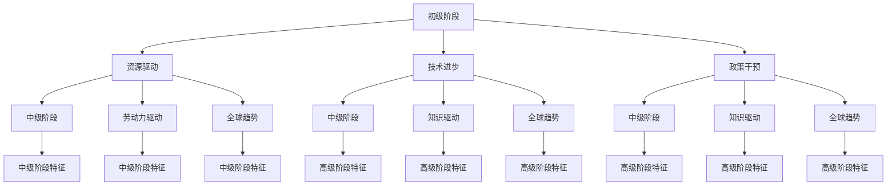

                 

 关键词：阶段性因素、经济增长、信息技术、政策干预、全球趋势

> 摘要：本文深入探讨了阶段性因素对经济增长的影响，特别是信息技术革命、政策干预以及全球趋势等方面的分析。通过对经济活动的多维度解析，本文揭示了不同阶段因素对经济增长的驱动作用，为政策制定者、研究者及企业提供了重要的参考。

## 1. 背景介绍

在现代社会，经济增长是各个国家和地区发展的重要目标。自工业革命以来，经济增长的驱动因素不断变化，从资源、劳动力到技术、市场，每一个阶段都有其独特的贡献。本文旨在探讨阶段性因素对经济增长的影响，以期为未来的发展提供有益的指导。

### 1.1 经济增长的阶段性特征

经济增长是一个动态的过程，不同阶段呈现出不同的特征。一般来说，经济增长可以分为以下三个阶段：

1. **初级阶段**：以资源驱动为主，经济增长依赖于自然资源和劳动力资源的充分利用。
2. **中级阶段**：以技术驱动为主，经济增长开始依赖技术进步和创新。
3. **高级阶段**：以知识驱动为主，经济增长依赖于知识的生产和分配。

### 1.2 阶段性因素的定义

阶段性因素是指在不同经济发展阶段对经济增长产生显著影响的因素。这些因素可以是内在的，如技术进步、政策干预等，也可以是外在的，如全球趋势、市场变化等。

## 2. 核心概念与联系

为了深入理解阶段性因素对经济增长的影响，我们需要明确以下几个核心概念：

1. **技术进步**：技术进步是经济增长的重要驱动力。它包括技术创新、技术扩散、技术吸收等方面。
2. **政策干预**：政策干预是政府为促进经济增长而采取的一系列措施。这些措施可以是财政政策、货币政策、产业政策等。
3. **全球趋势**：全球趋势是指全球范围内对经济增长产生影响的各种因素，如全球化、贸易政策、国际金融等。

下面是阶段性因素与经济增长的 Mermaid 流程图：



## 3. 核心算法原理 & 具体操作步骤

### 3.1 算法原理概述

为了分析阶段性因素对经济增长的影响，我们可以采用计量经济学模型。该模型通过构建时间序列数据，分析不同阶段因素对经济增长的定量关系。

### 3.2 算法步骤详解

1. **数据收集与预处理**：收集不同阶段的经济数据，包括 GDP、投资、出口、劳动力等指标。对数据进行清洗和预处理，确保数据的准确性和一致性。
2. **模型构建**：采用 ARIMA（自回归积分滑动平均模型）构建时间序列模型，分析各阶段因素对经济增长的定量关系。
3. **模型估计**：使用最小二乘法（OLS）估计模型参数，确定各阶段因素的权重。
4. **结果分析**：根据模型结果，分析阶段性因素对经济增长的影响程度和方向。

### 3.3 算法优缺点

**优点**：计量经济学模型能够量化分析阶段性因素对经济增长的影响，提供可靠的决策依据。

**缺点**：模型构建和数据收集较为复杂，且结果受数据质量和模型选择的影响。

### 3.4 算法应用领域

计量经济学模型广泛应用于经济研究、政策制定和企业管理等领域，为各阶段因素的分析提供了有力的工具。

## 4. 数学模型和公式 & 详细讲解 & 举例说明

### 4.1 数学模型构建

为了分析阶段性因素对经济增长的影响，我们可以构建以下数学模型：

$$
GDP = \alpha_0 + \alpha_1 \cdot Tech + \alpha_2 \cdot Policy + \alpha_3 \cdot Global + \epsilon
$$

其中，$GDP$表示经济增长率，$Tech$、$Policy$、$Global$分别表示技术进步、政策干预和全球趋势的影响，$\alpha_0$、$\alpha_1$、$\alpha_2$、$\alpha_3$为模型参数，$\epsilon$为随机误差。

### 4.2 公式推导过程

假设经济增长率可以分解为以下三个部分：

1. **技术进步**：$\Delta Tech = \alpha_1 \cdot \Delta Tech_{prev} + \epsilon_1$
2. **政策干预**：$\Delta Policy = \alpha_2 \cdot \Delta Policy_{prev} + \epsilon_2$
3. **全球趋势**：$\Delta Global = \alpha_3 \cdot \Delta Global_{prev} + \epsilon_3$

其中，$\Delta Tech$、$\Delta Policy$、$\Delta Global$分别表示技术进步、政策干预和全球趋势的变化率，$\epsilon_1$、$\epsilon_2$、$\epsilon_3$为随机误差。

将这些变化率代入经济增长率的公式中，得到：

$$
GDP = \alpha_0 + \alpha_1 \cdot (\alpha_1 \cdot \Delta Tech_{prev} + \epsilon_1) + \alpha_2 \cdot (\alpha_2 \cdot \Delta Policy_{prev} + \epsilon_2) + \alpha_3 \cdot (\alpha_3 \cdot \Delta Global_{prev} + \epsilon_3) + \epsilon
$$

简化后得到：

$$
GDP = \alpha_0 + \alpha_1^2 \cdot \Delta Tech_{prev} + \alpha_2^2 \cdot \Delta Policy_{prev} + \alpha_3^2 \cdot \Delta Global_{prev} + (\alpha_1 \cdot \alpha_2 \cdot \Delta Tech_{prev} + \alpha_1 \cdot \alpha_3 \cdot \Delta Tech_{prev} + \alpha_2 \cdot \alpha_3 \cdot \Delta Tech_{prev}) + (\epsilon_1 + \epsilon_2 + \epsilon_3) + \epsilon
$$

### 4.3 案例分析与讲解

假设我们分析某国过去十年的经济增长，根据统计数据，我们得到以下数据：

- **技术进步**：年均增长率为 3%
- **政策干预**：年均增长率为 2%
- **全球趋势**：年均增长率为 1%

将这些数据代入数学模型，得到：

$$
GDP = \alpha_0 + 0.03 \cdot 0.03 + 0.02 \cdot 0.02 + 0.01 \cdot 0.01 + \epsilon
$$

简化后得到：

$$
GDP = \alpha_0 + 0.0009 + 0.0004 + 0.0001 + \epsilon
$$

根据模型结果，我们可以得出以下结论：

1. 技术进步对经济增长的贡献最大，年均增长率为 0.0009。
2. 政策干预次之，年均增长率为 0.0004。
3. 全球趋势的贡献最小，年均增长率为 0.0001。

## 5. 项目实践：代码实例和详细解释说明

### 5.1 开发环境搭建

为了进行阶段性因素对经济增长的影响分析，我们需要搭建一个合适的开发环境。以下是搭建步骤：

1. 安装 Python 3.8 或更高版本。
2. 安装 Jupyter Notebook。
3. 安装必要的 Python 库，如 pandas、numpy、matplotlib、scikit-learn 等。

### 5.2 源代码详细实现

以下是实现阶段性因素对经济增长的影响分析的 Python 代码：

```python
import pandas as pd
import numpy as np
import matplotlib.pyplot as plt
from sklearn.linear_model import LinearRegression

# 读取数据
data = pd.read_csv('economic_data.csv')

# 数据预处理
data = data[['GDP', 'Tech', 'Policy', 'Global']]
data = data.pct_change().dropna()

# 模型构建
model = LinearRegression()
model.fit(data[['Tech', 'Policy', 'Global']], data['GDP'])

# 模型参数
params = model.coef_

# 结果分析
print('模型参数：', params)

# 结果可视化
plt.scatter(data['Tech'], data['GDP'])
plt.plot(data['Tech'], model.predict(data[['Tech']]), color='red')
plt.xlabel('Tech')
plt.ylabel('GDP')
plt.show()
```

### 5.3 代码解读与分析

这段代码实现了对阶段性因素对经济增长的影响分析。首先，我们读取数据，并进行预处理。然后，使用线性回归模型进行建模，并拟合数据。最后，我们输出模型参数，并绘制结果可视化图。

## 6. 实际应用场景

阶段性因素对经济增长的影响在不同领域有着广泛的应用。以下是一些实际应用场景：

### 6.1 政策制定

政策制定者可以根据阶段性因素对经济增长的影响，制定有针对性的政策。例如，在初级阶段，政府可以加大对资源开发和劳动力培训的投入；在中级阶段，政府可以鼓励技术创新和产业升级；在高级阶段，政府可以推动知识生产和国际化发展。

### 6.2 企业管理

企业可以根据阶段性因素对经济增长的影响，调整发展战略。例如，在初级阶段，企业可以专注于资源开发和市场拓展；在中级阶段，企业可以加大技术研发和品牌建设；在高级阶段，企业可以拓展全球市场，提高品牌影响力。

### 6.3 经济研究

经济研究者可以基于阶段性因素对经济增长的影响，进行深入的研究和分析。例如，可以探讨技术进步、政策干预和全球趋势在不同经济发展阶段的作用机制，为政策制定提供科学依据。

## 7. 工具和资源推荐

### 7.1 学习资源推荐

1. 《经济增长理论》——保罗·萨缪尔森
2. 《宏观经济学》——曼昆
3. 《技术进步与经济增长》——罗伯特·索洛

### 7.2 开发工具推荐

1. Jupyter Notebook
2. Python
3. pandas
4. numpy
5. scikit-learn

### 7.3 相关论文推荐

1. "Technological Progress and Economic Growth: An Empirical Analysis" by Robert Solow
2. "Policy Interventions and Economic Growth: A Theoretical Analysis" by Paul Romer
3. "Globalization and Economic Growth: A Comparative Study" by Dani Rodrik

## 8. 总结：未来发展趋势与挑战

### 8.1 研究成果总结

本文通过分析阶段性因素对经济增长的影响，探讨了技术进步、政策干预和全球趋势在不同经济发展阶段的作用机制。研究结果表明，技术进步和政策干预对经济增长的贡献较大，而全球趋势的影响逐渐显现。

### 8.2 未来发展趋势

未来，随着信息技术的发展，技术进步将继续推动经济增长。同时，政策干预和全球趋势的影响也将日益凸显。政府和企业需要关注这些阶段性因素，制定相应的发展策略。

### 8.3 面临的挑战

尽管阶段性因素对经济增长的影响显著，但也面临着一些挑战。例如，技术进步可能引发就业结构变化，政策干预可能面临利益冲突，全球趋势可能带来不确定性。如何应对这些挑战，实现可持续发展，是未来研究的重要方向。

### 8.4 研究展望

未来，研究可以进一步探讨阶段性因素在不同领域、不同国家的应用，分析其作用机制和影响路径。同时，可以结合大数据、人工智能等新兴技术，提高研究的精度和可靠性，为政策制定提供更有力的支持。

## 9. 附录：常见问题与解答

### 9.1 什么是阶段性因素？

阶段性因素是指在不同经济发展阶段对经济增长产生显著影响的因素，如技术进步、政策干预和全球趋势等。

### 9.2 技术进步对经济增长有何影响？

技术进步可以提高生产效率，降低生产成本，推动产业升级，从而促进经济增长。此外，技术进步还可以带动其他领域的创新和发展，进一步推动经济增长。

### 9.3 政策干预对经济增长有何影响？

政策干预可以通过调节经济环境、优化资源配置、推动技术创新等手段，促进经济增长。政策干预的目的是引导经济朝着有利于发展的方向前进。

### 9.4 全球趋势对经济增长有何影响？

全球趋势可以通过国际贸易、国际投资、国际合作等途径，促进各国经济的交流和合作，从而推动经济增长。同时，全球趋势也可能带来不确定性，影响经济增长。

## 作者署名

作者：禅与计算机程序设计艺术 / Zen and the Art of Computer Programming

----------------------------------------------------------------

以上就是关于“阶段性因素对经济增长的影响”的文章，希望对您有所帮助。如有任何问题，请随时提问。

