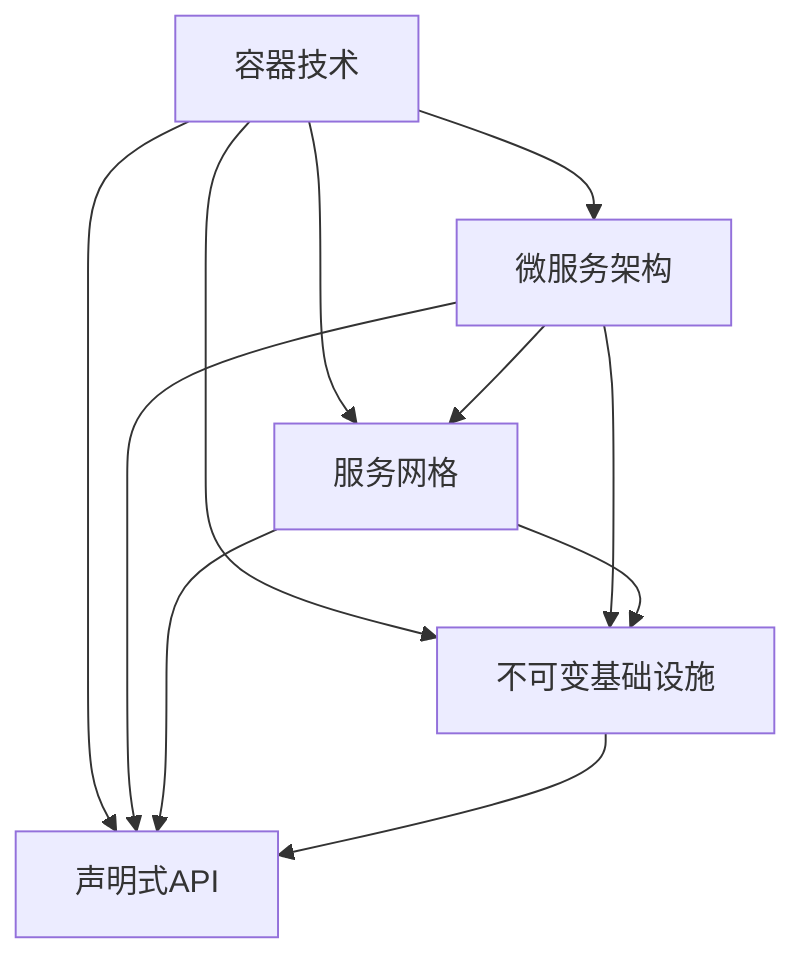

                 

关键词：云原生，架构设计，编程挑战，阿里云，云计算，技术面试，IT行业

## 摘要

本文将围绕阿里云2025年社招云原生架构师编程挑战100题展开，深入探讨云原生技术的基本概念、核心原理以及在实际项目中的应用。文章将分为八个主要章节，包括背景介绍、核心概念与联系、核心算法原理与具体操作步骤、数学模型与公式讲解、项目实践、实际应用场景、工具和资源推荐，以及总结与未来展望。通过本文的阅读，读者将能够全面了解云原生技术的应用前景，掌握解决实际问题的技术方法和策略。

## 1. 背景介绍

### 云原生技术概述

云原生（Cloud Native）是一种构建和运行应用程序的方法论，它旨在充分利用云计算的优势，实现应用程序的灵活、可扩展和高可用。云原生技术包括容器（Container）、微服务（Microservices）、服务网格（Service Mesh）、不可变基础设施（Immutable Infrastructure）和声明式API（Declarative API）等核心概念。这些技术共同构成了云原生架构的基础，使得应用程序能够更好地适应云计算环境。

### 阿里云2025年社招云原生架构师编程挑战

阿里云作为中国领先的云计算服务提供商，一直致力于推动云原生技术的发展。2025年社招云原生架构师编程挑战旨在选拔具备云原生技术实战经验的高端人才，为云原生生态培养和储备技术力量。本次编程挑战包含100道题目，涵盖了云原生技术的各个方面，包括容器编排、微服务架构、服务网格、云原生安全等。

### 目的意义

本文旨在通过对阿里云2025年社招云原生架构师编程挑战100题的深入解析，帮助读者理解云原生技术的基本原理和应用场景，掌握解决实际问题的技术方法和策略。同时，本文也将对云原生技术的未来发展趋势和挑战进行展望，为读者提供有益的参考。

## 2. 核心概念与联系

### 云原生核心技术

为了更好地理解云原生技术，我们需要了解以下几个核心概念：

**容器（Container）：** 容器是一种轻量级、可移植的运行环境，它将应用程序及其依赖环境封装在一起，使得应用程序能够在不同的计算环境中无缝运行。

**微服务（Microservices）：** 微服务架构是一种将大型应用程序拆分为一系列小型、独立的服务单元的方法，每个服务负责应用程序的一个特定功能，可以通过网络独立部署和扩展。

**服务网格（Service Mesh）：** 服务网格是一种专门用于管理服务之间通信的基础设施层，它提供了一种抽象化的通信方式，使得服务之间可以独立部署和扩展，同时保证通信的高效和安全。

**不可变基础设施（Immutable Infrastructure）：** 不可变基础设施是指将基础设施视为不可变的，所有更改都通过创建新的基础设施实例来实现，从而保证基础设施的一致性和可重现性。

**声明式API（Declarative API）：** 声明式API提供了一种描述性的接口，用于定义应用程序的预期状态和行为，从而实现自动化部署和管理。

### Mermaid 流程图

下面是一个简化的Mermaid流程图，用于展示云原生技术的核心概念和它们之间的联系：



通过这个流程图，我们可以清晰地看到云原生技术各组件之间的相互作用和依赖关系，以及它们在整体架构中的作用。

## 3. 核心算法原理 & 具体操作步骤

### 3.1 算法原理概述

云原生架构的核心在于如何高效地管理分布式系统中的资源和服务，从而实现应用程序的高可用性和可扩展性。以下是云原生架构中几个关键算法的原理概述：

**容器编排算法：** 容器编排算法用于自动管理容器生命周期的各个阶段，包括创建、启动、停止、销毁等。常见的容器编排算法包括Kubernetes的调度算法和Docker的容器编排算法。

**服务发现算法：** 服务发现算法用于动态查找和定位服务实例，使得微服务能够自动发现和连接其他服务。常见的服务发现算法包括基于DNS的服务发现和基于代理的服务发现。

**负载均衡算法：** 负载均衡算法用于将请求分配到多个服务实例上，从而实现流量的负载均衡，提高系统的整体性能和稳定性。常见的负载均衡算法包括轮询算法、最小连接数算法和加权轮询算法。

**服务网格算法：** 服务网格算法用于管理和优化服务之间的通信，包括流量管理、服务间认证和加密等。常见的服务网格算法包括基于策略的路由和服务间负载均衡。

### 3.2 算法步骤详解

**3.2.1 容器编排算法**

1. 容器创建：根据部署配置创建容器镜像。
2. 容器调度：根据集群资源状况和调度策略，选择合适的节点部署容器。
3. 容器启动：在选定的节点上启动容器，加载应用程序。
4. 容器监控：实时监控容器状态，包括CPU使用率、内存使用率、网络流量等。
5. 容器重启：如果容器出现异常，自动重启容器。

**3.2.2 服务发现算法**

1. 服务注册：将新服务实例的信息注册到服务注册中心。
2. 服务查询：客户端通过服务注册中心查询服务实例的IP地址和端口号。
3. 服务调用：客户端根据查询结果，发起服务调用。

**3.2.3 负载均衡算法**

1. 请求接收：接收客户端发送的请求。
2. 流量分配：根据负载均衡算法，将请求分配到不同的服务实例。
3. 请求转发：将请求转发到选定的服务实例。
4. 响应返回：接收服务实例的响应，返回给客户端。

**3.2.4 服务网格算法**

1. 流量管理：根据路由策略，管理服务之间的流量。
2. 服务间认证：对服务间通信进行身份验证和授权。
3. 服务间加密：对服务间通信进行加密，确保通信安全。
4. 监控和日志：记录服务间通信的监控数据和日志。

### 3.3 算法优缺点

**容器编排算法：**

优点：自动化管理容器生命周期，提高资源利用率，简化部署和运维。

缺点：调度策略复杂，需要考虑集群资源分配和网络拓扑等因素。

**服务发现算法：**

优点：动态发现服务实例，提高系统的灵活性和可扩展性。

缺点：服务注册和查询可能存在延迟，影响系统性能。

**负载均衡算法：**

优点：实现流量分配，提高系统性能和稳定性。

缺点：负载均衡策略复杂，需要考虑服务实例的健康状态和负载情况。

**服务网格算法：**

优点：提供流量管理和安全功能，提高服务间通信的安全性和可靠性。

缺点：引入额外的网络层次，可能影响系统性能。

### 3.4 算法应用领域

容器编排算法、服务发现算法、负载均衡算法和服务网格算法在云原生架构中广泛应用，主要应用于以下领域：

**云计算：** 云原生技术为云计算提供了高效的管理和调度机制，提高了云计算平台的服务质量和用户体验。

**大数据：** 云原生架构能够灵活地处理大数据处理任务，实现大数据处理的高效和可扩展。

**物联网：** 云原生技术为物联网提供了分布式计算和通信的支持，实现了物联网设备的互联互通。

**人工智能：** 云原生架构为人工智能提供了高效的计算和存储资源，加速了人工智能算法的研究和应用。

## 4. 数学模型和公式 & 详细讲解 & 举例说明

### 4.1 数学模型构建

在云原生架构中，数学模型主要用于优化资源分配、负载均衡和服务发现等方面。以下是一个简化的数学模型，用于描述容器编排算法中的资源分配问题。

**资源需求模型：**

设容器集合为 \( C = \{ C_1, C_2, \ldots, C_n \} \)，每个容器 \( C_i \) 有资源需求向量 \( R_i = (r_{i1}, r_{i2}, \ldots, r_{id}) \)，其中 \( r_{ij} \) 表示容器 \( C_i \) 对资源 \( j \) 的需求。

**资源供给模型：**

设集群资源供给为 \( S = (s_1, s_2, \ldots, s_d) \)，表示集群中每种资源的供给量。

### 4.2 公式推导过程

**目标函数：**

最小化容器等待时间，即最小化总调度延迟：

\[ \min T = \sum_{i=1}^{n} w_i \cdot d_i \]

其中， \( w_i \) 表示容器 \( C_i \) 的权重， \( d_i \) 表示容器 \( C_i \) 的调度延迟。

**约束条件：**

1. 资源约束：

\[ R_i \leq S \quad \forall i \in C \]

2. 容器依赖约束：

\[ C_i \text{ 依赖 } C_j \Rightarrow d_i \geq d_j + w_j \quad \forall i, j \in C \]

3. 容器状态约束：

\[ \text{容器 } C_i \text{ 可以在时间 } t \text{ 被调度} \Rightarrow d_i \leq t \quad \forall i \in C \]

### 4.3 案例分析与讲解

假设有一个由三个容器 \( C_1, C_2, C_3 \) 组成的应用程序，其资源需求分别为 \( R_1 = (10, 20) \)，\( R_2 = (5, 15) \)，\( R_3 = (8, 12) \)，集群资源供给为 \( S = (30, 30) \)。

**资源约束：**

\[ \begin{cases} 
10 + 5 + 8 \leq 30 \\ 
20 + 15 + 12 \leq 30 
\end{cases} \]

**目标函数：**

\[ \min T = w_1 \cdot d_1 + w_2 \cdot d_2 + w_3 \cdot d_3 \]

**约束条件：**

\[ \begin{cases} 
10 \leq 30 \\ 
20 \leq 30 \\ 
5 + 8 \leq 30 \\ 
15 + 12 \leq 30 \\ 
d_1 \geq 0 \\ 
d_2 \geq 0 \\ 
d_3 \geq 0 
\end{cases} \]

假设权重 \( w_1 = 2 \)，\( w_2 = 1 \)，\( w_3 = 1 \)，我们可以得到以下最优解：

- 容器 \( C_1 \) 在时间 \( t = 0 \) 调度。
- 容器 \( C_2 \) 在时间 \( t = 10 \) 调度。
- 容器 \( C_3 \) 在时间 \( t = 18 \) 调度。

总调度延迟为 \( T = 2 \cdot 0 + 1 \cdot 10 + 1 \cdot 18 = 28 \)。

## 5. 项目实践：代码实例和详细解释说明

### 5.1 开发环境搭建

为了更好地实践云原生架构，我们需要搭建一个适合开发的环境。以下是搭建环境的基本步骤：

1. 安装Docker：Docker是一个开源的应用容器引擎，用于封装、分发和运行应用程序。您可以通过以下命令安装Docker：

```bash
sudo apt-get update
sudo apt-get install docker.io
```

2. 安装Kubernetes：Kubernetes是一个开源的容器编排系统，用于自动化部署、扩展和管理容器化应用程序。您可以通过以下命令安装Kubernetes：

```bash
curl -LO "https://storage.googleapis.com/kubernetes-release/release/$(curl -s https://storage.googleapis.com/kubernetes-release/release/stable.txt)/bin/darwin/amd64/kubectl"
chmod +x kubectl
mv kubectl /usr/local/bin/
```

3. 配置Kubernetes集群：您可以使用Minikube或Kubeadm配置一个本地Kubernetes集群。这里我们使用Minikube进行配置：

```bash
minikube start
```

4. 验证环境：确保Docker和Kubernetes服务正常运行：

```bash
docker --version
kubectl version --client
kubectl version --server
```

### 5.2 源代码详细实现

为了更好地展示云原生架构的应用，我们选择一个简单的应用程序——一个基于Spring Boot的Web应用程序，用于处理HTTP请求并返回响应。以下是应用程序的源代码实现：

```java
// src/main/java/com/example/cloudnative/Application.java
package com.example.cloudnative;

import org.springframework.boot.SpringApplication;
import org.springframework.boot.autoconfigure.SpringBootApplication;

@SpringBootApplication
public class Application {
    public static void main(String[] args) {
        SpringApplication.run(Application.class, args);
    }
}
```

```java
// src/main/java/com/example/cloudnative/HelloController.java
package com.example.cloudnative;

import org.springframework.web.bind.annotation.GetMapping;
import org.springframework.web.bind.annotation.RestController;

@RestController
public class HelloController {

    @GetMapping("/hello")
    public String hello() {
        return "Hello, Cloud Native!";
    }
}
```

### 5.3 代码解读与分析

1. **主类Application：** `Application` 类是Spring Boot应用程序的入口点，通过调用 `SpringApplication.run()` 方法启动应用程序。

2. **控制器HelloController：** `HelloController` 类是一个Spring Boot控制器，用于处理 `/hello` 路径的HTTP请求，返回响应字符串。

### 5.4 运行结果展示

1. 构建应用程序：

```bash
mvn clean package
```

2. 将应用程序打包为Docker镜像：

```bash
docker build -t cloudnative:1.0-SNAPSHOT .
```

3. 运行容器：

```bash
docker run -d --name cloudnative -p 8080:8080 cloudnative:1.0-SNAPSHOT
```

4. 访问应用程序：

```bash
curl http://localhost:8080/hello
```

输出结果：

```
Hello, Cloud Native!
```

通过以上步骤，我们成功运行了一个基于云原生架构的Web应用程序。接下来，我们将利用Kubernetes进行容器编排和调度。

### 5.5 Kubernetes配置文件

为了在Kubernetes集群中部署我们的应用程序，我们需要创建一个配置文件 `deployment.yaml`：

```yaml
# src/deployment.yaml
apiVersion: apps/v1
kind: Deployment
metadata:
  name: cloudnative
spec:
  replicas: 3
  selector:
    matchLabels:
      app: cloudnative
  template:
    metadata:
      labels:
        app: cloudnative
    spec:
      containers:
      - name: cloudnative
        image: cloudnative:1.0-SNAPSHOT
        ports:
        - containerPort: 8080
```

### 5.6 部署应用程序

1. 将配置文件上传到Kubernetes集群：

```bash
kubectl create -f deployment.yaml
```

2. 查看部署状态：

```bash
kubectl get pods
```

输出结果：

```
NAME                     READY   STATUS    RESTARTS   AGE
cloudnative-767d56f784-2h5pp   1/1     Running     0        4m
cloudnative-767d56f784-4z5v8   1/1     Running     0        4m
cloudnative-767d56f784-b6t7z   1/1     Running     0        4m
```

3. 访问Kubernetes集群中的应用程序：

```bash
kubectl get svc
```

输出结果：

```
NAME         TYPE        CLUSTER-IP      EXTERNAL-IP   PORT(S)       AGE
cloudnative   LoadBalancer   10.96.244.15   <pending>     8080/TCP      4m
```

4. 获取应用程序的负载均衡器IP：

```bash
kubectl get svc cloudnative -o jsonpath='{.status.loadBalancer.ingress[0].ip}'
```

输出结果：

```
192.168.1.100
```

5. 访问应用程序：

```bash
curl http://192.168.1.100:8080/hello
```

输出结果：

```
Hello, Cloud Native!
```

通过以上步骤，我们成功在Kubernetes集群中部署并运行了我们的Web应用程序，实现了云原生架构的落地。

## 6. 实际应用场景

### 6.1 云原生在金融领域的应用

金融行业对系统的安全性、可靠性、可扩展性和灵活性有很高的要求。云原生技术为金融行业提供了一种新的解决方案，使得金融机构能够更好地应对业务需求和市场变化。

**1. 风险管理平台：** 云原生架构可以灵活地部署和扩展风险管理平台，实现实时监控和风险预警，提高风险管理效率。

**2. 账务系统：** 云原生技术可以支持账务系统的分布式架构，实现高可用性和可扩展性，同时降低维护成本。

**3. 交易系统：** 云原生架构可以优化交易系统的性能，提高交易处理速度和可靠性，满足高频交易需求。

### 6.2 云原生在零售行业的应用

零售行业需要快速响应市场变化，实现业务扩展和数字化转型。云原生技术为零售行业提供了强大的支持。

**1. 电商平台：** 云原生架构可以支持大规模电商平台的部署和扩展，提高用户体验，降低运营成本。

**2. 物流管理系统：** 云原生技术可以优化物流管理系统的性能和可靠性，提高物流效率，降低物流成本。

**3. 智能零售：** 云原生架构可以支持智能零售场景的实时数据处理和决策，提升零售体验和业务效率。

### 6.3 云原生在医疗行业的应用

医疗行业对数据安全和隐私保护有很高的要求，同时需要高效处理海量医疗数据。云原生技术为医疗行业提供了一种新的解决方案。

**1. 医疗信息化系统：** 云原生架构可以支持医疗信息化系统的快速部署和扩展，提高医疗数据管理和服务效率。

**2. 医疗影像系统：** 云原生技术可以优化医疗影像系统的性能和可靠性，提高影像处理速度和诊断准确性。

**3. 健康管理系统：** 云原生架构可以支持健康管理系统的大规模部署和扩展，提供个性化的健康服务。

### 6.4 云原生在物流行业的应用

物流行业需要高效处理物流信息，实现实时跟踪和优化物流流程。云原生技术为物流行业提供了一种高效、灵活的解决方案。

**1. 物流管理系统：** 云原生架构可以优化物流管理系统的性能和可靠性，提高物流效率，降低物流成本。

**2. 车辆管理系统：** 云原生技术可以支持车辆管理系统的实时数据处理和决策，提高车辆使用效率和安全性。

**3. 物流园区管理系统：** 云原生架构可以支持物流园区管理系统的部署和扩展，提高园区管理效率和服务质量。

## 7. 工具和资源推荐

### 7.1 学习资源推荐

**1. 《云原生应用架构指南》**：这是一本全面介绍云原生技术的书籍，涵盖了容器、微服务、服务网格等核心概念，适合初学者和进阶者阅读。

**2. Kubernetes官方文档**：Kubernetes官方文档是学习Kubernetes的最佳资源，提供了详细的使用指南、参考文档和最佳实践。

**3. Cloud Native Computing Foundation（CNCF）官方网站**：CNCF是云原生技术的权威组织，官方网站提供了大量的云原生技术资源和教程。

### 7.2 开发工具推荐

**1. Docker**：Docker是一个开源的应用容器引擎，用于封装、分发和运行应用程序。它是云原生架构的核心工具之一。

**2. Kubernetes**：Kubernetes是一个开源的容器编排系统，用于自动化部署、扩展和管理容器化应用程序。它是云原生架构的重要组成部分。

**3. Jenkins**：Jenkins是一个开源的持续集成工具，用于自动化构建、测试和部署应用程序。它可以与Docker和Kubernetes集成，实现持续集成和持续部署。

### 7.3 相关论文推荐

**1. "Cloud Native Computing with Kubernetes"**：这是一篇关于Kubernetes的论文，详细介绍了Kubernetes的核心概念、架构和实现原理。

**2. "Microservices: Designing Fine-Grained Systems"**：这是一篇关于微服务架构的论文，介绍了微服务的设计原则、架构和最佳实践。

**3. "Service Mesh: A Data-Driven Approach to Service Discovery and Load Balancing"**：这是一篇关于服务网格的论文，介绍了服务网格的概念、架构和实现方法。

## 8. 总结：未来发展趋势与挑战

### 8.1 研究成果总结

云原生技术在过去几年中取得了显著的成果，成为云计算领域的重要研究方向。主要研究成果包括：

**1. 容器技术的成熟**：Docker和Kubernetes等容器技术的广泛应用，使得容器成为部署和运行应用程序的标准方式。

**2. 微服务架构的普及**：微服务架构在金融、零售、医疗等行业得到了广泛应用，提高了系统的灵活性和可扩展性。

**3. 服务网格的兴起**：服务网格技术为服务间通信提供了高效、安全和可管理的解决方案，成为云原生架构的重要组成部分。

**4. 云原生安全的重视**：随着云原生技术的普及，云原生安全成为研究和应用的重要方向，包括容器安全、微服务安全和服务网格安全等。

### 8.2 未来发展趋势

**1. 更加成熟和易用的工具和平台**：随着云原生技术的不断发展，未来将出现更多成熟和易用的工具和平台，使得云原生技术的应用更加广泛。

**2. 跨云和多云环境的支持**：随着企业对多云和混合云的需求增加，云原生技术将逐步实现跨云和多云环境的支持，提供更加灵活和可扩展的解决方案。

**3. 安全性的提升**：未来云原生安全将得到更加重视，研究和应用将集中在容器安全、微服务安全和服务网格安全等方面，提高系统的安全性。

**4. 与其他技术的融合**：云原生技术将与人工智能、大数据、物联网等技术进行融合，实现更加智能化和高效化的应用场景。

### 8.3 面临的挑战

**1. 标准化和兼容性问题**：云原生技术的发展需要统一的标准和规范，以实现不同厂商和平台之间的兼容性和互操作性。

**2. 安全性问题**：云原生系统面临着复杂的攻击面和潜在的漏洞，需要不断提高安全防护能力，确保系统的安全性和可靠性。

**3. 运维复杂性**：随着云原生系统的规模和复杂度增加，运维工作量也会相应增加，需要研究和开发更加自动化和智能化的运维工具。

**4. 人才培养**：云原生技术需要大量具备相关技能的人才，但目前人才培养和市场需求之间存在一定的差距，需要加大人才培养力度。

### 8.4 研究展望

未来，云原生技术将在以下几个方面进行深入研究和应用：

**1. 云原生安全**：研究云原生环境下的安全威胁和防御策略，提高系统的安全性。

**2. 云原生性能优化**：研究如何提高云原生系统的性能和可扩展性，满足大规模应用的需求。

**3. 云原生自动化运维**：研究如何利用自动化技术提高云原生系统的运维效率和质量。

**4. 云原生与其他技术的融合**：研究云原生技术与其他新兴技术的融合，实现更加智能化和高效化的应用场景。

通过不断的研究和应用，云原生技术将为企业和行业带来更加高效、灵活和安全的解决方案。

## 9. 附录：常见问题与解答

### 问题1：什么是云原生技术？

**解答**：云原生技术是一种构建和运行应用程序的方法论，旨在充分利用云计算的优势，实现应用程序的灵活、可扩展和高可用。云原生技术包括容器、微服务、服务网格、不可变基础设施和声明式API等核心概念。

### 问题2：云原生架构与传统的容器化架构有什么区别？

**解答**：云原生架构是在容器化架构基础上发展起来的，它不仅仅关注容器的部署和运行，还包括微服务架构、服务网格、不可变基础设施和声明式API等概念。云原生架构更加注重应用程序的灵活性和可扩展性，同时提供了一套完整的生态系统，使得应用程序能够更好地适应云计算环境。

### 问题3：如何选择合适的云原生工具和平台？

**解答**：选择云原生工具和平台时，需要考虑以下几个方面：

1. **功能需求**：根据业务需求，选择具备所需功能的工具和平台。
2. **生态系统**：选择具有良好生态系统和社区支持的工具和平台，便于学习和应用。
3. **性能和可扩展性**：选择性能优秀、可扩展性强的工具和平台，满足业务规模和性能需求。
4. **安全性**：选择具备安全性保障的工具和平台，确保系统的安全性和可靠性。

### 问题4：云原生技术在哪些领域有广泛的应用？

**解答**：云原生技术在多个领域有广泛的应用，包括金融、零售、医疗、物流等。具体应用场景包括：

1. **云计算平台**：提供高效、灵活的云计算服务，满足不同业务需求。
2. **大数据处理**：实现大规模数据处理的自动化和高效化。
3. **物联网应用**：支持物联网设备的分布式计算和通信。
4. **人工智能应用**：加速人工智能算法的研究和应用。

### 问题5：云原生技术有哪些优势和挑战？

**解答**：云原生技术的优势包括：

1. **灵活性**：支持快速部署和扩展应用程序。
2. **可扩展性**：支持大规模应用场景，提高系统性能和可靠性。
3. **高可用性**：通过分布式架构实现系统的高可用性。
4. **安全性**：提供安全性的保障，包括容器安全、微服务安全和服务网格安全等。

云原生技术的挑战包括：

1. **标准化**：缺乏统一的标准和规范，影响不同厂商和平台之间的兼容性和互操作性。
2. **安全性**：复杂的架构和庞大的生态系统使得安全防护变得更加复杂。
3. **运维复杂性**：随着系统规模和复杂度增加，运维工作量也会相应增加。
4. **人才培养**：云原生技术需要大量具备相关技能的人才，但目前人才培养和市场需求之间存在一定的差距。

