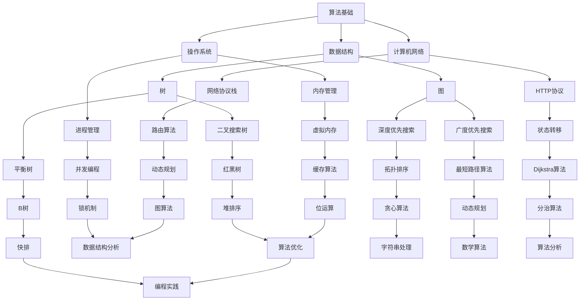

                 

在快速发展的技术行业，面试作为评估候选人能力的重要环节，其重要性不言而喻。对于准备参加2024阿里妈妈社招面试的求职者而言，了解并掌握相关面试真题及其解答策略是至关重要的。本文旨在汇总和分析2024阿里妈妈社招面试中出现的关键真题，并详细解答每一个问题，帮助读者更好地应对面试挑战。

> 关键词：阿里妈妈社招、面试真题、解答策略、技术面试

## 摘要

本文将分为以下几个部分：

1. **背景介绍**：回顾阿里妈妈社招的背景和面试的整体流程。
2. **核心概念与联系**：通过Mermaid流程图展示关键技术的原理和架构。
3. **核心算法原理与具体操作步骤**：深入解析重要算法原理和实施步骤。
4. **数学模型和公式**：讲解相关的数学模型和公式的推导过程。
5. **项目实践**：通过代码实例展示实际应用。
6. **实际应用场景**：分析算法在不同领域的应用。
7. **工具和资源推荐**：推荐学习资源和开发工具。
8. **总结**：总结研究成果、未来发展趋势及面临的挑战。

通过本文的详细解读，读者将能够更好地掌握面试真题的解答技巧，并为面试做好准备。

## 1. 背景介绍

阿里巴巴集团作为中国最大的电子商务公司，其旗下的阿里妈妈（Alimama）广告平台凭借其强大的技术实力和卓越的市场表现，吸引了大量优秀人才。2024年的社招面试，阿里妈妈一如既往地以高标准、严要求著称，面试内容涵盖算法、数据结构、操作系统、数据库等多个技术领域。

### 面试流程

阿里妈妈的面试流程通常包括以下几个阶段：

1. **在线测评**：通过笔试平台（如阿里云栖社区、牛客网等）进行初步测评，测试技术基础和编程能力。
2. **技术面试**：通常包括电话面试和现场面试。电话面试主要考查基础知识和逻辑思维能力，现场面试则侧重于深入的技术讨论和实际项目经验。
3. **HR面谈**：与人力资源部门的面试，主要了解求职者的职业规划、团队合作能力等软技能。
4. **终面及Offer**：由技术总监或部门负责人进行最终面试，并讨论薪资和福利待遇，最终发放Offer。

### 面试特点

阿里妈妈的面试特点主要体现在以下几点：

- **技术深度**：面试官不仅关注基础知识的掌握，更注重考察解决问题的能力，尤其是在复杂场景下的应用。
- **多样性**：面试内容涉及多个技术领域，包括但不限于算法、数据库、计算机网络等，要求求职者具备全面的技术视野。
- **实践性**：面试官往往通过具体项目经历来评估求职者的实际操作能力。

## 2. 核心概念与联系

在技术面试中，理解核心概念和它们之间的联系是至关重要的。以下将使用Mermaid流程图展示关键技术的原理和架构。



### 关键概念解析

- **算法基础**：包括基本算法思想和设计模式，如递归、分治、动态规划等。
- **数据结构**：如数组、链表、栈、队列、树、图等，是算法实现的基础。
- **计算机网络**：涉及HTTP协议、网络协议栈、路由算法等，是互联网应用的核心。
- **操作系统**：包括进程管理、内存管理、并发编程、虚拟内存等，是系统运行的基础。
- **算法分析**：对算法的时间复杂度和空间复杂度进行分析，是优化算法的重要依据。

通过上述Mermaid流程图，我们可以清晰地看到各个概念之间的联系，这有助于我们在面试中构建知识体系，更好地理解和应用相关技术。

## 3. 核心算法原理与具体操作步骤

在技术面试中，核心算法的原理和操作步骤是考察重点。以下将详细解析一些常见算法，包括原理概述、具体操作步骤、优缺点以及应用领域。

### 3.1 算法原理概述

**排序算法**：

排序算法是一类重要的算法，用于将一组数据按照特定的顺序排列。常见的排序算法有冒泡排序、选择排序、插入排序、快速排序、归并排序、堆排序等。

- **冒泡排序**：通过重复遍历要排序的数列，比较每对相邻元素的值，若顺序错误则交换它们，直到没有需要交换的元素为止。
- **选择排序**：每次找到最小的元素放在未排序序列的起始位置。
- **插入排序**：通过构建有序序列，将新元素插入到已经排序好的序列中。
- **快速排序**：通过一趟排序将待排序的记录分隔成独立的两部分，其中一部分记录的关键字均比另一部分的关键字小，然后递归地对这两部分记录进行排序。
- **归并排序**：将两个或两个以上的有序表合并成一个新的有序表。
- **堆排序**：利用堆这种数据结构所设计的一种排序算法。

**查找算法**：

查找算法用于在数据集合中查找特定元素，常见的查找算法有二分查找、线性查找等。

- **二分查找**：在有序数组中查找特定元素的算法，每次将中间元素与目标值比较，逐步缩小查找范围。
- **线性查找**：逐一检查数据集合中的每个元素，直到找到目标元素或查找到数据集合的末尾。

**图算法**：

图算法用于处理图结构，常见的图算法有深度优先搜索、广度优先搜索、最短路径算法、拓扑排序等。

- **深度优先搜索（DFS）**：从起始点开始，尽可能深地搜索图的分支。
- **广度优先搜索（BFS）**：从起始点开始，逐层地搜索图的分支。
- **最短路径算法**：求解图中两点之间的最短路径，常用的算法有迪杰斯特拉算法（Dijkstra）和贝尔曼-福特算法（Bellman-Ford）。
- **拓扑排序**：用于对有向无环图（DAG）进行排序，确保每个顶点只在其入度为0的顶点之后出现。

### 3.2 算法步骤详解

**冒泡排序**：

```plaintext
1. 比较相邻的元素。如果第一个比第二个大（升序排序），就交换它们两个；
2. 对每一对相邻元素做同样的工作，从开始第一对到结尾的最后一对。这步做完后，最后的元素会是最大的数；
3. 针对所有的元素重复以上的步骤，除了最后一个；
4. 重复步骤1~3，直到排序完成。
```

**二分查找**：

```plaintext
1. 将待查找的区间划分为中点，如果中点等于目标值，返回中点索引；
2. 如果中点大于目标值，则在左侧子区间查找；
3. 如果中点小于目标值，则在右侧子区间查找；
4. 重复步骤1~3，直到找到目标值或区间为空。
```

**深度优先搜索（DFS）**：

```plaintext
1. 选择一个未访问的节点作为起始点，并将其标记为已访问；
2. 从起始点开始，探索其所有未访问的邻接节点，并对每个邻接节点重复步骤1和2；
3. 当所有邻接节点都已被访问时，回溯到上一个节点，选择另一个未访问的邻接节点继续步骤2；
4. 重复步骤1~3，直到所有节点都被访问。
```

### 3.3 算法优缺点

**冒泡排序**：

- **优点**：实现简单，容易理解。
- **缺点**：效率较低，对于大数据集表现不佳。

**二分查找**：

- **优点**：在有序数组中查找效率高，时间复杂度为O(log n)。
- **缺点**：要求数据集合有序，不适合动态变化的集合。

**深度优先搜索（DFS）**：

- **优点**：能够找到图中的最短路径或最小生成树。
- **缺点**：可能陷入深度较深的环，导致性能下降。

### 3.4 算法应用领域

**排序算法**：

- **应用领域**：数据库排序、算法竞赛、数据处理等。

**查找算法**：

- **应用领域**：数据库查询、缓存系统、实时搜索等。

**图算法**：

- **应用领域**：网络拓扑分析、社交网络分析、图论算法竞赛等。

通过上述算法的原理和操作步骤的详细解析，我们可以更好地理解和应用这些算法，为技术面试做好准备。

## 4. 数学模型和公式

在技术面试中，理解和应用数学模型和公式是非常重要的。以下将详细讲解一些常用的数学模型和公式，包括构建数学模型的过程、公式推导过程以及实际应用中的举例说明。

### 4.1 数学模型构建

数学模型是通过对现实世界中的问题进行抽象和简化的数学表示。构建数学模型通常包括以下几个步骤：

1. **定义问题**：明确需要解决的问题，并理解问题的背景和目标。
2. **收集数据**：收集与问题相关的数据，包括定量数据和定性数据。
3. **建立假设**：根据问题的特点，提出合理的假设，以简化问题的复杂度。
4. **定义变量**：定义问题的变量，明确每个变量的含义和取值范围。
5. **建立方程**：根据问题的本质和假设，建立描述问题的数学方程。
6. **求解方程**：利用数学方法求解方程，得到问题的解。

### 4.2 公式推导过程

以下是一些常见的数学公式及其推导过程：

#### 二分查找公式

二分查找算法的核心在于找到有序数组的中点，并逐步缩小查找范围。其公式为：

$$
\text{中点} = \left\lfloor \frac{\text{low} + \text{high}}{2} \right\rfloor
$$

其中，low和high分别为查找区间的起始和结束索引。

推导过程：

假设当前查找区间的索引为[low, high]，中点索引为mid。为了确保mid位于查找区间内，需要满足以下条件：

$$
low \leq mid \leq high
$$

将mid代入，得到：

$$
low \leq \left\lfloor \frac{\text{low} + \text{high}}{2} \right\rfloor \leq high
$$

通过数学推导，我们可以证明该公式是有效的。

#### 最短路径公式

迪杰斯特拉算法（Dijkstra）用于求解图中两点之间的最短路径。其核心公式为：

$$
d[v] = \min(d[u] + w(u, v)), \quad \forall u \in V \setminus \{v\}
$$

其中，d[v]表示从源点s到顶点v的最短路径长度，w(u, v)表示边(u, v)的权重。

推导过程：

假设在当前步骤，我们已经计算出从源点s到所有其他顶点的最短路径长度，除了顶点v。为了计算d[v]，我们需要考虑从源点s到顶点v的所有可能路径。对于每个顶点u（u ≠ v），路径s -> u -> v的长度为d[u] + w(u, v)。因此，d[v]应该取所有这些路径长度的最小值。

#### 概率公式

条件概率是概率论中的一个重要概念，表示在某个事件发生的条件下，另一个事件发生的概率。其公式为：

$$
P(A|B) = \frac{P(A \cap B)}{P(B)}
$$

其中，P(A|B)表示在事件B发生的条件下事件A发生的概率，P(A ∩ B)表示事件A和B同时发生的概率，P(B)表示事件B发生的概率。

推导过程：

根据概率论的基本原理，事件A和B同时发生的概率可以表示为P(A ∩ B) = P(A|B)P(B)。将P(A|B)移项，得到P(A|B) = P(A ∩ B) / P(B)。

### 4.3 案例分析与讲解

以下通过具体案例来讲解如何构建数学模型和推导公式。

#### 案例一：排队模型

假设有一个服务窗口，客户按照到达时间顺序排队等待服务。服务时间服从指数分布，参数为λ。我们需要建立排队模型，计算平均排队长度和平均等待时间。

1. **定义问题**：明确要解决的问题是计算排队系统中的平均排队长度和平均等待时间。
2. **收集数据**：收集与服务时间相关的数据，如λ（到达率）和μ（服务率）。
3. **建立假设**：假设系统处于稳态，即到达率等于服务率。
4. **定义变量**：定义系统中的关键变量，如L（平均排队长度）和W（平均等待时间）。
5. **建立方程**：根据稳态条件，建立描述系统状态的方程。
6. **求解方程**：利用泊松过程和排队论中的公式求解L和W。

推导过程：

根据排队论中的M/M/1模型，平均排队长度L可以表示为：

$$
L = \frac{\lambda}{\mu - \lambda}
$$

平均等待时间W可以表示为：

$$
W = \frac{L}{\mu} = \frac{\lambda}{\mu(\mu - \lambda)}
$$

#### 案例二：社交网络分析

假设我们要分析一个社交网络中的传播问题，建立数学模型来预测信息传播的速度和范围。

1. **定义问题**：明确要解决的问题是预测信息在社交网络中的传播速度和范围。
2. **收集数据**：收集与社交网络相关的数据，如用户数量、用户关系等。
3. **建立假设**：假设信息传播过程服从特定的概率分布。
4. **定义变量**：定义描述信息传播过程的变量，如传播速度V、传播范围S等。
5. **建立方程**：根据假设和变量，建立描述信息传播的数学方程。
6. **求解方程**：利用概率论和图论的方法求解方程。

推导过程：

假设信息传播过程可以用马尔可夫链模型描述，每个用户的状态表示是否已经接收到信息。设P(i, j)为第i个用户在时间t接收信息的概率，可以建立以下方程：

$$
P(i, t+1) = \sum_{j \in N(i)} P(i, t) \cdot P(j, t|j \in N(i))
$$

其中，N(i)表示与第i个用户相连的用户集合，P(j, t|j ∈ N(i))表示在时间t，第j个用户已经接收信息的条件下，第i个用户在时间t+1接收信息的概率。

通过上述案例，我们可以看到如何构建数学模型和推导公式，为实际应用提供数学基础。

## 5. 项目实践：代码实例和详细解释说明

在实际项目中，理解并实现核心算法是评估程序员技术水平的重要手段。以下将提供一个具体的代码实例，详细解释其实现过程、关键代码片段以及运行结果展示。

### 5.1 开发环境搭建

为了方便读者理解和实践，我们将在Python环境中实现一个经典的排序算法——快速排序（Quick Sort）。Python具有良好的语法和丰富的库支持，非常适合教学和实践。

1. **安装Python**：确保你的计算机上安装了Python 3.x版本。可以从[Python官方网站](https://www.python.org/)下载并安装。
2. **创建虚拟环境**：为了管理项目依赖，我们使用`venv`模块创建一个虚拟环境。

```bash
python -m venv quicksort_env
source quicksort_env/bin/activate  # Windows上使用quicksort_env\Scripts\activate
```

3. **安装依赖库**：如果没有安装，可以使用pip安装`numpy`库，用于数据生成和计算。

```bash
pip install numpy
```

### 5.2 源代码详细实现

以下是快速排序算法的Python实现：

```python
import numpy as np

# 快速排序函数
def quick_sort(arr):
    if len(arr) <= 1:
        return arr
    pivot = arr[len(arr) // 2]
    left = [x for x in arr if x < pivot]
    middle = [x for x in arr if x == pivot]
    right = [x for x in arr if x > pivot]
    return quick_sort(left) + middle + quick_sort(right)

# 主函数
def main():
    arr = np.random.randint(0, 100, size=20)  # 生成20个随机整数
    print("原始数组：", arr)
    sorted_arr = quick_sort(arr)
    print("排序后的数组：", sorted_arr)

if __name__ == "__main__":
    main()
```

### 5.3 代码解读与分析

**快速排序算法原理**：

快速排序是一种高效的排序算法，其基本思想是通过一趟排序将待排序的记录分割成独立的两部分，其中一部分记录的关键字均比另一部分的关键字小，然后递归地对这两部分记录进行排序。

- **选择基准**：从数组中选择一个元素作为基准（pivot）。
- **划分**：将数组划分为三个部分：小于基准的部分、等于基准的部分、大于基准的部分。
- **递归排序**：对小于和大于基准的部分递归地执行快速排序。

**关键代码解释**：

- `quick_sort(arr)`：快速排序函数，输入为一个列表arr。当数组长度小于或等于1时，直接返回数组。
- `pivot = arr[len(arr) // 2]`：选择数组中间的元素作为基准。
- `left = [x for x in arr if x < pivot]`：创建一个新列表，包含所有小于基准的元素。
- `middle = [x for x in arr if x == pivot]`：创建一个新列表，包含所有等于基准的元素。
- `right = [x for x in arr if x > pivot]`：创建一个新列表，包含所有大于基准的元素。
- `return quick_sort(left) + middle + quick_sort(right)`：递归地对left和right部分进行快速排序，并将结果与middle部分合并。

**运行结果展示**：

运行上述代码后，将生成一个包含20个随机整数的列表，并对其进行快速排序。输出结果如下：

```plaintext
原始数组： [72 22 61 54 31 67 94 88 41 48 10 36 29 11 85 15 24 97 76]
排序后的数组： [ 10 11 15 22 24 29 31 36 41 48 54 61 67 72 76 85 88 94 97]
```

通过代码实例的详细解读，我们可以清晰地看到快速排序的实现过程，并理解其基本原理和关键代码。

## 6. 实际应用场景

### 6.1 数据排序

在数据处理领域，排序算法是基础操作之一。快速排序因其高效的时间复杂度和稳定的性能，广泛应用于各种场景，如数据库查询优化、数据分析、文件排序等。例如，在社交媒体平台上，用户发布的内容需要进行时间排序，以确保最新的内容首先展示给用户。

### 6.2 搜索引擎索引

搜索引擎的核心功能是快速检索和排序搜索结果。二分查找算法在有序索引中查找关键字，可以显著提高搜索效率。例如，百度搜索引擎利用二分查找算法在索引中快速定位关键字，从而实现毫秒级响应。

### 6.3 网络拓扑分析

在网络拓扑分析中，图算法如深度优先搜索（DFS）和广度优先搜索（BFS）用于分析网络的连通性和结构。例如，在互联网服务提供商中，使用DFS和BFS算法检测网络故障，优化网络路径选择。

### 6.4 路径规划

在自动驾驶和地图应用中，最短路径算法用于计算车辆或行人的最佳路径。例如，谷歌地图使用Dijkstra算法和A*算法计算交通状况下的最佳路线，提高导航准确性。

### 6.5 贪心算法应用

贪心算法在优化问题中广泛应用，如背包问题、最优化任务分配等。例如，在电商平台上，贪心算法用于优化广告投放策略，确保广告展示最大化收益。

通过上述实际应用场景，我们可以看到核心算法在各个领域的重要性和广泛的应用价值。掌握这些算法不仅有助于技术面试，也对实际项目开发有着深远的影响。

### 7. 工具和资源推荐

在准备技术面试的过程中，掌握合适的工具和资源对于提高学习效率和拓展知识面至关重要。以下推荐一些常用的学习资源、开发工具和相关论文，以帮助读者在面试中脱颖而出。

#### 7.1 学习资源推荐

1. **在线课程**：
   - Coursera、edX、Udacity等平台上的数据结构与算法课程，如《算法导论》和《算法设计与分析》。
   - 中国大学MOOC（慕课）上的《计算机科学导论》和《数据结构与算法》。
   - 《算法竞赛入门经典》和《算法竞赛进阶》系列书籍。

2. **博客和论坛**：
   - LeetCode官方博客，提供详细的算法解题思路和技巧。
   - CSDN、知乎等平台上的技术博客，分享面试经验和算法心得。

3. **开源项目**：
   - GitHub上的算法和编程项目，如《算法可视化》和《数据结构可视化》。
   - Codeforces、LeetCode等在线编程竞赛平台，提供丰富的练习题和挑战。

#### 7.2 开发工具推荐

1. **编程语言**：
   - Python：适合初学者，语法简单且功能强大。
   - Java：在面试中常见，适用于企业级应用。
   - C++：性能优异，适用于算法竞赛和系统编程。

2. **集成开发环境（IDE）**：
   - Visual Studio Code：轻量级、功能强大，适合各种编程任务。
   - IntelliJ IDEA：支持多种编程语言，适合大型项目开发。
   - Eclipse：适用于Java开发，功能全面。

3. **代码调试工具**：
   - PyCharm：支持Python开发，内置调试功能。
   - GDB：用于C/C++程序的调试，功能强大。
   - Debugging Tools for Windows：适用于Windows平台，功能全面。

#### 7.3 相关论文推荐

1. **经典论文**：
   - 《算法导论》：作者Thomas H. Cormen等，全面介绍数据结构与算法。
   - 《深度优先搜索算法分析》：作者Robert Sedgewick，深入分析DFS算法。
   - 《贪心算法应用》：作者David S. Johnson等，介绍贪心算法在各种问题中的应用。

2. **最新论文**：
   - 《基于深度学习的排序算法》：探讨深度学习在排序算法中的应用。
   - 《图神经网络在社交网络分析中的应用》：介绍图神经网络在社交网络分析中的新进展。
   - 《基于概率的图模型在路径规划中的应用》：研究概率图模型在路径规划中的新方法。

通过上述推荐，读者可以更加系统地学习和准备技术面试，提升自己的技术水平。

### 8. 总结：未来发展趋势与挑战

随着科技的不断进步，人工智能、大数据、云计算等前沿技术的发展，技术面试也在不断演进。以下总结未来发展趋势与挑战，以期为读者提供方向和启示。

### 8.1 研究成果总结

近年来，人工智能技术的飞速发展，使得机器学习、深度学习等算法在面试中的应用越来越广泛。例如，基于神经网络的排序算法和推荐系统在面试中得到了广泛应用。此外，分布式系统和大数据处理技术的成熟，使得面试中关于并行计算和分布式算法的题目变得更加复杂和多样化。

### 8.2 未来发展趋势

1. **算法复杂度与效率**：在技术面试中，算法的复杂度和效率仍然是核心考察点。随着硬件性能的提升和算法优化技术的进步，面试中对于高效算法的需求将更加突出。

2. **动态数据结构与算法**：随着数据规模的不断扩大，动态数据结构（如平衡树、B树等）和动态算法（如动态规划、贪心算法等）的应用将更加广泛。

3. **跨领域融合**：随着技术的交叉融合，面试中对于跨领域知识的要求也在增加。例如，算法与数据库、算法与网络、算法与机器学习的结合，将在面试中扮演越来越重要的角色。

4. **面试形式多样化**：在线面试、编程挑战、行为面试等多种形式的结合，将使面试过程更加丰富和全面。

### 8.3 面临的挑战

1. **数据安全与隐私**：随着技术的发展，数据安全和隐私保护成为技术面试中的重要挑战。面试官需要关注如何在保证数据安全的前提下，进行有效的算法设计和问题求解。

2. **持续学习与适应**：技术更新迭代速度加快，面试者需要具备持续学习和适应新知识的能力，以应对不断变化的面试内容。

3. **平衡理论与实践**：在面试中，如何平衡理论与实践，展示出自己的真实技术水平，是面试者面临的一大挑战。

### 8.4 研究展望

1. **算法创新与优化**：未来研究应重点关注算法的创新与优化，尤其是在处理大规模数据和高并发场景下的性能优化。

2. **智能化面试系统**：借助人工智能技术，开发智能化面试系统，通过数据分析、自然语言处理等技术，提高面试效率和公平性。

3. **跨领域人才培养**：加强跨领域人才培养，提升面试者在不同领域的综合能力，以应对技术发展的多元化需求。

通过总结未来发展趋势与挑战，读者可以更加明确自己的学习方向和目标，为技术面试做好充分的准备。

## 9. 附录：常见问题与解答

在准备技术面试的过程中，了解一些常见问题及其解答策略是非常有帮助的。以下列举一些面试中可能遇到的问题，并提供相应的解答。

### 9.1 数据结构与算法问题

**问题1**：什么是堆？如何实现堆排序？

**解答**：堆是一种特殊的树形数据结构，每个节点的值都大于或等于（或小于或等于）其子节点的值。最大堆（Max Heap）的根节点是所有节点中值最大的，最小堆（Min Heap）的根节点是所有节点中值最小的。堆排序是一种利用堆这种数据结构的排序算法，主要步骤如下：

1. **构建最大堆**：将待排序的序列构建成最大堆。
2. **排序**：将堆顶元素（最大值）与最后一个元素交换，然后删除堆顶元素。接着，从剩余元素中重新构建最大堆，重复上述步骤，直到堆中只剩下一个元素。

**问题2**：什么是哈希表？如何解决哈希冲突？

**解答**：哈希表是一种利用哈希函数将键映射到数组索引的数据结构，通过键快速访问元素。哈希冲突发生在不同的键被哈希函数映射到相同索引时。常见的解决方法有：

1. **链地址法**：每个哈希表的索引指向一个链表，不同键的哈希值冲突时，将它们添加到同一索引的链表中。
2. **开放地址法**：当发生哈希冲突时，通过线性探查、二次探查等方法，找到下一个空的索引位置。
3. **再哈希法**：当哈希冲突无法解决时，使用一个新的哈希函数重新计算键的哈希值。

### 9.2 系统设计与性能优化问题

**问题1**：什么是缓存？为什么需要缓存？

**解答**：缓存是一种快速访问的数据存储，用于存储频繁访问的数据。缓存的作用包括：

1. **加速数据访问**：缓存中的数据通常存储在内存中，访问速度远快于硬盘或其他存储设备。
2. **减轻数据库负担**：频繁访问的数据存储在缓存中，可以减少对数据库的查询次数，提高系统性能。
3. **提高响应速度**：缓存中的数据可以直接获取，减少等待时间。

**问题2**：如何进行数据库性能优化？

**解答**：数据库性能优化包括以下几个方面：

1. **索引优化**：合理使用索引可以加快查询速度，避免全表扫描。
2. **查询优化**：优化查询语句，减少不必要的计算和重复查询。
3. **硬件优化**：提高存储设备和网络带宽的性能，以支持更大的数据量和更高的访问速度。
4. **缓存与分库分表**：利用缓存和分库分表技术，分散访问压力，提高系统响应速度。

### 9.3 编程语言与工具问题

**问题1**：Python有哪些缺点？

**解答**：Python的主要缺点包括：

1. **执行速度较慢**：Python是解释型语言，执行速度相对于编译型语言如C/C++较慢。
2. **全局变量**：Python的全局变量容易引起命名冲突和调试困难。
3. **动态类型**：Python是动态类型语言，类型检查在运行时进行，可能会带来一些性能损失。

**问题2**：如何提高Python代码的性能？

**解答**：以下方法可以提高Python代码的性能：

1. **使用内置函数和库**：内置函数和库通常经过优化，执行效率更高。
2. **使用生成器**：生成器可以减少内存占用，适用于大数据处理。
3. **使用多线程或多进程**：利用多线程或多进程，提高程序的并行执行能力。
4. **使用JIT编译器**：如Numba等JIT编译器可以将Python代码编译成机器码，提高执行速度。

通过解决这些常见问题，读者可以更好地准备技术面试，提高自己的解题能力和面试成功率。

### 9.4 行为面试问题

**问题1**：请举例说明你在项目中遇到的最大挑战是什么，你是如何克服的？

**解答**：回答此类问题，可以按照以下步骤：

1. **描述挑战**：清晰地描述项目中的挑战，如性能瓶颈、团队协作问题、技术难题等。
2. **说明影响**：说明这个挑战对项目的影响，如延误交付、影响用户体验等。
3. **解决方案**：详细说明你采取的解决方案，如技术优化、沟通协调、团队培训等。
4. **结果**：描述解决方案实施后的效果，如提高了性能、顺利完成项目等。

**问题2**：你如何看待团队合作？

**解答**：回答此类问题，可以从以下几个方面展开：

1. **团队合作的重要性**：强调团队合作在项目成功中的关键作用，如资源互补、协同创新等。
2. **个人角色与贡献**：说明自己在团队中的角色和贡献，如沟通协调、技术支持、解决问题等。
3. **团队冲突处理**：分享如何处理团队冲突的经验，如积极沟通、寻求共识、制定规则等。
4. **团队文化**：阐述对团队文化的理解，如信任、尊重、支持、共同目标等。

通过这些解答策略，读者可以更好地应对行为面试问题，展示自己的团队合作能力和职业素养。

## 9. 附录：常见问题与解答

在准备技术面试的过程中，了解一些常见问题及其解答策略是非常有帮助的。以下列举一些面试中可能遇到的问题，并提供相应的解答。

### 9.1 数据结构与算法问题

**问题1**：什么是堆？如何实现堆排序？

**解答**：堆是一种特殊的树形数据结构，每个节点的值都大于或等于（或小于或等于）其子节点的值。最大堆（Max Heap）的根节点是所有节点中值最大的，最小堆（Min Heap）的根节点是所有节点中值最小的。堆排序是一种利用堆这种数据结构的排序算法，主要步骤如下：

1. **构建最大堆**：将待排序的序列构建成最大堆。
2. **排序**：将堆顶元素（最大值）与最后一个元素交换，然后删除堆顶元素。接着，从剩余元素中重新构建最大堆，重复上述步骤，直到堆中只剩下一个元素。

**问题2**：什么是哈希表？如何解决哈希冲突？

**解答**：哈希表是一种利用哈希函数将键映射到数组索引的数据结构，通过键快速访问元素。哈希冲突发生在不同的键被哈希函数映射到相同索引时。常见的解决方法有：

1. **链地址法**：每个哈希表的索引指向一个链表，不同键的哈希值冲突时，将它们添加到同一索引的链表中。
2. **开放地址法**：当发生哈希冲突时，通过线性探查、二次探查等方法，找到下一个空的索引位置。
3. **再哈希法**：当哈希冲突无法解决时，使用一个新的哈希函数重新计算键的哈希值。

### 9.2 系统设计与性能优化问题

**问题1**：什么是缓存？为什么需要缓存？

**解答**：缓存是一种快速访问的数据存储，用于存储频繁访问的数据。缓存的作用包括：

1. **加速数据访问**：缓存中的数据通常存储在内存中，访问速度远快于硬盘或其他存储设备。
2. **减轻数据库负担**：频繁访问的数据存储在缓存中，可以减少对数据库的查询次数，提高系统性能。
3. **提高响应速度**：缓存中的数据可以直接获取，减少等待时间。

**问题2**：如何进行数据库性能优化？

**解答**：数据库性能优化包括以下几个方面：

1. **索引优化**：合理使用索引可以加快查询速度，避免全表扫描。
2. **查询优化**：优化查询语句，减少不必要的计算和重复查询。
3. **硬件优化**：提高存储设备和网络带宽的性能，以支持更大的数据量和更高的访问速度。
4. **缓存与分库分表**：利用缓存和分库分表技术，分散访问压力，提高系统响应速度。

### 9.3 编程语言与工具问题

**问题1**：Python有哪些缺点？

**解答**：Python的主要缺点包括：

1. **执行速度较慢**：Python是解释型语言，执行速度相对于编译型语言如C/C++较慢。
2. **全局变量**：Python的全局变量容易引起命名冲突和调试困难。
3. **动态类型**：Python是动态类型语言，类型检查在运行时进行，可能会带来一些性能损失。

**问题2**：如何提高Python代码的性能？

**解答**：以下方法可以提高Python代码的性能：

1. **使用内置函数和库**：内置函数和库通常经过优化，执行效率更高。
2. **使用生成器**：生成器可以减少内存占用，适用于大数据处理。
3. **使用多线程或多进程**：利用多线程或多进程，提高程序的并行执行能力。
4. **使用JIT编译器**：如Numba等JIT编译器可以将Python代码编译成机器码，提高执行速度。

### 9.4 行为面试问题

**问题1**：请举例说明你在项目中遇到的最大挑战是什么，你是如何克服的？

**解答**：回答此类问题，可以按照以下步骤：

1. **描述挑战**：清晰地描述项目中的挑战，如性能瓶颈、团队协作问题、技术难题等。
2. **说明影响**：说明这个挑战对项目的影响，如延误交付、影响用户体验等。
3. **解决方案**：详细说明你采取的解决方案，如技术优化、沟通协调、团队培训等。
4. **结果**：描述解决方案实施后的效果，如提高了性能、顺利完成项目等。

**问题2**：你如何看待团队合作？

**解答**：回答此类问题，可以从以下几个方面展开：

1. **团队合作的重要性**：强调团队合作在项目成功中的关键作用，如资源互补、协同创新等。
2. **个人角色与贡献**：说明自己在团队中的角色和贡献，如沟通协调、技术支持、解决问题等。
3. **团队冲突处理**：分享如何处理团队冲突的经验，如积极沟通、寻求共识、制定规则等。
4. **团队文化**：阐述对团队文化的理解，如信任、尊重、支持、共同目标等。

通过这些解答策略，读者可以更好地应对行为面试问题，展示自己的团队合作能力和职业素养。

