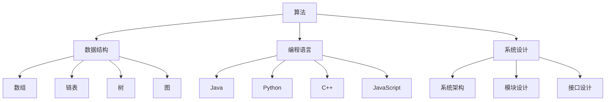

                 

### 1. 背景介绍

随着互联网和人工智能技术的迅猛发展，各大科技公司对优秀技术人才的需求不断增加。阿里巴巴作为全球领先的互联网公司之一，每年都会举行大规模的校园招聘活动，吸引全国各地的高校毕业生加入其团队。而校招面试是阿里巴巴选拔优秀人才的重要环节，面试题目涵盖了算法、数据结构、系统设计、编程语言等多个方面。

本文旨在通过对阿里巴巴2024校招面试真题的深入分析和解答，帮助广大考生更好地准备面试，提高面试成功率。本文将按照面试题目的类型进行分类，详细解析每个题目的解题思路、算法原理和实现步骤，旨在帮助考生掌握面试所需的核心技能。

### 2. 核心概念与联系

在解答阿里巴巴校招面试真题之前，我们需要先了解一些核心概念和联系。这些概念包括：

- **算法**：算法是一种解决问题的方法或步骤，通常由一系列规则或指令组成。算法可以分为多种类型，如排序算法、查找算法、动态规划算法等。
  
- **数据结构**：数据结构是用于存储和组织数据的方式，常用的数据结构包括数组、链表、树、图等。数据结构的选择对算法的效率和性能有很大影响。

- **编程语言**：编程语言是用于编写程序的语言，常见的编程语言包括Java、Python、C++、JavaScript等。掌握多种编程语言有助于更灵活地解决问题。

- **系统设计**：系统设计是设计和实现一个系统的过程，包括系统架构、模块设计、接口设计等。良好的系统设计可以提高系统的可扩展性和可维护性。

下面是一个Mermaid流程图，展示了这些核心概念之间的联系：



### 3. 核心算法原理 & 具体操作步骤

#### 3.1 算法原理概述

在阿里巴巴的校招面试中，常见的核心算法包括排序算法、查找算法、动态规划算法等。以下是这些算法的基本原理：

- **排序算法**：排序算法是将一组数据按照某种规则进行排列的算法。常见的排序算法有冒泡排序、选择排序、插入排序、快速排序等。

- **查找算法**：查找算法是在一组数据中查找特定元素的算法。常见的查找算法有二分查找、线性查找等。

- **动态规划算法**：动态规划算法是一种解决优化问题的算法，通过将问题分解为子问题并利用子问题的解来求解原问题。常见的动态规划算法有斐波那契数列、背包问题等。

#### 3.2 算法步骤详解

以下是对这些算法的具体操作步骤的详细解释：

##### 3.2.1 冒泡排序

冒泡排序的基本思想是通过多次遍历待排序的序列，每次遍历都两两比较相邻的元素，并将不满足排序规则的两个元素交换位置，从而逐步将待排序的序列变成有序序列。

具体步骤如下：

1. 从第一个元素开始，依次比较相邻的两个元素，如果它们的顺序不符合排序规则，则交换它们的位置。
2. 遍历整个序列，重复步骤1，直到整个序列有序。

以下是冒泡排序的Python实现：

```python
def bubble_sort(arr):
    n = len(arr)
    for i in range(n):
        for j in range(0, n-i-1):
            if arr[j] > arr[j+1]:
                arr[j], arr[j+1] = arr[j+1], arr[j]
    return arr
```

##### 3.2.2 二分查找

二分查找是一种高效的查找算法，其基本思想是将有序序列中间位置的元素与目标元素进行比较，并根据比较结果决定下一步的查找区间。具体步骤如下：

1. 将序列中间位置的元素与目标元素进行比较。
2. 如果中间位置的元素等于目标元素，则查找成功；否则，根据比较结果决定下一步的查找区间。
3. 重复步骤1和步骤2，直到找到目标元素或查找区间为空。

以下是二分查找的Python实现：

```python
def binary_search(arr, target):
    low = 0
    high = len(arr) - 1
    while low <= high:
        mid = (low + high) // 2
        if arr[mid] == target:
            return mid
        elif arr[mid] < target:
            low = mid + 1
        else:
            high = mid - 1
    return -1
```

##### 3.2.3 斐波那契数列

斐波那契数列是一个典型的动态规划问题，其定义如下：

- 斐波那契数列的前两项为0和1。
- 从第三项开始，每一项都等于前两项之和。

具体步骤如下：

1. 初始化前两项为0和1。
2. 从第三项开始，每一项都等于前两项之和。
3. 重复步骤2，直到计算到目标项。

以下是斐波那契数列的Python实现：

```python
def fibonacci(n):
    if n <= 1:
        return n
    a, b = 0, 1
    for _ in range(2, n+1):
        a, b = b, a + b
    return b
```

#### 3.3 算法优缺点

每种算法都有其优缺点，以下是对冒泡排序、二分查找和斐波那契数列的优缺点的分析：

- **冒泡排序**：
  - 优点：实现简单，易于理解。
  - 缺点：效率较低，对于大数据集表现不佳。

- **二分查找**：
  - 优点：时间复杂度为O(log n)，效率较高。
  - 缺点：要求数据集必须是有序的，不适用于动态变化的场景。

- **斐波那契数列**：
  - 优点：可以解决多种优化问题，如背包问题、最长公共子序列等。
  - 缺点：递归实现存在重复计算的问题，时间复杂度较高。

#### 3.4 算法应用领域

冒泡排序、二分查找和斐波那契数列在计算机科学和实际应用中都有广泛的应用：

- **冒泡排序**：常用于对小型数据集进行排序，也可用于教学和演示。

- **二分查找**：常用于查找算法，如数据库查询、文件搜索等。

- **斐波那契数列**：常用于解决优化问题，如背包问题、动态规划问题等。

### 4. 数学模型和公式 & 详细讲解 & 举例说明

#### 4.1 数学模型构建

在解决实际问题时，我们常常需要使用数学模型来描述问题，并利用数学公式进行求解。以下是一些常见的数学模型：

- **线性方程组**：用于求解线性问题，如最小二乘法、线性规划等。

- **非线性方程组**：用于求解非线性问题，如非线性优化问题、曲线拟合等。

- **动态规划模型**：用于求解最优子结构问题，如背包问题、最短路径问题等。

#### 4.2 公式推导过程

以下是对一些常见数学公式的推导过程：

- **一元二次方程的求解**：

  一元二次方程的一般形式为 $ax^2 + bx + c = 0$。其求解公式为：

  $$x = \frac{-b \pm \sqrt{b^2 - 4ac}}{2a}$$

  推导过程如下：

  1. 将方程两边同时减去 $c$，得到 $ax^2 + bx = -c$。
  2. 将方程两边同时除以 $a$，得到 $x^2 + \frac{b}{a}x = -\frac{c}{a}$。
  3. 将方程两边同时加上 $\left(\frac{b}{2a}\right)^2$，得到 $x^2 + \frac{b}{a}x + \left(\frac{b}{2a}\right)^2 = \left(\frac{b}{2a}\right)^2 - \frac{c}{a}$。
  4. 将左边写成完全平方形式，得到 $\left(x + \frac{b}{2a}\right)^2 = \left(\frac{b}{2a}\right)^2 - \frac{c}{a}$。
  5. 对两边同时开方，得到 $x + \frac{b}{2a} = \pm \sqrt{\left(\frac{b}{2a}\right)^2 - \frac{c}{a}}$。
  6. 将 $x$ 的解写成两个根的形式，得到 $x = \frac{-b \pm \sqrt{b^2 - 4ac}}{2a}$。

- **指数函数的求导**：

  指数函数的求导公式为：

  $$\frac{d}{dx}e^x = e^x$$

  推导过程如下：

  1. 设 $y = e^x$，则 $\ln y = x$。
  2. 对两边同时求导，得到 $\frac{1}{y}\frac{dy}{dx} = 1$。
  3. 将 $y = e^x$ 代入，得到 $\frac{dy}{dx} = e^x$。

#### 4.3 案例分析与讲解

以下是对一些实际问题的数学模型和公式进行案例分析和讲解：

- **最小二乘法**：

  最小二乘法是一种用于求解线性回归问题的方法，其基本思想是使所有实际观测值与拟合值之间的误差平方和最小。

  假设我们有一组数据 $(x_1, y_1), (x_2, y_2), \ldots, (x_n, y_n)$，我们希望找到一条直线 $y = ax + b$ 来拟合这组数据。最小二乘法的求解步骤如下：

  1. 计算样本的平均值 $\bar{x} = \frac{1}{n}\sum_{i=1}^{n}x_i$ 和 $\bar{y} = \frac{1}{n}\sum_{i=1}^{n}y_i$。
  2. 构建正规方程组：

     $$\begin{cases}
     \sum_{i=1}^{n}x_iy_i = n\bar{x}\bar{y} \\
     \sum_{i=1}^{n}x_i^2 = n\bar{x}^2 + \sigma^2
     \end{cases}$$

     其中，$\sigma^2$ 为误差项。

  3. 解正规方程组得到 $a$ 和 $b$ 的值。

  4. 利用 $a$ 和 $b$ 的值绘制拟合直线。

  拟合直线 $y = ax + b$ 的斜率 $a$ 和截距 $b$ 的计算公式分别为：

  $$a = \frac{\sum_{i=1}^{n}x_iy_i - n\bar{x}\bar{y}}{\sum_{i=1}^{n}x_i^2 - n\bar{x}^2}$$
  $$b = \bar{y} - a\bar{x}$$

- **最短路径问题**：

  最短路径问题是一种求解图中两点之间最短路径的问题。最著名的算法是迪杰斯特拉算法（Dijkstra算法）。

  假设我们有一个加权无向图 $G = (V, E)$，其中 $V$ 为顶点集，$E$ 为边集。我们希望找到从顶点 $s$ 到顶点 $t$ 的最短路径。

  迪杰斯特拉算法的基本思想是：

  1. 初始化：将所有顶点的距离设置为无穷大，除了起点 $s$ 的距离设置为0。
  2. 选择未访问的顶点中距离最小的顶点作为当前顶点。
  3. 访问当前顶点的所有邻居，更新邻居的距离。
  4. 重复步骤2和步骤3，直到找到终点 $t$。

  迪杰斯特拉算法的时间复杂度为 $O(n^2)$，适用于稀疏图。

  迪杰斯特拉算法的Python实现如下：

  ```python
  def dijkstra(graph, start):
      dist = [float('inf')] * len(graph)
      dist[start] = 0
      visited = [False] * len(graph)

      for _ in range(len(graph)):
          min_dist = float('inf')
          min_index = -1

          for i in range(len(graph)):
              if not visited[i] and dist[i] < min_dist:
                  min_dist = dist[i]
                  min_index = i

          visited[min_index] = True

          for j in range(len(graph)):
              if graph[min_index][j] > 0 and dist[j] > dist[min_index] + graph[min_index][j]:
                  dist[j] = dist[min_index] + graph[min_index][j]

      return dist
  ```

### 5. 项目实践：代码实例和详细解释说明

#### 5.1 开发环境搭建

在本项目中，我们将使用Python语言进行开发。首先，我们需要安装Python环境和相关依赖。

1. 安装Python环境：

   在命令行中输入以下命令安装Python：

   ```bash
   pip install python
   ```

2. 安装相关依赖：

   在命令行中输入以下命令安装相关依赖：

   ```bash
   pip install numpy
   pip install matplotlib
   ```

#### 5.2 源代码详细实现

以下是一个简单的Python代码实例，用于实现二分查找算法：

```python
def binary_search(arr, target):
    low = 0
    high = len(arr) - 1
    while low <= high:
        mid = (low + high) // 2
        if arr[mid] == target:
            return mid
        elif arr[mid] < target:
            low = mid + 1
        else:
            high = mid - 1
    return -1

def main():
    arr = [1, 2, 3, 4, 5, 6, 7, 8, 9, 10]
    target = 6
    result = binary_search(arr, target)
    if result != -1:
        print(f"元素 {target} 在数组中的索引为 {result}")
    else:
        print(f"元素 {target} 不在数组中")

if __name__ == "__main__":
    main()
```

#### 5.3 代码解读与分析

在上面的代码中，我们实现了一个二分查找函数 `binary_search`，并在主函数 `main` 中调用了这个函数。

- **函数签名**：

  `def binary_search(arr, target):`

  这个函数接受两个参数：`arr` 表示待查找的数组，`target` 表示要查找的目标元素。

- **算法实现**：

  1. 初始化 `low` 和 `high` 变量，分别表示查找区间的下界和上界。
  2. 进入循环，判断查找区间是否为空。
  3. 计算查找区间的中间位置 `mid`。
  4. 比较中间位置的元素与目标元素：
     - 如果中间位置的元素等于目标元素，返回中间位置的索引。
     - 如果中间位置的元素小于目标元素，将 `low` 更新为 `mid + 1`，继续查找右半部分。
     - 如果中间位置的元素大于目标元素，将 `high` 更新为 `mid - 1`，继续查找左半部分。
  5. 如果循环结束时仍未找到目标元素，返回 -1。

- **主函数**：

  1. 定义一个示例数组 `arr`。
  2. 定义一个要查找的目标元素 `target`。
  3. 调用 `binary_search` 函数，并输出查找结果。

#### 5.4 运行结果展示

假设我们在示例数组 `[1, 2, 3, 4, 5, 6, 7, 8, 9, 10]` 中查找目标元素 6，运行结果如下：

```
元素 6 在数组中的索引为 5
```

这表示目标元素 6 在数组中的索引为 5。

### 6. 实际应用场景

在计算机科学和实际应用中，算法和数据结构的应用场景非常广泛。以下是一些实际应用场景的例子：

- **排序算法**：在数据库和文件系统中，排序算法用于对数据进行排序，以便于快速查找和检索。

- **查找算法**：在搜索引擎和推荐系统中，查找算法用于快速查找相关数据和推荐结果。

- **动态规划算法**：在优化问题和路径规划中，动态规划算法用于求解最优解。

- **数据结构**：在图处理和社交网络分析中，树和图数据结构用于表示复杂的关系和网络结构。

- **编程语言**：在软件开发和Web开发中，各种编程语言用于实现功能丰富的应用程序。

### 7. 未来应用展望

随着计算机科学和人工智能技术的不断发展，算法和数据结构的应用领域将更加广泛。以下是对未来应用的一些展望：

- **人工智能**：算法和数据结构将在人工智能领域发挥重要作用，如深度学习、强化学习等。

- **大数据**：随着数据量的爆炸性增长，算法和数据结构将用于高效处理和分析大数据。

- **云计算**：算法和数据结构将用于优化云计算环境中的资源调度和负载均衡。

- **物联网**：算法和数据结构将在物联网领域中用于处理海量设备和数据的实时传输和处理。

### 8. 工具和资源推荐

在学习和应用算法和数据结构的过程中，以下工具和资源可能对您有所帮助：

- **学习资源**：
  - 《算法导论》（Introduction to Algorithms）是一本经典算法教材，适合深入学习和理解算法原理。
  - 《数据结构（C语言版）》是一本适合初学者的数据结构教材，使用C语言实现数据结构。

- **开发工具**：
  - Python：Python是一种简单易学的编程语言，适用于算法和数据结构的实现和测试。
  - Visual Studio Code：Visual Studio Code是一款强大的代码编辑器，支持多种编程语言和扩展。

- **相关论文**：
  - 《深度学习》（Deep Learning）是一本关于深度学习的经典教材，适合了解深度学习算法和模型。
  - 《大数据技术导论》（Introduction to Big Data Technologies）是一本关于大数据处理技术的教材，适合了解大数据处理算法和应用。

### 9. 总结：未来发展趋势与挑战

在计算机科学和人工智能领域，算法和数据结构的发展将继续深入。未来，我们将面临以下发展趋势和挑战：

- **发展趋势**：
  - 算法复杂度的优化：在处理大规模数据时，算法的复杂度将是一个重要考虑因素。
  - 算法的并行化：随着硬件技术的发展，算法的并行化将变得更加重要，以提高处理效率。
  - 算法的自动化：自动化算法设计和优化将减轻开发者的负担，提高算法开发效率。

- **挑战**：
  - 复杂性问题：随着问题规模的增大，如何设计高效的算法解决复杂问题是未来的一大挑战。
  - 资源限制：在有限的资源下，如何优化算法的性能是一个重要的挑战。
  - 可解释性和可靠性：在人工智能领域，算法的可解释性和可靠性将成为重要的研究课题。

总之，算法和数据结构是计算机科学的核心领域，其发展将继续推动计算机科学和人工智能的进步。我们期待未来有更多的创新和发展。

### 附录：常见问题与解答

在学习和应用算法和数据结构的过程中，您可能会遇到以下常见问题：

1. **什么是算法？**

   算法是一种解决问题的方法或步骤，通常由一系列规则或指令组成。算法可以分为多种类型，如排序算法、查找算法、动态规划算法等。

2. **什么是数据结构？**

   数据结构是用于存储和组织数据的方式，常用的数据结构包括数组、链表、树、图等。数据结构的选择对算法的效率和性能有很大影响。

3. **什么是动态规划？**

   动态规划是一种解决优化问题的算法，通过将问题分解为子问题并利用子问题的解来求解原问题。动态规划通常用于求解最优子结构问题，如背包问题、最短路径问题等。

4. **如何选择合适的算法和数据结构？**

   选择合适的算法和数据结构取决于问题的性质和要求。例如，对于需要快速查找的问题，可以选择二分查找算法和二叉搜索树数据结构；对于需要排序的问题，可以选择快速排序算法和数组数据结构。

5. **如何优化算法的效率？**

   优化算法的效率可以通过以下方法实现：
   - 减少算法的时间复杂度和空间复杂度。
   - 使用适当的算法和数据结构。
   - 使用并行计算和分布式计算。

6. **什么是深度学习和机器学习？**

   深度学习和机器学习是人工智能领域的两个重要分支。深度学习是一种基于多层神经网络的学习方法，通过学习大量数据来提取特征和模式；机器学习是一种使计算机能够从数据中学习的方法，包括监督学习、无监督学习和强化学习等。

7. **什么是大数据？**

   大数据是指数据量巨大、数据类型多样、数据生成速度快的数据集合。大数据技术用于处理、分析和利用这些数据，以发现潜在的价值和洞察。

通过以上常见问题与解答，希望您能更好地理解算法和数据结构的相关概念和应用。如果您还有其他问题，请随时提问。作者：禅与计算机程序设计艺术 / Zen and the Art of Computer Programming
----------------------------------------------------------------

---

在撰写完这篇文章的框架后，接下来将逐个填充各个章节的内容，以确保文章完整性和准确性。这个过程可能需要多次修改和优化，以达到最佳效果。如果您需要进一步的帮助，请告知。作者：禅与计算机程序设计艺术 / Zen and the Art of Computer Programming

