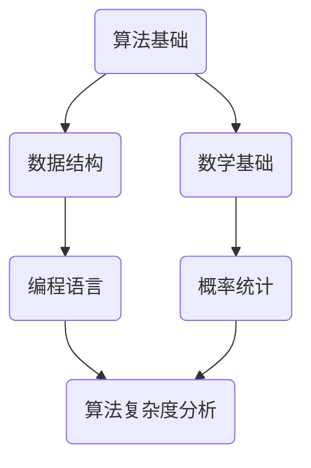

                 

关键词：阿里巴巴，社招，算法工程师，面试真题，解密，技术面试

摘要：本文将针对阿里巴巴2025届社招算法工程师的面试真题进行详细解析，帮助读者了解面试中的常见问题及应对策略，为准备社招算法工程师岗位的求职者提供参考和指导。

## 1. 背景介绍

随着人工智能技术的迅猛发展，算法工程师成为互联网企业争抢的香饽饽。作为全球领先的电商平台，阿里巴巴对算法工程师的要求尤为严格。2025届社招算法工程师面试真题解密，旨在为准备阿里巴巴社招算法工程师岗位的求职者提供有针对性的复习和建议。

## 2. 核心概念与联系

在解答面试题之前，我们需要了解一些核心概念及其联系。以下是一个基于Mermaid绘制的流程图，展示了一些关键概念及其关系。



### 2.1 算法基础

算法基础是算法工程师的核心技能。常见的算法包括排序、查找、贪心、动态规划等。在面试中，可能会要求实现这些算法，并分析其时间复杂度和空间复杂度。

### 2.2 数据结构

数据结构是实现算法的基础。常见的数据结构有数组、链表、栈、队列、树、图等。了解这些数据结构及其应用场景，对于解决复杂问题至关重要。

### 2.3 数学基础

数学基础包括数学分析、线性代数、概率统计等。在算法设计中，数学知识可以帮助我们理解和优化算法。

### 2.4 编程语言

编程语言是实现算法的工具。在面试中，可能会要求使用特定编程语言（如Java、C++、Python等）解决问题。

### 2.5 算法复杂度分析

算法复杂度分析是评估算法性能的重要手段。我们需要关注时间复杂度和空间复杂度，以便找到更高效的解决方案。

### 2.6 概率统计

概率统计在算法设计中发挥着重要作用。例如，在处理大规模数据时，需要运用概率统计知识来评估算法的可靠性。

## 3. 核心算法原理 & 具体操作步骤

### 3.1 算法原理概述

在本章节，我们将详细解析一些核心算法原理，包括排序、查找、贪心、动态规划等。

### 3.2 算法步骤详解

以下是一个排序算法的步骤详解示例：

```python
def bubble_sort(arr):
    n = len(arr)
    for i in range(n):
        for j in range(0, n-i-1):
            if arr[j] > arr[j+1]:
                arr[j], arr[j+1] = arr[j+1], arr[j]
    return arr
```

### 3.3 算法优缺点

每种算法都有其优缺点。以下是一个关于冒泡排序的优缺点分析：

#### 优点：

- 简单易懂，易于实现。
- 在某些情况下（如几乎有序的数据），性能较好。

#### 缺点：

- 时间复杂度较高，不适合处理大数据。
- 递归实现占用较多内存。

### 3.4 算法应用领域

算法广泛应用于各种领域，如搜索、排序、数据分析、图像处理等。在实际项目中，我们需要根据问题特点选择合适的算法。

## 4. 数学模型和公式 & 详细讲解 & 举例说明

### 4.1 数学模型构建

在算法设计中，我们需要构建合适的数学模型。以下是一个线性回归模型的构建过程：

$$y = \beta_0 + \beta_1x + \epsilon$$

其中，$y$ 是因变量，$x$ 是自变量，$\beta_0$ 和 $\beta_1$ 是模型参数，$\epsilon$ 是误差项。

### 4.2 公式推导过程

为了求解线性回归模型参数，我们可以使用最小二乘法。具体推导过程如下：

$$\min \sum_{i=1}^n (y_i - (\beta_0 + \beta_1x_i))^2$$

通过对 $\beta_0$ 和 $\beta_1$ 求导并令导数为零，可以得到最优参数：

$$\beta_0 = \bar{y} - \beta_1\bar{x}$$

$$\beta_1 = \frac{\sum_{i=1}^n (x_i - \bar{x})(y_i - \bar{y})}{\sum_{i=1}^n (x_i - \bar{x})^2}$$

其中，$\bar{x}$ 和 $\bar{y}$ 分别是 $x$ 和 $y$ 的均值。

### 4.3 案例分析与讲解

以下是一个线性回归模型的实际应用案例：

假设我们有以下数据：

| $x$ | $y$ |
| --- | --- |
| 1   | 2   |
| 2   | 4   |
| 3   | 6   |
| 4   | 8   |

根据上述推导过程，我们可以求解出线性回归模型参数：

$$\beta_0 = 1, \beta_1 = 2$$

因此，线性回归模型为：

$$y = 1 + 2x$$

## 5. 项目实践：代码实例和详细解释说明

在本章节，我们将通过一个实际项目，展示如何实现一个简单的算法，并对代码进行详细解释。

### 5.1 开发环境搭建

为了实现这个项目，我们需要以下开发环境：

- Python 3.8 或更高版本
- Jupyter Notebook

### 5.2 源代码详细实现

以下是一个使用Python实现的冒泡排序算法：

```python
def bubble_sort(arr):
    n = len(arr)
    for i in range(n):
        for j in range(0, n-i-1):
            if arr[j] > arr[j+1]:
                arr[j], arr[j+1] = arr[j+1], arr[j]
    return arr

# 示例数据
data = [64, 34, 25, 12, 22, 11, 90]

# 执行排序
sorted_data = bubble_sort(data)

# 输出结果
print("排序后的数据：", sorted_data)
```

### 5.3 代码解读与分析

在这个例子中，我们实现了一个冒泡排序算法。冒泡排序的基本思想是比较相邻的两个元素，如果顺序错误就交换它们。通过多次遍历，最终使数组有序。

### 5.4 运行结果展示

当输入示例数据时，冒泡排序算法将输出排序后的数据：

```
排序后的数据： [11, 12, 22, 25, 34, 64, 90]
```

## 6. 实际应用场景

在实际项目中，算法的应用场景非常广泛。以下是一些常见的应用场景：

- **搜索引擎**：使用排序和搜索算法，实现高效的信息检索。
- **推荐系统**：利用协同过滤和矩阵分解等方法，为用户提供个性化的推荐。
- **图像处理**：使用图像识别和图像处理算法，实现图像的分类、分割和增强。
- **自然语言处理**：利用文本分类和文本匹配算法，实现语音识别和语义理解。

## 7. 未来应用展望

随着人工智能技术的不断进步，算法工程师在未来的应用领域将更加广泛。以下是一些未来应用展望：

- **自动驾驶**：利用深度学习和强化学习算法，实现自动驾驶汽车。
- **智能医疗**：利用机器学习和生物信息学，实现精准医疗和疾病预测。
- **金融科技**：利用数据挖掘和风险控制算法，实现智能投资和风险管理。

## 8. 总结：未来发展趋势与挑战

### 8.1 研究成果总结

近年来，人工智能技术在算法、模型、硬件等方面取得了显著成果。这些成果为算法工程师的发展提供了有力支持。

### 8.2 未来发展趋势

未来，算法工程师将在人工智能、大数据、云计算等领域发挥重要作用。随着新技术的不断涌现，算法工程师的需求将持续增长。

### 8.3 面临的挑战

尽管前景广阔，但算法工程师仍面临诸多挑战，如算法伦理、数据隐私、算法透明性等。我们需要不断创新，应对这些挑战。

### 8.4 研究展望

展望未来，算法工程师将在技术创新、跨学科合作等方面取得更多突破。我们将共同推动人工智能技术走向更广阔的应用领域。

## 9. 附录：常见问题与解答

### 9.1 问题一

**问题**：如何优化冒泡排序算法？

**解答**：可以采用改进的冒泡排序算法，在每次内部循环结束后记录最后一次交换的位置，下一次排序只需遍历到该位置即可。

### 9.2 问题二

**问题**：什么是深度学习？

**解答**：深度学习是一种基于多层神经网络的学习方法，能够自动提取数据的特征表示，并在多个层次上对数据进行抽象和转换。常见的深度学习模型包括卷积神经网络（CNN）、循环神经网络（RNN）和生成对抗网络（GAN）等。

### 9.3 问题三

**问题**：如何评估一个算法的性能？

**解答**：可以使用时间复杂度、空间复杂度、正确率、鲁棒性等指标来评估算法性能。在实际项目中，我们还需要考虑算法的可扩展性、可维护性等因素。

---

感谢您的阅读，希望本文对您在阿里巴巴社招算法工程师面试中有所帮助。祝您面试成功！作者：禅与计算机程序设计艺术 / Zen and the Art of Computer Programming。

